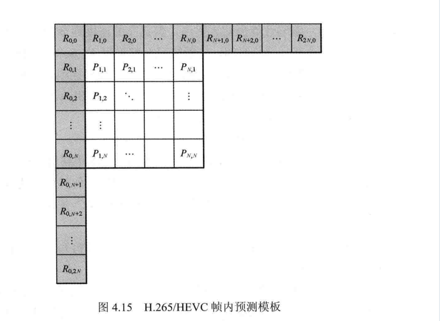
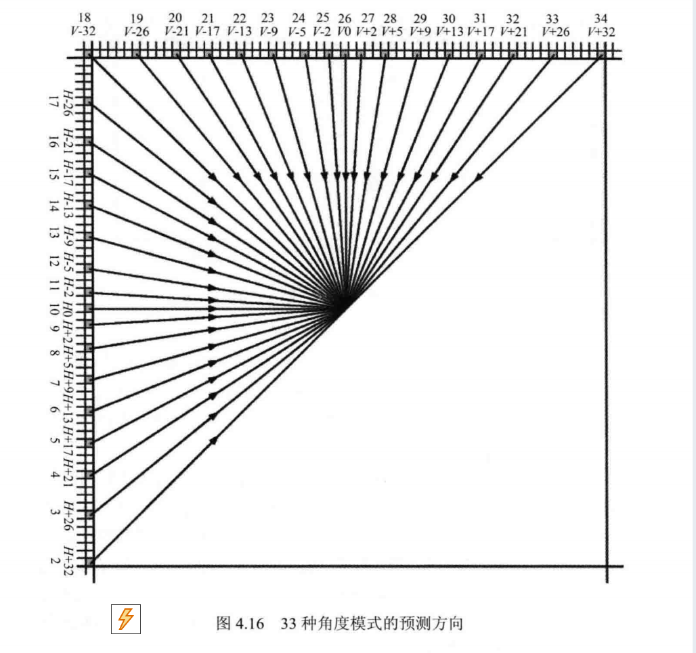

# H.265/HEVC帧内预测 阅读笔记

## 一、概述

帧内预测是H.265/HEVC预测编码的核心模块，核心目的是**去除单帧图像的空间冗余**——利用当前块周围已编码重建的参考像素，预测当前块像素值，仅对==“真实值与预测值的残差”进行后续编码，从而大幅减少数据量。其设计紧扣“适配图像纹理特性+提升预测精度”，是H.265压缩效率优于的关键技术之一。

## 二、核心参数与预测模式

### 1. 基础参数

- **预测对象**：变换单元（TU），一个预测单元（PU）可按四叉树划分为多个TU，且同一PU内所有TU共享一种预测模式（避免模式信息冗余，简化编码逻辑）。**注意PU决定预测模式**，但**预测单位是TU**
- **支持尺寸**：TU尺寸覆盖4×4~32×32（书本提及H.265新增更大尺寸，适配不同细节密度区域——小尺寸适配纹理复杂区域，大尺寸适配平坦区域）。
- **核心设计逻辑**：尺寸与图像区域特性匹配，减少预测误差，提升残差能量集中效果。

### 2. 亮度帧内预测模式

亮度模式是帧内预测的核心，设计依据“图像纹理方向多样性+人眼视觉特性”，分为三类：

- **Planar模式（模式0）**：
  - 原理：采用水平+垂直双线性滤波，通过相邻参考像素的渐变趋势，计算当前块像素的平滑过渡值（公式本质是加权平均，权重与像素距离相关）。
  - 适用场景：图像中像素值缓慢渐变的区域（如天空、墙面的渐变部分）。
- **DC模式（模式1）**：
  - 原理：当前块所有像素使用同一预测值，该值由周围参考像素的平均值计算得出（避免局部波动影响，追求整体平稳）。
  - 适用场景：大面积平坦区域（如纯白背景、纯色物体表面）。
- **角度模式（模式2~34，33种）**：
  - 原理：按纹理边缘方向划分角度，每个模式对应一个固定方向，通过参考像素沿该方向的延伸，预测当前块的纹理延续（角度划分覆盖水平、垂直、斜向等常见纹理方向，如模式10对应水平纹理，模式26对应垂直纹理）。
  - 适用场景：有明显边缘或纹理方向的区域（如文字边缘、物体轮廓、织物纹理）。
  

### 3. 色度帧内预测模式

- 模式类型：Planar（对应亮度模式0）、垂直（对应亮度26）、水平（对应亮度10）、DC（对应亮度1）、导出模式（直接复用对应亮度块的预测模式）。
- 设计原理：利用亮度与色度的空间相关性（同一区域亮度和色度的纹理方向通常一致），减少色度模式的编码开销，同时保证预测精度。

## 三、帧内预测过程

帧内预测按“参考像素准备→平滑滤波→计算预测值”三步执行，每一步都针对“提升预测精度、减少噪声干扰”设计：

### 1. 参考像素填充（解决参考像素可用性问题）

参考像素取自当前块左侧、上方及左下方的已重建像素，按以下三种情况处理：

- 情况1：所有参考像素均可用→直接使用重建值作为参考（保证预测的准确性）。
- 情况2：所有参考像素均不可用→用“2^bitDepth -1”填充（如8比特量化时用255，10比特用1023，避免无参考时的预测混乱）。
- 情况3：部分参考像素不可用→先遍历找到可用像素赋值给关键参考点R1，再按“左侧像素不可用则用下方紧邻像素，上方像素不可用则用左方紧邻像素”的规则补全（确保参考像素的连续性，避免断裂导致预测误差）。

### 2. 参考像素的平滑滤波（减少噪声与边缘干扰）

滤波的核心目的是消除参考像素中的噪声，避免噪声传递到预测块，不同场景下滤波规则不同：

- 无需滤波的情况：4×4 TU、DC模式（小尺寸块噪声影响小，DC模式本身追求平稳，滤波无意义）。
- 常规滤波适用场景：Planar模式（所有非4×4尺寸）、角度模式（按TU尺寸和模式方向筛选，如8×8仅对3个45度模式+Planar滤波）。
- 强滤波适用场景：仅32×32 TU（大尺寸块对噪声更敏感，强滤波能更好地平滑渐变）。
- 滤波方式：
  - 常规滤波：采用简单加权平均，平衡相邻参考像素差异；
  - 强滤波：针对32×32 TU的特定模式，增强平滑效果，适配大尺寸平坦区域。

### 3. 计算各模式下的像素预测值

- 核心逻辑：根据预测模式的特性，将参考像素的信息“映射”到当前块。
  - Planar模式：通过水平和垂直方向的线性插值，计算每个像素的渐变值；
  - DC模式：直接使用参考像素的平均值填充整个块；
  - 角度模式：沿对应角度方向，将参考像素的数值复制或插值到当前块对应位置（如水平模式直接沿用左侧参考像素的水平分布）。

### 4. 那种模式好

预测模式选择时，应考虑以下 factors：

1. 失真值D(残差小)
2. 编码所需bit数

率失真优化计算公式：J=D+aR

### 5.预测模式编码细节

根据相邻块预测模式相似概率较大，因此可以不用独立编码，H265建立了一个candmodelist 根据当前块左上的预测模式，设置candmodelist，当前块预测编码只用数组中的位置就行。

## 四、帧内预测的核心优势

1. **模式多样性适配复杂纹理**：35种亮度模式覆盖几乎所有自然图像的纹理方向，相比H.264的9种帧内模式，能更精准匹配图像细节，预测误差更小。
2. **尺寸灵活性平衡效率与精度**：4×4~32×32的TU尺寸，小尺寸适配细节密集区域（如文字、纹理），大尺寸适配平坦区域（如背景），避免“大尺寸块预测细节失真”或“小尺寸块编码开销过大”的问题。
3. **滤波机制针对性降噪**：根据TU尺寸、预测模式动态选择是否滤波，既减少噪声对预测的干扰，又避免过度滤波导致的细节丢失。
4. **色度与亮度关联设计**：色度导出模式复用亮度预测信息，减少色度模式的编码比特数，同时保证色度与亮度的空间一致性。

## 五、核心目的总结

1. **去除空间冗余**：利用图像中相邻像素的相关性（平坦区域像素相近、纹理区域方向一致），用参考像素预测当前块，大幅减少需编码的数据量（仅传输残差而非原始像素）。
2. **适配不同图像区域特性**：通过多模式、多尺寸设计，覆盖平坦、渐变、纹理边缘等各类图像区域，确保在不同场景下都能获得高精度预测。
3. **为后续编码模块铺垫**：精准的预测能让残差数据的能量更集中（高频成分少、低频成分多），后续的变换编码、量化编码能更高效地压缩残差，进一步提升整体压缩效率。
