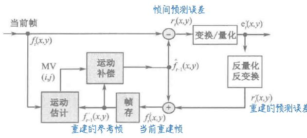
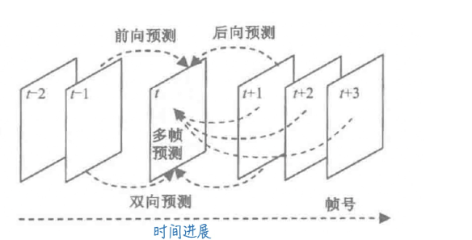
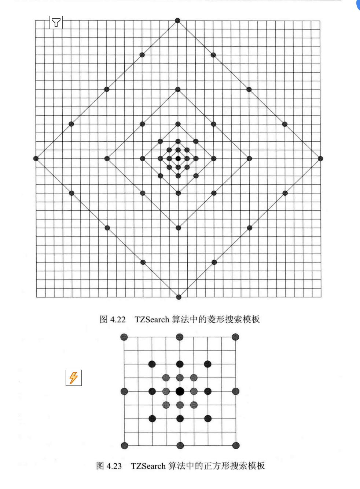
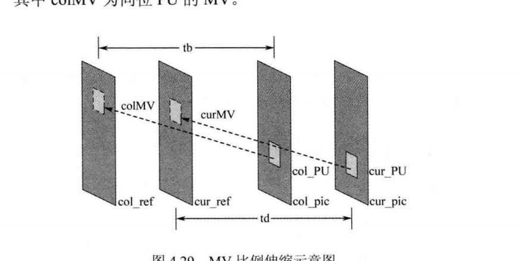

# 帧间预测阅读笔记

## 一、概述

帧间预测是H.265/HEVC时域冗余去除的核心技术，通过**利用相邻帧的运动相关性**，预测当前帧块的像素值，仅对“预测残差+运动信息”编码，实现时域数据量的大幅压缩。其设计围绕“运动精准捕捉、编码开销最小化、预测精度最大化”展开，是视频压缩效率提升的关键环节。

## 二、基本单元与预测对象

### 1. 编码单元（CU）与预测单元（PU）

- **原理**：帧间预测的基本单元是编码单元（CU），支持64×64、32×32、16×16、8×8等尺寸；若需更精细预测，CU可进一步划分为预测单元（PU），PU支持方形（如16×16）、矩形（如8×16、16×8）及不对称划分，适配运动物体的不规则形状。
- **优势**：灵活的块划分能精准匹配运动物体的边界，避免“大块预测导致运动边缘失真”或“小块预测导致编码开销过大”的问题。
- **目的**：为不同尺寸、形状的运动区域提供适配的预测粒度，平衡预测精度与编码复杂度。
  
### 2. 预测对象：运动物体

- **原理**：帧间预测针对图像序列中的运动物体，通过“在参考帧中寻找与当前块最相似的区域”实现预测。运动物体的不规则性（如非刚体运动、遮挡）是预测难点，需通过精细的运动估计解决。
- **优势**：聚焦运动区域，避免对静态背景的冗余编码；像素级运动搜索虽计算量大，但能显著降低码率。
- **目的**：利用时域相关性（相邻帧同一物体的位置/纹理相似性），去除运动物体的时域冗余。

## 三、预测方式：多维度覆盖运动场景

### 1. 单向预测（前向/后向预测）

- **原理**：仅使用**一个参考帧**（前向参考前一帧，后向参考后一帧），通过运动矢量找到参考块，直接作为当前块的预测值。
- **优势**：编码逻辑简单，适配“单向运动”场景（如匀速前进的汽车）。
- **目的**：在运动方向明确的场景下，快速完成预测，减少编码延迟。

### 2. 双向预测（前后向联合）

- **原理**：同时使用**前向和后向参考帧**，对两个参考块进行加权（权值由预测公式确定），得到当前块的预测值。
- **优势**：适配“复杂运动”场景（如双向运动、遮挡区域），预测精度高于单向预测。
- **目的**：解决单向预测无法覆盖的“运动模糊、遮挡”问题，提升残差压缩效率。

### 3. 多参考帧预测（最多15帧）

- **原理**：从**多个历史参考帧**中选择最优帧，结合单向/双向模式进行预测。
- **优势**：适配“周期性运动”场景（如反复摆动的钟摆），通过历史帧的相似性进一步降低残差。
- **目的**：在运动具有周期性的场景下，最大化利用时域冗余，减少码率。

## 四、编码核心逻辑：运动估计与补偿

### 1. 运动估计（ME）：寻找最优参考块

- **原理**：将当前块划分为小区域，在参考帧中搜索“像素误差最小”的匹配块，计算运动矢量（MVD，包含水平和垂直分量）。搜索准则包括**均方误差（MSE）**（像素差异的平方和）和**绝对误差（SAD）**（像素差异的绝对值和），并采用快速搜索算法（如三步搜索、菱形搜索）平衡精度与速度。
- **亚像素精度**：因两帧间运动未必是整像素位移，需对参考帧进行**1/2、1/4或1/8像素插值**（如双线性插值），提升运动估计精度。
- **优势**：精准捕捉运动细节，减少预测残差；快速算法降低计算复杂度；亚像素精度进一步缩小残差。
- **目的**：得到与当前块最匹配的参考块，为运动补偿提供准确的运动信息。

### 2. 运动补偿（MC）：生成预测块

- **原理**：根据运动矢量，从参考帧中提取匹配块，经过运动补偿（如插值、缩放）后作为当前块的**预测块**；当前块与预测块的差值即为**残差**，后续仅对残差编码。
- **编码思想**：当前帧 = 重建的当前帧预测误差 + 重建的参考帧（即“残差+补偿后参考块”）。
- **优势**：将时域冗余转化为“运动矢量+残差”，大幅降低数据量；残差的能量集中性强，后续变换/量化编码效率更高。
- **目的**：去除时域冗余，仅传输“运动信息+残差”，实现码率压缩。

## 五、运动信息的高效编码

### 1. 运动矢量预测（MVP）

- **原理**：利用**空间相邻块**（如左、上、右上方块）或**时间相邻帧**的运动矢量，对当前块的运动矢量进行预测，仅编码“预测值与实际值的差值（MVD）”。空间域采用**中值预测**（取相邻块运动矢量的中值），时间域采用前一帧对应块的运动矢量。
- **优势**：利用运动的“空间连续性”（同一区域运动趋势一致）和“时间连续性”（相邻帧运动相似），大幅减少运动矢量的编码比特数。
- **目的**：降低运动信息的码率开销，提升编码效率。

### 2. 运动参数编码：多维度压缩

- **编码内容**：运动矢量差值（MVD）、参考帧索引（选择的参考帧编号）、预测方向标记（前向/后向/双向）。
- **原理**：对这些参数进行**熵编码**（如CAVLC、CABAC），利用参数的统计特性（如MVD多为小值、参考帧索引集中在最近几帧）减少比特数。
- **优势**：高效压缩运动相关的语法元素，避免冗余传输。
- **目的**：最小化运动信息的码率，确保帧间预测的整体压缩效率。

## 六、帧间预测模式：场景化适配

### 1. 帧间模式（Inter mode）

- **原理**：直接编码运动参数（MVD、参考帧索引、预测方向），解码器根据这些参数完成运动补偿。
- **优势**：适配“运动复杂、无相邻块参考”的场景，预测精度可控。
- **目的**：在运动不规则区域，保证预测精度的同时，灵活编码运动信息。

### 2. 合并模式（Merge mode）

- **原理**：不直接编码运动参数，而是传输“相邻块的索引”，解码器根据索引对应的相邻块运动信息，恢复当前块的运动参数。
- **优势**：编码开销极小（仅需传输索引），适配“运动一致的区域”（如静态背景、大面积相同运动的物体）。
- **目的**：在运动规律的区域，以最小码率完成帧间预测。

### 3. 跳过模式（Skip mode）

- **原理**：无残差传输，仅传输运动信息（表示“当前块与参考块完全一致”），解码器直接使用参考块作为当前块的重建值。
- **优势**：码率开销趋近于0，适配“静态区域或运动完全一致”的场景（如视频中的静止背景）。
- **目的**：在无运动或运动完全冗余的区域，实现极致码率压缩。

### 4. 模式选择：率失真优化（R-D Optimization）

- **原理**：对每种候选模式（Inter、Merge、Skip等），计算“码率（编码该模式所需的比特数）”和“失真（当前块与预测块的像素差异）”，选择**R-D代价最小**的模式。
- **优势**：在“码率-画质”之间找到最优平衡，确保整体编码性能。
- **目的**：为每个块选择最适合的帧间模式，最大化压缩效率与画质的平衡。

## 七、核心优势与目的总结

### 1. 核心优势

- **时域冗余去除彻底**：通过运动估计与补偿，将相邻帧的相关性转化为“运动信息+残差”，相比帧内预测，可额外减少50%以上码率。
- **场景适配性强**：多预测方式（单向/双向/多参考帧）、多模式（Inter/Merge/Skip）、灵活块划分，覆盖从静态到复杂运动的所有场景。
- **编码开销低**：运动矢量预测、熵编码、合并模式等技术，大幅降低运动信息的码率开销。

### 2. 核心目的

- **去除时域冗余**：利用相邻帧的运动相关性，减少视频序列的时域数据量。
- **平衡精度与复杂度**：通过灵活的块划分、模式选择、快速算法，在预测精度、编码速度、码率之间找到最优解。
- **支撑后续编码模块**：精准的预测使残差能量高度集中，为变换、量化、熵编码的高效压缩奠定基础。
