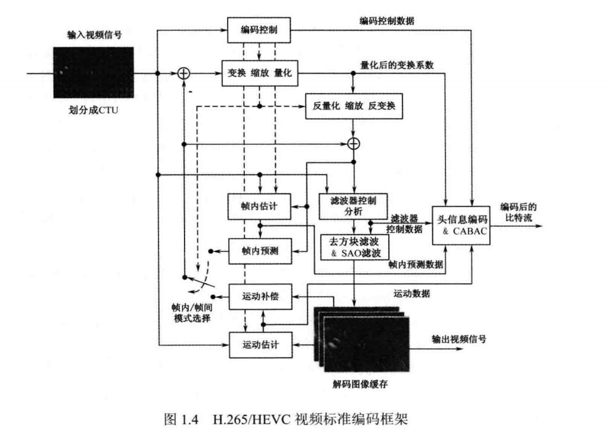

# H.265/HEVC编码流程概述（基于编码框架图+第一章绪论）

## 一、综述

输入视频信号首先被划分为**编码树单元（CTU）**，这是H.265编码的基本处理单元，尺寸可自适应选择（16×16、32×32或64×64）。

随后，**编码控制模块**根据视频特征（分辨率、帧率、内容复杂度等）输出编码控制数据，动态调整后续模块的核心参数（如量化参数QP、预测模式策略、滤波强度等），实现“码率-画质-复杂度”的全局平衡。

在**预测环节**，系统同时开展**帧内预测**和**帧间预测**：

- 帧内预测通过“帧内估计”分析当前CTU的纹理方向，从35种亮度模式和5种色度模式中选择最优模式，利用当前帧已编码的相邻像素生成帧内预测块；
- 帧间预测通过“运动估计”在**解码图像缓存**的参考帧中搜索匹配块，计算运动矢量（MV），再通过“运动补偿”提取匹配块生成帧间预测块。
之后通过“帧内/帧间模式选择”模块，基于率失真优化（RDO）选择代价最小的预测模式，得到最终预测块。

预测块与原始CTU块相减得到**残差**，残差进入**变换、缩放、量化模块**：先通过DCT（帧间残差）或DST（帧内残差）将空间域残差转换为频域系数，经缩放调整动态范围后，由编码控制模块指定的QP决定量化步长，对频域系数进行有损压缩，丢弃人眼不敏感的高频信息。

量化后的系数一方面流向**头信息编码&CABAC模块**准备熵编码；另一方面进入**反量化、缩放、反变换模块**，执行与解码端完全一致的逆操作，将量化系数重建为残差，与“预测块”相加生成**重建块**。

重建块进入**环路滤波环节**：先由“滤波器控制分析”模块根据失真程度动态调整滤波强度，再通过“去方块滤波（DBF）”消除块边界不连续的“方块效应”，通过“SAO滤波”修正块内亮度/色度失真，最终输出高质量的重建图像。

处理后的重建图像存入**解码图像缓存**，作为后续帧帧间预测的参考帧，同时也为帧内预测提供相邻已编码像素的参考，形成编码环路的闭环。

最后，所有编码过程中产生的语法元素（预测模式、运动矢量、量化参数、滤波控制信息等）与量化后的变换系数一同送入**头信息编码&CABAC模块**，通过上下文自适应二进制算术编码（CABAC）消除统计冗余，最终输出紧凑的**编码后比特流**。

整个流程中，“反量化-缩放-反变换”和“解码图像缓存”的设计确保了编码器与解码器的参考帧完全一致，避免误差累积；“环路滤波”提升了重建图像质量，间接降低后续帧的编码码率；“CABAC熵编码”则实现了语法元素的极致无损压缩，最终使H.265在相同画质下比前代标准节约50%码率，成为超高清视频编码的核心技术。

## 二、模块级解析：从输入到比特流的全流程

### 1. 输入与CTU划分

- **简要描述**：将输入视频信号划分为**编码树单元（CTU）**，CTU是H.265编码的基本单元，支持16×16、32×32、64×64等灵活尺寸。
- **优势**：适配不同分辨率（从标清到8K）和图像内容（细节密集区用小CTU，平坦区用大CTU），为后续块划分提供基础。
- **目的**：将连续视频分解为“可独立编码”的单元，便于并行处理和自适应编码策略的实施。

### 2. 编码控制

- **简要描述**：作为编码流程的“控制中枢”，协调帧内/帧间模式选择、量化参数（QP）、滤波强度等全局编码策略。
- **优势**：根据应用场景（如实时直播、离线存储）动态调整参数，平衡**码率、画质、编码复杂度**三者的关系。
- **目的**：全局优化编码逻辑，确保在不同场景下均能实现“最优压缩效率”。

### 3. 预测模块（帧内+帧间冗余去除）

#### （1）帧内预测（空间冗余去除）

- **简要描述**：利用当前帧**已编码像素**预测当前块，支持35种亮度模式（适配纹理方向）和5种色度模式。
- **优势**：精准匹配图像纹理（如边缘、渐变区域），预测残差小，减少空间冗余效果显著。
- **目的**：去除单帧内的空间冗余，降低残差数据量，为后续压缩环节减负。

#### （2）运动估计与补偿（时域冗余去除）

- **简要描述**：通过在**参考帧**中寻找“与当前块最相似的匹配块”，实现帧间预测；运动补偿则根据运动矢量（MV）提取匹配块，生成预测块。
- **优势**：精准捕捉不同运动场景（如匀速、变速、多方向运动），适配从静态到复杂运动的所有视频内容。
- **目的**：利用帧间相关性，去除时域冗余，大幅减少帧间数据量。

#### （3）帧内/帧间模式选择

- **简要描述**：为每个编码块选择“帧内预测”或“帧间预测”的最优模式（通过率失真优化RDO判断）。
- **优势**：为不同区域（如静态背景选帧内，运动物体选帧间）定制化选择冗余去除方式，最大化压缩效率。
- **目的**：在“空间冗余去除”和“时域冗余去除”之间找到最优解，确保每个块的预测效果最佳。

### 4. 变换、缩放、量化

- **简要描述**：对预测残差进行**变换**（DCT/DST，将空间冗余转为频域能量集中）、**缩放**（调整动态范围）、**量化**（有损压缩，丢弃人眼不敏感的高频冗余）。
- **优势**：变换使残差能量集中在低频，量化针对性丢弃高频，初步实现残差数据的高效压缩。
- **目的**：将残差的“空间/时域冗余”进一步转化为“频域冗余”，并通过量化减少数据量，为熵编码提供“高冗余度输入”。

### 5. 反量化、缩放、反变换

- **简要描述**：在编码端重建“用于后续预测的参考帧”（与解码器的重建流程一致）。
- **优势**：确保编码器和解码器的“参考帧完全一致”，避免编码环路的误差累积。
- **目的**：生成“无偏差”的重建图像，为后续帧的预测提供准确参考，维持编码环路的闭环正确性。

### 6. 环路滤波（失真修复）

#### （1）去方块滤波（DBF）与SAO滤波

- **简要描述**：去方块滤波消除块编码导致的“块边界不连续”；样点自适应补偿（SAO）修正块内失真（如亮度偏移、边缘模糊）。
- **优势**：大幅提升重建图像的主观画质（消除“马赛克”感、修复偏色），同时为后续帧提供更高质量的参考。
- **目的**：减少编码失真，提升参考帧质量，间接降低后续帧的编码码率（高质量参考帧使预测更准确）。

#### （2）滤波器控制分析

- **简要描述**：动态调整滤波强度（如根据块边界失真程度选择普通/强滤波）。
- **优势**：自适应适配不同失真场景，平衡画质提升与计算复杂度。
- **目的**：优化滤波效果，在“失真修复”和“编码效率”之间找到最优平衡。

### 7. 头信息编码&CABAC（熵编码）

- **简要描述**：对所有编码语法元素（预测模式、运动矢量、量化参数、滤波控制等）进行**上下文自适应二进制算术编码（CABAC）**，去除统计冗余。
- **优势**：编码效率接近“熵的理论极限”，对“概率分布不均”的语法元素（如残差中大量的0）压缩效果极佳。
- **目的**：对所有编码信息进行“无损压缩”，最终输出紧凑的比特流，实现码率的极致优化。

## 三、核心价值总结

H.265的编码流程通过“预测（空/时域冗余）→ 变换量化（残差压缩）→ 环路滤波（失真修复）→ 熵编码（统计冗余）”，实现了“高压缩率、高画质、灵活适配”的目标.
