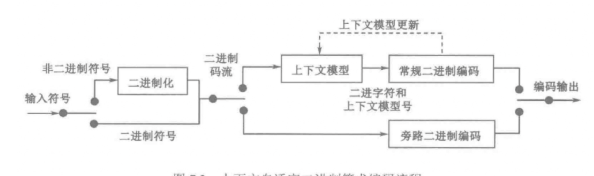

# 熵编码阅读笔记（基于图片+书本第八章）

## 一、概述

熵编码是H.265/HEVC“无损压缩”的关键环节，目标是**消除码流的统计冗余**（如符号出现概率不均的冗余），通过“概率匹配编码长度”实现极致压缩。其核心是**算术编码**的延伸，尤其是**上下文自适应二进制算术编码（CABAC）**，是H.265压缩效率优于前代的核心技术之一。

## 二、算术编码：概率区间的“逐符号划分”

算术编码是熵编码的理论基础，通过“将符号序列映射到[0,1)区间的子区间”实现压缩，核心是**概率空间的不断细分**。

### （一）分类与核心原理

- **固定编码**：无需定义概率模型，适合无概率统计的信源；
- **自适应编码**：编码过程中动态调整概率模型，适配信源统计特性变化。

**核心逻辑**：每个符号对应一个不重叠的子区间，总概率和为1。随着符号序列输入，不断划分对应概率子区间，最终子区间内的任意二进制数即为编码结果（如图7.1“aabc…”的子分过程，每次划分缩小区间，最终区间内的数值就是编码输出）。

### （二）一般算术编码实例（以“a,b,c,d”信源为例，图片说明）

1. 信源符号：\( a,b,c,d \)，假设初始概率分布对应[0,1)的区间划分；
2. 编码序列“aabc…”：
   - 第一步编码\( a \)：选择\( a \)对应的区间（如[0.3,0.7)）；
   - 第二步编码\( a \)：在\( a \)的区间内，再划分\( a \)的子区间（如[0.35,0.6)）；
   - 第三步编码\( b \)：在当前区间内划分\( b \)的子区间（如[0.37,0.45)）；
   - 最终取区间内任意值（如0.1010011）作为编码结果。

**优势**：符号概率越接近，编码效率越高（优于Huffman编码在等概率符号时的表现）。
**目的**：通过“区间细分”实现符号序列的紧凑表示，消除统计冗余。

### （三）自适应算术编码（应对未知概率信源，图片说明）

1. 原理：编码前不预设概率模型，初始时所有符号概率均等（区间均分），编码过程中动态调整概率（如符号\( b \)出现后，其概率权重增加）。
2. 实例（“b,c,b,b”序列）：
   - 初始概率：\( a,b,c \)各占1/3；
   - 编码第一个\( b \)后，概率更新为\( a:1/4, b:2/4, c:1/4 \)；
   - 编码\( c \)后，概率更新为\( a:1/5, b:2/5, c:2/5 \)；
   - 后续符号同理动态调整，确保概率模型始终适配当前信源。

**优势**：无需提前统计信源概率，适配“统计特性动态变化”的信源（如视频编码中残差、运动矢量的概率分布）。
**目的**：在无先验概率的场景下，仍能高效压缩，提升编码的通用性。

### （四）二进制算术编码（CABAC的基础，图片重点）

是算术编码的“二进制特化版”，信源符号仅为0和1，进一步分为：

- **大概率符号（MPS）**：出现概率高的符号；
- **小概率符号（LPS）**：出现概率低的符号。
通过“区间划分+指针调整”编码，核心工具是**编码状态\( C \)**（编码端点，初始0）和**活动区间宽度\( A \)**（初始1），编码值为区间\( [c, c+A) \)内的最短二进制数。

**优势**：适配视频编码中“二进制语法元素多（如残差是否为0、模式标志等）”的特点，编码效率极高。
**目的**：为“二进制化的语法元素”提供高效压缩，是CABAC的核心支撑。

## 三、上下文自适应二进制算术编码（CABAC）：H.265的熵编码核心

CABAC是“二进制算术编码+上下文建模+自适应概率更新”的融合，是H.265实现高压缩率的关键。

### （一）核心特点（图片总结）

- 基于上下文的自适应：利用“相邻符号的统计相关性”建模，动态调整概率；
- 二进制化：将多进制语法元素（如残差幅度、模式索引）转为二进制序列；
- 高编码效率：尤其对“概率分布不均”的语法元素（如残差中大量的0），压缩率接近熵的理论极限。

### （二）编码流程（三步骤，图7.3）

1. **二进制化**：将多进制语法元素转为二进制序列，方法因元素类型而异（如表7.7）：
   - 一元码（Unary Code）：如“0”编码为“1”，“1”编码为“01”，“2”编码为“001”等，适配“小数值占比高”的元素（如残差幅度）；
   - 截断一元码（Truncated Unary Code）：对范围有限的数值，截断一元码的长度；
   - 哥伦布编码（Golomb Code）：如指数哥伦布编码，适配“几何分布”的数值（如运动矢量差值）。
2. **上下文建模**：根据“已编码符号的上下文（如相邻块的残差状态、模式信息）”选择概率模型，动态预测当前二进制符号的概率分布（MPS/LPS）。
3. **二进制算术编码**：对二进制序列进行算术编码，过程中动态更新概率模型（适配后续符号的统计特性）。

### （三）编码模式（适配不同概率分布，图片说明）

- **常规编码模式（Regular Coding Mode）**：算法复杂度高，但编码效率最高，适配“概率分布不均”的符号（如残差是否为0）；
- **旁路编码模式（Bypass Coding Mode）**：0和1等概率分布，算法复杂度低，适配“等概率”的符号（如某些语法标志位）。

### （四）上下文建模的细节（图片核心）

- **上下文提取**：根据“当前编码元素的类型+相邻已编码元素的状态”确定上下文模型索引（如残差编码时，参考左、上块的残差是否为0）；
- **模型初始化**：每个上下文模型有初始概率状态（适配常见统计特性）；
- **模型更新**：编码过程中，根据当前符号的实际概率（MPS/LPS是否出现）更新模型参数，确保后续编码的概率预测更准确。

### （五）优势与目的

- **优势**：
  - 压缩效率极致：结合上下文建模和自适应概率更新，编码效率接近熵的理论极限，比H.264的CAVLC高10%~20%；
  - 适配性强：二进制化支持多类语法元素，上下文建模适配视频信源的空间/时间相关性；
  - 硬件友好：流程模块化（二进制化、上下文、算术编码），适配并行加速。
- **目的**：对视频编码中所有语法元素（残差、运动信息、模式标志等）进行无损压缩，消除统计冗余，是H.265实现“低码率”的最后一环。

## 四、总结：熵编码的“双层次价值”

算术编码是理论基础，通过“概率区间细分”实现符号序列的紧凑表示；CABAC是工程优化，通过“二进制化+上下文建模+自适应算术编码”，针对性解决视频信源的统计冗余问题。两者协同，使H.265在保证画质的前提下，实现码率的极致压缩，成为支撑超高清视频传输与存储的核心技术之一。
