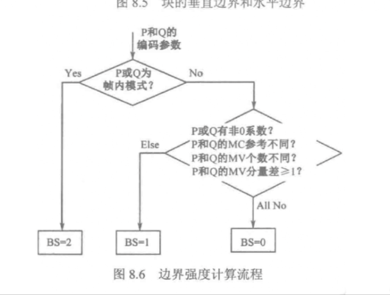
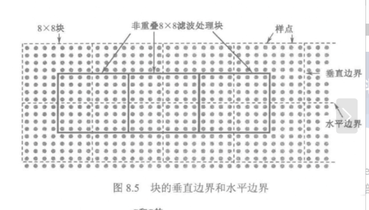

# H.265/HEVC环路滤波阅读笔记

## 一、环路滤波概述

### （一）核心目标

消除解码图像的**方块效应**（块边界不连续）、**亮度失真**、**色彩飘逸**，同时**提高编码效率**——高质量的重建图像可作为后续帧编码的参考帧，提升预测精度，进一步降低码率。

### （二）滤波种类

分为**环内滤波**（处理编解码环内数据）和**环外滤波**（处理环外数据）。环内滤波优势显著：

- 具备**自适应特性**，可根据图像内容动态调整滤波强度；
- 高质量的重建图像为后续帧提供更精准的预测参考，间接提升编码效率。

## 二、去方块滤波（DBF）：消除块边界不连续

### （一）方块效应产生原因

视频编码基于“块”（CU/PU/TU）进行变换、量化和运动补偿，导致**块边界处像素值不连续**（如变换量化误差、运动补偿的块错位），视觉上呈现“方块状”失真。

### （二）原理与流程

DBF通过修正块边界像素，使其更接近原始视频的连续过渡，核心流程如下：

1. **边界强度（BS）计算**：根据编码参数（如残差大小、运动补偿情况）判断边界强度（0~2），BS越大表示边界失真越严重，需更强滤波（图8.6为边界强度计算流程）。

2. **滤波决策**：根据阈值判断是否滤波，以及采用**普通滤波**还是**强滤波**（强滤波适用于残差大、失真明显的边界）。
3. **滤波对象与顺序**：针对**8×8块网格边缘的亮度和色度像素**（图8.5展示块的垂直/水平边界），按以下顺序执行：
   - 亮度分量的垂直边界 → 亮度分量的水平边界 → 色度分量的垂直边界 → 色度分量的水平边界；
   - 滤波与块位置无关，按固定顺序**并行处理**（slice内滤波完成后再处理边界）。

### （三）优势与目的

- **优势**：
  - 精准消除块边界失真，大幅提升主观画质（如消除“马赛克”感）；
  - 并行处理设计（按slice和边界顺序）适配硬件加速，兼顾画质与编码速度；
  - 自适应边界强度调整，在“强失真处强滤波、弱失真处弱滤波”，平衡画质与计算量。
- **目的**：消除块编码导致的边界不连续，使重建图像更接近原始视频的连续性，同时为后续帧的帧间/帧内预测提供更准确的参考，间接降低码率。

## 三、样点自适应补偿（SAO）：块内失真的精细补偿

### （一）原理

针对**块内所有样点**，根据像素特征分类，为同一类像素分配相同补偿值，使像素值向原始视频“回拉”，降低块内失真（如亮度偏移、边缘模糊）。

### （二）核心流程与模式（结合图片细节）

1. **输入输出**：
   - 输入：原始重建图像数据、去方块滤波后的重建图像；
   - 输出：SAO修正后的图像数据、SAO补偿数据（用于解码端重建）。
2. **区域划分**：以**CTU（编码树单元）** 为单位，多个CTU可共享SAO参数，减少编码开销。
3. **补偿模式**：
   - **EO模式（边缘补偿）**：对图像的“轮廓边缘”进行补偿，分类依据是当前样点值与相邻样点值的差距（如水平/垂直边缘的像素差异）。
   - **BO模式（带补偿）**：对样点值的“数值区间”分类，基于样点值大小分组补偿（如将亮度值划分为多个区间，每个区间分配补偿值）。
4. **参数共享**：每个CTU有三种参数共享方式，减少SAO参数的编码开销：
   - 共享已编码左邻块的SAO（`sao_merge_left_flag`）；
   - 共享已编码上邻块的SAO（`sao_merge_up_flag`）；
   - 计算全新的SAO参数。
5. **语法元素**：
   - `SaoTypeIdx`：标识CTB区域的滤波类型（0=未使用SAO，1=带补偿BO，2=边缘补偿EO）；
   - `SaoBandPosition`：若为BO模式，标识补偿值所在起始带的位置。

### （三）优势与目的

- **优势**：
  - 块内失真补偿更精细（相比仅处理边界的DBF，SAO覆盖块内所有像素）；
  - 分类补偿适配不同失真类型（边缘失真用EO，数值偏移用BO），主观画质提升明显；
  - 参数共享机制大幅减少SAO的编码开销，避免因补偿引入新冗余。
- **目的**：修正块内的亮度/色度失真（如块内偏色、边缘模糊），进一步提升重建图像质量；同时通过精准补偿，让后续帧的预测更准确，形成“画质提升→预测更准→码率更低”的正向循环。

## 四、环路滤波的整体优势与目的总结

### （一）核心优势

- **画质与码率的双提升**：DBF消除块边界失真，SAO修正块内失真，两者结合使重建图像接近原始视频；高质量参考帧又能提升后续预测精度，间接降低码率。
- **自适应与灵活性**：DBF的边界强度自适应、SAO的模式与参数共享，使滤波过程能适配不同内容（平坦区域弱滤波、纹理区域强滤波），平衡画质与计算复杂度。
- **硬件友好性**：DBF的并行处理、SAO的CTU级划分，均适配硬件加速架构，支持实时高清/超高清编码。

### （二）核心目的

- 消除编码过程（变换、量化、块预测）引入的各类失真（块边界、块内、亮度/色度偏移），提升主观画质；
- 为后续帧提供高质量参考帧，提升预测编码效率，最终实现“低码率、高画质”的视频压缩目标。

通过DBF和SAO的协同作用，H.265/HEVC的环路滤波成为“失真消除→效率提升”的关键环节，是其实现超高清视频高效编码的核心技术之一。
