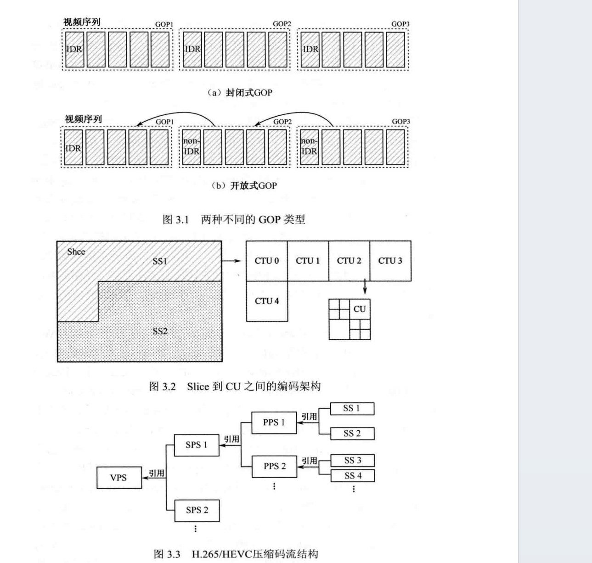
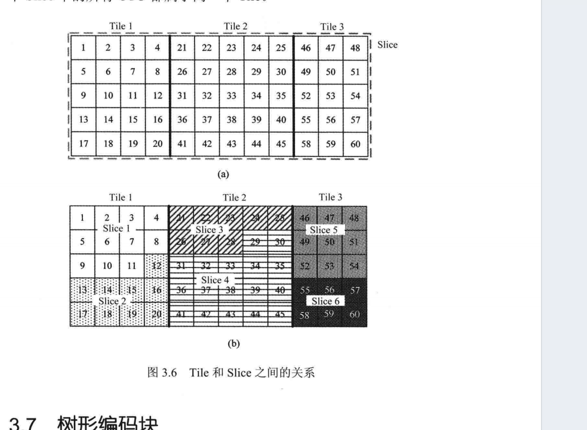

# H.265/HEVC编码结构阅读笔记-第三章-编码结构

## 概述

H.265/HEVC通过“参数集+分层划分（GOP→Slice/Tile→CTU→CU/PU/TU）”的编码结构设计，结合灵活的块划分与独立编码机制，实现了压缩效率提升、并行处理支持、容错性增强等核心目标，其结构设计既延续了混合编码框架的优势，又针对高清/超高清视频需求进行了针对性优化。

## 一、编码结构整体框架

### 1. 核心设计逻辑

H.265/HEVC的编码结构围绕“分层解耦、信息共享、灵活适配”三大原则，将视频编码划分为“参数集层-图像组层-片/块层-树形单元层”四级结构，既保证了编解码的统一性，又为不同应用场景（如实时传输、存储、超高清播放）提供了扩展性。

### 2. 参数集体系

参数集是H.265/HEVC的核心信息共享模块，用于存储不同层级的公共配置，避免重复编码，提升效率。

- **视频参数集（VPS）**
  - 原理：存储多个子层/操作点的共享信息（如档次、级别、HRD参数），适配可分级编码、多视点编码等扩展场景。
  - 优势：解决H.264/AVC中SEI信息重复传输的问题，减少延迟，简化多层视频编码的语法设计。
  - 目的：为多层视频提供统一的配置入口，支持不同终端的灵活访问（如低带宽终端访问低码率子层）。
- **序列参数集（SPS）**
  - 原理：存储一个编码视频序列（CVS）的公共参数，包括图像格式（分辨率、量化深度、色度格式）、编码块尺寸限制、参考图像设置等。
  - 关联图片内容：SPS中的`chroma_format_idc`决定了色度采样格式（如4:2:0），与图片中CU/PU的色度块划分直接相关；`log2_min_luma_coding_block_size`定义了CTU的最小尺寸。
  - 优势：集中管理序列级固定参数，减少单帧编码的冗余信息。
  - 目的：保证同一序列内所有图像的编解码一致性，为后续块划分提供基础配置。
- **图像参数集（PPS）**
  - 原理：存储单幅图像的公共参数，包括初始量化参数（QP）、Tile划分模式、去方块滤波控制、加权预测开关等，可覆盖SPS中的部分参数。
  - 关联图片内容：PPS中的`tiles_enabled_flag`控制是否启用Tile划分，与图片中Tile的“矩形区域划分、并行处理”目的一致；`init_qp_minus26`为CU的量化提供初始基准。
  - 优势：支持单幅图像的个性化配置（如复杂图像启用更强滤波），提升编码灵活性。
  - 目的：适配单幅图像的内容特性，平衡编码质量与效率。

## 二、图像组（GOP）

### 1. 原理

- 组成：一组连续的视频帧序列，场景相似性高，分为封闭式GOP（以IDR图像开始，GOP间独立编解码）和开放式GOP（后续GOP可参考前一GOP图像）。
- 编码关联：GOP内的帧通过I/P/B帧组合实现时域冗余去除，I帧采用帧内预测（依赖同帧已编码块），P/B帧采用帧间预测（依赖GOP内已编码帧）。

### 2. 优势

- 封闭式GOP：支持随机访问（如视频快进/快退），错误恢复能力强（单个GOP出错不影响其他）。
- 开放式GOP：跨GOP参考提升压缩效率，尤其适用于静态场景占比高的视频（如监控视频）。

### 3. 目的

- 实现时域冗余压缩：利用帧间相关性减少码率。
- 支持灵活的视频操作：随机访问、错误恢复，适配不同应用场景（如直播、点播）。

## 三、片（Slice）与条（Slice Segment, SS）

### 1. 原理

- 组成：
  - Slice：由一个或多个SS组成，每个SS包含整数个CTU，SS分为独立SS（自身语法元素完整）和依赖SS（共享独立SS的RPS、SAO等信息）。
  - 编码类型：I条（所有CU帧内预测）、P条（帧内/单向帧间预测）、B条（帧内/单向/双向帧间预测）。
- 划分规则：Slice与Tile划分相互独立，要么Slice包含Tile，要么Tile包含Slice，保证编码独立性。

### 2. 优势

- 独立编码：Slice间无预测依赖，一个Slice出错不扩散至其他Slice，提升容错性。
- 灵活拆分：SS可按需拆分CTU组，适配网络传输的分组大小（如小SS适配窄带宽传输）。

### 3. 目的

- 增强抗误码能力：解决网络传输中数据丢失导致的解码失效问题，因为两两之间没什么关系。
- 支持并行编码：多个Slice可同时编码，提升编解码速度。

## 四、片（Tile）

### 1. 原理

- 组成：矩形区域，包含整数个CTU，按光栅扫描顺序编码，Tile边界为物理划分，不依赖其他Tile的编码信息。
- 关键特性：Tile的行列数可灵活配置（通过PPS的`num_tile_columns_minus1`/`num_tile_rows_minus1`），尺寸均匀或非均匀划分均可。

### 2. 优势

- 并行处理效率更高：相比Slice的条带状划分，Tile的矩形结构可实现CTU级并行，减少线程同步开销。
- 减少缓存占用：Tile的局部性更强，解码时无需缓存整帧数据，仅需缓存当前Tile的参考像素。
- 支持感兴趣区域（ROI）编码：可对重要Tile（如画面主体）采用更高编码质量，次要Tile降低质量，平衡码率与主观体验。

### 3. 目的

- 适配硬件并行架构：满足超高清视频（4K/8K）的实时编解码需求。
- 优化存储与传输效率：减少行缓存容量，降低头信息开销（相比Slice）。

## 五、树形编码块单元（CTU→CU→PU→TU）

这是H.265/HEVC最核心的块划分机制，通过四叉树分解实现“按需适配”，是压缩效率提升的关键（图片详细内容+书籍第三章扩展）。

### 1. 编码树单元（CTU）与编码树块（CTB）

- 原理：
  - 组成：CTU是分块的根节点，包含一个亮度CTB和两个色度CTB，关联相应语法元素。
  - 尺寸：16×16、32×32、64×64（由SPS的`log2_max_luma_coding_block_size`和`log2_min_luma_coding_block_size`定义）。
- 优势：支持大尺寸块（64×64），适配超高清视频中的平坦区域（如天空、墙面），减少编码比特数；小尺寸块适配细节丰富区域，保证编码精度。
- 目的：作为块划分的基础单元，平衡压缩效率与编码复杂度。

### 2. 编码单元（CU）与编码块（CB）

- 原理：
  - 组成：由CTB通过四叉树分解得到，最多4层分解，尺寸范围8×8~64×64（纹理区域分块小，平滑区域分块大）。
  - 核心作用：CU决定其包含的PU的预测模式（帧内/帧间）和TU的变换方式。
- 关联书籍内容：CU的划分由`split_flag`控制，当`split_flag=1`时继续分解为4个小CU，直至达到最小尺寸或适配内容特性。
- 优势：自适应内容的块尺寸选择，避免H.264/AVC宏块（16×16）的固定尺寸限制，减少冗余。
- 目的：为预测和变换提供灵活的单元粒度，最大化去除空间冗余。

### 3. 预测单元（PU）与预测块（PB）

- 原理：
  - 组成：由CB划分得到，是预测编码的基本单元，预测方式分为帧内预测（利用同帧已编码块）和帧间预测（利用已编码帧）。
  - 尺寸与划分模式：
    - 帧内预测：支持2N×2N和N×N划分，CU>8×8时PU与CU同尺寸；CU=8×8时可划分为4个4×4 PU。
    - 帧间预测：支持9种划分（4种对称+4种非对称+跳过模式），最小尺寸4×4；跳过模式（skip）仅支持2N×2N，禁止4×4。
- 优势：
  - 帧内预测：多划分模式适配复杂纹理（如斜线纹理用N×N划分）。
  - 帧间预测：非对称划分（如2N×nU）适配物体边缘的非规则运动，提升预测精度。
- 目的：去除空间（帧内）和时域（帧间）冗余，减少预测残差的数据量。

### 4. 变换单元（TU）与变换块（TB）

- 原理：
  - 组成：由CU通过四叉树分解得到，与PB相互独立（划分无关联）。
  - 尺寸：4×4、8×8、16×16、32×32、64×64（64×64需分解为4个32×32块，因DCT变换最大尺寸为32×32）。
- 意义：TU的变换类型根据预测模式自适应（帧内预测残差可用DST，帧间可用DCT），进一步提升能量集中效果。
- 优势：
  - 块尺寸与残差特性匹配：平坦区域用大TU（能量集中在低频），细节区域用小TU（保留高频细节）。
  - 独立于PU划分：避免预测模式对变换效率的限制（如PU为非对称划分时，TU可按残差分布独立划分）。
- 目的：将残差数据从时域转换到频域，集中能量，便于后续量化和熵编码压缩。

### 注意

后面也会提到 虽然一个PU里面预测模式相同，但开展帧内预测是以TU进行参考和预测的！。

## 六、整体优势与核心目的总结

### 1. 核心优势

- 压缩效率显著提升：通过大尺寸CTU、灵活的CU/PU/TU划分、参数集信息共享，相比H.264/AVC节约50%左右码率。
- 并行处理能力强：Tile划分、Slice独立编码支持多线程并行，适配超高清视频实时编解码。
- 容错性与扩展性好：Slice/SS的独立编码机制提升抗误码能力，VPS/SPS/PPS的分层设计支持可分级、多视点等扩展应用。
- 适配性广：支持从QCIF到8K的分辨率、不同色度格式（4:2:0/4:2:2/4:4:4）和量化深度（8~14bit）。

### 2. 核心目的

- 高效去除冗余：通过时域（GOP、帧间预测）和空间（帧内预测、块变换）冗余去除，最小化码率。
- 支持灵活应用：满足实时传输、存储、随机访问、超高清播放等不同场景需求。
- 降低编解码复杂度：通过信息共享（参数集）和模块化设计，平衡编码质量与硬件实现成本。
