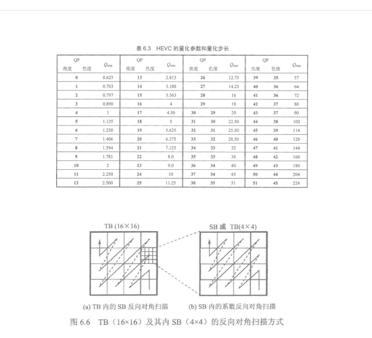
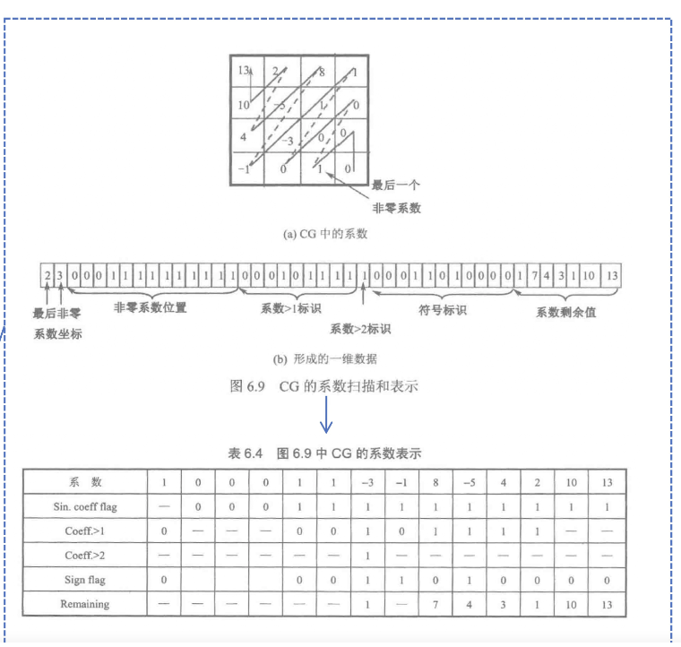

# 第五章 + 第六章： 变换编码与量化

---

# 第一部分：变换编码（第 5 章）

变换编码的总体目标：
**将空间域残差变成频域系数，使能量集中，从而在量化与熵编码阶段显著节省比特。**

---

## 1. 变换方式（DCT / DST / MTS）

### （1）DCT（离散余弦变换）

* HEVC 的主力变换工具
* 将图像残差分解到一组频率基底上
* 大部分能量集中到低频，利于后续量化
* HEVC 中采用 **整数 DCT**，避免浮点运算误差

**优点：**

* 能量集中高
* 计算可整数化，更适合硬件实现
* 与人眼视觉模型契合

---

### （2）DST（离散正弦变换）**

 DST尤其用于帧内 4×4 TU。

用途：

* 用于 **4×4 帧内 TU 的亮度残差**
* 针对帧内模式产生的强方向性结构更高效

**优点：**

* 比 DCT 在小块和尖锐边缘预测残差上效率更高
* 能进一步提升帧内编码性能数 %

---

### **（3）TU（Transform Unit）结构**

截图中“变换单元 TU”一节对应本小节内容。

TU 大小：
**4×4、8×8、16×16、32×32**

说明：

* TU 与 CU/PU 解耦
* CU 决定分块结构
* TU 决定残差如何变换
* 平坦区域用大 TU；纹理区域使用小 TU

**优点：**

* 避免对纹理复杂区域强行使用大块变换造成大的残差
* 灵活性更强 → 直接提升压缩率

---

# 第二部分：变换后系数的扫描（Scan）

---

## **1. TB（Transform Block）级扫描**

* 常见是 **之字形（zig-zag）扫描**
* 从低频到高频
* 低频通常非零系数多 → 扫描顺序把高频“全零区”放在序列后方，有利于熵编码

---

## **2. SB（4×4 Sub-block）级扫描**

截图右侧图示：

* 一个 16×16 的 TB 会依次扫描其内部 4×4 SB
* SB 内部仍采用之字形扫描

**目的：**

* 以“4×4 小组”为单位进行编码更有效
* 非零系数往往聚集在某些小块内

---

## **3. CG（Coefficient Group，系数组）扫描（重点）**

一个 CG = 一个 4×4 区块（16 个系数）

编码流程：

1. 判断 CG 是否有非零系数（significant_coeff_group_flag）
2. 若有，再进入该 CG 内部的逐系数编码
3. 通过 CG 提前跳过大量全零块 → 显著节省比特

**优点：**

* 用“组级别”的 0/1 判定取代传统的逐系数判断
* 大幅提升编码效率（尤其是高清、超高清场景）

---

# **第三部分：变换系数的表示**

HEVC 不直接写“系数的数值”，而是分多步编码：

---

## **1. significant_coeff_flag（是否非零）**

* 绝大多数高频系数是 0
* 因此此 flag 的概率高度偏向“0”，CABAC 编码极有效率

---

## **2. coeff_abs_level_greater1_flag**

* 表示 |coeff| > 1 吗
* 用于区分小系数（±1）与较大系数

---

## **3. coeff_abs_level_greater2_flag**

* 表示 |coeff| > 2 吗
* 对于稀疏残差块，高频系数很少超过 2，可节省大量比特

---

## **4. coeff_abs_level_remaining**

* |coeff| 除去前面“预测值”后的剩余编码
* 多采用 **Rice coding** 编码
* 对小系数（如 1、2、3）特别高效

---

## **5. sign_flag**

* 表示正负
* 用一个比特即可表示

---

## **HEVC 为什么采用这种“多层嵌套编码”？**

优势如下：

### ✔（1）绝大多数系数非常小

→ 多层判断让 CABAC 的概率模型更容易预测成功

### ✔（2）提高压缩率

→ 通过 0/1 决策把频谱特性转化为概率优势

### ✔（3）避免直接对大数值编码

→ 把大数拆成几个小 flag + remaining，更省比特

---

# **第四部分：量化（第 6 章）**

截图左侧“量化”、“RDOQ”、“量化参数”、“量化矩阵”与书第 6 章对应。

---

## **1. 标量量化（Scalar Quantization）**

公式（概念）：

[
c_q = \text{round}(c / QStep)
]

* QStep 由 QP（量化参数）决定
* QP 越高 → QStep 越大 → 更多系数变为 0

**目的：**

* 减少非零系数
* 减轻熵编码负担
* 直接降低码率

---

## **2. 反量化（IQ）**

用于解码阶段：

[
\hat{c} = c_q \times QStep
]

由于量化损失不可逆，因此属于有损压缩。

---

## **3. RDOQ（率失真优化量化）**

截图左侧提到 RDOQ。

RDOQ 通过 R–D 代价公式 **选择最优量化结果**：

[
J = D + \lambda R
]

引入率失真优化，使编码器不是简单“向最近值舍入”，而是选择：

* 既降低失真（D）
* 又减少比特（R）

**优点：**

* 画质显著提升（尤其是低码率）
* 比“简单量化”更智能

---

## **4. 量化矩阵（Scaling List）**

截图右侧的量化矩阵（表 6.3）给出一个典型矩阵，例如：

| QP | q0 | q1 | q2 | … |

量化矩阵作用：

* 控制不同频率系数的量化强度
* 低频更重要 → 量化更轻
* 高频不重要 → 量化更重

**目的：**

* 在视觉上保持低频结构（细节大多在低频）
* 更好适应人眼视觉敏感性（HVS）

---

# **第五部分：量化后系数编码

> HEVC 的最终输出比特是 TU 中每个系数的“语法项（flag + remaining）”，
> 而不是“变换系数数值本身”。

完整顺序：

1. significant_coeff_flag
2. coeff_abs_level_greater1_flag
3. coeff_abs_level_greater2_flag
4. coeff_abs_level_remaining
5. sign_flag

为什么这么设计？

---

## **HEVC 的核心设计目的：**

### 充分利用残差稀疏性

→ 大部分系数为零 → 高效编码

### 加强 CABAC 概率模型的有效性

→ 上下文中大量 0/1 决策
→ 预测准确 → 更短码字

### 适配不同 TU 大小、不同纹理复杂度

→ CG、SB、zig-zag 扫描共同提升效率

### 明显优于 H.264 的级联编码方式

→ 每个步骤都节省比特
→ 使 HEVC 在相同画质下减少约 50% 码率

---

# 整体总结

---

## 1. 变换阶段（DCT/DST）

减少残差能量分散，提高系数集中性

## 2. 量化（QP, RDOQ, Scaling List）

控制码率、增强 RD 性能

## 3. 扫描（TB/SB/CG）

将二维系数按特性重排成更适合编码的一维序列

## 4. 系数语法编码（sig / greater1 / remaining）

利用稀疏性 + 上下文实现更高压缩率

---
