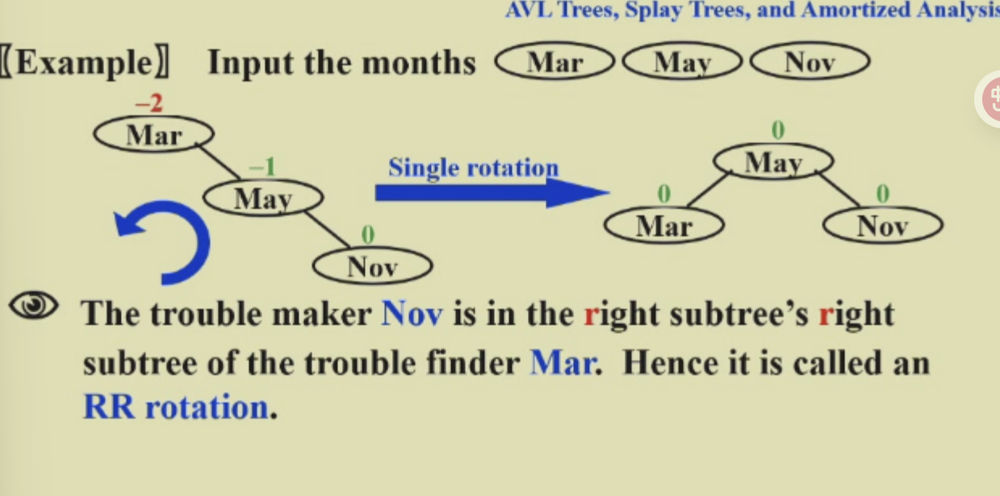
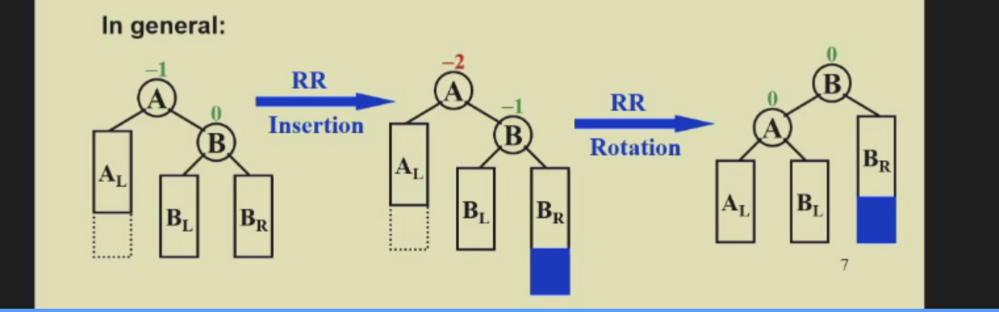
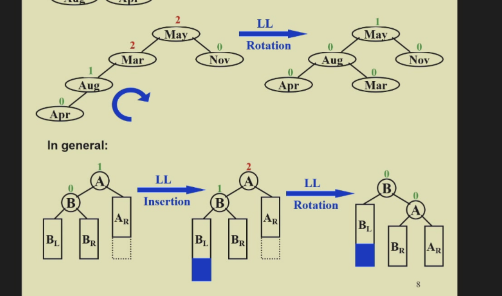
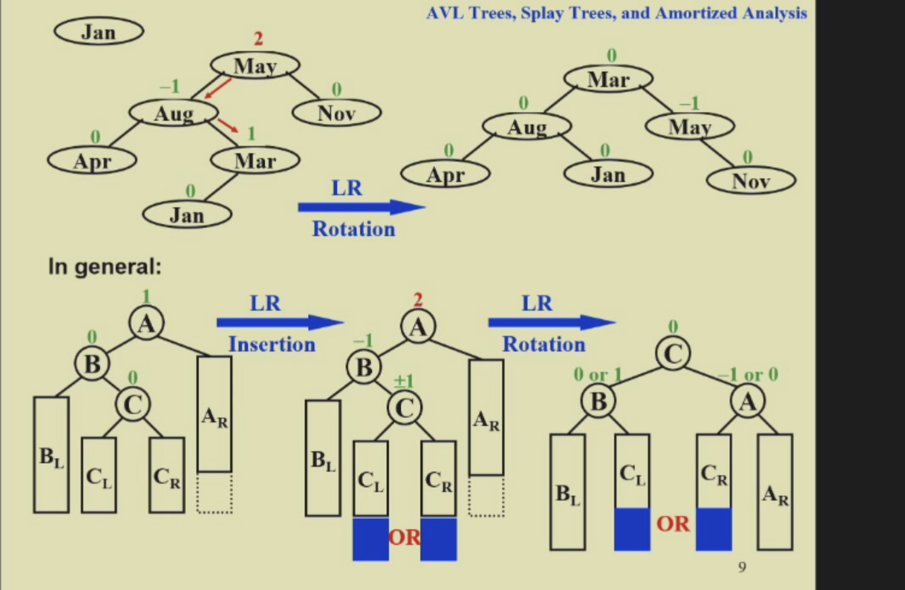
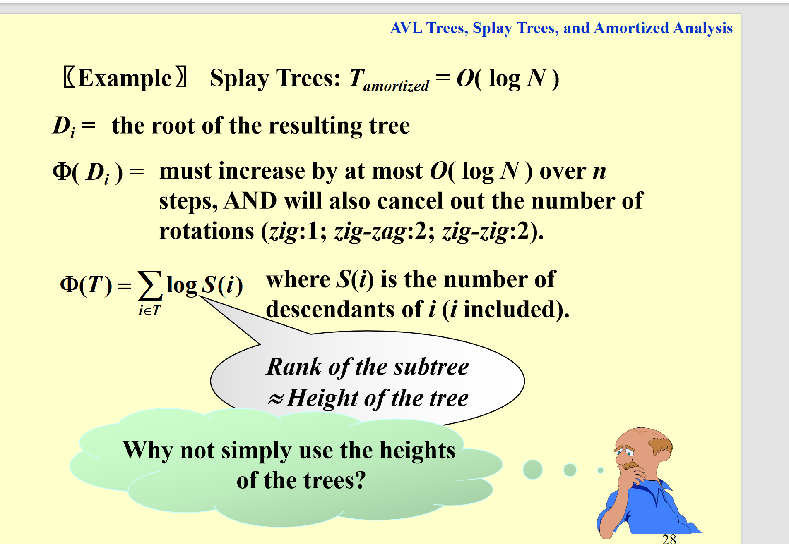
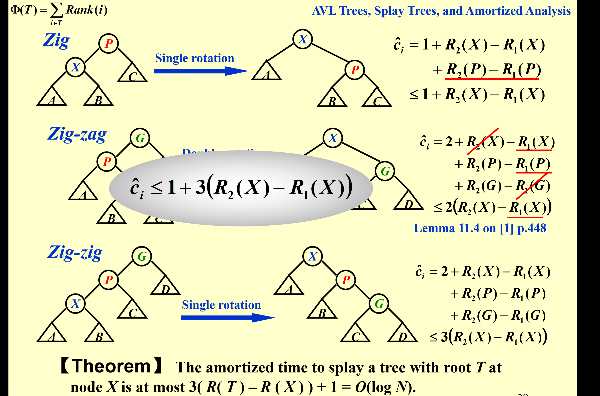

# ads第一讲:avl树和splay树

## 为什么需要avl树

很简单：avl树查找的更快

## avl树是什么：平衡二叉树

定义：首先我们先知道空树的树高是-1，一个节点的树是0.那么avl树就是每个节点的两个子树的树高不能差超过1

Blance Factor = Height(Left Subtree) - Height(Right Subtree)

## 如何构造一个avl树

我们就来遇到问题解决问题

首先第一个：RR(**问题制造者是**出问题的人的右节点的右子树的一个)

但更通用的应该是这样

我们可以发现，这个操作他是不改变原来的树高的！这也意味着，我们遇到问题的时候，应该从下到上解决(意思是如果两个节点都出问题)。(因为你解决了下面的问题，上面的也就迎刃而解了，因为原来是没问题的呀)

### LL

接下来的第二个操作(和上一个差不多，不讲)

### LR

LR操作就有点不同喽：

需要两次旋转，相当于和父亲节点（这两个父亲不一样）单旋转两次，注意是转出现问题的人的左子树的右节点

### RL

### 删除

avl删除操作和二叉树的删除操作是一样的，都是要不然直接替换，要不然就用他的前驱节点替换，之后去左子树删除前驱节点。但是注意检查删除过程中搜索的所有点是否平衡！。

而且删除操作，可能会导致你回复好了这个，导致更高的失衡（这个和插入不同）！，因此可能要调整logn次。

插入和删除复杂度都是logn

## 伸展树：splay树

我们如果不想存储这个balance factor，那么我们就可以采用splay树(也叫自平衡树)

这里我们应该用均摊开销(来计算操作的时间复杂度)

splay树就是要让每次查询的节点，都会调整一下。而且调整的结果是查询的节点变成根节点！同时让这个tree保持一个比较平衡。 但能保证，这样操作的tree你的查找，删除、插入的均摊复杂度都是O(logn)

注意了！ 每次插入的节点都要旋转到根！

具体操作右zig zigzig zigzag

## splay复杂度证明 均摊开销

其实就是不看单次操作的，我们看好多次一起的。

证明方法可以用势能函数(代表了数据结构棘手程度)

一般ci(hat)-ci就是势能函数变化量(这一步操作后和上一步的)

## 均摊复杂度思想

就是用另一个均摊的每一步的复杂度>原来的
之后证明均摊求和复杂度的上界。
仔细想想，他其实就是把可能需要高的复杂度的操作的时间分到其他步骤去，因为这一步做完之后，会让其他步骤好做。

### 势能函数

势能函数就是帮助我们构造均摊复杂度的

他就体现了数据结构复杂程度，因此简单的步骤会让复杂度上升，而时间高的步骤会让复杂度下降，因此这样一个势能函数就实现了上面说的复杂度分配。

## splay

详细一点

splay的证明复杂度的势能函数：这一颗树所有节点的子树节点总个数的对数求和 即rank求和

可以看到，这里证明的其实是完整的一个查询操作，他的均摊复杂度其实就是O（logn）。