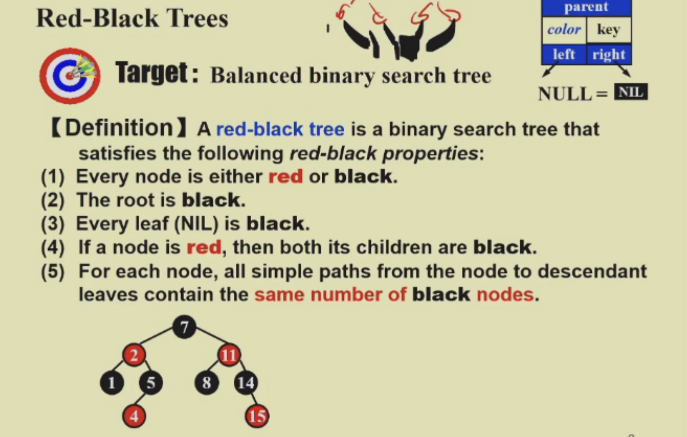
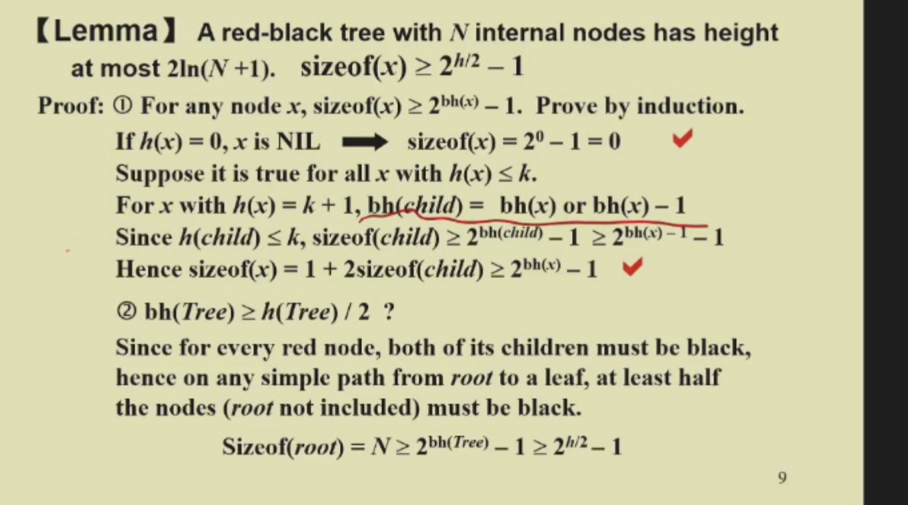
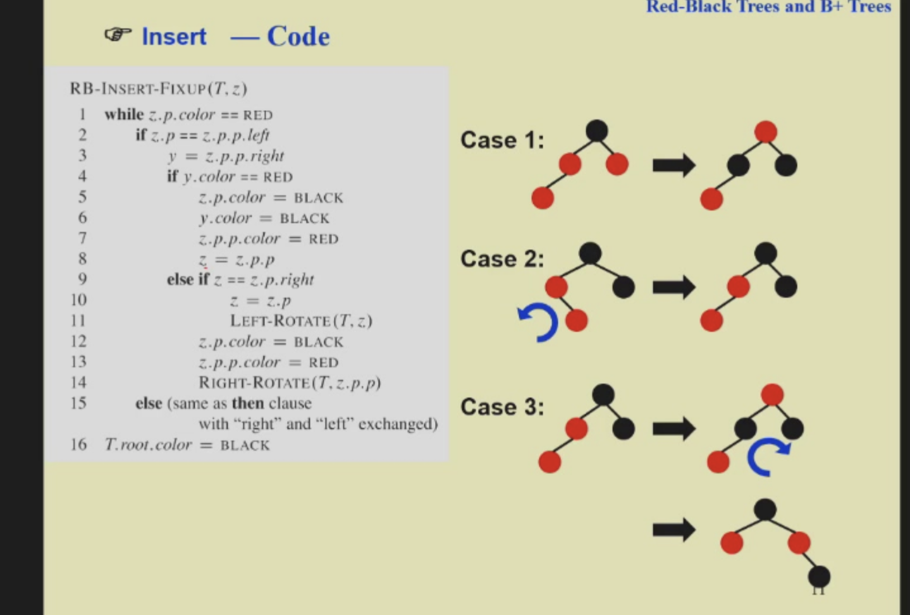
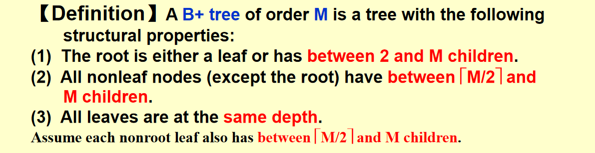

# 红黑树

---

## 定义

- **黑高**：从某节点到叶子的路径上，黑色节点的个数（不包括自身）。  
- **树的黑高**：即根节点的黑高。

---

## 重要定理

---

## 插入操作

- 新插入的节点一般为红色（不破坏黑高）。
- 插入后可能出现连续红色节点（红+红），需要调整。
- **调整原则**：局部调整，尽量让局部根节点为黑色，且不改变局部根节点的黑高。

---

## 删除操作

1. 删除过程类似二叉树，最终会变成删除叶子或只有一个子节点的节点。只有在叶子是黑色的时候才会产生结构不满足（黑高被破坏）
2. 有一个子节点的节点只可能是黑红结构，交换时只换值不换颜色（处理有两个子节点的节点）。
3. 删除的核心是保证所有路径黑色节点数相同（黑路同）。
4. 要先调整到可以删的结构 再删除
5. 详细步骤可参考 PPT。

---

# B+树

- B+树的要求详见 PPT：

- 每一行要求都必须满足，尤其注意叶子节点也要满足 `[M/2] - M` 的范围。
- **插入**：先插入，查得不好再分裂。
- **删除**：可参考 [知乎专栏：B+树删除](https://zhuanlan.zhihu.com/p/149287061)

---

> **提示**：  
> 重点关注红黑树和B+树的定义、插入和删除的调整原则，理解黑高和节点分裂/合并的条件，有助于掌握平衡树的核心思想。
