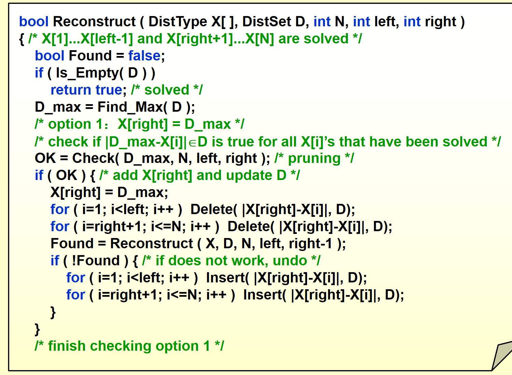
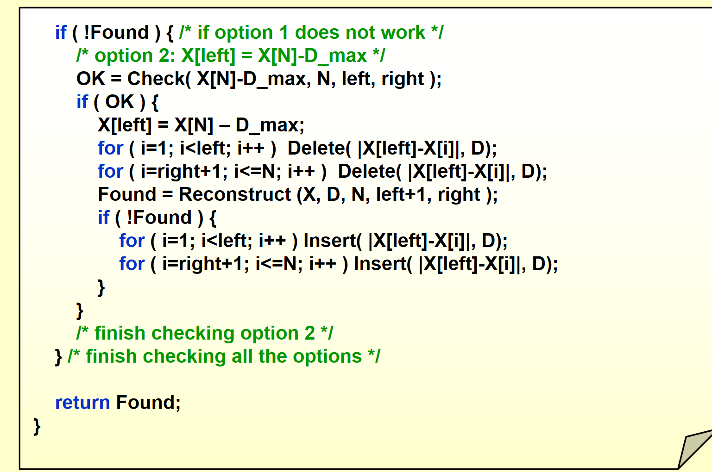
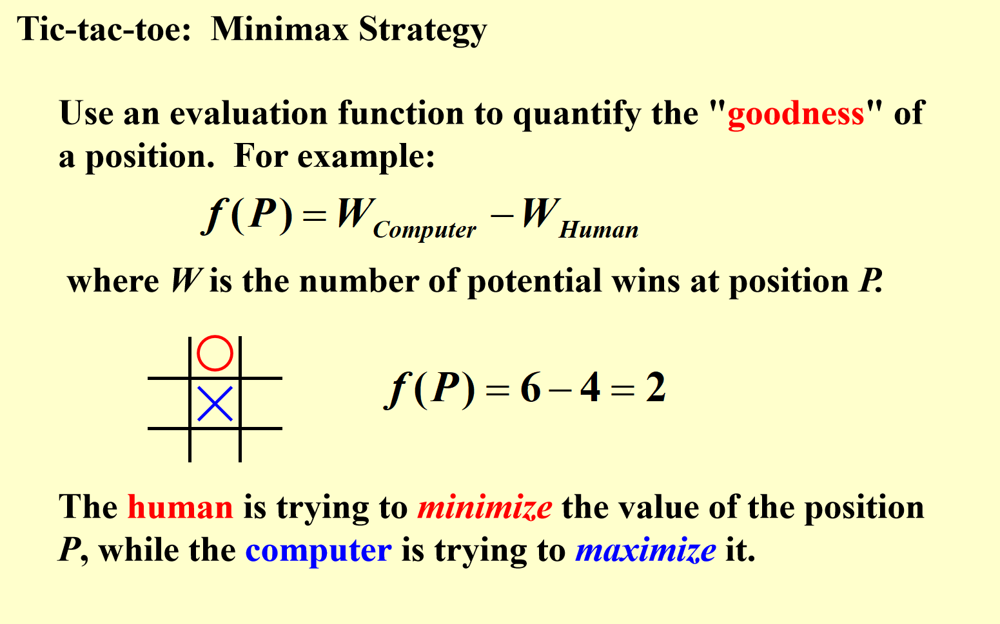
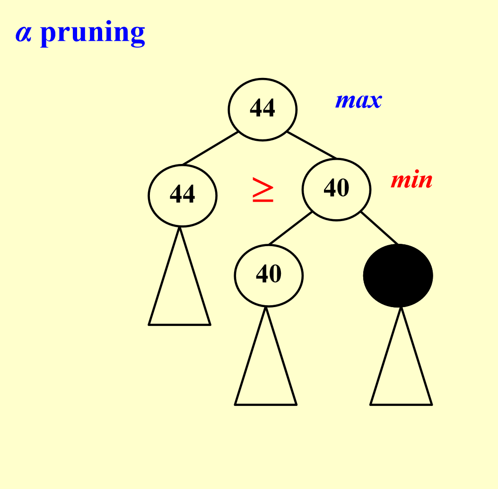
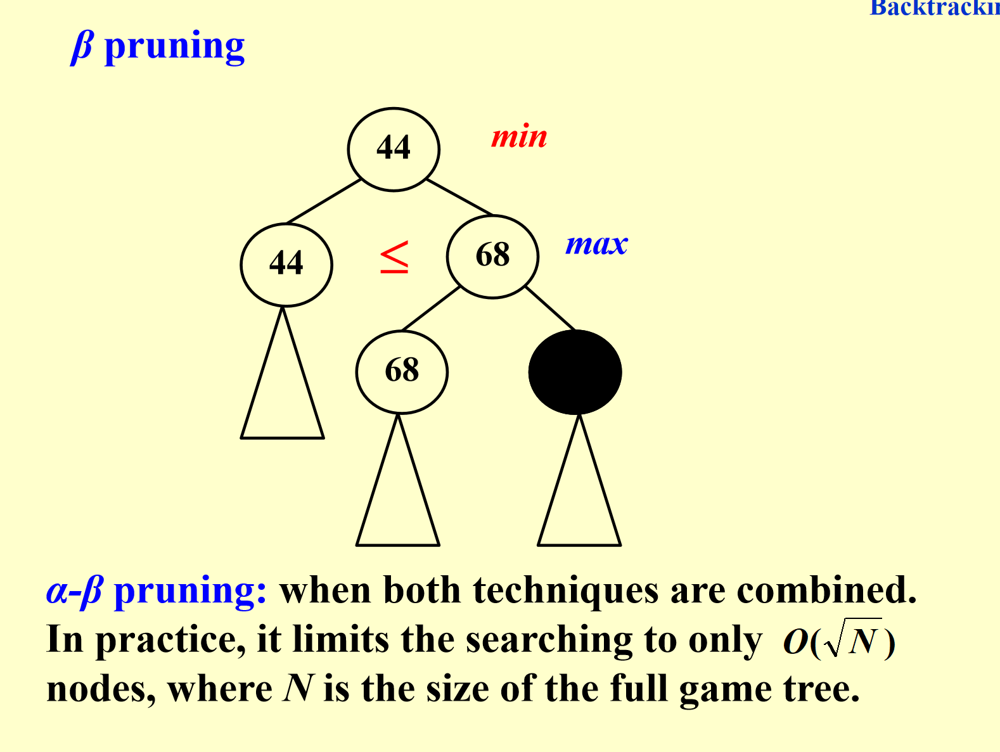

# 回溯算法

## 回溯算法概述

1. 穷举法的思路（对比背景）​
解决问题的一种 “稳妥但低效” 的方式是：列出所有候选答案，逐个检查，在检查完所有或部分候选后确定最终答案。这是 “穷举法” 的核心逻辑，但缺点是当候选数量极多时，效率会非常低。​
2. 回溯算法的优势​
回溯算法在穷举的基础上做了 **“剪枝优化**：它能避免显式检查大量无效的候选子集，同时又能保证：只要算法执行到底，就一定能找到答案（如果存在的话）。​
3. 回溯算法的基本思想​
假设我们有一个 **“部分解”** (x₁, …, xᵢ)，其中每个 xₖ 属于其候选集合 Sₖ（1 ≤ k ≤ i < n，n 是解的总长度）。算法的执行逻辑是：​
先向部分解中添加下一个候选 xᵢ₊₁ ∈ Sᵢ₊₁；​
检查新的部分解 (x₁, …, xᵢ, xᵢ₊₁) 是否满足问题的约束条件；​
若满足：继续添加下一个候选（拓展部分解）；​
若不满足：删除 xᵢ，回溯到上一个部分解 (x₁, …, xᵢ₋₁)，尝试其他候选。​
简单来说，回溯算法是 “边走边检查，不对就回头换条路”，通过这种方式避免了对大量无效候选的无用检查，从而提高效率。

## 例子：8皇后

没什么好说的 就是一个剪去枝的问题

## 例子;TurnPike Reconstruction problem

### 问题描述

一条线上有n个点 给出这n个点两两距离（一共n*(n-1)/2个距离） 要重建这些点的位置

比如 D=1 2 2 2 3 3 3 4 5 5 5 6 7 8 10

### 解决办法

1.首先根据10 知道头和尾是0 10

2.接着从大往小看 发现8 这个8只有可能是和0或10的距离 因为8是除了10最大的！ 如果是和其他点 那么8和头尾的距离一定大于8！！！

3.就这样 每个点有两个选择（和头或者尾部距离） 之后搜索解决！

#### 代码

代码实现这里比较巧妙 这里的left和right指的是左边的1-left-1个安排好了 右边的right+1-n个安排好了

X[i]指的是第几个数的坐标

之后就可以说枚举新来的点是距离头还是尾 分别搜索 之后把加进去的产生的新的距离从D中删掉

之后加入新的点，也就是下一层搜索

如果不合适 就还原

看看代码吧

### 三字棋

就是3*3 谁先连成3个谁赢

我们现在想象一个机器 来做决策

我们认为机器会选择一个value值最大的点来下

那value值怎么计算呢？

就是这盘棋双方能赢的情况相减

但是 你只有下完所有棋 你才能知道每一种下法的value 这样太耗时了

但 我们可以把对手也想象成一个绝对聪明的 他会在我们落子后 使得我们value值最小的地方落子

所以 我们认为当前这一步的value是后面几种别人的选择的value中的最小值（注意这个value值定义不一样了 这里的value变成了一个优先级一样的东西）

而别人这一步的value也是我后面一步不同情况的value的最大值

而我们要选择 是当前这一步几种选择value最大的

这就是一个max min 策略

那我们就发现 一个剪枝的策略 

比如我们这一个要找最大的 已经知道一个子节点是44 这时候发现另一个子节点的一个子节点是 40 那我们直接就不看后面的了。

因为子节点这一层是对手找最小 因此另一个子节点的值肯定小于40 比44小

另一种情况一样

这个叫做alpha beta剪枝

我们可以证明 也很好想象 这样的**最优情况**复杂度就相当于开了个根号