# 分治

说实话分治解决的就是一个多问题拆成小问题复杂度的问题

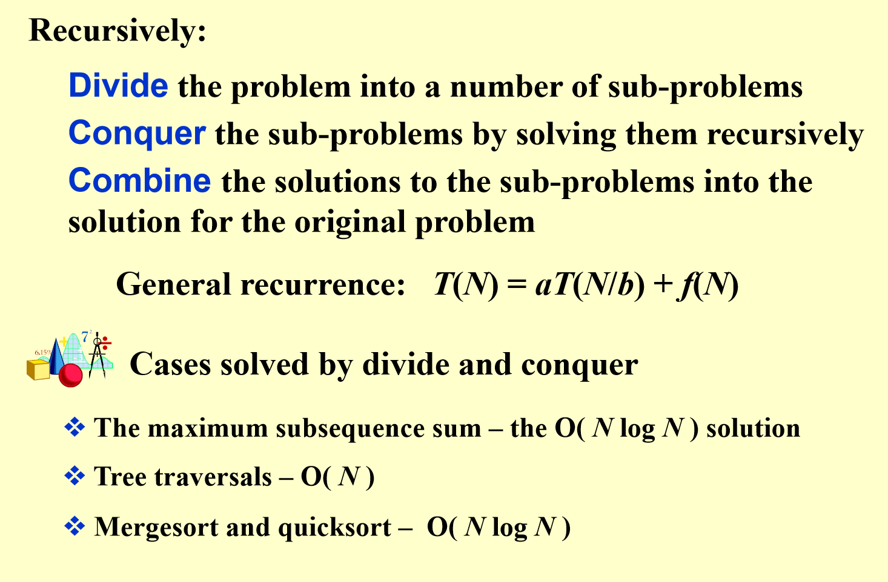

## 例子：最小距离的问题

平面上有n个点，求任意两点之间的最短距离

我们可以先按照x坐标进行排序，然后从中间分开

这样左边右边n/2个点，求两边的点最短距离，再求跨过中间的点的最短距离

### 问题：跨国中间的点的距离计算为什么是O（n）

因为我们可以优化算法 我们只需要以中间向两边延申a（a是左半边和右半边的距离的最短值）

只用算这个范围内的

但这个范围也有可能包括所有点

这个时候我们考虑y

我们知道如果y的距离大于a，那么也不用考虑了

所以其实我们只需要一个点周围的一个长方形 长度为2a 宽度为a

那我们只要证明 这个长方形内的点的数量为常数

这是很好想的 因为最小距离就是a 所以你点数过多 肯定会最小距离小于a。

而且这里我们只需要对y排个序 就可以很快的找到（这里需要记录谁在strip里面 之后组成一个新数组）

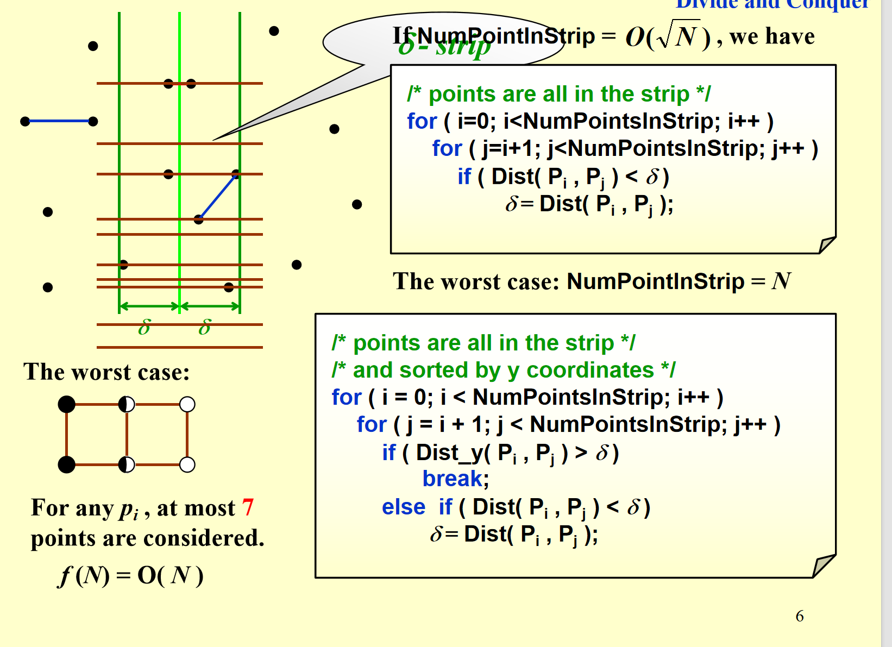

### 复杂度证明

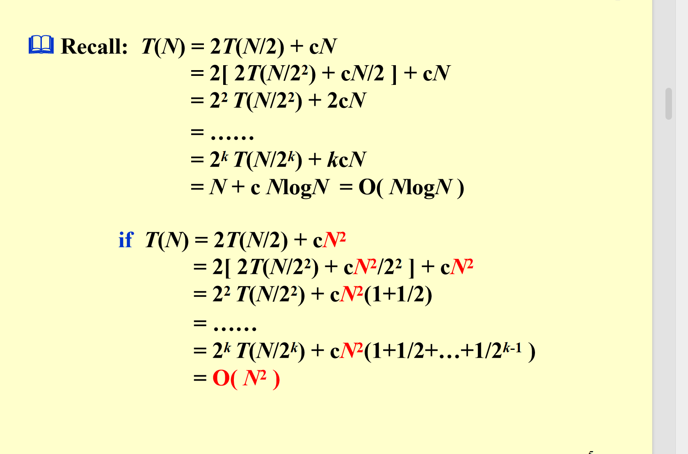   

## 现在进入真正的分治学习

说白了 分治的公式就这样一条

T(n) = aT(n/b) + f(n)

请你解出这个T（n） 同时我们不是很考虑n比较小的时候对不对 我们是对于大n来说的

那我们有三种方法

### 数学归纳法

这个方法说白了 就是猜答案之后证明他

#### 例子

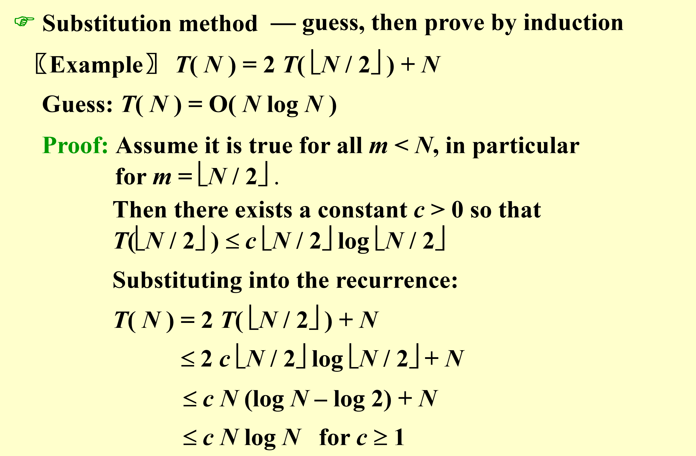

这里有两个注意点 1.这个式子对N=1不成立 但我们不需要担心 我们可以从N=2开始推导

2.c的选择其实是可以任意的 只取决于你从谁开始

#### 例子2 猜错了怎么办

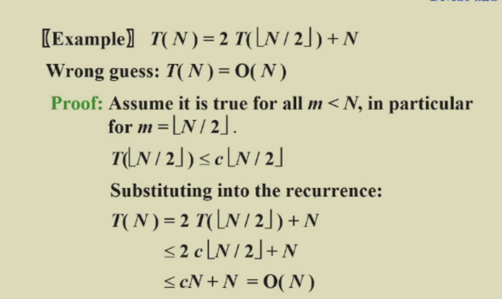

你看这里 我们猜O（n）好像也对

但问题在哪 就在于我们要一直保持这个c不变！ 因为这个多出来的n积累起来 结果是个n平方的，会让你下一项数学归纳法无法进行

#### 总结

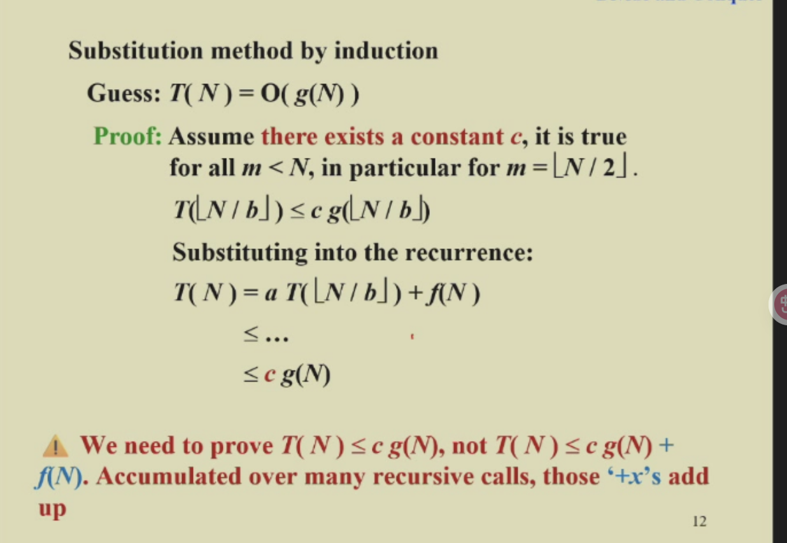

## 分治树法

这个方法可要好好学 好好看 他和主定理关系不小

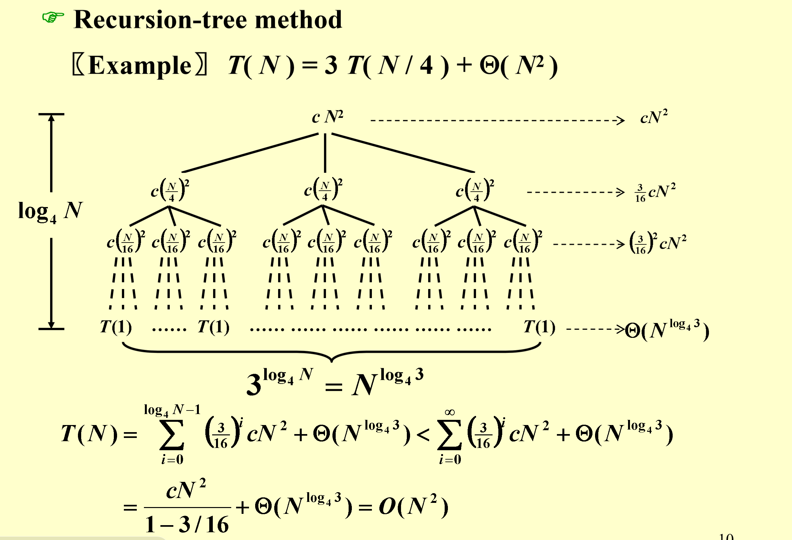

其实就是画出来

前面几列的时间消耗就是f（n）相关的 最后是所有最终子节点的数量（理解为常数项）

而且我们这里可以发现 基本总时间取决于几个事情

### 前面logn层的时间开销是递增还是递减（等比） 

从第一个例子 发现是个递减等比数列 那么基本就是取决于第一项 

如果相同的话 那么时间就是logn*fn

如果递增的话 不太好估量

### 最后一层和前面的对比

如果发现是最后一层的数量占主导 那时间取决于最后一层 

反之 那就还是前面那个讨论的情况

### 特殊情况

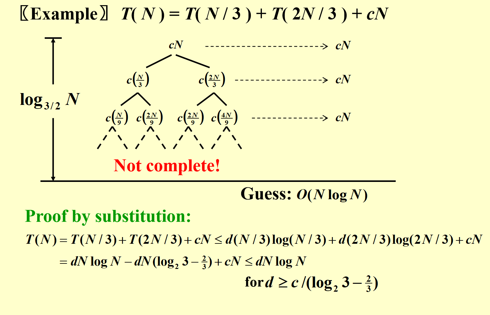

这里有个特殊的 画出来 只能大概明确方向 最后还是要靠数学归纳法

## 主定理

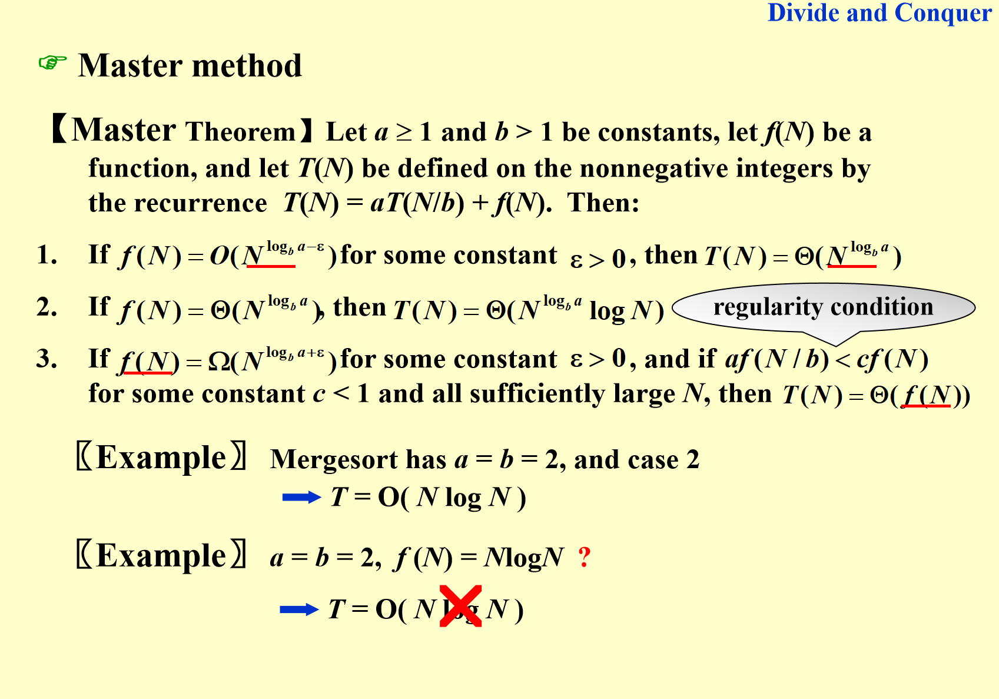

好了 现在请出大名鼎鼎主定理

几个注意事项 1. 主定理主要就是讨论f（n）和 ab的关系 2. 之后就是我上面说的三种情况。 3。定理三的时候 要满足那个a(f(n/b))小于cf(n) 这样才能等比数列递减

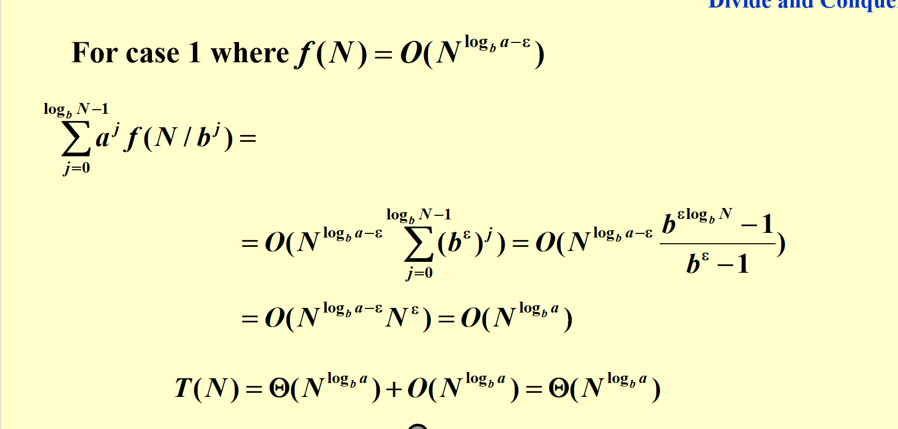

这里有个证明

### 第二种形式

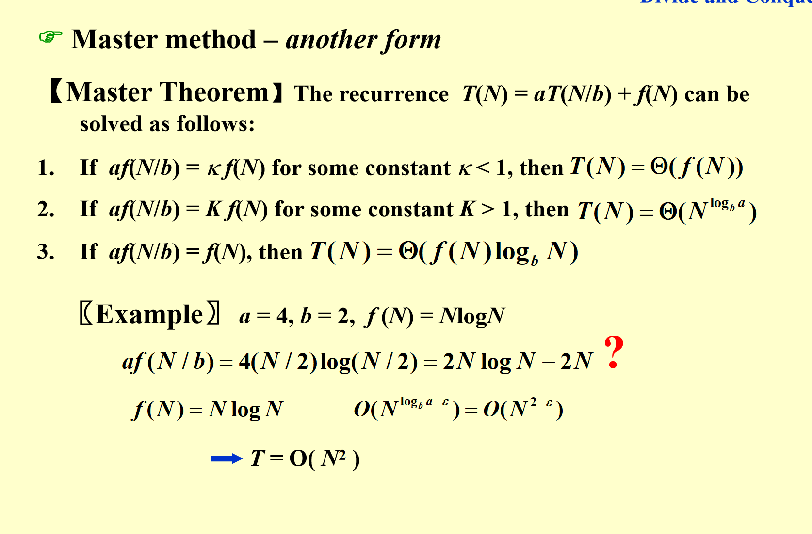

这个定理比第一个弱 就是有些情况他判断不了 但1可以

### 第三种 对数版本

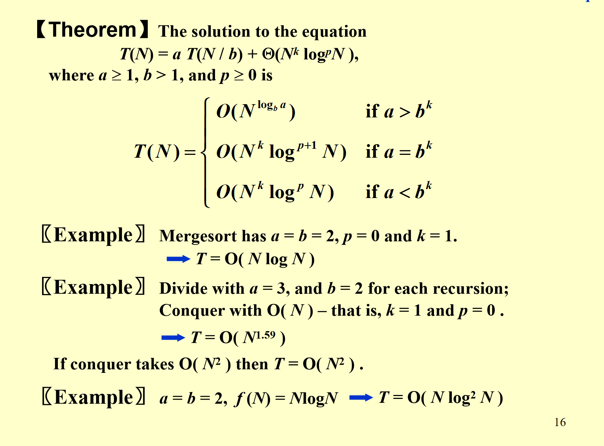

其实和之前的是一样的 只不过专门解决fn有对数