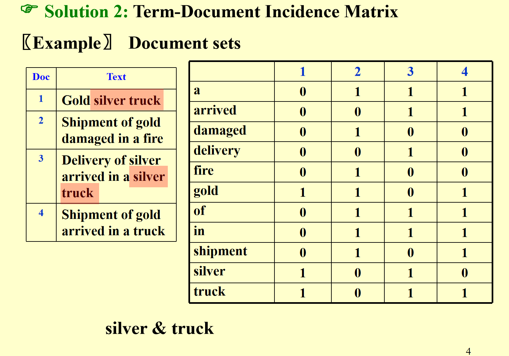
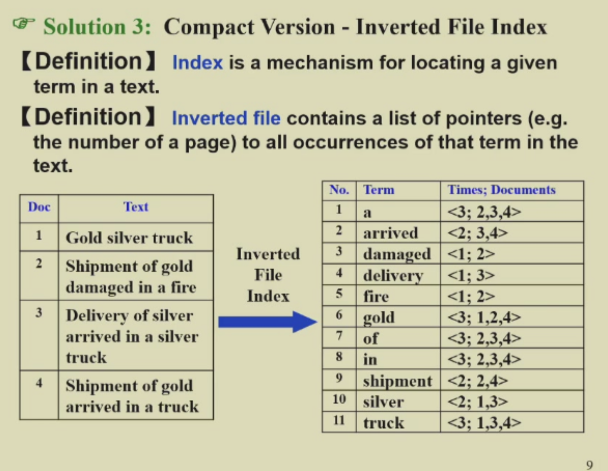
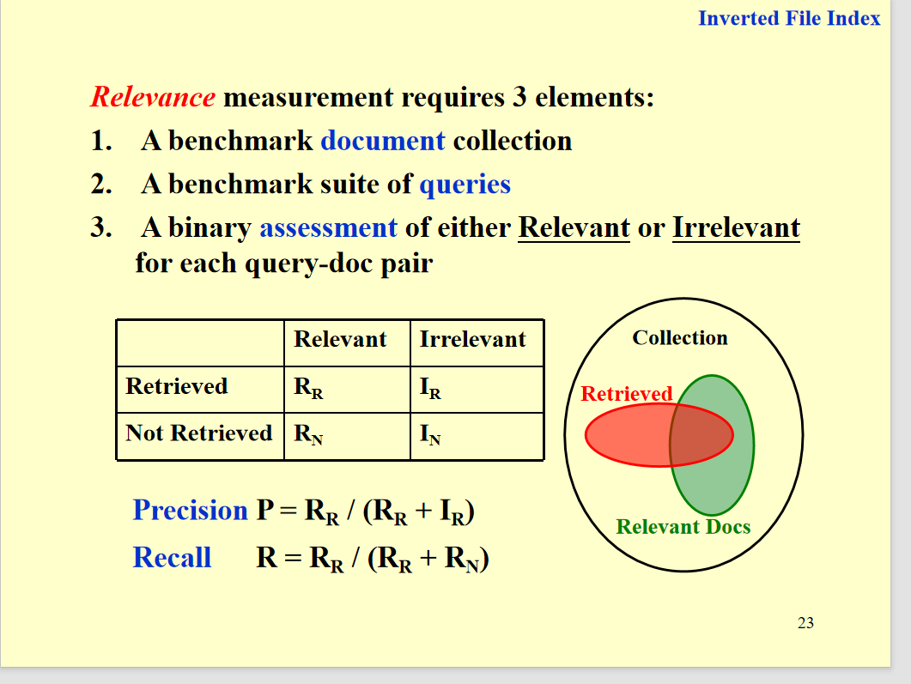

# 搜索系统

## 搜索

我们想想日常的搜索，输入一个关键字，找到相关的，那搜索引擎是如何做到的呢

1.单词邻接矩阵

2.倒排索引

说实话好像差不多 为了知道这个词在哪个位置 可以把文章号+位置一起记下来。

同时也可以记下次数(这样同时搜索好几个词可以先查概率低的词)

## 一些术语(读文字)

word stemming ： 词干分析 就是把一堆词根相同的词处理成一个（said saying says 都是say）

stop words ： 停用词 就是不重要的词(可能因为概率太高了 没什么意义 比如 a the of )

## 存文字

hashing and B+ tree

## commpression

我们如果不想存那些空格 标点符号 可以用compression 就是把一句话压缩成没空格的一连串

但是为了能分开 还是要记一个posting list(就是每个单词开始的位置)(可以存差值)

## distributed indexing

有两种存储方法 1.根据首字母存储 2.根据文章存储。

## 阈值

也有两种：
1.document的 就是选前几个weight的文档 （但这样用不了bool queries了，因为不同单词对应的这个文章权重可能不同）

2.query的 就是选前几个weight的query 进行查询文章。

## 评价标准

这里有两个 data retriaval performance 和 information retrieval performance 注意区分

还有precision 和 recall的计算。

