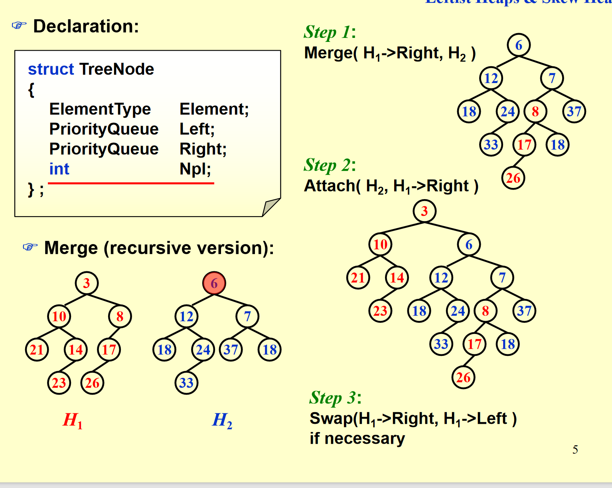
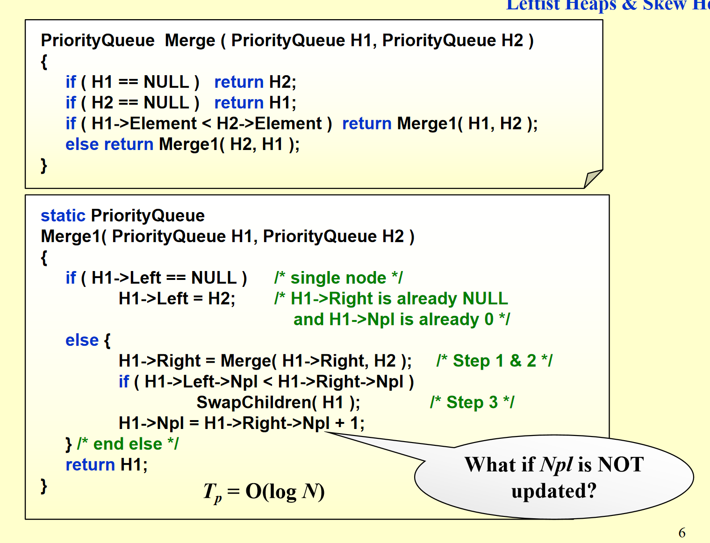
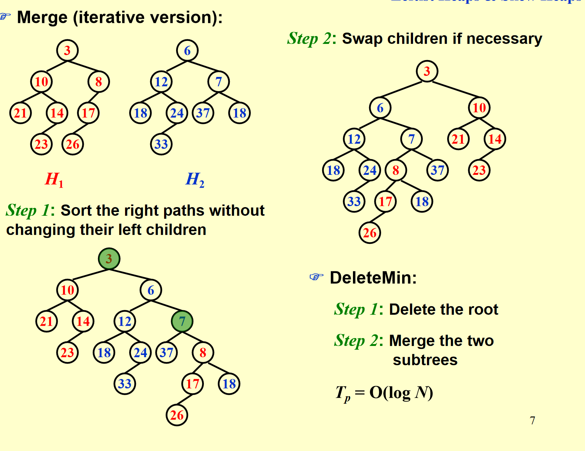
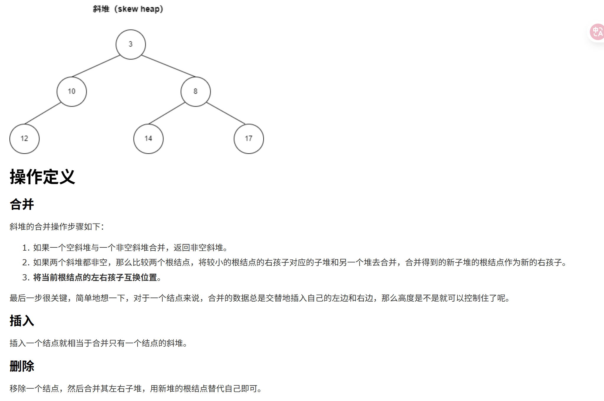
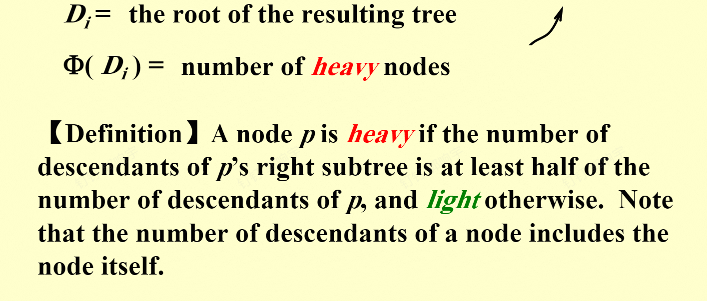
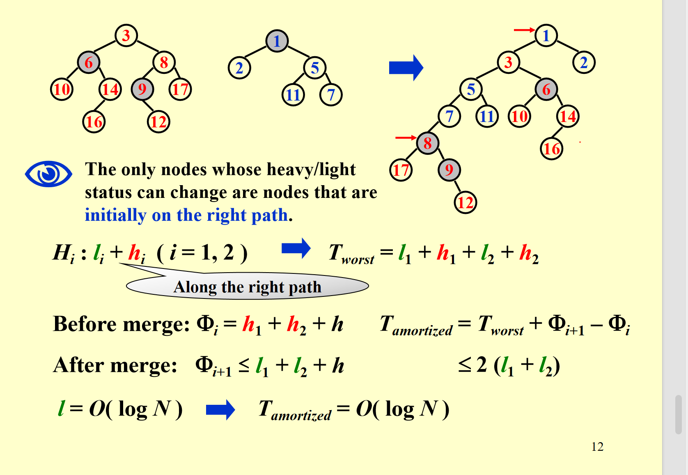

# 堆：斜堆

我们之前的堆可以看fds笔记,但是有个问题，合并堆的操作是O(n),我们想要再次优化/提升

## Leftist Heap(斜堆)

目标：加速合并操作

第一看过去 这是一个左边比右边大的堆(虽然不满足平衡性质，但可以让合并堆速度更快)

### 定义：零路径

### 定义：左偏树(堆)

The leftist heap property is that for every node X in the heap, the null path length of the left child is at least as large as that of the right child.

就是左孩子的零路径比右的大（到叶子节点/单儿子节点距离更远）

### 证明：一个定理

证明：首先先明白一个事情，左偏树的右（一直往右）路径肯定是最短的(要不然肯定有矛盾),之后可以用递归证明(因为左子树的右路径肯定大于右子树的右路径)

## 那如何对两颗左偏树合并呢？

### 递归的方法

1.首先比较两棵树的根节点，将较小的作为根节点A，另外那棵树的根节点和根节点A的右子树合并 作为根节点A的右子树。  
2.递归合并  
3.如果合并后npl出现问题 那么交换左右树

### 循环

还有一种循环的做法 就是先只无脑重复1的合并 之后再对所有有问题的交换（从底部往上交换）

注意这里的删除 其实就是把左右子树合并

### 斜堆

其实斜堆就是弱化版本的左偏树 但其实没什么结构要求（是个堆就行）

合并操作就是类似左偏树 但每次合并后都交换左右子树(**特殊操作** 最后遇到右路径最大的节点的时候 不用交换左右子树了。)
他这样操作简单 但能保证连续M次操作 Mlogn 均摊开销

其实在实际操作中 如果只剩下一个堆的子树的时候，已经不用交换合并了 直接连接就好了，但是考试不是这样哦！

### 均摊开销

再说一遍均摊开销的想法

就是定义一个势能函数 PHI

之后 Ci（hat）= Ci（真实） +PHI(i)-PHI(i-1)

我们这个势能函数要让Ci（hat）越好算越好

其实这个势能函数的意义是为了抵消Ci可能突然变大 变小的开销

### 那这里的势能是什么呢

#### heavy node

说白了 heavy node就是他的右子树元素个数>=(左+右+1)/2 light node就是除此之外的

那一次合并操作之后 heavy node的数量怎么变化呢 我们仔细想想就能知道 只有右路径的heavy或者light可能会改变,而且 heavy 一定变成light，但反过来不一定。

但light不一定变成 heavy

就有了这一页

说一下l=logN是为什么 因为是light要求左比右多，所以经过最多logN个轻节点，节点数就会变成1.
