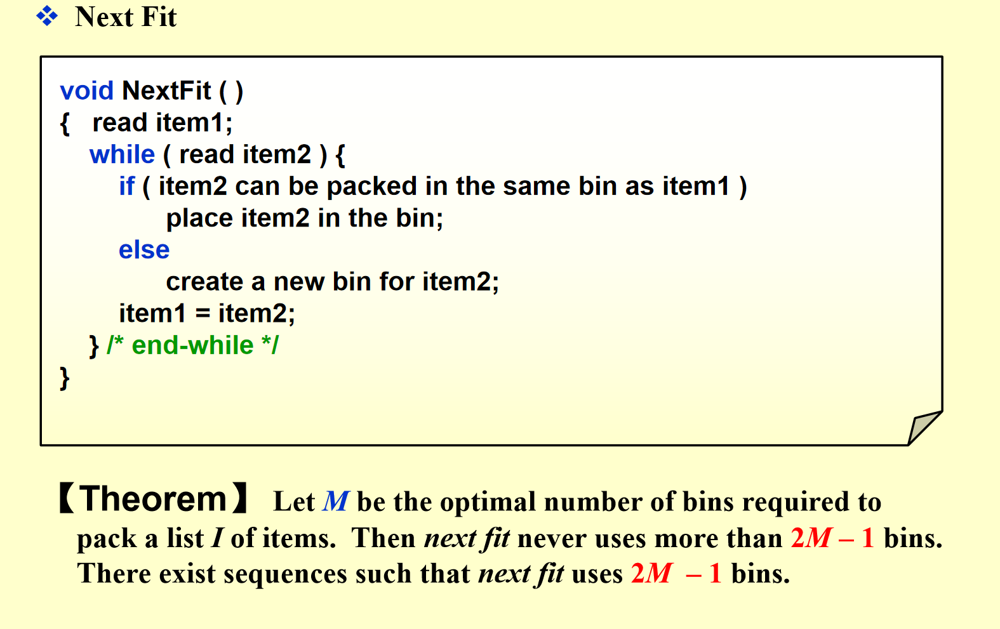
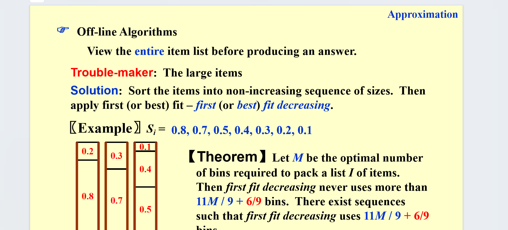
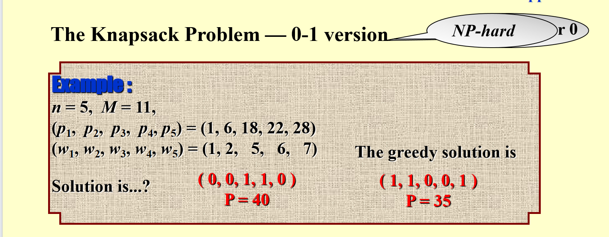
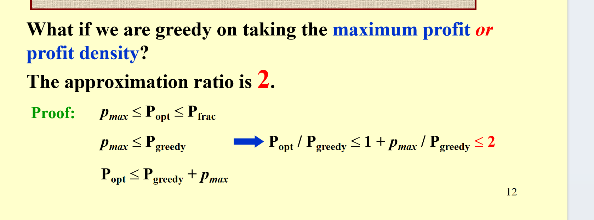
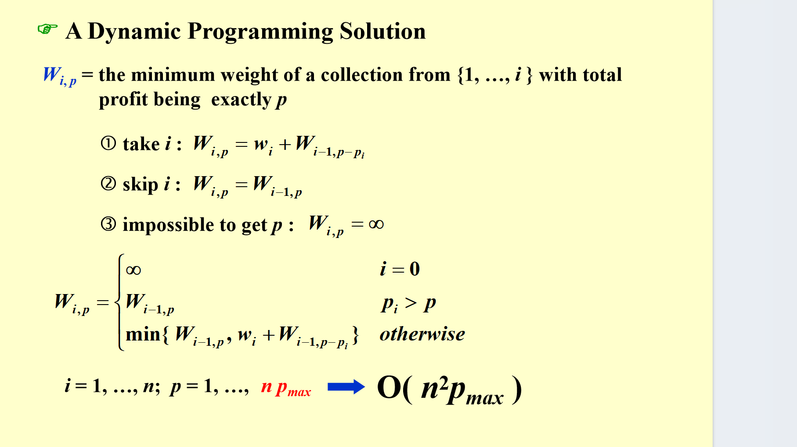
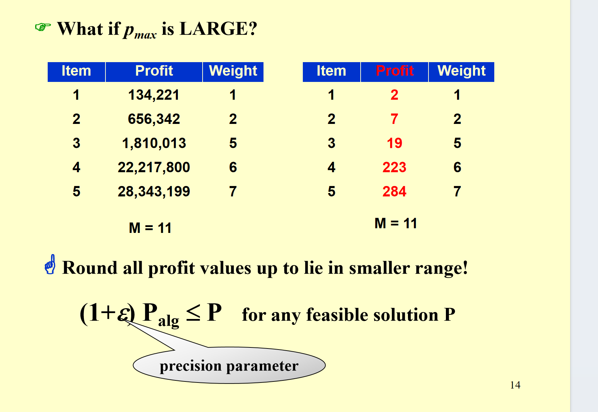
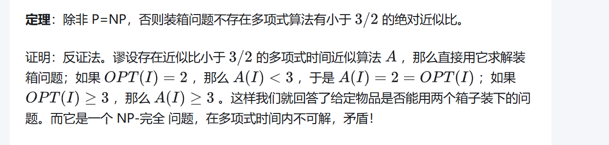
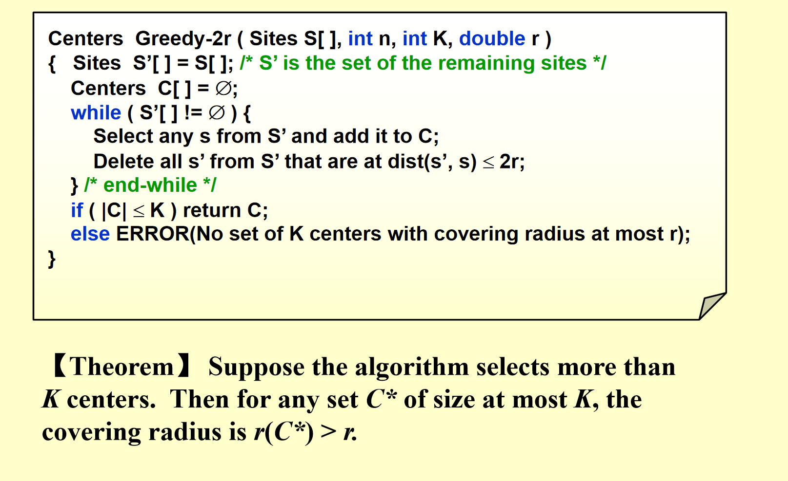
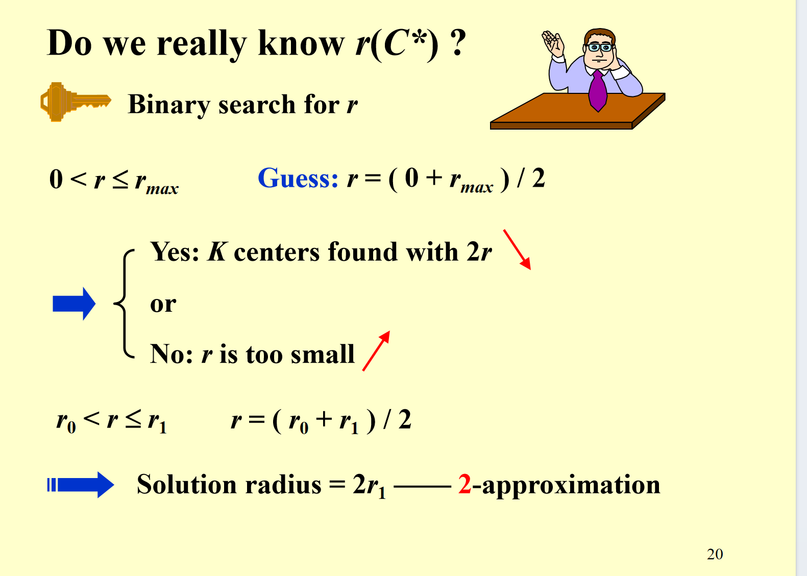

# 估计算法

估计算法就是我们不要求得到最优解，但是可以用更好的复杂度得到一个不太差的解。

---

## 定义

### 1. 近似比（Approximation Ratio）的定义

对于规模为 $n$ 的输入：

- 设近似算法得到的解的代价为 $C$，最优解的代价为 $C^*$；
- 若 $C$ 和 $C^*$ 的“比值的最大值”不超过 $\rho(n)$，即：
  $$
  \max\left( \frac{C}{C^*},\ \frac{C^*}{C} \right) \leq \rho(n)
  $$
  则称该算法的 **近似比为 $\rho(n)$**，对应的算法叫“$\rho(n)$-近似算法”。

（注：这个定义同时覆盖了“最小化问题（$C \geq C^*$）”和“最大化问题（$C \leq C^*$）”）

---

### 2. 近似方案（Approximation Scheme）

这是一种更灵活的近似算法：

- 输入除了问题实例，还包含一个参数 $\varepsilon > 0$；
- 对于任意固定的 $\varepsilon$，它是 **$(1+\varepsilon)$-近似算法**（即近似比可控制在 $1+\varepsilon$，$\varepsilon$ 越小，解越接近最优）。

---

### 3. 多项式时间近似方案（PTAS/FPTAS）

根据时间复杂度进一步分类：

- **PTAS（Polynomial-Time Approximation Scheme）**：对任意固定的 $\varepsilon > 0$，算法的时间复杂度是输入规模 $n$ 的多项式（但可能与 $\varepsilon$ 相关，比如 $O(n^{2/\varepsilon})$）；
- **FPTAS（Fully Polynomial-Time Approximation Scheme）**：时间复杂度同时是 $n$ 和 $1/\varepsilon$ 的多项式（比如 $O((1/\varepsilon)^2 n^3)$），是更高效的近似方案。

---

## 例子 1：装箱问题

### 问题描述

给定一个盒子大小和一组物品，每个物品有体积。请问最少多少个盒子可以装下这些物品？

首先是一个 NP-hard 问题，可以由划分问题归约。

---

### 近似算法 1

直接装，每当装不下的时候，就开一个新盒子。

这个算法的近似界是 $2m-1$（$m$ 是最优解的盒子数）。

这个界很容易取得。

我们来证明 $2m-1$ 是最差的界：

假如用了 $2m$ 个盒子，那么我们两两一组，那么每组的盒子的物品大小和肯定大于盒子大小。这就导致总物品大小大于 $m$，这就矛盾了。

---

### Best Fit 和 First Fit

这页 PPT 介绍了 **装箱问题的两种近似算法：First Fit 和 Best Fit**，核心讲它们的逻辑、时间复杂度和近似性能，分两部分说明：

#### 1. First Fit（首次适配）

- **算法逻辑**：逐个读取物品，扫描已有的箱子，把物品放进 **第一个能装下它的箱子**；如果没有合适的，就新建箱子。
- **时间复杂度**：可优化到 $O(N\log N)$（用有序数据结构管理箱子）。
- **近似性能（定理）**：设最优装箱数为 $M$，First Fit 最多用 $\frac{17M}{10}$ 个箱子（近似比不超过 1.7）；极端情况会用到 $\frac{17(M-1)}{10}$ 个箱子（说明这个性能界是“紧”的）。

#### 2. Best Fit（最佳适配）

- **算法逻辑**：把新物品放进 **剩余容量最接近（刚好能装下）它的箱子**（即“最紧凑”的箱子）。
- **时间复杂度**：同样是 $O(N\log N)$（需要高效查找“最紧凑”的箱子）。
- **近似性能**：最多用不超过 $1.7M$ 个箱子（和 First Fit 的近似比相同）。

简单说：这页对比了 First Fit 和 Best Fit——两者都是装箱问题的高效近似算法，时间复杂度都是 $O(N\log N)$，且近似比都不超过 1.7，只是“选箱子的策略”不同（一个选“第一个合适的”，一个选“最紧凑的”）。

---

### 解析

你看，在线算法不太行好像。

事实上，我们可以构造出一个解，使得对任意的在线算法，它的解都至少是最优解的 $5/3$ 倍。（老师课上讲了）

但事实上，我们现在已经可以优化到 $1.55$。这是不是矛盾了呢？

不是的。因为我们上面的结论是只有当最优解为 3 的时候的特例。而下面说的 $1.55$ 是一个 $M$ 很大的时候的范围。

---

### 离线算法

离线算法肯定是更好的，因为可以看到全局。

我们可以先排序，然后再用 First Fit 或者 Best Fit。

---

## 例子 2：分数背包问题

这页 PPT 讲的是 **分数背包问题（Fractional Knapsack Problem）**，属于贪心算法可求解的优化问题，分核心定义、目标、贪心策略和示例四部分：

---

### 1. 问题定义

- 场景：有一个容量为 $M$ 的背包，以及 $N$ 个物品；
- 每个物品 $i$ 有两个属性：重量 $w_i$、价值 $p_i$；
- 可以选择物品的 **一部分** 装入背包（$x_i$ 是物品 $i$ 被装入的比例，$x_i \in [0,1]$），装入的价值为 $p_i x_i$。

---

### 2. 优化目标

在“总重量不超过背包容量”的约束下，最大化总价值：
$$
\begin{cases}
\text{最大化：} & \sum_{i=1}^n p_i x_i \\
\text{约束：} & \sum_{i=1}^n w_i x_i \leq M,\quad x_i \in [0,1]
\end{cases}
$$

---

### 3. 贪心策略的选择

要通过“贪心算法”求解，关键是选对 **贪心准则**：

- 准则①（最大价值）：优先装价值最高的物品 → 错误（可能重量太大，浪费容量）；
- 准则②（最小重量）：优先装重量最轻的物品 → 错误（可能价值太低，总价值不高）；
- 准则③（最大价值密度）：优先装 **价值/重量比（$p_i/w_i$）最高** 的物品 → 正确（这是分数背包的最优贪心策略）。

---

## 例子 3：真正的背包 0/1

只有选或者不选。

---

### 贪心算法

但是如果我们改进一下，变成取两个贪心的最优解（一个是按照性价比，一个按照价值），可以证明近似比为 2。

这里要注意的就是 $P_{opt} \leq P_{frac} \leq P_{greedy} + \text{max 单个物品价值}$。这是最后一个不等式的逻辑。

---

### 动态规划

说实话，这个应该很好理解，不再解释。

但是这里的复杂度和 $p_{max}$ 有关，这就引申到一个另一种近似算法，直接近似 $p$。

---

## 装箱问题补充

### 1. 3/2 的边界

这个证明可以参考知乎的文章。

---

### 3/2 已经是最优界（不包含常数的）绝对近似界

这个证明思路值得理解并记住。

---

## K 中心问题

这两页 PPT 是 **K 中心问题的基础定义 + 距离的数学性质**，分两部分说明：

---

### 第 1 页（K 中心问题的定义）

- **问题场景**：有 $n$ 个“站点（site，黑色方块）”，要选 $K$ 个“中心点（center，蓝色圆点）”；
- **目标**：让所有站点到 **最近中心点的最大距离** 尽可能小（这个最大距离称为“覆盖半径 $r(C)$”）；
- **示例**：图中 $K=4$，4 个中心点的圆覆盖了所有站点，圆的半径就是覆盖半径 $r(C)$。

---

### 第 2 页（距离的性质 + 问题的数学描述）

首先明确“距离”需要满足的 3 个基本性质（构成 **度量空间**）

1. **自反性**：$\text{dist}(x,x)=0$（点到自身的距离为 0）；
2. **对称性**：$\text{dist}(x,y)=\text{dist}(y,x)$（$x$ 到 $y$ 的距离等于 $y$ 到 $x$ 的距离）；
3. **三角不等式**：$\text{dist}(x,y) \leq \text{dist}(x,z) + \text{dist}(z,y)$（两点距离不超过经过第三点的路径长度）。

然后定义了 K 中心问题的核心概念：

- $\text{dist}(s_i, C)$：站点 $s_i$ 到中心点集合 $C$ 的距离（即到最近中心点的距离）；
- $r(C)$：覆盖半径（所有站点到 $C$ 的距离的最大值）；
- **问题目标**：在“中心点数量 $|C|=K$”的约束下，找到使 $r(C)$ 最小的集合 $C$。

要求就是在给定 $K$ 找到最小的 $R$。

---

### 贪心方法 1

我们捕捉到一个细节，假设一个最优中心方案，那么在每一个中心的圆圈里面，我们选择任何一个点，做半径为 $2R$ 的圆圈覆盖，那么一定能覆盖之前那个圆圈的所有点。

因此这就有了贪心方法 1。

---

#### 1. 算法逻辑（Centers Greedy-2r）

输入是 **站点集合 S**、站点数 $n$、最大中心点数量 $K$、覆盖半径 $r$，流程如下：

- 初始化：剩余站点集合 $S' = S$，中心点集合 $C$ 为空；
- 循环（直到 $S'$ 为空）：
  1. 从 $S'$ 中选任意一个站点 $s$，加入中心点集合 $C$；
  2. 从 $S'$ 中删除所有与 $s$ 距离 $\leq 2r$ 的站点（这些站点会被 $s$ “覆盖”）；
- 循环结束后：
  - 若 $C$ 的大小 $\leq K$：返回 $C$（说明用 $\leq K$ 个中心点，以半径 $r$ 覆盖所有站点是可行的）；
  - 若 $C$ 的大小 $> K$：报错（说明不存在“用 $K$ 个中心点、半径 $\leq r$”的覆盖方案）。

之后，我们对 $r$ 进行二分查找，如果满足条件，就调小，不满足就放大。

---

#### 2. 定理的含义

定理是算法的正确性保证：

“如果这个算法选出的中心点数量超过了 $K$，那么 **任何不超过 $K$ 个中心点的集合 $C^*$，其覆盖半径（即覆盖所有站点所需的最小半径）一定大于 $r$”。（因为如果有，则我们这样找一定是 $K$ 个以内的）

换句话说：算法如果输出“超过 $K$ 个中心点”，则原问题（用 $K$ 个中心点、半径 $r$ 覆盖）是无解的；如果输出“$\leq K$ 个中心点”，则存在可行的覆盖方案。

---

### 贪心方法 2

我们可以采取一个改进方案，不再需要二分。

---

### 1. 算法逻辑（Greedy-Kcenter）

这是解决 **K 中心问题**（选 $K$ 个中心点，让所有站点到最近中心点的最大距离尽可能小）的贪心算法，流程是：

- 初始化：中心点集合 $C$ 为空；
- 第一步：从站点集合 $S$ 中选任意一个站点，加入 $C$；
- 循环（直到 $C$ 的大小等于 $K$）：
  选 $S$ 中 **到当前 $C$ 中所有中心点距离最大** 的站点，加入 $C$；
- 循环结束后，返回 $C$。

这个策略的核心是“每次选离现有中心点最远的站点”（即标题说的“be far away”），目的是让中心点尽可能覆盖更广阔的区域。

---

### 2. 定理的含义（近似性能）

定理保证了算法的近似比：

“算法返回的 $K$ 个中心点集合 $C$，其覆盖半径（所有站点到最近中心点的最大距离）$r(C)$，不超过 **最优中心点集合 $C^*$ 的覆盖半径 $r(C^*)$ 的 2 倍**”.因为几乎没有点会离所有点的距离都超过 $2r(c^*)$（如果有那他一定是在最优解的时候自己为中心）。我们取得还是最远的，一定会把这个点取为中心。

也就是说，这个算法是 **2-近似算法**——虽然不一定找到最优解，但解的质量不会比最优解差超过 2 倍。

---

### 进一步解释

这样子操作后的 $R$ 也很好判断，直接遍历一下找就行了。

---

### 正确性证明

假设这个算法找到的每一个中心都是在最优解的不同圆圈里面，那么遍历的 $r$ 绝对不可能超过 $2r^*$。

如果开始遇到某一个点是在同一个圆圈里面的，由于我们选取的已经是最远的点，那么我们的 $r$ 也可能超过 $2r^*$。

---

### 近似解不超过 2 倍的证明

这页 PPT 讲的是 **K 中心问题的近似算法“性能下界”**——即“在 $P \neq NP$ 的假设下，K 中心问题不存在近似比小于 2 的多项式时间近似算法”，分三部分解释：

---

### 1. 问题提出

首先抛出疑问：K 中心问题能否找到近似比更好的算法？比如 $3/2$ 或 $4/3$？

---

### 2. 核心定理

定理给出了否定结论：

“除非 $P=NP$（这是计算机科学中未被证明的猜想，通常假设 $P \neq NP$），否则 **K 中心问题不存在近似比 $\rho < 2$ 的多项式时间近似算法**”。

也就是说，2 是 K 中心问题近似算法的“紧下界”——现有算法（如之前的 Greedy-Kcenter）已经达到了理论上的最优近似比。

---

### 3. 证明思路（反证法）

证明的核心逻辑是 **归约到 NP 完全问题（支配集问题）**：

- 支配集问题（Dominating-Set）是 NP 完全问题，它可以转化为“K 中心问题中覆盖半径 $r=1$”的情况（即：支配集存在大小为 $K$ 的解，当且仅当存在 $K$ 个中心点，覆盖半径为 1）。
- 假设存在一个近似比为 $(2−\varepsilon)$ 的多项式时间算法（$\varepsilon > 0$），那么对于“覆盖半径 $r=1$”的 K 中心问题，这个算法会输出覆盖半径 $\leq 2−\varepsilon$ 的解。但由于支配集问题中距离是整数，覆盖半径 $\leq 2−\varepsilon$ 等价于覆盖半径 = 1（即最优解）。
- 这意味着我们能用这个近似算法在多项式时间内解决支配集问题——但支配集是 NP 完全问题，若 $P \neq NP$，这是不可能的。

因此，假设不成立，即不存在近似比小于 2 的多项式时间算法。

---

发现这个证明思路和前面的是一样的。