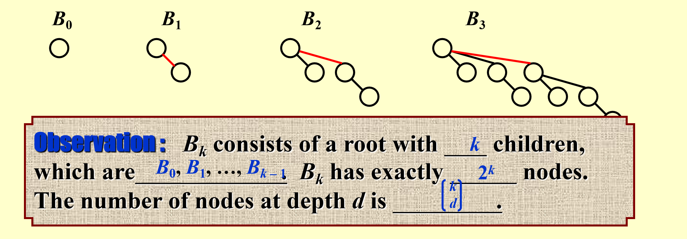
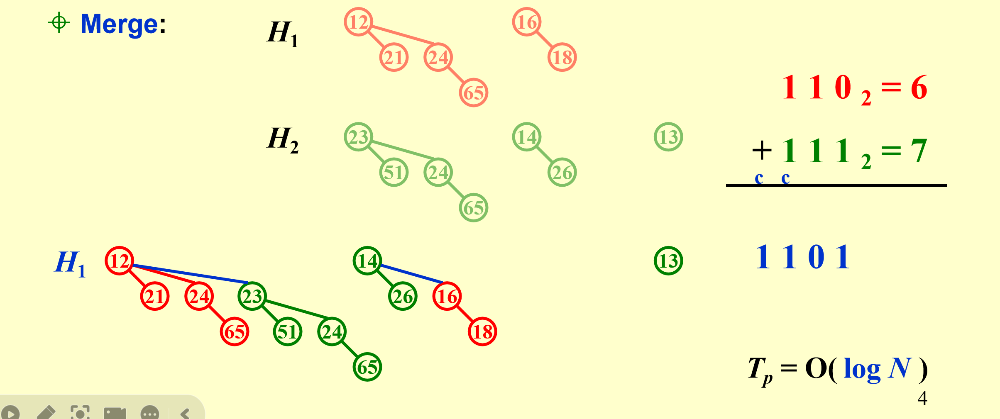
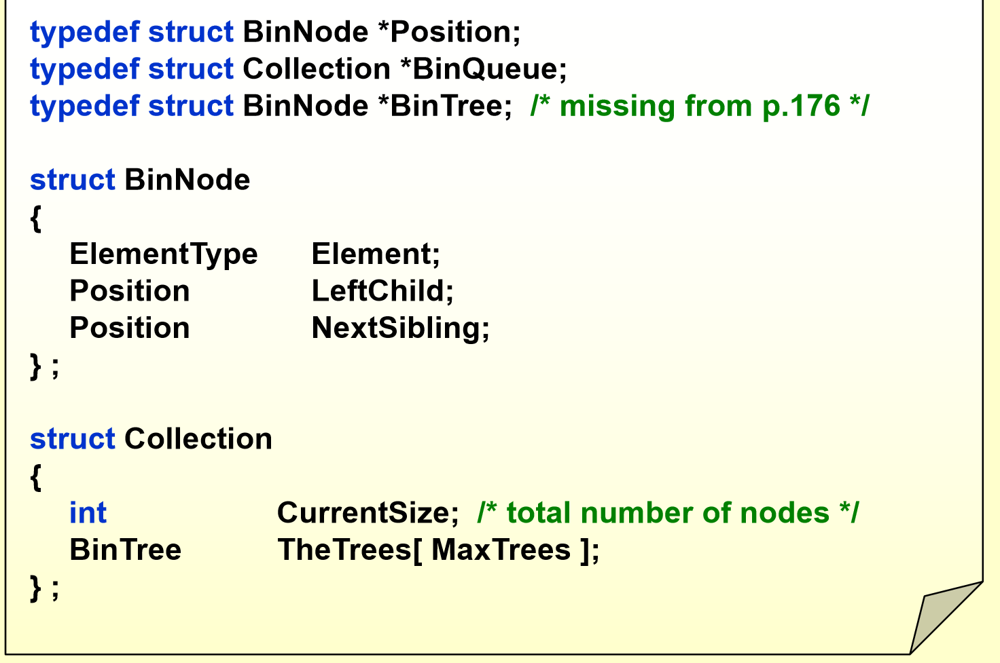
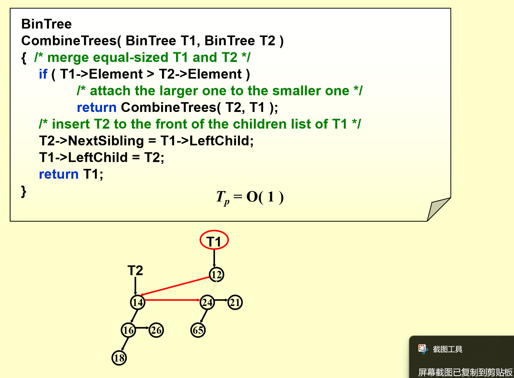
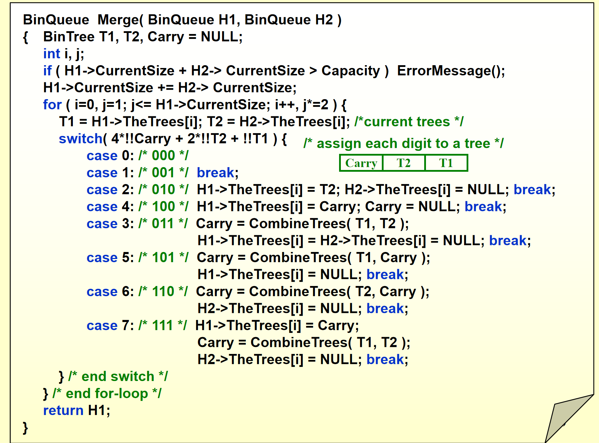
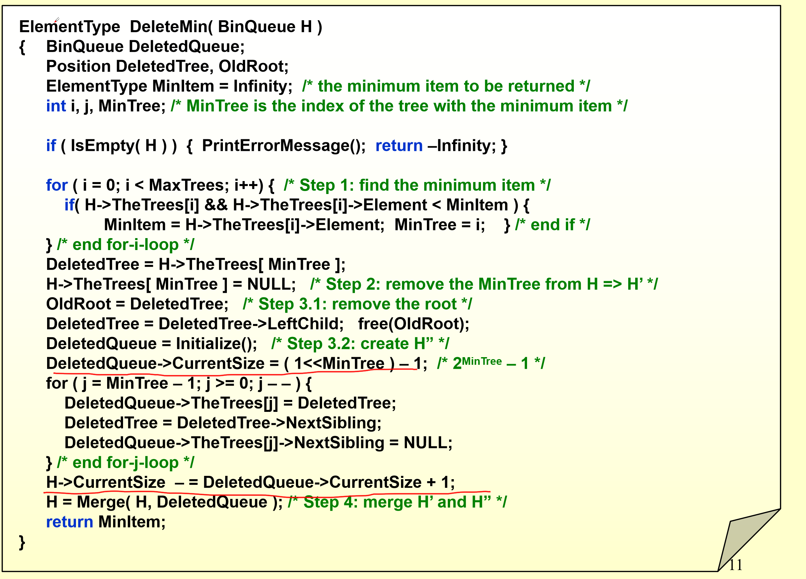
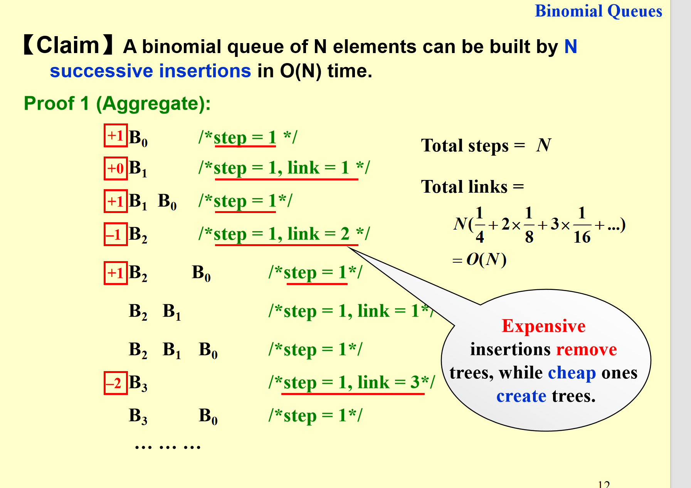
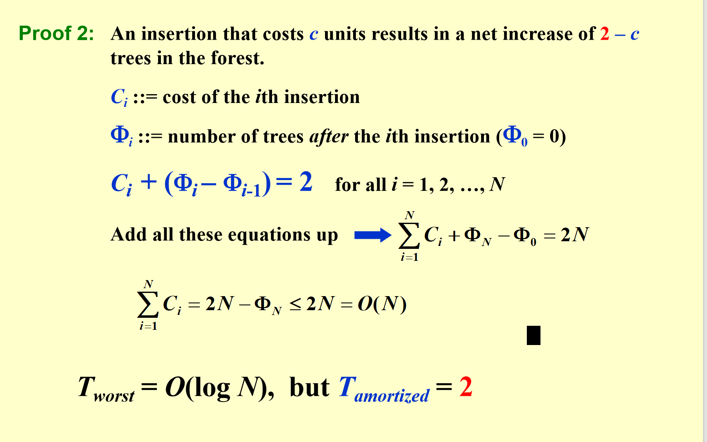

# binomial heap 二项队列

## 定义

上一节课我们用斜堆把合并变成了logn

现在我们想把插入变成log1的！（起码是均摊log1）

A binomial queue is not a heap-ordered tree, but rather a collection of heap-ordered trees, known as a forest.  Each heap-ordered tree is a binomial tree.

就是说二项队列是一个森林，每个树都是二项树。

### binomial tree

递归定义

一个二项树高度为0是一个节点

一个高度为k的树 就是两个k-1的把大的根节点接在小的根节点上面

所以 二项树并不是二叉树 是多叉树

我们这里也可以看到 Bk的节点数量就是2的k次方

所以给定一个binomial heap的大小，我们就可以决定出每个树的节点大小和多少颗树。

比如13=1011

## 操作

### find operation

1.每次比每个堆的堆顶找最小 logn

2.动态维护 一个指针指向最小的 动态更新 1

### **merge operation**

我们合并两个二项堆（森林）其实可以想象成二进制加法 从小到大合并就好了

### insert operation

插入就是特殊的合并

其实我们可以发现 如果一次操作造成了比较多的树的合并（开销比较高，那么会为后面的插入省出很多时间）

有点均摊分析的意思

### deleteMin operation

删除最小值就是把最小值所在的树从森林中删除

首先找到最小值所在的树（logn）

删掉这个树（o1）

之后把头删掉 把头的子树当作一个新的森林（这就是这个数据结构的巧妙之处） （logn）

合并一下新的和旧的森林（logn）  

### decreaseKey operation

就是直接像普通的堆 上浮和下沉

## 实现

知道原理 具体实现怎么办

我们总结一下删除和合并需要的性质

deleteMin：find all the subtrees quickly

solution: 用left child next sibling pointer来处理（这样删除后可以直接找到所有子树）

merge:the children are ordered by their sizes

solution： 维护子树从大到小排序 这样连接的时候方便（因为一下就能找到大的）

### 代码

### 插入是o1的均摊证明

1.直接分析

很容易找到规律

2.均摊分析

势能函数是子树数量

