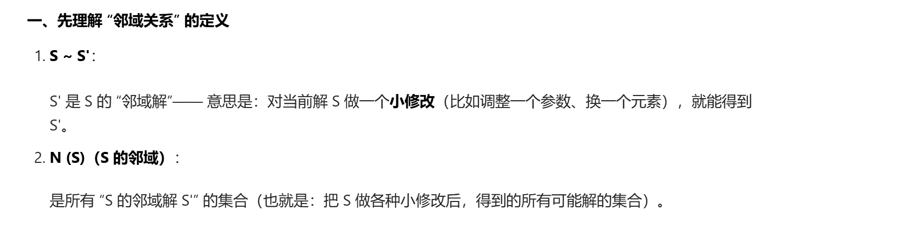
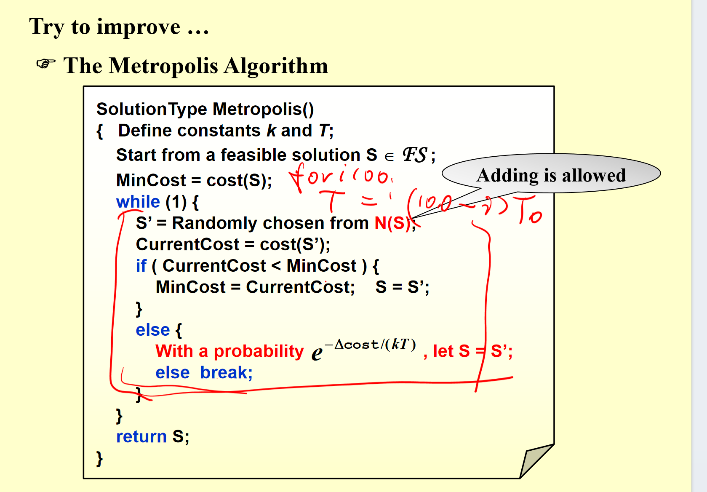
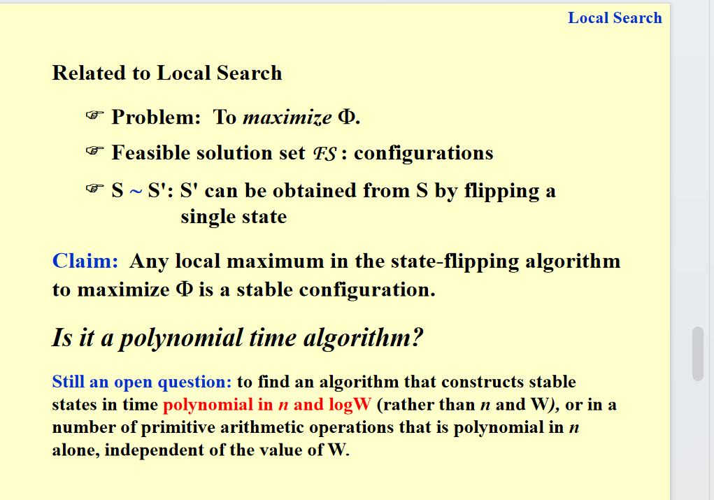
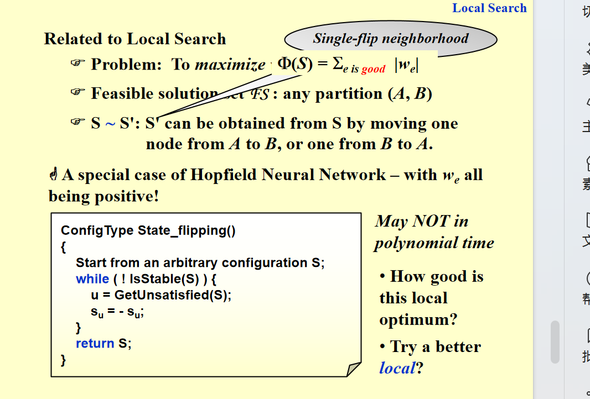
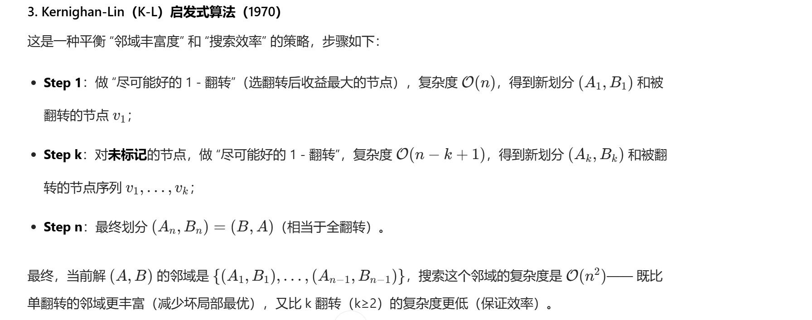

# local search

## 基础概念

这是**优化算法中“局部搜索”相关的核心概念**，通俗解释如下：

### 1. Local（局部相关定义）

- 先在“可行解集合”（满足问题条件的所有可能解）里，定义“邻域（neighborhoods）”——可以理解为“某个解周围的其他解的集合”（比如一个方案附近、稍微调整后的方案）。
- **局部最优（local optimum）**：就是“在某个邻域范围内，最好的那个解”（但它不一定是整个问题的全局最优解）。

### 2. Search（局部搜索的流程）

- 先从一个“可行解”（满足条件的初始方案）开始，在它的邻域里找“更好的解”。
- 当邻域里已经找不到能改进的解时，就达到了“局部最优”。

简单说：这是**局部搜索算法的逻辑**——从初始方案出发，只在“附近方案”里找更好的，直到附近没更好的了，就停在“局部最优”（类似“爬山爬到山顶，周围没更高的地方，就认为到了最高点”）。

### 邻域解

所以一种搜索的方式就是去找邻域解，然后选一个最好的。

## 例子

PPT有一个顶点覆盖的例子，我们认为：顶点覆盖问题就是：给定一个图，求一个顶点集，使得这个图中的每一条边都至少有一个顶点在在这个顶点集里。

初始可行解：选择图中的所有顶点，显然这是一个顶点覆盖。

邻域解：从当前解中，删除一个顶点，或者添加一个顶点。

之后就从邻域解看有没有更好的，有就更新重复，没有就直接停止。

但这样容易陷入局部最优

### 优化

我们的想法是让局部搜索跳出局部最优，继续寻找更好的解。即便这个解不如原来的好，也有一定的概率选择。（也是给了一个反悔的机会）

这其实也就是模拟退火算法：一开始的时候T最高，鼓励探索，之后慢慢下降。

## 例子hopfield neural network

这两张PPT在讲**Hopfield神经网络的“局部搜索”模型**，核心是用图来建模网络状态，并定义“好的配置”：

### Hopfield网络的模型设定

把Hopfield网络抽象成**带权图G=(V,E)**：

- 节点（V）：对应神经网络的神经元，状态是 `±1`（比如`s_u=1`或`s_u=-1`）。
- 边权（w）：是整数（可正可负），代表节点状态的约束：
  - 若边权 `w_e < 0`（e连接u和v）：要求u和v**状态相同**（sₙ=sᵥ）；
  - 若边权 `w_e > 0`：要求u和v**状态不同**（sₙ≠sᵥ）；
  - `|wₑ|`是这个约束的“强度”。

但问题是：**可能没有配置能满足所有边的约束**，所以需要找“足够好”的配置。

### “好配置”的定义（局部搜索的目标）

为了衡量配置的“好坏”，定义了3个概念：

1. **好边（good edge）**：
   若边e=(u,v)满足 `wₑ·sᵤ·sᵥ < 0`，则是“好边”（对应约束被满足：wₑ<0时sᵤ=sᵥ，wₑ>0时sᵤ≠sᵥ）；否则是“坏边（bad edge）”。

2. **满意节点（satisfied node）**：
   对节点u，它关联的**好边的权重总和 ≥ 坏边的权重总和**，数学上等价于：
   $$\sum_{v: e=(u,v)∈E} w_e s_u s_v ≤ 0$$
   （因为好边贡献`wₑsᵤsᵥ<0`，坏边贡献`>0`，总和≤0说明好边的“总强度”压过坏边）。

3. **稳定配置（stable configuration）**：
   所有节点都“满意”的配置，这是局部搜索要找的目标。

之后 我们发现 如果一个节点是坏的 那么我们如果翻转这个节点的状态的话 就会变成一个好的节点。

### 局部搜索算法

那我们就有一个算法了：遇到坏的节点就翻转，然后继续找下一个坏节点，直到没有坏节点为止。

有个问题 这个节点一定会停止吗？因为这个节点变好 可能会有其他节点因此变坏。

答案是会停止

### 1. 核心断言（Claim）

状态翻转算法（通过翻转“不满意节点”的状态来优化配置），最多经过 \( W = \sum_e |w_e| \) 次迭代，一定会终止在一个稳定配置。

### 2. 证明思路（Proof）

引入一个“进度度量函数” \( \Phi(S) \)：
\( \Phi(S) = \sum_{e是好边} |w_e| \)
（即当前配置中，所有“好边”的权重绝对值之和）

### 3. 状态翻转时的Φ变化

当翻转某个节点 \( u \) 的状态（从配置 \( S \) 变成 \( S' \)）：

- 与 \( u \) 相连的**好边**会变成坏边（从 \( \Phi \) 中移除这些边的 \( |w_e| \)）；
- 与 \( u \) 相连的**坏边**会变成好边（向 \( \Phi \) 中加入这些边的 \( |w_e| \)）；
- 其他边的状态不变。

因此 \( \Phi(S') = \Phi(S) - \sum_{e是u的好边} |w_e| + \sum_{e是u的坏边} |w_e| \)。

### 4. 为什么算法会终止？

- 因为只有“不满意的节点”才会被翻转，而“不满意节点”的定义是：**其关联坏边的总权重 > 好边的总权重**（即 \( \sum_{u的坏边} |w_e| > \sum_{u的好边} |w_e| \)）。
- 所以翻转后 \( \Phi(S') - \Phi(S) = \left( \sum_{u的坏边} |w_e| - \sum_{u的好边} |w_e| \right) > 0 \)，即 \( \Phi(S) \) 会**严格增大**。

又因为 \( \Phi(S) \) 的范围是 \( 0 \leq \Phi(S) \leq W \)（W是所有边权重绝对值的总和），所以 \( \Phi(S) \) 最多只能增大 \( W \) 次（每次至少增加1）。当 \( \Phi(S) \) 无法再增大时，所有节点都是“满意”的（即稳定配置），算法终止。

这个是一个最优的答案的算法，但是这不是多项式的o，是和W有关的，也就是指数的

事实上，翻转一个节点就是在邻域里找一个更好的解，这就是局部搜索。

## 例子:最大割

我们要在这个最大割问题**实际上是比上一个条件强一点的问题**，找到一个多项式时间(也就是和n logw相关的)的近似算法。

这张PPT在介绍**最大割问题（Maximum Cut Problem）**，包括问题定义和应用场景：

### 1. 最大割问题的定义

给定一个**无向图 \( G=(V,E) \)**（节点是 \( V \)，边是 \( E \)），且每条边的权重 \( w_e \) 是正整数。
需要把节点分成两个不相交的集合 \( (A,B) \)，使得**跨割边的总权重最大**——“跨割边”指一个端点在 \( A \)、另一个端点在 \( B \) 的边，总权重记为：
$$w(A,B) = \sum_{\substack{u \in A, v \in B}} w_{uv}$$

### 2. 应用场景

- **玩具应用（Toy application）**：
  比如有 \( n \) 个活动、\( m \) 个人，每个人想参加2个活动。需要把每个活动安排在“上午”或“下午”，目标是让**尽可能多的人能参加自己选的两个活动**（即这两个活动要在同一时间段，对应图中“同集合的边”；而最大割问题的“跨割边”对应无法同时参加的情况，这里是用场景类比图的划分逻辑）。

- **实际应用（Real applications）**：
  常见于电路布局（比如把电路元件分成两组以优化布线）、统计物理（比如粒子状态的分组建模）等领域。

### 思路

这个问题其实也可以看成是上一个问题 只不过 这里的权重都是正的（都希望一个-1和1） -1就相当于一组 1就是另一组 我们想让好边的值最大。

此时我们还是执行上面那个局部搜索 我们可以证明 这个搜索的结果近似比为2

#### 证明

设 \( (A,B) \) 是最大割的**局部最优划分**（通过单节点翻转无法提升割的权重），\( (A^*,B^*) \) 是**全局最优划分**，则：
$$w(A,B) \geq \frac{1}{2} w(A^*,B^*)$$
（即局部最优的割权重，至少是全局最优的50%）

#### 2. 证明思路

- 第一步：利用“局部最优”的性质
  因为 \( (A,B) \) 是局部最优，所以对任意节点 \( u \in A \)，满足：\( u \) 在 \( A \) 内部的边权和 \( \leq u \) 到 \( B \) 的边权和（这是“满意节点”的定义，否则翻转 \( u \) 会提升割权重）。

- 第二步：对所有 \( u \in A \) 求和
  左边求和后是“\( A \) 内部边权和的2倍”（每条边被两个端点各算一次），右边是 \( A \) 到 \( B \) 的割权重 \( w(A,B) \)，因此：
  $$2 \sum_{\{u,v\} \subseteq A} w_{uv} \leq w(A,B)$$
  同理，对 \( B \) 内的节点求和可得：
  $$2 \sum_{\{u,v\} \subseteq B} w_{uv} \leq w(A,B)$$

- 第三步：关联全局最优
  全局最优的割权重 \( w(A^*,B^*) \) 不会超过“所有边的总权重”（因为割最多包含所有边），而所有边的总权重 = \( A \) 内边权和 + \( B \) 内边权和 + \( w(A,B) \)。

  结合前两步的结论（\( A \) 内、\( B \) 内边权和都 \( \leq \frac{1}{2}w(A,B) \)），可得：
  $$w(A^*,B^*) \leq \sum_{\{u,v\} \subseteq A} w_{uv} + \sum_{\{u,v\} \subseteq B} w_{uv} + w(A,B) \leq \frac{1}{2}w(A,B) + \frac{1}{2}w(A,B) + w(A,B) = 2w(A,B)$$

  整理后就是 \( w(A,B) \geq \frac{1}{2}w(A^*,B^*) \)。

这还不是一个多项式啊

### 多项式时间算法

我们可以在一个顶点可以提升比较大的时候才去翻转它

这张PPT是在**改进局部搜索算法（提出“大改进翻转”策略）**，解决原算法的时间复杂度问题，同时提升解的质量：

### 1. 背景：原算法的不足

之前的状态翻转算法**可能不是多项式时间**，因此调整策略：当没有“足够大”的改进时，就停止算法。

### 2. “大改进翻转”的规则

只选择翻转后能让割值（跨割边权重）**至少增加** \( \frac{2\varepsilon}{|V|} w(A,B) \) 的节点（其中：

- \( \varepsilon \) 是一个小正数（控制改进的“幅度要求”）；
- \( |V| \) 是节点数；
- \( w(A,B) \) 是当前割的权重）。

### 3. 两个核心断言

- **断言1（解的质量）**：
  算法终止后，得到的割 \( (A,B) \) 满足：\( (2+\varepsilon) w(A,B) \geq w(A^*,B^*) \)
  （即局部最优解的割权重，与全局最优的差距被控制在 \( \varepsilon \) 范围内，比之前“至少1/2”的质量更好）。

- **断言2（终止时间）**：
  算法最多迭代 \( \mathcal{O}\left( \frac{n}{\varepsilon} \log W \right) \) 次（\( n=|V| \) 是节点数，\( W \) 是边权总和），这是**多项式时间复杂度**（因为 \( n \)、\( \log W \) 都是多项式/对数级）。

要证明这两个断言，我们需要结合**割值的变化规律**和**算法的终止条件**来推导：

### 断言1：终止时 \( (2+\varepsilon) w(A,B) \geq w(A^*,B^*) \)

#### 前置知识：翻转节点的割值变化

对任意节点 \( u \)，将其从一个集合（如 \( A \)）翻转到另一个集合（如 \( B \)），割值的变化为：
$$\Delta_u = \text{新割值} - \text{原割值} = 2 \cdot \left( \sum_{v \in \text{原集合}} w_{uv} - \sum_{v \in \text{另一集合}} w_{uv} \right)$$
（解释：翻转后，“原集合内的边”变成跨割边，“跨割边”变成原集合内的边，因此变化量是两者的差的2倍）

#### 算法终止条件

算法终止时，**没有节点翻转能让割值增加至少 \( \frac{2\varepsilon}{|V|} w(A,B) \)**，即对所有节点 \( u \)：
$$\Delta_u < \frac{2\varepsilon}{|V|} w(A,B)$$

#### 对所有节点求和

将所有节点的 \( \Delta_u \) 求和：
左边（所有节点的 \( \Delta_u \) 之和）：
$$\sum_{u \in V} \Delta_u = 2 \cdot \left( w(A,A) + w(B,B) - w(A,B) \right)$$
（其中 \( w(A,A) \) 是 \( A \) 内部的边权和，\( w(B,B) \) 是 \( B \) 内部的边权和；推导：对 \( A \) 内节点求和得到 \( 2w(A,A) - w(A,B) \)，对 \( B \) 内节点求和得到 \( 2w(B,B) - w(A,B) \)，相加后化简）

右边（所有节点的上界之和）：
$$\sum_{u \in V} \frac{2\varepsilon}{|V|} w(A,B) = 2\varepsilon \cdot w(A,B)$$

#### 关联全局最优

由终止条件的不等式：
$$2 \cdot \left( w(A,A) + w(B,B) - w(A,B) \right) < 2\varepsilon \cdot w(A,B)$$
整理得：
$$w(A,A) + w(B,B) < (1+\varepsilon) \cdot w(A,B)$$

而**全局最优割 \( w(A^*,B^*) \leq \text{总边权} = w(A,A) + w(B,B) + w(A,B) \)**，代入上式：
$$w(A^*,B^*) < (1+\varepsilon)w(A,B) + w(A,B) = (2+\varepsilon)w(A,B)$$
即 \( (2+\varepsilon) w(A,B) \geq w(A^*,B^*) \)，断言1得证。

### 断言2：算法终止于 \( \mathcal{O}\left( \frac{n}{\varepsilon} \log W \right) \) 次翻转

#### 每次翻转的割值增长

算法每次翻转节点时，割值至少增加 \( \frac{2\varepsilon}{n} w(A,B) \)（\( n=|V| \)），因此翻转后的割值满足：
$$w'(A,B) \geq w(A,B) + \frac{2\varepsilon}{n} w(A,B) = w(A,B) \cdot \left( 1 + \frac{2\varepsilon}{n} \right)$$

#### 对数级增长的迭代次数

设初始割值为 \( w_0 \)，最大可能的割值为 \( W \)（总边权）。需要计算多少次增长能达到 \( W \)：
$$w_0 \cdot \left( 1 + \frac{2\varepsilon}{n} \right)^t \leq W$$

对两边取对数（利用 \( \log(1+x) \geq \frac{x}{2} \)，当 \( x \) 较小时）：
$$t \cdot \log\left( 1 + \frac{2\varepsilon}{n} \right) \leq \log\left( \frac{W}{w_0} \right)$$
$$t \leq \frac{\log\left( \frac{W}{w_0} \right)}{\frac{\varepsilon}{n}} = \frac{n}{\varepsilon} \cdot \log\left( \frac{W}{w_0} \right)$$

#### 简化复杂度

由于 \( \log\left( \frac{W}{w_0} \right) = \mathcal{O}(\log W) \)（假设初始割值 \( w_0 \) 是常数），因此迭代次数 \( t = \mathcal{O}\left( \frac{n}{\varepsilon} \log W \right) \)，断言2得证。

### 改进

我们现在觉得一次就翻转一个不是很好，因为邻域有点小，不够丰富。我们想想一次能不能翻转k个呢？但搜索邻域的复杂度是 \(\mathcal{O}(n^k)\)（k 越大，复杂度越高，难以实用）

因此有一种启发式算法 平衡搜索效率和丰富程度

