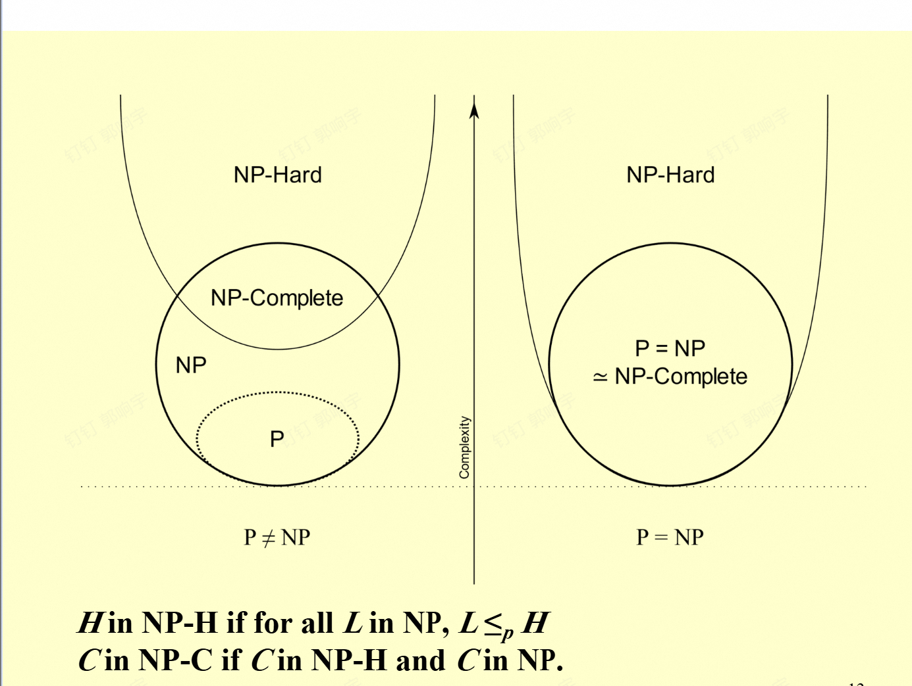
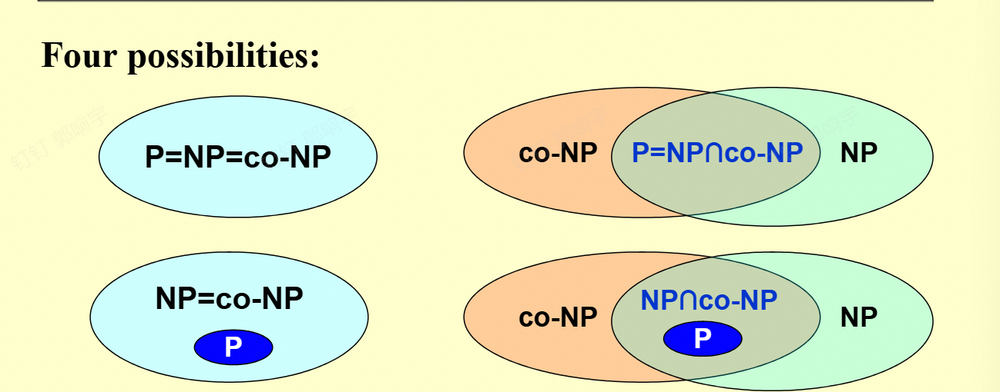

# p和np问题

## 引入

两个问题：
1.找一个欧拉回路:简单问题 可以在多项式时间解决
2.找一个哈密顿回路:困难问题 不好说了

## **如何定义一个统一的空间来比较所有可计算问题的复杂度**

- **问题背景**：可计算问题存在**不同的输入形式**（如图、集合、数组等）、**不同的算法**和**不同的目标**（如优化、存在性检查、搜索等），需要一种统一方式来比较它们的复杂度。

- **形式化方法**：
  - 将所有输入**形式化为二进制串**（如`01001101...`）；
  - 以**图灵机**作为统一的计算模型；
  - 将问题转化为**0或1的决策问题**（即判定某性质是否成立，能或者不能，存在或者不存在）。

- **复杂度层级**：通过这种形式化，可建立复杂度的比较序列：
  多项式时间可判定（P） ≤ 多项式时间可验证（np） ≤ 指数时间可解 ≤ … ≤ 不可判定。

## 图灵机

这张幻灯片在讲解**图灵机（Turing Machine）的组成与操作**，它是计算理论中用于形式化描述“可计算性”的核心模型，也是理解NP类（非确定性多项式时间问题）的基础。

### 1. 图灵机的组成（Components）

图灵机由两部分核心组件构成：

- **Infinite Memory（无限内存）**：通常表现为一条“无限长的纸带”，纸带上的每个单元可存储符号，是图灵机的“数据存储区”。
- **Scanner（扫描器/读写头）**：负责读取、修改纸带上的符号，并控制自身移动，是图灵机的“执行单元”。
（注：还隐含“有限控制状态”——图灵机的内部状态集合，用于决定下一步操作。）

### 2. 图灵机的操作（Operations）

图灵机通过以下三种基本操作实现计算：

1. **改变有限控制状态**：图灵机内部有有限个“状态”，操作时会从一个状态切换到另一个状态（类似程序的“指令跳转”）。
2. **符号的擦写**：读写头擦除当前指向纸带单元的符号，写入一个新符号（实现“数据修改”）。
3. **读写头移动**：读写头可以向左（L）、向右（R）移动一个单元，或停在当前位置（S），以此遍历纸带、访问不同数据单元。

## P和NP问题的定义

### 1. 确定性图灵机（Deterministic Turing Machine）

每一时间点执行一条指令，然后根据该指令，进入**唯一的**下一条指令。其行为是“确定的”，每一步的后续操作没有歧义。

### 2. 非确定性图灵机（Nondeterministic Turing Machine）

可从一个有限集合中**自由选择**下一步操作；并且，若这些步骤中存在一条能导向解的路径，它**总会选择正确的那一步**。其核心是“非确定性”的选择能力，且假设能“智能”地找到正确路径。

### 3. NP（非确定性多项式时间，Nondeterministic polynomial-time）

若一个问题的**任意解都能在多项式时间内被验证是否正确**，则该问题属于NP类。也就是说，“验证解”的时间是多项式级的（尽管“找解”可能很困难）。（注意 这里多项式是相对于输入大小，因此这个解的大小也不能是指数级）

### 4. 例子：哈密顿回路问题（Hamilton cycle problem）

问题是“找到一个包含所有顶点的单一回路——即‘这个简单回路是否包含所有顶点？’”。
该问题属于NP，因为如果给出一个回路，我们可以在**多项式时间内验证**它是否包含了所有顶点。

### 5. 注意点

不是所有**可判定**的问题都属于NP。例如，“判断一个图**没有**哈密顿回路”的问题就不属于NP（因为验证“不存在”的情况难以在多项式时间内完成）。

补充：上面这个问题属于co-NP类。就是np类问题的反问题

比如：判断一个图**有**哈密顿回路的问题属于NP类，而判断一个图**没有**哈密顿回路的问题则属于co-NP类

注意co-NP不一定是np问题 比如这个 你可以验证一个回路是哈密顿的，但很难验证这个图没有哈密顿的（就是验证不存在这件事很难做到）。

也可以理解为co-NP类问题，就是反问题是np问题的问题

## P和NP问题的关系

这张幻灯片围绕**计算复杂性理论**中的 **P、NP 关系**和 **NP-完全问题**展开，核心是讲解这些概念的定义与重要性：

### 1. P与NP的包含关系

- $P \subseteq NP$（P是NP的子集）：这是确定成立的。因为如果一个问题能在**确定性多项式时间**内解决（属于P），那么验证它的解也必然能在多项式时间内完成（满足NP的定义）。
- $P \subset NP$（P是NP的真子集）：这是**未解决的著名问题（P=NP？）**，目前没有证明，所以标了问号。

### 2. NP-完全问题（NP-Complete Problems）

它是NP类中**最难的问题**，定义为：
*一个NP-完全问题具有这样的性质：**NP中的任何问题都可以在多项式时间内归约到它**（即“polynomially reduced”）。*

### 3. NP-完全问题的核心意义

如果我们能在**多项式时间内解决任意一个NP-完全问题**，那么我们就能在多项式时间内解决**所有NP中的问题**（这意味着P=NP）。
这一结论凸显了NP-完全问题在计算复杂性理论中的核心地位——它是破解“P是否等于NP”这一难题的关键。

### NP-hard问题

np-hard问题是指那些至少和NP类问题一样难的问题。换句话说，np-hard问题可能不属于NP类（即它们的解可能无法在多项式时间内被验证），但所有NP类问题都可以在多项式时间内归约到这些np-hard问题。

## 规约

规约（Reduction）是计算复杂性理论中的一个重要概念，用于描述NP类中问题的关系。

假设能把问题A归约到问题B，即：解决了问题B，就能解决问题A（通过某种转化）。 因此可以看出 如果A能规约到B，说明B至少和A一样难。

### 多项式时间规约

多项式时间规约（Polynomial-time reduction）是指将一个问题A转化为另一个问题B的过程，这个转化过程在多项式时间内完成。 注意 这个转化后的等价是双向的。

## 关系图

通过上面的讨论 我们可以发现 np-complete 问题是np和np-hard 问题的交集

## 例子：哈密顿圈和旅行商问题

核心逻辑是：已知哈密顿回路问题是NP-完全的，将其多项式归约到TSP，再结合TSP属于NP的性质，从而证明TSP的NP-完全性。

### 1. 两个问题的定义

- **哈密顿回路问题**：给定图\( G=(V,E) \)，是否存在一条简单回路，经过所有顶点一次且仅一次？
- **旅行商问题（TSP）**：给定**完全图**\( G=(V,E) \)（任意两点间都有边），边有成本，给定整数\( K \)，是否存在一条简单回路，经过所有顶点且总成本\( \leq K \)？

### 2. 证明步骤

#### （1）证明TSP属于NP

对于TSP的任意候选回路，我们可以在**多项式时间内验证**：

- 回路是否经过所有顶点；
- 回路的总成本是否\( \leq K \)。
因此，TSP属于NP。

#### （2）证明TSP是NP-C的（将哈密顿回路问题多项式归约到TSP）

构造一个与原哈密顿回路问题对应的TSP实例：

- 对于原图\( G \)的顶点集\( V \)，构造完全图\( G' \)；
- 边的成本定义：若原\( G \)中存在边\( (u,v) \)，则\( G' \)中边\( (u,v) \)的成本为\( 1 \)；否则成本为\( 2 \)；
- 令\( K = |V| \)（顶点数量）。

**等价性分析**：
原图\( G \)存在哈密顿回路，当且仅当\( G' \)中存在总成本\( \leq |V| \)的旅行商回路。

- 若\( G \)有哈密顿回路，那么该回路在\( G' \)中对应的边成本均为\( 1 \)，总成本为\( |V| \)（等于\( K \)）；
- 若\( G' \)有总成本\( \leq |V| \)的回路，由于成本为\( 2 \)的边会使总成本超过\( |V| \)，因此该回路只能由原\( G \)中的边（成本1）构成，即对应\( G \)的哈密顿回路。

综上，TSP既属于NP，又能被NP-完全问题（哈密顿回路）多项式归约到，因此**旅行商问题是NP-完全的**。

## 关系讨论实例

第一个问题：p一定是co-np吗？

是的 因为p问题可以在多项式时间内解决 所以它的反问题也能在多项式时间内解决 更别说验证了 所以p问题一定是co-np问题

第二个问题：co-np是不是np？

不好说，这个问题的答案和p是否等于np，以及其他的东西有关。（这是还没证明或者证伪的东西）

## 例子2

这张幻灯片围绕**“团问题（Clique Problem）”和“顶点覆盖问题（Vertex Cover Problem）”**展开，目标是**证明顶点覆盖问题是NP-完全的**（已知团问题是NP-完全的）。以下是关键信息的拆解：

### 1. 两个问题的定义2

- **团问题（Clique Problem）**：
  给定无向图\( G = (V, E) \)和整数\( K \)，判断\( G \)是否包含一个**至少有\( K \)个顶点的完全子图（团）**。
  形式化表示：\( \text{CLIQUE} = \{ \langle G, K \rangle \mid G \text{ 有大小为 } K \text{ 的团} \} \)。

- **顶点覆盖问题（Vertex Cover Problem）**：
  给定无向图\( G = (V, E) \)和整数\( K \)，判断\( G \)是否包含一个子集\( V' \subseteq V \)，使得\( |V'| \leq K \)，且\( G \)中**每条边都至少有一个顶点属于\( V' \)**（即\( V' \)是顶点覆盖）。
  形式化表示：\( \text{VERTEX-COVER} = \{ \langle G, K \rangle \mid G \text{ 有大小为 } K \text{ 的顶点覆盖} \} \)。

### 2. 证明步骤：① 顶点覆盖问题属于NP（\( \text{VERTEX-COVER} \in \text{NP} \)）

要证明一个问题属于NP，需说明“**可以在多项式时间内验证解的正确性**”：

- 对于输入\( x = \langle G, K \rangle \)，取顶点子集\( V' \subseteq V \)作为“证书（certificate）”\( y \)。
- 验证算法做两件事：
  - 检查\( |V'| = K \)；
  - 检查图中**每条边\( (u, v) \in E \)**，是否满足\( u \in V' \)或\( v \in V' \)。
- 这个验证过程的时间复杂度是\( O(N^3) \)（\( N \)是顶点数），属于**多项式时间**，因此\( \text{VERTEX-COVER} \in \text{NP} \)。

这张幻灯片在完成**“顶点覆盖问题是NP-完全的”**证明的关键步骤：**将团问题（CLIQUE）多项式归约到顶点覆盖问题（VERTEX-COVER）**，以证明顶点覆盖问题是**NP-难的**。

### 核心逻辑：利用“补图”建立两个问题的等价性

对于图\( G = (V, E) \)，其**补图**\( \overline{G} = (V, \overline{E}) \)，其中\( \overline{E} \)包含“所有不在\( G \)中的顶点对边”（即若\( (u, v) \notin E \)，则\( (u, v) \in \overline{E} \)）。

证明分为两个方向：

#### 1. 若\( G \)有大小为\( K \)的团，则\( \overline{G} \)有大小为\( |V| - K \)的顶点覆盖

- 设\( G \)的团为\( V' \subseteq V \)（\( |V'| = K \)）。
- 对\( \overline{G} \)的任意边\( (u, v) \in \overline{E} \)（即\( G \)中无此边）：
  由于\( V' \)是\( G \)的团，\( u \)和\( v \)不能同时属于\( V' \)（否则\( G \)中会有边\( (u, v) \)，矛盾）。因此，\( u \)或\( v \)至少有一个属于\( V - V' \)。
- 这说明\( V - V' \)覆盖了\( \overline{G} \)的所有边，即\( V - V' \)是\( \overline{G} \)的顶点覆盖，大小为\( |V| - K \)。

#### 2. 若\( \overline{G} \)有大小为\( |V| - K \)的顶点覆盖，则\( G \)有大小为\( K \)的团

- 设\( \overline{G} \)的顶点覆盖为\( V' \subseteq V \)（\( |V'| = |V| - K \)）。
- 对任意\( u, v \in V \)，若\( (u, v) \notin E \)（即\( (u, v) \in \overline{E} \)），则\( u \in V' \)或\( v \in V' \)（因为\( V' \)是\( \overline{G} \)的顶点覆盖）。
- 反过来，若\( u \notin V' \)且\( v \notin V' \)，则\( (u, v) \in E \)（否则\( (u, v) \in \overline{E} \)，但\( u, v \)都不在\( V' \)中，与顶点覆盖定义矛盾）。
- 因此，\( V - V' \)中任意两点间都有边，即\( V - V' \)是\( G \)的团，大小为\( |V| - |V'| = K \)。

### 归约的时间复杂度

补图\( \overline{G} \)的构造时间为\( O(N^2) \)（\( N \)是顶点数），属于**多项式时间**。因此，这是一个**多项式时间归约**（即\( \text{CLIQUE} \leq_p \text{VERTEX-COVER} \)）。

结合之前证明的“顶点覆盖问题属于NP”，可得出结论：**顶点覆盖问题是NP-完全的**。）
