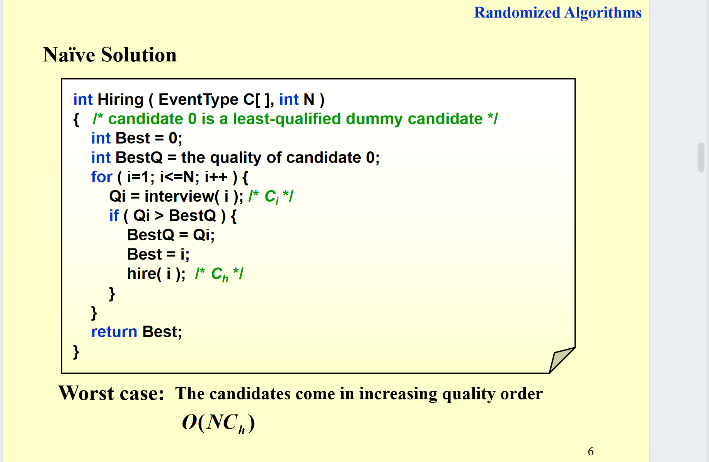
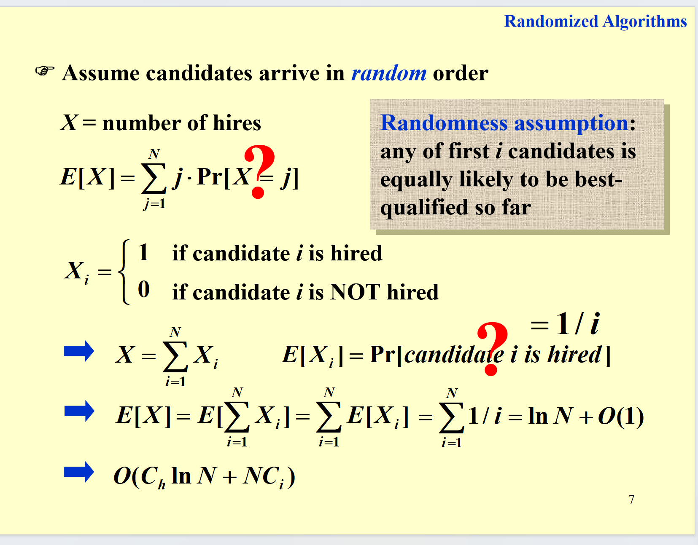
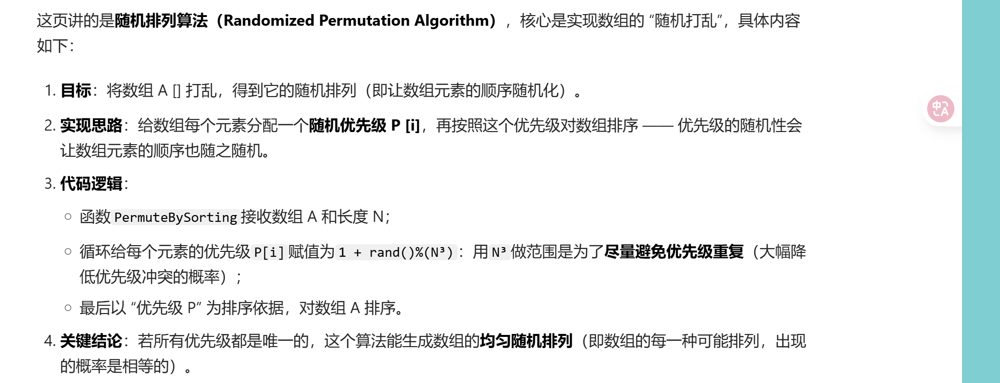
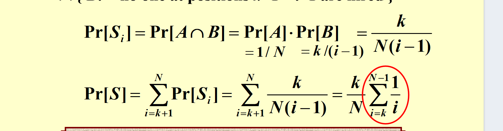

# 随机化

## 随机算法的概念

这个PPT是在解释“为什么要使用随机化算法（Randomized Algorithms）”，核心是说明随机化算法的价值：

1. **覆盖更广泛的场景**：
   高效且“总是正确”的确定性算法，其实是随机化算法的**特殊情况**。随机化算法分两种：
   - 只需“高概率正确”的高效随机化算法；
   - 总是正确、但**期望运行效率高**的随机化算法。

2. **解决分布式系统问题**：
   能实现分布式系统中进程之间的“打破对称性”（避免进程间冲突、死锁等）。

3. **更简洁**：
   随机化算法的设计往往比确定性算法更简单。

## 雇佣人问题

这页是随机化算法中的经典例子——“雇佣问题”，核心在说明问题场景和成本模型：

1. **场景设定**：

- 要从猎头处雇佣办公室助理；
- 连续N天，每天面试1个不同的申请者。

2 **成本规则**：

- 面试成本（\( C_i \)）远小于雇佣成本（\( C_h \)）；
- 分析重点是“面试+雇佣的总成本”（而非算法运行时间）。

3 **总成本计算**：
若最终雇佣了\( M \)个人，总成本为 \( O(NC_i + MC_h) \)（即N次面试的成本 + M次雇佣的成本）。

### 第一个想法

我遇到更优秀的我就要 但是如果是从低到高来 那就毁了 都雇佣了。



### 第二个想法



我们假设来的是随机的 我们还是遇到更优秀的我就要，可以看上面的ppt，雇佣人数的期望可以拆成每个人是否被雇佣的期望，而且 第i个人的被雇佣的概率就是1/i（这是因为对于任意一个排列 如果第i个人被雇佣，那他的值是前i个人中最大的，而前i-1个人的排列是随机的，所以第i个人被雇佣的概率就是(i-1)!/i!=1/i）。

那如何打乱呢？

随机打乱一个数组，我们可以用一个随机数生成器来生成一个随机数，然后交换这个随机数和数组中的第i个元素。

``` c++
void shuffle(vector<int>& nums) {
    for (int i = 0; i < nums.size(); i++) {
        int j = rand() % (i + 1);
        swap(nums[i], nums[j]);
    }
}
```

还有一种nlogn的方法 

### 第三个想法

就是我们对于前K个人都是看看 不雇佣 之后从k+1个人开始雇佣第一个比前K个人都优秀的。 雇佣到一个就停止

那我们现在想知道 对于给定的k 雇佣到的人是最好的的概率是多少？

我们可以把前k个人中最优秀的记为A 那么要雇佣到最优秀的人B的话 B必须在k+1到n之间出现 并且在k+1到B-1之间没有比A更优秀的。

对于Si=第i个位置的人是最优秀的 Si发生（最优秀的人被雇佣）就是两个条件 1.最优秀的在i上 2. k+1到i-1之间没有人被雇佣。 这两个显然独立



那么 经过简单的推导 我们可以得到 这个选到最优的人的概率是

$$
\frac{k}{N} \sum_{i=k}^{N-1} \frac{1}{i}
$$

---

进一步，PPT中给出了更详细的概率表达式和估算：

$$
\Pr[S] = \sum_{i=k+1}^{N} \Pr[S_i] = \sum_{i=k+1}^{N} \frac{k}{N(i-1)} = \frac{k}{N} \sum_{i=k}^{N-1} \frac{1}{i}
$$

并且有如下不等式估计：

$$
\frac{k}{N} \ln\left(\frac{N}{k}\right) \leq \Pr[S] \leq \frac{k}{N} \ln\left(\frac{N-1}{k-1}\right)
$$

- **问题1**：对于给定的 $k$，我们雇佣到最优秀候选人的概率是多少？（解决）
- **问题2**：如何选择最优的 $k$ 以最大化上述概率？

进一步讨论：

> 讨论：$f(k) = \frac{k}{N} \ln\left(\frac{N}{k}\right)$ 的最大值是多少？最优的 $k$ 是多少？
> 求导

通过求导可得 极值 k=N/e

此时概率为：1/e

## 随机化算法例子：快速排序（Quicksort）

【Example】Quicksort

- **Deterministic Quicksort（确定性快速排序）**
  - $\Theta(N^2)$ 最坏情况下的运行时间
  - $\Theta(N \log N)$ 平均情况下的运行时间，*假设每种输入排列出现的概率相等*

- 如果我们**随机选择主元（pivot）**会怎样？

- **Central splitter**：主元将集合分成两部分，每一侧至少包含 $n/4$ 个元素

- **Modified Quicksort**：每次递归前总是选择 central splitter 作为主元

---

### 关于 Central Splitter 的分析

- **结论（Claim）**：期望找到一个 central splitter 所需的迭代次数最多为 2。
- $N/2$ 个 central splitters，因此 $\Pr[\text{find a central splitter}] = 1/2$

- **Type $j$**：如果子问题 $S$ 满足 $N\left(\frac{3}{4}\right)^{j+1} \leq |S| \leq N\left(\frac{3}{4}\right)^j$，则称 $S$ 为 type $j$。

- **结论（Claim）**：type $j$ 的子问题最多有 $\left(\frac{4}{3}\right)^{j+1}$ 个。

- $E[T_{\text{type }j}] = O\left(N\left(\frac{3}{4}\right)^j\right) \times \left(\frac{4}{3}\right)^{j+1} = O(N)$

- 不同 type 的数量为 $\log_{4/3} N = O(\log N)$

- **总复杂度**：$\mathcal{O}(N \log N)$

---
