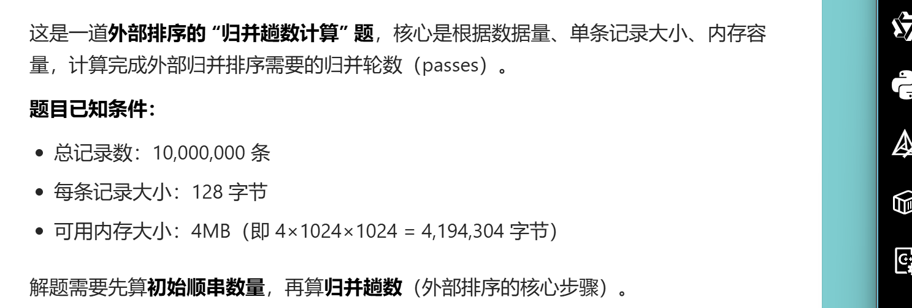
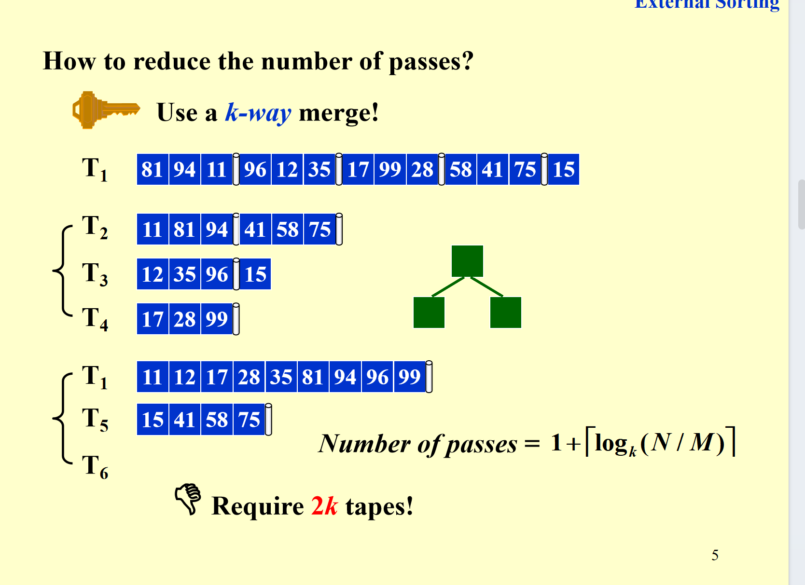
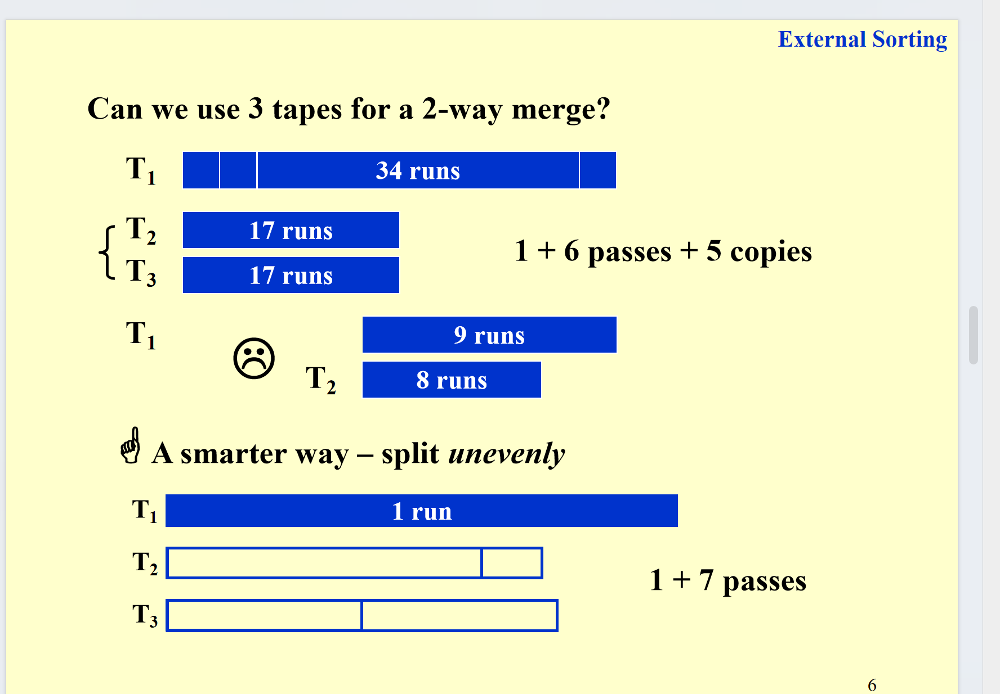
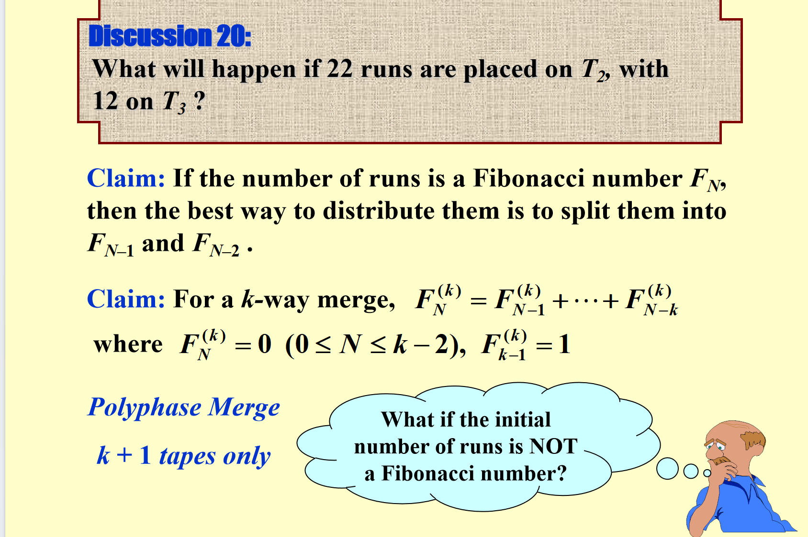
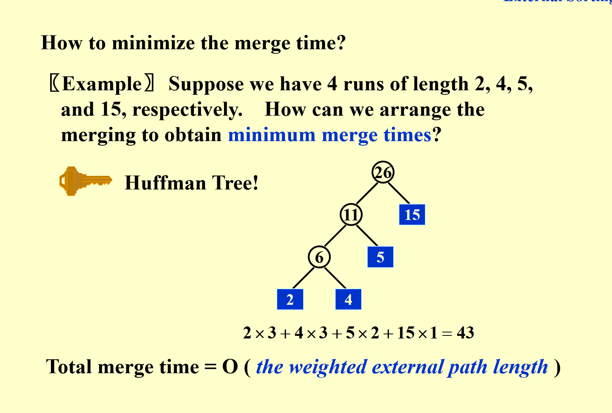

# 外部排序

## 引入

核心是解释“为啥不能在磁盘上直接用快速排序”：

- 内存里访问数据（比如取a[i]）是“秒拿”，时间复杂度O(1)；
- 但磁盘（硬盘）访问数据得走三步：找磁道→找扇区→传输，是机械/设备级的慢操作（随机访问开销超大）。

而快速排序需要频繁“随机挑数据、交换数据”，在磁盘上这么折腾的话，IO耗时会把效率拖到崩溃~

所以外部排序的常用工具是**归并排序**：它适合“顺序访问”的存储（比如磁带），搭配至少3个磁带驱动器，靠“分块排序+顺序归并”来减少磁盘/磁带的随机IO开销。

说到底 外部排序是给磁盘的数据排序

## 基础的外部排序

这张幻灯片是**外部归并排序的具体示例**，演示了“内存有限时，如何给大数据集排序”（这里内存一次只能存3条记录），步骤分2个核心阶段：

### 1. 生成“初始顺串（Run）”

待排序数据存在磁带T₁里，先把T₁的数据**按内存容量（3条）分块**：

- 每3条读入内存，内部排序后，写到其他磁带（T₂、T₃）；
- 比如T₁里的`81、94、11`读入内存，排好是`11、81、94`，写到T₂；
- 下一块`96、12、35`读入内存排好`12、35、96`，写到T₃；
- 以此类推，最后T₂、T₃上会存多个“有序的小块（顺串）”。

### 2. 多轮归并顺串

把小的有序顺串，合并成更大的有序顺串，直到整个数据集有序：

- 第一轮归并：把T₂、T₃上的顺串两两归并（比如T₂的`11、81、94`和T₃的`12、35、96`归并），得到更大的顺串，写到T₁、T₄；
- 第二轮归并：再把T₁、T₄上的大顺串归并，得到最终的完整有序序列，写到T₂。

整个过程是“**分块内部排序→多轮外部归并**”，核心是利用“顺序访问”的磁带/磁盘，减少内存不足时的IO开销。

这里我说一下 你给两个磁盘上的东西进行归并 在这里 一次只能归并两个 之后必须写到另一个磁盘中。

### 计算题

要解决这道外部排序的**归并趟数问题**，需分两步计算：

### 步骤1：计算“初始顺串数量”

外部排序的第一步是将大数据集分成若干“内存大小的块”，每个块内部排序后形成**初始顺串**。

- 内存容量：\( 4\text{MB} = 4 \times 1024 \times 1024 = 4194304 \) 字节
- 内存可容纳的记录数：\( \frac{4194304}{128} = 32768 \) 条（每条记录128字节）
- 总记录数：10,000,000条
- 初始顺串数 \( r \)：\( \lceil \frac{10000000}{32768} \rceil = \lceil 305.18 \rceil = 306 \)（向上取整，因为剩下的记录也要形成一个顺串）

### 步骤2：计算“归并趟数”

外部排序的归并趟数，默认采用**2路归并**（若题目无特殊说明），公式为：
\[ \text{归并趟数} = \lceil \log_2 r \rceil \]

计算 \( \log_2 306 \)：

- \( 2^8 = 256 \)（小于306）
- \( 2^9 = 512 \)（大于306）

因此 \( \lceil \log_2 306 \rceil = 9 \)

最终结论：需要 **9趟归并**。

### 外部排序的归并操作是怎么做的

你的疑惑很关键——外部归并**不是把整个顺串都载入内存操作**，而是靠「**缓冲区+顺序读写**」的方式，用有限内存完成归并，具体逻辑是：

归并阶段的内存会被**拆分成分区（缓冲区）**，不需要加载整个顺串，只需要加载顺串的“片段”：
以2路归并为例，内存会分成3个缓冲区：

- 2个「输入缓冲区」：分别读取**两个顺串的部分数据**（比如各读几百条记录，远小于内存总容量）；
- 1个「输出缓冲区」：临时存储归并后的结果，满了就写回外存。

操作流程是：

1. 从第一个顺串读一批数据到“输入缓冲区1”，从第二个顺串读一批到“输入缓冲区2”；
2. 对比两个缓冲区里的记录，按顺序写入“输出缓冲区”；
3. 某一个输入缓冲区空了，就从对应的顺串**继续读下一批数据**到该缓冲区；
4. 输出缓冲区分满了，就把数据写回外存；
5. 重复以上步骤，直到两个顺串的所有数据都归并完成。

## 部分名词解释

- 顺串（Run）：外部排序中，内存容量大小的有序数据块，经过内部排序后形成。
- 归并趟数：外部排序中，将多个顺串合并成一个完整有序序列所需的轮数。
- 缓冲区：外部排序中，内存的**片段**，用于存储**输入**和**输出**数据。

这张幻灯片讲的是**外部排序的“核心成本与优化目标”**，分两部分：

### 一、外部排序要关注的时间成本（Concerns）

外部排序的耗时主要来自4类操作，这些是需要重点考虑的开销：

- **寻道时间**：和归并趟数挂钩（趟数越多，外存设备来回切换数据的次数越多），时间复杂度是O(归并趟数)。
- **块读写时间**：外存是按“块”读写数据的，这部分是读取/写入一整块记录的耗时。
- **内部排序时间**：把内存里的M条记录做内部排序的时间（这里什么排序都行）。
- **缓冲区归并时间**：把输入缓冲区里的N条记录，归并到输出缓冲区的时间（也是在内存中完成的）。

同时补充了一个优化点：计算机可以让**IO（外存读写）和CPU处理（排序、归并）并行进行**，这样能同时干活、节省总时间。

### 二、外部排序的优化目标（Targets）

为了提升外部排序的效率，核心要优化这几点：

- 减少归并趟数（降低寻道等开销）；
- 优化顺串的归并过程；
- 优化缓冲区管理，支持IO和CPU并行；
- 优化初始顺串的生成方式（比如生成更长的顺串）。

## 减少归并趟数

最简单的方法就是用同时使用K个磁盘，进行K路归并。

但是这样就是一共要使用2k个磁盘，这会增加IO开销。

以及需要用堆处理归并

## 我能不能只用 k路归并 只用k+1个磁盘

其实是可以的，这里我们就有一种蠢方法。还有一种更聪明的用斐波那契数列的方法。具体可以看看ppt，这样子的方法聪明的在于，每次都可以刚好清空一个磁盘。这样就为下一次归并腾出空间。

但是这种做法只在斐波那契数的runs数列中才有效。

如果不是 我们可以考虑补0把他变成是。

## 优化缓冲区管理 支持并行

### 1. 先以2-way归并为例

图里展示了2路归并的缓冲区划分：

- 用多组输入缓冲区存待归并的数据，搭配输出缓冲区存归并结果；
- 这样能实现“一边从外存读数据到输入缓冲区，一边用CPU处理已读数据”的并行操作。

### 2. k路归并的缓冲区通用规则

要实现并行操作，**k路归并需要 \( 2k \) 个输入缓冲区 + 2个输出缓冲区**：

- 2k个输入缓冲区：可以“同时读k路顺串的下一块数据”+“同时处理当前块数据”（保证IO和CPU并行）；
- 2个输出缓冲区：可以“一边写满一个缓冲区到外存，一边用另一个缓冲区存新的归并结果”。

这里我说一下 写进去可以理解为 每次每个路可以写进一个buffer（一定是自己的两个中的一个） 之后merge的时候会从buffer里读数据（应该是merge k个）

### 3. k值增大的连锁影响

当归并路数 \( k \) 增加时：

- 输入缓冲区的数量会跟着增加 → 每个缓冲区的大小会缩小；
- 缓冲区变小→磁盘读写的块尺寸也会变小→外存的寻道次数变多、寻道时间增加。

### 4. k值的最优选择

k不是越大越好：

- 虽然k增大能减少归并趟数，但超过某个临界值后，“缓冲区缩小导致的IO时间增加”会抵消趟数减少的优势，反而让总耗时上升；
- 最优的k值，需要结合**磁盘的读写参数**（比如寻道速度）和**内存中可分配给缓冲区的空间**来确定。

简单说：这页是在讲“k路归并的缓冲区怎么配，以及k值要选合适的，否则会越归并越慢”。

## 更长顺串的生成方式

这页PPT讲的是**外部排序中生成“更长初始顺串”的算法——置换选择排序（Replacement Selection）**，核心是解决“传统分块内部排序顺串太短”的问题。

### 1. 要解决的问题

传统外部排序生成初始顺串时，是把数据按“内存容量M”分块，每块内部排序得到长度为M的顺串。而**置换选择排序能生成更长的顺串**（平均长度约2M），从而减少后续归并的趟数。

### 2. 算法核心逻辑（结合例子）

置换选择排序借助“堆”来实现：

- 先把部分数据（比如内存能容纳的大小）构建成堆（图中绿色堆，堆顶是15）；
- 每次取出堆顶元素（A）并加入当前顺串，并把堆顶元素弹出；（注意 此时仍然围护堆）
，加入当前顺串；
- 从输入数据中读入一个新元素：
  - 如果新元素**大于等于堆顶（这个堆顶是弹出的那个A）**，就插入堆；（也维护堆）
  - 如果新元素**小于堆顶**，就暂存起来（不插入堆）；
- 重复上述步骤，直到堆为空，此时生成一个顺串；然后用暂存的元素重新建堆，生成下一个顺串。

### 3. 例子效果

图中输入数据用置换选择排序后，生成了更长的顺串（比如中间那串`12 17 28...99`长度远大于“内存分块的长度”），最终顺串的**平均长度约为2M**（M是内存容量）。

### 4. 适用场景

当输入数据**接近有序**时，置换选择排序的效果更好（能生成极长的顺串，进一步减少归并开销）。

简单说：置换选择排序是通过“堆+选择性插入”的方式，让初始顺串长度翻倍，从而优化外部排序的整体效率。

## 如果串不同 怎么归并时间小

这页PPT讲的是**外部排序中“最小化归并时间”的策略——用霍夫曼树（Huffman Tree）安排顺串的归并顺序**，核心是让“长顺串少参与归并，短顺串多参与”，从而降低总开销。

### 1. 问题背景

归并时间的核心开销是“顺串的长度 × 它被归并的次数”：顺串越长，被归并的次数越多，总耗时越大。所以需要合理安排归并顺序，让**长顺串尽量少参与归并**。

### 2. 例子的处理方式（霍夫曼树的应用）

已知4个顺串的长度：2、4、5、15，用霍夫曼树安排归并：

- 霍夫曼树的构建规则：每次选**长度最小的两个顺串**合并，合并后的新节点长度是两者之和；
- 步骤：
  1. 先合并最短的2和4，得到新顺串长度6；
  2. 再合并6和5，得到新顺串长度11；
  3. 最后合并11和最长的15，得到最终顺串长度26。

### 3. 为什么这样能最小化时间？

霍夫曼树的**带权外部路径长度**（每个顺串长度 × 它在树中的路径长度，即归并次数）是所有可能的归并顺序中最小的：

- 长顺串（15）的路径长度是1（只归并1次）；
- 短顺串（2、4）的路径长度是3（归并3次）。

总归并时间 = O(带权外部路径长度)，这样的安排能让长顺串的归并次数最少，从而总耗时最小。

简单说：这页是用霍夫曼树的“短的先合并、长的后合并”规则，让长顺串少参与归并，实现归并时间的最小化。
