# 并行算法

## 概述

具体来说，它包含两部分核心内容：

1. **并行性的分类（Machine parallelism）**
   - 处理器并行（Processor parallelism）
   - 流水线技术（Pipelining）
   - 超长指令字（VLIW，Very-Long Instruction Word）
   这些都属于**硬件层面的并行技术**（指令级并行等）。

2. **并行算法的描述工具**
   - 并行随机存取机（PRAM，Parallel Random Access Machine）
   - 工作-深度模型（Work-Depth，WD）
   这些是**并行算法设计与分析的经典计算模型**。

## PRAM

PRAM（Parallel Random Access Machine）是**并行随机存取机**，是**并行算法描述工具**。是一个抽象的计算机模型，它具有以下特征：

- **多个处理器**：PRAM包含多个处理器，可以同时执行多个操作。
- **同一个内存**：所有处理器共享一个全局内存空间，可以随机访问内存中的任何位置。
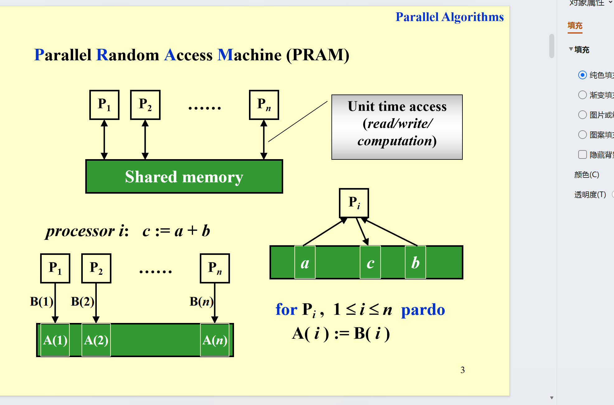

B是处理器，A是内存。

## 冲突

可能会有数据冲突

比如说，两个处理器同时写同一个内存位置，可能会导致数据冲突。

或者一个处理器读取一个内存位置，另一个处理器写入这个位置，可能会导致数据冲突。

为了解决这些冲突，PRAM模型定义了几种不同的冲突解决策略：

这是**并行计算中PRAM模型的内存访问冲突解决规则**的课件内容，属于并行算法的核心知识之一。

1. **EREW（互斥读-互斥写）**
   多个处理器不能同时读、也不能同时写同一个内存单元，完全互斥访问。
2. **CREW（并发读-互斥写）**
   允许多个处理器同时读同一个内存单元，但不能同时写。
3. **CRCW（并发读-并发写）**
   允许多个处理器同时读、同时写同一个内存单元；此时需用规则解决“写冲突”，包括：
   - 任意规则：随机选一个处理器的写操作生效
   - 优先级规则：选编号最小的处理器执行写操作
   - 公共规则：若所有处理器写的是同一个值，则允许写入

## 例子一：数组求和

这是**PRAM模型下的并行算法示例（以数组求和为例）**，同时说明了PRAM模型的局限性，属于并行算法的教学内容。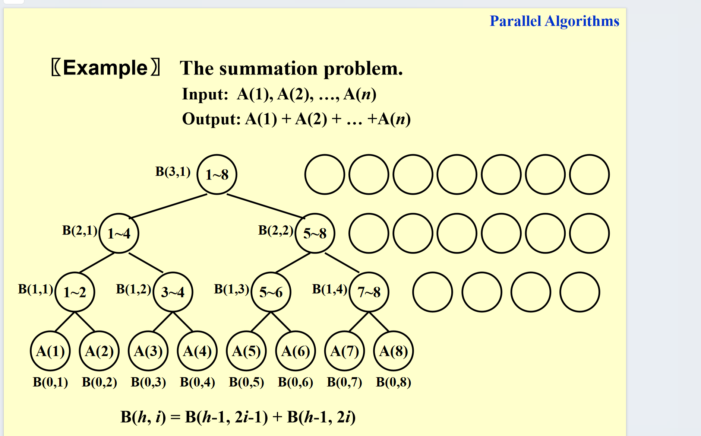

### 1. 代码是啥：PRAM并行求和算法

这段代码是用`n`个处理器（`P_i`）并行计算数组`A`的总和，核心是**二分合并式计算**：

- 初始化：所有处理器并行把`A(i)`赋值给`B(0,i)`（`B`是中间结果数组，第0层存原始数据）。
- 分层合并：循环`h=1`到`log n`（二分的层数），满足`i ≤ n/2^h`的处理器，会把上一层（`h-1`）对应的两个元素（`2i-1`和`2i`）相加，存到`B(h,i)`；不满足的处理器空闲。
- 输出结果：只有处理器1输出最终结果`B(log n,1)`（所有元素的总和），其他处理器空闲。

时间复杂度是`T(n)=log n + 2`（初始化+`log n`次合并+输出），是高效的并行算法（串行求和是`O(n)`，并行这里是对数级）。

### 2. 右边是PRAM模型的不足

PRAM是抽象的并行计算模型，但有两个局限：

- 不考虑“实际处理器数量”：没法直接适配不同处理器数的PRAM硬件。
- 指令分配太繁琐：要详细指定“哪个处理器执行哪个操作”，实际没必要（太细节、不灵活）。

而且此时所有处理器都会执行操作（静止也算） work有点多。

### WD表示

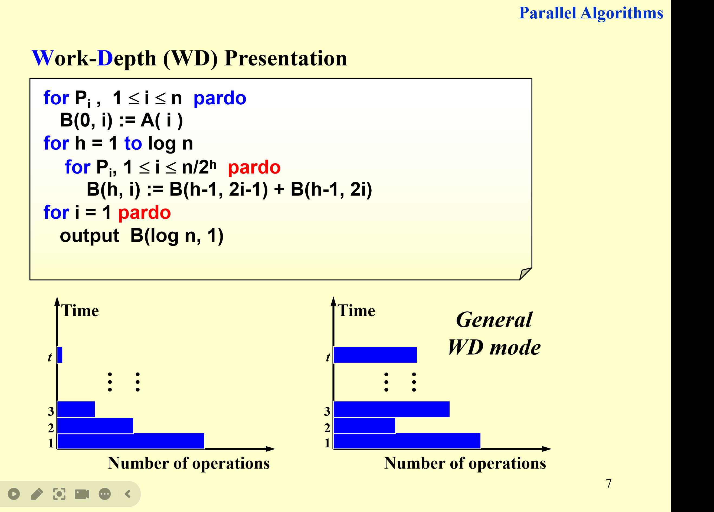
我们可以换成work - depth模型来表示这个并行算法：

- **Work（工作量）**：表示总的计算量，即所有处理器执行的操作数量（也就是那个图有多少个点）总和。
- **Depth（深度）**：表示处理器执行操作的层次，即所有处理器执行操作的层数。

同时这样计算 有些处理器就不需要管他了 比上一种方法节省了work

这是**并行算法的性能衡量方式**，核心是用“工作负载”和“运行时间”来推导不同处理器数量下的并行性能，属于PRAM模型下的性能分析内容。

### 核心概念重申（这里不重要）

先明确两个基础指标：

- **工作负载 \( W(n) \)**：算法完成任务所需的**总操作数**（相当于“总工作量”）。
- **最坏情况运行时间 \( T(n) \)**：并行算法的**最长执行时间**（处理器足够多时的关键时间指标）。

基于这两个指标，推导不同处理器数量下的运行时间（针对PRAM模型）：

1. 基础情况：算法有 \( W(n) \) 个操作，运行时间为 \( T(n) \)。
2. 所需处理器数：要维持 \( T(n) \) 的运行时间，需要 \( P(n) = \frac{W(n)}{T(n)} \) 个处理器（总工作量÷时间=并行所需的处理器数）。
3. 处理器不足时：若处理器数 \( p \leq \frac{W(n)}{T(n)} \)，运行时间为 \( \frac{W(n)}{p} \)（总工作量分给 \( p \) 个处理器，每个处理器执行 \( \frac{W(n)}{p} \) 个操作）。
4. 通用情况：无论用多少个 \( p \) 处理器，运行时间可表示为 \( \frac{W(n)}{p} + T(n) \)（并行部分+串行依赖部分）。

最后一句“All asymptotically equivalent”是指：这些不同情况的运行时间，在**渐近复杂度（大O量级）**层面是等价的（即量级相同）。

### 思考

现在我们来思考一个东西：假设有`p`个处理器，那么`Tp`是多少，也就是用`p`个处理器执行这个并行算法需要多少时间？（加n个数）

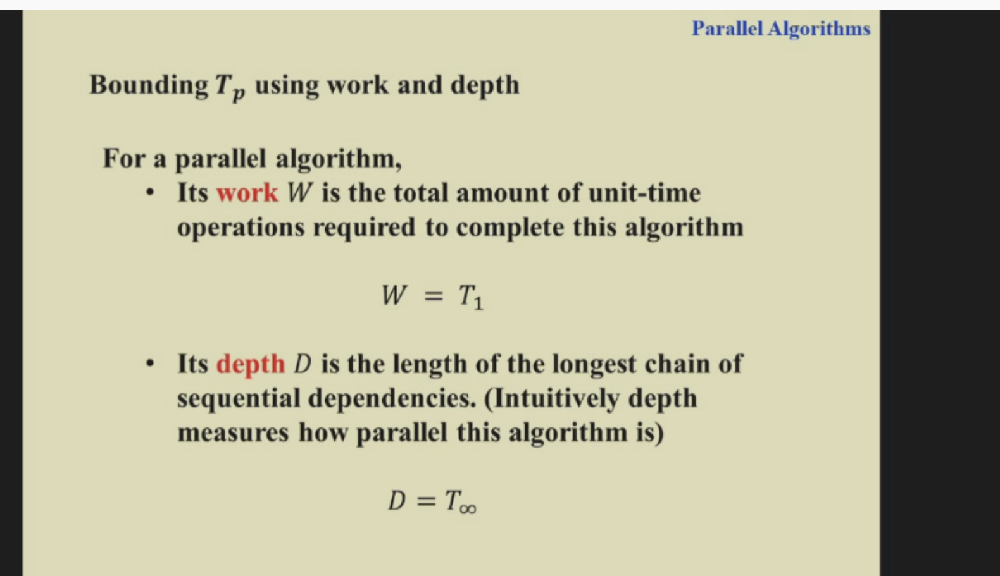
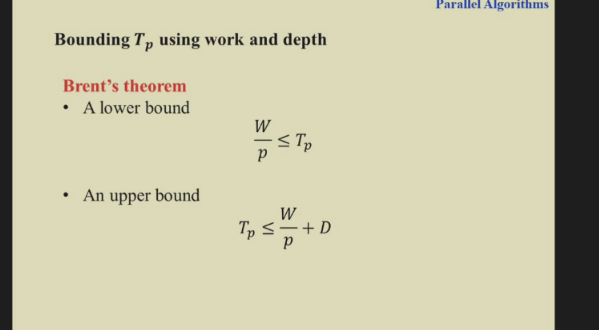

注意我这里给出的公式是通用的。

这个证明也不是很难 只用注意到 任何深度是d的算法 他的每一层假如是Wi 那么我们有Tp=sigma(Wi/p)上取整 这个就小于等于w/p+d

## 例子二：前缀和

现在我们升级一下 不只求和 而是求前缀和。

但其实这个也不难 只需要按照求和的计算 之后去从上到下根据不同情况计算前缀和就行了。

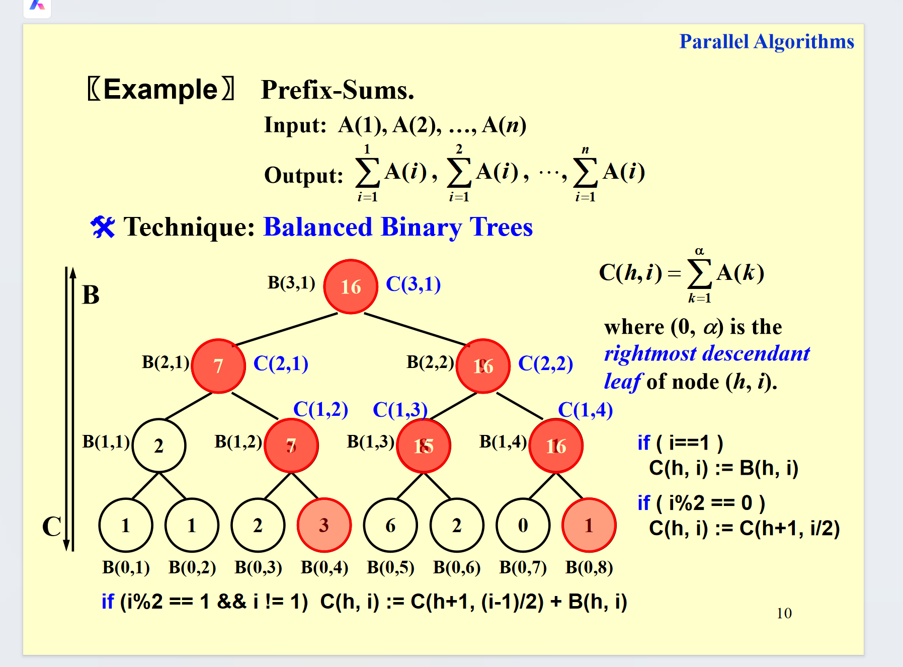

这里是具体算法可以看ppt、

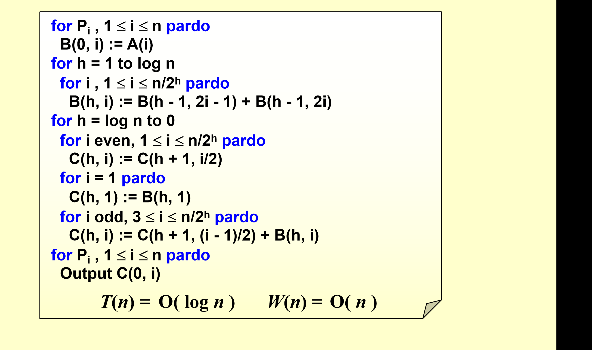

## 例子三：合并数组

这是**并行算法中“合并两个非降序数组”的解决思路**，核心是通过“划分技术”+“排序定位（Ranking）”将合并问题转化为可并行的任务。

### 合并问题与划分技术

- **问题**：把两个非降序数组 \( A(n) \) 和 \( B(m) \) 合并成一个非降序数组 \( C(n+m) \)（这里简化假设 \( n=m \)、元素互不相同等，方便分析）。
- **核心技术：Partitioning（划分）**
  把合并任务**拆成多个独立的小任务**（比如拆成 \( p \) 个），每个小任务的规模约为 \( n/p \)；然后用多个处理器**并行处理这些小任务**（每个小任务可以用串行算法完成）。

### 第13页：合并 → 排序定位（Ranking）

为了并行完成合并，先把问题转化为“排序定位（Ranking）”：

- **RANK的定义**：对 \( B \) 中的元素 \( B(j) \)，\( \text{RANK}(j,A) \) 表示它在 \( A \) 中的“插入位置”：
  - 若 \( B(j) < A(1) \)，rank=0；
  - 若 \( B(j) > A(n) \)，rank=n；
  - 若 \( A(i) < B(j) < A(i+1) \)，rank=i。

- **排序定位问题**：计算所有 \( A \) 元素在 \( B \) 中的rank，以及所有 \( B \) 元素在 \( A \) 中的rank。

- **合并的并行实现**：只要得到了rank，就能用处理器**并行赋值**：
  - \( A(i) \) 放到 \( C(i + \text{RANK}(i,B)) \) 的位置；
  - \( B(i) \) 放到 \( C(i + \text{RANK}(i,A)) \) 的位置。
  这样合并能在 \( O(1) \) 时间（并行赋值）、\( O(n+m) \) 总工作完成。

简单说，这两页是“把合并问题转化为排序定位，再用并行划分+定位结果完成高效合并”的并行算法思路。

那问题就是 怎么确定rank

这里我们计算rank可以有两种方法：
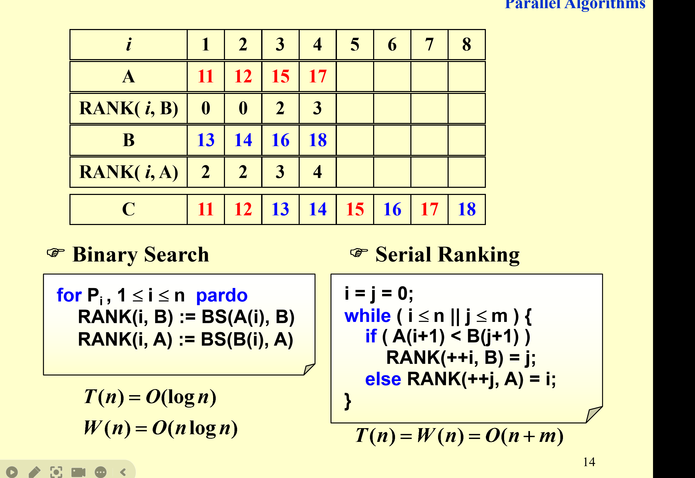
二分或者这种顺序

但是这里 我们有一个问题 如果直接并行每个元素 那W(n)有点大（或者T（n）有点大） 这是我们不想看到的。

因为我们有一个先划分成小问题的方法。

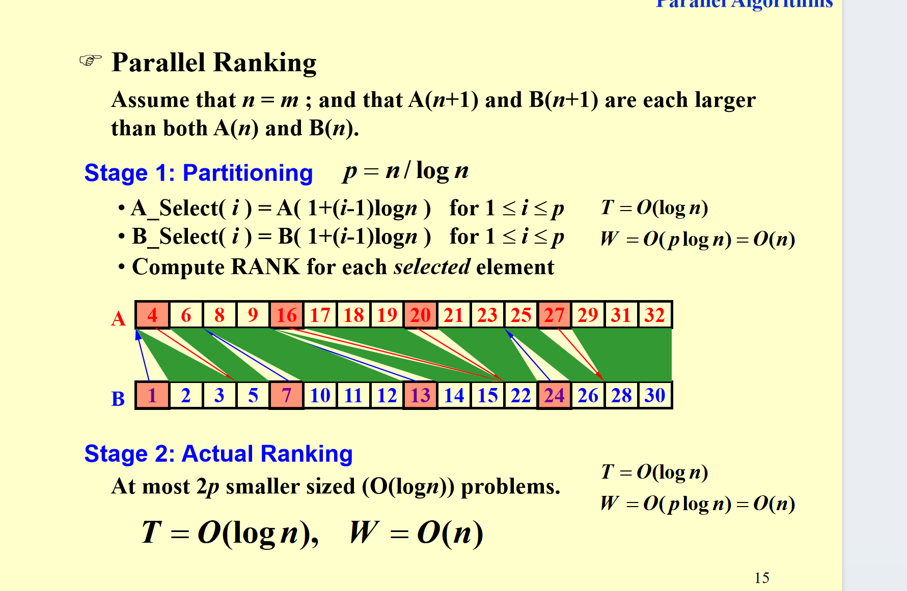

这里我们先划分成小问题 在AB选取n/logn个点 先计算他们的rank  然后对划分成的这几个不超过logn的区间用那个顺序法来求rank。

之后看分析 最后就是T（n）=O(logn) W（n）=O(n)

## 例子4：findmax

这是**并行算法中“找数组最大值（Maximum Finding）”的两种实现方法**，同时指出了第二种方法的“内存访问冲突”问题。

### 方法1：基于并行求和算法的改造

思路是**把“并行求和”里的“加法”替换成“取最大值（max）”**：

- 沿用之前并行求和的“二叉树分层合并”逻辑，每层并行比较两个元素，取较大值；
- 复杂度：时间 \( T(n) = O(\log n) \)（二叉树层数），总工作负载 \( W(n) = O(n) \)（总比较次数）。

### 方法2：全数对比较（Compare all pairs）

通过**并行比较所有元素对**来标记最大值，代码逻辑：

1. 初始化标记数组 \( B(i) = 0 \)（所有处理器并行执行）；

2. 所有元素对 \( (i,j) \) 并行比较：
   - 若 \( A(i) < A(j) \)，或 \( A(i)=A(j) \)且 \( i<j \)，则标记 \( B(i)=1 \)；
   - 否则标记 \( B(j)=1 \)；
3. 最后 \( B(i)=0 \) 的 \( A(i) \) 就是最大值。
   
- 复杂度：时间 \( T(n)=O(1) \)（所有数对并行比较），但总工作负载 \( W(n)=O(n^2) \)（共 \( n^2 \) 个数对）。

### 讨论点：访问冲突

这个方法存在**内存访问冲突**：多个处理器可能同时写同一个 \( B(i) \)（比如多个 \( j \) 与同一个 \( i \) 比较时，都会修改 \( B(i) \)）。需要用之前PRAM模型的写冲突规则（如CRCW的优先级/公共规则）来解决。

### 还有一种直接顺序比较

这种就是W(n)=O(n) T(n)=O(n)

### 方法四

这是**并行算法中的“双对数范式（Doubly-logarithmic Paradigm）”**，是一种**递归划分式的并行算法设计方法**，常用于（比如并行找最大值、排序等）问题，核心是通过“分层划分+递归求解”，将时间复杂度降低到**双对数级别（\( O(\log\log n) \)）**。

### 核心思路（以“并行找最大值”为例）

为了得到更优的并行时间，通过**递归划分数组**来逐层缩小问题规模：

1. **划分数组**：将长度为\( n \)的原数组，划分为\( \sqrt{n} \)个小组，每个小组的大小是\( \sqrt{n} \)（比如原数组\( A \)被分成\( A_1, A_2, ..., A_{\sqrt{n}} \)，每个\( A_i \)包含\( \sqrt{n} \)个元素）。
2. **小组内求解**：每个小组**并行计算自身的局部最大值**（比如\( M_1 \)是\( A_1 \)的最大值，每个小组的求解时间为\( T(\sqrt{n}) \)、工作负载为\( W(\sqrt{n}) \)）。
3. **全局合并**：将所有小组的局部最大值（共\( \sqrt{n} \)个）**并行比较**，得到整个数组的全局最大值（这一步时间为\( O(1) \)，工作负载为\( O(n) \)）。

### 复杂度递推与结果

通过递推式分析最终复杂度：

- **时间递推**：\( T(n) \leq T(\sqrt{n}) + c_1 \)（每次划分后，时间增加常数项）。
  结合假设\( n = 2^{2^h} \)（\( h = \log\log n \)），递推\( h \)次后时间收敛，最终\( T(n) = O(\log\log n) \)（即“双对数时间”）。

- **工作负载递推**：\( W(n) \leq \sqrt{n} \cdot W(\sqrt{n}) + c_2 n \)（每个小组的工作负载累加，再加全局合并的工作）。
  解递推式得\( W(n) = O(n \log\log n) \)。

这里用到了主定理

这个范式的优势是**时间复杂度极低（双对数级别）**，是并行算法中“通过递归划分优化时间”的经典设计方法，常用于对时间效率要求极高的并行问题（如大规模数据的极值查找、快速排序等）。

### 方法五

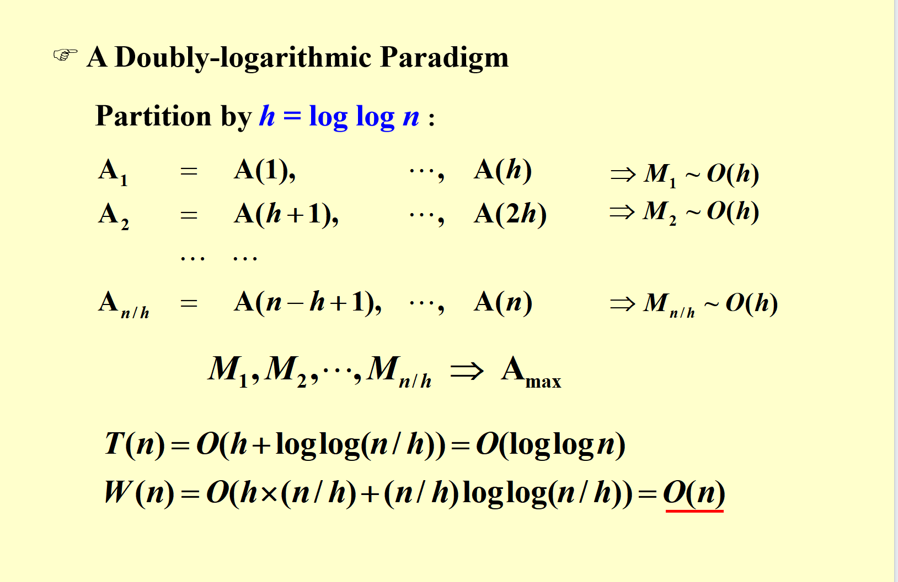

这里其实是另一种划分 划分成每个段长为loglogn的段 然后每个段内用顺序的方法找最大值 之后再把这些最大值再用方法四的方法找找最大值 就行了

这样实现了再次优化

### 方法六

还有一个基于随机化的方法 就是我们不找n的最大 而是找随机n的7/8次方个数的最大值 之后再进行划分之类的，这样可以达到T=O(1)  W=O(n)

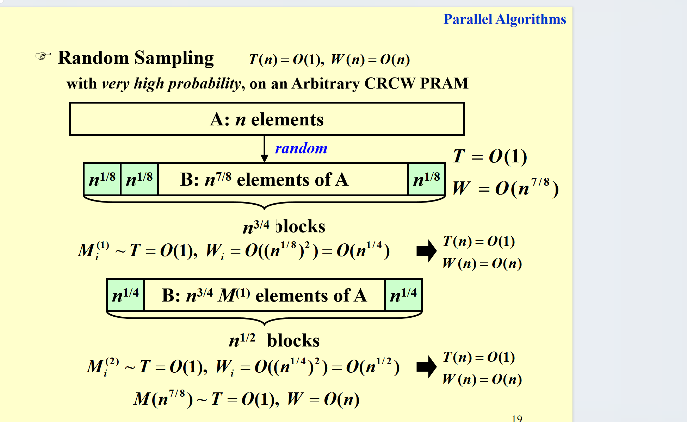

这个解释不错