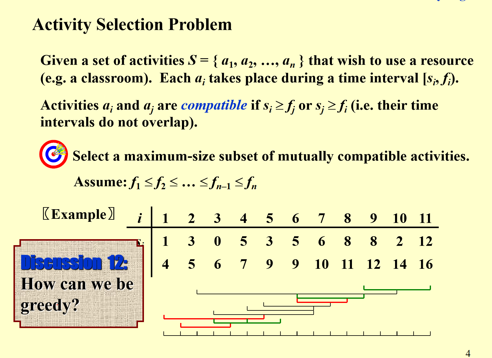
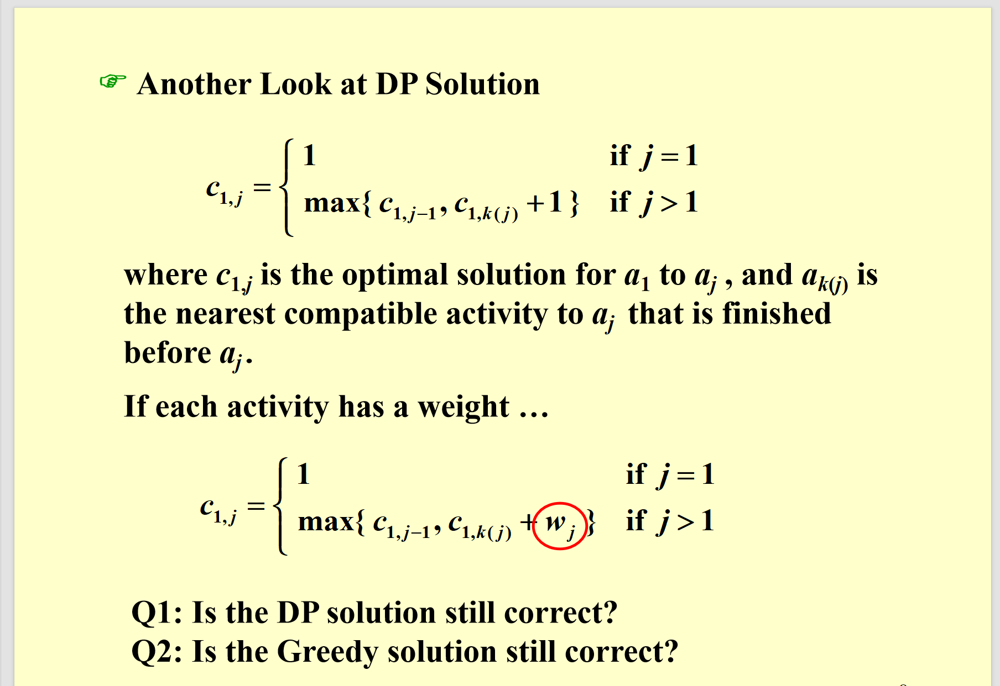
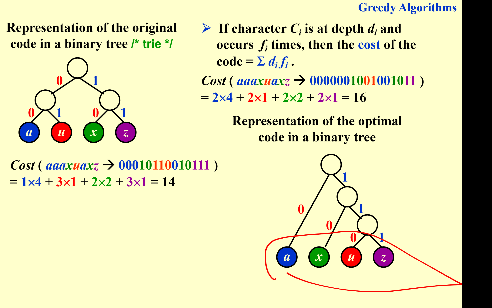

# 贪心算法

贪心算法是一种在每一步选择中都采取当前最佳（局部）解的算法。

## 概述

### 1. 优化问题（Optimization Problems）

- 定义：给定一组**约束条件（constraints）**和一个**优化函数（optimization function）**。
- 可行解（feasible solutions）：满足约束条件的解。
- 最优解（optimal solution）：在所有可行解中，使优化函数取得“最优值”（最大或最小）的解。

### 2. 贪心算法（The Greedy Method）

- 策略：在每一个阶段，根据某个**贪心准则（greedy criterion）**做出当前“最优”的决策。
- 特点：一旦在某一阶段做出决策，后续阶段不会修改（“not changed”）；且每一步决策必须保证**可行性（assure feasibility）**（即决策后仍满足约束条件）。、

### 贪心的要求

局部（子问题）最优解也就是（可以嵌入）全局最优解

## 例子1 活动策划问题

给你一个活动集合，每个活动都有开始时间和结束时间，要求你选择一个活动集合，使得集合中的活动互不冲突，并且集合中活动个数最多。

这个方法我们一开始看 其实可以用dp来做，就是说dp[i][j]表示前i个活动在前j时间中可以选择的最多的，那对于dp[i][j]也就是选不选第i个活动的事情了，选了就是dp[i-1][j-start[i]]+1，不选就是dp[i-1][j]。

但是这个题目也可以用贪心方法解

贪心算法：我们对于每一个活动，我们先按照结束时间进行排序，然后我们每次选择结束时间最小的，并且没有被选择的活动。

这样做的正确性在哪里呢？

### 贪心正确性证明

我们只要证明最优解可以变换成贪心解还不会变差，就说明贪心也是最优的

这张PPT继续围绕**活动选择问题的贪心算法**，从**正确性证明**和**算法实现**两个维度展开说明：

#### 1. 正确性（Correctness）

要证明贪心算法的有效性，需满足两点：
- ① 算法得到的活动区间**互不重叠**（这是“兼容活动”的基本要求）；
- ② 结果是**最优的**（即选出的活动数量最多）。

#### 定理与证明

**定理**：对于任意非空子问题\( S_k \)，若\( a_m \)是\( S_k \)中**最早完成时间**的活动，则\( a_m \)一定包含在\( S_k \)的某个“最大兼容活动子集”（即最优解）中。

**证明思路（替换法）**：

- 假设\( A_k \)是\( S_k \)的最优解，其中\( a_{ef} \)是\( A_k \)里最早完成的活动。
- 若\( a_m \)和\( a_{ef} \)是同一个活动，定理直接成立；
- 若不同，将\( A_k \)里的\( a_{ef} \)替换成\( a_m \)，得到新集合\( A_k' \)。由于\( a_m \)的完成时间\( f_m \leq f_{ef} \)，\( A_k' \)里的活动仍互不重叠且数量不变，因此\( A_k' \)也是最优解，且包含\( a_m \)。

#### 2. 实现（Implementation）

介绍算法的具体实现方式：

- ① **递归实现**：先选第一个（最早完成的）活动，然后递归处理剩下的兼容活动子问题；
- ② **迭代优化**：将尾递归转换为循环迭代，降低空间开销。其实就是一次循环，维护一个当前结束时间。

**时间复杂度**：\( O(N\log N) \)——其中排序活动需\( O(N\log N) \)时间，后续遍历处理活动需\( O(N) \)时间，整体由排序主导。

这里还有一个dp解法，其实和贪心的思想很像，但是这样能解有权重的问题。

## 例子2  Huffman编码问题

说白了，就是给你一些字符串和对应频率，然后你需要将它们编码，那么你需要找到一种编码方案，使得编码后的字符长度*频率最小。

同时要注意，编码具有唯一性，也就是说不存在误判。

因此，如果用一颗树编码，那么每个字符都是叶子节点（这样可以保证没误判）

可以看一下，同时呢，每个非叶子节点都有两个儿子（霍夫曼树性质）

### 怎么建树

很简单，就是每次取概率最小的两个，然后合并（变成一棵树），概率之和作为新的节点，直到只有一个，之后以左边为0，右边为1编码。ppt上有例子

实现:可以用堆O(NlogN)

也可以通过两个队列来维护最小值，就是一开始的概率放在一个队列，之后合成的概率放在另一个，每一次都是从这两个队列中选出共同最小的合并。O(N)

### 正确性证明

霍夫曼树为什么是最短的呢？

证明分为两部分：

### 贪心的选择是对的（贪心选择是当下最优）

这个我们可以把任意二叉编码树都看作合并子树的过程，而霍夫曼是选择概率最小的，我们可以证明，如果选择了概率不是最小的，一定不如这个好（同一个结构时候）。

### 最优子结构（子结构最优，全局也是）

只要证明这个子结构最优，全局也最优。可以用ppt，假设此时有更好的，推出矛盾。
