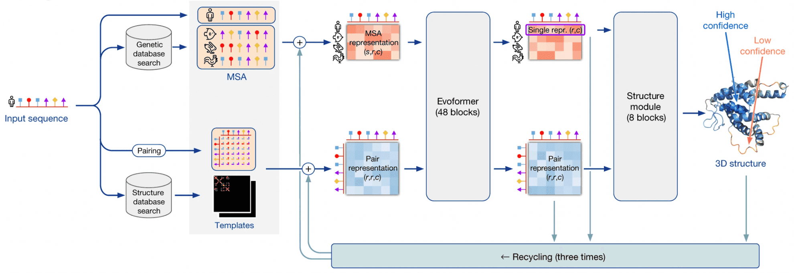
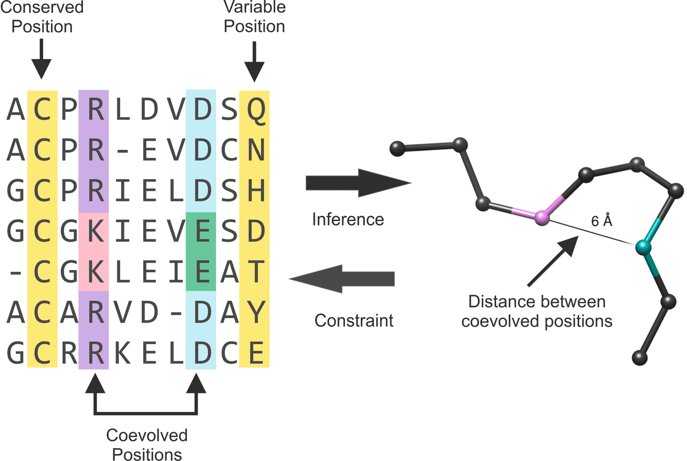
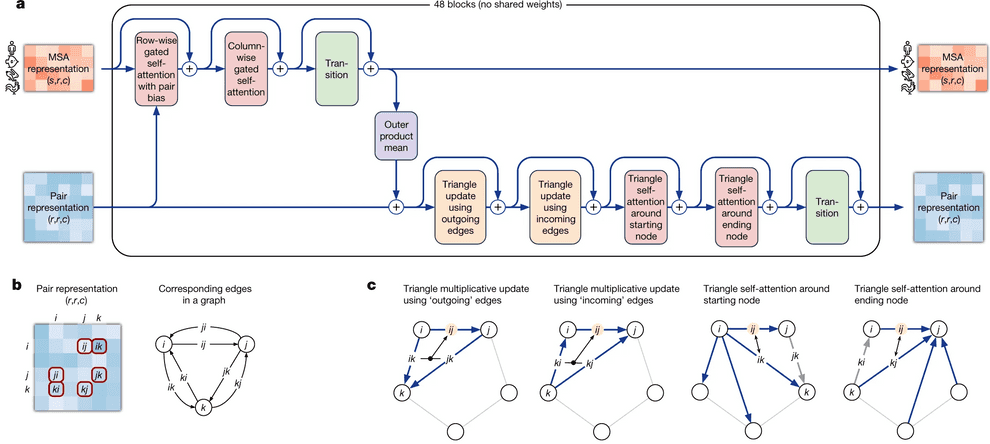
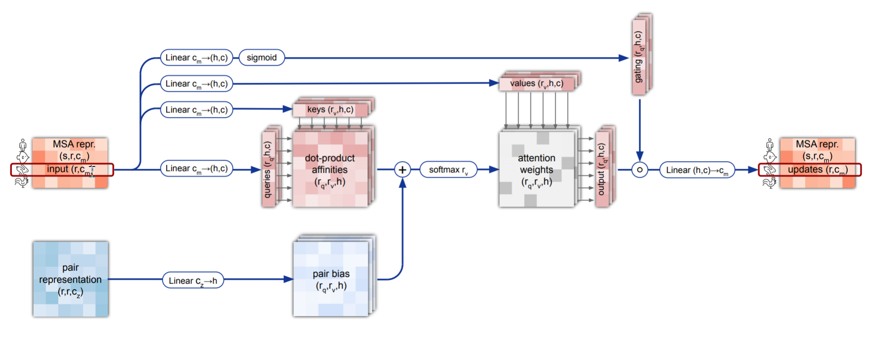
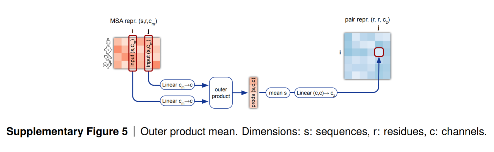
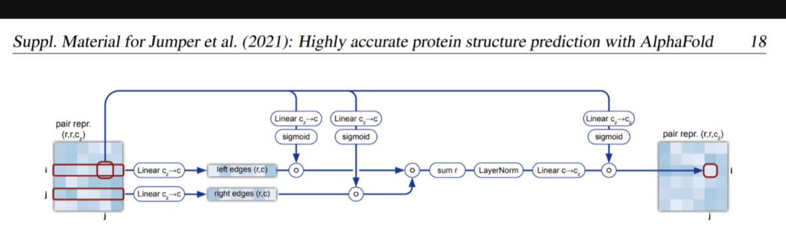
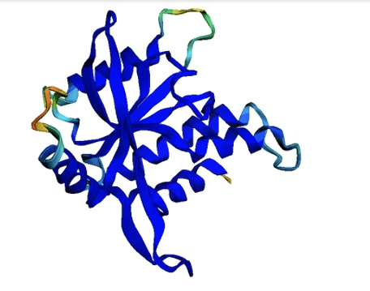
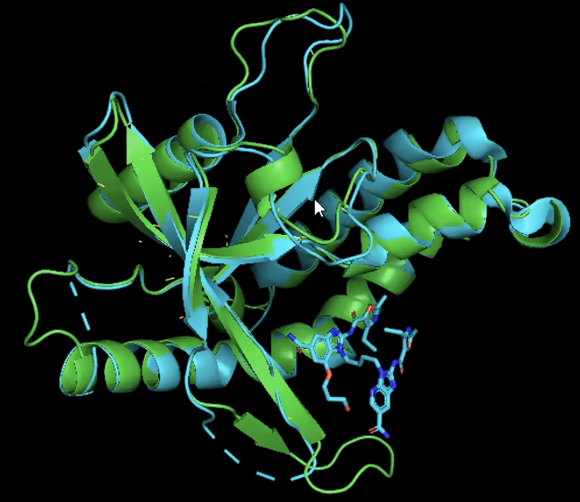

# AlphaFold2的部分思考

## 写在最前面

### ==alphafold成果简介==

&ensp;&ensp;蛋白质由单体氨基酸组成线性序列，可折叠为复杂三维结构：序列测定廉价，但用 X 射线或核磁共振测定三维结构成本极高。

&ensp;&ensp;AlphaFold（简称 AF）以人工智能解决这一问题 ——2020 年 11 月，AF2 在国际蛋白质预测竞赛首秀，对多数蛋白质的预测结构达原子级精度（误差仅几个或一个原子宽度）；2021 年 7 月，该深度学习模型的技术细节与源码登《Nature》封面，被称解决生物学界 50 年蛋白质结构预测难题；

&ensp;&ensp;2024 年，DeepMind 的约翰・江珀与戴米斯・哈萨比斯获诺贝尔化学奖（一半），表彰其开发 AF2、攻克这一 50 年科学难题的贡献。

### ==我对此的看法与研究初衷==

&ensp;&ensp;1.首先 这无疑是让我非常震撼的一个成果。首先 这是一个深度学习（人工智能）成果在生物学的应用，而且能拿到生物学的诺奖，其贡献可谓之大

&ensp;&ensp;2.同时 这是一个工程性成果，竟然会拿到诺贝尔奖主要关于理论贡献的奖项，可以看出，他其中蕴藏的无论是研究思想，技术应用，以及“解决长达50年的科学难题”都是一巨大贡献。在我看来，这个成果不仅为蛋白质结构预测提供了范式，也对人工智能在基础科学的应用研究也起到了标杆性，引领性的作用。

&ensp;&ensp;**因此，我想来探究一下这里面到底用到了什么AI与生物学结合的思想，解决这个世界难题，重点是，尝试结合生物学的知识解释，为什么要构建这个模块**

## 一：AlphaFold2整个流程的梳理

&ensp;&ensp;我们先来看看这个Alphafold2整个模型架构 明白他干了个什么事情。

&ensp;&ensp;以上是一张AF总体架构图，我在这里对主要部分简单梳理

1. 输入：一段氨基酸序列（S）
2. 构建**MSA(多重序列比对)**与**pair representation（输入氨基酸对矩阵）**。这里是AF第一个与生物信息学融合的地方，他通过HMMer软件查询数据库中与输入序列的同系物（可以理解为相似的序列），构建这个MSA。 同时，考虑S这个氨基酸序列的两两作用，得到一个2维矩阵。
3. Evoformer模块：负责更新MSA 与pair representation，本质上这是在检测氨基酸的相互作用的模式，从名字也可以看出，他是用了transformer的思想和结构。
4. structure module：负责预测3D结构，基于上一个模块得到的蛋白质序列信息，构建一个3D结构，他这里最后输出的是基于上一个残基，下一个残基的相对位置（旋转/平移），以及每个残基对应的支链的形状。

&ensp;&ensp;之后我将聚焦部分模块的介绍，着重思考他的生物学意义

## 二、MSA矩阵：多重序列比对

&ensp;&ensp;这是第一个我觉得天才的想法，很多人在AI for Science中，以前的科学领域的知识如何使用，一直是一个大问题。

&ensp;&ensp;而在生物信息学中，我们知道，蛋白质进化具有保守性，不同物种中源于同一祖先的蛋白质为同系物（如人、马、鱼的血红蛋白）；其进化基本呈中性，**结构比氨基酸序列更保守**，通过多序列比对（MSA）可分析保守位置及残基相互作用，这些信息是蛋白质三维结构预测的基础。

&ensp;&ensp;因此，我们考虑找到和当前这个氨基酸序列中相似的序列，之后，利用AI分析这些序列的共同点信息和不同点（比如同时变化的残基），在这样的学习中，AF就可以学习到这些残基对结构的贡献。

## 三、Evoformer：编码器

&ensp;&ensp;Evoformer由48个相同的Block堆叠而成，每个Block包含两大核心部分：**MSA Stack**和**Pair Stack**，两者通过信息通道交互（MSA→Pair的外积平均操作）。

&ensp;&ensp;每个Block的核心逻辑是：对MSA表示和Pair表示进行一系列注意力操作与特征变换，最终输出与输入形状相同的更新后特征（通过残差连接保证训练稳定性）。

### 3.1 输入特征

&ensp;&ensp;经过输入编码（Input Embeddings）后，Evoformer接收两种关键特征：

- **MSA表示**：形状为$(s_c, r, c_m)$，其中$s_c$是聚类中心序列数，$r$是氨基酸残基数，$c_m$是特征通道数。MSA（多序列比对）包含同源序列的进化信息。
- **Pair表示**：形状为$(r, r, c_z)$，其中$c_z$是特征通道数。Pair表示编码了残基对之间的相互作用信息。

&ensp;&ensp;==我们在这里重点关注三个部分：MSA的row wised gated self-attention with pair bias 、外积平均 以及 triangle update using outgiong edges.==

### 3.2：MSA行注意力（row wised gated self-attention with pair bias）

**核心逻辑**：在MSA的每一行（单个同源序列）内部，对残基列维度进行注意力计算，捕捉同一序列中不同残基的依赖关系。

#### 细节实现

- 输入：MSA表示$(s_c, r, c_m)$和Pair表示$(r, r, c_z)$
- 操作：
  1. 对MSA进行LayerNorm归一化；
  2. 通过线性层生成query、key、value、gate向量（形状均为$(s_c, r, h, c)$，$h$为注意力头数）；
  3. 将Pair表示通过线性层转换为注意力偏置（形状$(h, r, r)$），并与注意力得分矩阵相加；
  4. 沿**列维度**（残基位置）计算缩放点积注意力，通过softmax归一化后与value加权求和；
  5. 拼接多头输出，经线性层转换回$c_m$通道，与gate向量（sigmoid激活）相乘；
  6. 残差连接：输出 = 输入MSA + 注意力结果

#### 生物学意义与评价

&ensp;&ensp;我们知道 注意力机制的本质是通过每个元素映射的query和key进行信息交互，而像我们上面生物信息学提到的，我们选择了相似的序列，**想让模型学习他们的共性和区别**，这里对某一列的元素进行注意力机制，正是让模型学习了**相似氨基酸序列同一位置的信息**。

&ensp;&ensp;同时，我想说一下为什么不进行全图的两两注意力计算，而是只进行行和列的。

&ensp;&ensp;这里我给出两个理由

&ensp;&ensp;1.行和列的注意力最重要，因为这是统一氨基酸序列的关系和不同氨基酸同一位置的关系。2.参数量问题，我们这里给出一个我的简单计算过程：

- **定义**：设蛋白质残基数为 \( r \)（如 \( r = 400 \)）。
- **全注意力**：
  Pair-representation 是 \( r \times r \) 的残基对，全注意力的得分矩阵大小为 \( (r \times r)^2 \)。
  若每个元素占4字节（单精度浮点数），显存需求为 \( (r \times r)^2 \times 4 \)。
  当 \( r = 400 \) 时，显存为 \( (400 \times 400)^2 \times 4 = 102 \, \text{GB} \)。
- **行注意力**：
  逐行计算，每行处理 \( r \) 个残基对，得分矩阵大小为 \( r \times r \)，共 \( r \) 行，总得分矩阵大小为 \( r^3 \)。
  显存需求为 \( r^3 \times 4 \)。
  当 \( r = 400 \) 时，显存为 \( 400^3 \times 4 = 256 \, \text{MB} \)。

==很明显，全局计算的算力需求太大了。==

### 3.3外积平均（Outer Product Mean）

**核心逻辑**：将MSA表示转换为与Pair表示同形状的特征，实现MSA→Pair的信息流动。就是我之前说的，把MSA学到的残基信息放在pair representation中，因为这个才是针对于需要预测的这一个序列的信息矩阵。

#### 外积操作

1. 对MSA表示通过两个线性层生成$a$和$b$（形状均为$(s_c, r, c)$）；
2. 计算外积：$a_{si} \otimes b_{sj}$（形状$(s_c, r, r, c, c)$），其中$s$为序列索引，$i,j$为残基索引；
3. 沿序列维度$s$求平均（压缩行信息），得到$(r, r, c, c)$；
4. 展平最后两维（$c \times c$），经线性层转换为$c_z$通道，最终形状为$(r, r, c_z)$；
5. 结果将与Pair表示相加，实现信息融合。

#### 生物学意义与分析

&ensp;&ensp;我们发现，这里是对两列向量进行外积求和取平均，具体来说，对于`pair[i][j]`这个位置，我们取MSA的第i列和第j列的向量，这是刚好进行了对应，而**外积操作（就是广播对应元素相乘）+沿着序列维度求平均**也能把信息很好的融合在一起，从而最后将MSA的二维信息转化为了残基对的二维信息。

&ensp;&ensp;进一步分析，这里的外积计算包含两个层次

&ensp;&ensp;1.位置维度外积（就是第i和j个残基的交互）：决定计算哪些残基的相互作用

&ensp;&ensp;2.通道维度外积（就是c与c的交互）：决定具体如何相互作用，比如化学键，疏水作用等（当然实际是抽象成特征）

### 3.4阶段总结

&ensp;&ensp;到目前为止 我们完成了MSA的更新，我想在这里再解释以下部分操作的生物意义

#### 1. MSA表示的本质

&ensp;&ensp;MSA（多序列比对）矩阵可看作**进化信息库**：

- 行（Row）方向：不同同源物种的序列（如人类、小鼠、果蝇的同一蛋白质）
- 列（Column）方向：蛋白质的残基位置（如第10位氨基酸在所有物种中的变异情况）

| 序列/残基 | 位置1 | 位置2 | ... | 位置N |
| :---------: | :-----: | :-----: | :---: | :-----: |
| 物种A     | Val   | Leu   | ... | Asp   |
| 物种B     | Ile   | Leu   | ... | Glu   |
| ...       | ...   | ...   | ... | ...   |
| 物种S     | Ala   | Phe   | ... | Asp   |

#### 2. MSA行操作 vs 列操作的生物学意义

| 操作类型 | 计算维度       | 生物信息流                          | 结构预测作用                    |
| -------- | -------------- | ----------------------------------- | ------------------------------- |
| 行操作   | 同物种内跨位置 | 单个蛋白质内部的残基间协同进化      | 捕捉局部结构（如α螺旋的周期性） |
| 列操作   | 同位置跨物种   | 不同物种间同一残基的保守性/变异模式 | 识别关键功能位点（如活性中心）  |

## 四、Pair Stack：建模残基对相互作用

&ensp;&ensp;我们这里已经得到了一个有着良好信息的残基对矩阵，现在我们要尝试引入另一个东西，**距离的三角约束**。

&ensp;&ensp;我以前觉得这种约束应该在损失函数，但AF的操作实在惊人，让我眼前一亮。他们还是利用了transformer的想法,接下来我将介绍并说明。

### 4.1残基对表示矩阵的本质

| 条目   | 理论解释            | 类比         | 生物学意义                     |
| ------ | ------------------- | ------------ | ------------------------------ |
| Z[i,j] | 残基i→残基j的信息流 | “i对j说的话” | i的化学性质如何影响j的空间位置 |
| Z[j,i] | 残基j→残基i的信息流 | “j对i的回复” | j的结构约束如何反馈给i         |

### 4.2 三角机制

&ensp;&ensp;Pair表示中，$z_{ij}$和$z_{ji}$是两个独立向量，分别编码残基$i→j$和$j→i$的信息流（类似“双向边”）。三角机制通过引入第三边（如$z_{jk}$或$z_{ki}$），建模残基间的三元关系，确保结构约束的一致性（如空间距离的三角不等式）。

#### 三角乘积更新（Multiplicative Updates）

- 目标：用$i$为起点的边（$z_{ik}$）更新$z_{ij}$，引入第三边$z_{jk}$；
- 操作：
  1. 从$z_{ij}$生成$a_{ij}, b_{ij}, g_{ij}$（$a,b$为特征向量，$g$为门控）；
  2. 计算$a_{ik} \odot b_{jk}$（哈达玛积），沿$k$维度求和；
  3. 经LayerNorm和线性层后，与$g_{ij}$（sigmoid激活）相乘；
  4. 残差连接：$z*{ij} = z*{ij} + $更新结果。

#### 操作逻辑和生物学意义

&ensp;&ensp;这个部分是我认为非常精妙的部分 对于第i个，第j个氨基酸，我们考虑让aik 逐元素乘以bjk 之后对k求和。

&ensp;&ensp;我们来想想这是什么意思：这里先把`Aik` `Bjk`理解为第`i`个氨基酸和第`j`个氨基酸之间的相互作用（包括距离）与第`j`个和第`k`个氨基酸相互作用(包括距离)，**那我们这里的`k` 是不是相当于在考虑第`i`个氨基酸和第`j`个氨基酸之间的距离关系时,引入其他所有的氨基酸与第`i`个和第`j`个氨基酸的距离关系**。从而学习到一个三角形的距离约束！

## 五、总结

&ensp;&ensp;由于篇幅和自己遣词造句的限制，AF这个诺奖成果还有很多精妙的模块没有介绍，以及一些特别的训练技巧（比如recycle），但是，从上面我自己对alphafold的操作的思考，我们可以发现这个成果对生物学与人工智能模型架构搭建的精妙结合，而这些思路与想法，才是我最应该学习并仔细深究的。

最后插两张我自己运行AF2的结果 这是蛋白质8STI的预测结果和比对（上图为预测结构，下图是与真实结构的比较）

 

  

---
### 参考文献​

Jumper, J., Evans, R., Pritzel, A. et al. Highly accurate protein structure prediction with AlphaFold. Nature 596, 583–589 (2021). https://doi.org/10.1038/s41586-021-03819-2
