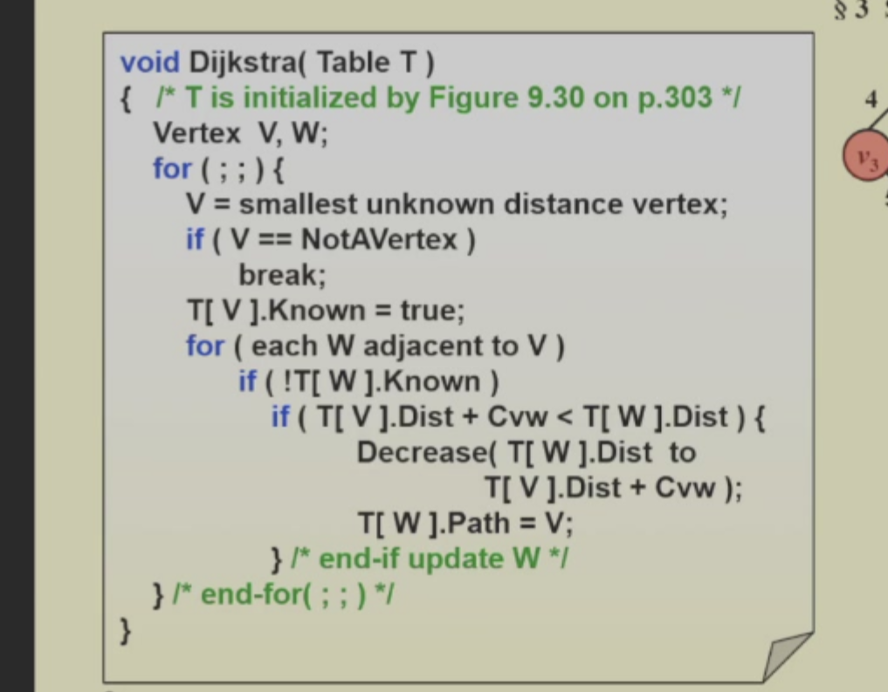

# 图2--最短路算法

## 问题描述

给定一个有向图（无向图），求从起点到终点的最短路径长度。  
可以指定一个点，求到其他所有点的最短路径（单源最短路径）。

## 思路

### 没有距离（每个边的权重都为 1）

1. 使用BFS（广度优先搜索）算法:
   - 从起点开始，遍历所有相邻的点。  
   - 记录每个点的距离（到起点的距离）。  
   - 如果到达终点，则返回距离。  
   - 如果遍历完所有点仍未到达终点，则返回-1。
2. 记得每个到每个点时要记录三个事情
   1. 该点的距离
   2. 该点的父节点（只要记住父节点，就可以找到路径，因为找到最短路的上一个点，就可以变成找上一个点的最短路）
   3. 该点的状态（是否被访问过）  
代码：

3. 代码中使用了一个队列来存储待访问的点，使用一个数组来存储每个点的状态（是否找到了最短路径）。
4. 这个代码可行的原因是bfs先找到的肯定是离起点最近的点，然后依次遍历它的相邻点，直到找到终点为止。

### 有距离（每个边的权重都不为 1）

1. 使用Dijkstra算法: dijkskra算法原理是这样的

#### 算法和原理

1. 我们定义S集合，是已经找到最短路径的点集合。
2. 我们定义distance【节点】，为从起点出发，经过s集合的点到u的最短路径长度。之后每一次都取距离S最小的点（未知最短路的最短点），之后把他加入S，之后再来看看能不能改变这个点周围的点的距离。这样不断循环，循环结束后所有节点都在S集合中。
3. **原理**：我们可以想象，第一次操作，我们把起点距离最近的点给装进s，更新了周围的节点distance，然后我们再找distance最小的，把他纳入s，如果这个点本身有更短的路径只是没找到，那么那个路径肯定会经过一个不在s的点，那这个不在s的点不就应该是更短的吗，这个和一开始找的distance最小不符合呀（没负边），这就矛盾了。
4. 代码
   

5.这里其实复杂度相关的是如何找最小的distance，我们可以用一个堆

### 负环

处理方法，就是还是bfs，但每次要比较大小（PPT）

错了，我错了，其实不是BFS，而是一种比较暴力的方法:就是每出队一个点，就看这个点周围的点的最短路有没有需要更新的，如果有就更新，而且如果这玩意不在队列里面，就加进去，直到队列为空

大概原理就是一旦有个点最短路改变，把他周围的都重新算一次。

### floyd

floyd算法就是把每个点都当起点，然后求到其他所有点的最短路径，就是求所有点的

原理大概就是`d[i][j]`=min(`d[i][j]`, `d[i][k]+d[k][j]`)，意思是如果i到j的距离比i到k加上k到j的距离大，那就更新一下，这里`d[i][j]`表示i到j的最短距离。

进行一个三重循环，第一重枚举中间节点(经过节点)，第二重枚举起点，第三重枚举终点,第一次第一重结束后，dij就相当于变成了可以经过第一重的点的最短路。再一次结束，就变成了可以经过中间两个点的最短路。以此类推，这就是原理。

### 无环图

无环图其实就更好说了，可以直接拓扑排序，因为无环图，你前面的点的距离肯定比后面的小（没有负边）。

具体应用 AOE网络，AOE网络就是一个有向图，AOE网络的最短路就是从起点到终点的最短路。

有两个关键的数据，每个点最早可以到的时间和最晚需要到的时间。

计算方式，从前往后/从后往前搜一次(BFS)，进行比较大小EC/LC 
