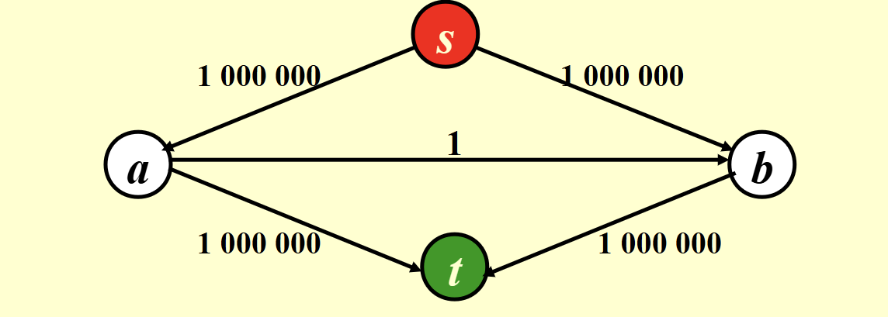
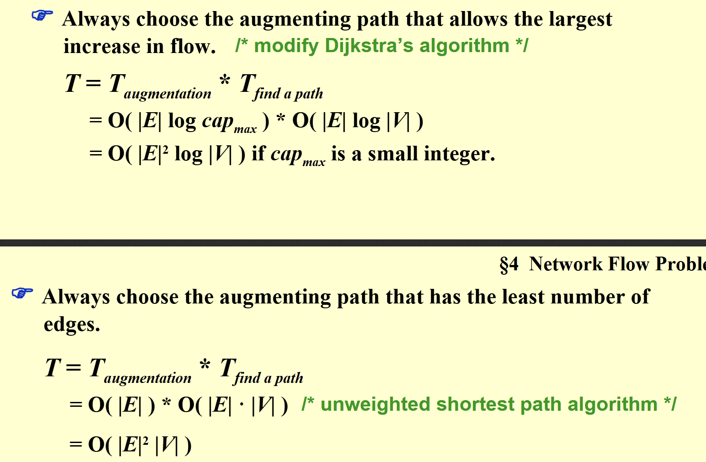
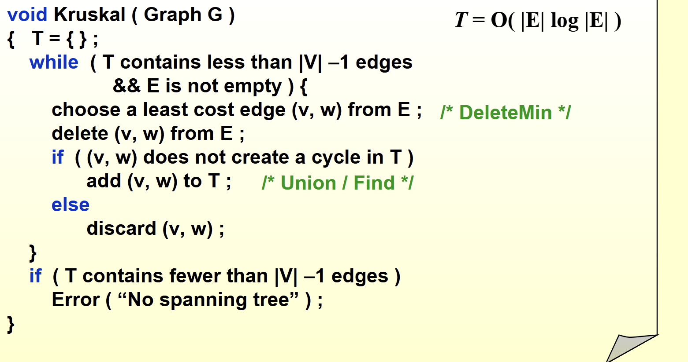

# 网络流与最小生成树

---

## 网络流

网络流问题是图论中的一个重要问题，主要用于解决在网络中流动的物品（如水、电、数据等）的最优分配问题。  
网络流问题通常可以用一个有向图来表示，其中：  

- 每个节点代表一个地点。  
- 每条边代表从一个地点到另一个地点的流动能力（容量）。  
- 包含一个源节点和一个汇节点：  
  - **源节点**：代表起点。  
  - **汇节点**：代表终点。  

需要求出从源节点到汇节点的最优分配方案，使得：  

1. 每个节点的流量都满足要求（不超过容量）。  
2. 总流量最大。  
3. 每个节点流入和流出的流量相等。

---

### 一个简单的想法

我们可以用一个简单的想法解决：

1. **从源节点开始**：遍历所有的边，找到一条可以流动的路径。  
2. **求路径的最小容量**：  
   - 找到路径上所有边的最小容量，作为当前路径的流量。  
3. **更新路径容量**：  
   - 将这个路径的所有边减去这个流量。  
4. **删除容量为 0 的边**：  
   - 如果有边的容量为 0，则将其删除。  
5. **重复以上步骤**：  
   - 直到没有路径可以流动为止。  
6. **计算最大流量**：  
   - 将所有路径的流量相加，得到最大流量。  
7. **形成剩余图**：  
   - 最终会形成一个解图，和一个剩余图（详见 PPT）。（剩余图就是每条边还剩了多少流量），其实原图减去剩余图就是解图。  

**但他其实是一个错误的想法**

### 如何正确解决

ford-fulkerson 算法：

- 该算法是网络流问题的经典算法之一。
- 它的核心思想是：像上面一样，不断的找路径，但每次找到之后，先减去这个路径的流量，**然后再加上以一个相反方向，大小为这个路径流量的边**，在原理上，这个相当于增加了一个反悔机制。注意之后找路径，也可以找这个反向的边。
- 方向相同，起点终点一样的边要合并

再提一下，找一个路径可以用bfs（求无权图最短路径的方法）或者dfs（更快一点，但是其实bfs可以找到最短的，也会加速）  

但这个方法在有些情况下会比较慢：比如以下的情况

此时如果每次找到的是100000-1-100000的那个边，那可能要循环200000次才能最终得到结果
他的时间复杂度是O(E*F)，E是边数，F是最大流量

优化：

代码见code里面的maxflow，基本就是模板

## 最小生成树

最小生成树（Minimum Spanning Tree，MST）是图论中的一个重要概念，主要用于解决在一个无向图中，如何选择一些边，使得：包括所有点，以及n-1条边，且边的权重之和最小。（就是一棵树嘛）
**只要这个图是连通的，就一定有最小生成树。**

### 算法

我们以下介绍两个算法：Prim 算法和 Kruskal 算法。他们都是贪心的思想。而且均要遵守以下三个原则

1.只使用图中的边  
2.只用n-1条边  
3.不形成环  

#### Prim 算法

Prim 算法是最小生成树的一种贪心算法，主要思想是：从一个点开始，逐步扩展最小生成树,每次寻找距离这棵树最近的点，加入到树中。（诶，是不是很像dijkstra），其实代码也差不多。
代码网址：<https://yebd1h.smartapps.cn/pages/blog/index?blogId=106002722&_swebfr=1&_swebFromHost=baiduboxapp>

#### Kruskal 算法

Kruskal 算法也是最小生成树的一种贪心算法，主要思想是：按照权重从小到大的顺序，依次选择边，如果这条边不会形成环，则加入到最小生成树中。因此，我们需要判断是否会形成环（可以用并查集）。
t're'w
伪代码：

具体说一下怎么判断是否会形成环：就是用并查集，每次加一条边的时候，看看这条边的两个点是否在同一个集合里，如果在，就说明会形成环，如果不在，就说明不会形成

具体实现可以看到：code的位置的kruskal.c文件，这个是一个加了其他功能的改编版本，不过大差不差。而且可以用这个判断连通分量个数.同时，由于这个要对边从小到大纳入，因此最好按边输入，之后排序。
