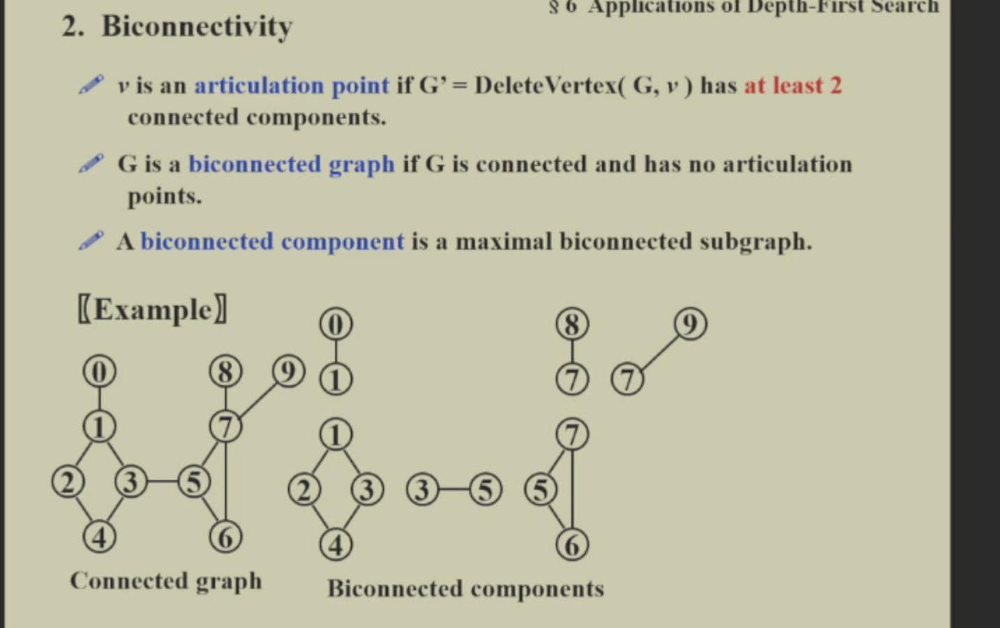
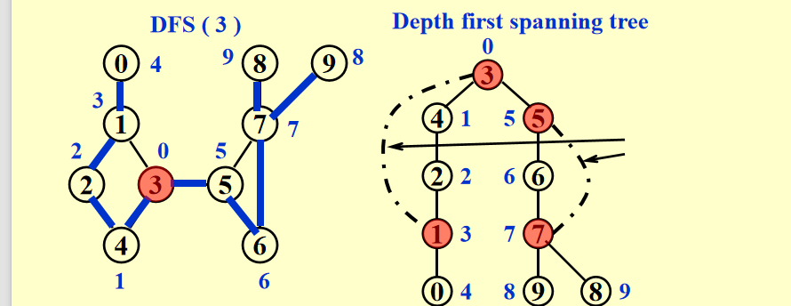
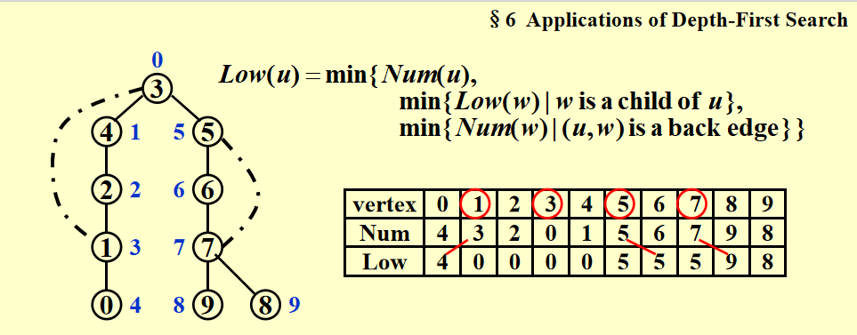
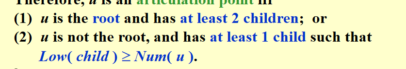
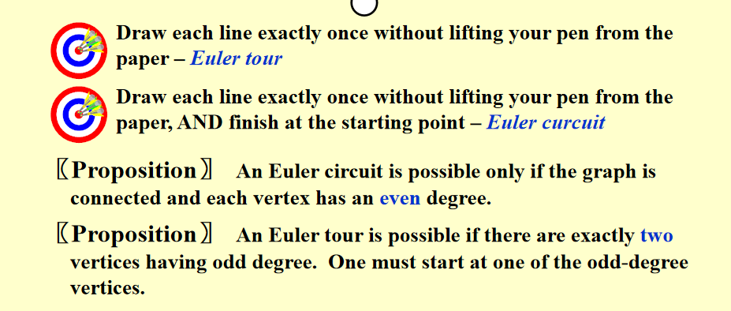

# 图终章

## dfs

dfs不多说了，就是个递归，但可以用它找连通分量个数，对所有点for，看做了dfs几次就行

## 应用(tarjan算法)

解释一下，双连通图就是去掉任何一个点，图还是联通的。(这里考虑无向图)

如果去掉一个点，图就分成两个或者多个了，那这个点就是articulation point

那我们应该怎么找到这个点，判断它是不是双连通图呢

可以注意，找到的点，也就是把这个图分成了两个或者多个双连通子图(事实上，就是有向图中强连通图)

### 1.dfs

首先，我们对一个点开始dfs搜索,按照搜索到的顺序进行编号。这样，我们其实可以得到一颗树

当然，除了dfs走的边，还有一些其他的边哦。这些也需要记住。请注意，不会存在一棵树指到另一棵树的边(从dfs过程想想)

接着，我们对这个过程进行分析，就可以知道。

1.如果这个树的根（就是开始搜索的点）是一个articulation point，当且仅当他有两个儿子。

2.如果其他点是articulation point，当且仅当他有至少一个儿子，而且不可能往下移动一步然后跳到他的祖先（通过之前提到的边）。

### 那如何判断呢(上面说的都是理论啊)

我们可以给每个点一个编号以外，再给他一个等级，根的等级最高 0,这个等级的意思就是这个点等级，以及通过他的儿子，或者自己，能到达的最高等极中三个取最高

因此，我们就得到了根本的判断方法

傻孩子们，这个算法在有向图就是计算强连通分量的个数的tarjan算法啊：代码实现看作业/B站视频

## 应用2：一笔画问题

一笔画问题早就有人给出结论了

注意啊,dfs如果在每个点的度的2的图，最后一定会回到开始的点。

### 解法：欧拉回路算法

因此，这个解决办法就是对一个点进行dfs，走过的边就标记一下（或者记忆+删除），之后最后肯定回到了开始的点。

接着，从终点（也是开始节点）的上一个点开始找，直到找到了一个没有标记过的边，就继续dfs，直到回到新的dfs起点。之后在新的dfs上重复这个操作，最后就可以找到欧拉路径了

这个方法的原理就是环+环变成大环。

这个算法的复杂度是O(E+V),下面文章有代码和方法
<https://blog.csdn.net/nature_Chen_/article/details/98613829>
