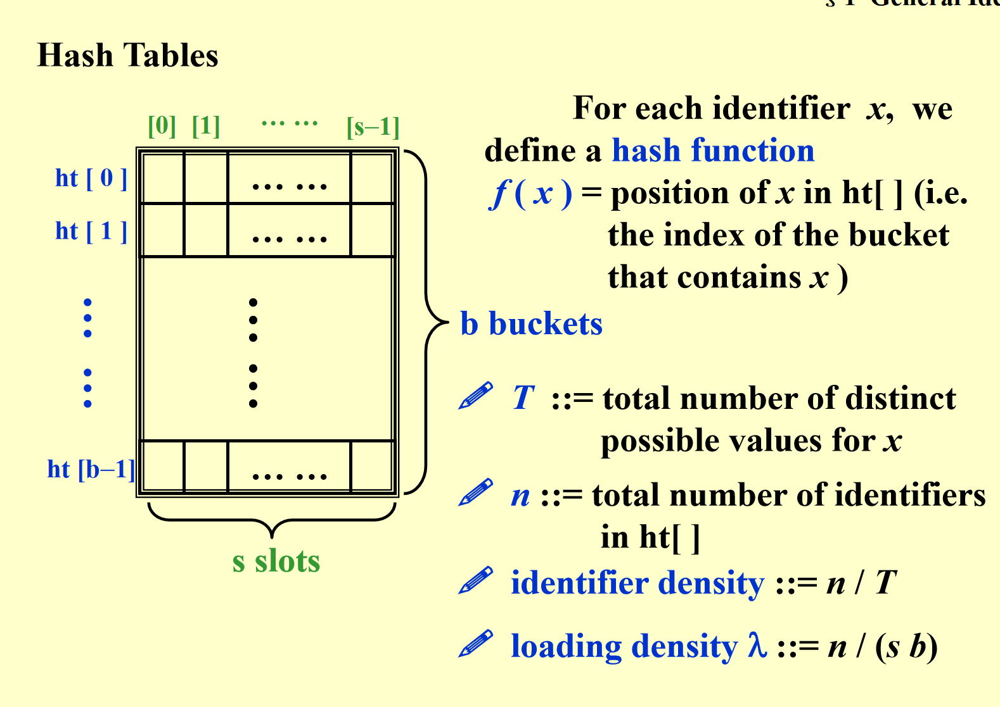
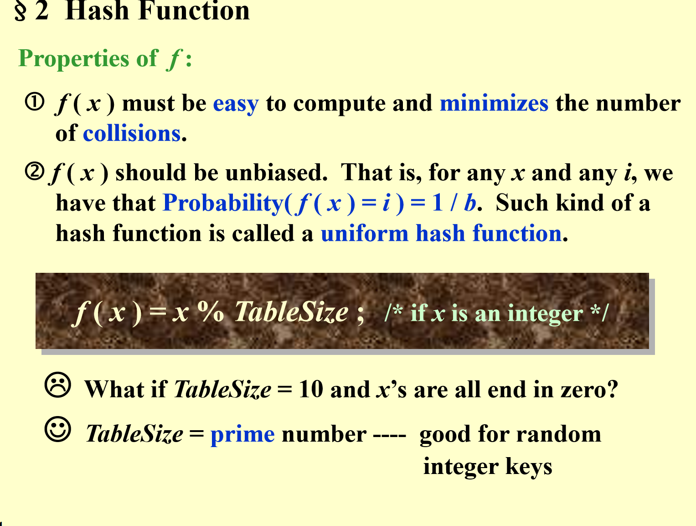
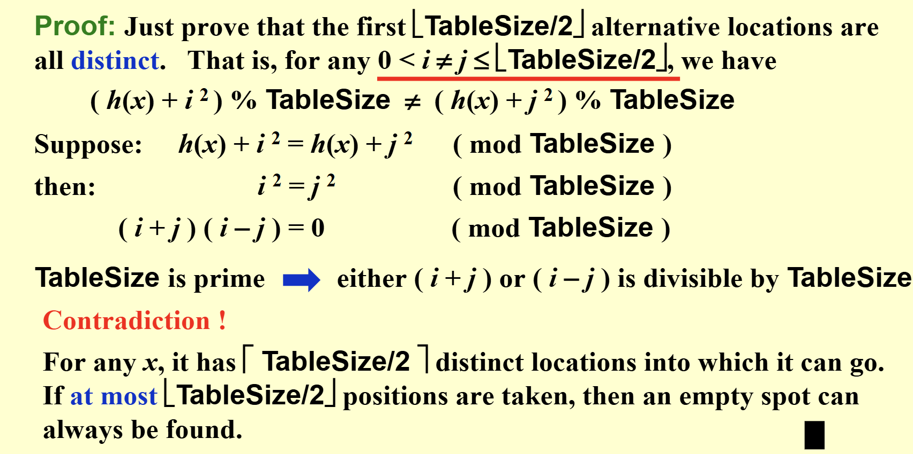
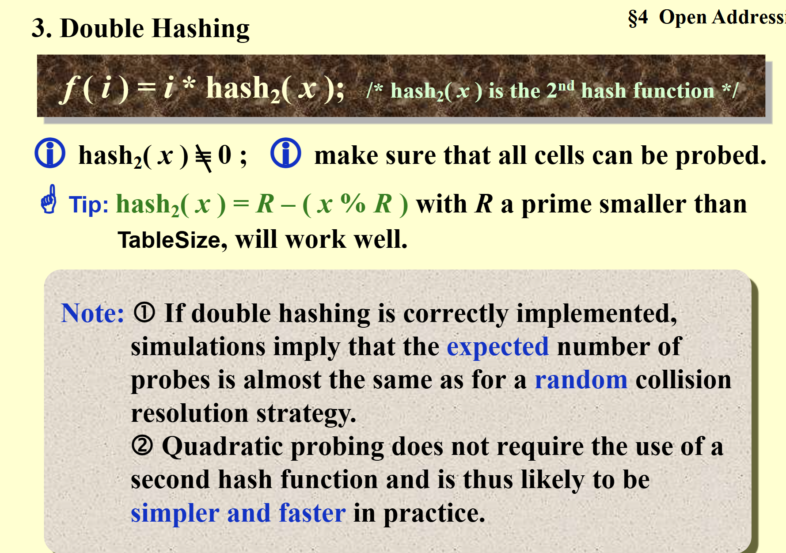
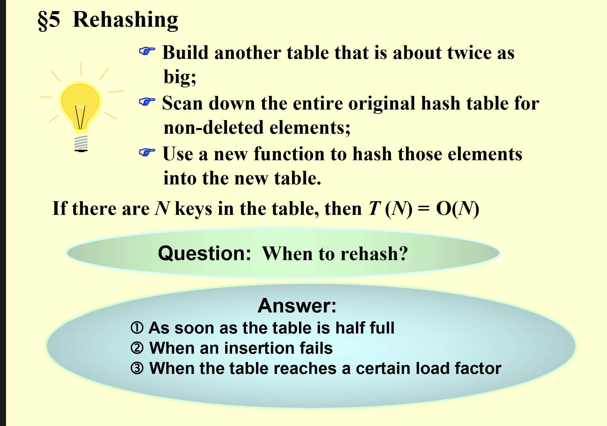

# 哈希法

---

## 介绍

哈希法是一种常见的数据结构，用于存储和检索数据。

我们知道动态查找（有删除，增加）的方法有普通的数组，查找树，和哈希法。

哈希法是一种基于数组的动态查找方法，它将数据存储在数组中，并使用一个哈希函数将数据映射到一个索引。

我们也可以想到，当你在查找的时候，你并不需要遍历整个数组，而是只需要通过哈希函数找到对应的索引，然后直接访问即可。（空间换时间）

哈希值代表位置。但我们可以想到，你两个值很有可能通过哈希函数得到相同的哈希值，所以哈希函数需要是一个好的哈希函数，它应该具有均匀性，即不同的输入应该得到不同的哈希值（起码是尽量不同，发生碰撞了在处理。

---

## 哈希表



看这一页ppt，哈希表就是对每一个标识符（数据），都进行一个哈希函数计算，计算后的其实就是一个索引（数组中的位置），我们也考虑到了索引相同的情况，对每一个索引设置了s个槽位。

留意ppt中的 identifier density = n / T 这个定义的是标识符的密度，就是标识符数量除以标识符所有可能映射的值

和 loading density ::= n / (s b) 这个定义的是负载因子，就是标识符数量除以槽位数量。

---

## 哈希函数

我们知道要计算位置的索引需要哈希函数，那哈希函数可以是什么形式呢

hash函数的几个性质  


1.简单计算的同时避免冲突  
2.尽量均匀  
3.没有偏见，每个值得到的概率相同

---

### 例子

1.mod

hash(x) = x mod s s最好是质数

2.字符串的哈希函数

第一种 直接把每一位相加（不好）f（x）太少了，碰撞太多  
第二种 把每一位相加再乘以一个质数27（不好），f（x）太多了，但真实的字母组合其实没那么多(其实采用32进制可以加快速度，因为移位操作最快)

平方取中，折叠法，分析法

---

## hash代码的实现

---

### 1.初始定义

```c
struct  ListNode; 
typedef  struct  ListNode  *Position; 
struct  HashTbl; 
typedef  struct  HashTbl  *HashTable; 
struct  ListNode { 
 ElementType  Element; 
 Position  Next; 
}; 
typedef  Position  List; 
/* List *TheList will be an array of lists, allocated later */ 
/* The lists use headers (for simplicity), */ 
/* though this wastes space */ 
struct  HashTbl { 
 int  TableSize; 
 List  *TheLists; 
}; 
```

分析：这里是利用一个相当于二维数组的哈希表来存储，首先定义了每一个节点的结构（组成链表），然后定义了哈希表结构，里面有表大小和指针数组（这个数组的下标就是哈希函数的值，同时数组的每一个节点都是一个链表的开头，这个链表存储了所有的哈希值相同的值的节点）。

---

### 2.初始化

```c
HashTable  InitializeTable( int TableSize ) 
{   HashTable  H; 
    int  i; 
    if ( TableSize < MinTableSize ) { 
     Error( "Table size too small" );  return NULL;  
    } 
    H = malloc( sizeof( struct HashTbl ) );  /* Allocate table */
    if ( H == NULL )    FatalError( "Out of space!!!" ); 
    H->TableSize = NextPrime( TableSize );  /* Better be prime */
    H->TheLists = malloc( sizeof( List ) * H->TableSize );  /*Array of lists*/
    if ( H->TheLists == NULL )   FatalError( "Out of space!!!" ); 
    for( i = 0; i < H->TableSize; i++ ) {   /* Allocate list headers */
 H->TheLists[ i ] = malloc( sizeof( struct ListNode ) ); /* Slow! */
 if ( H->TheLists[ i ] == NULL )  FatalError( "Out of space!!!" ); 
 else    H->TheLists[ i ]->Next = NULL;
    } 
    return  H; 
} 
```

分析：这里没啥好说的了，就是初始化哈希表，初始化链表，初始化链表头结点。

---

### 3.查找

```c
Position  Find ( ElementType Key, HashTable H ) 
{ 
    Position P; 
    List L; 

    L = H->TheLists[ Hash( Key, H->TableSize ) ]; 

    P = L->Next; 
    while( P != NULL && P->Element != Key )  /* Probably need strcmp */ 
 P = P->Next; 
    return P; 
} 
```

分析：这里就是通过哈希函数计算出key对应的索引，然后通过链表头结点的next指针找到第一个节点，然后通过while循环找到第一个节点的值等于key的节点，如果找不到就返回NULL。

---

### 4.插入

```c
void  Insert ( ElementType Key, HashTable H ) 
{ 
 Position   Pos, NewCell; 
 List  L; 
 Pos = Find( Key, H ); 
 if ( Pos == NULL ) {   /* Key is not found, then insert */
 NewCell = malloc( sizeof( struct ListNode ) ); 
 if ( NewCell == NULL )     FatalError( "Out of space!!!" ); 
 else { 
      L = H->TheLists[ Hash( Key, H->TableSize ) ]; 
      NewCell->Next = L->Next; 
      NewCell->Element = Key; /* Probably need strcpy! */ 
      L->Next = NewCell; 
 } 
    } 
} 
```

分析：这就是找到key对应的位置，之后插在第一个节点后面（节省时间）

---

### 5.删除

就是链表的删除方式喽，不多赘述

---

## 另一种实现方式

刚刚介绍的是相当于二维数组的实现，现在我们用一维数组实现，但这样不可避免地是会出现哈希碰撞，如何解决成了重要问题

---

### 1.开放地址法

就是如果出现碰撞了，就算一个偏移量（就通过一个函数找到一个空闲的位置），这个函数可以是线性探测，平方探测，也就是从当前位置开始向后寻找，直到找到一个空闲的位置。

```c
Algorithm: insert key into an array of hash table
{
 index = hash(key);
 initialize i = 0 ------ the counter of probing;
 while ( collision at index ) {
 index = ( hash(key) + f(i) ) % TableSize;
 if ( table is full )    break;
 else    i ++;
    }
    if ( table is full )ERROR (“No space left”);
    else insert key at index;
}
```

---

### 线性探测

就是f(i) = i 不行就多往后看一位

而这就引出了一个问题，搜索时间(因为搜索的过程其实和插入过程一样，没找到就往后)，这就Average search time，而ppt上也给出了探测次数的期望值。

线性探测存在一个问题：一旦发生碰撞，之后的都会一直受到影响（**冲突聚集**），因此就有了平方探测。

### 平方探测

f(i) = i^2，这样可以让每一个放的位置跑的远一点，减少冲突聚集的概率。

但是这样也有个问题，可能一直找不到位置啊。

欸，其实呢，如果tablesize是质数，而且至少有一半空闲，那么我们可以证明一定可以找到位置。



代码：

```c
Position  Find ( ElementType Key, HashTable H ) 
{   Position  CurrentPos; 
    int  CollisionNum; 
    CollisionNum = 0; 
    CurrentPos = Hash( Key, H->TableSize ); 
    while( H->TheCells[ CurrentPos ].Info != Empty && 
	H->TheCells[ CurrentPos ].Element != Key ) { 
	CurrentPos += 2 * ++CollisionNum  1; 
	if ( CurrentPos >= H->TableSize )  CurrentPos  = H->TableSize; 
    } 
    return CurrentPos; 
} 

```

这里我们巧妙的利用了hi=hi+2i-1，这样速度会变快一些。(平方变乘2)

但这里好像解决了第一次碰撞，但没有解决第二次，意思是，如果相同的hash值，后面调整经过的过程都一样，会出现很多次没必要的碰撞才找到位置。

补充：hash的删除:hash的删除不能直接把删除的位置弄掉，而是进行了一个标记，标记这个位置是被删除了(因为我们判断没找到，是找到了一个位置为空，而不是遍历完了整个数组,这样的话，如果直接标记为空，那么可能会导致后续查找的失败)，之后查找遇到这个位置就跳过接着找，当然了，标记为删除的地方可以放入值，但是**不是立刻放入**而是在查找后面所有位置发现没有这个值的时候，再放入，防止一个值两个位置。


### double hash

事实上，我们可以用一个哈希函数作为偏移量，这样，当发生碰撞的时候，我们就可以利用第二个函数，来计算出下一个位置。


### rehashing

当哈希表填到1/2(此时平方探测有可能找不到位置)，我们可以重新分配一个更长的哈希表，然后把所有的元素重新插入。

用一个2倍长度的数组，然后把所有元素都重新插入。新的hash函数

