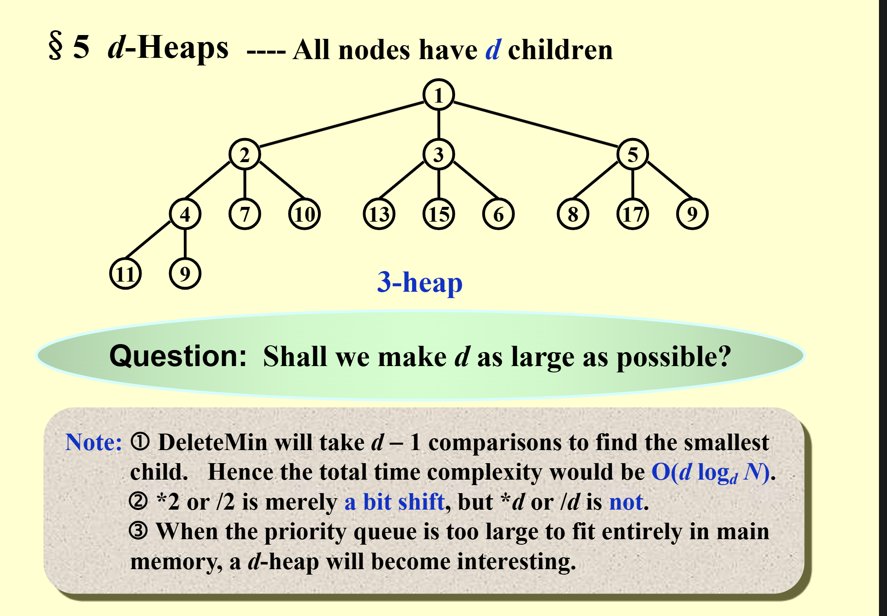

# heap(优先队列)

## 定义

1. heap用来解决什么问题？：堆（优先队列）一开始是用来解决一堆数删除最大/最小值的问题，当然也有插入操作。  
2. 我们发现，如果用链表或者数组来解决，都会出现O(n)的操作，heap就应运而生了。  
3. heap的定义：堆是一个完全二叉树，并且每个节点都大于等于它的左右孩子，或者小于等于它的左右孩子。由于是完全二叉树，所以可以用数组来表示，数组的索引从1开始，数组的索引为i的节点的父节点为i/2，左子节点为2i，右子节点为2i+1。

## 实现

### 1. heap的初始化

```c
PriorityQueue Initialize(int MaxElements) 
{ 
    PriorityQueue H; 
    if (MaxElements < MinPQSize) 
        return Error("Priority queue size is too small"); 
    H = malloc(sizeof(struct HeapStruct)); 
    if (H == NULL) 
        return FatalError("Out of space!!!"); 
    /* Allocate the array plus one extra for sentinel */ 
    H->Elements = malloc((MaxElements + 1) * sizeof(ElementType)); 
    if (H->Elements == NULL) 
        return FatalError("Out of space!!!"); 
    H->Capacity = MaxElements; 
    H->Size = 0; 
    H->Elements[0] = MinData;  /* set the sentinel 作用是简化代码，不怕越界*/
    return H; 
}
```

### 2. 插入（上浮）

- 插入的时候，先将元素插入到数组的最后，然后从后往前比较，如果比父节点大，就将父节点和当前节点交换，直到找到合适的位置。
- 代码：

```c
/* H->Element[0] is a sentinel */ 
void Insert(ElementType X, PriorityQueue H) 
{ 
    int i; 

    if (IsFull(H)) { 
        Error("Priority queue is full"); 
        return; 
    } 

    for (i = ++H->Size; H->Elements[i / 2] > X; i /= 2) 
        H->Elements[i] = H->Elements[i / 2]; //这里不怕是否越界，这就是0哨兵的作用，因为最后和0比一定比他大

    H->Elements[i] = X; 
}
```

### 3. 删除（下沉）

还记得我们的目的吗，找到最小的，所以我们删除也是为了删除最小的，而这就是根节点。  
方法： 将根节点换成的最后一个元素，然后从上往下比较，如果比左右孩子小，就将当前节点和左右孩子中较小的那个交换，直到找到合适的位置。

- 代码：

```c
ElementType  DeleteMin( PriorityQueue  H ) 
{ 
    int  i, Child; 
    ElementType  MinElement, LastElement; 
    if ( IsEmpty( H ) ) { 
         Error( "Priority queue is empty" ); 
         return  H->Elements[ 0 ];   } 
    MinElement = H->Elements[ 1 ];  /* save the min element */
    LastElement = H->Elements[ H->Size-- ];  /* take last and reset size */
    for ( i = 1; i * 2 <= H->Size; i = Child ) {  /* Find smaller child */ 
         Child = i * 2; 
         if (Child != H->Size && H->Elements[Child+1] < H->Elements[Child]) 
        Child++;     
         if ( LastElement > H->Elements[ Child ] )   /* Percolate one level */ 
        H->Elements[ i ] = H->Elements[ Child ]; 
         else     break;   /* find the proper position */
    } 
    H->Elements[ i ] = LastElement; 
    return  MinElement; 
}
```

这就完成啦！！

### 其他操作

#### 优先级变化


#### 一个树（数组）变成堆

1.首先，如果一个一个插入，那么插入的时间复杂度是O(logn)，但是插入的次数是n，所以总时间复杂度是O(nlogn)。  

2.但其实我们可以直接在原来的树组上进行操作，只需要从最后一个非叶子节点开始，依次上浮，直到根节点，这样时间复杂度就是O(n)（因为每个节点的操作数最多是他的高度，可以证明总操作数是O(n)）。

3.代码： 这里的代码包括了变成堆和堆排序

```c
#include<iostream>
using namespace std;

void swap(int* a, int i, int m){
    int temp = a[i];
    a[i] = a[m];
    a[m] = temp;
}

void heapify(int* a, int k, int index){
    int min = index;
    while(true){
        if(index*2+1<k &amp;&amp; a[index*2+1] < a[index]){
            min = index*2+1;
        }
        if(index*2+2<k &amp;&amp; a[index*2+2] < a[min]){
            min = index*2+2;
        }
        if(min == index)break;
        
        swap(a, index, min);
        //从交换后的节点开始继续往下堆化
        index = min;
    }
}

void buildHeap(int* nums, int k){
    for(int i=k/2-1; i>=0; i--){
        heapify(nums, k, i);
    }
}

void heapsort(int* nums, int k) {
    buildHeap(nums, k);
    for (int i = k - 1; i > 0; i--) {
        swap(nums, 0, i);
        heapify(nums, i, 0);
    }
}

int main() {
    int nums[6] = {4, 2, 8, 5, 3, 2};
    heapsort(nums, 6);
    for (int i = 0; i < 6; i++) {
        cout << nums[i] << endl;
    }
    system("pause");
    return 0;
}
```

## 应用

1. 堆排序：堆排序就是利用堆这个数据结构，将数组变成堆，然后依次删除堆顶元素，最后剩下的就是有序的数组。

2. 优先队列：堆排序就是利用堆这个数据结构，将数组变成堆，然后依次删除堆顶元素，最后剩下的就是有序的数组。

3. 【Example】Given a list of N elements and an integer k.  
Find the kth largest element.

## d-heap


