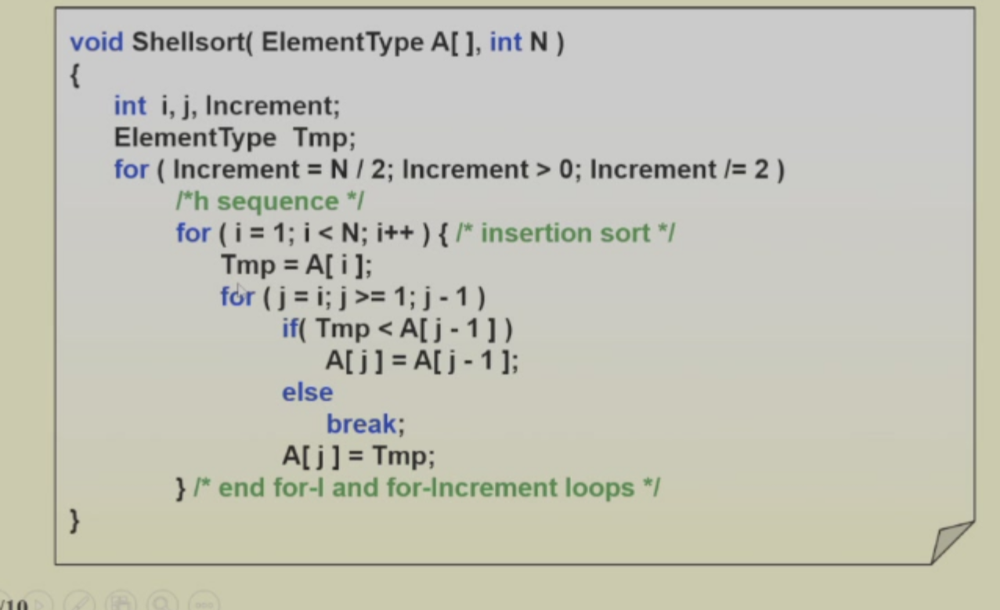
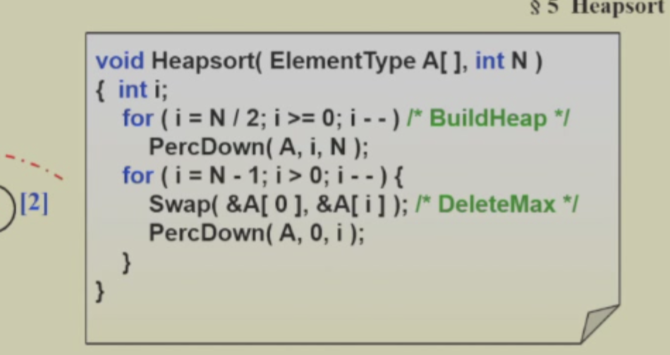
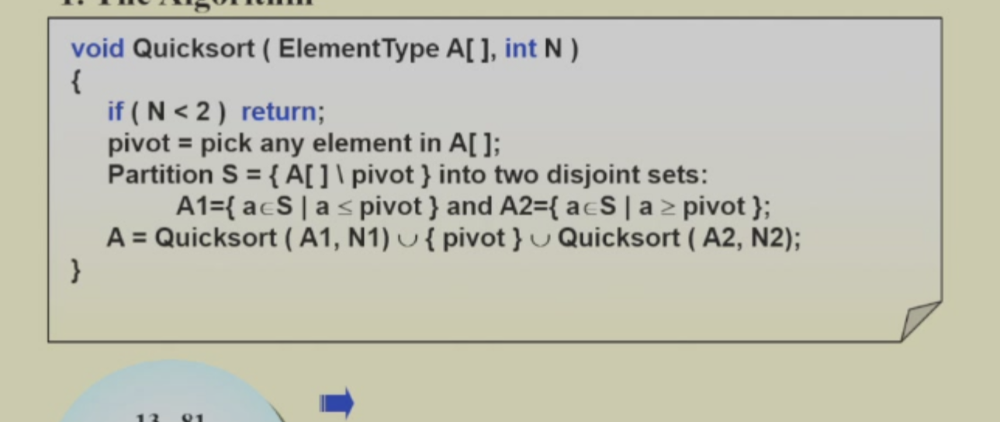
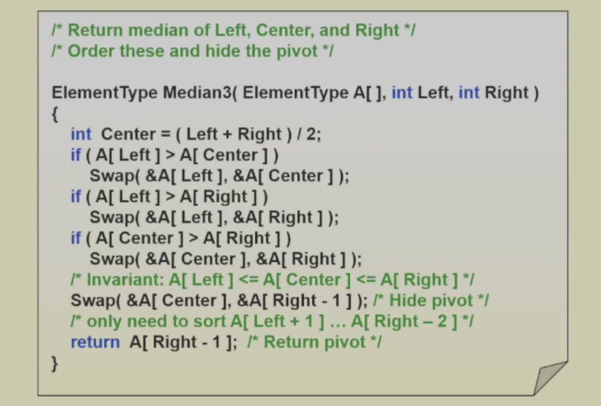
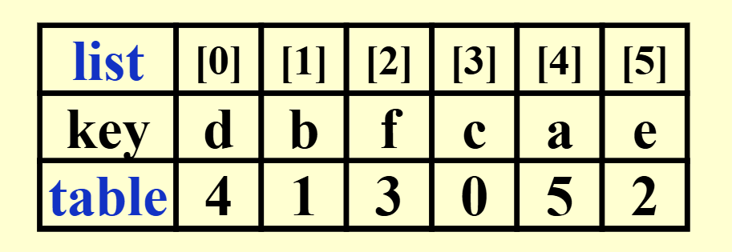

# 排序(sort)

## 排序的稳定性

排序的稳定性是指在排序过程中，如果两个元素相等，那么它们在排序后的序列中的相对位置和排序前是一样的。

## 简单排序

1. 冒泡排序：比较相邻的两个元素，如果第一个比第二个大，就交换他们两个。
2. 插入排序：从第一个元素开始，该元素可以认为已经被排序。取出下一个元素，在已经排序的元素序列中从后向前扫描。如果该元素（已排序）大于新元素，将该元素移到下一位置。重复步骤，直到找到已排序的元素小于或者等于新元素的位置。将新元素插入到该位置后。
3. 选择排序：首先在未排序序列中找到最小（大）元素，存放到排序序列的起始位置，然后，再从剩余未排序元素中继续寻找最小（大）元素，然后放到已排序序列的末尾。以此类推，直到所有元素均排序完毕。

这些排序的最差时间复杂度都是O(n^2),这里不加叙述

## shell sort

shell排序是插入排序的改进版，它利用了插入排序的思路，但是比插入排序快很多。  
他就是将数组分割成多个子数组，然后对子数组进行插入排序，最后再对整个数组进行插入排序。这主要是由于插入排序的时间和数列的已经排序程度xu如果数列已经排好序，那么插入排序的时间复杂度就比较低。

代码如下

这里的increment是选数的间隔，比如increment=4，那么就分成了4个子数组，然后对子数组进行插入排序，最后再对整个数组进行插入排序。

而increment的选取也有讲究(如果傻傻的选取一半一半的话，那么最差时间复杂度就是O(n^2)，例子见ppt),而比较优秀的选择序列有Hibbard's,Sedgewick's,Pratt's,Knuth's,and Shell's.

## 堆排序

就是利用维护最小堆，或者最大堆进行排序

1.最小堆处理

这个非常简单，每次从最小堆中取出最小的元素，存储到一个新数组，最后再统一放回去

2.最大堆处理

这个就不用新的数组了，直接在最大堆操作，每一次从最大堆中取出最大的元素，然后放到堆的最后(之后调整堆)

但是请注意**数组下标从0开始，而之前的代码下标从1开始，可以移动数组/修改堆代码的映射关系**

## 归并排序

这个上学期都讲过了，就是把一个大问题分成两个小问题，就是一个大数组，拆成先排好两个小数组，之后合并。代码看ppt吧

这里比较重要的主要是复杂度的计算

## 快速排序

虽然这个也讲过了，但是还是写一下吧，

快速排序就是寻找一个基准值，之后将小于基准值的放在左边，大于基准值的放在右边，然后对左右两边进行快速排序，这样时间复杂度就变为了O(nlogn)

好，很明显有两个问题：1.怎么放置 2。基准值怎么选取

1.怎么放置：有两边扫描和单边扫描，两边扫描大概就是一个从左找比基准值小的，一个从右找比基准值大的，如果一个反而找到了大的，另一个反而找到了小的，那么就交换  
单边扫描，则是要记录小的的最后一个，如果新扫描的是大的，那就继续，如果是小的，那就交换他和小的 的最后一个。

2.基准值怎么选取：2.1 选取第一个，不太好（有些样例） 2.2 随机选取good 2.3 median3 good

3.整个代码实现

注意，为了加快速度，我们可以将个数较少时候，直接使用插入排序

复杂度分析见ppt

**运用快排这种划分思路的算法，能解决很多问题，比如找第k小的数，找第k大的数，找中位数等。**

## sort large structures

这个就是用来排序大结构体的，主要是用来排序大数据集的。

就是我们直接交换这个大结构数实在是麻烦，我们想用一个指针指向这个大结构，只交换指针，之后根据指针的改变再移动大结构。

我们这里的指针就可以直接用数组的下标。

之后我们如何根据指针交换呢，很简单，一个temp存储一下第一个，之后用next current记住现在处理的和下一个处理的（下一个处理的其实就是因为上一个处理之后转移的，现在那个位置就空了），这样不断赋值就行了

我们可以发现，每次都是遍历了一个环就结束了

因此最差就是有n/2个环，这样要移动3n/2次

## 利用决策树证明比较方式的排序的时间复杂度最好就是O(nlogn)

ppt写的比较详细了，这里就不多说了

## 桶排序和基数排序

有什么排序是线性的呢？？

我们是不是可以直接把要排序的值作为下标，这样子不就相当于直接排好序了。

这种对于数的个数和数可以取值的范围比较相近时候，可以使用。

但是如果数的个数和数可以取值的范围差距很大，那么就不适用了。
比如说我们有100个数，但是数的范围是0-1000000，那么就不适用了。

这种时候我们可以使用基数排序

### 基数排序

基数排序可以简单理解为先按个位数排序，然后按十位数排序，然后按百位数排序，最后按千位数排序。记住每一次排序的数组都是上一次排完的。

基数排序有LSD和MSD两种方式，LSD就是从低位到高位排序，MSD就是从高位到低位排序。