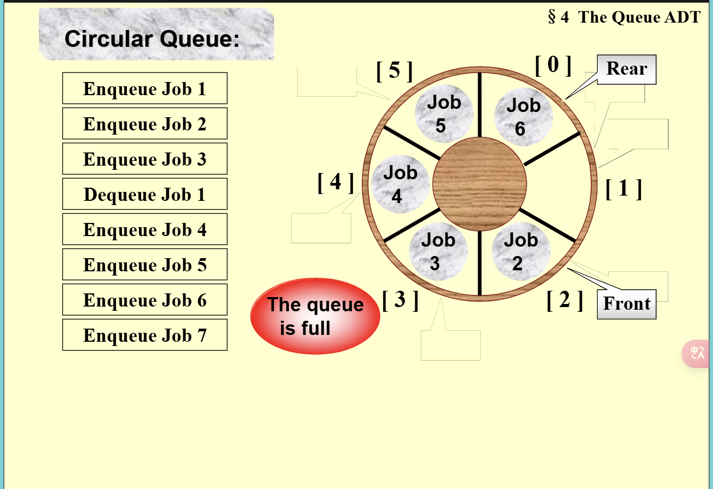

# fds之基础数据结构：栈和队列

## 栈 (Stack)

### 实现方式 (Implementation)

1. **数组实现**：通过 `top` 记录最上面的元素的位置  
2. **链表实现**：通过 `head` 指针指向第一个元素，进行删除，插入等操作  

### 操作 (Operations)

- **是否是空**：检查栈是否为空
- **创造**：创建一个新的栈
- **pop**：弹出栈顶元素
- **清空**：清空栈
- **插入**：在栈顶插入元素
- **获取顶部元素**：获取栈顶元素（具体代码看ppt）

### 用途 (Applications)

- **平衡符号**：检查符号是否匹配
- **表达式计算**：
  1. **前缀、中缀、后缀表达式**：
     - **中缀**：正常的书写规则，左中右
     - **后缀**：左右中的读取树的方法，计算时只需建一个数字栈，每次遇到运算符，就计算，再压进栈中。
     - **前缀**：中左右，从后往前模仿后缀的计算方法

  2. **中缀转换成后缀**：
     - 遇到数字时，直接写入。
     - 遇到运算符时，若优先级高于栈内运算符，则进栈；若低于或等于，则弹出栈顶运算符，重复操作直到低于等于，再将运算符进栈。
     - 最后将栈内剩余运算符弹出。

  3. **括号处理**：
     - 左括号优先级设置很高，一旦进栈就变得最低
     - 右括号优先级很低，遇到右括号时不断弹出，直到左括号（括号不展示到后缀表达式）
  4. **表达式建树**：<https://yebd1h.smartapps.cn/pages/blog/index?blogId=126182368&_swebfr=1&_swebFromHost=baiduboxapp>

- **函数调用递归**：依靠栈实现

## 队列 (Queue)

### 实现方式(Implementation)

和栈差不多，也是数组或者链表，操作就是从头插入和从尾巴删除，两个指针 `front` 和 `rear` 即可。

### 优化 (Optimization)

我们注意到，队列在删除以后前面的空间就用不到了，会造成浪费。

- 因此，我们弄出了**循环队列**，就像一个圆圈一样，使用取余操作。这里是示意图：

但是，我们发现，会出现无法判断是空的还是满的的情况。这时我们可以把rear指向要插入的位置（而不是最后一个，是最后一个的下一个），这样就可以区分了。也有其他的方式，比如flag，空一个位置等。

## 再简要的说说表达式求值和建树

### 表达式的互相转换

1. **中缀转后缀**：见上面
2. **中缀转前缀**：差不多
3. **后缀转中缀**：先建树再转
4. **前缀转中缀**：先建树再转

### 表达式求值

1. **中缀表达式求值**：就是上面的中缀转后缀，然后求值
2. **后缀表达式求值**：就是直接从左到右，遇到数字就入栈，遇到运算符就弹出两个数，进行运算，再入栈，最后栈顶就是结果。
3. **前缀表达式求值**：和后缀表达式求值一样，只是从右到左。

### 建树

1. **中缀表达式建树**：其实和他求值（中缀转后缀的想法差不多）
2. **后缀表达式建树**：从左到右，遇到运算符就找最近的两个节点
3. **前缀表达式建树**：和后缀表达式一样，只是从右到左

### 从树得到表达式/求值

1. **中缀表达式**：中序遍历，遇到运算符就加括号
2. **后缀表达式**：后序遍历，不担心括号问题，直接输出即可
3. **前缀表达式**：先序遍历，不担心括号问题，直接输出即可
4. 可以从树直接计算表达式的值（递归）
