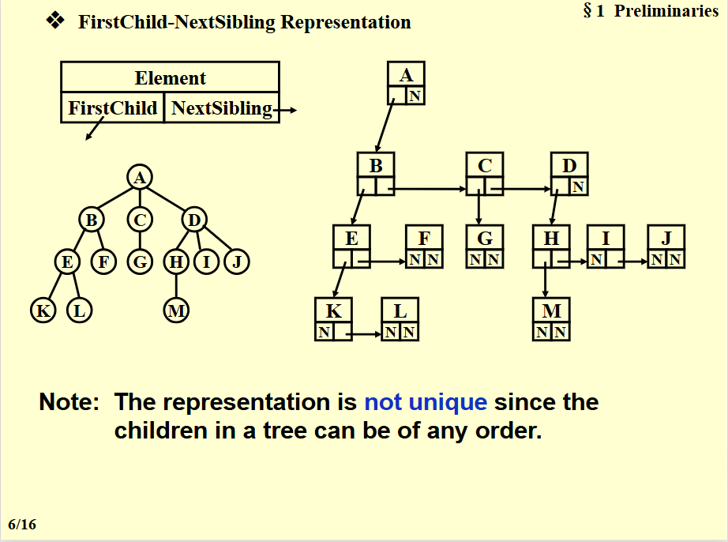
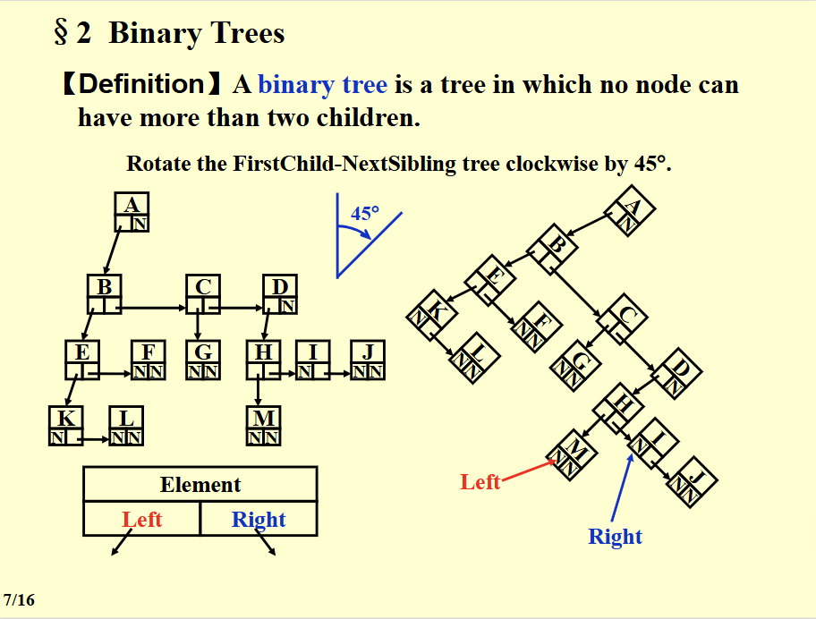
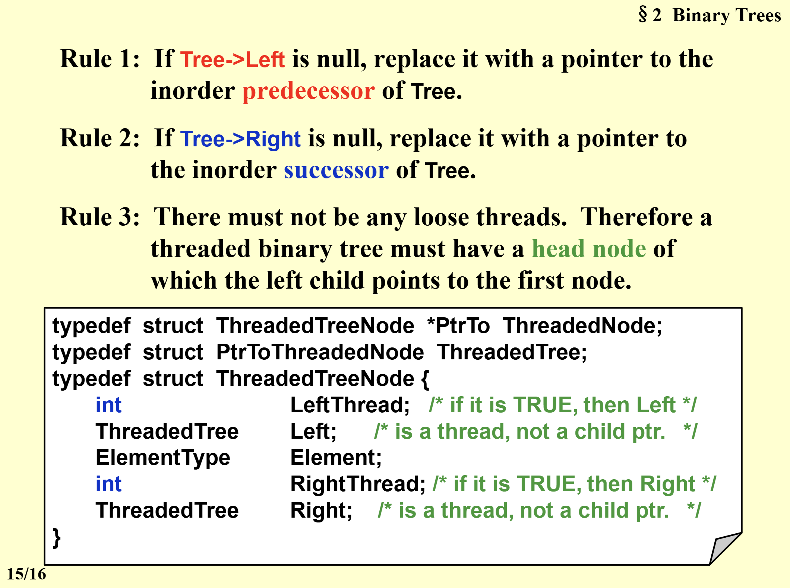
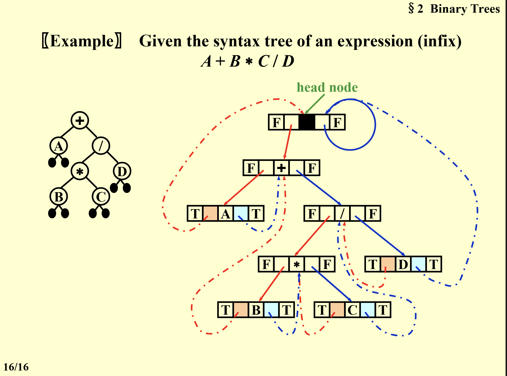
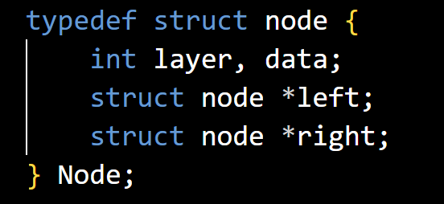

# tree1

## 定义

tree 是一个点的集合，n个节点有n-1条边，没有回路，全部联通

- **点的度**：每个点的儿子的个数
- **树的度**：最大的点的度
- **路径长度**：n1-n2-..-nk需要多少条边
- **高度**：最深叶子节点到树根的距离（深度）

## 表示

~~可以使用数组表示（不方便）~~  
可以用链表，但每个点儿子数量不同。因此我们有:  

firstchild and sibling 存储的方法
  

这样每个只用两个指针，同时我们发现一转就是二叉树。  
**所有的树都可以转换成二叉树！**  

因此我们后面都讨论二叉树

## 二叉树的遍历

### 每个节点访问一次的遍历方式（这里可以是所有树的遍历）

1. 深搜 for循环搜索他的每一个孩子，再在每次for循环中执行继续的深搜（分为先序，后序）  
2. 广搜 通过队列，把每个孩子入队，之后再每次从队列取出

### 二叉树的遍历：先序，中序，后序

- 先序：根左右
- 中序：左根右
- 后序：左右根
先序中序后序都可以用递归方式或者非递归的栈方式解决，递归方式好写，但时间久一点。  
三种方法背后蕴含的堆栈操作是一样的，只不过输出的时机不一样，有些是push的时候，有些是pop的时候。（所以一种合法的堆栈操作对应一棵树！，至于个数计算，可以用出动态规划!(递归)）
这里给出网址，可以从这看代码：  
<https://blog.csdn.net/weixin_47160526/article/details/120982157>

### 线索二叉树

- 我们发现，二叉树会有n+1个点存储的left或者right是空（2n-（n-1））,这是我们不想看到的。因此我们为了充分利用，就再没有指向左儿子或者右儿子的地方，指向他的前驱和后继

#### 前驱和后继

- 前驱就是中序遍历时该节点前一个
- 后继就是中序遍历时该节点的后一个

#### 优点

线索二叉树充分的利用了每个节点，使得遍历可以不再需要栈（递归），提升遍历速度。

#### 实现

1.注意每个节点的左和右都要有指向，充分利用，所以第一个遍历到的节点的左节点和最后一个遍历到的节点的右节点也要指向东西，因此我们创造一个head节点，让前面提到的这两个东西都指向他。之后head节点的左节点指向root，右节点指向自己。这个head节点是干嘛的呢？  
因为这个优化的开始是找到第一个节点，这个时候我们就要左边走到底。因此，他只用给我们head，就可以很轻松找到第一个节点（遍历的第一个）

2.如何构建？只要在中序遍历的时候同时构建就可以了

3.构建规则 我们一个点存储有五个值，左节点的判断值，指向的左节点/前驱，节点值，右节点指向的右节点/后继，右节点判断值。其中，判断值用来决定这个指针指的是儿子还是前驱/后继。

4.示意图如下

5.代码实现：
<https://yebd1h.smartapps.cn/pages/blog/index?blogId=140755796&_swebfr=1&_swebFromHost=baiduboxapp>

### 建立一棵树

我们好像忘了说怎么建立树

首先我们要知道，只有给定了一棵树的先序和中序遍历，或者中序和后序遍历，我们才能唯一确定一棵树。因此我们可以通过这两种方式建立一棵树。  
以下用先序和中序遍历建立一棵树  
1.先序遍历的第一个节点就是根节点。  
2.之后在中序遍历找到这个节点，左边就是左子树，右边是右子树  
3.算一下，左右子树的大小（点的个数），从而能在先序中得到左右子树。  
4.对左右子树重复上述步骤。  
5.后序就是根在最后，差不多的。  

代码上网找吧，一找一大把

### 二叉树的代码表示

用链表表示，每个节点左右指针指向儿子，还有一个值存储节点。

### 二叉树和栈

给你一个二叉树的栈（前中后的栈操作都是一样的），就是（中序）搜索二叉树时候的栈的操作。如何得到二叉树呢。  

我们知道，二叉树的中序是一直往左子树走入栈，走到头，然后出栈，再走右子树。因此我们可以通过栈来得到二叉树。  
这里我们就注意到，push的操作，对应的就是前序的遍历，pop的操作对应的就是中序的遍历。  

通过上面的原理，我们就可以知道了，当这个操作的前面一个操作是入栈，那么这个操作对应的点就左儿子，当这个操作的前面一个操作是出栈，那么这个操作对应的点就是右儿子。因此我们可以通过这个来建立二叉树。
