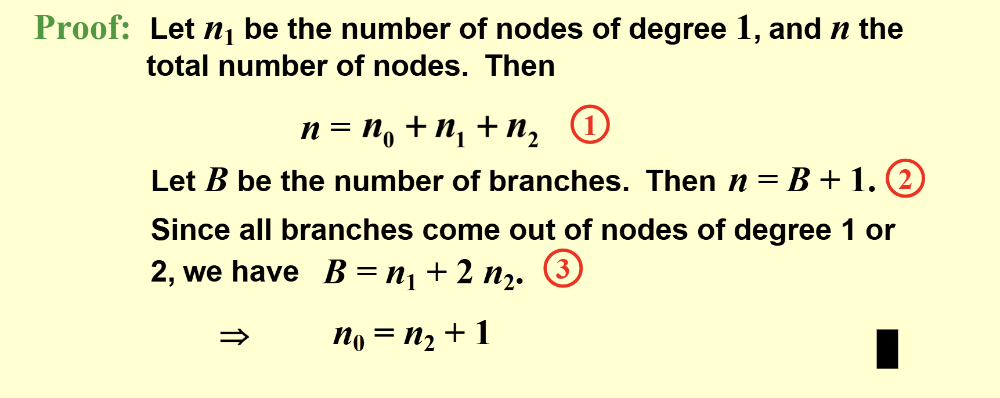

# 二叉搜索树

## 完全二叉树

1. 定义：完全二叉树就是一个满的二叉树，只是最后一层的节点不一定是满的，但是最后一层的节点都是从左到右排列的。（区别于满二叉树）

2. 存储：完全二叉树有一个很好的存储方式：数组。因为完全二叉树的节点是从左到右排列的，所以我们可以用数组来存储，不需要指针。  
而且我们可以发现规律，对于一个节点i（下标为i，是第i个），它的左孩子是2i，右孩子是2i+1，父节点是i/2。（从1开始存储）。这就非常容易找到儿子和父亲了.接着我们可以发现，完全二叉树的数组输出就是层序遍历的结果。

## 二叉树的性质（很抱歉，这里都还没讲搜索树）

1. 二叉树节点数  
1.1 深度为k的二叉树至多有2^k-1个节点  
1.2 二叉树的第k层至多有2^(k-1)个节点

2. n0, n1, n2  
n0是叶子节点数，n1是只有一个孩子的节点数，n2是有两个孩子的节点数。

我们有这样一个公式：n0=n2+1（证明利用节点个数算两次的方法）


## 二叉搜索树：终于来了

1. 定义：二叉搜索树是一个二叉树，并且每个节点的左子树中的所有节点的值都小于这个节点的值，右子树中的所有节点的值都大于这个节点的值。（最小值不一定是叶节点，最大值也是，最小的就是最左的，最大的就是最右的）  
有没有发现，二叉搜索树的中序遍历是递增的！  
为什么不直接用数组二分呢？因为数组插入删除不方便。
1. 操作

- 查找：从根节点开始，类似插入比较大小，直到找到或者找不到。（查找是伪装的递归，可以用循环实现）
  代码:

    ```c
    Position Find(ElementType X, SearchTree T) 
    { 
        if (T == NULL) 
            return NULL;  /* not found in an empty tree */
        if (X < T->Element)  /* if smaller than root */
            return Find(X, T->Left);  /* search left subtree */
        else if (X > T->Element)  /* if larger than root */
            return Find(X, T->Right);  /* search right subtree */
        else  /* if X == root */
            return T;  /* found */
    }
    ```

- 删除：删除节点有三种情况：  
  - 1.没有孩子：直接删除  
  - 2.有一个孩子：删除后，孩子顶上  
  - 3.有两个孩子：找到右子树的最小值，替换，然后删除右子树的最小值。
  - 还可以不要真的删除，而是标记一下，这样恢复这个点比较方便
  代码：

  ```c
   SearchTree Delete(ElementType X, SearchTree T)
    {
        Position TmpCell;

        if (T == NULL)
            Error("Element not found");
        else if (X < T->Element)  /* Go left */
            T->Left = Delete(X, T->Left);
        else if (X > T->Element)  /* Go right */
            T->Right = Delete(X, T->Right);
        else if (T->Left && T->Right)  /* Two children */
        {
            TmpCell = FindMin(T->Right);
            T->Element = TmpCell->Element;
            T->Right = Delete(T->Element, T->Right);
        }
        else  /* One or zero children */
        {
            TmpCell = T;
            if (T->Left == NULL)  /* Also handles 0 children */
                T = T->Right;
            else if (T->Right == NULL)
                T = T->Left;
            free(TmpCell);
        }

        return T;
    }
    ```

- 插入：类似查找，找到位置插入即可。
  代码：

  ```c
   SearchTree Insert(ElementType X, SearchTree T)
    {
        if (T == NULL) { /* Create and return a one-node tree */
            T = malloc(sizeof(struct TreeNode));
            if (T == NULL)
                FatalError("Out of space!!!");
            else {
                T->Element = X;
                T->Left = T->Right = NULL;
            }
        }  /* End creating a one-node tree */
        else  /* If there is a tree */
        if (X < T->Element)
            T->Left = Insert(X, T->Left);
        else if (X > T->Element)
            T->Right = Insert(X, T->Right);
        /* Else X is in the tree already; we'll do nothing */
        return T;   /* Do not forget this line!! */
    }
    ```
