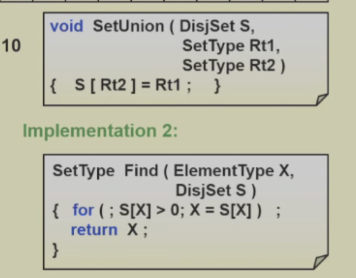

# 并查集

## 定义

1. 并查集（Union Find Set）： 并查集就是用来判断两个元素是否属于同一个集合的数据结构，可以用树实现

## 操作

1.表示集合：用一个数组表示，数组的每个元素表示集合的索引，索引指向下一个元素，如果索引指向自己或者0，负数，则表示该元素为集合的根节点。比如10号是4号的根节点，那么fa[4]=10;

2.查找：通过递归的方式，找到集合的根节点，如果集合的根节点和当前元素相同，则表示当前元素属于同一个集合，否则表示当前元素不属于同一个集合。


3..合并：通过递归的方式，找到两个集合的根节点，如果两个集合的根节点相同，则表示两个集合已经属于同一个集合，否则将两个集合的根节点指向同一个集合。

### 等下，这里有个问题

如果我让1的根是2，2的根是3，3的根是4，这样查找还是O（n）不好。这个树不平衡啊

### 优化

1.union by height:就是我们不要再傻傻的他说怎么合并就怎么合并了，而是应该把小的合并到大的，这个小可以是高度，也可以是点（size）  
2.union by size：上面说的很清楚了

3.那如何存储size/height呢，我们可以让根节点存的值为负的size/height，每当find到的时候，我们就可以查看并且更改。

### 再优化：path compression

1.path compression：就是我们每次find的时候，都把路径压缩到根节点，这样，我们每次find的时候，都是O（1），不浪费这个find的操作，就把这个树变得很扁了。

2.代码实现

```c
\\ 递归
SetType  Find ( ElementType  X, DisjSet  S ){
    if ( S[ X ] <= 0 )    return  X;
    else return  S[ X ] = Find( S[ X ], S );
    }
\\ 循环

SetType  Find ( ElementType  X, DisjSet  S ){  
     ElementType  root,  trail,  lead;
     for ( root = X; S[ root ] > 0; root = S[ root ] );  /* find the root */
     for ( trail = X; trail != root; trail = lead ) {
        lead = S[ trail ] ;   
        S[ trail ] = root ;  /* collapsing */
         }  
         return  root ;
         }
```

### 时间复杂度

通过以上操作，他的时间复杂度就很低了，基本是线性。详细见ppt
