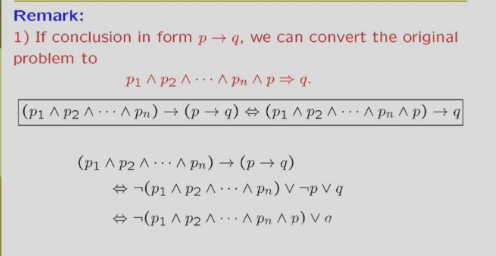
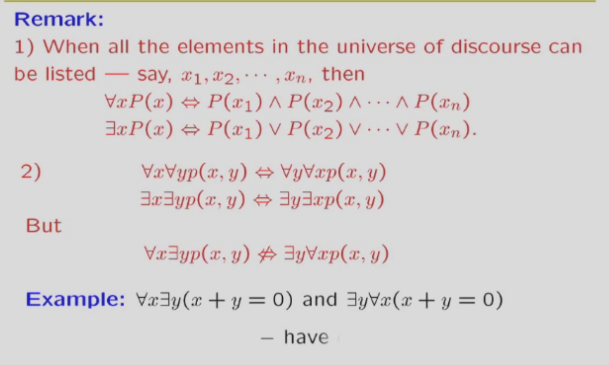
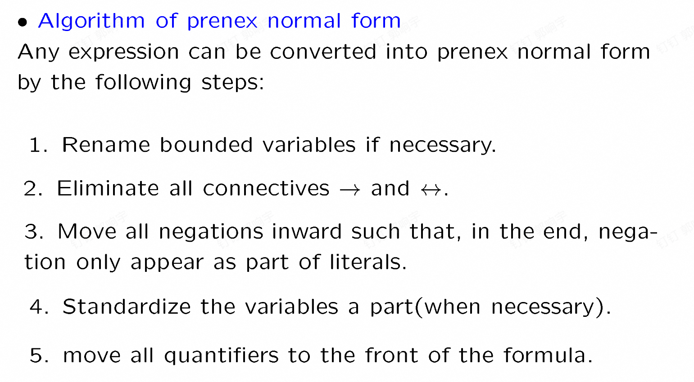

# 命题逻辑选谈

ps:知识点普及

1. 重延式：永远对的
2. 矛盾式：永远错的
3. 重要转换公式1：p->q 等于 非p析取q 等于 非（ p 合取 非 q）。
4. 重要转换公式2：p<->q 等于 （p->q）析取（q->p） 意思就是两个命题是等价的
5.命题是有真假的陈述句

## 命题逻辑之normal forms

这里的东西和数字逻辑里面讲的几乎一样，只是换了个词语，这里不多赘述。

只需要注意一个点，由于离散数学有->符号，处理他要用重要转换公式1哦，同时记得用德摩根把**非**送进括号里面

---

### 命题逻辑之推理

推理其实就是几个命题（前提）能不能推出另一个命题*结论）

用符号表示其实就是 p1合取p2合取p3合取p4->p5是不是永远真的，即所有前提都对时，结论一定真，有一个假的，结论随便，此时推理成立。

ps:**有7个比较基础的推理形式，在ppt给出**

这里有个小技巧，即结论如果是个条件式（p->q）
那么可以把p也放在前提。
这里是具体证明
  
还有个小技巧：反证法,具体操作就是结论取反引入，之后证明会推出矛盾式  
这里是具体证明

推理的时候逻辑表达式等价也可以用，比如重要转换公式1，2。

### 命题逻辑之谓词，量词

根据所有人都要死->苏格拉底要死，我们发现原来的演算系统不够用，因此我们引入谓词，量词。

- 谓词：描述事物关系，个体特性的，比如x>3 谓词本身不是命题，没有真假。但是可以通过带入或者添加**量词**变成命题。
- 量词：就是存在，所有这种

- 只要存在自由变量（不受量词约束的），这就不会是个命题
- 如果要重命名一个变量，要改把所有这个名字的变量一起改，注意量词的作用域
- 量词的作用域：就是量词的约束范围，比如对于任意的x p(x) 这个量词的作用域就是p(x)。量词的作用域是最近的量词到最近的逗号或者句号。
- 谓词和量词形成的公式称为一个新的命题演算系统（其实式原来的演算系统的推广）
  
#### 谓词量词的逻辑公式

1.谓词里面的永真，永假式：比如对于任意的p p(x) 析取 非（对于任意p p(x)） 这肯定是永真式。  
2.谓词量词的常用公式  
2.1 谓词的德摩根律：不是对于任意的x <-> 存在x,不存在x<->对于任意的x都不  
2.2 分配律：小心啊(不同人和同一个人写法不同，是个括号的问题,就是量词作用域的问题，量词一般只管紧跟在后面的命题，如果打了括号就管整个括号的)  
2.3. 量词的**推理**公式（上面的只能算等价形式）：比如对于任意的x属于D p(X)，且d属于D，那么p(d)是成立的（推理的时候记得结合上面提到的推理公式（命题推理）哦，什么反证法也可以给他整上）  
2.4 还有很多，自己看ppt吧

#### 谓词量词的前述范式(prenex normal form)

1.前述范式定义：就是所有量词都在所有谓词之前，就是先把所有的量词都说了，再写出一个命题（也不完全是命题吧）

2.如何化简到前述范式：ppt有5个步骤，这里不赘述，上图！

