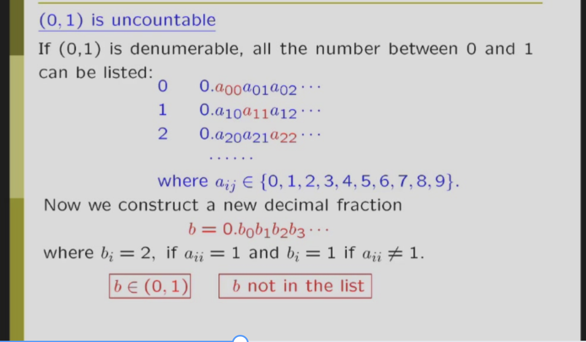

# 集合论（sets）

 引入：理发师悖论（不能又是运动员，又是裁判）

集合的定义（性质）：集合是由一些确定的、无序的、互异的对象组成的整体。  
集合的描述：list,谓词，韦恩图等

## 集合运算

并，交（和命题运算其实是一样的）X属于 A交B 就是 X∈A 合取 X∈B。  
还有很多看ppt

## 集合关系

## 幂集

1.定义：幂集（power set）：集合A的所有子集的集合，记作P(A),n元的集合，幂集的大小是2^n。

## 笛卡儿集合

1.定义：笛卡尔积（Cartesian product）：A×B={(a,b)|a∈A,b∈B}，是一个集合（有点像线性代数里面的）。（不能交换，不能结合！）
2.运算分配律：笛卡儿集合对并和交可以分配，A×(B∪C)=(A×B)∪(A×C)，A×(B∩C)=(A×B)∩(A×C)。  
3.多个集合的笛卡尔集合：A1×A2×...×An={(a1,a2,...,an)|ai∈Ai}，是一个n元组的集合。

## 集合的基数

1.有限集合的基数：元素个数  
2.计算方式：容斥原理！  
3.无限集合的基数：两个集合的基数相等，就是他们之间存在一个一一映射（不必唯一）  
4.我们发现，无线集合和他的子集可以个数相等，偶数和自然数。  

## 可数无限集合和不可数的

1.可数无限集合：集合能和自然数一一对应，比如自然数集，有理数集，正整数集合。（就是可数无限集合的元素可以编号，如果这个可以编号的序列能涵盖这个集（事实上，这里就是可数集于自然数集合的一一对应），那就是可数的无线集合）
2.可数无限集合性质

- 可数无限集合的并是可数无限集合
- 可数无限个可数无线集合还是可数无限集合  

3.不可数无限集合：集合不能和自然数一一对应，比如实数集，复数集，无限大数集。  
Q：为什么实数集是不可数的？  
answer：对角线证明：

## 函数

函数就是把一个集合映射到另一个集合  
由一一映射，单射，满射。  

### O(x),o(x),Θ(x),Ω(x)

O(X):上界（就是f(x)<=Cg(x)，C是常数），o(x)：小于上界，Θ(x)：上下界，Ω(x)：下界。  
