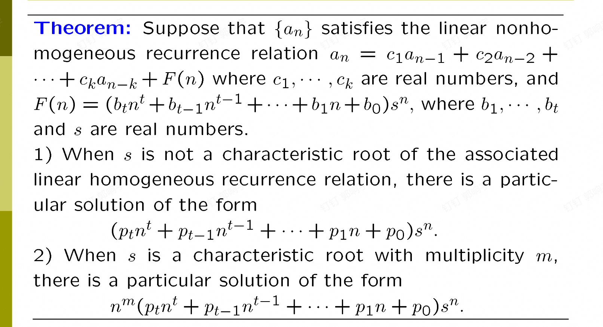
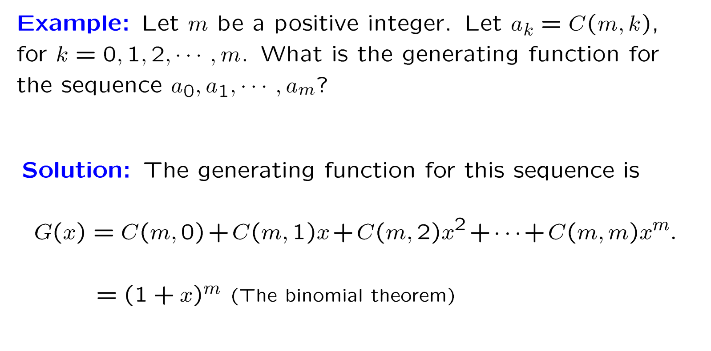
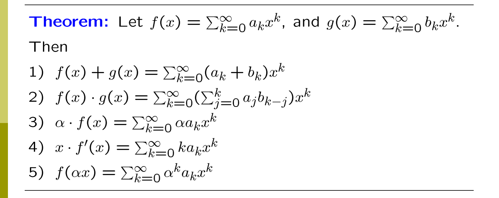
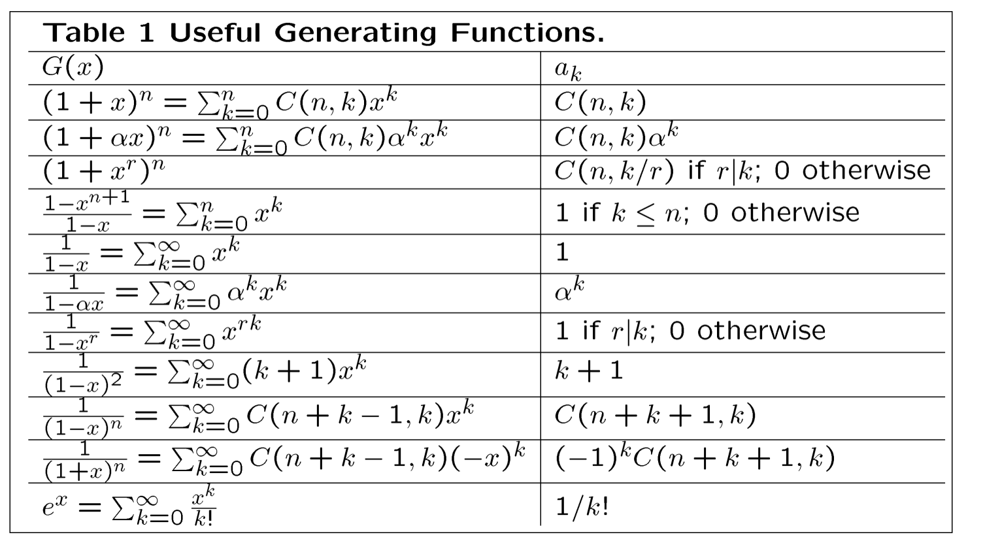

# 高级计数技巧

## 递推法

递推法是通过已知的结果来推导出新的结果的方法。它通常用于解决一些具有递归性质的问题。递推法的关键在于找到一个合适的递推关系式，将问题分解为更小的子问题，从而逐步求解。

例子:兔子繁殖，汉诺塔

### 线性齐次递推数列怎么算通项公式

线性齐次递推数列是指一个数列的递推关系是线性的，并且没有常数项。

使用的方法是线性是特征方程法

一般来说，线性齐次递推数列的通项公式可以通过以下步骤求解：（一般做的都是k=2）

1. 确定递推关系式：线性齐次递推数列的递推关系式是一个线性方程，即一个线性的方程组。
2. 求解特征方程：将递推关系式转化为特征方程，特征方程是一个多项式方程。
3. 求解特征根：求解特征方程的根，得到特征根。
4. 构造通项公式：根据特征根的性质，构造通项公式。
5. 代入初始条件：将初始条件代入通项公式，得到具体的数列值。
6. 注意重根的情况：如果特征方程有重根，则需要对通项公式进行调整，变成一个n的多项式乘以根的n次方。

### 非齐次(比如an=2an-1+3an-2+f(n))的通项公式

1.找齐次关系的解（忽略f(n)）
2.找非齐次方程的特解（特解也是一个通项公式啊！）(待定系数)
3.通解=齐次解+非齐次特解
4.代入初始条件求解常数
5.那这个特解怎么找呢：!  例子：[alt text](image-1.png)

## 母函数(Generating Functions)

母函数是一种数学概念，用于描述一个序列的函数(母函数和序列的对应关系)，母函数只是一个形式，用来辅助计算。

他的形式就是一个幂级数，通常表示为：
$$G(x) = a_0 + a_1 x + a_2 x^2 + a_3 x^3 + \ldots$$
其中，$a_n$ 是数列的第 n 项，$x$ 是一个变量。母函数可以用来表示和计算序列的性质，例如求和、乘积、组合等。  
例子：

一些生成函数的经典公式：
$$\frac{1}{1-\alpha x}=1+\alpha x+\alpha^{2}x^{2}+\cdots$$

$$\frac{1}{(1-x)^2} = \sum_{k=0}^{\infty} \left( \sum_{j=0}^{k} 1 \right) x^k = \sum_{k=0}^{\infty} (k+1)x^k(求导可证).
$$

### 扩展二项式定理

1.二项式定理我们如果把$(a+b)^n$的n扩展到负数/实数，那么我们会有扩展的二项式定理和系数

**Definition:**  
Let \( u \) be a real number and \( k \) a nonnegative integer. Then the **extended binomial coefficient** is \( \binom{u}{k} \), defined by  

\[
\binom{u}{k} =
\begin{cases}
\frac{u(u-1)\cdots(u-k+1)}{k!} & \text{if } k > 0 \\
1 & \text{if } k = 0
\end{cases}
\]

---

**Remark:**  
When \( u = -n \) is a negative integer,

\[
\binom{-n}{r} = (-1)^r \binom{n+r-1}{r}
\]

---

**Theorem**: (The Extended Binomial Theorem) Let \( x \) be a real number with \( |x| < 1 \) and let \( u \) be a real number. Then
$$
(1 + x)^u = \sum_{k=0}^{\infty} \binom{u}{k} x^k.
$$
证明：麦克劳林展开
因此，我们可以轻松的得到\( (1-or+x)^{-n} \)的幂级数表达式子(看下一张图)

### 回到母函数

根据上面讨论的那么多东西，我们可以得到一堆公式

### 母函数的应用(如何计数)

ok啊，上面的其实都是准备工作

下面讲讲应用,**母函数的核心是展开式与化简式的变化**

#### 知道递推关系求通项公式

思路大概是这样
1.利用递推关系求出生成函数关系(一般是先找出一项的关系->整体关系)
2.利用生成函数关系求生成函数
3.利用生成函数关系求通项公式

#### 计数（组合）问题（选取）

1.有点算两次的意思
2.其实也不是，大概是用1 x x2通过系数来代表取的个数，系数是权重之类的,每一个幂级数之和代表一类，之后算出对应的化简函数，对应的系数就是结果。(看ppt吧)
3.就是根据题意->幂级数和再乘积的式子->生成函数->系数（就是知道生成函数求an）->答案
4.一定去ppt看例子！！

#### 计数的排列问题（选取之后还要排列）

排列问题比组合问题多了一个排队的过程，因此我们设置的幂级数系数不能再是简单的1，而是要考虑排列的顺序，因此我们设置系数为1/n!，其中n是选取的个数。

**Definition:** The exponential generating function for the sequence $\{a_n\}$ is the series

$$\sum_{n=0}^{\infty} \frac{a_n}{n!} x^n.$$

稍微解释一下，这里的n!分之一其实相当于除去同一类交换位置的情况（因为是一样的）

最后我们看的系数也是\( \frac{x^n}{n!} \)的系数

例子看ppt

## 容斥原理

经典公式：$$ \left| \bigcup_{i=1}^{n} A_i \right| = \sum_{i=1}^{n} |A_i| - \sum_{1 \leq i < j \leq n} |A_i \cap A_j| + \cdots + (-1)^{n-1} \left| \bigcap_{i=1}^{n} A_i \right| $$

例子1:线性方程组整数解个数：正难则反+容斥原理

例子2：满函数的个数：容斥原理
