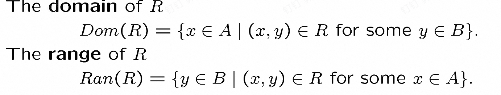
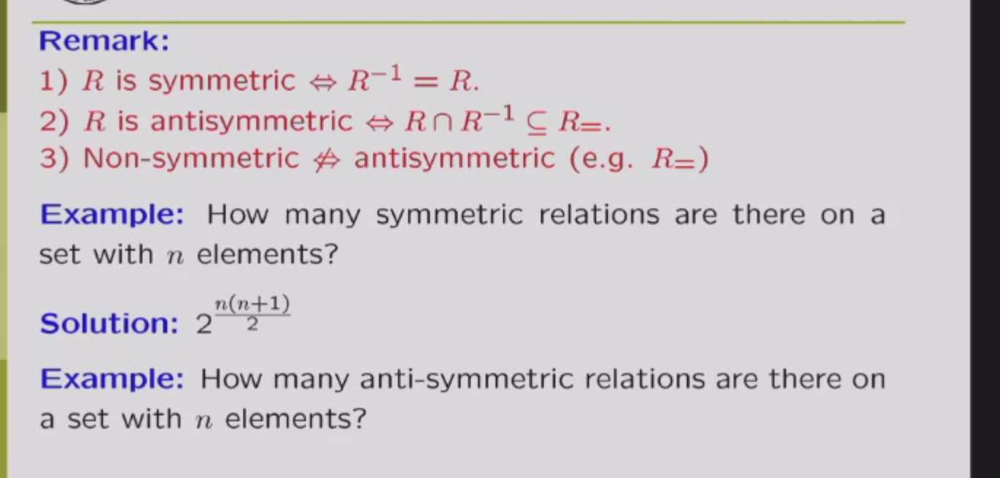
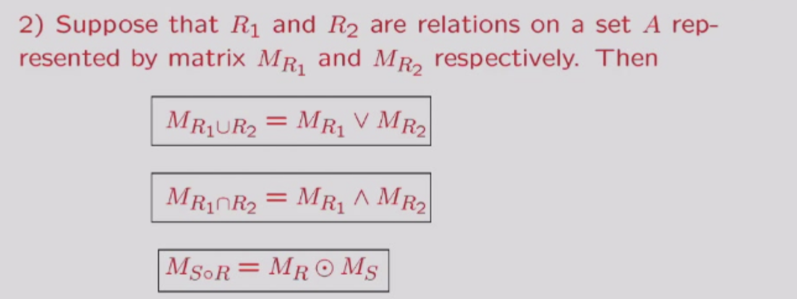
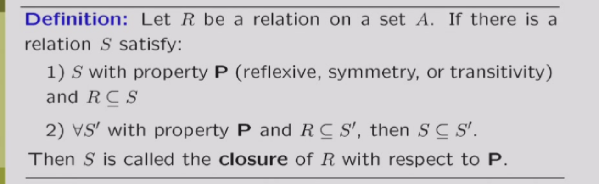
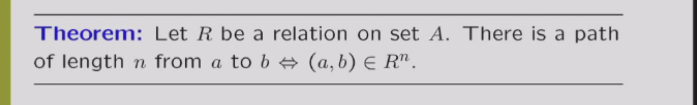
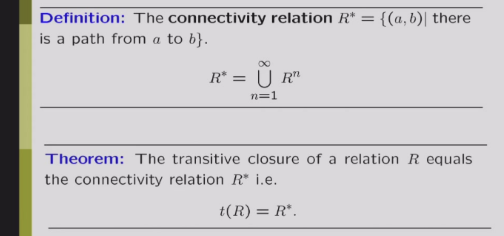
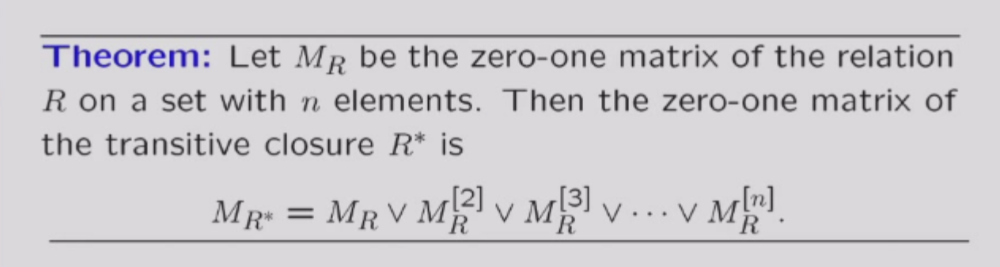
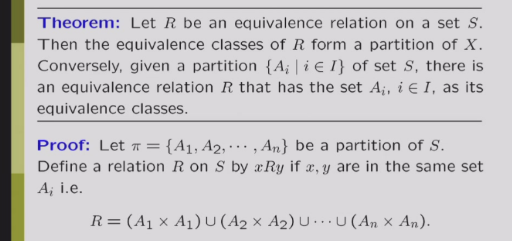
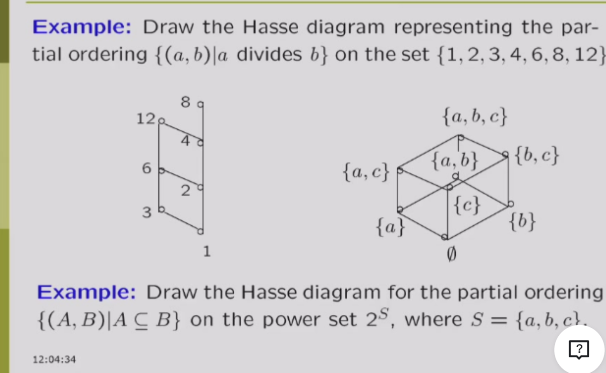

# relations 关系

关系有很多种，比如大于，小于，整除，这种二元关系都可以用笛卡尔集的子集(二维的点)来描述

**Example**: Consider \( P(x, y): x \leq y, \quad x, y \in \mathbb{N} \)

\[ R_{\leq} = \{(x, y) \in \mathbb{N} \times \mathbb{N} \mid x \leq y\} \subseteq \mathbb{N} \times \mathbb{N} = \mathbb{N}^2 \]

可以知道，一种二元关系，对应的一个子集

因此n个元素，其实可以有\(2^{n^2}\)种二元关系

**Definition**： A binary relation \( R \) between \( A \) and \( B \) is a subset of the Cartesian product \( A \times B \).

由此也可以定义关系的dom和range：

也可以类似的定义n元关系

## combining relations

**Definition**: The composition of two relations \( R \) and \( S \) is defined as follows:
\[ R \circ S = \{(x, z) \mid \exists y \in B: (x, y) \in R \land (y, z) \in S\} \]

可以简单的理解为R和S中间有个桥梁，能连接的就是S和R的组合

接着定义R的n次方：
R的n次方就是R的n-1次方和R的组合(找的其实是根据关系R，n步才能到达的点)

也可以定义R的逆（-1次方）
\[ R^{-1} = \{(y, x) \mid (x, y) \in R\} \]

## properties of relations

注意以下的R的定义域和像都是一个集合

1. **reflexive**: \( \forall x \in A, (x, x) \in R \)  自反关系：对于每一个元素x，x和x之间都存在关系 (irreflexive: \( \forall x \in A, (x, x) \notin R \) 反自反关系：对于每一个元素x，x和x之间都不存在关系)

有个小问题：n元素集合，可以有多少个自反关系？ 2^(n*(n-1))(很简单，就是你(n,n)肯定要选，其他的随便选)

2. **symmetric**: \( \forall x, y \in A, (x, y) \in R \Rightarrow (y, x) \in R \) 对称关系：如果x和y之间有关系，那么y和x之间也有关系 (antisymmetric: \( \forall x, y \in A, (x, y) \in R \land (y, x) \in R \Rightarrow x = y\) 反对称关系：如果x和y之间有关系，且y和x之间也有关系，那么x和y是同一个元素,其实就是xy不一样时候xy和yx不能都是R关系 )

反对称和对称都不关心相同的东西，因此，其实可以有一个关系是对称又是反对称。

性质：

3. **transitive**: \( \forall x, y, z \in A, (x, y) \in R \land (y, z) \in R \Rightarrow (x, z) \in R \) 传递关系：如果x和y之间有关系，y和z之间有关系，那么x和z之间也有关系

性质：R是传递的，说明R和R的组合属于R（互推）

其实上面性质可以推广：如果R在集合A是传递的当且仅当R的n次方都是属于R的（见ppt）

## 关系的表示方法

### 集合表示法

上面说的够多了

### 矩阵表示法

矩阵表示法就是集合A的元素作为行，集合B的元素作为列，若一个格子是1，就是对应的行列有关系，是0就是没有关系

#### 关系矩阵和关系性质的关系（有点拗口（

首先声明一下，矩阵元素的加法用析取（保证不超过1），乘法用合取（保证不小于0）

1. **reflexive**: 关系矩阵的对角线元素全为1
2. **symmetric**: 关系矩阵是对称的
3. **transitive**: 我们考虑矩阵相乘，如果R是传递，那么相乘的矩阵为1的地方，R的矩阵肯定也是1.（因为矩阵相乘得到的结果就是指的是可以通过一次传递得到的关系的两个点（想想矩阵乘法），由于他是传递的，所以这个两个点对应的方格在原来矩阵肯定也是1.）**这里我们也发现其实矩阵乘法他代表一种关系的组合啊**

相关性质：

### 图表示法

图表示法就是把集合A的元素作为点，关系作为边，边的方向表示关系的方向（有向图）

相应的也会有关系图和关系性质的关系，不多赘述了

### 关系的闭包

闭包就是在原来的关系上加上某种性质的关系，变成一个新的关系，而且这个关系是满足某种性质而且包含原来的关系最小的关系。

有点抽象对吧，我们看看这个

再说详细一点：用图来表示的话，自反就是把每个点加个环，对称就是把每条边加上反向的边。（自反闭包就是R并上恒等关系，对称闭包就是R并上R逆，传递闭包就是R并上传递关系）

那传递呢？？

先看一个理论：

哎呀呀之后自己看ppt讲不明白了

大概就是定义了路径长度，之后证明这两个理论

这个定理就是传递闭包的第一种求解方式

事实上，我们根本没必要算到正无穷，对于n个元素的集合，算n次就行了

再根据我之前说的矩阵乘法和关系组合的关系（上面有），我们可以用矩阵乘法来求解传递闭包

再解释以下矩阵乘法为什么和关系组合有关，说白了，就是因为矩阵乘法的算法方式，只要两个对应位置都是1，那就是（x,y），(y,z)的组合关系，所以就可以得到(x,z)的关系,这也就是相乘的矩阵为1。

**再说明白一点，其实矩阵乘法（R的n次方）算到的就是这两个点之间有没有长度为n的路径啊**

#### 第二种优化warshall算法

但是上面的每次都要算矩阵乘法，好麻烦。

原来算法是长度递增，而warshall算法是中间的点递增（其实就是floyd啊）因为我们其实并不太关心路径的长度，只关心有没有路径。

有点讲不清楚，自己看ppt理解一下

将一个方式吧 就是Wi你就把（i,i）这一列和这一行看看有没有1，如果有就列取一个，行取一个，之后他们做行引申和列引申的操作，交点标记为1.

其实以上所有的算法的根本原因都是！传递闭包就是把原来关系图的所有路径都加上一条边！！

### 等价关系

如果一个关系是等价的，即这个关系是自反，传递，对称的。

我们也可以用等价关系描述和一个元素等价的元素的集合[a]，等价类，等价类就是这个集合任意都有这个等价关系。

这里用同余比较好理解

[a]集合有三个性质：非空，若a,b
等价，则[a]=[b]，若a,b不等价，则[a]交[b]为空

商集：就是A所有等价类的集合就是A再R下的商集，记作A/R

所有等价类的并是A

### 划分

划分就是把A划分成几个等价类，比如A={1,2,3,4,5,6,7,8,9,10}，划分成3个等价类，那么就是{1,4,7,10},{2,5,8},{3,6,9}

就是等价类交为空，并为原集合

#### 如果我们给出划分，如何求出关系是啥

很简单，请看下图

### 偏序

偏序就是自反，反对称和传递/
比如小于等于，大于等于，整除。

由此可以定义可以比较，不可比较

#### 字典序

不多赘述，就是比第一位之后比第二个

#### Hasse 图

Hasse图就是一个描述偏序关系的图

绘制的方法：
1.先把有关系的连上边
2.去掉所有的环（是那种一个方向循环的）
3.去掉所有因为传递关系连的边
4.最后，每条边调整到他的出发点到结束点的下面

####

最大最小元，极大极小

最大元：所有其他的元素都是可以和他形成关系的且是左边的元素。

最小元：所有其他的元素都是可以和他形成关系的且是右边的元素。

极大元：没有元素能和他形成关系且是右边

极小元：没有元素能和他形成关系且是左边

upper_bound(x1,x2,x3) :同时和x1,x2,x3形成关系且是右边

least upper_bound(x1,x2,x3) :同时和x1,x2,x3形成关系且是右边且最小

lower_bound(x1,x2,x3) :同时和x1,x2,x3形成关系且是左边

greatest lower_bound(x1,x2,x3) :同时和x1,x2,x3形成关系且是左边且最大

请注意，上界下界不一定要在给定的集合中

#### lattice

lattice就是每两个元素都有上界和下界的偏序集合(意思是上界和下界也在集合中，封闭的)
