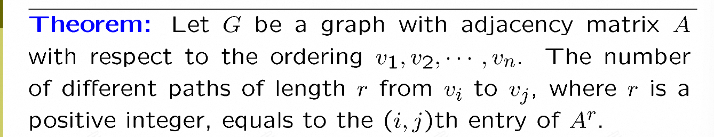
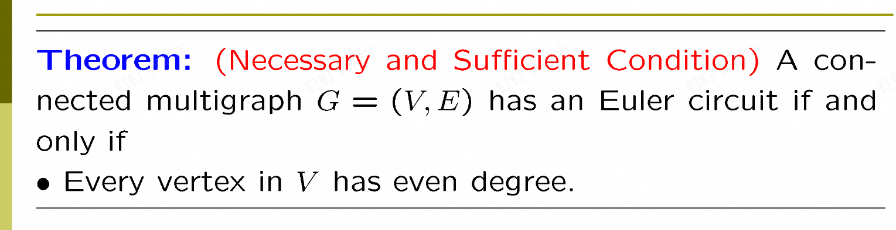
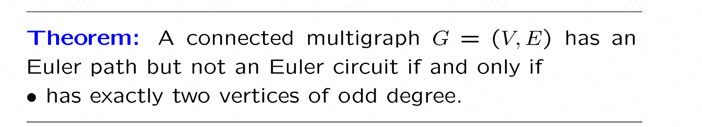
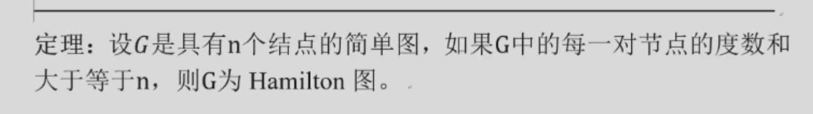
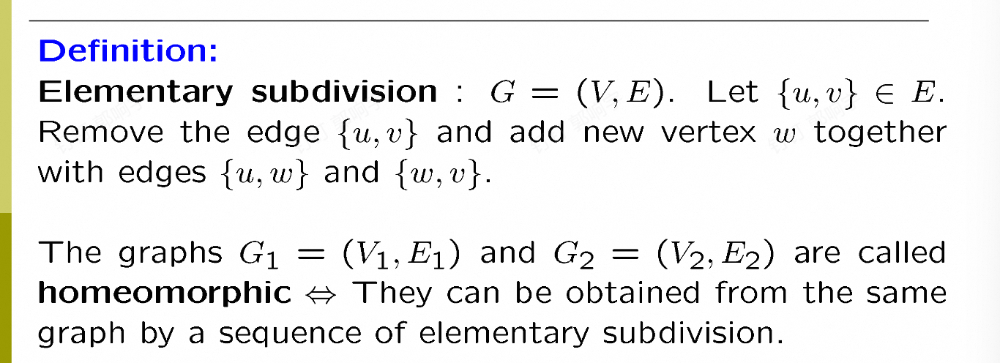
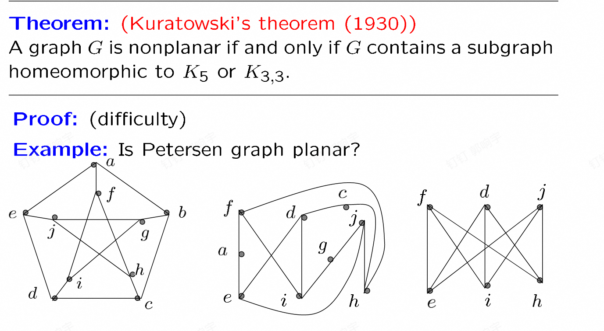

# graphs图论

## 图的类型

1.简单图: 简单图就是没有重边，没有自环

2.multi graph：简单图的基础上加上了重边

3.pseudograph：简单图基础上加了重边自环

4.有向图：有向图就是边是有方向的，无重边

5.directed multigraph：有向图的基础上加了重边

## 图的一些术语

这里就是什么度之类的，不想说了

就是有个定理，每一个图的度数之和是2倍的边数

有向图可以变成入度=出度=边数

二分图：一个图可以分成两个部分，而且两个部分没有交集，同时，每一个部分内部没有边。

完全二分图：两个部分的每一个元素都有边相连(就是这个部分取一个，另一个部分取一个，肯定有边连接)

环图:就是一个环

轮子图：就是环图上加一个点和之前所有点连边

n立方体图：顶点集是长度为n的二进制串组成，两个顶点只有一位数不同就连接。

子图：不多说

spanning subgraph：就是一个图的子图，包含了原图的所有点

union：就是把两个图的所有边和点都合在一起

## 图的表示

1. 邻接矩阵：就是一个 n × n 的矩阵，`a[i][j]` 表示 i 到 j 的边的权重。  
   如果没有边就是 0。

几个性质：

- **对称性**：无向图邻接矩阵满足  
  `a[i][j] == a[j][i]`

- **对角线**：简单图为 0，无自环

- **度数**：`deg(v_i) = sum a[i][j]`，也就是第 i 行的和

2.关联矩阵：就是点和边的对应关系表示的图，我们把图所有点和边作为矩阵行和列，如果点在边上，对应元素是1，否则是0.

## 图的同构

同构定义就是一个图的每个点可以映射到另一个图，而且原来有边连接，映射的图也有边连接。换句话说，就是顶点之间的11映射，重新标号后的邻接矩阵一样。

其实判断同构很难，但判断不同构很简单，因为同构的图性质一样，比如顶点数量，度数，边的数量等等(还有一个重要的，比如两度的点和三度的点相连)。

## 图的连通

### 一些定义

1.path：就是一条边连接的序列，比如1->2->3->4，就是一条path
2.回路：就是一条path，但是最后一个点回到第一个点
3.simple path和回路：不包含重复的边

### 无向图连通性

1.连通性：就是图的任意两个点都可以通过一条简单路径连接起来。
2.连通分量：就是连通性子图，就是连通性子图的数量就是连通分量的个数。

#### cut

cut vertices：割点就是去掉这个点和与他相连的边之后，产生了更多的连通分量
cut edges：割边就是去掉这个边之后，产生了更多的连通分量

### 有向图的连通

1.有向图的连通性：就是任意两个点之间都存在一条有向路径
2.强连通：就是任意两点之间都存在两条有向路径，一条从a->b，一条从b->a.
3.弱连通：有路径就行

### 两点之间的道路数量问题

定理如上，想求长度为n的道路的个数就把矩阵乘n次，然后对应的值就是

证明可以用数学归纳法，其实根据矩阵乘积的定义也很好理解

### paths and isomorphic graphs

图中的回路相同是一个判断图是否同构的必要条件

## 一些特殊的图

### 欧拉路和回路

欧拉路：就是一条路径，这个路径可以包括所有的边。  
欧拉回路：就是一条路径，这个路径可以包括所有的边，并且这个路径的起点和终点是同一个点。

欧拉回路的判断定理（无向图）

就是每个点的度数都是偶数而且连通（证明见回放）

欧拉路径的判断定理（无向图）

欧拉回路的程序：见fds

### 哈密顿图

哈密顿图就是存在一个路径，这个路径包含所有的点，且每个点只经过一次

哈密顿圈：路径是回路

哈密顿路径：就是普通路径

哈密顿图有一堆判断的充分/必要条件（见知乎）

哈密顿图还有一个判定方法，因为每个点只能一进一出，因此我们可以找所有度为2的点，连着这些点的边一定存在，从而推出度3 4或者更大的点的有些边不能存在。之后发现不可能连通。

当点的个数大于等于3，存在度为1的点时候，就不存在哈密顿回路了。

## 最短路

最短路问题就是从某个点出发，求最短的路径。

这个dijkstra算法就是最短路算法，我们在fds学过了，这里不说了

## planer graphs

1.planer graph：就是可以画成没有边相交（交叉）的图。

k3，3 k5不是planer graph

k4 Q3是planer graph

### 区域

区域就是把图分成若干个不相交的子图，每个子图都是一个planer graph。其实就是平面图把整个平面分成了多少块

### 欧拉公式

欧拉公式：G是一个连通planer graph，那么  边数-点数+区域数=2

证明可以考虑归纳法，归纳边数

不连通可以考虑每个连通分量

### corollary(用于说明不是平面图)

corollary：如果G是一个planer graph连通简单图 v>=3 满足点数<=3v-6

证明：要引入区域的度：区域的度就是在区域边界上的点的个数，是围着区域走一圈（回来）的边的个数。

我们可以发现，一条边要么是分开了两个区域，要么是一个区域他需要计算两次

因此：区域的度之和=2e，同时我们发现由于没有自环，没有重边，围城一个区域至少是3度。

因此2e>=3r,结合欧拉公式即可证明。

#### 升级

升级：如果G是一个planer graph连通简单图 v>=3 **而且没有长度为3的回路** 满足点数<=2v-4

### kuaratowski theorem

## 染色问题

一开始染色问题是给平面图区域染色，但我们把区域想象成点，二者有共边就连一条边，就可以变成点的染色问题。

染色问题：给一个图，给每个点一个颜色，使得任意两点间颜色不同。

chromatic number：一个图的最小染色数，就是需要颜色种类最小的数。

比如 Kn 的最小染色数就是 n

两部图的最小染色数是2（其实也是充要条件**还有一个充要条件：两部图不存在奇数长度的回路**）
