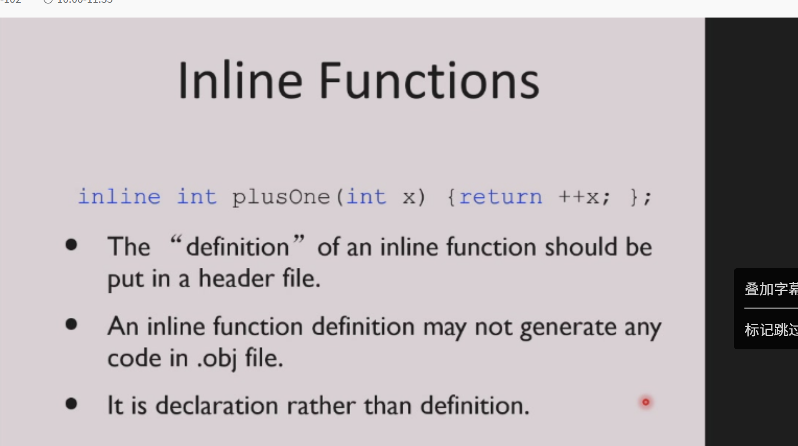
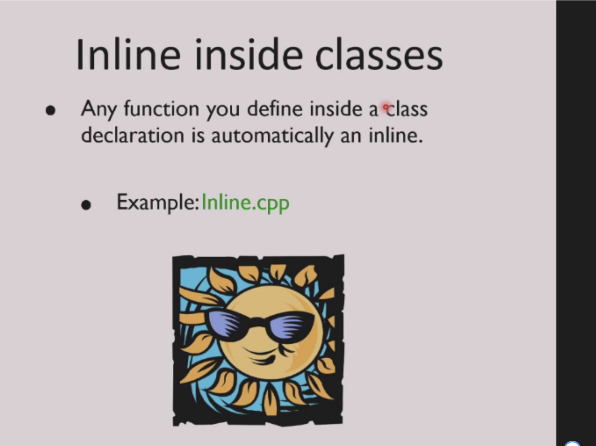
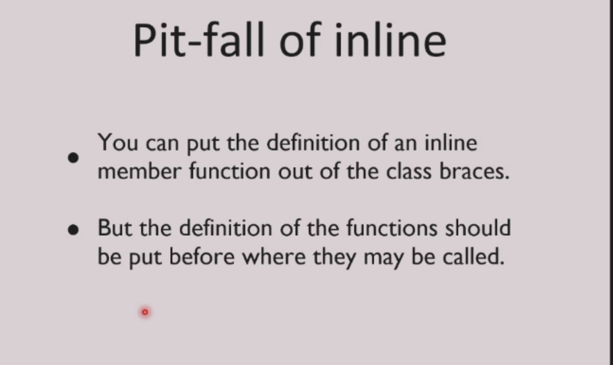

# inline 与 inheritance

## inline

---

### 一、核心概念先给你：

**`inline` 关键字告诉编译器：把这个函数的代码，直接「原地展开」到调用的地方，而不是真的去调用函数。**
这样就彻底消除了「函数调用的开销」，就像你写的宏一样，但比宏安全得多。

---

### 二、先搞懂：什么是「函数调用的开销」？

普通函数调用，会有这些额外成本：

1.  把参数压栈
2.  跳转到函数地址执行
3.  执行函数体
4.  把返回值出栈
5.  跳回调用处

对于**小函数**（比如`int add(int a, int b) { return a + b; }`），函数调用的开销，甚至比函数本身的执行开销还大，完全不划算。

---

### 三、`inline` 函数的效果：原地展开

### 1. 普通函数（有调用开销）

```cpp
int add(int a, int b) {
    return a + b;
}

int main() {
    int x = add(1, 2); // 这里会真的调用add()，有栈操作、跳转开销
    return 0;
}
```

### 2. `inline` 函数（无调用开销，原地展开）

```cpp
inline int add(int a, int b) {
    return a + b;
}

int main() {
    int x = add(1, 2);
    // ✅ 编译器会把这行直接展开成：int x = 1 + 2;
    // 完全没有函数调用，开销彻底消除！
    return 0;
}
```

---

### 四、和「预处理宏（#define）」的本质区别（PPT提到的）

PPT说「like a preprocessor macro」，但**本质完全不同，inline函数比宏安全100倍**：

| 特性 | `inline` 函数 | 预处理宏 `#define` |
|------|---------------|-------------------|
| **本质** | 真正的C++函数，有类型检查、作用域 | 文本替换，无类型检查、无作用域 |
| **参数计算** | 参数只计算一次 | 参数会被多次计算（宏的致命坑） |
| **调试性** | 可以断点调试 | 无法调试，展开后代码混乱 |
| **作用域** | 遵循函数/类作用域 | 全局替换，极易出问题 |
| **安全性** | ✅ 绝对安全 | ❌ 极易出bug（比如`#define ADD(a,b) a+b`，`ADD(1+2,3)`会算成`1+2+3`，不是`(1+2)+3`） |

---

### 五、`inline` 函数的核心规则（避坑指南）

1.  **`inline` 是「建议」，不是「命令」**
    编译器有权忽略`inline`（比如函数太长、有循环/递归，编译器会拒绝内联），`inline`只是给编译器的优化建议。

2.  **内联函数必须在头文件定义**
    因为内联函数要在调用处展开，编译器必须能看到函数体，所以不能只声明在头文件、实现在cpp，必须把完整函数体写在头文件。

3.  **适合场景：小、频繁调用的函数**
    比如`getter/setter`、简单数学函数、工具函数，这些函数调用开销占比高，内联收益大。

4.  **不适合场景：大函数、递归函数、虚函数**
    大函数内联会导致代码膨胀（代码体积变大），递归/虚函数无法内联。

---

### 六、补充：类内的`inline`函数

类内直接定义的成员函数，**默认就是`inline`的**，不需要加`inline`关键字：

```cpp
class Person {
private:
    int age;
public:
    // 类内直接定义，默认inline，自动展开
    int getAge() { return age; }
    // 等价于：inline int getAge() { return age; }
};
```

---

### 七、一句话终极总结

**`inline` 函数就是：让编译器把小函数的代码，直接展开到调用的地方，消除函数调用的开销，同时保留函数的类型安全，比宏更安全、更高效。**






