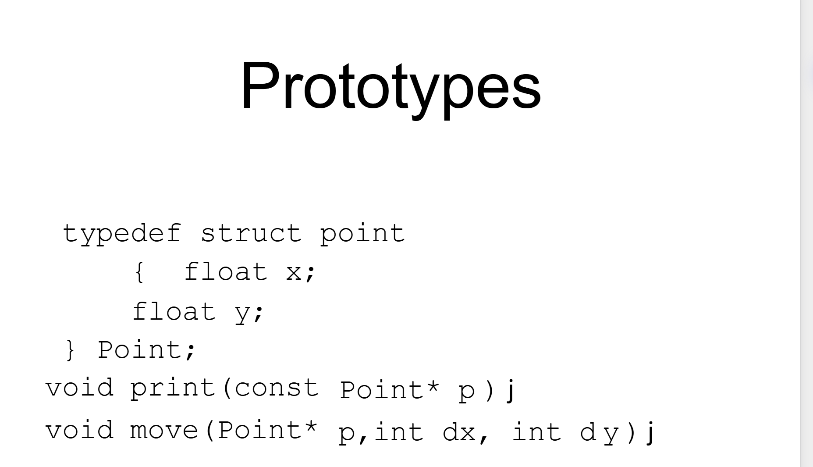
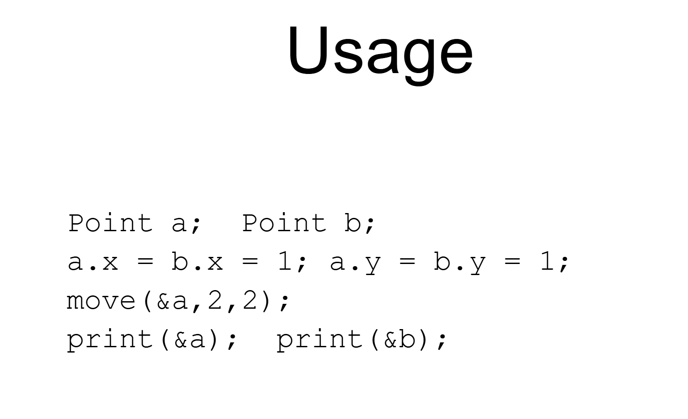
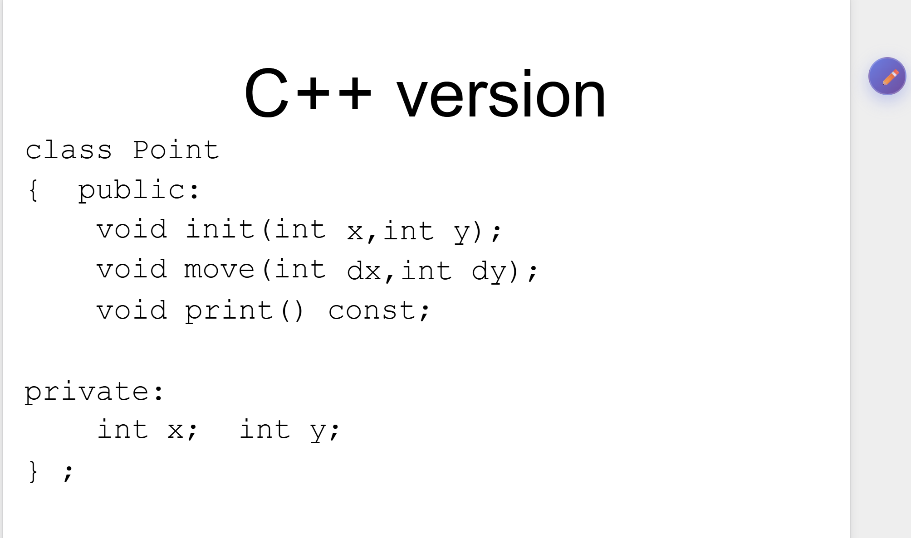
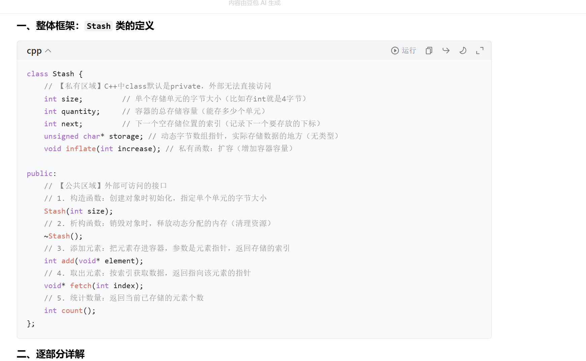
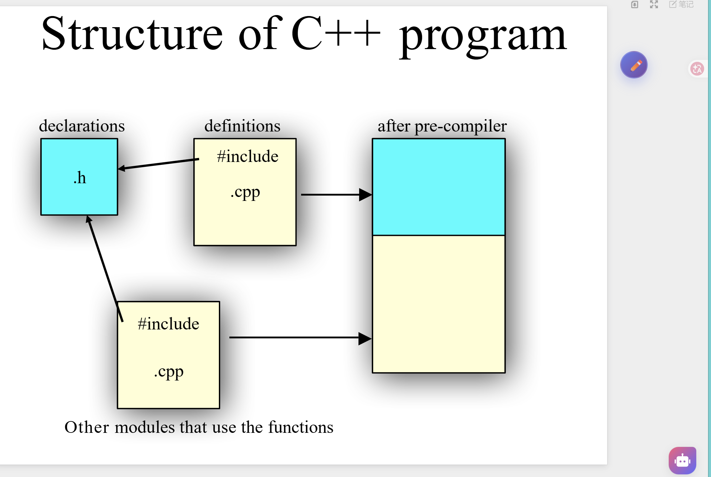
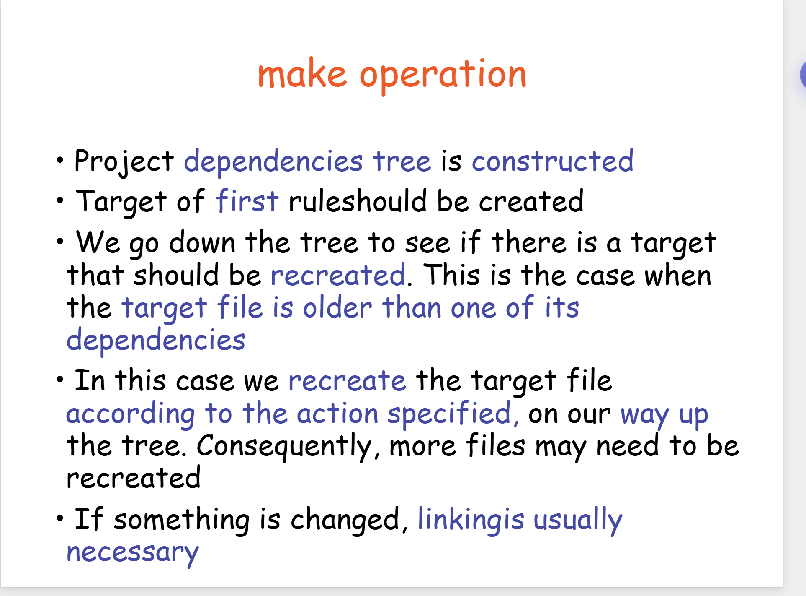
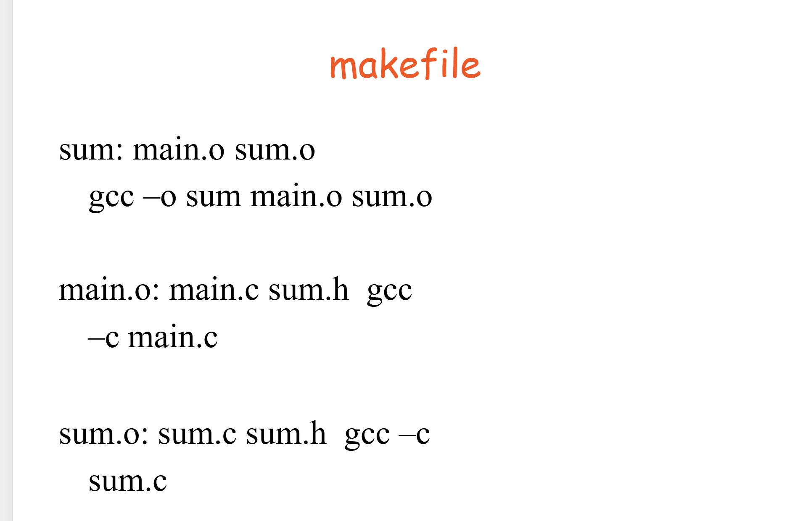
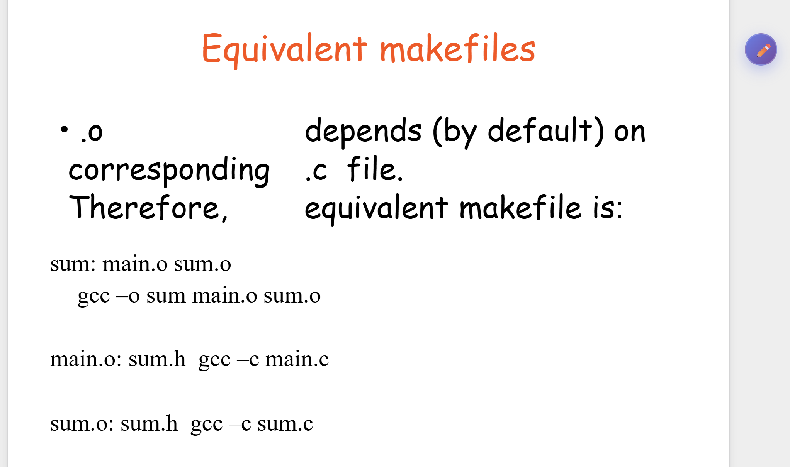
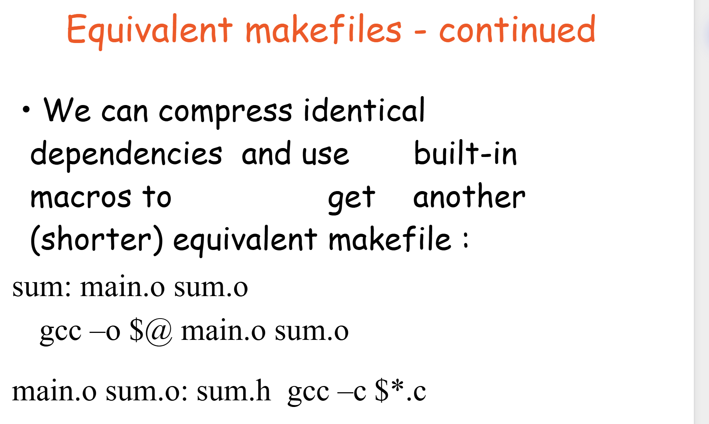
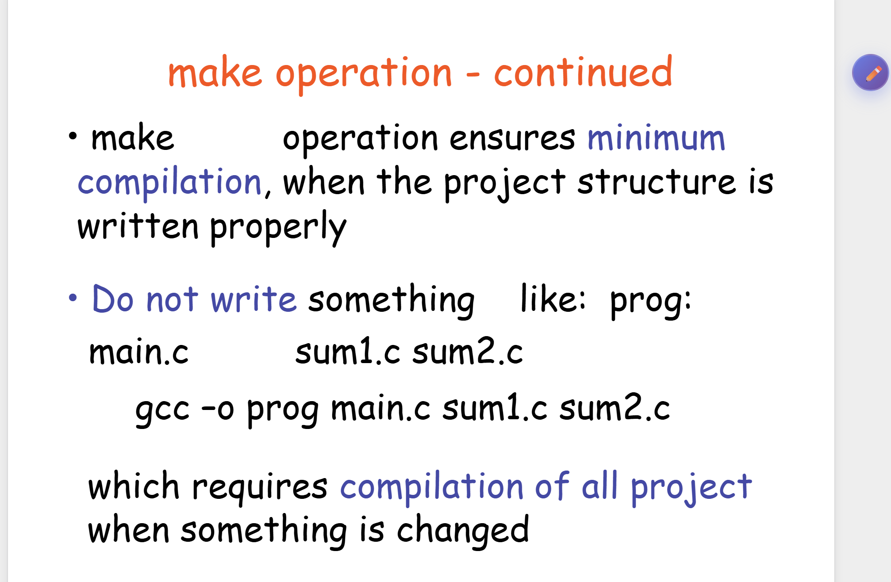

# 类 class

C语言的时候 我们要定义结构体 很多函数 自己调用 传入这些结构体。这都是被操作的。





C++ 语言中，类是一个主动的东西，有行为能力。



这是一个 **C++ 类（`class Point`）的定义**，用来表示一个二维坐标点，是典型的「封装+const 安全」的面向对象写法，我帮你逐部分拆解：

---

## 截图分析

### 1. 类的整体结构

```cpp
class Point {
public:
    // 对外公开的成员函数（接口）
private:
    // 内部私有的成员变量（数据）
};
```

- **`class Point`**：定义一个名为 `Point` 的类，代表「二维平面上的点」；
- **`public:`**：下面的函数是**对外接口**，外部代码可以调用；
- **`private:`**：下面的变量是**内部数据**，外部代码不能直接访问，只能通过 public 函数操作。

---

### 2. 私有成员（数据封装）

```cpp
private:
    int x;  // 点的 x 坐标
    int y;  // 点的 y 坐标
```

- `x` 和 `y` 是这个点的核心数据，被 `private` 隐藏起来，**外部代码不能直接读写**（比如不能写 `p.x = 5`）；
- 目的：保护数据不被意外修改，保证类的内部状态可控，这就是「封装」。

---

### 3. 公开成员函数（对外接口）

#### ① `void init(int x, int y);`

- 作用：**初始化点的坐标**，相当于给 `x` 和 `y` 赋初值（早期C++风格，现在一般用构造函数 `Point(int x, int y)` 替代）；
- 示例：`Point p; p.init(3, 4);` → 把 `p` 的坐标设为 (3,4)。

#### ② `void move(int dx, int dy);`

- 作用：**移动点的位置**，在原有坐标基础上偏移：
  - `x += dx`，`y += dy`；
- 示例：`p.move(1, 2)` → 点从 (3,4) 变成 (4,6)。

#### ③ `void print() const;`

- 作用：**打印点的坐标**，关键是后面的 `const`：
  - `const` 表示这个函数是**只读成员函数**，承诺不会修改 `x` 和 `y`；
  - 所以 `const Point p` 也能调用 `p.print()`，符合 const 安全规则；
  - 示例：`p.print()` → 输出 `(3,4)` 或 `(4,6)`。

---

### 核心总结

这是一个**封装良好的二维点类**：

- 用 `private` 隐藏 `x`/`y`，防止外部直接修改；
- 用 `public` 函数提供初始化、移动、打印的功能；
- `print() const` 用 `const` 保证只读安全，让 const 对象也能安全调用。

简单说：`Point` 类 = 「一个带x/y坐标的点」，你只能通过它提供的函数来操作这个点，不能直接改坐标，既安全又清晰。

## ::

 C++ 里的 **`::` 作用域解析运算符（resolver）**，核心是解决「同名变量/函数的归属问题」，告诉编译器你到底指的是**类里的**还是**全局的**那个名字。

---

### 一、`::` 的两种核心用法

#### 1. 类作用域解析：`<Class Name>::<function name>`

用来在**类的外部**定义类的成员函数，告诉编译器：「这个函数属于这个类」。

```cpp
class S {
public:
    void f(); // 类里声明 f()
};

// 在类外实现 f()：S::f 表示「这是类 S 的成员函数 f」
void S::f() {
    // 函数体
}
```

- 没有 `S::` 的话，编译器会以为你在定义一个全局函数 `f()`，而不是类的成员函数。

---

#### 2. 全局作用域解析：`::<function name>` / `::<variable name>`

当**类内部和全局有同名的函数/变量**时，用 `::` 开头强制指定「我要的是**全局作用域**里的那个，不是当前类里的」。

---

### 二、代码逐行拆解

```cpp
// 先假设全局有这些：
void f() { /* 全局函数 f */ }
int a = 10; // 全局变量 a

class S {
public:
    void f(); // 类里也有一个同名函数 f
    int a;    // 类里也有一个同名变量 a
};

// 类 S 的成员函数 f 的实现
void S::f() {
    // 1. ::f() → 强制调用【全局的 f()】
    // 如果不写 ::，直接写 f()，编译器会认为是 S::f() 自己，就变成递归调用了！
    ::f();

    // 2. ::a++ → 强制操作【全局的变量 a】
    ::a++;

    // 3. a-- → 这里的 a 是【类 S 里的成员变量 a】
    // 因为在 S::f() 里，编译器默认先找类作用域里的名字
    a--;
}
```

---

### 三、核心结论

| 写法 | 含义 |
|------|------|
| `S::f()` | 这个 `f` 是**类 S 的成员函数**，不是全局的 |
| `::f()` | 这个 `f` 是**全局作用域的函数**，不是类里的 |
| `::a` | 这个 `a` 是**全局变量**，不是类里的成员变量 |
| `a`（在 `S::f()` 里） | 这个 `a` 是**类 S 的成员变量**，不是全局的 |

简单说：

- `类名::` = 「我要找这个类里的东西」；
- 单独 `::` = 「我要找全局的东西，别找当前类里的同名货」。

这两张PPT是在讲解**面向对象编程（OOP）**的基础概念，我们可以分开来看：

## 对象和容器

### 第一张：对象的本质（Objects = Attributes + Services）

这是面向对象的核心定义：

- **公式含义**：一个完整的对象，由**数据（属性/状态）**和**操作（服务/功能）**两部分组成。
  - **Data（数据）**：描述对象的静态特征，比如“手机”对象的“品牌”“电量”“存储容量”，记录它当前的状态。
  - **Operations（操作）**：描述对象的行为功能，比如手机的“充电”“打电话”“拍照”，用来改变状态或对外提供服务。
- **图示含义**：图中`Data`被`Operations`包裹，体现了**封装**思想——把数据和操作数据的方法绑定在一起，隐藏内部数据细节，只通过操作对外暴露功能，这是OOP的核心特性之一。

---

### 第二张：容器（Container）

容器是一种特殊的对象，专门用来管理其他对象：

- **定义**：`Container` 是**容纳其他对象的对象**，相当于一个“收纳盒”，用来存放、管理多个子对象。
- **通用接口**：大部分容器都提供 `put()`（存入对象）和 `get()`（取出对象）这两个基础方法，方便统一存取内部存储的对象。
- **例子**：`Stash` 是一种具体的容器实现，它的特点是**运行时可动态扩展容量**，不需要在创建时就固定大小，更灵活。

---

### 整体理解

这组PPT先讲了**对象的基本构成**（数据+操作，封装），再延伸到**容器**——作为一种特殊对象，专门解决“如何存储和管理多个对象”的问题，是面向对象中很常用的工具类概念。

## stash

这三张PPT是在讲解一个**C++ 无类型动态容器 `Stash`** 的设计与实现，我帮你拆解一下：

---

### 1. 第一张图：`Stash` 的存储逻辑

- 核心行为：调用 `add(p)` 时，会把对象 `p` **克隆（复制）** 一份，存入 `Stash` 的内部存储中。
- 关键特性：`Stash` 里的每个元素都是原对象的**独立副本**，不是直接引用原对象，这样可以避免原对象生命周期结束后导致的悬空指针问题。
- 图示：橙色的 `p` 是原对象，黄色块是克隆后的副本，最终被放入下方的连续存储区。

---

### 2. 第二张图：`Stash` 的核心特性

- **无类型容器（Typeless container）**：它不关心存储对象的具体类型，只需要知道每个对象的**字节大小**，所以可以存储任意同类型的对象。
- **同类型存储**：初始化时必须指定类型的字节大小（`size of the type`），之后只能添加同类型的对象。
- **核心接口**：
  - `add()`：向容器中添加一个对象
  - `fetch()`：按索引取出容器中的对象
- **动态扩容**：容器容量会在需要时自动扩展（`Expanded when needed`），不需要预先固定大小。
- 相关代码：`Stash2.h`（头文件）、`Stash2.cpp`（实现）、`Stash2Test.cpp`（测试）。

---

### 3. 第三张图：`Stash` 的 C++ 代码实现（struct 封装）

这是用 C++ `struct` 实现的面向对象版本，把**数据（属性）和操作（服务）**绑定在一起：

#### 成员变量（数据/属性）

- `size`：每个元素的字节大小
- `quantity`：当前总存储容量（最多能存多少个元素）
- `next`：下一个空位置的索引（记录下一个要存放的位置）
- `storage`：动态分配的字节数组指针（`unsigned char*`），实际存储所有对象的二进制数据

#### 成员函数（操作/服务）

- `initialize(int size)`：初始化 `Stash`，指定每个元素的字节大小
- `cleanup()`：清理资源，释放动态分配的内存
- `add(const void* element)`：添加一个对象（克隆到 `storage` 中），返回存放的索引
- `fetch(int index)`：获取指定索引的对象，返回 `void*` 类型指针
- `count()`：返回当前已存储的元素数量
- `inflate(int increase)`：扩容函数，增加 `storage` 的容量

---

### 整体理解

`Stash` 是一个**底层的、无类型的动态数组容器**，用 C++ 早期的 `struct` 实现面向对象封装：

- 它通过字节级别的克隆来存储对象，实现了类型无关性
- 自动扩容机制让它可以灵活管理内存
- 接口简洁（`add`/`fetch`），符合容器“存入-取出”的基本功能

## stash固定大小

### 一、先看生活化比喻

把 `Stash` 想象成你定制的「标准化快递盒收纳架」：

1. 初始化时指定“字节大小” = 你告诉工厂：“每个快递盒的格子必须做**20cm×30cm**（对应「4字节」「8字节」）”—— 这是单个格子的固定尺寸；
2. 之后只能加同类型对象 = 你只能往这个收纳架里放**刚好适配20cm×30cm的快递盒**：
   - 放更小的盒子（比如10cm×15cm）：虽然能塞进去，但收纳架取的时候会按“20×30”的尺寸去识别，导致取错/取到空的部分；
   - 放更大的盒子（比如30cm×40cm）：塞不进去，硬塞会把格子撑破（对应程序里的数据截断、崩溃）；
   - 只有放和格子尺寸完全匹配的盒子，才能正常存、正常取。

### 二、编程角度的核心解释

`Stash` 是「字节级的无类型容器」—— 它底层只认“字节”，不认“int/double/自定义对象”这些类型，所以需要你给它两个关键规则：

#### 1. 初始化指定“单个元素的字节大小” = 定“存储单位”

`Stash` 的底层是 `unsigned char* storage`（字节数组），它不知道你要存的是 `int`（4字节）、`double`（8字节）还是自定义的 `Student` 结构体（比如20字节），所以初始化时必须告诉它：**“我要存的每个对象，都占 X 个字节”**。

比如：

```cpp
Stash intStash;
// 初始化：告诉Stash，每个要存的元素是int类型，占4字节
intStash.initialize(sizeof(int));

Stash doubleStash;
// 初始化：告诉Stash，每个要存的元素是double类型，占8字节
doubleStash.initialize(sizeof(double));
```

这个 `sizeof(类型)` 就是告诉 `Stash`：“你每次存一个对象，就要从字节数组里划走 X 个连续字节的空间”。

#### 2. 之后只能加同类型对象 = 保证“存储/读取的字节数匹配”

如果初始化时定了“每个元素占4字节（int）”，结果你往里面加 `double`（8字节），会出两个致命问题：

- **存的时候**：`Stash` 只会复制前4字节到数组里，后4字节被截断，数据直接损坏；
- **取的时候**：`Stash` 会按4字节去读数据，把原本8字节的 `double` 拆成两个4字节的“无效数据”，程序大概率崩溃。

### 三、代码实例：正确 vs 错误用法

```cpp
#include <iostream>
using namespace std;

// 简化版Stash（核心逻辑）
struct Stash {
    int size;      // 单个元素的字节大小
    int next;      // 下一个空位置
    unsigned char* storage; // 字节数组

    // 初始化：指定单个元素的字节大小
    void initialize(int sz) {
        size = sz;
        next = 0;
        storage = new unsigned char[100 * size]; // 初始给100个元素的空间
    }

    // 添加元素：只能加和size匹配的对象
    int add(const void* element) {
        // 复制element的size个字节到storage里
        memcpy(&storage[next * size], element, size);
        next++;
        return next - 1; // 返回存入的索引
    }

    // 取出元素：按size字节读取
    void* fetch(int index) {
        if (index >= next || index < 0) return nullptr;
        return &storage[index * size];
    }
};

int main() {
    // 正确用法：初始化int（4字节），只加int
    Stash intStash;
    intStash.initialize(sizeof(int));
    int a = 10, b = 20;
    intStash.add(&a); // 正常：复制4字节
    intStash.add(&b); // 正常：复制4字节
    // 取出：转成int*，读取4字节
    int* val = (int*)intStash.fetch(0);
    cout << *val << endl; // 输出10（正确）

    // 错误用法：初始化int（4字节），加double（8字节）
    double c = 3.14;
    intStash.add(&c); // 只复制c的前4字节，数据截断
    double* dVal = (double*)intStash.fetch(2);
    cout << *dVal << endl; // 输出乱码（数据损坏）

    return 0;
}
```

### 总结

1. 初始化指定“类型的字节大小”：给 `Stash` 定「单个元素的存储单位」，让它知道每次该存/取多少字节；
2. 只能加同类型对象：保证存入的对象字节数和初始化的“存储单位”匹配，避免数据截断、读取错误；
3. 核心本质：`Stash` 是“字节级容器”，不认类型只认字节，所以需要你帮它统一“单个元素的字节规格”。



## stash简单实现

### 第一张PPT：函数的实现（头文件与源文件分离）

这张讲的是**C/C++ 代码的组织方式**，核心是「声明和实现分离」：

- **头文件（.h）**：只做「函数声明」
  比如在 `Stash2.h` 里，我们只写结构体里有哪些函数（只写函数名、参数、返回值，不写具体逻辑）：

  ```cpp
  struct Stash {
    int size;
    // ... 其他成员变量
    void initialize(int size); // 只声明，没有函数体
    int add(const void* element);
    // ... 其他函数声明
  };
  ```

  作用是告诉编译器「这个结构体里有这些函数」，方便其他文件调用。

- **源文件（.cpp）**：写「函数实现」
  在 `Stash2.cpp` 里，我们才写每个函数的具体逻辑（函数体）：

  ```cpp
  #include "Stash2.h"
  void Stash::initialize(int size) {
    this->size = size;
    this->next = 0;
    this->storage = nullptr;
    // ... 具体初始化代码
  }
  int Stash::add(const void* element) {
    // ... 具体添加元素的代码
  }
  ```

  这样做的好处是：

  1.  头文件对外暴露接口，源文件隐藏实现细节，代码更整洁；
  2.  多个文件可以引用同一个头文件，复用结构体和函数；
  3.  编译时只需要编译修改过的源文件，提升效率。

---

### 第二张PPT：调用结构体里的函数（成员函数与变量绑定）

这张讲的是**结构体成员函数的调用方式**，核心是「函数和具体变量绑定」：

- **代码示例**：

  ```cpp
  Stash a;          // 定义一个Stash类型的变量a
  a.initialize(10); // 调用a的initialize函数，参数是10
  ```

- **关键含义**：
  1.  结构体的函数（成员函数）必须通过「具体的结构体变量」来调用，比如 `a.initialize()`，而不能直接写 `initialize()`；
  2.  函数内部会自动关联到调用它的变量：`a.initialize()` 里的代码，操作的是 `a` 这个变量的成员（`a.size`、`a.next` 等），而不是其他 Stash 变量；
  3.  通俗理解：每个 Stash 变量（比如 `a`、`b`）都有自己的「数据」，调用 `a.initialize()` 就是给 `a` 做初始化，不会影响 `b` 的数据。

---

### 整体总结

这两张PPT是在讲**早期C++面向对象的基础实践**：

1.  用「头文件声明 + 源文件实现」来组织结构体（类）的代码；
2.  结构体里的函数（成员函数）和具体变量绑定，通过「变量.函数名()」的方式调用，函数会操作对应变量的数据。

智云有具体实现。

注意 构造函数如果写的时候没写参的默认值 那么声明对象的时候一定要传参

## this

这两张PPT在讲C++里**`this`指针**的核心原理，我用通俗的方式给你拆解：

---

### 第一张PPT：`this` 是「隐藏参数」

这张的核心是：**成员函数的背后，都偷偷多了一个指向当前对象的指针参数**。

- 你写的代码：

  ```cpp
  void Stash::initialize(int sz) { ... }
  ```

  编译器眼里，它其实是：

  ```cpp
  void Stash::initialize(Stash* this, int sz) { ... }
  ```

  这个 `this` 就是**隐藏参数**，你不用写出来，但编译器会自动加上。

- 调用时的等价关系：

  ```cpp
  Stash a;
  a.initialize(10);
  ```

  编译器会把它翻译成：

  ```cpp
  Stash::initialize(&a, 10);
  ```

  也就是把变量 `a` 的地址 `&a` 传给了隐藏的 `this` 参数，这样函数就知道「我现在要操作的是对象 `a`」。

---

### 第二张PPT：`this` 是「指向调用变量的指针」

这张进一步解释 `this` 在函数内部的作用：

- 在成员函数里，`this` 就是**指向「调用这个函数的那个变量」的指针**。
  比如 `a.initialize(10)` 执行时，函数内部的 `this` 就等于 `&a`；
  如果是 `b.initialize(20)`，那 `this` 就等于 `&b`。

- `this` 是「天生自带的局部变量」：
  所有结构体/类的成员函数里，都有一个 `this` 指针，你**不能自己定义它**，但可以直接用它来访问当前对象的成员：

  ```cpp
  void Stash::initialize(int sz) {
      this->size = sz;  // 等价于 size = sz; 编译器会自动补 this->
      this->next = 0;
      // ...
  }
  ```

---

### 生活化比喻

你可以把 `this` 理解成**「这个收纳盒」的标签**：

- 你有两个收纳盒 `a` 和 `b`（都是 Stash 类型）；
- 当你喊「`a` 初始化！」（`a.initialize()`），`this` 就贴在 `a` 上，函数里的所有操作都只改 `a`；
- 当你喊「`b` 初始化！」（`b.initialize()`），`this` 就贴在 `b` 上，不会碰 `a`。

---

### 一句话总结

`this` 是C++成员函数的**隐藏指针**，它的作用就是：**让函数知道「我现在正在操作哪个具体的对象」**，从而实现同一个函数逻辑能给不同对象使用。

要不要我用一段完整的 `Stash::initialize` 代码，把 `this` 的用法写出来，让你直观看到它在代码里是怎么工作的？

## 一个售货机的例子

这组PPT是在讲解**C++面向对象编程的核心思想**，用「售票机」作为案例，从概念到代码一步步拆解，我帮你梳理清楚：

---

### 1. 先搞懂：C++里的「对象」是什么？

第一张PPT给出了最本质的定义：
> 在C++中，对象就是变量，最纯粹的定义是「一块存储区域」。
> 之前讲的 `struct` 变量，就是C++里的对象。

简单说：

- 变量 = 一块存数据的内存 → 这就是**对象**
- `struct` 把数据和操作绑在一起 → 这就是**面向对象的雏形**

---

### 2. 案例引入：现实世界的「售票机」

第二、三张PPT用售票机做例子，帮你理解「怎么把现实事物变成代码」：

- **现实功能**：用户投钱 → 机器打印车票 → 机器记录总收款
- **面向过程的思路**（第三张）：把使用流程拆成步骤
  1. 走到机器前
  2. 投钱
  3. 机器打印车票
  4. 取票离开
  → 这种思路是「按步骤做事」，数据和函数是分离的

---

### 3. 面向对象的抽象：把售票机变成「类」

第四张PPT开始做**抽象**：把售票机的「数据」和「行为」拆出来：

- **数据（属性/状态）**：
  - `PRICE`：票价（固定不变）
  - `Balance`：当前用户投的钱
  - `Total`：机器总共收的钱
- **行为（方法/服务）**：
  - `showPrompt()`：显示提示
  - `getMoney()`：接收用户投的钱
  - `printTicket()`：打印车票
  - `showBalance()`：显示当前余额
  - `printError()`：打印错误提示

右边的 `ticketMachine1` 就是**具体的对象实例**——类是模板，对象是模板造出来的具体机器。

---

### 4. 转成C++代码：封装的体现

第五、六张PPT把抽象的类结构写成C++ `class`，核心是**封装（Encapsulation）**：

```cpp
class TicketMachine {
public:
    // 对外暴露的方法（给用户用的功能）
    void showPrompt();
    void getMoney();
    void printTicket();
    void showBalance();
    void printError();

private:
    // 内部隐藏的数据（只能在类内部访问）
    const int PRICE;
    int balance;
    int total;
};
```

- `public`：对外的接口，用户只能通过这些方法和售票机交互（比如投钱、查余额）
- `private`：内部的状态数据，外部不能直接改（比如不能直接改 `total` 总收款，只能通过打印车票的逻辑更新）
- 这就是面向对象的核心好处：**隐藏内部细节，只暴露必要功能，保证数据安全**

---

### 整体总结

这组PPT的逻辑是：

1. 先告诉你「C++对象 = 变量 = 一块存储区域」
2. 用「售票机」做案例，对比**面向过程**（按步骤走）和**面向对象**（把事物拆成数据+行为）
3. 把售票机抽象成「类」：数据（属性）+ 行为（方法）
4. 最后写成带`public/private`封装的C++类代码，实现「现实事物 → 代码对象」的转换

## 总结

### 第一张：`Object` vs `Class`（核心区别）

这张PPT讲的是**类（Class）和对象（Object）的本质关系**，用「猫」的例子最容易理解：

| 概念 | 通俗比喻 | 核心含义 |
|------|----------|----------|
| **Class（猫类）** | 「猫的设计图纸/模板」 | 定义了所有猫的共同属性（比如有4条腿、会叫）和行为（比如跑、跳）；在C++里，类就像`int`、`double`一样，是一种**自定义类型**，用来规定对象长什么样、能做什么。 |
| **Object（一只具体的猫）** | 「你家养的橘猫」 | 是类的**具体实例**，代表现实中一个实实在在的事物；程序运行时，对象会响应消息（比如调用`meow()`方法让它叫）。 |

- 图里的关系：
  - `Class defines Object`：类定义了对象的结构和行为（图纸决定了猫长什么样）
  - `Object is a Class`：对象是类的一个具体实例（橘猫是「猫类」的一个具体例子）

---

### 第二张：OOP（面向对象编程）的5个核心特征

这是面向对象思想的底层原则，帮你理解为什么要这么写代码：

1.  **Everything is an object（万物皆对象）**
    所有东西都可以抽象成对象：一只猫、一台售票机、一个数字、一段文字，本质都是「带数据和行为的对象」。

2.  **A program is a bunch of objects telling each other what to do by sending messages**
    程序 = 一群对象互相发消息（调用对方的方法）来协作。
    比如：用户对象给售票机对象发「投钱」消息 → 售票机对象给打印模块发「出票」消息 → 打印模块给用户对象发「票已打印」消息。

3.  **Each object has its own memory made up of other objects**
    一个对象的内存里可以包含其他对象。
    比如：售票机对象里包含「票价（`PRICE`）、当前余额（`balance`）、总收款（`total`）」这些小对象/数据。

4.  **Every object has a type**
    每个对象都属于某个类（有自己的类型）。
    比如：橘猫的类型是「猫类」，`tm` 这个变量的类型是 `TicketMachine` 类。

5.  **All objects of a particular type can receive the same messages**
    同一个类的所有对象，都能响应相同的方法（消息）。
    比如：所有 `TicketMachine` 对象都能调用 `printTicket()` 方法，不管是哪一台具体的售票机。

---

### 一句话总结

- **类（Class）**：是模板，定义「这类东西有什么属性、能做什么」。
- **对象（Object）**：是模板造出来的具体实例，是程序里真正干活的实体。
- 面向对象编程：就是把现实世界拆成一个个对象，让它们通过发消息（调用方法）协作完成任务。

## C++编译运行流程

这四张PPT在讲**C++类的文件组织、编译流程和头文件的核心作用**，我用通俗的方式帮你拆解：

---

### 1. 第一张：类的定义（`.h` + `.cpp` 分离）

C++里一个类要拆成两个文件：

- **头文件（`.h`）**：只做「声明」
  - 写类的结构（有哪些成员变量、哪些成员函数）
  - 只写函数原型（函数名、参数、返回值），**不写函数内部实现**
- **源文件（`.cpp`）**：只做「实现」
  - 写所有成员函数的具体逻辑（函数体）
- 目的：把「对外接口」和「内部实现」分开，方便代码复用、维护和编译优化。

---

### 2. 第二张：编译单元（Compile Unit）

这是C++的编译底层逻辑：

- **编译器**：一次只处理**一个`.cpp`文件**，把它编译成`.obj`（目标文件，二进制半成品）
- **链接器**：最后把所有`.obj`文件合并，生成一个可执行文件（比如`.exe`）
- **头文件的作用**：因为编译器一次只看一个`.cpp`，如果A.cpp要用到B.cpp里的函数/类，就需要通过`.h`文件告诉编译器「这个函数/类存在，长什么样」，不然编译器会报错“找不到这个东西”。

---

### 3. 第三张：头文件的强制规则

只要你在`.h`里声明了函数/类，就必须遵守：

- 所有**使用**这个函数/类的地方（比如`main.cpp`里创建对象），都要`#include`这个头文件
- 所有**实现**这个函数/类的地方（比如`TicketMachine.cpp`里写函数体），也必须`#include`这个头文件
- 简单说：**声明在哪，用到/实现在哪，就必须在哪包含头文件**，否则编译器不认。

---

### 4. 第四张：头文件 = 接口（Interface）

- 头文件是你和代码使用者的**「契约」**：
  - 告诉别人「这个类有哪些方法、怎么调用」，但**不暴露内部怎么实现**
  - 比如`TicketMachine.h`里写`void printTicket();`，别人就知道可以调用这个方法打印车票，但不用知道里面是怎么操作打印机的
- 编译器会强制执行这个契约：你必须先在头文件里声明，才能在别处使用/实现，否则编译直接报错。

---

### 生活化比喻（餐厅类比）

- **类** = 一家餐厅
- **`.h`头文件** = 菜单（告诉顾客有什么菜、怎么点，不写做菜步骤）
- **`.cpp`源文件** = 厨房（厨师按菜单做菜，写具体步骤）
- **编译单元** = 每个厨房独立做菜，先做成半成品（`.obj`），最后汇总成一桌完整的菜（可执行文件）
- **头文件契约** = 菜单必须先给顾客和厨师看，顾客按菜单点菜，厨师按菜单做菜，谁不看菜单就会乱套。

---

### 一句话总结

C++用「`.h`声明 + `.cpp`实现」的方式组织类，头文件是对外的接口契约，编译时每个`.cpp`独立编译成`.obj`，最后由链接器合并成可执行文件。



## 声明和定义

这张PPT在讲C++里**「声明（Declaration）」和「定义（Definition）」的核心区别**，以及**头文件(.h)和源文件(.cpp)的分工规则**，我用通俗的方式给你拆解：

---

### 1. 编译单元（Compile Unit）

- 每个 `.cpp` 文件是一个独立的**编译单元**：编译器一次只处理一个 `.cpp`，把它编译成 `.obj`（二进制半成品），最后由链接器把所有 `.obj` 合并成一个可执行文件（比如 `.exe`）。
- 这就是C++代码要分 `.h` 和 `.cpp` 的底层原因：每个 `.cpp` 独立编译，头文件用来在不同编译单元之间传递“接口信息”。

---

### 2. 头文件(.h)的铁律：只能放「声明」

PPT里强调 **Only declarations are allowed to be in .h**，意思是：

- 头文件里**绝对不能放定义（分配内存/写实现的代码）**，只能放「声明」——告诉编译器“有这个东西，它长什么样”，但不实际创建它、不分配内存。
- 允许放在 `.h` 里的声明只有这几类：
  1.  `extern` 变量：比如 `extern int a;` → 只是声明“变量`a`在别的地方定义了”，不分配内存。
  2.  函数原型：比如 `void func(int x);` → 只声明函数的名字、参数、返回值，不写函数体。
  3.  类/结构体声明：比如 `class Stash { ... };` → 只定义类的结构（成员变量、函数声明），不写函数实现，也不创建对象。

---

### 3. 声明 vs 定义：核心区别

|  | 声明（Declaration） | 定义（Definition） |
| :--- | :--- | :--- |
| 作用 | 告诉编译器「存在这个名字/类型」，**不分配内存、不写实现逻辑** | 给变量分配内存、给函数写具体实现、创建对象实例 |
| 例子 | `extern int a;` <br> `void func(int x);` <br> `class Stash { ... };` | `int a = 10;` <br> `void func(int x) { cout << x; }` <br> `Stash s(4);` |
| 能否重复 | 可以重复（多个文件`include`同一个声明完全没问题） | 不能重复（多个文件定义同一个名字会直接报「重复定义」错误） |

---

### 4. 为什么要这么规定？

举个反例：如果在 `.h` 里写了定义（比如 `int a = 10;`），当多个 `.cpp` 文件都 `#include` 这个 `.h` 时：

- 每个 `.cpp` 编译时都会生成一个 `a` 的定义，链接时就会报错：`multiple definition of 'a'`（重复定义）。
- 而声明是“轻量级”的，只是告诉编译器“有这个东西”，不会重复分配内存，所以多个文件`include`是安全的。

---

### 结合你学的`Stash`类举例

- `Stash.h`（头文件）：放 `class Stash { ... };`（类声明）、`int add(void* element);`（函数原型）→ 全是**声明**。
- `Stash.cpp`（源文件）：放 `Stash::Stash(int size) { ... }`、`int Stash::add(void* element) { ... }` → 全是**定义**。
- 其他测试文件（比如`Stash2Test.cpp`）`#include "Stash.h"`，就能正常使用`Stash`类，链接时会和`Stash.cpp`的定义合并，不会报错。

---

### 一句话总结

- **声明**：相当于“贴个告示，说有这个东西”，可以到处贴（多个文件`include`）。
- **定义**：相当于“把这个东西造出来”，只能造一次，否则就重复了。
- 头文件是“告示栏”，只能贴告示（声明）；源文件是“工厂”，负责造东西（定义）。

## makefile

## C++为什么要拆成几个文件

这组PPT在讲**为什么要把C++项目拆成多个文件**（也就是你之前学的「头文件+源文件分离」的核心动机），我分三部分给你拆解：

---

### 1. 项目规模的差异

- **小项目**：代码少、功能简单，放在**单个文件**里就足够管理（比如几十行的小demo，一个`.cpp`就搞定）。
- **“不算小”的项目**：代码量多、包含多个功能模块（组件）、还需要多人协作开发，这时候单个文件就扛不住了。

---

### 2. 单个大文件的痛点

如果把所有代码都塞在一个文件里，会遇到这些麻烦：

- **难管理**：文件太长，不管是程序员找代码，还是编译器处理代码，都很费劲。
- **编译慢**：哪怕只改了一行代码，也要重新编译**整个大文件**，项目越大，等待编译的时间越长。
- **协作冲突**：多个程序员不能同时修改同一个文件，不然会互相覆盖代码，引发冲突。
- **结构混乱**：没法按功能模块（比如Stash模块、TicketMachine模块）来组织代码，逻辑越写越乱。

---

### 3. 解决方案：拆分多文件

- **解决办法**：把项目按功能/组件拆成多个`.h`（头文件，放声明）和`.cpp`（源文件，放实现）文件，比如你之前学的`Stash.h`+`Stash.cpp`+`Stash2Test.cpp`。
- **拆分的目标**：
  1. **组件划分清晰**：每个模块（比如Stash容器、售票机）独立成文件，逻辑一目了然。
  2. **最小化编译**：只编译被修改的`.cpp`文件，不用全量编译，大大节省时间。
  3. **易维护**：项目结构、模块依赖、构建流程都更清晰，多人协作也更安全。

---

### 一句话总结

这组PPT就是在说：**小项目可以单文件，但大项目必须拆成多文件**，这样才能解决「难管理、编译慢、协作冲突」的问题，这也是你之前学的「头文件+源文件分离」的核心原因。

## makefile

**Unix/Linux 环境下，多文件 C++ 项目的自动化构建工具——Makefile**，我用通俗的方式给你拆解：

---

### 1. 核心背景

当项目拆成多个 `.h`（头文件）和 `.cpp`（源文件）后，手动一步步编译太麻烦，还容易出错。在 Unix 系统里，就用 **Makefile 机制** 来自动化管理整个项目的构建、维护流程。

---

### 2. Makefile 是什么？

它是一个**脚本文件**，本质是「项目构建说明书」，里面写了两类核心内容：

- **项目结构与依赖关系**：比如 `Stash2Test.cpp` 依赖 `Stash.h`，`Stash.cpp` 也依赖 `Stash.h`，告诉工具「哪个文件变了，需要重新编译哪些相关文件」。
- **文件创建指令**：比如怎么把 `.cpp` 编译成 `.o`（目标文件），怎么把多个 `.o` 链接成最终的可执行程序。

---

### 3. `make` 命令的作用

你只要在终端敲入 `make` 命令，它就会自动完成这些事：

1. 读取当前目录下的 `Makefile`；
2. 分析项目里所有文件的依赖关系；
3. 只编译**被修改过的文件**（没改动的文件直接跳过，大幅节省编译时间）；
4. 自动调用编译器/链接器，把所有需要的 `.o` 文件合并，生成最终的可执行程序。

---

### 4. 生活化比喻

- **Makefile** = 「装修施工说明书」：写清楚先装水电、再铺地砖、哪个工序依赖哪个，以及每个步骤怎么干。
- **make 命令** = 「施工队」：拿到说明书后，自动按顺序干活，哪里改了就只修哪里，不用从头重装一遍。

---

### 一句话总结

Makefile 是**多文件项目的自动化构建脚本**，`make` 是执行这个脚本的工具，用来解决「多文件编译麻烦、重复编译浪费时间、多人协作维护难」的问题，是 Unix 下 C++ 项目的标准维护方式。

## makefile使用



## 一、Makefile 核心作用与原理

### 1.1 什么是Makefile？

Makefile 是**项目构建自动化工具**，核心作用是：

- 用 **DAG（有向无环图）** 描述项目文件的依赖关系
- 自动根据文件修改时间判断是否需要重编，实现**增量编译**（只重编修改过的文件，避免全量重编，大幅提升效率）
- 统一管理编译、链接、清理等流程，让项目构建标准化

### 1.2 项目依赖与DAG（以sum项目为例）

#### 项目结构（3文件C程序）

- `main.c`：主程序入口
- `sum.c`：求和函数实现
- `sum.h`：函数声明，被`main.c`和`sum.c`同时`#include`
- 最终目标：生成可执行文件`sum`

#### 依赖链（DAG结构）

```
sum(可执行文件)
├─ 依赖 main.o、sum.o
│  ├─ main.o 依赖 main.c、sum.h
│  └─ sum.o 依赖 sum.c、sum.h
```

- 依赖逻辑：
  - 修改`sum.h` → 两个`.o`都要重编 → 重链`sum`
  - 修改`main.c` → 仅重编`main.o` → 重链`sum`
  - 修改`sum.c` → 仅重编`sum.o` → 重链`sum`

---

## 二、Makefile 基础语法（核心规则）

### 2.1 规则三要素（铁则）



每一条Makefile规则，都由**目标(Target)、依赖(Prerequisites)、命令(Recipe)** 三部分组成：

```makefile
目标: 依赖1 依赖2 ...
    命令  # 🔴 命令行必须【单独一行】，且行首是【Tab字符】（绝对不能用空格！）
```

| 组成部分 | 作用 | 示例 |
|----------|------|------|
| **目标(Target)** | 要生成的文件（或伪目标），`make`会检查它的修改时间 | `sum`（可执行文件）、`main.o`（目标文件） |
| **依赖(Prerequisites)** | 生成目标必须的前置文件，`make`会递归检查依赖的修改时间 | `main.o sum.o`（生成`sum`需要这两个文件） |
| **命令(Recipe)** | 生成目标的shell命令（如`gcc`编译），仅当目标需要更新时执行 | `gcc -o sum main.o sum.o` |

### 2.2 基础版Makefile（完全对应PPT，修正排版）

> ⚠️ PPT里的排版是简化展示，**绝对不能直接用**，必须修正为标准格式：

```makefile
## 1. 生成最终可执行文件sum
sum: main.o sum.o
    gcc -o sum main.o sum.o

## 2. 编译main.c生成main.o
main.o: main.c sum.h
    gcc -c main.c

## 3. 编译sum.c生成sum.o
sum.o: sum.c sum.h
    gcc -c sum.c
```

#### 逐行拆解：

1.  `sum: main.o sum.o`：目标`sum`依赖`main.o`和`sum.o`
    - `gcc -o sum main.o sum.o`：用gcc把两个`.o`文件**链接**成可执行文件`sum`，`-o`指定输出文件名
2.  `main.o: main.c sum.h`：目标`main.o`依赖`main.c`和`sum.h`
    - `gcc -c main.c`：`-c`表示**只编译、不链接**，把`main.c`编译成中间目标文件`main.o`
3.  `sum.o: sum.c sum.h`：目标`sum.o`依赖`sum.c`和`sum.h`
    - `gcc -c sum.c`：同理，编译`sum.c`生成`sum.o`

### 2.3 常见语法坑（新手必看）

- ❌ 绝对禁止：把命令写在依赖同一行（PPT的排版错误），比如`main.o: main.c sum.h gcc -c main.c`，`make`会把`gcc`当成依赖文件，直接报错
- ❌ 绝对禁止：用空格代替Tab缩进，会报`missing separator. Stop.`错误
- ✅ 注释语法：`#`开头的内容是注释，会被`make`忽略

---

## 三、目标文件详解：.o vs .obj

### 3.1 核心结论

`.o`和`.obj`是**完全等价的中间目标文件**，只是不同系统/编译器的命名不同：
| 后缀 | 适用系统 | 编译器 | 本质 |
|------|----------|--------|------|
| **.o** | Linux / Mac / WSL | gcc（GNU编译器） | 目标文件（Object File） |
| **.obj** | Windows | MSVC（Visual Studio编译器） | 目标文件（Object File） |

### 3.2 目标文件的作用

- 是**源文件（.c）编译后生成的中间文件**，已经被翻译成机器码，但**还没有链接成可执行程序**
- 完整编译流程：

  ```
  .c 源文件
  ↓ 编译（gcc -c）
  .o / .obj 目标文件（中间文件）
  ↓ 链接
  可执行文件（Linux: sum / Windows: sum.exe）
  ```

- 核心价值：实现增量编译，只重编修改过的源文件对应的`.o`，不用全量重编

---

## 四、Makefile 等价简化（利用默认规则+变量）

### 4.1 利用Make内置默认规则（第一次简化）



Make自带**隐式规则**：`.o`文件默认依赖同名`.c`文件，因此可以省略`.c`依赖，仅保留额外的头文件依赖，功能完全等价：

```makefile
sum: main.o sum.o
    gcc -o sum main.o sum.o

## 省略了main.c依赖，因为Make默认main.o依赖main.c
main.o: sum.h
    gcc -c main.c

## 省略了sum.c依赖，同理
sum.o: sum.h
    gcc -c sum.c
```

### 4.2 用变量优化（工程化写法，第二次简化）

把重复的编译器、参数、目标文件写成变量，方便维护和修改：

```makefile
## 定义变量（统一修改，不用改所有命令）
CC = gcc          # 编译器
CFLAGS = -Wall    # 编译警告参数（-Wall表示开启所有警告）
TARGET = sum      # 最终可执行文件名
OBJS = main.o sum.o  # 所有目标文件

## 核心编译规则
$(TARGET): $(OBJS)
    $(CC) -o $(TARGET) $(OBJS)

main.o: sum.h
    $(CC) $(CFLAGS) -c main.c

sum.o: sum.h
    $(CC) $(CFLAGS) -c sum.c

## 清理编译产物
.PHONY: clean
clean:
    rm -f $(OBJS) $(TARGET)
```

#### 新增知识点：

- **变量**：用`$(变量名)`引用，统一管理配置，比如换编译器只需要改`CC`
- **.PHONY: clean**：声明`clean`是**伪目标**（不是真实文件），避免文件夹里有同名`clean`文件导致`make clean`失效
- **clean规则**：删除所有`.o`文件和可执行文件，让项目恢复干净状态

---

## 五、Makefile 高级简化（自动变量+多目标合并）

### 5.1 自动变量（Automatic Variables）



Make内置的**快捷宏**，用来动态引用当前目标/依赖，避免硬编码文件名，是简化Makefile的核心：
| 自动变量 | 含义 | 示例场景 | 展开后效果 |
|----------|------|----------|------------|
| **`$@`** | 当前目标名（Target） | `gcc -o $@ main.o sum.o` | 目标是`sum`时，展开为`gcc -o sum main.o sum.o` |
| **`$*`** | 目标的茎名（去掉后缀） | `gcc -c $*.c` | 目标是`main.o`时，展开为`gcc -c main.c`；目标是`sum.o`时，展开为`gcc -c sum.c` |
| **`$<`** | 第一个依赖文件 | `gcc -c $<` | 配合默认规则，自动引用源文件 |
| **`$^`** | 所有依赖文件（去重） | `gcc -o $@ $^` | 展开为所有依赖，不用手动写`main.o sum.o` |

### 5.2 多目标合并规则（第三次简化）

把多个依赖相同、命令相同的目标合并成一条规则，大幅减少重复代码：

```makefile
sum: main.o sum.o
    gcc -o $@ main.o sum.o  # $@ 自动替换为sum

## 合并main.o和sum.o的规则，两个目标都依赖sum.h，共用同一条命令
main.o sum.o: sum.h
    gcc -c $*.c  # $* 自动替换为目标的茎名（main/sum）
```

#### 效果：

- 原本需要2条规则，现在1条搞定，代码量减少50%
- 扩展性极强：新增`test.o`，只需要加到`main.o sum.o`后面，不用新增规则



看这里 这里改一个文件 就会导致全部重新编译 没起到增量编译的效果

我来**彻底讲透这个核心原理**！这是你所有困惑的终点，听懂就完全通关了👇

## 原因

`gcc -o sum main.c sum.c` 这个命令 **是 GCC 编译器的「一键打包模式」**，
它的规则就是：**你给我几个 .c 文件，我就必须一次性编译全部，然后直接拼成程序**，
**它本身没有「只编译其中一个」的功能**！

---

### 先分清：GCC 的两种完全不同的工作模式

GCC（编译器）只有 **2 种干活方式**，没有第三种：

#### 模式1：单独编译（只造零件，`-c` 参数）

```bash
gcc -c main.c   # 只编译 main.c → 生成 main.o（零件）
gcc -c sum.c    # 只编译 sum.c → 生成 sum.o（零件）
```

✅ 特点：

- 一次**只处理一个文件**
- 只编译，不链接
- 生成**永久的 .o 零件文件**
- 想编哪个就编哪个，互不干扰

---

#### 编译+链接一条龙（造零件+拼房子，**无 `-c`**）

```bash
gcc -o sum main.c sum.c
```

✅ 这就是你问的命令！它的**内部固定流程（不可修改）**：

1. 自动把 `main.c` 编译成 **临时的 main.o**
2. 自动把 `sum.c` 编译成 **临时的 sum.o**
3. 自动把两个临时零件 **链接成 sum 可执行文件**
4. **自动删除临时的 .o 文件**（不留零件）

🔴 **死规则**：
只要你用这个命令，GCC **必须编译你写的所有 .c 文件**，
它**不会判断文件改没改**，也**不会跳过任何一个**，
这是编译器的**硬性设计**，不是你能控制的！

---

### 二、回答你的终极问题：

#### 1. 它是「一键生成最终程序」的命令

GCC 认为：
> 你要的是**直接能用的程序（sum）**，不是中间零件
> 那我必须把**所有依赖的源码都编译一遍**，才能拼成程序
> 少一个都不行，缺零件拼不出完整程序

#### 2. 它生成的是「临时零件」，用完就扔

这个命令不会留下 `.o` 文件，
所有零件都是**临时内存生成**，编译完直接链接，
**没有任何地方可以「单独停一下，只编一个」**。

#### 3. GCC 只是「干活的工具」，不是「指挥的工具」

- **GCC**：只会机械执行命令，让我全编我就全编
- **Make**：才是指挥者，会判断哪个零件要重做
只有用 `-c` 生成**永久 .o 零件**，Make 才能指挥 GCC：
> 这个零件没坏，别编！只编坏的那个！

---

## 三、终极对比（一眼看懂）

| 命令 | 工作模式 | 能否只编一个文件 | 有无中间零件 | 谁能控制它 |
|------|----------|------------------|--------------|------------|
| `gcc -c main.c` | 仅编译（造零件） | ✅ 可以 | 有永久 .o | Make 可以精准控制 |
| `gcc -o sum main.c sum.c` | 编译+链接（一键造房子） | ❌ **绝对不行** | 无（临时零件） | 无法控制，必须全编 |

---

## 四、一句话终极总结

1. **`gcc -o sum ...` 是一键成品命令**，GCC 必须编译所有传入的 .c 文件，**没有只编一个的功能**；
2. 只有 **`gcc -c`** 能单独编译一个文件，生成永久零件 `.o`；
3. Make 就是靠这些**永久零件**，实现「只编修改的文件」，没有零件就只能全量重编！

**ppt有例子 你到时候截图问ai就行**

## 这5页PPT完整解读（Makefile进阶功能全拆解）

这几页讲的是Makefile的**进阶核心能力**，从「多目标管理」「命令行传参」到「条件判断」，让Makefile从「固定编译脚本」变成「可配置、灵活的工程化构建工具」，我们分模块彻底讲透，全程结合你熟悉的`sum`项目，好懂不绕：

---

## 部分高级使用补充

### 一、多目标与`clean`伪目标（第1页PPT）

#### 核心知识点

1.  **Makefile支持定义多个目标**
    一个Makefile里可以写N个目标（比如最终可执行文件、`.o`中间文件、`clean`等），不是只能有一个最终目标。

    - `make`默认执行**第一个目标**（也就是我们的最终可执行文件，比如`sum`/`compare_sorts`）
    - 其他目标需要手动指定执行（比如`make clean`）

2.  **`clean`目标：专门用来清理的「伪目标」**
    - 特点：**没有任何依赖**（空依赖集），因为它不是用来「生成文件」的，而是用来「删除文件」的
    - 作用：删除编译产生的中间文件（`.o`、编辑器备份`*~`、可执行文件等），让项目回到「干净的初始状态」，方便重新全量编译
    - 工程化最佳实践：必须加`.PHONY: clean`声明为「伪目标」，避免文件夹里有同名的`clean`文件，导致`make clean`失效

3.  **两个最常用的`make`命令**
    | 命令 | 作用 |
    |------|------|
    | `make` | 默认执行第一个目标，生成最终可执行文件（比如`compare_sorts`/`sum`） |
    | `make clean` | 手动执行`clean`目标，删除所有中间文件，重置项目 |

---

### 二、给Makefile传命令行参数（第2、3页PPT）

核心是让Makefile支持**动态配置**，不用改代码，直接用命令行控制编译行为。

#### 1. 怎么传参？（第2页）

- **语法**：`make 变量名=值 [变量名2=值2 ...]`
- **例子**：`make PAR1=1 PAR2=soft1`
  - 给Makefile传了2个参数：`PAR1=1`，`PAR2=soft1`
- **怎么用？** 在Makefile里用`$(变量名)`的标准语法引用这些变量，和普通变量完全一致
- **实际用途**：比如`make DEBUG=1`开启调试模式、`make VERSION=release`编译发布版，不用改Makefile，灵活切换编译配置

#### 2. 变量优先级：内部定义 > 命令行传参（第3页）

- **核心铁则**：如果Makefile内部已经定义了某个变量，会**直接覆盖**命令行传进来的同名变量！
- **例子**：
  - 命令行执行：`make PAR=1`
  - Makefile内部写：`PAR = 2`
  - 最终结果：`PAR`的值是`2`，内部定义的优先级更高，命令行传的`1`被完全覆盖
- **补充**：如果想强制让命令行参数覆盖内部定义，可以用`override`指令：`override PAR = 2`，一般默认内部优先（内部是默认配置，命令行是临时覆盖）

---

### 三、Makefile条件判断语法（第4页PPT）

给Makefile加「`if-else`逻辑」，根据条件**动态生成编译规则**，而不是固定写死。

#### 基础语法（`ifeq`版本）

```makefile
ifeq (值1, 值2)
    # 条件成立（值1 == 值2）时，执行这里的内容（可以是变量赋值、目标规则等）
    条件为真的代码块
else
    # 条件不成立时，执行这里的内容
    条件为假的代码块
endif
```

#### 补充常用条件

| 语法 | 作用 |
|------|------|
| `ifneq (值1, 值2)` | 判断「值1 ≠ 值2」 |
| `ifdef 变量名` | 判断「变量已定义」 |
| `ifndef 变量名` | 判断「变量未定义」 |

#### 关键注意事项

- 条件语句是**Make在解析Makefile时执行**，不是在shell命令运行时执行，作用是「控制生成哪些编译规则」，不是程序运行时的判断
- 条件语句本身**不需要Tab缩进**（Tab是给`gcc`这类shell命令用的），条件语句是Make的语法，直接顶格写即可

---

### 四、条件判断实战：动态编译`sum`项目（第5页PPT）

这是把前面所有知识点串起来的完美例子，用你最熟悉的`sum`项目，实现「动态选择编译源文件」！

#### 先纠正PPT的排版错误（命令不能写在依赖同一行）

给出**正确可运行的Makefile**：

```makefile
## 最终目标sum，依赖main.o sum.o
sum: main.o sum.o
    gcc -o sum main.o sum.o

## main.o的规则（PPT排版错误，修正为标准格式）
main.o: main.c sum.h
    gcc -c main.c

## 条件判断：根据USE_SUM变量，决定sum.o的编译源文件
## deciding which file to compile to create sum.o
ifeq ($(USE_SUM), 1)
    # 条件成立：USE_SUM等于1 → 编译sum1.c生成sum.o
    sum.o: sum1.c sum.h
        gcc -c sum1.c -o $@
else
    # 条件不成立：USE_SUM不等于1 → 编译sum2.c生成sum.o
    sum.o: sum2.c sum.h
        gcc -c sum2.c -o $@
endif

## 补充clean目标（工程化最佳实践）
.PHONY: clean
clean:
    rm -f *.o sum
```

#### 逐行拆解+实战用法

1.  **核心逻辑**：通过命令行传`USE_SUM`参数，动态切换`sum.o`的编译源文件，不用改Makefile，直接命令行控制
2.  **两种使用场景**：
    - **场景1：`make USE_SUM=1`**
      - 条件`ifeq ($(USE_SUM), 1)`成立 → 执行`if`块规则
      - `sum.o`依赖`sum1.c sum.h`，执行`gcc -c sum1.c -o sum.o`，用`sum1.c`的逻辑生成`sum.o`
    - **场景2：`make USE_SUM=0`（或直接`make`，不传参数）**
      - 条件不成立 → 执行`else`块规则
      - `sum.o`依赖`sum2.c sum.h`，执行`gcc -c sum2.c -o sum.o`，用`sum2.c`的逻辑生成`sum.o`
3.  **`$@`自动变量回顾**：代表当前目标`sum.o`，所以`-o $@`就是「输出文件为sum.o」，不用硬编码，灵活通用（呼应之前学的自动变量知识点）
4.  **实际用途**：比如`sum1.c`是「快速排序实现」，`sum2.c`是「冒泡排序实现」，用这个Makefile可以一键切换排序算法，不用改代码，只需要传参数，非常灵活！

---

### 五、进阶知识点总结&最佳实践

| 知识点 | 核心要点 |
|--------|----------|
| `clean`目标 | 必加`.PHONY: clean`，避免同名文件冲突，工程化标配 |
| 命令行传参 | 用`make 变量=值`动态控制编译，不用改Makefile |
| 变量优先级 | 内部定义 > 命令行传参，不要搞反导致配置不生效 |
| 条件判断 | 用来动态生成编译规则，适配不同平台/需求，不是程序运行时判断 |
| 排版规范 | 命令必须换行+Tab缩进，条件语句顶格写，避免语法错误 |
