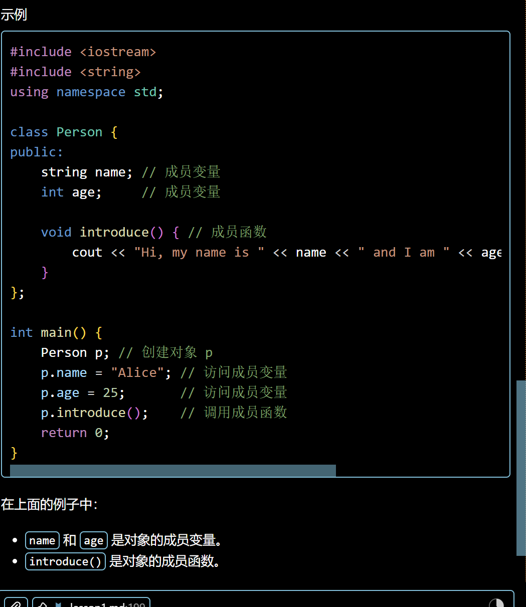

# 变量

## 字符串

## 1. 基本用法

要在代码中使用 `string` 类，必须包含头文件：

```cpp
#include <string>
using namespace std;
```

### 定义与初始化

可以像定义普通变量一样定义字符串，并使用字符串常量进行初始化：

```cpp
string str;          // 定义一个空字符串
string str2 = "Hello"; // 使用字符串常量初始化
```

### 读写操作

可以使用 `cin` 和 `cout` 进行基本的输入输出：

```cpp
cin >> str;  // 读取字符串（遇到空格停止）
cout << str; // 输出字符串
```

## 2. 字符串赋值

与 C 风格的字符数组（`char[]`）不同，`string` 类支持直接赋值：

```cpp
char charr1[20];
char charr2[20] = "jaguar";
// charr1 = charr2; // 错误：字符数组不能直接赋值（因为是常量指针 并不能更改）

string str1;
string str2 = "panther";
str1 = str2; // 正确：string 类支持直接赋值
```

## 3. 字符串拼接

可以使用 `+` 或 `+=` 运算符将一个字符串连接到另一个字符串的末尾：

```cpp
string str1 = "Hello ";
string str2 = "World";
string str3;

str3 = str1 + str2;   // 结果为 "Hello World"
str1 += str2;         // 将 str2 拼接到 str1 后
str1 += "lalala";     // 也可以直接拼接字符串常量
```

## 4. 构造函数 (Constructors)

构造函数是用于**创建并初始化**对象的一种特殊函数。当你定义一个 `string` 变量时，就是在调用相应的构造函数。

`string` 类提供了多种构造方式：

- `string(const char *cp, int len);`：从 C 风格字符串（字符数组）中提取前 `len` 个字符来创建。

  ```cpp
  char arr[] = "hello world";
  string s(arr, 5); // s 的内容为 "hello"
  ```

- `string(const string& s2, int pos);`：从 `string` 对象 `s2` 的下标 `pos` 开始提取到末尾。

  ```cpp
  string s1 = "programming";
  string s2(s1, 7); // 从索引7 "m" 开始，s2 为 "ming"
  ```

- `string(const string& s2, int pos, int len);`：从 `string` 对象 `s2` 的下标 `pos` 开始提取，长度为 `len`。

  ```cpp
  string s1 = "hello world";
  string s2(s1, 0, 5); // 从索引0开始取5个，s2 为 "hello"
  ```

## 5. 修改字符串 (Altering strings)

这些成员函数允许你对已有的字符串内容进行增、删、改。

- `assign()`：**重新赋值**。用新内容替换掉原来的内容。

  ```cpp
  string s = "old";
  s.assign("new content"); // s 变为 "new content"
  ```

- `append()`：**追加**。在字符串末尾添加新内容（功能类似于 `+=`）。

  ```cpp
  string s = "Hello";
  s.append(" World"); // s 变为 "Hello World"
  ```

- `insert(int pos, const string& s)`：**插入**。在指定索引 `pos` 处插入新的字符串。

  ```cpp
  string s = "Heo";
  s.insert(2, "ll"); // 在索引2位置插入 "ll"，s 变为 "Hello"
  ```

- `erase(int pos, int len)`：**删除**。从索引 `pos` 开始删除 `len` 个字符。

  ```cpp
  string s = "Hello World";
  s.erase(5, 6); // 从索引5开始删6个字符，s 变为 "Hello"
  ```

- `replace(int pos, int len, const string& s)`：**替换**。将从 `pos` 开始的 `len` 个字符替换为字符串 `s`。

  ```cpp
  string s = "I like Java";
  s.replace(7, 4, "C++"); // 将 "Java" 替换为 "C++"，s 变为 "I like C++"
  ```

## 6. 获取子串 (Sub-string)

- `substr(int pos, int len)`：**提取子串**。它不会改变原字符串，而是返回一个新的字符串对象。

  ```cpp
  string s = "Hello World";
  string sub = s.substr(0, 5); // 提取前5个字符，sub 为 "Hello"
  string rest = s.substr(6);    // 如果不写长度，默认提取到末尾，rest 为 "World"
  ```

## 7. 文件 I/O (File I/O)

在 C++ 中，进行文件读写需要包含相应的头文件：

- `<ifstream>`：用于从文件中读取数据。
- `<ofstream>`：用于向文件中写入数据。

### 基本操作示例

```cpp
#include <iostream>
#include <fstream>
#include <string>
using namespace std;

int main() {
    // 写入文件
    ofstream File1("C:\\test.txt");
    File1 << "Hello world" << endl;

    // 读取文件
    ifstream File2("C:\\test.txt");
    string str;
    File2 >> str; // 注意：>> 默认读取到空格或换行停止
}
```

## 变量的分类与存储 (Where are they?)

## 1. 变量分类 (What are they?)

根据作用域和生命周期，变量主要分为以下几类：

- **全局变量 (Global variables)**：在函数外部定义的变量。
- **静态全局变量 (Static global variables)**：使用 `static` 修饰的全局变量。
- **局部变量 (Local variables)**：在函数内部定义的普通变量。
- **静态局部变量 (Static local variables)**：在函数内部定义但使用 `static` 修饰。
- **动态分配变量 (Allocated variables)**：使用 `malloc` 或 `new` 在堆上分配。

```cpp
int i;           // 全局变量
string str;      // 全局变量
static int j;    // 静态全局变量

f() {
    int k;       // 局部变量 (stack)
    static l;    // 静态局部变量 (global data)
    int *p = (int*)malloc(sizeof(int)); // 动态分配变量 (heap)
}
```

## 2. 内存布局 (Where are they?)

C++ 程序的内存通常划分为以下几个主要区域：

| 内存区域 | 存储内容 | 特点 |
| :--- | :--- | :--- |
| **全局/静态区 (Global Data)** | 全局变量、静态全局变量、静态局部变量 | 程序启动时分配，程序结束时释放。静态局部变量在函数结束后值依然保留。 |
| **栈区 (Stack)** | 局部变量 | 由系统自动分配和释放。空间较小，访问速度极快。 |
| **堆区 (Heap)** | 动态分配的变量 (`new`, `malloc`) | 由程序员手动管理（分配与释放）。空间大，但需谨慎管理以防内存泄漏。 |

## 3. 详细特点对比

| 变量类型 | 存储位置 | 作用域 (Scope) | 生命周期 (Lifetime) | 特点 |
| :--- | :--- | :--- | :--- | :--- |
| **全局变量** | 全局/静态区 | 整个程序 | 程序运行期间一直存在 | 可在整个程序中访问，初始值默认为 0 |
| **静态全局变量** | 全局/静态区 | 仅限定义它的文件内部 | 程序运行期间一直存在 | 仅限当前文件访问，具有文件作用域 |
| **局部变量** | 栈 (Stack) | 函数/代码块内部 | 离开函数/代码块即销毁 | 存取速度快，自动分配和释放 |
| **静态局部变量** | 全局/静态区 | 函数内部 | 程序运行期间一直存在（保留上次的值） | 函数结束后值依然保留 |
| **动态分配变量** | 堆 (Heap) | 取决于指针的作用域 | 持续到手动调用 `free` 或 `delete` | 灵活性高，需手动管理内存，避免内存泄漏 |

## 第四部分：对象的指针

### 对象的指针

- `string s = "hello";`
  - 创建一个字符串对象 `s`，并初始化为 "hello"。
- `string* ps = &s;`
  - 创建一个指针 `ps`，它存储字符串对象 `s` 的地址。

### 指针操作符

- `&`: 获取对象的地址。
  - 示例：`ps = &s;`
- `*`: 解引用指针以访问其指向的对象。
  - 示例：`(*ps).length()`
- `->`: 访问指针所指向对象的成员。
  - 示例：`ps->length()`

### 两种访问方式

- `string s;`
  - `s` 是对象本身。
- `string* ps;`
  - `ps` 是指向对象的指针。

### 初始化与使用

- `string s;`
  - 在此行，创建并初始化对象 `s`。 这是已经分配了内存的对象。



## 8. 类与对象 (Classes and Objects)

### 核心概念

类和对象的关系就像“蓝图”与“建筑”、“模具”与“产品”。

- **类 (Class)**：一种**抽象**的概念。它定义了一类事物应该具有的**属性**（成员变量）和**行为**（成员函数）。类本身不占用内存空间。
- **对象 (Object)**：类的一个**具体实例**。它是根据类这个“蓝图”创建出来的真实实体，会在内存中分配实际空间。

### 总结对比

| 特性 | 类 (Class) | 对象 (Object) |
| :--- | :--- | :--- |
| **定义** | 数据类型的模板 | 该模板的一个具体变量 |
| **内存** | 抽象的，不占用内存空间 | 具体的，占用内存空间 |
| **成员变量** | 定义了“有哪些属性” | 存储了“具体的属性值” |
| **成员函数** | 定义了“能做什么” | 执行具体的动作 |
| **比喻** | 汽车的设计图纸 | 跑在路上的那辆真车 |

### 代码演示

```cpp
// 定义类 (蓝图)
class Student {
public:
    string name;  // 属性
    int id;

    void introduce() { // 行为
        cout << "我是 " << name << endl;
    }
};

int main() {
    // 创建对象 (实例)
    Student s1;
    s1.name = "张三";
    s1.introduce(); // 调用对象的行为
}
```
