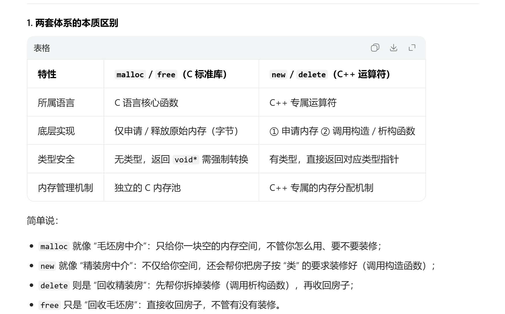
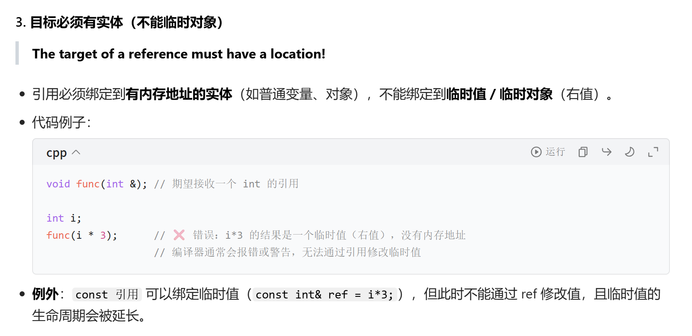
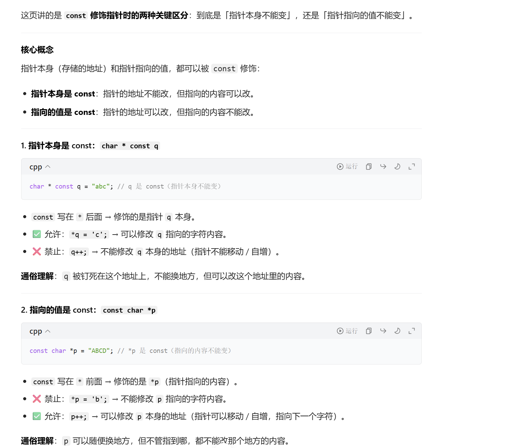
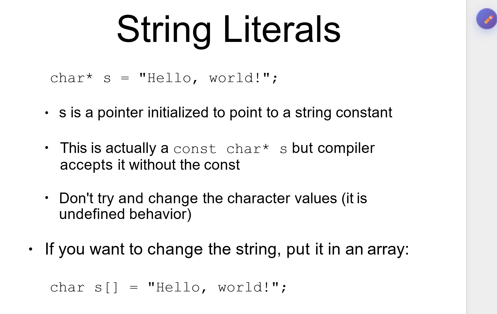

# 第二节课（第一节课续）

## C++ 动态内存分配（new/delete）笔记

---

### 一、核心概念：动态内存分配

- **`new`**：程序运行时向系统申请**堆内存**，分配的内存只能通过**指针**访问。
- **`delete`**：将不再使用的内存归还给系统内存池，避免内存泄漏。

---

### 二、`new` 的三种基础用法

| 写法 | 含义 |
|------|------|
| `new int;` | 分配**单个 `int` 类型**的堆内存 |
| `new Stash;` | 分配**单个自定义类 `Stash` 对象**的堆内存，并自动调用构造函数 |
| `new int[10];` | 分配**包含 10 个 `int` 元素的动态数组**，返回数组首元素地址 |

---

### 三、`delete` 的匹配释放规则

#### 1. 单个对象/内存释放

- 对应 `new Type;` 分配的内存，使用：

  ```cpp
  int* p = new int;
  delete p; // 释放单个 int 内存
  ```

- 若为类类型，`delete` 会先调用**析构函数**，再释放内存。

#### 2. 动态数组释放

- 对应 `new Type[N];` 分配的数组，必须使用 `delete[]`：

  ```cpp
  int* psome = new int[10];
  delete[] psome; // 释放整个数组内存
  ```

- `[]` 是关键标记：告诉编译器要释放**整个数组**，而非仅第一个元素；
- 类类型数组会依次调用**每个元素的析构函数**。
- 这里psome是指向数组开头的指针。

---

### 四、动态数组（Dynamic Arrays）

- **创建**：`int* psome = new int[10];`
  - `new` 返回数组**首元素地址**，指针 `psome` 指向数组起始位置。
- **释放**：`delete[] psome;`
  - 必须带 `[]`，否则只会释放第一个元素内存，导致**内存泄漏**或程序崩溃。

---

### 五、核心注意事项

1. **分配与释放必须严格匹配**：
   - `new` ↔ `delete`
   - `new[]` ↔ `delete[]`
2. 不要释放非 `new` 分配的内存（如栈变量、`malloc` 分配的内存）。
3. 不要重复释放同一块内存，避免野指针问题。
4. 对空指针 `nullptr` 调用 `delete`/`delete[]` 是安全的，不会执行任何操作。



### 进一步讲解

你问的「调用构造/析构函数」是 C++ 面向对象的核心概念，我用「盖房子+拆房子」的通俗比喻，结合代码讲清楚，保证新手能懂：

#### 一、先理解：构造函数/析构函数的本质

类（class）就像「房子的设计图纸」，对象（object）是「按图纸盖好的房子」：

- **构造函数**：盖房子时的「装修/初始化流程」，房子建好（对象创建）时自动执行；
- **析构函数**：拆房子前的「清理/收尾流程」，房子拆掉（对象销毁）时自动执行。

#### 二、调用构造函数：对象创建时的“初始化”

##### 1. 核心含义

调用构造函数 = 系统自动执行你写的初始化逻辑，把「刚分配的内存」变成「有意义的对象」。

- 普通变量：`int a = 10;` 是手动赋值；
- 类对象：`new Stash;` 会先分配内存，**自动调用 `Stash` 的构造函数**，完成成员变量初始化、资源申请（比如开内存、连数据库）。

##### 2. 代码示例（直观看到构造函数被调用）

```cpp
#include <iostream>
using namespace std;

class Stash {
public:
    // 构造函数：对象创建时自动调用
    Stash() {
        cout << "构造函数被调用：Stash 对象初始化完成！" << endl;
        // 这里可以写初始化逻辑：比如给成员变量赋值、申请内存
    }
};

int main() {
    // 1. 创建单个对象：自动调用1次构造函数
    Stash* s1 = new Stash;

    // 2. 创建动态数组：自动调用10次构造函数（每个元素1次）
    Stash* s2 = new Stash[10];

    return 0;
}
```

**运行结果**：

```
构造函数被调用：Stash 对象初始化完成！
构造函数被调用：Stash 对象初始化完成！
构造函数被调用：Stash 对象初始化完成！
...（总共输出11次，对应1个单个对象+10个数组元素）
```

#### 三、调用析构函数：对象销毁时的“收尾”

##### 1. 核心含义

调用析构函数 = 系统自动执行你写的清理逻辑，把对象占用的「额外资源」释放掉，再回收内存。

- 析构函数名：`~类名()`（比如 `~Stash()`），无返回值、无参数；
- 核心作用：释放对象占用的非内存资源（比如关闭文件、释放 `new` 分配的内存、断开网络连接）。

##### 2. 代码示例（直观看到析构函数被调用）

```cpp
#include <iostream>
using namespace std;

class Stash {
public:
    Stash() {
        cout << "构造函数：对象创建" << endl;
    }

    // 析构函数：对象销毁时自动调用
    ~Stash() {
        cout << "析构函数：对象销毁，清理资源！" << endl;
        // 这里可以写清理逻辑：比如释放成员变量里的动态内存
    }
};

int main() {
    Stash* s1 = new Stash;
    Stash* s2 = new Stash[2];

    // 1. 释放单个对象：先调用1次析构函数，再释放内存
    delete s1;

    // 2. 释放数组：先调用2次析构函数（每个元素1次），再释放数组内存
    delete[] s2;

    return 0;
}
```

**运行结果**：

```
构造函数：对象创建
构造函数：对象创建
构造函数：对象创建
析构函数：对象销毁，清理资源！
析构函数：对象销毁，清理资源！
析构函数：对象销毁，清理资源！
```

#### 四、关键补充：为什么必须匹配 new/delete？

- 如果用 `new[]` 分配数组，却用 `delete` 释放：
  → 只会调用**第一个元素**的析构函数，剩下9个元素的资源（比如动态内存）没清理，导致**资源泄漏**；

- 如果用 `new` 分配单个对象，却用 `delete[]` 释放：
  → 会错误地尝试调用多次析构函数，导致程序崩溃（未定义行为）。

#### 总结

1. **调用构造函数**：对象创建时自动执行，核心是「初始化」（给内存赋予意义、申请资源）；
2. **调用析构函数**：对象销毁时自动执行，核心是「清理」（释放资源、收尾）；
3. `new/delete` 匹配的本质：保证构造/析构函数被正确调用，避免内存/资源泄漏。

## 引用变量

这页讲的是 **C++ 中引用（Reference）的声明规则**，我帮你拆解成几个核心点：

---

### 1. 引用是 C++ 新增的一种数据类型

它和普通变量、指针并列，是一种“变量别名”机制：

- `char c;` → 普通字符变量，直接存储字符值。
- `char* p = &c;` → 指针变量，存储变量 `c` 的内存地址。
- `char& r = c;` → **引用变量**，是变量 `c` 的别名，和 `c` **共享同一块内存**，操作 `r` 等价于操作 `c`。

---

### 2. 局部/全局变量的引用声明规则

- 语法格式：`type& refname = name;`
- **必须在声明时初始化**：普通变量的引用不能“空声明”，必须立刻绑定到一个已存在的变量。
  - ✅ 正确：`char& r = c;`（绑定到已有的 `c`）
  - ❌ 错误：`char& r;`（没有绑定目标，编译不通过）

---

### 3. 函数参数/类成员变量的引用声明

- 语法格式：`type& refname`（这里**不需要在声明时初始化**）
- 绑定时机由外部决定：
  - 作为**函数参数**：调用函数时，由传入的实参来绑定引用。

    ```cpp
    void func(int& ref) { /* ref 绑定到调用时传入的实参 */ }
    // 注意 这里修改ref 会改变传入的变量
    ```

  - 作为**类成员变量**：必须在类的构造函数初始化列表中完成绑定。

    ```cpp
    class A {
        int& m_ref;
    public:
        A(int& x) : m_ref(x) {} // 构造时绑定到 x
    };
    ```

---

### 核心总结

- 引用本质是**变量的别名**，必须始终绑定到一个有效变量，不能“悬空”。
- 局部/全局引用：声明即绑定，必须初始化。
- 函数参数/成员引用：声明时不绑定，由调用者或构造函数完成绑定。
- 引用和指针的区别：引用一旦绑定就不能更改目标，而指针可以重新指向其他地址。

## 成员引用

这段代码是 C++ 中**包含引用类型成员变量的类的正确写法**，核心解决了「引用成员变量必须在创建时绑定到有效变量」的问题。我用新手能看懂的方式拆解每一部分：

### 第一步：先看懂代码整体功能

这段代码定义了一个名为 `A` 的类，这个类里有一个「引用类型」的成员变量 `m_ref`，并且通过构造函数，把这个引用成员绑定到**外部传入的一个 int 变量**上。

### 第二步：逐行拆解代码含义

```cpp
class A {
    // 1. 类的私有成员：int类型的引用变量 m_ref
    int& m_ref;
public:
    // 2. 类的构造函数，参数是 int 类型的引用 x
    A(int& x)
        // 3. 构造函数初始化列表：把 m_ref 绑定到 x 上
        : m_ref(x)
    {}
};
```

#### 关键1：`int& m_ref;` —— 引用类型的成员变量

- `m_ref` 不是普通的 int 变量，而是**另一个 int 变量的别名**（引用）。
- 引用的核心规则：**必须在“创建的瞬间”就绑定到一个有效变量**，不能先声明（创建）、后绑定（赋值）。
  - 比如普通变量可以这样：`int a; a = 10;`（先创建，后赋值）。
  - 但引用不行：`int& ref; ref = a;`（编译直接报错，因为 ref 创建时没绑定目标）。

#### 关键2：`A(int& x) : m_ref(x) {}` —— 初始化列表的作用

这里的 `: m_ref(x)` 是「构造函数初始化列表」，它的核心作用是：
> 在类的成员变量（这里是 m_ref）**被创建的那一刻**，就完成初始化/绑定，而不是等进入构造函数体（`{}` 里）再赋值。

- 如果把绑定写在构造函数体里，会直接报错：

  ```cpp
  // ❌ 错误写法：编译失败
  A(int& x) {
      m_ref = x; // 此时 m_ref 已经创建但未绑定，违反引用规则
  }
  ```

- 只有用初始化列表 `: m_ref(x)`，才能在 m_ref 创建的瞬间，把它绑定到传入的变量 x 上，满足引用的规则。

### 第三步：用实际例子理解用法

写一段完整的可运行代码，你就能直观看到效果：

```cpp
#include <iostream>
using namespace std;

class A {
    int& m_ref; // 引用成员变量
public:
    A(int& x) : m_ref(x) {} // 初始化列表绑定

    // 新增一个成员函数，方便查看 m_ref 的值
    void printRef() {
        cout << "m_ref 的值：" << m_ref << endl;
    }

    // 新增函数修改 m_ref（等价于修改绑定的外部变量）
    void changeRef(int val) {
        m_ref = val;
    }
};

int main() {
    int num = 10; // 定义一个普通 int 变量
    A obj(num);   // 创建 A 类对象，把 obj 的 m_ref 绑定到 num 上

    obj.printRef(); // 输出：m_ref 的值：10（和 num 一样）

    num = 20;       // 修改外部的 num
    obj.printRef(); // 输出：m_ref 的值：20（m_ref 是 num 的别名，同步变化）

    obj.changeRef(30); // 通过 m_ref 修改值
    cout << "num 的值：" << num << endl; // 输出：num 的值：30（num 被同步修改）

    return 0;
    // 这里其实是 num给了x x给了m_ref
}
```

运行结果：

```
m_ref 的值：10
m_ref 的值：20
num 的值：30
```

### 总结

1. 引用类型的类成员变量**必须在构造函数初始化列表中完成绑定**，不能在构造函数体里赋值；
2. `A(int& x) : m_ref(x) {}` 的核心是把类内的 `m_ref` 绑定到外部传入的 `x`（本质是绑定到调用构造函数时传入的那个变量，比如例子里的 `num`）；
3. 绑定后，操作 `m_ref` 等价于操作外部的那个变量，二者共享同一块内存。

## 构造函数和成员函数

你问的这两个是 C++ 类的核心概念，我用「类 = 数据 + 行为」的思路，结合你之前看到的代码，用最通俗的方式讲清楚：

### 一、先搞懂：成员函数（Member Function）

成员函数就是**属于类的函数**，是类的「行为/功能」，用来操作类里的成员变量（数据）。
你可以把类想象成“人”：

- 成员变量 = 人的属性（比如年龄、身高）；
- 成员函数 = 人的行为（比如吃饭、跑步、说话）。

#### 1. 成员函数的核心特点

- 和类绑定，能直接访问类的所有成员（公有/私有都能访问）；
- 需要通过**类的对象**来调用（除非是静态成员函数）；
- 可以有返回值、参数，写法和普通函数类似。

#### 2. 结合之前的代码看成员函数

```cpp
class A {
    int& m_ref; // 成员变量（属性）
public:
    // 👇 下面两个都是普通成员函数（行为）
    void printRef() { // 无参数、无返回值的成员函数
        cout << "m_ref 的值：" << m_ref << endl; // 访问成员变量
    }

    void changeRef(int val) { // 有参数、无返回值的成员函数
        m_ref = val; // 修改成员变量
    }
};

// 调用成员函数：必须通过对象
int main() {
    int num = 10;
    A obj(num);
    obj.printRef();   // 调用 printRef 成员函数
    obj.changeRef(30); // 调用 changeRef 成员函数
    return 0;
}
```

### 二、再搞懂：构造函数（Constructor）

构造函数是**类的特殊成员函数**，专门负责「对象创建时的初始化工作」，你可以把它理解成“对象的出生初始化流程”。

#### 1. 构造函数的核心特点

| 特征                | 说明                                                                 |
|---------------------|----------------------------------------------------------------------|
| 名字                | 和**类名完全相同**（比如类叫A，构造函数也叫A）|
| 返回值              | 没有返回值（连 void 都不用写，这是最关键的区别）|
| 调用时机            | 创建类的对象时**自动调用**（不用手动调，也没法手动调）|
| 核心作用            | 初始化成员变量（尤其是引用、const 成员，必须靠它初始化）|

#### 2. 结合之前的代码看构造函数

```cpp
class A {
    int& m_ref; // 引用类型成员变量，必须初始化
public:
    // 👇 这就是构造函数！
    A(int& x) : m_ref(x) {
        // 函数体里可以写其他初始化逻辑（比如打印日志）
        // 但引用/const成员必须在前面的「初始化列表」里绑定
    }
};

int main() {
    int num = 10;
    // 创建 obj 对象时，自动调用构造函数 A(int& x)
    // 把 x 绑定到 num，再把 m_ref 绑定到 x（最终 m_ref 绑定到 num）
    A obj(num);
    return 0;
}
```

#### 3. 构造函数和普通成员函数的关键区别

| 对比项       | 构造函数                | 普通成员函数              |
|--------------|-------------------------|---------------------------|
| 调用时机     | 创建对象时自动调用      | 需通过对象手动调用        |
| 名字         | 和类名相同              | 自定义名字（符合命名规则）|
| 返回值       | 无（连 void 都没有）| 可有可无（按需定义）|
| 核心作用     | 初始化对象成员          | 实现对象的具体功能        |

### 三、完整可运行示例（标注清楚）

```cpp
#include <iostream>
using namespace std;

class Person {
    // 成员变量（属性）
    string name;
    int age;
public:
    // 👇 构造函数：创建对象时自动初始化 name 和 age
    Person(string n, int a) : name(n), age(a) {
        cout << "构造函数被调用：对象创建成功！" << endl;
    }

    // 👇 普通成员函数：打印个人信息（行为）
    void showInfo() {
        cout << "姓名：" << name << "，年龄：" << age << endl;
    }

    // 👇 普通成员函数：修改年龄（行为）
    void setAge(int newAge) {
        age = newAge;
    }
};

int main() {
    // 1. 创建对象 p1，自动调用构造函数 Person(string, int)
    Person p1("张三", 20);

    // 2. 手动调用普通成员函数
    p1.showInfo(); // 输出：姓名：张三，年龄：20

    // 3. 手动调用普通成员函数修改属性
    p1.setAge(21);
    p1.showInfo(); // 输出：姓名：张三，年龄：21

    return 0;
}
```

运行结果：

```
构造函数被调用：对象创建成功！
姓名：张三，年龄：20
姓名：张三，年龄：21
```

### 总结

1. **成员函数**：类的“行为”，需要通过对象手动调用，用来操作/访问成员变量，有返回值、自定义名字；
2. **构造函数**：类的特殊成员函数，创建对象时自动调用，无返回值、名字和类名相同，核心作用是初始化成员变量（尤其是引用/const成员）。

## 引用变量注意事项

这页讲的是 **C++ 引用（Reference）的核心规则**，我帮你逐条拆解清楚：

---

### 1. 引用必须在定义时初始化

> References must be initialized when defined

- 引用**不能先声明、后赋值**，比如 `int& r;` 会直接编译报错。
- 引用本质是「变量的别名」，必须在定义的瞬间就绑定到一个已存在的变量，否则没有意义。

---

### 2. 初始化即建立绑定（绑定后不可更改）

> Initialization establishes a binding

- 一旦你在初始化时把引用绑定到某个变量，这个引用就**永远是这个变量的别名**，不能再改绑到其他变量。
- 举个例子：

  ```cpp
  int a = 1, b = 2;
  int& r = a; // 绑定到 a
  r = b;      // ❌ 这不是“改绑到 b”，而是把 b 的值赋给 a（因为 r 是 a 的别名）
  ```

- 这和指针完全不同：指针可以重新指向其他变量，引用不行。

---

### 3. 两种常见的初始化场景

#### 场景1：在变量声明时初始化

例子里的代码：

```cpp
int x = 3;
int& y = x;       // 普通引用：y 是 x 的别名，可通过 y 修改 x 的值
const int& z = x; // 常量引用：z 是 x 的别名，但不能通过 z 修改 x（x 本身可以被修改）
```

- 这是最基础的引用用法，定义时直接绑定到已有的变量 `x`。

#### 场景2：作为函数参数时，在函数调用时初始化

例子里的代码：

```cpp
//这里改x会修改y
void f(int& x); // 函数参数 x 是引用，此时仅声明，未初始化
int y = 5;
f(y); // 调用函数时，参数 x 绑定到 y，完成初始化
```

- 函数参数的引用，绑定时机推迟到**函数调用时**，由传入的实参（这里是 `y`）来决定绑定目标。
- 这种设计的好处是：函数可以直接修改外部变量的值，避免了拷贝开销。

---

### 核心总结

这页的核心就是强调引用的两个铁律：

1. **必须初始化**：定义时或函数调用时必须绑定到变量，不能悬空。
2. **绑定不可变**：一旦绑定，就永远是这个变量的别名，不能改绑。

要不要我给你写一段**错误示例+修正版代码**，直观展示违反这些规则会发生什么编译错误？



## 补充

这几页在系统梳理 **C++ 引用（Reference）与指针（Pointer）的核心区别**，以及引用的**使用限制**，我帮你分模块拆解：

---

## 一、Pointers vs. References（指针 vs 引用）

### 引用（References）

- **不能为 null**：引用必须在定义时绑定到一个已存在的变量，不存在“空引用”的概念。
- **依赖已有变量**：引用本质是变量的**别名**，和原变量共享同一块内存，不能脱离变量存在。
- **绑定后不可更改**：一旦绑定到某个变量，就永远是它的别名，无法在运行时改绑到其他变量。

### 指针（Pointers）

- **可以设为 null**：指针可以是 `nullptr`（空指针），表示不指向任何有效内存。
- **独立于对象存在**：指针本身是一个变量，存储地址值，即使没有指向有效对象也可以存在。
- **可以改变指向**：运行时可以修改指针的值，让它指向不同的内存地址/变量。

---

## 二、引用的限制（Restrictions）

### 1. 不能有「指向引用的引用」

- 语法上不允许 `int&& r = x;` 这种“引用的引用”（注意：C++11 之后的右值引用 `T&&` 是另一个概念，和这里的“引用套引用”不是一回事）。
- 本质原因：引用本身不是一个独立的内存对象，只是别名，无法再被另一个引用“指向”。
- 构造函数那里是：x 是「外部变量的别名」 → m_ref 绑定到「x 所代表的那个外部变量」，而非绑定到 x 本身。

### 2. 不能有「指向引用的指针」

- 写法 `int&* p;` 是非法的，编译器会直接报错。
- 原因：引用没有自己的内存地址，指针无法存储“引用的地址”。
- ✅ 反过来可以：**指向指针的引用**是合法的，比如 `void f(int*& p);`
  - 这里 `int*& p` 表示 `p` 是一个「指针的引用」，可以在函数内修改外部指针本身的指向。

### 3. 不能有「引用数组」

- 写法 `int& arr[5];` 是非法的。
- 原因：数组元素必须是可寻址、可赋值的类型，而引用不满足这两个条件（没有独立地址、绑定后不可更改），所以无法作为数组元素。

---

## 三、核心总结

| 特性 | 引用（Reference） | 指针（Pointer） |
|------|-------------------|-----------------|
| 空值 | 不能为 null | 可以为 `nullptr` |
| 独立性 | 必须绑定到已有变量，是别名 | 本身是独立变量，可无指向 |
| 可变性 | 绑定后不可更改 | 可随时修改指向 |
| 复合类型 | 不能有引用的引用、指向引用的指针、引用数组 | 可以有指针的指针、指针数组等 |

## 常量

## C++ const 常量笔记

---

## 一、const 基础：声明不可修改的常量

### 核心作用

`const` 用于声明**值不可被修改**的变量，初始化后任何修改操作都会被编译器禁止。

### 基础示例

```cpp
const int x = 123; // 声明并初始化 const 变量
x = 27;  // ❌ 非法：不能直接修改 const 变量的值
x++;     // ❌ 非法：自增/自减会修改变量，同样被禁止
```

### 合法的拷贝操作

const 变量**可以被拷贝**，只是自身的值不会被改变：

- 拷贝到非 const 变量：

  ```cpp
  int y = x;  // ✅ 允许：仅复制 x 的值到 y，x 本身保持不变
  y = x;      // ✅ 允许：赋值操作也是拷贝，不修改 x
  ```

- 用非 const 变量初始化 const 变量：

  ```cpp
  const int z = y;  // ✅ 允许：用 y 的值初始化 z，z 之后不可修改
  ```

---

## 二、const 的本质与链接属性

### 1. 常量本质上是「变量」

- 遵守和普通变量一样的**作用域规则**（局部 const、全局 const 的可见性与普通变量一致）。
- 由 `const` 类型修饰符标记，只是额外增加了「不可修改」的约束。

### 2. C++ 中 const 默认是「内部链接（internal linkage）」

- **编译器优化**：编译器会尽量避免为 const 变量分配实际内存，而是将其值直接保存在**符号表**中，使用时直接替换为常量值（类似更安全的宏替换）。
- **强制分配存储**：如果需要让 const 变量拥有实际内存地址（比如跨文件访问），需要用 `extern` 关键字：

  ```cpp
  // 全局 const 默认内部链接，仅当前文件可见
  const int a = 10;

  // extern 强制分配内存，变为外部链接，可跨文件访问
  extern const int b = 20;
  ```

---

### 核心总结

- `const` = 「值不可变的变量」，初始化后不能修改，但可以被拷贝。
- 默认是内部链接，编译器会优化掉其内存；`extern` 可强制分配内存，使其支持跨文件访问。

---

## 编译期常量和运行期常量

### 一、编译期常量（Compile-time constants）

#### 核心定义

在**编译阶段就确定值**的常量，由 `const` 修饰且初始化值为编译期可知的字面量/常量表达式。

#### 关键规则

1. **必须初始化（除 `extern` 场景）**
   - 普通编译期 `const`：定义时必须赋初值，例如 `const int bufsize = 1024;`
   - 例外：显式 `extern` 声明可先不初始化，用于跨文件定义：

     ```cpp
     extern const int bufsize; // 仅声明，不初始化
     // 在另一个文件中完成定义：const int bufsize = 1024;
     ```

2. **编译器禁止修改**
   任何修改编译期 `const` 的操作（赋值、自增/自减等）都会被编译器直接报错。

3. **本质：符号表条目，非真实变量**
   编译器会将其值存入**符号表**，使用时直接替换为常量值，尽量不分配实际内存（更安全的“宏替换”）；只有加 `extern` 时才会强制分配内存。

---

### 二、运行期常量（Run-time constants）

#### 核心定义

值在**运行阶段才确定**的常量，由 `const` 修饰，但初始化值来自运行期变量（如用户输入、函数返回值等）。

#### 关键规则

1. **`const` 保证不可修改**
   运行期常量一旦初始化，值同样不能被修改，但它的值是程序运行时才计算/获取的。

   ```cpp
   int x;
   cin >> x;
   const int size = x; // size 是运行期常量，值来自用户输入
   ```

2. **不能用于数组大小等编译期依赖场景**
   数组大小、模板参数等必须是**编译期可知的常量**，运行期常量无法满足：

   ```cpp
   const int class_size = 12; // 编译期常量
   int finalGrade[class_size]; // ✅ 合法：编译期已知数组大小

   const int size = x; // 运行期常量
   double classAverage[size]; // ❌ 错误：编译期无法确定 size 的值
   ```

---

### 三、核心对比

| 特性                | 编译期常量                  | 运行期常量                  |
|---------------------|-----------------------------|-----------------------------|
| 值确定时机          | 编译时                      | 运行时                      |
| 初始化要求          | 必须用编译期值初始化        | 可用运行期变量初始化         |
| 能否用于数组大小    | ✅ 可以（编译期可知）        | ❌ 不可以（运行期才确定）    |
| 编译器处理          | 存入符号表，尽量不分配内存  | 分配内存，值运行时确定       |
| 示例                | `const int bufsize = 1024;` | `const int size = x;`（x为输入） |

---

### 补充

这页讲的是 **`const` 修饰「聚合类型」（数组、结构体等复合类型）时的特殊规则**，核心区别于单个 `const` 基本类型：

#### 1. const 修饰聚合类型的特点

- **可以用 `const` 修饰**：比如 `const int i[] = {1,2,3,4};` 或 `const 结构体数组`，此时 `const` 表示「这块内存的内容**不可被修改**」。
- **必须分配实际内存**：和单个 `const` 基本类型（编译器可能优化到符号表、不分配内存）不同，聚合类型需要存储多个元素，所以**一定会分配真实内存**。
- **不能作为编译期常量使用**：即使你用字面量初始化了聚合类型，编译器也**不要求在编译阶段就知道其内存里的具体值**，因此它的元素值不能用在「需要编译期常量」的场景（比如数组大小、模板参数等）。

---

#### 2. 代码示例拆解

##### 示例1：const 数组

```cpp
const int i[] = { 1, 2, 3, 4 };
float f[i[3]]; // ❌ 非法
```

- `i` 是 `const int` 数组，内容不可修改，但 `i[3]` 的值（4）**不是编译期常量**。
- 数组大小必须是编译期可知的常量，所以用 `i[3]` 定义数组长度会报错。

##### 示例2：const 结构体数组

```cpp
struct S { int i, j; };
const S s[] = { {1,2}, {3,4} };
double d[s[1].j]; // ❌ 非法
```

- `s` 是 `const S` 数组，内容不可修改，但 `s[1].j` 的值（4）**不是编译期常量**。
- 同样，不能用它来定义数组长度。

---

#### 3. 关键对比

| 场景                | 单个 const 基本类型                | const 聚合类型（数组/结构体）       |
|---------------------|-----------------------------------|------------------------------------|
| 内存分配            | 编译器可能优化到符号表（不分配）   | 必须分配实际内存                   |
| const 含义          | 值不可变 + 可作为编译期常量        | 内存内容不可变 + **不能作为编译期常量** |
| 能否用于数组大小    | ✅ 可以（如 `const int x=10; int a[x];`） | ❌ 不可以（如 `i[3]` 不能当数组长度） |
| 编译器认知          | 编译期就知道值                     | 编译期不需要知道内存里的具体内容     |

---

#### 一句话总结

`const` 修饰聚合类型时，只是保证「内存内容不能改」，但**不会让它变成编译期常量**——所以不能用它的元素值去要求「编译期可知」的场景（比如数组大小）。

还有个好笑的



普通指针不能指向常量变量



这里自己看吧 就是说helloword是个常量字符串 直接改不了

## const转化

这两页分别讲了 **C++ 字符串字面量的特殊性质** 和 **const 相关的类型转换规则**，核心是「const 的只读约束边界」，我分两页帮你拆解：

---

## 第一页：String Literals（字符串字面量）

### 核心结论

`"Hello, world!"` 是 **字符串字面量**，存储在程序的 **只读数据段**，本质是 `const char[]`，绝不能被修改。

### 逐句拆解

#### 1. `char* s = "Hello, world!";`

- 表面上是 `char*` 指向字符串，但**本质上这个字符串是 `const char*` 类型**（只读）。
- 编译器为了兼容旧代码，允许这种**隐式转换**，但这是「不安全的语法糖」。

#### 2. 本质是 `const char* s`，但编译器接受无 const 写法

- 字符串字面量在内存中是 **只读、不可改** 的（系统加了保护）。
- 如果你写成 `char* s`，编译器不会报错，但**你不能通过 `s` 修改字符串内容**（否则违反 const 约束）。

#### 3. 禁止修改字符值（未定义行为）

- 尝试修改 `*s = 'X'` 或 `s[0] = 'H'`，会触发 **未定义行为** → 程序崩溃、乱码、无任何报错（最危险的bug）。
- 原因：字符串字面量存在 **只读数据段**，硬件/系统禁止写入。

#### 4. 想改字符串？用字符数组（拷贝到栈上）

- 如果需要修改字符串内容，必须把它放进 **字符数组**：

  ```cpp
  char s[] = "Hello, world!"; // 把字符串字面量「拷贝」到栈上（可写内存）
  s[0] = 'H'; // ✅ 合法！栈内存可写，能修改内容
  ```

- 区别：`char* s` 直接指向只读段的原字符串；`char s[]` 是栈上的「拷贝副本」，可自由修改。

---

## 第二页：Conversions（const 相关的类型转换）

这页讲的是 **const 的“只读约束”能否被转换/突破**，核心分「安全转换」和「危险转换」。

### 核心规则1：非 const → const（安全，允许）

**可以把“可写”的变量，当作“只读”来使用**（编译器自动允许，不会报错）。

#### 代码示例

```cpp
void f(const int* x); // 函数承诺：不通过 x 修改指向的内容
int a = 15;           // 普通可写变量

f(&a); // ✅ 合法：把 int* 转成 const int*（只是“只读访问”，不破坏 a 的可写性）

const int b = a;     // ✅ 合法：把 int 转成 const int（给 b 加上只读约束）
f(&b); // ✅ 合法：const int* 传参给 const int*，完全匹配
```

#### 关键逻辑

- `非const → const` 是**权限收缩**，只增加了“只读”的保护，不会破坏原有变量的可写性，所以安全。
- 比如 `int a=15` 本身可写，你用 `const int*` 指向它，只是**多了一层“只读访问”的约定**，a 依然能被别人修改。

### 核心规则2：const → 非 const（危险，禁止/需显式转换）

**不能直接把“只读”的对象，当作“可写”来使用**（编译器直接禁止，必须显式 `const_cast` 绕过）。

#### 代码示例

```cpp
const int b = 10;
int* p = &b; // ❌ 非法！不能把 const int* 转成 int*（权限升级，违反只读约束）
b = a + 1;  // ❌ 非法！const 变量不能赋值

// 合法但危险的写法：用 const_cast 强制去掉 const 属性
int* q = const_cast<int*>(&b);
*q = 20; // ❗ 未定义行为！如果 b 是只读变量（如全局const），会崩溃；如果是普通变量，可能能改
```

#### 关键逻辑

- `const → 非const` 是**权限升级**，试图突破只读约束，编译器默认禁止。
- 必须用 `const_cast` 显式转换，但**转换后修改 const 对象，会触发未定义行为**（只有当 const 对象实际是可写内存时，才勉强能改，否则必崩）。

---

### 注意

常数和非常数变量是可以相互赋值的 只是赋值而已
