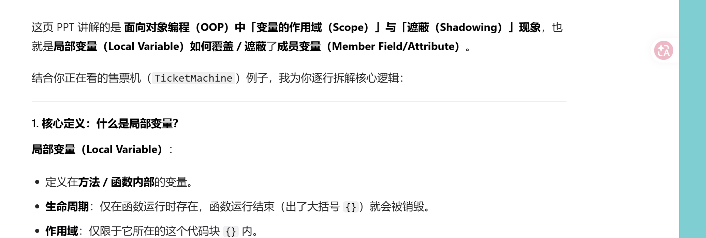
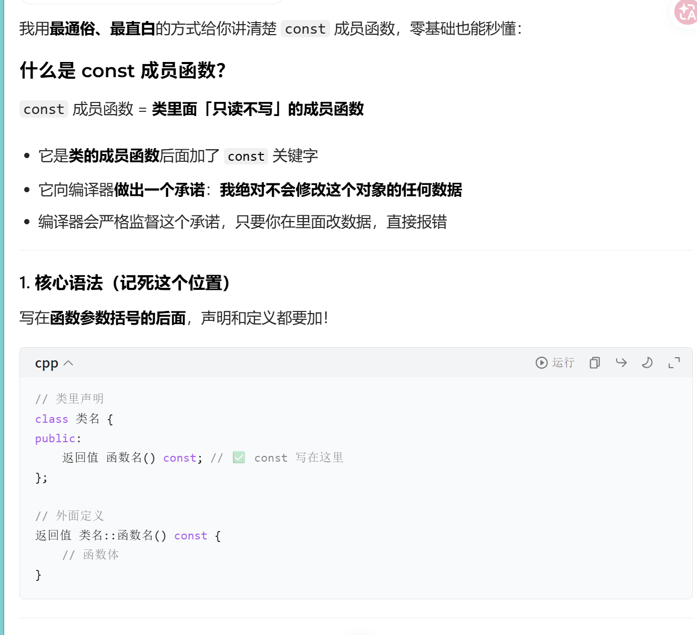

# 对象行为

## 构造和析构

## 构造

### 一、基础概念

1. **作用**：对象创建时**编译器自动调用**，**强制初始化对象**，彻底解决手动`init()`遗漏初始化的bug
2. **调用时机**：仅在**创建对象时执行1次**，对象创建后**不能手动调用**
3. **核心目标**：保证对象创建后一定是合法可用的状态

---

### 二、语法铁律（必须遵守）

1. 函数名 **必须和类名完全相同**
2. **无返回值**（连`void`都不能写）
3. 支持重载（可定义多个参数不同的构造函数）
4. 权限通常为`public`（否则无法创建对象）

---

### 三、构造函数分类

#### 1. 默认构造函数

- **定义**：可以**无参数调用**的构造函数
- **两种合法形式**
  ✅ 无参构造：`类名() {}`
  ✅ 全参数带默认值：`类名(int a=0) {}`

- **用途**：无参创建对象、初始化对象数组

#### 2. 带参构造函数

- 定义：带参数的构造函数，用于**个性化初始化**
- 用法：`类名 对象(参数);`

---

### 四、编译器自动生成默认构造 【核心规则】

1. **触发条件**：**当且仅当类中没有任何自定义构造函数**
2. **生成内容**：空的无参构造函数 `类名() {}`
3. **初始化特性**
   ✔️ 基本类型（`int`/`float`/指针）：**不初始化**（随机垃圾值）
   ✔️ 类类型（`string`/自定义对象）：自动调用其默认构造

4. **关键反例**：只要写了**任意一个自定义构造**（带参/无参），编译器**永久不再生成**默认构造！

---

### 五、必须有默认构造的场景（无则编译报错）

1. 无参创建单个对象：`Y y;`
2. 创建未完全初始化的数组：`Y arr[5];` / `Y arr[2]={Y(1)};`
3. `new`无参创建对象：`new Y;`
4. 类包含其他类对象成员，且未显式初始化

---

### 六、高频易错点

1. 构造函数**不能手动调用**（对象已存在时调用会报错）
2. `默认构造` ≠ `编译器自动生成的构造`
3. 写了带参构造，必须**手动写默认构造**，否则无参/数组创建报错
4. `struct` 和 `class` 的构造函数规则**完全一致**

---

### 七、一句话总结

构造函数自动完成对象初始化；无自定义构造→编译器生成默认构造；有自定义构造→需手动写默认构造，否则无参创建对象/数组会报错。

## 析构

### 析构函数（The destructor）—— 对象的「收尾清理器」

#### 核心定位

C++中，**对象的「初始化」和「清理（资源释放）」同等重要**：

- 构造函数：负责**对象创建时的初始化**（给成员赋值、申请堆内存、打开文件等）
- 析构函数：负责**对象销毁时的清理**（释放堆内存、关闭文件、释放锁等，避免资源泄漏）
- 编译器**强制保证析构函数执行**，彻底解决「忘记释放资源」的bug

#### 语法铁则（必须100%遵守）

1.  **命名规则**：函数名 = `~` + 类名（比如类`Y`的析构必须是`~Y()`）
2.  **无参数、无返回值**：永远不能写参数，也不能写`void`返回值
3.  **不能重载**：一个类**只能有1个析构函数**（无参数，无法实现重载）
4.  **权限通常为`public`**：否则无法正常销毁对象

#### 自动生成规则

如果类中**没有自定义析构函数**，编译器会自动生成一个「空的析构函数」（函数体为空，什么都不做）；
只要写了自定义析构，编译器就不再自动生成。

### 示例代码

```cpp
class Y {
public:
    ~Y(); // 声明Y类的析构函数
};
```

---

### 析构函数的调用时机（When is a destructor called?）

#### 核心调用规则

1.  **完全自动调用，无需手动触发**
    析构函数由编译器**自动调用**，程序员不能像普通函数一样手动调用（对象销毁时自动执行，入门阶段完全不需要手动调用）。

2.  **核心触发时机：对象离开作用域（栈上局部对象）**
    > 当对象的「作用域（大括号`{}`包裹的代码块）结束时（执行到右大括号`}`），编译器自动调用析构函数，销毁对象。
    > 析构调用的唯一标志就是作用域的右大括号`}`。

#### 补充：其他常见调用时机（PPT未完全覆盖）

除了栈上局部对象出作用域，这些场景也会触发析构：

- 堆上对象：用`delete`销毁`new`出来的对象时，调用析构
- 成员对象：当父对象销毁时，自动调用成员对象的析构
- 临时对象：临时对象的生命周期结束时（比如表达式计算完）
- 全局对象：程序结束时（`main`函数退出后）调用析构

### 直观示例

```cpp
void func() {
    Y obj; // 1. 进入作用域，调用构造函数，创建对象
    // ... 执行对象相关代码
} // 2. 作用域结束（右大括号），自动调用~Y()，销毁obj
```

---

## 存储分配（Storage allocation）—— 区分「内存分配」和「构造调用」

这页是为了澄清新手最容易混淆的误区：**栈上对象的「内存分配」和「构造初始化」是两个完全独立的步骤，执行时机完全不同**。

### 核心规则

1.  **内存分配时机：作用域左大括号`{`**
    编译器会在**进入作用域（执行到`{`）的瞬间，一次性为该作用域内所有的局部对象分配好栈内存（预留空间）**。

    - 注意：此时只是「分配了内存地址」，对象还没有被初始化（构造函数还没调用）。

2.  **构造调用时机：对象定义的代码行**
    构造函数的调用，要等到**代码执行到「对象定义」的那一行（顺序点）才会执行**，此时才真正完成对象的初始化，对象进入可用状态。

### 关键意义：禁止跳过构造

C++严格禁止「跳过对象构造」的行为（比如用`goto`跳过对象定义的代码行）：

- 因为内存已经在`{`处分配了，但如果跳过构造，对象就处于「未初始化的非法状态」，违反C++「构造必须执行」的核心原则。
- 示例文件`Nojump.cpp`就是演示这个规则：`goto`跳过对象定义会直接编译报错。

### 栈上对象完整生命周期流程（一目了然）

| 步骤 | 执行时机 | 操作 |
|------|----------|------|
| 1 | 进入作用域`{` | 编译器一次性分配该作用域所有局部对象的栈内存 |
| 2 | 执行到`Y obj;` | 调用构造函数`Y()`，初始化对象，对象可用 |
| 3 | 作用域内代码执行 | 正常使用对象 |
| 4 | 退出作用域`}` | 调用析构函数`~Y()`，销毁对象，自动释放栈内存 |

---

ppt有个时钟的例子。

## 局部变量和成员变量的遮蔽问题

我用**最通俗的大白话+生活化比喻**，彻底给你讲懂，保证一听就会！

### 先记住核心：**有两个重名的变量，近的挡住远的，这就叫遮蔽**

我们把 **售票机（TicketMachine）** 当成一个 **存钱罐**：

---

### 第一步：分清两个完全不同的「余额」

1. **成员变量 `balance`**
   👉 **存钱罐本身自带的钱**（写在类里面的）
   👉 永久存在，只要存钱罐不毁，钱就一直在
   👉 这是**售票机真正的余额**

2. **局部变量**
   👉 **你手里临时拿的一张纸条/零钱**（写在函数 `{}` 里面的）
   👉 用完就扔，函数结束就消失
   👉 只是临时用一下

---

### 第二步：PPT 到底在说什么？

#### ✅ PPT 里的这段代码 **是完全正确的**

```cpp
// 退款函数
int TicketMachine::refundBalance() {
    int amountToRefund;   // 临时变量（名字叫：要退的钱）
    amountToRefund = balance;  // 把存钱罐里的钱，抄到临时变量里
    balance = 0;         // 把存钱罐清空
    return amountToRefund; // 把临时变量的钱退给你
}
```

👉 因为**临时变量名字和成员变量不一样**，所以**没有遮蔽**，运行完全正常。

---

#### ❌ PPT 的**真正警告**：如果名字一样，就会出大问题！

这就是**变量遮蔽**，我给你写个**错误代码**，一看就懂：

```cpp
// 错误示范！！！遮蔽发生了！
int TicketMachine::refundBalance() {
    int balance;  // 手贱！临时变量也叫 balance！和存钱罐的钱重名了！

    // 重点来了！！！
    balance = 100;  // 你以为改的是存钱罐的钱？
                    // 错！就近原则，改的是【临时变量】！
                    // 存钱罐的钱，被挡住了，根本没动！

    return balance;
}
```

#### 核心规则：就近原则

在函数里看到 `balance`：

1. 先看**函数内部**有没有叫这个名字的变量（近）
2. 有 → 用内部的，**外部的被挡住（遮蔽）**
3. 没有 → 才用存钱罐（成员变量）的

---

### 第三步：用一句话总结「遮蔽」

**局部变量和成员变量重名 → 近的临时变量挡住远的成员变量 → 你想改机器的钱，结果改了个临时的，白忙活！**

---

### 第四步：怎么解决遮蔽？

想明确用**售票机本身的余额**，加个 `this->` 就行：

```cpp
int TicketMachine::refundBalance() {
    int balance;  // 临时变量
    balance = 100;        // 改临时的
    this->balance = 0;    // this-> = 我要改【售票机自己】的余额！
    return balance;
}
```

---

### 最终极简总结

1. **成员变量**：售票机自带的余额（永久）
2. **局部变量**：函数里临时用的变量（临时）
3. **遮蔽**：同名时，临时的挡住永久的
4. **解决**：用 `this->` 明确指定售票机自己的变量




ppt有三页注意事项

### 初始化

这两页PPT讲的是 **C++ 中两种核心的「成员变量初始化」方式**，是面向对象编程里构造函数的关键知识点，尤其适合你入门C++时彻底搞懂。

---

### Member Init（C++11 成员默认初始化）

#### 核心概念

这是 **C++11 引入的「类内成员直接初始化」（In-class member initializer）**，也就是**在定义成员变量时，直接给默认值**。

#### 逐点拆解

1.  **Directly initialize a member**：直接在类的成员声明处初始化，不用在构造函数里写。

    ```cpp
    class TicketMachine {
    private:
        // ✅ C++11 类内直接初始化，给成员变量默认值
        int balance = 0;
        int ticketPrice = 10;
    public:
        // 构造函数可以省略重复赋值
        TicketMachine() {}
        TicketMachine(int price) : ticketPrice(price) {} // 只覆盖需要修改的
    };
    ```

2.  **benefit: for all ctors**：**所有构造函数都能复用这个默认值**，不用在每个构造函数里重复写初始化逻辑。
    - 比如上面的`balance = 0`，不管用哪个构造函数创建对象，`balance`默认都是0，不用在每个构造函数里手动写`balance = 0`。
3.  **Only C++11 works**：这个语法**仅在 C++11 及之后的标准支持**，老标准（C++03）不允许在类内给成员变量赋值。

#### 核心优势

- 减少代码冗余：多个构造函数共享默认值，不用重复写初始化。
- 避免遗漏：防止某个构造函数忘记初始化成员变量，导致垃圾值。
- 代码更清晰：成员变量的默认值直接写在声明处，一眼就能看懂。

---

### Initializer list（成员初始化列表）

这是 **C++ 从诞生就支持的「构造函数初始化列表」**，是初始化成员变量的「标准、高效、必须掌握」的方式。

#### 先看PPT里的代码

```cpp
class Point
{
private:
    const float x, y; // const成员，必须用初始化列表初始化
    Point(float xa = 0.0, float ya = 0.0)
        : y(ya), x(xa) {} // 初始化列表，注意顺序是y(ya), x(xa)
};
```

#### 逐点拆解核心规则

#### 1. 核心作用：Can initialize any type of data

- 可以初始化**任意类型**的成员，尤其是**必须用初始化列表初始化的类型**：
  - `const` 成员变量（如代码里的`const float x, y`，const变量必须在定义时初始化，不能在构造函数体内赋值）
  - 引用成员变量
  - 没有默认构造函数的类类型成员
- 对内置类型（int、float等），相当于「伪构造函数调用」（pseudo-constructor calls），直接初始化，比构造函数体内赋值更高效。
- **不需要在构造函数体内做赋值操作**：初始化列表在构造函数体执行**之前**就完成了成员初始化，避免了「先默认构造，再赋值」的额外开销。

#### 2. 最关键的坑：Order of initialization is order of declaration

> **初始化顺序 = 成员变量在类中声明的顺序，和初始化列表里的顺序完全无关！**

- 上面的代码里，初始化列表写的是`: y(ya), x(xa)`，但实际初始化顺序是：
  1.  先初始化`x`（因为`x`在类里先声明）
  2.  再初始化`y`（`y`在`x`后面声明）
- 列表里的顺序只是「写法顺序」，**完全不影响实际执行顺序**！
- 销毁顺序：成员变量的销毁顺序，和初始化顺序**完全相反**（先初始化的后销毁，后初始化的先销毁）。

#### 3. 为什么必须用初始化列表？

- 对于`const`/引用成员：必须在初始化时赋值，不能在构造函数体内赋值（构造函数体内是「赋值」，不是「初始化」，const变量不能被赋值）。
- 对于类类型成员：用初始化列表可以直接调用对应构造函数，避免「先默认构造，再赋值」的两次操作，性能更高。
- 代码更清晰：把初始化逻辑集中在列表里，和构造函数的业务逻辑分离。

---

## 两种初始化方式的对比（一张表看懂）

| 对比维度 | C++11 类内成员直接初始化（Member Init） | 构造函数初始化列表（Initializer list） |
|----------|------------------------------------------|----------------------------------------|
| **支持标准** | C++11 及以上 | 所有C++标准（C++98/03/11/14/17/20） |
| **定义位置** | 类的成员变量声明处 | 构造函数的头部（`:` 之后，`{}` 之前） |
| **核心作用** | 给成员变量设置**默认值**，所有构造函数共享 | 给成员变量做**显式初始化**，覆盖默认值 |
| **适用场景** | 给成员设置通用默认值，减少构造函数冗余 | 必须初始化const/引用成员、自定义初始化值、高性能初始化 |
| **初始化顺序** | 遵循成员声明顺序 | 遵循成员声明顺序，和列表顺序无关 |
| **优先级** | 初始化列表 > 类内默认值（列表会覆盖默认值） | 优先级最高，覆盖类内默认值 |

---

## 完整代码示例（两种方式结合）

```cpp
class Point {
private:
    // ✅ C++11 类内直接初始化，给默认值
    const float x = 0.0f;
    const float y = 0.0f;
public:
    // ✅ 构造函数初始化列表，覆盖默认值
    Point(float xa, float ya)
        : x(xa), y(ya) {} // 初始化列表，顺序不影响实际执行

    // ✅ 默认构造函数，复用类内默认值
    Point() = default;
};
```

---

## 新手必避的3个大坑

1.  **坑1：初始化列表顺序和声明顺序不一致**
    比如类里先声明`x`，再声明`y`，但列表里写`: y(ya), x(xa)`，实际还是先初始化`x`，如果`y`的初始化依赖`x`，就会出bug！
    ✅ 解决：列表顺序和声明顺序保持一致，一眼看懂。

2.  **坑2：在构造函数体内给const成员赋值**
    const成员必须用初始化列表初始化，在构造函数体内赋值会直接编译报错！

3.  **坑3：C++03 用类内成员初始化**
    老编译器不支持C++11语法，会直接报错，需要用初始化列表给默认值。

---

## 补充：和之前「变量作用域」的关联

这两种初始化方式，都是针对**成员变量（Fields）**的初始化，和局部变量/形参无关：

- 成员变量的初始化，在对象创建时、构造函数体执行**之前**完成。
- 局部变量/形参的初始化，在方法调用时、代码块执行时完成，生命周期更短。

初始化列表还有一个作用 是给类的对象成员初始化

---

### 一、核心场景：类里包含「另一个类的对象」

比如我们先写一个简单的 `Color` 类（颜色类），
然后让 `Point` 类**包含一个 Color 对象作为成员**，
这时候 **必须用初始化列表** 来初始化这个 Color 对象！

#### 1. 完整代码示例（直接复制运行）

```cpp
#include <iostream>
using namespace std;

// 1. 先写一个颜色类 Color
class Color {
private:
    int r, g, b;
public:
    // 带参构造函数
    Color(int red, int green, int blue) : r(red), g(green), b(blue) {}

    void showColor() const {
        cout << "RGB(" << r << "," << g << "," << b << ")";
    }
};

// 2. 点类 Point，里面包含一个 Color 类型的「对象成员」
class Point {
private:
    float x = 0.0f;
    float y = 0.0f;
    Color color;  // ✅ 重点：类的对象作为成员！
public:
    // 3. 初始化列表：同时初始化 基本类型 + 类对象
    Point(float xa, float ya, int r, int g, int b)
        : x(xa),        // 初始化基本类型
          y(ya),
          color(r, g, b) // ✅ 核心：直接初始化类对象成员！
    {}

    void show() const {
        cout << "坐标：x=" << x << ", y=" << y << "，颜色：";
        color.showColor();
        cout << endl;
    }
};

int main() {
    // 创建点对象，同时初始化坐标 + 颜色
    Point p(10.5f, 20.0f, 255, 0, 0);
    p.show();
    return 0;
}
```

#### 2. 运行结果

```
坐标：x=10.5, y=20，颜色：RGB(255,0,0)
```

---

### 二、关键：为什么「类对象成员」必须用初始化列表？

看代码里这一行：

```cpp
Color color;  // Point 类的成员是 Color 对象
```

#### ❌ 错误写法（不能在构造函数体内赋值）

```cpp
Point(float xa, float ya, int r, int g, int b) {
    x = xa;
    y = ya;
    color = Color(r, g, b); // ❌ 编译报错 / 效率极低
}
```

#### 原因（必须记住）：

1. **对象成员创建时必须初始化**
   当你创建 `Point` 对象时，它里面的 `color` 对象会**自动先创建**
   如果不用初始化列表，编译器会尝试调用 `Color` 的**默认构造函数**

2. 如果 `Color` 没有默认构造函数（像我们的代码），**直接编译失败**
3. 即使有默认构造，先创建再赋值，也会**浪费性能**

#### ✅ 正确写法（初始化列表一步到位）

```cpp
: color(r, g, b)
```

直接调用 `Color` 的带参构造函数，**在创建对象时就完成初始化**，完美、高效、无报错！

---

### 三、极简总结（类对象初始化列表用法）

1. **语法**

   ```cpp
   构造函数(参数) : 类对象成员(构造参数) {}
   ```

2. **适用场景**
   类的成员是**另一个类的对象**时

3. **核心作用**
   直接调用对象成员的构造函数，完成初始化
   ✅ 无报错 ✅ 最高效 ✅ 必须用

---

### 四、初始化列表的 2 大终极用途（你现在全掌握了）

1. 初始化 **const 成员 / 引用成员**（你最初的代码）
2. 初始化 **类的对象成员**（你现在问到的核心用法）

这两个场景，**不用初始化列表就会编译报错**，这就是 C++ 初始化列表的真正意义！

---

### 总结

1. 初始化列表**完全可以初始化类的对象成员**，这是它的核心用法
2. 语法：`类对象成员(构造参数)` 直接写在冒号后
3. 类对象成员**必须用初始化列表**，否则要么报错，要么低效
4. 现在你已经掌握了初始化列表最关键的两个场景：`const` 成员 + 类对象成员
5. 初始化和赋值的区别！

## 三种函数手段

这三张图分别讲了 C++ 中的三个核心概念：**函数重载（Overloading）**、**重载与自动类型转换（Auto-cast）**、**默认参数（Default Arguments）**。我逐张图帮你拆解：

---

### Function overloading (函数重载)

**核心内容**：同一函数名，不同参数列表。
**图中代码解析**：

*   **规则**：定义了 5 个名为 `print` 的函数，但参数类型/组合不同。
    *   `#1`: 字符串 + 宽度
    *   `#2`: `double` 数 + 宽度
    *   `#3`: `long` 数 + 宽度
    *   `#4`: `int` 数 + 宽度
    *   `#5`: 仅字符串
*   **调用匹配**：
    *   `print("Pancakes", 15);` → 匹配 `#1`
    *   `print("Syrup");` → 匹配 `#5`
    *   `print(1999.0, 10);` → 匹配 `#2`
    *   `print(1999, 12);` → 匹配 `#4`
    *   `print(1999L, 15);` → 匹配 `#3`
**一句话总结**：函数名相同，编译器根据**传入参数的类型和个数**自动匹配最合适的函数版本。

---

### Overload and auto-cast (重载与自动类型转换)

**核心内容**：函数重载存在时，编译器会进行**隐式类型转换（自动类型提升）**来匹配函数。
**图中代码解析**：

*   **候选函数**：
    *   `void f(short i);`
    *   `void f(double d);`
*   **调用分析**：
    *   `f('a');` → `char` 类型。无 `char` 版，**提升**为 `short`，匹配第一个。
    *   `f(2);` → `int` 字面量。无 `int` 版，**提升**为 `short`，匹配第一个。
    *   `f(2L);` → `long` 字面量。无 `long` 版，**提升**为 `double`，匹配第二个。
    *   `f(3.2);` → `double` 字面量。精确匹配第二个。
**一句话总结**：如果没有完全匹配的函数，编译器会尝试将参数“升级”为更大的类型去匹配，这可能会引发**二义性**错误（编程中需注意）。

---

### Default arguments (默认参数)

**核心内容**：函数声明时给参数赋一个值，调用时若不传参，编译器自动填入这个默认值。
**图中代码解析**：

*   **语法**：`Stash(int size, int initQuantity = 0);`
    *   第二个参数 `initQuantity` 设置了默认值 `0`。
*   **调用效果**：
    *   `Stash s1(100, 5);` → 传了两个参数，用 `5`。
    *   `Stash s2(100);` → 只传了一个参数，编译器自动补全为 `Stash(100, 0)`。
**关键点**：

1. 默认参数必须在**函数声明**（原型）中指定，定义处不重复指定。
2. 默认参数必须从**右往左**连续指定（不能跳过中间参数给右边的设默认）。
**一句话总结**：给参数留个“备胎”，不传我就用备胎，传了我就用你给的。

---

### 整体关联总结

这三张图展示了 C++ 面向对象编程中**增强函数灵活性**的三种手段：

1. **重载**：用同一个名字处理不同类型数据。
2. **默认参数**：简化函数调用，少传参数也能跑。
3. **自动转换**：编译器为了匹配函数做出的妥协（需注意类型安全）。

## const成员函数

这几张PPT是在讲 **C++ 中的 `const` 成员函数（Constant Member Functions）**，核心是如何保护 `const` 对象不被修改，以及如何正确设计“只读”的类成员函数。

### 一、核心概念：什么是 `const` 对象？

1. **定义**：用 `const` 修饰的类对象，意味着**该对象的状态（成员变量）在整个生命周期内都不可修改**。
    - 比如代码 `const Currency the_raise(42, 38);` 表示 `the_raise` 是一个 `Currency` 类的常量对象，它内部的成员变量不能被修改。
2. **目的**：强制保证对象的“只读性”，避免意外修改数据，提升代码安全性和可读性。

### 二、关键问题：`const` 对象能调用哪些成员函数？

`const` 对象**只能调用 `const` 成员函数**，原因如下：

- 非 `const` 成员函数默认承诺“可能修改对象”，而 `const` 对象要求“绝对不修改”，因此编译器会禁止 `const` 对象调用非 `const` 函数（否则会破坏对象的常量性）。

### 三、`const` 成员函数的规则与限制

#### 1. 核心特性

`const` 成员函数**承诺不修改所属对象的任何成员变量**，编译器会强制校验这一点：

- 不能修改对象的普通成员变量（如 `day++` 会直接报错）。
- 不能调用该类的**非 `const` 成员函数**（因为非 `const` 函数可能修改数据，如 `set_day(12)` 报错）。
- 可以读取（返回）成员变量（如 `return day;` 是合法的）。

#### 2. 代码示例解析

以 `Date` 类为例：

```cpp
// 非const成员函数：允许修改数据
int Date::set_day(int d) {
    // ...错误检查...
    day = d; // 合法：非const函数可修改成员
}

// const成员函数：禁止修改数据
int Date::get_day() const {
    day++; // 报错：const函数不能修改成员
    set_day(12); // 报错：const函数不能调用非const函数
    return day; // 合法：const函数仅读取数据
}
```

#### 3. 语法规范

- **声明和定义都要加 `const`**：
  声明（头文件）：`int get_day() const;`
  定义（源文件）：`int Date::get_day() const { return day; }`
  两者必须一致，否则编译器会报错。

- **适用场景**：所有**不修改对象状态**的成员函数（即“只读访问器”，如获取值、查询状态），都应该声明为 `const`。

### 四、总结

这部分内容的核心是**C++ 常量性的严格性**：

1. `const` 对象 = 不可变对象，只能调用 `const` 成员函数。
2. `const` 成员函数 = 承诺不修改对象，编译器强制校验。
3. 规范写法：声明和定义都加 `const`，只读函数必加 `const`。

这是 C++ 面向对象中“数据封装”和“类型安全”的核心设计原则，能有效避免因误操作修改常量对象导致的 bug。



## const的进一步使用

这4张PPT是**C++中「类相关的`const`用法」的完整知识点串讲**，从「函数→对象→成员变量→编译期常量」层层递进，我给你拆成4个核心模块，用大白话+代码讲透：

---

### 一、第一张：`const` 成员函数的使用规范

#### 核心要点

1.  **声明和定义必须都加`const`**
    `const` 是函数签名的一部分，漏加就会被编译器当成两个完全不同的函数，直接报错。

    ```cpp
    // 1. 类内声明（头文件中）
    int get_day () const;

    // 2. 类外定义（源文件中）
    int get_day() const { return day; }
    ```

2.  **「只读不写」的成员函数，必须加`const`**
    这是C++的最佳实践：所有只读取数据、不修改对象状态的函数（比如`getter`取值函数），都要加`const`。
    好处：① 编译器帮你防误改；② 能被`const`对象调用。

3.  **`const`成员函数对`const`对象是安全的**
    只有`const`成员函数承诺「不修改对象」，因此只有它能被`const`对象调用（下一张PPT会详细讲）。

---

### 二、第二张：`const` 对象的调用规则

#### 核心：普通对象 vs `const`对象的权限完全不同

我们用`Date`类举例，对比两种对象的行为：

#### 1. 非`const`对象（普通对象）

```cpp
Date when(1,1,2001); // 普通对象，可修改
int day = when.get_day(); // ✅ OK：普通对象可以调用const成员函数（只读）
when.set_day(13);         // ✅ OK：普通对象可以调用非const成员函数（修改）
```

普通对象是「可读写」的，两种函数都能调用。

#### 2. `const`对象（常量对象）

```cpp
const Date birthday(12,25,1994); // const对象，只读，不可修改
int day = birthday.get_day(); // ✅ OK：const对象只能调用const成员函数（只读，符合要求）
birthday.set_day(14);         // ❌ ERROR：const对象绝对不能调用非const成员函数（可能修改对象）
```

#### 底层原理

`const`对象的`this`指针是`const Date* const`（指向常量的常量指针），只能匹配「接受`const this*`的函数」——也就是`const`成员函数；
非`const`成员函数的`this`是`Date*`（普通指针），类型不匹配，编译器直接禁止调用，从根源上保证`const`对象不会被修改。

---

### 三、第三张：类内的`const`成员变量

#### 核心规则

类内的**非`static` `const`成员变量**，**必须在构造函数的「初始化列表」中初始化，绝对不能在构造函数体内赋值**。

#### 错误写法（直接报错）

```cpp
class A {
    const int i; // const成员变量
public:
    A() {
        i = 10; // ❌ 错误！const变量一旦创建就不能修改，构造函数体内是「先创建、再赋值」，违反const规则
    }
};
```

### 正确写法

```cpp
class A {
    const int i;
public:
    // 初始化列表：在对象创建的同时就给const成员赋值，符合const要求
    A(int val) : i(val) {}
};
```

### 补充

这种`const`成员是**对象级别的**：每个对象的`i`可以有不同的值（比如`A a1(5), a2(10)`），但每个对象自己的`i`一旦初始化就不能改。

---

### 四、第四张：类内的「编译期常量」

#### 先讲错误：为什么普通`const`成员不能当数组大小？

```cpp
class HasArray {
    const int size;  // 普通const成员，是对象级别的，运行期才确定值
    int array[size]; // ❌ ERROR！
};
```

**报错原因**：C++原生数组的大小必须是**编译期常量**（编译时就要确定大小），而普通`const`成员是「对象创建时（运行期）才赋值」，编译器不知道它的值，因此无法分配数组空间。

#### 两种传统解决方案（C++98/03标准）

##### 方案1：加`static`，变成`static const`

```cpp
class HasArray {
    static const int size = 100; // static：类级别的常量，所有对象共享，编译期确定
    int array[size]; // ✅ OK！
};
```

- `static` 表示这个变量属于「类本身」，不是每个对象一份，编译时就确定值，符合数组大小要求。
- 注意：只有整型（`int`/`char`等）可以在类内直接初始化，非整型（如`double`）需要在类外单独定义初始化。

##### 方案2：匿名`enum` hack（C++98时代的 workaround）

```cpp
class HasArray{
    enum { size = 100 }; // 匿名枚举，本质是编译期常量，相当于给100起了个别名
    int array[size];     // ✅ OK！
};
```

- 枚举值天生就是编译期常量，不会占用对象内存，是老C++中实现类内编译期常量的经典技巧。
- 现代C++（C++11及以后）推荐用`constexpr`替代这种写法，更直观。

---

### 五、整体逻辑总结

这组PPT完整讲透了C++中`const`在类里的4个核心设计：

1.  **`const`成员函数**：给函数加「只读承诺」，编译器帮你防误改，同时兼容`const`对象。
2.  **`const`对象**：给对象加「只读锁」，只能调用`const`成员函数，保证数据安全。
3.  **类内`const`成员**：对象级别的只读属性，必须在初始化列表初始化。
4.  **编译期常量**：类级别的固定值，用`static const`或`enum`实现，满足数组大小等编译期需求。

---

## way in and way out(函数入参，返回)

这3张PPT是**C++中「对象传递、返回、内存管理」的核心知识点串讲**，我给你拆成3个模块，用大白话+代码讲透每个细节：

---

## 一、第一张：`way in` → 函数「入参」的3种传递方式

这页讲的是**把对象传入函数的3种方法**，以及各自的特点、坑和最佳实践：

### 1. 传值：`void f(Student i);`

- 原理：调用函数时，会**创建一个原对象的「拷贝（新对象）」**，函数内操作的是这个副本。
- 特点：
  ✅ 安全：函数内修改`i`，完全不会影响外面的原对象；
  ❌ 开销大：如果`Student`类很大（成员多、有堆内存），拷贝会非常耗时耗内存。

- 适用场景：小对象（如`int`、简单结构体），或需要修改副本、不影响原对象的场景。

### 2. 传指针：`void f(Student *p);`

- 原理：传的是对象的**内存地址**，不创建新对象，直接操作原对象。
- 最佳实践：如果函数**不打算修改对象**，必须加`const` → `void f(const Student *p);`
  加`const`后，编译器会强制禁止修改`*p`，从语法上保证“只读”，避免误操作。

- 特点：
  ✅ 无拷贝开销，直接操作原对象；
  ❌ 有风险：可能传空指针`nullptr`，需要额外判空。

### 3. 传引用：`void f(Student& i);`

- 原理：引用是对象的「别名」，本质也是传地址，**不创建新对象**，直接操作原对象。
- 最佳实践：不修改对象就加`const` → `void f(const Student& i);`
  这是C++**最推荐的入参方式**：
  ✅ 无拷贝开销，语法比指针更简洁（不用`*`/`->`，直接用`.`）；
  ✅ 绝对不会空（引用必须绑定有效对象），比指针安全；
  ✅ 加`const`后，编译器强制只读，完美兼顾性能和安全。

- 适用场景：绝大多数大对象入参，尤其是只读场景。

---

## 二、第二张：`way out` → 函数「返回值」的3种方式

这页讲的是**从函数返回对象的3种方法**，以及各自的致命坑和合法场景：

### 1. 返回值：`Student f();`

- 原理：返回时会**创建一个新的临时对象**，把原对象拷贝（C++11后可通过移动语义优化）过去返回给调用者。
- 特点：
  ✅ 绝对安全：临时对象由编译器自动管理，不会出现野指针/悬空引用，不用手动释放内存；
  ❌ 传统C++有拷贝开销（现代C++的RVO优化、移动语义基本完全消除了开销）。

- 适用场景：绝大多数场景，尤其是返回函数内创建的局部对象（直接返回值是安全的，编译器会自动优化）。

### 2. 返回指针：`Student* f();`

- PPT灵魂拷问：`what should it points to?`（它应该指向什么？）
  - ❌ **绝对禁止**：返回**局部对象的指针**！
    局部对象在函数结束后会被销毁，指针变成「野指针」，访问就是未定义行为（崩溃、乱数据）。

  - ✅ 合法场景：
    1.  指向堆上`new`的对象（但要解决「谁来delete」的内存管理问题，第三张PPT就是这个坑）；
    2.  指向全局/静态对象（生命周期和程序一致，不会销毁）；
    3.  指向入参传进来的对象（生命周期由调用者管理）。
- 最佳实践：不修改对象就返回`const Student*`，保证只读。

### 3. 返回引用：`Student& f();`

- PPT灵魂拷问：`what should it refers to?`（它应该绑定什么？）
  - ❌ **绝对禁止**：返回**局部对象的引用**！
    局部对象销毁后，引用变成「悬空引用」，访问就是未定义行为，比野指针更隐蔽（没有空指针可以判）。

  - ✅ 合法场景：
    1.  绑定到全局/静态对象；
    2.  绑定到入参传进来的对象（比如`operator=`返回`*this`）；
    3.  绑定到类的成员变量（对象生命周期内有效）。
- 最佳实践：不修改就返回`const Student&`，只读安全，无拷贝开销。

---

## 三、第三张：`hard decision` → 手动内存管理的「所有权难题」

这页用C风格的`char*`例子，讲了**返回堆内存的核心痛点：谁来负责释放内存？**

### 代码拆解

```cpp
char *foo()
{
    char *p = new char[10]; // 手动在堆上分配10字节内存
    strcpy(p, "something"); // 写入数据
    return p; // 返回堆内存的指针
}

void bar()
{
    char *p = foo(); // 拿到指针
    printf("%s", p); // 使用数据
    delete[] p; // 调用者手动释放内存
}
```

- **核心问题**：内存所有权不清晰
  - `foo`分配了内存，`bar`负责释放，但一旦`bar`忘记`delete`，就会**内存泄漏**；
  - 如果`bar`重复`delete`，会直接崩溃；
  - 如果`foo`自己`delete`，`bar`拿到的就是野指针，访问直接崩溃。

### PPT给出的传统「坑式解决方案」

1.  `define a pair functions of alloc and free`：
    写一对函数，`foo`负责分配，再写一个`free_foo(char* p)`专门释放，强制用户成对调用。

    - 问题：用户很容易忘记调用，还是会泄漏；代码冗余，不优雅。
2.  `Let user take resp., pass pointers in & out`：
    让调用者完全承担内存管理责任，比如让用户传指针进来、`foo`里分配，或让用户自己`new`/`delete`。

    - 问题：完全把风险丢给用户，极易出错，不符合C++的RAII思想。

### 现代C++的完美解决方案

用**智能指针**（`std::unique_ptr`/`std::shared_ptr`）替代裸指针，自动管理内存：

```cpp
#include <memory>
#include <cstring>
#include <cstdio>

std::unique_ptr<char[]> foo()
{
    auto p = std::make_unique<char[]>(10); // 智能指针分配，自动释放
    strcpy(p.get(), "something");
    return p; // 返回智能指针，所有权转移，自动管理
}

void bar()
{
    auto p = foo(); // 拿到智能指针
    printf("%s", p.get());
    // 不用手动delete！离开作用域自动释放，绝对不会泄漏
}
```

- 核心：RAII（资源获取即初始化），智能指针在销毁时自动释放内存，彻底解决手动`new`/`delete`的痛点。

---

## 四、整体逻辑总结

这3页PPT是C++面向对象编程的**基础核心规范**：

1.  **入参**：优先用`const T&`（传const引用），兼顾性能和安全；
2.  **返回值**：优先返回值（`T`），安全无坑，现代C++开销可忽略；
3.  **内存管理**：绝对不要返回局部对象的指针/引用，避免野指针/悬空引用；返回堆内存用智能指针，彻底解决所有权问题。

这页PPT是**C++对象传递/返回的「黄金实践准则」**，把前面讲的入参、出参、内存管理的坑，总结成了6条可直接照着写的规则，我给你逐条翻译成大白话+代码示例，保证你一看就懂：

---

## 黄金准则

## 一、入参规则（函数「拿东西进来」）

### 1. `Pass in an object if you want to store it`

**翻译**：如果你要**存储这个对象**（比如把它存到类的成员变量、容器里），就传**值（对象本身）**。

- 原理：传值会创建一个完整的拷贝，你存的是自己的副本，原对象销毁也不影响，绝对安全。
- 示例：

  ```cpp
  class Student {
  private:
      Info info; // 要存储的对象
  public:
      // 传值，把info拷贝进来存起来
      void set_info(Info info) { this->info = info; }
  };
  ```

### 2. `Pass in a const pointer or reference if you want to get the values`

**翻译**：如果你只是**读取对象的值**（不修改、不存储），就传`const`指针或`const`引用。

- 原理：`const`保证只读，引用/指针无拷贝开销，是性能+安全的最优解，优先用`const T&`。
- 示例：

  ```cpp
  // 只打印学生信息，不修改，传const引用
  void print_student(const Student& s) {
      cout << s.get_name() << endl; // 只读，安全
  }
  ```

### 3. `Pass in a pointer or reference if you want to do something to it`

**翻译**：如果你要**修改这个对象**（比如给它赋值、调用它的非const方法），就传普通指针或引用。

- 原理：传引用/指针直接操作原对象，无拷贝，能修改；传值只能改副本，改不到原对象。
- 示例：

  ```cpp
  // 要修改学生的分数，传普通引用
  void update_score(Student& s, int new_score) {
      s.set_score(new_score); // 直接修改原对象
  }
  ```

---

## 二、出参规则（函数「把东西传出去」）

### 4. `Pass out an object if you create it in the function`

**翻译**：如果你在函数里**创建了一个新对象**，就直接**返回对象本身（传值）**。

- 原理：返回值会创建临时对象，编译器自动管理生命周期，绝对不会出现野指针/内存泄漏，现代C++的RVO优化完全消除拷贝开销。
- 示例：

  ```cpp
  // 函数内创建Student，直接返回对象
  Student create_student(string name, int score) {
      Student s(name, score);
      return s; // ✅ 安全，编译器自动优化
  }
  ```

### 5. `Pass out pointer or reference of the passed in only`

**翻译**：只有当你返回的是**「入参传进来的对象」的指针/引用**时，才返回指针/引用。

- 核心禁令：**绝对不能返回函数内创建的局部对象的指针/引用**！
  局部对象在函数结束后会销毁，返回的指针/引用会变成「野指针/悬空引用」，直接崩溃。

- 合法示例：

  ```cpp
  // 返回入参对象的引用，安全（入参生命周期由调用者管理）
  Student& find_student(vector<Student>& list, int id) {
      for (auto& s : list) {
          if (s.id == id) return s; // ✅ 入参list里的对象，生命周期安全
      }
      throw ...;
  }
  ```

### 6. `Never new something and return the pointer`

**翻译**：**绝对不要`new`一个对象然后返回裸指针**！

- 核心痛点：内存所有权完全混乱——谁来`delete`？调用者很容易忘记，导致内存泄漏；重复`delete`直接崩溃。
- 现代C++解决方案：用**智能指针**（`std::unique_ptr`/`std::shared_ptr`）替代裸指针，自动管理内存，彻底解决这个问题。
- 错误写法：

  ```cpp
  // ❌ 绝对禁止！返回new的裸指针，谁来delete？
  Student* create_student(string name, int score) {
      return new Student(name, score);
  }
  ```

- 正确写法：

  ```cpp
  // ✅ 用unique_ptr，自动释放，无内存泄漏
  std::unique_ptr<Student> create_student(string name, int score) {
      return std::make_unique<Student>(name, score);
  }
  ```

---

## 三、一句话总结所有规则

| 需求场景 | 入参选择 | 出参选择 |
|----------|----------|----------|
| 存储对象 | 传值（`T`） | - |
| 只读取值 | `const T&`（优先）/`const T*` | - |
| 修改对象 | `T&`（优先）/`T*` | - |
| 函数内创建新对象 | - | 传值（`T`） |
| 返回入参对象 | - | `T&`/`T*`（仅入参对象） |
| 堆上创建对象 | - | 用`std::unique_ptr<T>`，绝对不返回裸指针 |

---

## 四、核心设计思想

这6条规则本质是**C++「所有权清晰、性能最优、安全第一」的编程哲学**：

- 能传值就传值（安全），能传`const`引用就传`const`引用（性能+安全）；
- 绝对不返回局部对象的指针/引用，避免野指针；
- 绝对不返回`new`的裸指针，用智能指针彻底解决内存管理问题。
