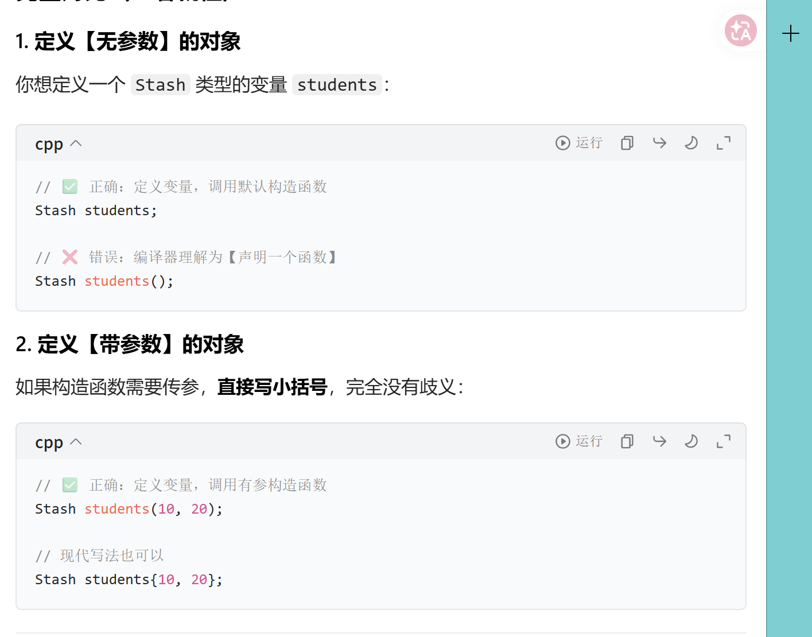
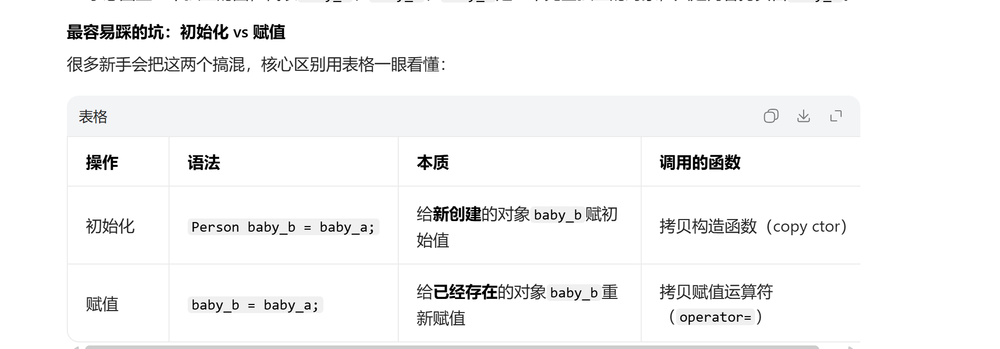

# 拷贝构造函数

## 一个小问题

这道题是C++经典的**「最令人头疼的解析（Most Vexing Parse, MVP）」**问题，我们一步步分析：

---

### 一、先看代码行

```cpp
Stash students();
```

在C++语法中，**编译器会优先把「能解释成函数声明的表达式」解释为函数声明**，而不是变量定义。

---

### 二、逐个分析选项

#### 1. 选项1：❌ 错误

如果要定义`Stash`类型的对象`students`，正确写法是：

```cpp
Stash students;  // 不带括号，调用默认构造函数
// 或 C++11+ 统一初始化
Stash students{};
```

加了`()`之后，编译器不会把它当成「变量定义+默认构造」，而是当成函数声明，因此这个说法错误。

#### 2. 选项2：✅ 正确

`Stash students();` 完全符合**函数声明（原型）**的语法：

- 返回类型：`Stash`（函数返回一个`Stash`对象）
- 函数名：`students`
- 参数列表：`()` 表示无参数
因此这行代码的真实含义是：**声明一个名为`students`的无参函数，其返回值类型为`Stash`**，这个说法完全正确。

#### 3. 选项3：❌ 错误

函数调用需要「执行已定义的函数」，而这行是**函数声明**，不是函数调用，因此错误。

#### 4. 选项4：❌ 错误

这行代码是**完全合法的C++语法**，只是它的实际含义（函数声明）和很多初学者的预期（定义对象）不一致，因此错误。

---

### 三、最终结论

正确答案是 **选项2**。

---

### 补充：如何避免这个坑？

如果你的目标是**定义`Stash`对象`students`**，用这两种写法就不会被解析成函数声明：

1.  传统写法（C++98/03）：`Stash students;`（去掉括号）
2.  现代写法（C++11及以后，推荐）：`Stash students{};`（用大括号统一初始化，彻底避免MVP问题）



## 提醒

去看howmany2 和 howmany

这里要说的是 拷贝构造函数会在函数传参的时候就会执行拷贝构造函数 在返回的时候也有可能调用临时变量 这都会调用拷贝构造函数 消失的时候也会调用析构函数

## 对象拷贝

这3张PPT是C++面向对象中**「对象拷贝（Copying）」的核心知识点串讲**，从「什么是拷贝」→「拷贝的实现（拷贝构造函数）」→「带指针类的拷贝坑」层层递进，我用大白话+代码+形象比喻给你讲透：

---

### 一、第一张：什么是「对象拷贝」

### 核心定义

**对象拷贝 = 用一个「已存在的对象」，创建一个「全新的、独立的副本对象」**。

### 最常见的触发场景：传值调用函数

PPT里的`Currency`类例子：

```cpp
// 函数参数是「传值」，会触发拷贝
void func(Currency p) {
    cout << "X = " << p.dollars();
}

// 原对象：bucks(100, 0)
Currency bucks(100, 0);
func(bucks); // ✅ 把bucks「完整拷贝一份」，给形参p
```

- 原理：调用`func`时，会创建一个`bucks`的**新副本`p`**，`p`和原对象`bucks`是两个完全独立的对象。
- 特点：函数内修改`p`，完全不会影响外面的`bucks`（因为是副本）。
- 其他触发场景：对象赋值（`Currency b = a;`）、函数返回对象（`Currency get_bucks() { return bucks; }`）等，都会触发拷贝。

---

### 二、第二张：拷贝构造函数 —— 拷贝的「执行者」

### 1. 什么是拷贝构造函数？

它是类的**特殊构造函数**，唯一的作用就是：**用一个已有的同类型对象，初始化一个新对象**（也就是执行「拷贝」操作）。

### 2. 唯一的标准签名

```cpp
T::T(const T& other);
// 比如Currency类：Currency::Currency(const Currency& other);
```

- 为什么必须是`const T&`（const引用）？
  - 如果是传值（`T(T other)`）：传值本身就需要拷贝，会无限递归调用拷贝构造函数，死循环！
  - 加`const`：承诺「不会修改原对象`other`」，符合拷贝的语义（拷贝是只读原对象）。

### 3. C++的「默认拷贝构造函数」

如果你**没有手动写拷贝构造函数**，C++编译器会**自动生成一个默认的**，它的行为是：
> **浅拷贝（Member-wise Copy，成员逐一拷贝）**：把原对象的**每个成员变量，直接拷贝一份**到新对象。

- 对于「普通成员」（int、double、普通对象、数组）：直接拷贝值，完全没问题，两个对象的成员是独立的。
- 对于「指针成员」：**只拷贝指针的「地址值」，不拷贝指针指向的堆内存**！
  → 这就是致命坑：两个对象的指针，指向**同一块堆内存**，也就是「数据共享」，后面会出大问题。

---

### 三、第三张：带指针的类，默认拷贝构造的「致命坑」

PPT举了`Person`类的例子，用`char* name`（裸指针）而不是`std::string`，就是为了演示这个经典坑：

```cpp
class Person {
public:
    Person(const char *s);  // 构造函数：new char[]，把s拷贝到堆内存
    ~Person();             // 析构函数：delete[] name，释放堆内存
    void print();
private:
    char *name;  // 指针成员，指向堆上的字符串
};
```

### 坑1：默认拷贝是「浅拷贝」，导致指针共享

```cpp
Person p1("Alice");  // p1.name 指向堆上的"Alice"
Person p2 = p1;      // ✅ 调用默认拷贝构造，浅拷贝：p2.name = p1.name（地址完全相同）
```

- 形象比喻：你有一个房子（堆内存），给朋友一个「门牌号（指针地址）」，朋友用这个门牌号进的是**你的房子**，不是他自己的。

### 坑2：析构时「重复释放（Double Free）」，程序崩溃

```cpp
// 函数结束，p1、p2依次析构
~Person() { delete[] name; }
```

- `p1`析构：`delete[] p1.name`，把房子拆了（释放内存）。
- `p2`析构：`delete[] p2.name`，**再拆一次已经被拆了的房子** → 直接崩溃（野指针、重复释放是C++最常见的崩溃原因之一）。

### 坑3：修改一个，另一个也跟着变（数据共享）

```cpp
// 比如p2修改name指向的内容
strcpy(p2.name, "Bob");
// 结果：p1.name也变成了"Bob"！因为是同一块内存，完全不符合预期
```

---

### 四、核心解决方案：深拷贝（Deep Copy）

PPT没写，但这是解决指针类拷贝问题的**唯一正确方法**：**手动写拷贝构造函数，实现「深拷贝」**。

### 深拷贝的核心：不仅拷贝指针，还要拷贝指针指向的「堆内存」

```cpp
// 手动写Person类的拷贝构造函数，实现深拷贝
Person::Person(const Person& other) {
    // 1. 先获取原字符串的长度
    int len = strlen(other.name) + 1;
    // 2. 给新对象的name，分配一块**全新的堆内存**
    name = new char[len];
    // 3. 把原对象的字符串，拷贝到新的堆内存里
    strcpy(name, other.name);
    // ✅ 现在p1.name和p2.name指向两块完全独立的内存，互不影响！
}
```

- 形象比喻：你给朋友**盖了一个一模一样的新房子**，给了新房子的门牌号，你们各住各的，互不影响。

---

### 五、现代C++最佳实践（避坑指南）

1.  **尽量用标准容器，不要用裸指针**：`std::string`、`std::vector`等已经实现了正确的深拷贝，完全不会有浅拷贝的坑。
2.  **三大法则（Rule of Three）**：如果类需要手动写「拷贝构造函数」，就必须同时写「赋值运算符重载」和「析构函数」，三者缺一不可。
3.  **用智能指针替代裸指针**：`std::unique_ptr`/`std::shared_ptr`自动管理内存，避免手动`new`/`delete`的问题，同时正确处理拷贝语义。

---

### 六、整体逻辑总结

这3页PPT完整讲透了C++对象拷贝的核心逻辑：

1.  对象拷贝是用已有对象创建新对象，传值调用是最常见场景。
2.  拷贝由「拷贝构造函数」实现，C++自动生成的默认拷贝是「浅拷贝」。
3.  带指针的类用浅拷贝会导致数据共享、重复释放、程序崩溃，必须手动实现深拷贝。

## 辨析

---

### 一、拷贝构造函数是类一定有的吗？

✅ **核心结论：类一定有拷贝构造函数，不存在“没有拷贝构造函数”的类**，分两种情况：

1.  **你没手动写拷贝构造函数**：
    C++编译器会**自动生成一个「默认拷贝构造函数」**，行为是**浅拷贝（成员逐一拷贝）**：把原对象的每个成员变量，直接拷贝到新对象里。

    - 补充（C++版本差异）：
      - C++03：只要你没写，就100%生成默认拷贝构造；
      - C++11及以后：如果类中**手动声明了移动构造/移动赋值运算符**，编译器就不会再生成默认拷贝构造了（此时拷贝操作会被禁止）。
2.  **你手动写了拷贝构造函数**：
    编译器就不会自动生成了，直接用你写的那个拷贝构造函数。

---

### 二、拷贝构造函数 vs 普通构造函数：核心区别

用表格对比，一眼看懂本质差异：

| 对比维度 | 普通构造函数（非拷贝） | 拷贝构造函数 |
|----------|------------------------|--------------|
| **核心作用** | **从无到有**：创建一个全新的对象，用你给的参数初始化 | **从有到有**：用一个**已存在的同类型对象**，克隆出一个全新的对象（执行拷贝） |
| **参数要求** | 完全自定义：任意类型、任意个数的参数（支持重载） | **唯一固定签名**：`T::T(const T&)`（必须是同类型的`const`引用，改了就不是拷贝构造了） |
| **触发时机** | 主动创建对象时：<br>`Currency c(100, 0);` / `Currency c;` | 触发拷贝时：<br>1. 传值调用函数（`func(c)`）<br>2. 对象初始化赋值（`Currency c2 = c1;`）<br>3. 函数返回对象（`return c;`） |
| **默认生成规则** | 只有当你**没写任何构造函数**时，编译器才会生成「默认普通构造函数」 | 只要你**没写拷贝构造函数**（C++03），就自动生成；C++11后有例外 |
| **重载数量** | 可以有多个（比如默认构造、有参构造，重载） | 只能有1个（参数固定，无法重载，加默认参数无意义，不推荐） |
| **本质** | 普通构造函数，用于初始化新对象 | 特殊的构造函数，专门用于「拷贝初始化」新对象 |

---

### 三、能同时存在吗？

✅ **结论：完全可以，而且是C++类的「标准常态」**
拷贝构造函数和普通构造函数是**重载关系**，编译器会根据「调用时的参数」自动匹配对应的构造函数，完全不会冲突。

### 完整代码示例（同时存在，正常运行）

```cpp
#include <iostream>
class Currency {
private:
    int dollars;
    int cents;
public:
    // 1. 普通构造函数1：默认构造（无参）
    Currency() : dollars(0), cents(0) {
        std::cout << "调用默认普通构造" << std::endl;
    }

    // 2. 普通构造函数2：有参构造
    Currency(int d, int c) : dollars(d), cents(c) {
        std::cout << "调用有参普通构造" << std::endl;
    }

    // 3. 拷贝构造函数（必须是const T&）
    Currency(const Currency& other) : dollars(other.dollars), cents(other.cents) {
        std::cout << "调用拷贝构造" << std::endl;
    }

    // 成员函数：获取金额
    int get_dollars() const { return dollars; }
};

// 测试函数：传值调用，触发拷贝构造
void func(Currency p) {
    std::cout << "函数内金额：" << p.get_dollars() << std::endl;
}

int main() {
    // 1. 调用默认普通构造
    Currency c1;
    // 2. 调用有参普通构造
    Currency c2(100, 0);
    // 3. 调用拷贝构造（用c2初始化c3）
    Currency c3 = c2;
    // 4. 传值调用func，触发拷贝构造（把c2拷贝给形参p）
    func(c2);

    return 0;
}
```

### 运行输出（验证同时存在，正常调用）

```
调用默认普通构造
调用有参普通构造
调用拷贝构造
调用拷贝构造
函数内金额：100
```

完美验证：2个普通构造、1个拷贝构造同时存在，编译器根据场景自动匹配调用。

---

### 四、补充：为什么拷贝构造的参数必须是`const T&`？

这是C++的语法强制要求，两个核心原因：

1.  **避免无限递归**：如果参数是传值（`T(T other)`），传值本身就需要拷贝，会无限递归调用拷贝构造函数，程序直接死循环。
2.  **语义匹配**：拷贝是「只读原对象」，加`const`承诺不会修改原对象，符合拷贝的逻辑；同时支持用`const`对象作为拷贝源。

---

### 五、补充：三大法则（Rule of Three）

如果你的类**需要手动写拷贝构造函数**（比如带指针，需要深拷贝），就必须同时写：

1.  拷贝构造函数
2.  拷贝赋值运算符（`operator=`）
3.  析构函数
三者缺一不可，否则一定会出现内存泄漏、重复释放等问题（就是之前`Person`类的经典坑）。

---

### 六、一句话总结

- 类一定有拷贝构造函数，要么编译器自动生成，要么你手动写；
- 拷贝构造是「克隆对象用的特殊构造」，普通构造是「从零造对象用的普通构造」，参数、作用、触发时机完全不同；
- 两者可以同时存在，编译器自动匹配，是C++类的标准写法。

## 区分

区分它们**超级简单**，只看两点就够了：
**一看参数长相，二看你是怎么写代码调用的**

---

### 1. 先看“长相”：一眼分清谁是谁

### 普通构造函数

参数**随便你写**，可以无参、可以 int、string、别的类都行。

```cpp
// 无参普通构造
Person() {}

// 有参普通构造
Person(string name) {}
Person(int age) {}
Person(string name, int age) {}
```

### 拷贝构造函数

**参数是固定死的**，只能是：

```cpp
类名(const 类名& 变量名);
```

比如：

```cpp
Person(const Person& other);
```

只要看到参数是**自己这个类的 const 引用**，它**一定是拷贝构造**，别的都不是。

---

### 2. 再看“调用方式”：你写代码时就知道用的谁

### 调用普通构造

你是**从零新建一个对象**，直接给值：

```cpp
Person p1;          // 无参普通构造
Person p2("张三");   // 有参普通构造
```

### 调用拷贝构造

你是**拿一个已经存在的对象，去造一个新的**：

```cpp
Person p3 = p2;     // 用 p2 拷贝出 p3 → 拷贝构造
Person p4(p2);      // 同上，也是拷贝构造
```

还有一种常见情况：**函数传值**

```cpp
void func(Person p) {}

int main() {
    Person a;
    func(a);  // 把 a 拷贝给 p → 调用拷贝构造
}
```

---

### 3. 一句话终极区分口诀

- **普通构造**：参数乱七八糟 → 用来**从零造新对象**
- **拷贝构造**：参数固定是 `const 类名&` → 用来**复制一个已有的对象**

## 浅拷贝

浅拷贝本身**不是错误**，但**只要你的类里有指针指向堆内存（new 出来的内存）**，浅拷贝就会触发三个**致命bug**：重复释放内存、数据互相污染、内存泄漏。

我用**最直白的逻辑 + 可运行代码 + 运行后果**，把浅拷贝的问题彻底讲透。

---

## 一、什么是浅拷贝？

C++ 编译器自动生成的**拷贝构造函数**和**赋值运算符**，做的都是**浅拷贝**：
> 只把对象里的**成员变量的值原封不动复制一遍**
> 如果成员是**指针**，只复制**地址**，不复制指针指向的那块内存

一句话：
**只拷门牌号，不拷房子本身**

---

## 二、浅拷贝出问题的前提

你的类里**有指针，并且指针指向了堆内存（new / new[]）**

```cpp
class Person {
public:
    // 构造：在堆上开内存存名字
    Person(const char* name) {
        m_name = new char[strlen(name)+1];
        strcpy(m_name, name);
    }

    // 析构：释放堆内存
    ~Person() {
        delete[] m_name;
    }

private:
    char* m_name; // 指针！指向堆内存
};
```

这种类**一旦用默认浅拷贝**，立刻爆炸。

---

## 三、浅拷贝的三大致命问题（逐条讲清楚）

### 问题1：重复释放内存（double free）→ 程序直接崩溃

这是最常见、最致命的问题。

### 代码触发

```cpp
int main() {
    Person p1("Tom");
    Person p2 = p1; // 浅拷贝！p2.m_name = p1.m_name
}
```

### 发生了什么

1. `p1` 构造：`new` 一块内存存 `"Tom"`
2. `p2` 拷贝：只复制地址，**两个指针指向同一块内存**
3. 函数结束，对象销毁：
   - 先析构 `p2`：`delete[]` 释放内存
   - 再析构 `p1`：又一次 `delete[]` **同一块已经释放的内存**

### 后果

程序直接崩溃，报错：
`double free or corruption`

---

### 问题2：修改一个对象，另一个跟着变 → 逻辑错误

浅拷贝让两个对象**共享同一块数据**，完全破坏封装。

### 代码触发

```cpp
int main() {
    Person p1("Tom");
    Person p2 = p1;

    // 修改 p2 的名字
    strcpy(p2.m_name, "Jerry");

    // 结果 p1 的名字也变成了 Jerry！
}
```

### 原因

它们的 `m_name` 指针**指向同一块内存**，改一个等于改两个。

### 后果

业务逻辑彻底混乱，你根本想不到为什么变量会“自己变”。

---

### 问题3：赋值时的内存泄漏（浅拷贝 + 赋值运算符）

如果用赋值操作，浅拷贝还会丢内存。

```cpp
Person p1("Tom");
Person p2("Jerry");

p2 = p1; // 浅拷贝赋值
```

### 发生了什么

1. `p2` 原来指向 `"Jerry"` 的内存
2. 浅拷贝直接把 `p2.m_name` 改成 `p1` 的地址
3. **原来的内存没人管了**，永远无法释放

### 后果

内存泄漏，程序跑久了直接爆内存。

---

### 四、为什么普通成员不会出问题？

如果类里是 `int`、`double`、`std::string`，浅拷贝**完全安全**。

因为：

- `int a` 拷贝的是**值本身**，两个对象各存各的
- `std::string` 内部已经做了**深拷贝**，你看不到指针

只有**你自己写了裸指针 + 手动new**，浅拷贝才炸。

---

### 五、怎么解决？→ 深拷贝

浅拷贝只拷地址，深拷贝：

1. 先**new一块新内存**
2. 把原数据**复制到新内存**
3. 让新对象指针指向**自己的新内存**

也就是：
**不仅拷门牌号，还重新盖一栋一模一样的房子**

### 深拷贝的拷贝构造函数

```cpp
Person(const Person& other) {
    // 新开内存
    m_name = new char[strlen(other.m_name)+1];
    // 复制内容
    strcpy(m_name, other.m_name);
}
```

这样两个对象完全独立，互不影响，不会重复释放。

---

### 六、终极总结（一句话记住）

1. **浅拷贝 = 只拷成员值，指针共享同一块堆内存**
2. 只要类里有**new出来的指针成员**，浅拷贝必出问题：
   - 重复delete → 崩溃
   - 改一个影响另一个 → 逻辑错
   - 赋值丢内存 → 泄漏
3. 解决方法：**手动写拷贝构造 + 赋值重载，做深拷贝**

## string类再分析

这两张PPT是**C++中「C风格字符串（C-style string）」的核心基础知识点**，从「定义本质」到「标准库操作」，是C++指针、内存管理、类设计的前置知识，我给你拆解得明明白白：

---

## 一、第一张PPT：C风格字符串的本质定义

### 核心结论

在C++（兼容C语言）中，**C风格字符串 = 以`'\0'`（ASCII空字符，数值为0）作为终止符的字符数组**。

- 普通字符数组：只是一堆字符的集合，没有终止符，不能当字符串用；
- C风格字符串：必须在最后一个有效字符后面，加一个`'\0'`，用来标记「字符串结束」。

### 直观例子：`"C++"`的内存布局

我们写的字符串字面量 `"C++"`，看起来是3个可见字符：`'C'`、`'+'`、`'+'`，但在内存里，实际是**4个字符**：

```
[ 'C' | '+' | '+' | '\0' ]
```

- 前3个是有效内容，最后1个`'\0'`是**强制要求的终止符**，绝对不能少。
- 为什么必须有`'\0'`？
  字符数组本身没有「长度信息」，`'\0'`是给字符串函数（比如`strlen`、`strcpy`）的「停止信号」：函数读到`'\0'`就知道字符串结束了，不会继续往后读越界的内存，否则会直接崩溃。

### 关键注意点

- 字符串的**有效长度（`strlen`结果）不包含`'\0'`**：`"C++"`的长度是3，不是4；
- 分配内存时，必须多留1个字节给`'\0'`：比如存`"C++"`，数组大小至少是4（3个字符+1个`'\0'`），否则会越界；
- 没有`'\0'`的字符数组，**不是合法的C风格字符串**，用字符串函数操作会直接越界、崩溃。

---

## 二、第二张PPT：C标准库的字符串操作函数

这些函数都在 `<cstring>` 头文件（C语言中是 `<string.h>`）中声明，是操作C风格字符串的标准工具，PPT重点讲了两个最核心、最常用的函数：

### 1. `strlen`：计算字符串长度

#### 函数原型

```cpp
size_t strlen(const char *s);
```

#### 作用

返回字符串 `s` 的**有效字符长度**，**不包含末尾的`'\0'`终止符**。

#### 注意事项

- `s` 必须是**合法的、以`'\0'`结尾的C风格字符串**，否则`strlen`会一直往后读内存（越界访问），结果是随机值，甚至导致程序崩溃；
- `size_t` 是无符号整数类型，不要和有符号`int`混用，避免溢出/比较错误；
- 例子：`strlen("C++")` 结果是 `3`，不是`4`。

### 2. `strcpy`：字符串拷贝

#### 函数原型

```cpp
char *strcpy(char *dest, const char *src);
```

#### 作用

把源字符串 `src`（**包括末尾的`'\0'`**）完整拷贝到目标地址 `dest` 中，直到`'\0'`被拷贝完为止。

#### 注意事项（全是致命坑）

- `src` 必须是**合法的`'\0'`结尾字符串**，否则拷贝会越界，覆盖其他内存；
- `dest` 必须**提前分配足够的内存空间**，能装下`src`的所有字符（包括`'\0'`）！
  → 这是C/C++中最经典的**缓冲区溢出漏洞**：如果`dest`空间不够，`strcpy`会强行往后写，破坏其他数据，甚至被黑客利用；

- 返回值是`dest`，方便链式调用（比如`strcpy(dest2, strcpy(dest1, src))`）；
- 关键区分（和之前的浅拷贝联动）：
  - `strcpy`是**深拷贝**：把字符串内容完整复制到新内存，两个指针指向独立的内存；
  - 直接赋值`char* dest = src`是**浅拷贝**：只复制指针地址，两个指针共享同一块内存，这就是之前`Person`类出问题的根源！

---

## 三、补充：C风格字符串的其他常用函数（PPT没写，但必用）

| 函数 | 作用 | 核心注意事项 |
|------|------|--------------|
| `strcat(dest, src)` | 把`src`拼接到`dest`末尾 | `dest`必须有足够空间，否则溢出 |
| `strcmp(s1, s2)` | 按ASCII码比较两个字符串大小 | 相等返回0，s1>s2返回正数，否则负数 |
| `strncpy/strncat/strncmp` | 带长度限制的安全版本 | 避免缓冲区溢出，现代C推荐用这些替代无长度版本 |

---

## 四、核心坑点 + 现代C++最佳实践

### 1. C风格字符串的致命问题（和你之前学的知识点完全联动）

- 必须手动管理内存：`new`/`new[]`分配，`delete`/`delete[]`释放，极易漏释放、重复释放；
- 浅拷贝灾难：直接赋值`char*`是浅拷贝，共享内存，导致重复释放、数据互相污染（就是`Person`类的经典bug）；
- 缓冲区溢出：`strcpy`等函数不检查长度，是安全漏洞的重灾区；
- 无类型安全：`char*`只是指针，编译器不检查是否是合法字符串。

### 2. 现代C++的完美解决方案：`std::string`

- 完全封装了C风格字符串，自动管理内存，**彻底避免浅拷贝、内存泄漏、缓冲区溢出**；
- 内置了`size()`（等价`strlen`）、`operator=`（深拷贝）、`+`（拼接）等操作，更安全、更易用；
- 唯一需要注意：如果要和C函数交互，用`.c_str()`获取`const char*`（只读，不能修改）。

---

## 五、一句话终极总结

- C风格字符串 = 带`'\0'`的字符数组，`'\0'`是灵魂，没它就不是合法字符串；
- `strlen`算长度不算`'\0'`，`strcpy`拷贝必须保证目标空间足够；
- 现代C++尽量用`std::string`，别用裸`char*`，彻底避开所有坑。



## 核心调用时机补充

这张PPT讲的是**C++中「拷贝构造函数（copy ctor）」的第三个核心调用时机：当函数以「值返回」一个对象时，会触发拷贝构造**，是C++面向对象内存管理的关键知识点，我给你拆解得明明白白：

---

### 一、代码逐行拆解

```cpp
// 1. 定义函数：返回类型是 Person（值返回，不是引用/指针）
Person captain() {
    Person player("George"); // ① 普通构造：在函数栈上创建局部对象 player，名字为 George
    return player;           // ② 按值返回：核心！这里会触发拷贝构造
}

// 2. 外部调用
Person who("");  // ① 普通构造：创建已存在的对象 who，初始名字为空
who = captain(); // ② 调用 captain()，接收返回值
```

---

### 二、传统流程（无编译器优化，C++17 之前）

这是PPT示意图展示的逻辑，分两步：

#### 1. 函数内部 `return player;` 阶段（触发拷贝构造）

- 局部对象 `player` 存在于 `captain()` 的栈帧中，函数执行完后栈帧会被销毁，`player` 会被析构。
- 因为函数是**值返回**，必须把 `player` 的内容**完整拷贝一份**，到一个「临时返回值对象」（这个对象在调用者 `who` 的栈帧上，不会随函数销毁）。
- ✅ **这一步会调用拷贝构造函数**：用 `player` 初始化临时返回值对象。
- 函数执行完毕，`player` 被析构，临时对象保留。

#### 2. 外部 `who = captain();` 阶段（触发拷贝赋值）

- `who` 是**已经存在的对象**（`Person who("");` 已经构造完成），所以这里的 `=` 不是拷贝构造，而是**拷贝赋值运算符（`operator=`）**：把临时对象的内容赋值给 `who`。
- 赋值完成后，临时对象被销毁。

---

### 三、示意图解读

- 右上角绿色块：`captain()` 函数的栈帧，里面的圆是局部对象 `player`（名字 George），`return player;` 是返回操作。
- 左下角绿色块：调用者的栈帧，里面的圆是对象 `who`，`who = captain()` 是接收返回值的操作。
- 箭头 + `copy` 标注：表示从 `player` 到临时对象（最终到 `who`）的**拷贝过程**，其中 `return player;` 是拷贝构造的触发点。

---

### 四、关键知识点 & 避坑指南

#### 1. 拷贝构造 vs 拷贝赋值（最容易搞混的点）

| 操作 | 语法 | 本质 | 调用的函数 |
|------|------|------|------------|
| 拷贝构造 | `return player;` | 用已存在的 `player` 初始化**新的临时对象** | 拷贝构造函数（copy ctor） |
| 拷贝赋值 | `who = captain();` | 给**已经存在的 `who`** 重新赋值 | 拷贝赋值运算符（`operator=`） |

#### 2. 现代 C++ 的优化（C++17 之后）

- C++11 引入了**返回值优化（RVO/NRVO）**，C++17 之后成为**强制拷贝省略**：
  编译器会直接把 `player` 构造在 `who` 的内存地址中，完全跳过「临时对象 + 拷贝构造 + 拷贝赋值」的全过程，实现「零成本返回」。

- 注意：**语法上仍然是拷贝构造的调用时机**，只是编译器有权优化掉，逻辑上依然需要拷贝构造函数存在（否则编译报错）。

#### 3. 为什么必须手动实现深拷贝？

如果 `Person` 类有堆内存成员（比如 `char* name`），没有手动实现深拷贝的拷贝构造：

- `return player;` 时，默认浅拷贝只会复制指针地址，临时对象和 `player` 指向同一块堆内存。
- `player` 析构时释放内存，临时对象变成野指针，赋值给 `who` 后，`who` 析构时会**重复释放（double free）**，程序直接崩溃。

#### 4. 绝对禁止的错误写法

```cpp
// 错误！返回局部变量的引用，UB（未定义行为）
Person& captain() {
    Person player("George");
    return player; // player 销毁后，引用变成野引用
}
```

局部变量在函数栈上，销毁后引用无效，绝对不能返回局部变量的引用/指针。

---

### 五、串联所有拷贝构造调用时机

到这里，拷贝构造的三大核心调用时机就完整了：

1.  **值传递函数参数**：用实参初始化形参（第一张PPT）
2.  **用已存在对象初始化新对象**：比如 `Person b = a;` / `Person c(a);`（第二张PPT）
3.  **函数按值返回对象**：`return 局部对象;`（这张PPT）

---

### 补充：如果是初始化新对象的情况

如果外部是用返回值初始化新对象，比如：

```cpp
Person who = captain(); // 用返回值初始化新对象 who
```

- 流程会变成：`return player;` 拷贝构造临时对象 → 临时对象拷贝构造 `who`（C++17 后强制省略，直接构造 `who`，零拷贝）。
- 这里的 `=` 是**初始化**，不是赋值，所以调用的是拷贝构造，不是拷贝赋值。

## 不用拷贝构造的方法

---

### 一、第一个函数：`copy_func`（传统流程需要拷贝构造）

```cpp
Person copy_func( char *who ) {
    Person local( who );  // 1. 普通构造：在函数栈上创建「具名局部对象」local
    local.print();        // 2. 对local做额外操作（比如打印）
    return local;         // 3. 按值返回：传统无优化时，这里会调用拷贝构造！
}
```

#### 原理拆解

#### 1. 传统C++（C++98/03，无编译器优化）

- `local` 是**有名字的栈上局部变量**，函数执行完后栈帧会销毁，`local` 会被析构。
- 函数是**值返回**，必须把 `local` 的内容**完整拷贝一份**到「返回值临时对象」（存在于调用者栈帧，不会被销毁），因此**必须调用拷贝构造函数**（对应你之前学的「函数值返回时触发拷贝构造」的核心时机）。

#### 2. 现代C++优化（C++11及以后）

编译器会自动做**具名返回值优化（Named RVO, NRVO）**：直接把 `local` 构造在「返回值临时对象」的内存位置，完全跳过拷贝构造，实现零成本返回。
⚠️ 关键注意：

- NRVO是**编译器可选优化**（不是强制），但几乎所有现代编译器（GCC/Clang/MSVC）都会默认开启，实际中不会真的调用拷贝构造。
- **语法上，拷贝构造函数必须存在且可访问**（比如不能设为private），否则编译报错（编译器会先做语法检查，再执行优化）。

---

### 二、第二个函数：`nocopy_func`（完全不需要拷贝）

```cpp
Person nocopy_func( char *who ) {
    return Person( who ); // 直接返回「无名临时对象」，彻底跳过拷贝！
}
```

#### 原理拆解

- `Person(who)` 是一个**无名的临时对象**（右值），不是栈上的具名局部变量。
- 编译器可以直接把这个临时对象**构造在「返回值临时对象」的内存位置**，不需要任何拷贝，也就是**无名返回值优化（Unnamed RVO, URVO）**。
- 在C++17及以后，这种优化成为**强制拷贝省略（Mandatory Copy Elision）**：编译器**必须**省略拷贝，完全零成本，甚至语法上都不需要拷贝构造函数存在。

#### 为什么PPT标注「no copy needed!」

- 即使在传统C++（无强制优化）中，URVO也几乎被所有编译器支持，100%跳过拷贝，因此标注“不需要拷贝”。
- 这种写法是C++的最佳实践，比`copy_func`更高效，尤其适合不需要对对象做额外操作的场景。

---

### 三、核心对比表（一眼看懂差异）

| 函数 | 返回内容 | 类型 | 传统流程是否调用拷贝构造 | 现代C++优化 | 拷贝构造是否必须存在 |
|------|----------|------|--------------------------|-------------|----------------------|
| `copy_func` | 具名局部变量`local` | 左值 | ✅ 必须调用（无优化时） | NRVO（可选，默认开启） | ✅ 必须存在且可访问 |
| `nocopy_func` | 无名临时对象`Person(who)` | 右值 | ❌ 编译器自动优化跳过 | URVO（C++17后强制） | ❌ C++17后不需要 |

---

### 四、关键知识点补充

1.  **RVO的本质**：编译器的合规优化技术，通过“直接在目标位置构造对象”，跳过不必要的拷贝，完全不改变程序的可见行为（符合C++的`as-if`规则）。
2.  **联动之前的知识点**：`copy_func`的`return local`是你之前学的「拷贝构造三大调用时机」之一（函数值返回），而`nocopy_func`是通过编译器优化，彻底跳过了这个拷贝。
3.  **最佳实践**：
    - 如果不需要对局部对象做额外操作，优先用`nocopy_func`的写法：`return Person(who);`，直接返回临时对象，零拷贝。
    - 如果需要对局部对象做操作（比如修改、打印），用`copy_func`的写法，同时保证类的拷贝构造函数正确（深拷贝），现代编译器会自动优化掉拷贝。
4.  **避坑提醒**：永远不要返回局部变量的引用/指针，会导致未定义行为（UB），函数返回对象时优先用值返回+RVO优化。

## 一些原则

这张PPT是**C++中「拷贝构造函数（copy constructor）」的设计与使用准则**，核心是教你如何正确管理类的拷贝行为，避免内存错误、逻辑错误，我给你逐点拆解清楚：

---

## 一、第一大准则：一般情况下，要「显式实现」（In general, be explicit）

### 子准则：自己写拷贝构造，不要依赖编译器生成的默认版本

> Create your own copy ctor -- don't rely on the default

#### 1. 核心含义

当你的类**包含动态分配的堆内存资源**（比如你之前学的 `char* name`，用 `new[]` 分配的C风格字符串）时：

- 编译器自动生成的「默认拷贝构造函数」只会做**浅拷贝（Shallow Copy）**：只复制指针地址，不分配新内存。
- 这会导致两个对象的指针指向**同一块堆内存**，最终引发「重复释放（double free）」、内存泄漏、数据混乱等严重问题。
- 因此，**必须手动实现「深拷贝（Deep Copy）」的拷贝构造函数**，给新对象分配独立的堆内存、复制数据，而不是依赖默认版本。

#### 2. 什么时候可以用默认拷贝构造？

如果你的类的所有成员都是**值类型/标准库类型**（比如 `std::string`、`int`、`std::vector` 等，没有裸指针、没有动态堆内存）：

- 编译器自动生成的默认拷贝构造是**安全的**：会自动调用每个成员的拷贝构造，执行深拷贝。
- 这时候遵循现代C++的「Rule of Zero」：不需要手动写拷贝构造，用默认的就好。
- 这条准则是**传统C++（C++98/03）的通用建议**，当时很多类用裸指针管理资源，所以要求显式实现；现代C++用标准库封装资源，默认拷贝就足够安全。

---

## 二、第二大准则：如果不需要拷贝，就「彻底禁止拷贝」

> If you don't need one declare a private copy ctor

### 适用场景

当你的类的对象**不应该被拷贝**时（比如：

- 单例模式（整个程序只有一个实例，不能拷贝出第二个）
- 独占资源的类（比如文件句柄、网络连接、锁，拷贝会导致资源重复释放/竞争）
- 逻辑上不可拷贝的类（比如线程类，拷贝线程没有实际意义）
），就需要**从语法层面彻底禁止类的拷贝行为**。

### 子准则1：阻止编译器生成默认拷贝构造

> prevents creation of a default copy constructor

- 如果你不写任何拷贝构造，编译器会**自动生成一个public的默认拷贝构造**，允许所有拷贝操作。
- 所以，你需要**手动声明一个private的拷贝构造函数**：

  ```cpp
  class NonCopyable {
  private:
      NonCopyable(const NonCopyable&); // 只声明，不实现
  };
  ```

- 只要你手动声明了拷贝构造，编译器就**不会再生成默认的public版本**，从根源上阻止了默认拷贝。

### 子准则2：尝试值传递/拷贝时，直接编译报错

> generates a compiler error if try to pass-by-value

- 因为拷贝构造是private，类外（比如函数调用、对象初始化）无法访问。
- 当有人尝试拷贝对象时，编译器会直接报错，从语法层面彻底禁止拷贝，避免逻辑错误：

  ```cpp
  NonCopyable a;
  NonCopyable b = a; // 编译报错：拷贝构造是private
  void func(NonCopyable p); // 调用func(a)时，值传递需要拷贝，编译报错
  ```

### 子准则3：只需要声明，不需要实现

> don't need a defintion

- 因为拷贝构造是private，**永远不会被调用**（类外不能用，类内如果也不调用的话），所以只需要写声明，不需要写函数体（实现）。
- 这样不会有链接错误，是C++98/03中禁止拷贝的标准做法。

---

## 三、现代C++的升级：用 `=delete` 替代private声明（C++11及以后）

C++11之后，有了更清晰、更安全的方式禁止拷贝：**把拷贝构造函数显式删除（delete）**，比private更直观：

```cpp
class NonCopyable {
public:
    // 显式删除拷贝构造
    NonCopyable(const NonCopyable&) = delete;
    // 同时删除拷贝赋值运算符（必须同步处理！）
    NonCopyable& operator=(const NonCopyable&) = delete;
};
```

### 两种方式对比

| 方式 | 适用版本 | 特点 |
|------|----------|------|
| private拷贝构造（只声明不实现） | C++98/03 | 兼容旧标准，但需要注意类内也不能调用，否则链接错误 |
| `=delete` 显式删除 | C++11及以后 | 语法更清晰，编译期直接报错，类内调用也会报错，更安全 |

---

## 四、关键避坑指南

1.  **Rule of Three 必须遵守**：如果手动写了拷贝构造，必须同时写**拷贝赋值运算符**和**析构函数**，否则依然会有内存问题。
2.  **禁止拷贝要同步禁止赋值**：不管是private还是=delete，都要同时处理拷贝构造和拷贝赋值，否则只禁止拷贝构造，赋值依然可以用默认的，还是会有问题。
3.  **现代C++优先用=delete**：如果不需要兼容C++98，一律用`=delete`，更清晰、更安全。

---

### 一句话总结

这张PPT的核心是：**有资源要拷贝，就显式写深拷贝；不需要拷贝，就彻底禁止拷贝**，是C++类设计中管理拷贝行为的核心准则。

这张PPT讲的是**C++11 引入的「委托构造函数（Delegating Constructor）」**，核心是让构造函数之间互相调用、复用初始化逻辑，彻底消除重复代码，是现代C++类设计的重要特性。我给你逐条拆解规则+配代码实例，一眼看懂：

---

## 委托构造函数

### 一、先搞懂核心概念

**委托构造函数**：允许同一个类的**一个构造函数，调用本类的另一个构造函数**，来完成对象的初始化。

- 目的：避免多个构造函数里写重复的初始化代码，符合「DRY（Don't Repeat Yourself）」原则，减少bug、方便维护。
- 本质：用被调用的构造函数，来初始化**当前正在创建的对象**，而不是创建临时对象。

---

### 二、逐条拆解PPT的4条核心规则

#### 1. 规则1：必须在「初始化列表」中调用另一个构造函数

> Put calling to another ctor in the initialization list.

##### 核心要求：

- 委托调用**只能写在初始化列表**，绝对不能写在构造函数体里。
- 只有在初始化列表中调用本类构造，才是「委托构造」，会用被调用的构造初始化当前对象；如果在函数体里调用，只会创建一个临时对象，完全无法初始化当前对象。

✅ **正确写法（委托构造）**：

```cpp
class Person {
private:
    std::string name;
    int age;
public:
    // 主构造：负责完整初始化
    Person(std::string n, int a) : name(std::move(n)), age(a) {}

    // 委托构造：在初始化列表调用主构造
    Person(std::string n) : Person(n, 0) {}

    // 无参委托构造：委托给带参主构造
    Person() : Person("unknown", 0) {}
};
```

❌ **错误写法（函数体调用，不是委托）**：

```cpp
Person(std::string n) {
    Person(n, 0); // 仅创建临时对象，当前对象完全没被初始化！
}
```

---

#### 2. 规则2：委托构造的初始化列表，不能再初始化其他成员

> But this delegating ctor can not have other members initialized in its own initialization list.

#### 核心限制：

如果一个构造函数**已经在初始化列表里委托了另一个构造**，那么它的初始化列表里**绝对不能再出现任何其他成员的初始化**。

#### 为什么有这个限制？

被委托的构造函数已经负责了所有成员的初始化，如果委托构造再初始化同一个成员，会导致**重复初始化**，引发未定义行为，C++标准直接禁止这种写法。

❌ **错误写法（混合委托+成员初始化）**：

```cpp
// 编译报错！委托构造不能同时初始化age
Person(std::string n) : Person(n, 0), age(18) {}
```

✅ **正确逻辑**：
所有成员的初始化，都由**被委托的构造函数**完成，委托构造只负责传参，不做额外初始化。

---

#### 3. 规则3：用「私有构造函数」解决额外初始化需求

> To solve this, a private ctor can be used to provide initialization to other members.

##### 适用场景：

如果多个public构造函数，需要执行**共同的额外逻辑**（比如参数校验、日志打印、资源分配），同时又要复用初始化代码，可以用一个**私有构造函数作为「统一初始化入口」**：

- 所有public构造都委托给这个私有构造
- 由私有构造完成「所有成员初始化 + 共同额外逻辑」
- 完美解决「委托构造不能额外初始化」的限制

✅ **代码实例**：

```cpp
class Person {
private:
    std::string name;
    int age;
    // 私有统一构造：负责所有成员初始化+共同逻辑
    Person(std::string n, int a, bool is_valid)
        : name(std::move(n)), age(a)
    {
        // 所有构造都会执行的共同逻辑：校验、日志、资源初始化
        if (!is_valid) {
            std::cerr << "Warning: Invalid person created!" << std::endl;
        }
    }

public:
    // public构造1：委托给私有构造
    Person(std::string n, int a) : Person(n, a, true) {}

    // public构造2：委托给同一个私有构造
    Person(std::string n) : Person(n, 0, false) {}

    // public构造3：无参，委托给私有构造
    Person() : Person("unknown", 0, false) {}
};
```

---

#### 4. 规则4：可以创建「委托链」

> It is possible to create a chain of delegating ctors.

##### 核心说明：

委托构造可以形成**链式调用**：A构造委托给B，B委托给C，最终由C完成所有初始化。

- ⚠️ 绝对禁止**循环委托**（A委托B，B委托A），会导致编译报错或无限递归，程序崩溃。

✅ **正确的委托链实例**：

```cpp
class Person {
private:
    std::string name;
    int age;
    // 最终的根构造：完成所有初始化
    Person(std::string n, int a) : name(std::move(n)), age(a) {}

public:
    // 构造1：委托给根构造
    Person(std::string n) : Person(n, 0) {}

    // 构造2：委托给构造1，形成委托链
    Person() : Person("unknown") {}
    // 执行流程：Person() → Person("unknown") → Person("unknown", 0)
};
```

❌ **错误的循环委托**：

```cpp
// 编译报错！无限递归
Person(std::string n) : Person() {}
Person() : Person("default") {}
```

---

### 三、补充关键知识点

#### 1. 委托构造的执行顺序

1.  先执行**被委托的构造函数**（完成所有成员初始化）
2.  再执行**委托构造函数的函数体**

```cpp
Person(std::string n) : Person(n, 0) {
    std::cout << "委托构造函数体执行" << std::endl;
}
// 执行顺序：
// 1. 调用Person(n, 0)，初始化name和age
// 2. 执行当前构造的函数体，打印日志
```

#### 2. 现代C++最佳实践

- **用委托构造消除重复代码**：多个构造函数的共同逻辑，统一放到一个私有主构造，其他构造都委托给它，从根源避免复制粘贴带来的bug。
- **配合移动语义优化**：传参时用`std::move`转移`std::string`等资源，避免拷贝，提升性能（如`name(std::move(n))`）。
- **严格遵守限制**：绝对不要在委托构造的初始化列表里混合成员初始化，避免未定义行为。

---
