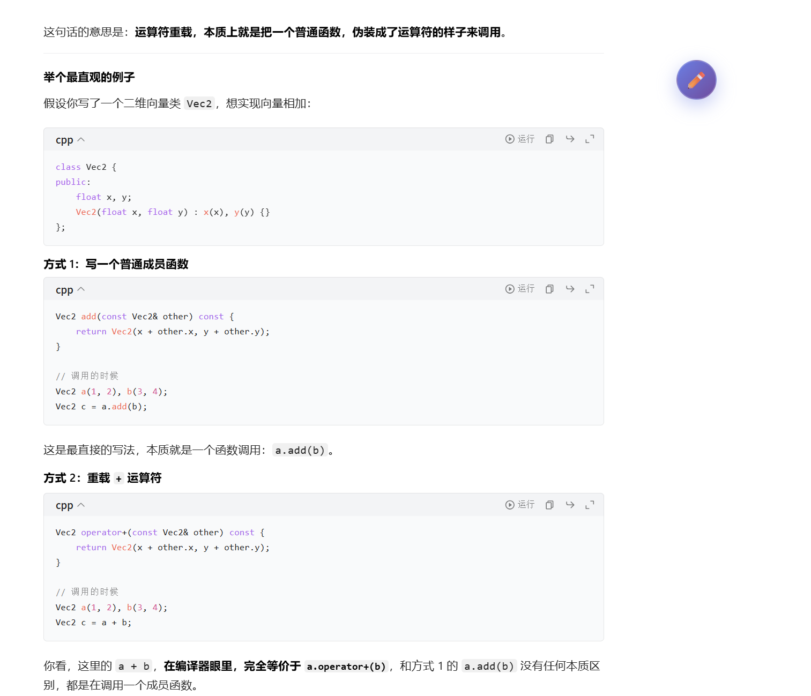
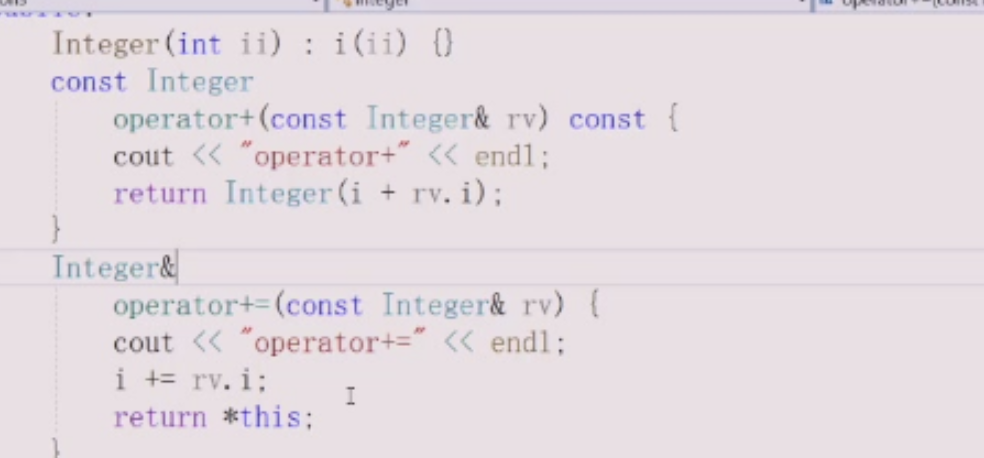
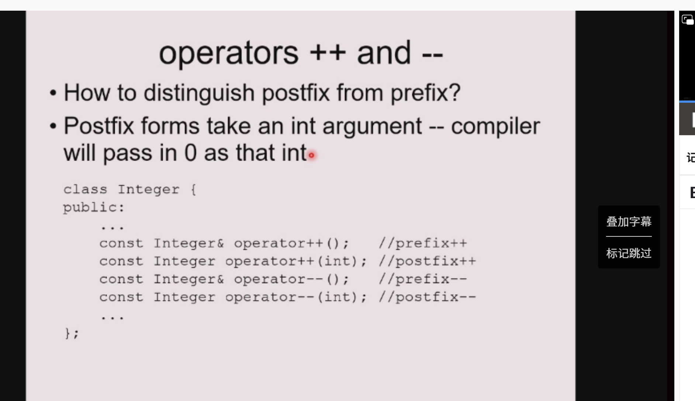
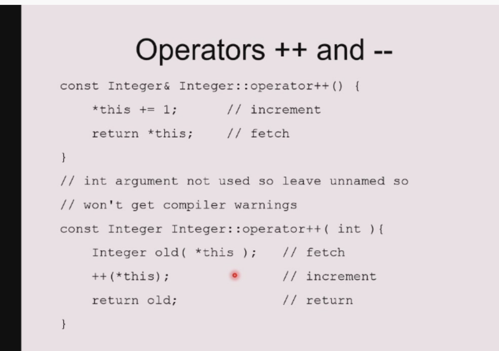
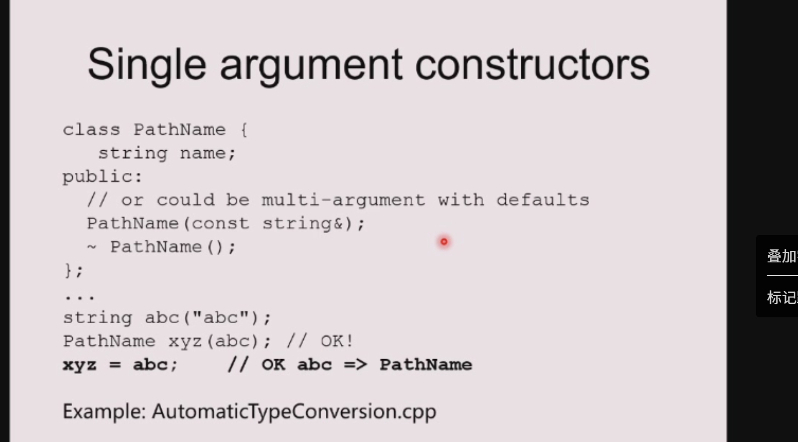
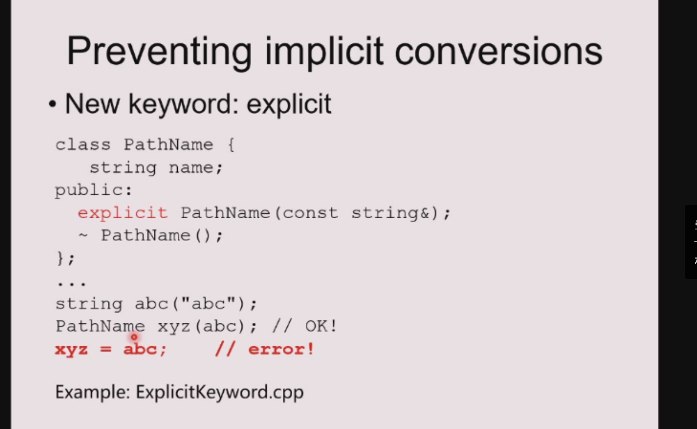

# 重载（Overload）

## 操作符重载

这组幻灯片讲的是 **C++ 运算符重载（Operator Overloading）**，我帮你按顺序拆解清楚👇

---

## 1️⃣ 第一张：运算符重载是什么？

标题：`Overloading Operators`
核心两句话：

- **`Allows user-defined types to act like built in types`**
  让你自己定义的类/结构体，也能像 `int`、`float` 这些内置类型一样，直接用 `+ - * /` 等运算符操作。
  比如你写了个 `Vector` 类，重载 `+` 之后，就能直接写 `v3 = v1 + v2`，而不是调用 `v1.add(v2)`。

- **`Another way to make a function call`**
  运算符重载本质上就是**函数调用的语法糖**。
  比如 `a + b` 其实等价于 `operator+(a, b)` 或 `a.operator+(b)`，只是写起来更自然。

---



## 2️⃣ 第二张：**不能重载的运算符**

标题：`Operators you can't overload`
这些运算符是 C++ 语法的基础，语义无法被自定义改变，所以不能重载：
| 运算符/关键字 | 原因 |
| --- | --- |
| `.` （成员访问） | 直接访问对象内存结构，无法被重定向 |
| `.*` （成员指针访问） | 同上，和内存布局强绑定 |
| `::` （作用域解析） | 属于编译期的语法元素，不是运行期可调用的运算符 |
| `?:` （三目运算符） | 唯一的三元运算符，语法结构特殊，不允许重载 |
| `sizeof` / `typeid` | 编译期/运行期类型信息工具，不能被自定义 |
| 四种 `cast` 转换 | `static_cast`/`dynamic_cast`/`const_cast`/`reinterpret_cast` 是内置转换规则，不能重载 |

---

## 3️⃣ 第三张：**可以重载的运算符**

标题：`Overloaded operators`
这里列出了所有允许重载的运算符，分为几类：

- **一元/二元算术运算符**：`+ - * / % ^ & | ~`
- **赋值与复合赋值**：`= += -= *= /= %= ^= &= |=` 等
- **关系与逻辑运算符**：`< > <= >= == != ! && ||`
- **自增/自减**：`++ --`
- **特殊运算符**：`,`（逗号）、`->*`、`->`、`()`（函数调用）、`[]`（下标）
- **内存管理运算符**：`operator new` / `operator delete` / `new[]` / `delete[]`

---

## 4️⃣ 第四张：**运算符重载的限制（Restrictions）**

标题：`Restrictions`
这是写重载运算符时必须遵守的“铁律”：

1.  **只能重载已有的运算符，不能创造新的**
    比如不能自己造一个 `**` 作为幂运算符，C++ 里没有这个原生运算符。

2.  **必须基于类或枚举类型重载**
    不能为内置类型重载（比如不能给 `int` 重新定义 `+` 的行为），必须是自定义的类/结构体/枚举。

3.  **必须保留运算符的基本属性**
    - **操作数个数不变**：比如二元的 `+` 不能改成一元运算符，三元的 `?:` 本来就不能重载。
    - **优先级不变**：重载后的 `+` 优先级还是比 `*` 低，不能自定义改变。

---

### 💡 一句话总结

运算符重载，就是给自定义类型“扩展”内置运算符的行为，让代码更直观，但必须遵守 C++ 定好的规则，不能乱改运算符的基本特性。

## **运算符重载的实现**

这组幻灯片讲的是 **C++ 运算符重载的两种实现方式：成员函数 vs 全局（友元）函数**，我帮你逐张拆解，顺便把关键区别讲透👇

---

## 第一张：运算符重载的两种实现形式

标题：`C++ overloaded operator`
核心结论：**运算符重载本质上就是一个函数，名字用 `operator` + 运算符表示**，有两种写法：

### 1. 成员函数形式

```cpp
const String String::operator+(const String& that);
```

- 它是类的成员函数，所以有一个**隐式的第一个参数 `this`**，指向调用这个运算符的对象。
- 比如 `a + b` 会被编译器翻译成 `a.operator+(b)`，`a` 就是 `this`，是隐式的。

### 2. 全局（自由）函数形式

```cpp
const String operator+(const String& r, const String& l);
```

- 它是普通的全局函数，**没有隐式的 `this` 参数**，所有参数都必须显式写出来。
- 比如 `a + b` 会被翻译成 `operator+(a, b)`，两个参数都要写清楚。

---

## 第二张：成员函数形式的特点

标题：`How to overload`
这张专门讲**成员函数版运算符重载的规则**：

- **隐式第一个参数**：就是 `this` 指针，指向调用对象。
- **接收方不做隐式类型转换**：运算符左边的对象（`this` 指向的那个），不会被隐式转换。
- **必须访问类定义**：因为成员函数要访问类的私有成员，必须知道类的完整定义。

---

## 第三张：成员函数形式的例子与坑

标题：`Member Functions`
用 `Integer` 类的 `+` 运算符举例：

```cpp
Integer x(1), y(5), z;
x + y;  // 等价于 x.operator+(y); ✅ 完全合法
```

这里的关键坑点：

- `z = x + 3;` ✅ 合法：`3` 会被隐式转换成 `Integer(3)`，再调用 `x.operator+(Integer(3))`。
- `z = 3 + y;` ❌ 非法：因为成员函数形式下，运算符左边的 `3` 不会被隐式转换成 `Integer`，编译器找不到 `3.operator+(y)` 这个函数。

---

## 第四张：成员函数版 `+` 运算符的完整代码

标题：`Operators as member functions`
这里给了 `Integer` 类的完整实现，帮你把前面的例子落地：

```cpp
class Integer {
public:
    Integer(int n = 0) : i(n) {}
    // 成员函数形式的 operator+
    const Integer operator+(const Integer& n) const {
        return Integer(i + n.i);
    }
private:
    int i;
};
```

- 这个实现里，`operator+` 是成员函数，能直接访问私有成员 `i`。
- 但它的问题就是刚才说的：`3 + y` 会编译失败。

---

### 💡 关键对比总结

| 特性 | 成员函数形式 | 全局（友元）函数形式 |
| :--- | :--- | :--- |
| 隐式 `this` 参数 | 有，作为第一个参数 | 无，所有参数显式 |
| 左右操作数隐式转换 | 仅右操作数可转换 | 左右都可转换 |
| 访问私有成员 | 直接访问 | 需声明为友元 |
| 适用场景 | 单目运算符、复合赋值运算符（`+=` 等） | 双目运算符（如 `+`、`-`、`==`），尤其是需要左右操作数都能转换的场景 |



好好审视这个代码 注意他的引用加的很妙（否则返回的是复制临时对象），还有这个*this 还有一个const。都是涉及很根本的东西（临时对象这种）

## 再讲一下

这组幻灯片讲的是 **C++ 运算符重载的两种实现方式：成员函数 vs 全局（友元）函数**，我帮你把核心区别和细节讲透👇

---

## 一、成员函数形式（幻灯片1-2）

### 核心特点

1.  **隐式第一个参数**：`this` 指针，指向调用运算符的对象。
    - 比如 `a + b` 会被翻译成 `a.operator+(b)`，`a` 就是隐式的 `this`。
2.  **左操作数不能隐式转换**：运算符左边的对象（`this` 指向的），不会被隐式类型转换。
    - 所以 `3 + y` 这种写法会报错，因为 `3` 不是 `Integer` 对象，无法调用成员函数。
3.  **必须访问类定义**：成员函数要访问私有成员，必须知道类的完整定义。

### 二元/一元运算符的写法

- **二元运算符（如 `+`）**：需要 1 个显式参数（右操作数），比如 `operator+(const Integer& n)`。
- **一元运算符（如 `-`）**：不需要显式参数，比如 `operator-()`，直接操作 `this` 指向的对象。

---

## 二、全局（友元）函数形式（幻灯片3-5）

### 核心特点

1.  **所有参数显式**：没有隐式的 `this` 指针，所有操作数都要作为参数传入。
    - 比如 `a + b` 会被翻译成 `operator+(a, b)`，两个参数都要写出来。
2.  **左右操作数都能隐式转换**：两边的参数都可以被隐式转换，所以 `3 + y` 这种写法也能正常工作。
3.  **可以声明为友元**：如果需要访问类的私有成员，可以把全局函数声明为类的 `friend`，这样就能直接访问私有变量了。

### 完整示例（友元全局函数）

```cpp
class Integer {
    // 声明为友元，允许访问私有成员
    friend const Integer operator+(const Integer& lhs, const Integer& rhs);
    // ...
private:
    int i;
};

// 全局函数实现
const Integer operator+(const Integer& lhs, const Integer& rhs) {
    return Integer(lhs.i + rhs.i);
}
```

---

## 三、两种方式的关键对比

| 特性 | 成员函数形式 | 全局（友元）函数形式 |
| :--- | :--- | :--- |
| 隐式 `this` 参数 | 有，作为第一个参数 | 无，所有参数显式 |
| 左右操作数隐式转换 | 仅右操作数可转换 | 左右都可转换 |
| 访问私有成员 | 直接访问 | 需声明为友元 |
| 适用场景 | 单目运算符、复合赋值运算符（`+=` 等） | 双目运算符（如 `+`、`-`、`==`），尤其是需要左右操作数都能转换的场景 |

---

## 四、最关键的一句话

- **成员函数**：运算符左边必须是类的对象，不支持 `int + 类` 这种写法。
- **全局友元函数**：运算符两边都可以隐式转换，支持 `int + 类` 和 `类 + int` 两种写法。

注意这里的const说的是临时变量不能被修改（也就是为了防止算式被赋值） 不影响c=a+b后续 c的修改

## 一些注意

我帮你把这三张幻灯片的核心规则拆解得明明白白，全是运算符重载的“最佳实践”，背下来写代码就不会踩坑👇

---

## 第一张：全局运算符（Global Operators）

讲的是**全局（友元）运算符重载的核心特点**：

1.  **参数数量规则**
    - 二元运算符（`+`/`-`/`==` 等）：必须要**两个参数**（左右操作数都要显式传入）
    - 一元运算符（如 `!`/`-` 等）：必须要**一个参数**（操作数作为参数传入）
2.  **隐式转换支持**
    这也是全局函数的最大优势：左右两边的参数都能被隐式转换。
    比如你有 `Integer x, y`：

    ```cpp
    z = x + y;   // 正常调用 operator+(x, y)
    z = x + 3;   // 3 被隐式转成 Integer(3)，调用 operator+(x, Integer(3))
    z = 3 + y;   // 3 被隐式转成 Integer(3)，调用 operator+(Integer(3), y)
    ```

    这是成员函数做不到的（成员函数只能右操作数转换）。

3.  **访问私有成员的限制**
    全局函数默认不能访问类的私有成员，解决办法有两个：

    - 把函数声明为 `friend` 友元
    - 只能通过类的公共接口（如 `get()` 方法）来访问私有数据

---

## 第二张：成员函数 vs 自由函数（Tips）

这是**运算符重载的“黄金选择规则”**，直接告诉你什么时候用成员函数，什么时候用全局函数：
| 运算符类型 | 推荐实现方式 | 原因 |
| :--- | :--- | :--- |
| 一元运算符（如 `-`/`!`/`++` 等） | 成员函数 | 语法自然，直接操作 `this` |
| 必须是成员的运算符 | 成员函数 | C++ 强制规定，只能用成员函数实现：`=`、`()`、`[]`、`->`、`->*` |
| 赋值/复合赋值运算符（`=`/`+=`/`-=` 等） | 成员函数 | 直接修改 `this` 指向的对象，语义清晰 |
| 其他二元运算符（`+`/`-`/`==`/`!=` 等） | 非成员（全局/友元）函数 | 支持左右操作数的隐式转换，写法更通用 |

---

## 第三张：参数传递（Argument Passing）

讲的是**运算符重载里参数传递的最佳实践**，全是性能和安全性的关键：

1.  **只读参数：用 `const &` 传递**
    对于不会被修改的参数（比如 `operator+` 的两个操作数），优先用 `const 引用` 传递：

    - 避免对象拷贝，性能更高
    - `const` 保证不会意外修改传入的参数
    - 例外：内置类型（`int`/`double` 等）直接传值即可，没必要用引用
2.  **不修改对象的成员函数：加 `const` 修饰**
    像 `+`/`-`/`==` 这些不会修改对象的运算符，一定要在函数末尾加 `const`：

    ```cpp
    const Integer operator+(const Integer& n) const;
    ```

    这样可以支持 `const` 对象调用，也能防止你不小心修改了对象本身。

3.  **会修改左操作数的运算符：用非 const 引用传递**
    比如 `+=`/`-=` 这类赋值运算符，会直接修改左操作数，所以：

    - 成员函数版：不需要额外参数，直接修改 `this`
    - 全局函数版：左操作数要用**非 const 引用**传递，允许被修改

---

## 一句话总结核心要点

1.  想支持 `3 + y` 这种写法，就用全局友元函数实现二元运算符；
2.  `=`/`()`/`[]` 这些运算符必须用成员函数实现；
3.  只读参数用 `const &`，不修改对象的成员函数加 `const`，这是运算符重载的“安全规范”。

## 一些注意事项

我帮你把这两张幻灯片的核心规则讲透，这是运算符重载的**返回值与原型设计标准模板**👇

---

## 第一张：返回值设计原则（Return Values）

这张幻灯片讲的是：**运算符的返回类型，必须和运算符本身的语义匹配**，核心是两个关键例子：

1.  **算术运算符（如 `+`/`-`/`*` 等）**
    - 语义：它们是**非修改性运算**，不改变操作数，而是生成一个**全新的临时对象**。
    - 最佳实践：返回 `const T`（const 对象），而不是普通对象。
    - 目的：禁止对运算结果（临时对象）做修改，比如 `(a + b) = c`、`(a + b) += c` 这种无意义的代码，编译器会直接报错，从语法层面避免 bug。

2.  **逻辑/比较运算符（如 `&&`/`||`/`==`/`<` 等）**
    - 语义：它们的结果只有“真/假”两种状态。
    - 最佳实践：返回 `bool` 类型（老式编译器也可以用 `int`，但现代 C++ 优先用 `bool`），直接表达运算的逻辑结果。

---

## 第二张：运算符重载的标准原型（The prototypes of operators）

这张是**通用模板**，直接告诉你不同类型运算符的标准写法，以后照着抄就不会错：

1.  **算术/位运算符（`+`/`-`/`*`/`/`/`%`/`^`/`&`/`|`/`~` 等）**
    - 原型：`const T operatorX(const T& l, const T& r) const;`
    - 拆解：
      - `const T`：返回 `const` 对象，防止修改临时结果。
      - `const T& l, const T& r`：两个操作数都用 `const 引用`传递，既避免拷贝，又保证不会修改操作数。
      - 末尾的 `const`：表示这是一个不修改对象的常量成员函数（如果是全局友元函数则不需要）。

2.  **逻辑/比较运算符（`!=`/`&&`/`||`/`<`/`<=`/`==`/`>=`/`>` 等）**
    - 原型：`bool operatorX(const T& l, const T& r) const;`
    - 拆解：
      - `bool`：直接返回布尔值，符合逻辑运算的语义。
      - 同样用 `const 引用`传递参数，保证安全和效率。

---

## 一句话总结核心要点

- 算术运算符返回 `const 对象`，是为了禁止修改临时结果；
- 逻辑/比较运算符返回 `bool`，是为了表达“真/假”的语义；
- 所有不修改操作数的运算符，参数都用 `const 引用`传递，成员函数末尾加 `const`，这是运算符重载的“安全+性能双优”写法。





## bool

这两张幻灯片讲的是 **C++ 关系运算符重载的最佳实践**，核心思想是**避免重复代码，用一个基础实现派生所有其他关系运算符**，我帮你拆解清楚👇

---

## 核心原则：用最少的基础实现派生所有运算符

关系运算符（`==`/`!=`/`<`/`>`/`<=`/`>=`）之间是存在逻辑关联的，所以我们不需要每个都写一遍底层比较，只需要实现**两个最基础的运算符**，其他的都可以基于它们派生：

1.  用 `==` 实现 `!=`
2.  用 `<` 实现 `>`、`<=`、`>=`

---

## 1. `==` 和 `!=` 的实现

### ① 基础实现：`operator==`

它是所有相等比较的基础，需要直接写底层逻辑：

```cpp
bool Integer::operator==(const Integer& rhs) const {
    return i == rhs.i; // 直接比较私有成员 i
}
```

### ② 派生实现：`operator!=`

不需要再写一遍 `return i != rhs.i;`，直接复用 `==` 的结果取反即可：

```cpp
bool Integer::operator!=(const Integer& rhs) const {
    return !(*this == rhs); // 复用 == 的实现
}
```

这样做的好处是：

- 减少重复代码，避免维护两份逻辑相同的代码
- 如果未来修改了 `==` 的实现（比如增加额外的比较条件），`!=` 会自动同步更新

---

## 2. `<` 派生其他比较运算符

同样的思路，我们只需要实现 `operator<` 这一个基础比较，其他的都可以通过逻辑推导实现：

| 运算符 | 派生逻辑 | 实现示例 |
| :--- | :--- | :--- |
| `>` | `lhs > rhs` 等价于 `rhs < lhs` | `return rhs < *this;` |
| `<=` | `lhs <= rhs` 等价于 `!(rhs < lhs)` | `return !(rhs < *this);` |
| `>=` | `lhs >= rhs` 等价于 `!(lhs < rhs)` | `return !(*this < rhs);` |

### 基础实现：`operator<`

```cpp
bool Integer::operator<(const Integer& rhs) const {
    return i < rhs.i; // 直接比较私有成员 i
}
```

---

## 3. 为什么所有函数都加了 `const`？

注意到所有函数的参数和函数本身都加了 `const`，这是关系运算符重载的标准规范：

- 参数 `const Integer& rhs`：保证比较过程中不会修改右操作数
- 函数末尾的 `const`：保证比较过程中不会修改左操作数（也就是 `*this`）
- 返回值是 `bool`：直接表达比较的“真/假”结果，符合关系运算符的语义

---

## 一句话总结核心思想

**关系运算符重载，只需要写两个基础实现（`==` 和 `<`），其他的全部通过逻辑派生，既减少重复代码，又保证逻辑一致性。**

---

## ++--

这张幻灯片讲的是 **C++ 中 `++`/`--` 自增/自减运算符的重载规则**，核心是**如何区分前缀和后缀版本**，我帮你拆解得明明白白👇

---

## 1. 核心问题：怎么区分前缀 `++i` 和后缀 `i++`？

C++ 规定了一个特殊的语法规则，用**参数列表**来区分：

- **前缀 `++i`**：运算符重载函数**不带参数**
- **后缀 `i++`**：运算符重载函数**必须带一个 `int` 类型的哑参数**（dummy parameter）

编译器在遇到 `i++` 时，会自动给这个 `int` 参数传入 `0`，我们不需要手动传值。

---

## 2. 看这张图里的标准写法

```cpp
class Integer {
public:
    // 前缀 ++i
    const Integer& operator++();

    // 后缀 i++
    const Integer operator++(int);

    // 前缀 --i
    const Integer& operator--();

    // 后缀 i--
    const Integer operator--(int);
};
```

### ① 前缀 `++i`/`--i`

- 函数：`operator++()` / `operator--()`（无参数）
- 语义：先自增/自减，再返回修改后的对象本身。
- 返回值：`const Integer&`（返回当前对象的引用，支持链式调用，且返回值是 const，防止修改临时结果）。
- 实现逻辑：

  ```cpp
  const Integer& operator++() {
      ++i;          // 先修改自己
      return *this; // 返回修改后的自己
  }
  ```

### ② 后缀 `i++`/`i--`

- 函数：`operator++(int)` / `operator--(int)`（带一个 `int` 哑参数）
- 语义：先返回旧值，再自增/自减。
- 返回值：`const Integer`（返回一个临时对象，保存修改前的值，所以是按值返回）。
- 实现逻辑：

  ```cpp
  const Integer operator++(int) {
      Integer old = *this; // 保存旧值
      ++(*this);           // 再修改自己（复用前缀++的逻辑）
      return old;          // 返回旧值的临时对象
  }
  ```

---

## 3. 关键区别总结

| 版本 | 函数签名 | 语义 | 返回值类型 |
| :--- | :--- | :--- | :--- |
| 前缀 `++i` | `operator++()` | 先修改，再返回自身 | `const 引用` |
| 后缀 `i++` | `operator++(int)` | 先返回旧值，再修改 | `const 值` |

---

## 一句话记住核心规则

**后缀版本必须多一个 `int` 参数，用来和前缀版本区分；前缀返回引用，后缀返回值。**

我帮你把这三张幻灯片的核心内容，拆成三个关键知识点，讲得明明白白👇

---

## 一、`operator[]` 下标运算符重载

这张讲的是 `[]` 运算符的重载规则，是实现数组/容器类的核心：

1.  **必须是成员函数**：C++ 强制规定，`[]` 运算符只能用成员函数实现，不能用全局/友元函数。
2.  **只需要一个参数**：这个参数就是下标值（索引），比如 `v[10]` 里的 `10`。
3.  **应该返回引用**：为了让对象像数组一样支持读写操作（`v[10] = 45`），`operator[]` 必须返回元素的引用。
    - 如果返回指针，你就得写 `*v[10] = 45`，和原生数组的语法不一致，用起来很别扭。
    - 如果返回值（不是引用），`v[10] = 45` 会变成修改临时对象，不会真正改变容器里的元素。

标准写法（非 const 版本，支持读写）：

```cpp
int& operator[](int index) {
    return data[index]; // 返回元素的引用
}
```

通常还会写一个 const 版本，用于只读访问：

```cpp
const int& operator[](int index) const {
    return data[index];
}
```

---

## []和=

## 二、拷贝 vs 初始化（Copying vs. Initialization）

这张讲的是 C++ 里**对象初始化和赋值的区别**，是很多初学者容易混淆的点：

```cpp
MyType b;           // 1. 定义并默认初始化 b
MyType a = b;       // 2. 用 b 初始化 a（拷贝构造）
a = b;              // 3. 把 b 赋值给 a（拷贝赋值）
```

1.  **`MyType a = b;`**：这是**初始化**，调用的是**拷贝构造函数**，创建一个新对象 `a`，用 `b` 的数据初始化它。
2.  **`a = b;`**：这是**赋值**，调用的是**拷贝赋值运算符 `operator=`**，把 `b` 的数据拷贝到已经存在的 `a` 里。
两者的本质区别：一个是“创建新对象”，一个是“修改已存在的对象”。

---

## 三、自动生成的 `operator=` 赋值运算符

这张讲的是 C++ 编译器的自动生成规则：

1.  **编译器会自动生成默认的 `operator=`**：如果你没有手动写拷贝赋值运算符，编译器会自动生成一个默认版本。
2.  **默认行为是“成员逐个拷贝”（Memberwise assignment）**：默认的 `operator=` 会把源对象的每个成员变量，依次赋值给目标对象的对应成员变量。
3.  **陷阱：浅拷贝问题**：如果类里有指针/动态内存，默认的 `operator=` 只会拷贝指针地址，导致多个对象共享同一块内存，最后析构时会重复释放，引发崩溃。这种情况下，你必须手动实现深拷贝版本的 `operator=`。

---

## 一句话总结核心要点

1.  `operator[]` 必须返回引用，才能支持 `v[10] = 45` 这种读写操作；
2.  `MyType a = b;` 是初始化（拷贝构造），`a = b;` 是赋值（拷贝赋值）；
3.  默认的 `operator=` 会做成员逐个拷贝，但有动态内存时必须手动实现深拷贝。

这三张幻灯片讲的是 C++ 中**自定义输入/输出流运算符（`>>`/`<<`）**和**流操纵器（Manipulators）**的标准实现方式，我给你拆解得明明白白👇

---

## 流操作符

## 一、流提取运算符 `>>`（stream extractor）

这张讲的是自定义 `operator>>`，用来让 `cin` 读取你的自定义类型（比如你自己写的 `Integer`/`Vector` 类）。

### 核心规则：

1.  **必须是全局/友元函数**：
    因为 `cin >> obj` 等价于 `operator>>(cin, obj)`，左操作数是 `istream`，不能作为成员函数的 `this` 指针，所以必须用自由函数实现。

2.  **参数固定格式**：
    - 第一个参数：`istream&`（输入流对象，比如 `cin`）
    - 第二个参数：你的自定义类型的引用（必须是引用，因为要修改对象的值）
3.  **返回 `istream&` 以支持链式调用**：
    `cin >> a >> b >> c` 等价于 `((cin >> a) >> b) >> c`，只有返回 `istream&`，才能让连续的 `>>` 操作成立。

### 示例代码：

```cpp
istream& operator>>(istream& is, Integer& obj) {
    int temp;
    is >> temp;       // 从流中读取整数
    obj = Integer(temp); // 赋值给 obj
    return is;
}
```

---

## 二、流插入运算符 `<<`（stream inserter）

这张讲的是自定义 `operator<<`，用来让 `cout` 输出你的自定义类型。

### 核心规则：

1.  **同样必须是全局/友元函数**：
    `cout << obj` 等价于 `operator<<(cout, obj)`，左操作数是 `ostream`，不能作为成员函数实现。

2.  **参数固定格式**：
    - 第一个参数：`ostream&`（输出流对象，比如 `cout`）
    - 第二个参数：你的自定义类型的 `const` 引用（不需要修改对象，用 `const` 保证只读）
3.  **返回 `ostream&` 以支持链式调用**：
    `cout << a << b << c` 等价于 `((cout << a) << b) << c`，返回流引用才能让链式调用成立。

### 示例代码：

```cpp
ostream& operator<<(ostream& os, const Integer& obj) {
    os << obj.getValue(); // 调用公共接口输出值
    return os;
}
```

---

## 三、自定义流操纵器（Manipulators）

这张讲的是如何自定义像 `endl`、`setw` 一样的流操纵器，用来在输出中插入格式控制（比如制表符、换行）。

### 核心规则：

1.  **函数签名固定**：
    流操纵器是一个函数，接收 `ostream&` 作为参数，并返回 `ostream&`：

    ```cpp
    ostream& manipulator(ostream& out);
    ```

2.  **实现示例：自定义 `tab` 操纵器**
    这个函数会在流中插入一个制表符 `\t`：

    ```cpp
    ostream& tab(ostream& out) {
        return out << '\t';
    }
    ```

3.  **使用方式**：
    直接把操纵器放在 `<<` 链中，就像 `endl` 一样：

    ```cpp
    cout << "Hello" << tab << "World!" << endl;
    // 输出：Hello    World!（中间有一个制表符）
    ```

---

## 一句话总结核心要点

1.  `>>` 和 `<<` 运算符必须用全局/友元函数实现，参数和返回值都必须是流引用，才能支持链式调用；
2.  流操纵器是接收并返回 `ostream&` 的函数，可以自定义输出格式。

---

## 自定义转换

这两张幻灯片讲的是 C++ 里**值类（Value classes）**和**用户自定义类型转换**的概念，我帮你拆解得明明白白👇

---

## 一、Value classes（值类）

值类就是那些行为像 `int`、`double` 等原生基本类型的自定义类，幻灯片列出了它的几个核心特征：

1.  **看起来像基本数据类型**
    你可以像用 `int` 一样用它，比如 `Integer a = 5;`，语法上和原生类型没区别。

2.  **可以作为函数的参数和返回值传递**
    就像 `int` 一样，值类对象可以被拷贝、传递给函数，也可以作为函数的返回值返回。

3.  **通常会重载运算符**
    为了让它用起来更像原生类型，值类一般会重载 `+`/`-`/`==`/`[]` 等运算符，比如 `a + b`、`a > b` 都能正常工作。

4.  **支持和其他类型的相互转换**
    可以定义转换规则，让值类对象能和 `int`、`double` 等类型互相转换，比如 `Integer(5)` 可以隐式转换成 `int`，`int` 也可以转换成 `Integer`。

最典型的例子就是你一直在看的 `Integer` 类，它完全符合值类的所有特征。

---

## 二、用户自定义类型转换（User-defined Type conversions）

这张讲的是如何让你的自定义类支持和其他类型（包括内置类型和其他自定义类）的转换，编译器会通过两种方式自动执行隐式转换：

1.  **单参数构造函数（Single-argument constructors）**
    如果你的类有一个只接收一个参数的构造函数，编译器就会用它来做隐式转换。
    比如：

    ```cpp
    class Integer {
    public:
        Integer(int x); // 单参数构造函数
    };

    Integer a = 5; // 编译器会自动用 Integer(5) 把 int 转换成 Integer
    ```

2.  **隐式类型转换运算符（implicit type conversion operators）**
    你也可以重载类型转换运算符，让自定义类对象能转换成其他类型：

    ```cpp
    class Integer {
    public:
        operator int() const; // 转换成 int 的运算符
    };

    Integer a(5);
    int b = a; // 编译器会自动调用 operator int() 把 Integer 转换成 int
    ```

这两种方式都能让你的自定义类像原生类型一样，和其他类型无缝配合使用。

---

## 一句话总结核心要点

- 值类就是行为像 `int` 等原生类型的自定义类，支持运算符重载和类型转换；
- 编译器会通过单参数构造函数和类型转换运算符，自动完成自定义类和其他类型的隐式转换。

---

要不要我给你写一个完整的 `Integer` 类示例，包含单参数构造函数和类型转换运算符，你可以直接复制运行，看看隐式转换的效果？

## 隐式转换





这四张幻灯片，完整地讲了 C++ 中**用户自定义类型转换**的实现方式、语法规则、风险，以及最佳实践。我给你拆解得明明白白👇

---

## 用户自定义类型转换

## 一、类型转换运算符（Conversion operations）

第一张幻灯片讲的是**从自定义类到其他类型的转换**，用 `operator T()` 实现：

### 核心规则：

- 函数签名格式：`operator T() const;`（T 是目标类型，比如 `double`、`int`）
- 没有返回类型，函数名就是目标类型名
- 编译器会自动调用这个函数，完成隐式转换

### 示例：`Rational` 转 `double`

```cpp
class Rational {
    int numerator_, denominator_;
public:
    operator double() const {
        return numerator_ / (double)denominator_;
    }
};

// 使用时自动触发转换
Rational r(1, 3);
double d = 1.3 * r; // r 会被自动转成 double（0.333...）
```

---

## 二、转换运算符的通用形式

第二张幻灯片总结了转换运算符的通用语法：

```cpp
X::operator T()
```

- `X`：你的自定义类
- `T`：要转换成的目标类型（可以是内置类型或其他类）
- 特点：**没有参数、没有返回类型**，函数名就是目标类型名
- 作用：告诉编译器，`X` 类型的对象可以隐式转换成 `T` 类型

---

## 三、C++ 中的类型转换体系

第三张幻灯片梳理了 C++ 中所有类型转换的来源：

1.  **内置类型转换**
    - 数值类型自动提升：`char → short → int → float → double`
    - 引用/指针转换：`T → T&`、`T[] → T*`、`T* → void*` 等
2.  **用户自定义转换**
    - 单参数构造函数：实现 `T → C` 的转换（比如 `string → PathName`）
    - 转换运算符：实现 `C → T` 的转换（比如 `Rational → double`）
3.  **风险点：二义性**
    如果同时存在多种转换路径，编译器会不知道选哪个，导致编译错误（幻灯片提到的 `TypeConversionAmbiguity.cpp` 就是这个问题的示例）。

---

## 四、最佳实践：不推荐隐式转换

第四张幻灯片给出了一个非常重要的建议：**一般情况下，不推荐使用隐式类型转换**。

### 为什么不推荐？

隐式转换会导致意外行为，比如：

- 函数调用时，参数被自动转换成你不想要的类型，导致逻辑错误
- 转换路径过多，引发二义性问题，难以调试

### 推荐做法：显式成员函数

代替隐式转换运算符，写一个显式的成员函数，比如：

```cpp
class Rational {
public:
    double toDouble() const; // 显式调用
};

// 使用时必须手动调用，不会有意外转换
double d = 1.3 * r.toDouble();
```

这样既实现了转换功能，又避免了隐式转换带来的意外问题。

---

## 一句话总结核心要点

1.  转换运算符 `operator T()` 可以让自定义类隐式转换成其他类型；
2.  它和单参数构造函数一起，构成了用户自定义类型转换的两种方式；
3.  隐式转换容易引发意外行为和二义性，更推荐用显式成员函数实现转换。

## c++带的类型转换

我给你把这 4 个 C++ 标准转换运算符，按你的PPT顺序，讲得明明白白，包括它们的**作用、用法、坑点和区别**👇

---

## 一、先总述：为什么要这 4 个转换？

C++ 为了替代 C 语言那种「粗暴又模糊」的 `(type)value` 强制转换，设计了这 4 个**意图明确、各司其职**的转换运算符：
| 转换运算符 | 核心作用 | 安全程度 |
| :--- | :--- | :--- |
| `static_cast` | 安全的、有意义的类型转换（隐式转换的显式版） | 编译期检查，无运行时检查 |
| `dynamic_cast` | 多态类指针/引用的安全向下转换 | 运行时检查，安全 |
| `const_cast` | 增删 `const`/`volatile` 属性 | 仅修改属性，不改变类型 |
| `reinterpret_cast` | 底层二进制位重解释（指针↔整数、跨类型指针） | 无任何检查，极不安全 |

---

## 二、逐个拆解你的PPT内容

### 1. `static_cast`：「合法转换」的显式版本

它是**最常用、最通用**的转换，用来做编译器认可的、有意义的转换，本质是把隐式能做的转换，用显式写出来，更清晰。

#### ① 普通类型转换（你的PPT第二张）

它支持：

- 基础类型转换（`char`↔`int`、`int`↔`double`）
- `void*` ↔ 具体指针（比如 `double*` → `void*`）
- 给变量添加 `const` 属性（比如 `int` → `const int`）

**但它有两个死规矩：**

- ❌ 不能去掉 `const` 属性（比如 `const int*` → `int*`，会直接报错）
- ❌ 不能做完全不相关的类型转换（比如 `int*` → `double*`）

对应你PPT里的例子：

```cpp
char a = 'a';
int b = static_cast<int>(a); // ✅ 合法：char转int的显式写法

double *c = new double;
void *d = static_cast<void*>(c); // ✅ 合法：具体指针转void*

int e = 10;
const int f = static_cast<const int>(e); // ✅ 合法：加const

const int g = 20;
int *h = static_cast<int*>(&g); // ❌ 错误：static_cast不能去掉const
```

#### ② 类指针转换（你的PPT第三张）

`static_cast` 支持父类/子类指针的转换，但**向下转换（父类→子类）是不安全的**：

- 编译器只会根据「静态类型」做转换，**不做运行时检查**
- 如果父类指针实际指向的不是子类对象，运行时会直接崩溃

```cpp
class A { public: virtual void test() {} };
class B : public A { public: virtual void test() {} };

A *pA1 = new B(); // 父类指针指向子类对象
B *pB = static_cast<B*>(pA1); // 语法合法，但不安全！
```

⚠️ 坑点：哪怕 `pA1` 实际指向的是 `A` 对象，`static_cast` 也会强行转成 `B*`，运行时调用子类方法会直接炸。

---

### 2. `dynamic_cast`：多态类的「安全向下转换」

它是专门为**多态类（带虚函数的类）**设计的，核心就是解决 `static_cast` 向下转换不安全的问题：

- 会在**运行时检查指针实际指向的对象类型**
- 如果转换合法，返回正确的指针；如果不合法，返回 `NULL`（指针）或抛出异常（引用）

对应你PPT里的例子：

```cpp
class A { public: virtual void test() {} };
class B : public A { public: virtual void test() {} };
class C { public: virtual void test() {} };

A *pA1 = new B();
B *pB = dynamic_cast<B*>(pA1); // ✅ 安全：实际类型就是B，返回有效指针
C *pC = dynamic_cast<C*>(pA1); // ❌ 不合法：A和C无继承关系，返回NULL
```

⚠️ 必须满足的条件：

1. 类必须有虚函数（依赖RTTI运行时类型信息）
2. 只能转换指针或引用，不能转普通类型

---

### 3. `reinterpret_cast`：「裸二进制重解释」（极不安全）

它是最底层的转换，**完全不管类型是否合法，直接把二进制位按新类型重新解释**，只在极端底层场景用（比如操作系统、驱动开发）。

#### 你的PPT里的例子：

```cpp
int a, b;
int *pA = &b;
a = reinterpret_cast<int>(pA); // ✅ 合法：把指针地址当成整数存起来
pA = reinterpret_cast<int*>(a); // ✅ 合法：再把整数转回指针

b = reinterpret_cast<int>(a); // ❌ 错误：不能做int→int的普通转换
```

⚠️ 注意：它只能做两种转换：

- 指针 ↔ 整数（比如把地址存成 `uintptr_t`）
- 不相关类型的指针之间转换（比如 `int*` → `float*`，但会直接按原二进制解释，结果完全不可控）

---

### 4. `const_cast`：唯一能修改 `const` 属性的转换

它的**唯一作用**就是给变量添加或去掉 `const`/`volatile` 属性，不能做任何其他类型转换，专门解决 `static_cast` 不能去 `const` 的问题。

#### 你的PPT里的例子：

```cpp
const int g = 20;
int *h = const_cast<int*>(&g); // ✅ 合法：去掉const，转成非const指针
int &h = const_cast<int&>(g);  // ✅ 合法：去掉const引用

const char *g = "hello";
char *h = const_cast<char*>(g); // ✅ 合法：去掉const
```

⚠️ 致命坑点：

- 用 `const_cast` 去掉 `const` 后，**修改原本是 `const` 的变量，属于未定义行为（UB）**，结果完全不可预测！
- 它的正确用法通常是：给非 `const` 变量临时加 `const`，或者修改「本就不是 `const`，只是被const引用包装了」的变量。

---

## 三、关键区别对比（一张表搞定）

| 转换运算符 | 核心场景 | 类型检查 | 能否改`const` | 典型错误用法 |
| :--- | :--- | :--- | :--- | :--- |
| `static_cast` | 基础类型转换、void*转具体指针 | 编译期 | ❌ | 用它去掉const、做跨类型指针转换 |
| `dynamic_cast` | 多态类向下转换 | 运行时 | ❌ | 转非多态类、转普通变量 |
| `const_cast` | 增删const/volatile属性 | 无 | ✅ | 用它做类型转换（比如int→double） |
| `reinterpret_cast` | 指针↔整数、底层地址操作 | 无 | ❌ | 用它做普通业务逻辑转换 |

---

## 四、一句话总结你的PPT

这组PPT讲的就是C++的4种**专用转换运算符**，它们替代了C风格的强制转换，让你的代码意图更清晰、错误更容易被编译器发现：

- 想做普通合法转换 → `static_cast`
- 多态类向下转要安全 → `dynamic_cast`
- 要改const属性 → `const_cast`
- 底层裸指针操作 → `reinterpret_cast`（平时别用）
