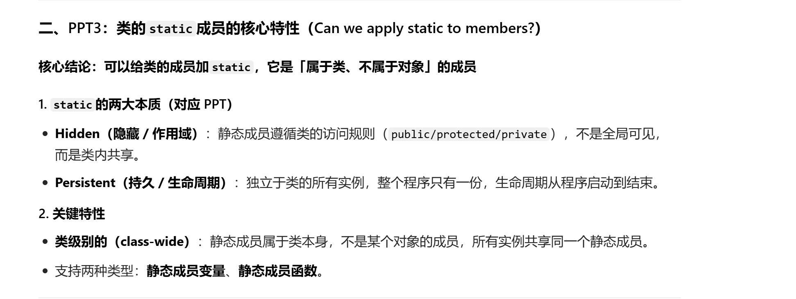
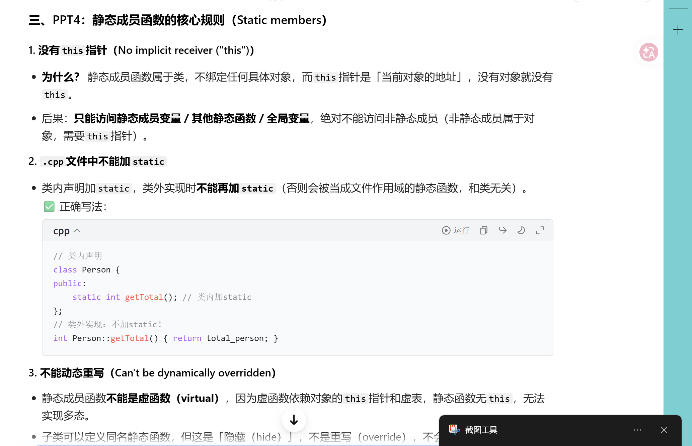
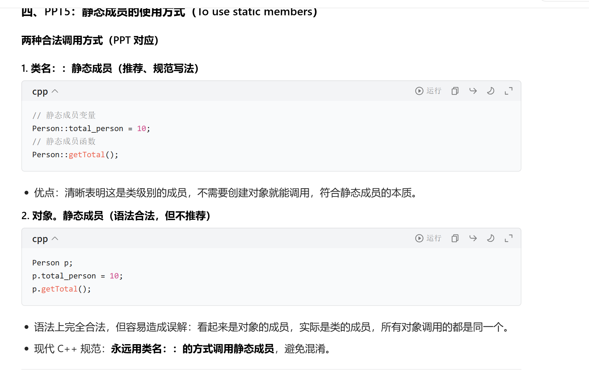
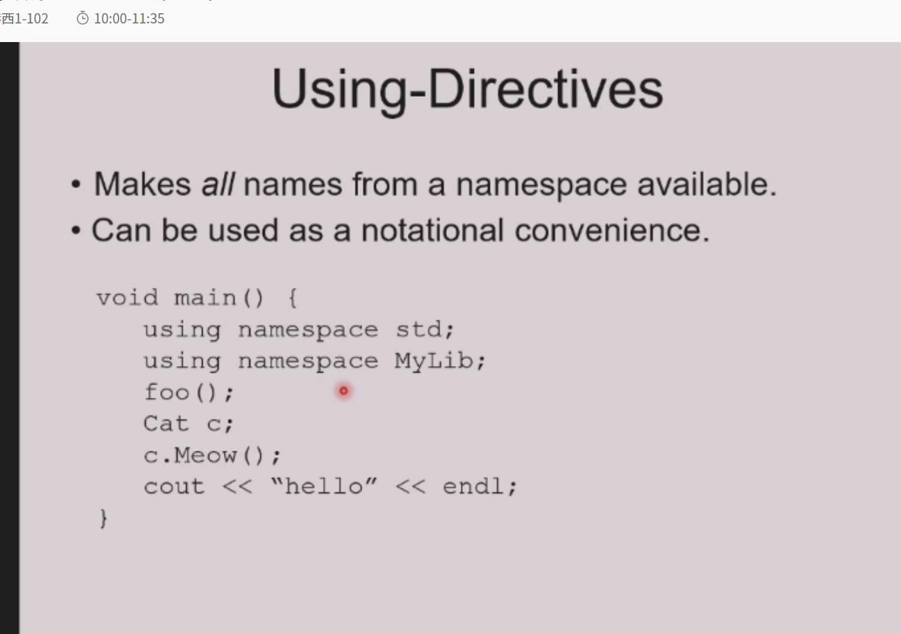

# static 关键字

## `static`的两大核心本质

### 1. 本质1：静态存储（Static storage / Persistent storage）

- **含义**：内存**只分配一次**，地址固定，生命周期从**程序启动到程序结束**，不会随函数/代码块的执行结束而销毁。
- 对应特性：变量的值会「持久保留」，不会被重复初始化，也不会随栈帧销毁而丢失。

### 2. 本质2：名字的可见性（Visibility of a name）→ 内部链接（Internal linkage）

- **含义**：这个变量/函数的名字，**仅在当前编译单元（.cpp源文件）内可见**，其他.cpp文件无法访问，相当于把作用域限制在当前文件，避免全局命名冲突。
- 对应特性：不会在链接阶段暴露给其他编译单元，解决全局变量/函数的重名问题。

### 3. 核心使用建议

> Don't use static except inside functions and classes.

- **翻译**：除了在**函数内部**、**类内部**，尽量不要使用`static`。
- **原因**：全局/自由函数用`static`实现「内部链接」的写法，在现代C++中已经**被弃用（deprecated）**，推荐用更规范的「匿名命名空间（anonymous namespace）」代替，避免`static`的多义性。

---

## `static`的5种具体用法（对应本质）

这张表格把`static`在不同位置的用法、含义、是否弃用，做了完整分类，逐个拆解：

| 用法 | 核心含义 | 对应本质 | 现代C++状态 |
|------|----------|----------|-------------|
| `static` 自由函数（全局函数加`static`） | 内部链接（仅当前.cpp可见） | 本质2：可见性 | 弃用（deprecated） |
| `static` 全局变量 | 内部链接（仅当前.cpp可见）+ 静态存储 | 本质1+本质2 | 弃用（deprecated） |
| `static` 局部变量（函数内的`static`） | 持久存储（生命周期全程，仅函数内可访问） | 本质1：存储 | 推荐使用 |
| `static` 成员变量（类内的`static`变量） | 被类的所有实例共享（属于类，不属于对象） | 本质1：存储 | 推荐使用 |
| `static` 成员函数（类内的`static`函数） | 被所有实例共享，仅能访问静态成员 | 本质1：存储 | 推荐使用 |

---

### 逐个用法详解+代码实例

#### 1. `static` 自由函数 / 全局变量（弃用）

- **旧写法（C++98/03）**：用`static`限制全局函数/变量的作用域，仅当前.cpp可见。

  ```cpp
  // 静态自由函数：仅当前.cpp可调用，其他.cpp无法访问
  static void helper() { /* ... */ }

  // 静态全局变量：仅当前.cpp可访问，其他.cpp无法访问
  static int g_count = 0;
  ```

- **现代替代方案（推荐）**：用**匿名命名空间（`namespace { ... }`）** 代替，更符合C++的命名空间设计，清晰规范：

  ```cpp
  namespace {
      // 仅当前.cpp可见，和static效果完全一致
      void helper() { /* ... */ }
      int g_count = 0;
  }
  ```

- **弃用原因**：`static`在全局的用法和其他位置的`static`（如函数内、类内）含义冲突，容易混淆，匿名命名空间更直观。

---

#### 2. `static` 局部变量（函数内的`static`，推荐）

- **核心特性**：
  - 「静态存储」：只**初始化一次**，生命周期贯穿整个程序，值会持久保留，不会随函数调用结束而销毁。
  - 「局部作用域」：只能在当前函数内访问，外部无法访问，完美避免全局变量的污染。
  - C++11及以后：初始化是**线程安全**的（称为「magic statics」），可以安全实现单例模式。
- **代码实例**：

  ```cpp
  void counter() {
      static int count = 0; // 仅第一次调用时初始化！
      count++;
      std::cout << count << std::endl;
  }

  // 测试：
  counter(); // 输出 1（第一次调用，初始化count=0，然后+1）
  counter(); // 输出 2（不会重新初始化，count保留上次的值）
  counter(); // 输出 3
  ```

- **典型应用**：函数内的计数器、缓存、单例模式的实例初始化。

---

#### 3. `static` 成员变量（类内的`static`，推荐）

- **核心特性**：
  - 属于**类本身**，不属于任何一个具体对象，被**所有实例共享**（整个类只有一份内存）。
  - 存储是静态的，生命周期全程，和对象是否创建无关。
  - C++17前：必须在**类外单独初始化**；C++17及以后：可以用`inline static`直接在类内初始化。
- **代码实例**：

  ```cpp
  #include <string>
  class Person {
  public:
      // 声明：静态成员变量，属于类，所有实例共享
      static int total_person;
      std::string name;

      Person(std::string n) : name(n) {
          total_person++; // 每次创建对象，共享的total+1
      }
  };

  // C++17前：必须在类外初始化（全局作用域）
  int Person::total_person = 0;

  // C++17及以后：可以直接在类内inline初始化，不需要类外代码
  // class Person {
  // public:
  //     inline static int total_person = 0;
  // };

  // 测试：
  Person p1("Alice"), p2("Bob");
  std::cout << Person::total_person << std::endl; // 输出 2（两个对象共享同一个total）
  std::cout << p1.total_person << std::endl;      // 同样输出 2
  ```

- **典型应用**：统计类的实例数量、全局配置、共享资源。

---

#### 4. `static` 成员函数（类内的`static`，推荐）

- **核心特性**：
  - 属于类本身，被所有实例共享，**没有`this`指针**（因为不绑定具体对象）。
  - 只能访问**静态成员变量/静态成员函数**，不能访问非静态成员（非静态成员属于对象，需要`this`指针）。
  - 可以直接通过**类名调用**，不需要创建对象。
  - 不能是虚函数（虚函数依赖对象的`this`指针和虚表，静态函数无`this`）。
- **代码实例**：

  ```cpp
  class Person {
  private:
      static int total_person; // 静态成员变量
      std::string name;        // 非静态成员变量
  public:
      // 静态成员函数：只能访问静态成员
      static int getTotal() {
          return total_person; // ✅ 正确：访问静态成员
          // return name;      // ❌ 错误：不能访问非静态成员（无this指针）
      }

      Person(std::string n) : name(n) { total_person++; }
  };

  int Person::total_person = 0;

  // 测试：
  Person p("Alice");
  std::cout << Person::getTotal() << std::endl; // 输出 1（直接类名调用，不需要对象）
  std::cout << p.getTotal() << std::endl;       // 也可以通过对象调用，结果一致
  ```

- **典型应用**：访问类的共享状态、工具类的通用函数（不需要对象的操作）。

---

## 三、核心总结&最佳实践

### 1. `static`的本质记忆法

- **函数内/类内的`static`**：对应「静态存储」，是现代C++推荐的用法，用来实现持久化、共享状态。
- **全局的`static`**：对应「内部链接」，已经弃用，用匿名命名空间代替。

### 2. 现代C++最佳实践

✅ **推荐使用**：

- 函数内的`static`局部变量（计数器、单例、缓存）
- 类内的`static`成员变量/成员函数（共享状态、工具函数）

❌ **避免使用**：

- 全局函数/全局变量前加`static`（用匿名命名空间代替）

这两张PPT分别讲了C++中**两种特殊对象的构造/析构规则**：「条件化的静态局部对象」和「全局对象」，是C++对象生命周期的核心知识点，我给你逐张拆解清楚：

---

## 两种特殊对象构造

## 第一张PPT：条件化构造（Conditional construction）—— 静态局部对象的延迟初始化

### 核心主题

函数内的 `static` 类对象，**只会在第一次执行到它的定义时被构造一次**，哪怕它写在 `if` 条件分支里，也完全遵循这个规则。

### 1. 代码拆解

```cpp
void f(int x) {
    if (x > 10) {
        static X my_X(x, x * 21); // 写在if分支里的静态局部对象
        // ... 对my_X的操作
    }
}
```

### 2. 3个关键特性（PPT逐条对应）

1.  **仅构造一次，且仅当满足条件时构造**
    `my_X` 只会在**第一次调用 `f()` 且 `x > 10` 时**，执行一次构造函数；之后哪怕再调用 `f()`（无论x是否>10），都不会再构造，直接复用同一个对象。
    如果第一次调用 `f()` 时 `x ≤ 10`，`if` 分支没执行，`my_X` 就**永远不会被构造**。

2.  **值会永久保留**
    构造完成后，`my_X` 的生命周期贯穿整个程序，状态会一直保留，多次调用 `f()` 共享同一个对象，不会被重置。

3.  **仅当构造过，才会被销毁**
    如果 `my_X` 从未被构造（比如程序运行中`f()`从未被`x>10`调用过），它的析构函数**永远不会被调用**；只有构造过的对象，才会在程序结束时按顺序析构。

### 3. 关键补充

- 这是C++「静态局部对象延迟初始化」的核心特性，完美实现**按需创建、全局存活**，是单例模式的标准实现方式。
- C++11及以后，这种条件化的静态局部对象初始化是**线程安全**的（magic statics），多线程环境下也不会出现重复构造的问题。

---

## 第二张PPT：全局对象（Global objects）—— 程序启动前就构造

### 核心主题

全局作用域的类对象，**构造时机远早于 `main()` 函数**，析构时机在 `main()` 结束后，是C++中最容易踩坑的对象生命周期场景。

### 1. 代码拆解

```cpp
#include "X.h"
// 全局作用域的X对象
X global_x(12, 34);
X global_x2(8, 16);

int main() {
    // ... 程序逻辑
    return 0;
}
```

### 2. 构造规则（PPT逐条对应）

1.  **构造在 `main()` 执行之前**
    全局对象的构造函数，会在程序进入 `main()` 之前就被调用，`main()` 不再是程序第一个执行的函数。

    - 同一源文件内：构造顺序**严格按照代码出现的顺序**，`global_x` 先构造，`global_x2` 后构造。
    - 不同源文件之间：C++标准**不保证全局对象的构造顺序**，这是最大的坑！（比如File1.cpp的全局对象依赖File2.cpp的全局对象，可能出现未初始化访问）

2.  **析构规则**
    全局对象的析构函数，会在**`main()` 正常退出** 或 **调用 `exit()` 函数** 时执行，析构顺序和构造顺序**完全相反**：

    - 同一文件：`global_x2` 先析构，`global_x` 后析构。
    - 不同文件：同样不保证析构顺序。

### 3. 核心风险与最佳实践

- **最大坑：全局对象的初始化顺序依赖**
  如果一个全局对象的构造依赖另一个全局对象，不同文件的构造顺序不确定，会导致「使用未初始化的对象」，引发未定义行为。

- **解决方案：用静态局部对象代替全局对象**
  把全局对象改成函数内的 `static` 局部对象，利用「延迟初始化+线程安全」的特性，保证依赖顺序：

  ```cpp
  X& get_global_x() {
      static X x(12, 34); // 第一次调用时构造，顺序可控
      return x;
  }
  ```

  这样完全避免了全局对象的顺序问题，是现代C++的最佳实践。

- **其他风险**：全局对象的构造函数中如果抛出异常，程序会在`main()`之前崩溃，难以调试；且全局对象会增加程序启动时间、内存占用。

---

## 三、两张PPT的核心对比

| 特性 | 条件化静态局部对象 | 全局对象 |
|------|--------------------|----------|
| 构造时机 | 第一次执行到定义时（延迟初始化） | `main()` 执行前（提前初始化） |
| 构造顺序 | 完全可控（按执行顺序） | 同文件按代码顺序，跨文件不保证 |
| 生命周期 | 从第一次构造到程序结束 | 从程序启动到程序结束 |
| 线程安全 | C++11后初始化线程安全 | 无保证，多线程下构造有风险 |
| 依赖问题 | 无（延迟初始化保证依赖顺序） | 跨文件依赖极易出问题 |
| 现代C++推荐度 | ✅ 强烈推荐（单例、按需创建） | ❌ 尽量避免（用静态局部对象代替） |

---

## 四、补充关键知识点

### 1. 静态局部对象 vs 全局对象的本质区别

- 静态局部对象：**延迟初始化**，第一次使用时才构造，完美解决全局对象的顺序问题。
- 全局对象：**提前初始化**，`main()`前就构造，顺序不可控，风险极高。

### 2. 程序结束时的析构顺序

- 静态局部对象和全局对象的析构，都在`main()`退出后执行，顺序为「构造的逆序」。
- 静态局部对象的构造顺序是「第一次调用的顺序」，因此析构顺序是「最后一次构造的逆序」，和全局对象的代码顺序无关。

---

### 一、先给你把这句语法彻底讲明白

```cpp
X global_x(12, 34);
```

这是**C++中「全局作用域的类对象定义」**，完全是标准、合法的语法，一点都不“鬼”，我给你拆成3部分：

1.  `X`：你之前定义的类名（比如`class X { ... }`）
2.  `global_x`：这个全局对象的名字
3.  `(12, 34)`：调用`X`类的**带参构造函数**，用`12`和`34`作为参数，在程序进入`main()`之前，就完成这个对象的构造。

---

### 二、它和普通局部对象的区别（一眼看懂）

| 写法 | 作用域 | 构造时机 | 生命周期 |
|------|--------|----------|----------|
| `X global_x(12, 34);`（全局） | 全局/命名空间作用域 | `main()`执行**之前** | 从程序启动到程序结束 |
| `X local_x(12, 34);`（局部） | 函数/代码块内 | 执行到这行代码时 | 函数/代码块执行结束就销毁 |

简单说：**全局对象是程序一启动就造好，全程存活；局部对象是用的时候才造，用完就没**。

---

### 三、第一张PPT：静态初始化依赖问题（Static Initialization Dependency）

这张PPT是在讲**全局/非局部静态对象的最大坑：跨文件初始化顺序不确定**，是C++最经典的“静态初始化顺序惨败（Static Initialization Order Fiasco）”问题。

#### 1. 核心规则拆解

- **同文件内**：非局部静态对象的构造顺序，**严格按照代码出现的顺序**，完全可控。
- **跨文件之间**：C++标准**完全不保证**不同源文件（`.cpp`）中，非局部静态对象的构造顺序！
- **什么是非局部静态对象？** 就是**不在函数内部**的静态对象，包括3类：
  1.  全局/命名空间作用域的对象（比如你问的`X global_x(12, 34);`）
  2.  类内声明的`static`成员变量
  3.  文件作用域的`static`对象（比如`static X s_x(1,2);`）

#### 2. 问题场景（踩坑实例）

假设你有两个文件：

- `File1.cpp`：定义了全局对象`X a(1,2);`，它的构造依赖`File2.cpp`的`b`
- `File2.cpp`：定义了全局对象`Y b(3,4);`

编译器可能先构造`a`，再构造`b`，导致`a`构造时用了**未初始化的`b`**，直接引发未定义行为（崩溃、脏数据、随机bug），而且这个bug极难调试！

---

### 四、第二张PPT：解决方案（Static Initialization Solutions）

针对上面的坑，PPT给出了两个核心解决方案：

#### 方案1：直接说“不”—— 彻底避免非局部静态依赖（最推荐）

> Just say no – avoid non-local static dependencies

- **核心做法**：用**函数内的静态局部对象**，代替全局/非局部静态对象。
- 原理：静态局部对象是**延迟初始化**，第一次调用函数时才构造，顺序完全可控，彻底解决跨文件顺序问题。
- 标准实现（单例模式的经典写法）：

  ```cpp
  // 用静态局部对象代替全局对象
  X& get_global_x() {
      static X x(12, 34); // 第一次调用时才构造，顺序可控
      return x;
  }
  ```

  这样不管哪个文件先初始化，只要调用`get_global_x()`，就会保证`x`先构造好，完全避免依赖问题。

#### 方案2：把所有静态对象放到同一个文件，按正确顺序定义

> Put static object definitions in a single file in correct order.

- **核心做法**：把所有有依赖关系的非局部静态对象，全部放到**同一个`.cpp`文件**里，按依赖顺序写代码（被依赖的先写，依赖的后写），利用“同文件顺序可控”的规则，保证构造顺序。
- **缺点**：破坏代码模块化，所有全局对象堆在一个文件里，难以维护，仅适合小型项目，大型项目不推荐。

---

### 五、补充：为什么不推荐用全局对象？

你问的`X global_x(12, 34);`这种全局对象，有3个致命问题：

1.  **跨文件初始化顺序不确定**：极易出现依赖未初始化对象的bug，调试极难。
2.  **程序启动慢**：`main()`之前就构造所有全局对象，拖慢程序启动速度。
3.  **异常难处理**：全局对象构造函数抛异常，程序在`main()`之前就崩溃，无法捕获。

现代C++的最佳实践：**永远用「函数内静态局部对象」代替全局对象**，既保留了全局生命周期，又解决了所有顺序问题，还线程安全（C++11后）。

---

### 六、一句话总结

`X global_x(12, 34);` 就是**定义一个全局的X类对象，用12和34调用构造函数，程序启动前就造好**，但它最大的问题是跨文件初始化顺序不可控，所以现代C++几乎不用，都用静态局部对象代替。







这两张PPT是在讲**C++中「命名空间（Namespace）」的核心作用：通过作用域（scoping）管理名字，彻底避免全局作用域的命名冲突（name clash）**，是C++模块化编程的基础语法，我给你逐张拆解+代码实例，一眼看懂：

---

## 命名空间

## 通过作用域控制名字（Controlling names:）

### 核心主题

**用「类作用域」给名字加“围栏”，让同名符号互不干扰**

### 代码实例拆解

```cpp
class Marbles {
    // 在Marbles类内部定义枚举Colors
    enum Colors { Blue, Red, Green };
    // ... 其他成员
};

class Candy {
    // 在Candy类内部也定义同名枚举Colors
    enum Colors { Blue, Red, Green };
    // ... 其他成员
};
```

### 原理说明

- 两个类都定义了`Colors`枚举，且枚举值都叫`Blue/Red/Green`，但因为它们**分别在`Marbles`和`Candy`的类作用域里**，完全不会冲突！
- 访问时必须加类名前缀，明确区分：

  ```cpp
  Marbles::Colors marble_color = Marbles::Blue;
  Candy::Colors candy_color = Candy::Blue;
  ```

- 这就是PPT说的「通过作用域控制名字」：把名字放到类的作用域里，相当于给名字加了“姓氏”，同名也不会打架。

---

## 全局作用域的命名冲突问题（Avoiding name clashes）

### 核心主题

**全局作用域的同名函数，会导致严重的链接错误，这是C++早期的大问题**

### 代码实例拆解

```cpp
// old1.h
void f(); // 全局函数f
void g(); // 全局函数g

// old2.h
void f(); // 同名全局函数f！
void g(); // 同名全局函数g！
```

### 问题本质

- 如果一个`.cpp`文件同时`#include "old1.h"`和`"old2.h"`，就会出现**两个全局作用域的同名函数`f()`和`g()`**。
- 链接阶段会报「重定义错误（redefinition）」，程序无法编译通过，这就是**命名冲突（name clash）**。
- 这就是PPT说的「全局作用域的重复名字是大问题」：全局作用域只有一个，同名符号必然冲突。

---

## 三、两张PPT的核心关联：引出「命名空间（Namespace）」

这两张PPT是**命名空间的前置铺垫**：

1.  第一张展示了「类作用域」解决同名问题的思路：给名字加作用域前缀。
2.  第二张展示了「全局作用域」的致命缺陷：无法区分同名符号，必然冲突。
3.  接下来的内容，自然会引出**命名空间（namespace）**：
    - 命名空间是「比类更灵活的作用域」，专门用来解决全局作用域的命名冲突。
    - 把全局函数/变量放到命名空间里，就像把它们放到不同的“文件夹”，同名也不会冲突。

---

## 四、补充：命名空间的标准解决方案（对应PPT的问题）

针对第二张PPT的冲突问题，用命名空间彻底解决：

```cpp
// old1.h
namespace old1 { // 把old1的函数放到命名空间old1里
    void f();
    void g();
}

// old2.h
namespace old2 { // 把old2的函数放到命名空间old2里
    void f();
    void g();
}
```

### 效果

- 两个`f()`和`g()`分别在`old1`和`old2`的命名空间里，完全不会冲突！
- 访问时必须加命名空间前缀，明确区分：

  ```cpp
  old1::f(); // 调用old1的f()
  old2::f(); // 调用old2的f()
  ```

- 完美解决了全局作用域的命名冲突，是现代C++模块化编程的标准做法。

---

## 五、核心总结

| 作用域类型 | 解决冲突的方式 | 适用场景 |
|------------|----------------|----------|
| 类作用域 | 类名::成员名 | 类内的枚举、成员函数、成员变量 |
| 命名空间 | 命名空间::名字 | 全局函数、全局变量、类、枚举等 |
| 全局作用域 | 无（唯一） | 仅适合无冲突的全局符号，极易出问题 |

### 现代C++最佳实践

- **永远不要在全局作用域定义同名符号**，所有全局函数/类/枚举，都放到**命名空间**里。
- 类内的枚举/类型，用类作用域区分，避免全局污染。

---

## 六、补充：C++11及以后的强类型枚举（解决枚举同名问题）

针对第一张PPT的枚举，现代C++推荐用`enum class`（强类型枚举），进一步避免作用域混淆：

```cpp
class Marbles {
public:
    enum class Colors { Blue, Red, Green }; // 强类型枚举
};

// 访问时必须加类名+枚举名，彻底避免混淆
Marbles::Colors c = Marbles::Colors::Blue;
```

- 强类型枚举不会隐式转换为整数，类型更安全，作用域更严格。

这5张PPT是**C++命名空间（Namespace）的完整语法、定义、实现、使用规则**，从「是什么」到「怎么用」，我给你按PPT顺序，用「概念+代码+原理」的方式，彻底讲透每一张的核心：

---

## 进一步阐述

## 一、PPT1：命名空间的核心概念（Namespace）

### 核心主题：**命名空间是用来「逻辑分组+名字封装」的作用域**

#### 1. 核心特性

- **逻辑分组**：把相关的类、函数、变量放到同一个命名空间里（比如`Math`命名空间放所有数学函数），结构清晰。
- **作用域等价于类**：命名空间是一个独立的作用域，和类作用域一样，能避免全局命名冲突。
- **适用场景**：当你只需要「名字封装」，不需要「对象/成员的封装」时，用命名空间比用类更轻量（比如标准库的`std::`就是命名空间）。

#### 2. 代码实例

```cpp
namespace Math {
    double abs(double);
    double sqrt(double);
    int trunc(double);
    // ... 其他数学函数
}
```

- 注释`// Note: No terminating end colon!`：命名空间结尾**没有分号**，和类/结构体不同，这是新手常见坑。

---

## 二、PPT2：命名空间的定义（Defining namespaces）

### 核心主题：**命名空间要写在头文件（.h）里，声明函数/类**

#### 代码实例（MyLib.h）

```cpp
// MyLib.h
namespace MyLib {
    void foo();          // 命名空间内的函数声明
    class Cat {          // 命名空间内的类声明
    public:
        void Meow();
    };
}
```

#### 核心规则

- 命名空间的**声明必须放在头文件**，这样所有`#include "MyLib.h"`的源文件都能访问这个命名空间。
- 命名空间可以**跨文件、多次定义**（相当于把多个文件的内容合并到同一个命名空间），这是类做不到的。

---

## 三、PPT3：命名空间函数的实现（Defining namespace functions）

### 核心主题：**在源文件（.cpp）里，用作用域解析符`::`实现命名空间的函数**

#### 代码实例（MyLib.cpp）

```cpp
// MyLib.cpp
#include "MyLib.h"
#include <iostream>

// 实现MyLib命名空间的foo()函数：必须加MyLib::作用域
void MyLib::foo() {
    std::cout << "foo\n";
}

// 实现MyLib::Cat类的Meow()方法：作用域要写全MyLib::Cat::
void MyLib::Cat::Meow() {
    std::cout << "meow\n";
}
```

#### 核心规则

- 类外实现命名空间的函数，必须用`命名空间::函数名`的作用域语法，告诉编译器这个函数属于哪个命名空间。
- 类内的成员函数，作用域要写全：`命名空间::类名::函数名`（`MyLib::Cat::Meow()`）。

---

## 四、PPT4：命名空间的使用（Using names from a namespace）

### 核心主题：**用作用域解析符`::`访问命名空间的名字，最规范、最安全**

#### 代码实例（main.cpp）

```cpp
#include "MyLib.h"
int main() {
    // 必须加MyLib::前缀，明确是MyLib命名空间的foo()
    MyLib::foo();
    // 必须加MyLib::前缀，明确是MyLib命名空间的Cat类
    MyLib::Cat c;
    c.Meow();
    return 0;
}
```

#### 优缺点

- ✅ 优点：**绝对安全、无歧义**，永远不会出现命名冲突，代码可读性强。
- ❌ 缺点：每次都要写`MyLib::`，代码冗余、繁琐（tedious and distracting）。

---

## 五、PPT5：using声明（Using-Declarations）

### 核心主题：**用`using`声明给名字起「局部别名」，消除冗余的作用域前缀**

#### 代码实例（main.cpp）

```cpp
#include "MyLib.h"
int main() {
    // using声明：把MyLib::foo引入当前作用域，起别名foo
    using MyLib::foo;
    // 把MyLib::Cat引入当前作用域，起别名Cat
    using MyLib::Cat;

    // 直接用foo()，不用写MyLib::
    foo();
    // 直接用Cat，不用写MyLib::
    Cat c;
    c.Meow();
    return 0;
}
```

#### 核心特性

1.  **局部别名**：`using`声明只在**当前作用域**有效（比如`main()`函数内），不会污染全局作用域。
2.  **明确来源**：在`using`这一行，就明确了`foo`来自`MyLib`，代码可读性好。
3.  **消除冗余**：不用每次都写`MyLib::`，代码简洁，同时避免了`using namespace std;`这种全局using的风险。

---

## 六、完整总结：命名空间的核心知识点

### 1. 命名空间的本质

- 是一个**独立的作用域**，用来给全局符号（函数、类、变量）分组，彻底避免全局命名冲突。
- 比类更轻量，只做名字封装，不做对象/成员的封装。

### 2. 完整开发流程（对应PPT）

1.  **头文件（.h）**：定义命名空间，声明函数/类。
2.  **源文件（.cpp）**：用`命名空间::`作用域实现函数。
3.  **使用（main.cpp）**：
    - 规范写法：`命名空间::名字`（安全无歧义）
    - 简洁写法：`using 命名空间::名字`（局部别名，消除冗余）

### 3. 关键避坑指南

- ❌ 不要用`using namespace MyLib;`（全局using）：会把命名空间所有名字引入全局，重新引发命名冲突，违背命名空间的初衷。
- ✅ 永远用`using 命名空间::名字`（局部using声明），只引入需要的名字，安全简洁。
- 命名空间结尾**没有分号**，和类不同。

---

## 七、补充：标准库的`std`命名空间（对应PPT的MyLib）

你天天用的`std::cout`、`std::string`，就是标准库的`std`命名空间，完全遵循这套规则：

```cpp
// 规范写法
std::cout << "hello" << std::endl;

// using声明写法（推荐）
using std::cout;
using std::endl;
cout << "hello" << endl;

// 不推荐：using namespace std; 全局using，污染全局作用域
```



## 命名空间进阶

---

### 一、PPT1：命名空间别名（Namespace aliases）

### 核心主题：给长命名空间起短别名，解决「太长难用、太短冲突」的问题

#### 1. 核心痛点

- 命名空间名太短：容易全局冲突（比如`namespace Math`可能和其他库重名）
- 命名空间名太长：每次调用都要写一长串，代码繁琐

#### 2. 解决方案：命名空间别名

```cpp
// 定义一个超长命名空间
namespace supercalifragilistic {
    void f();
}
// 给它起别名short
namespace short = supercalifragilistic;
// 用别名直接调用，等价于supercalifragilistic::f()
short::f();
```

#### 3. 额外用法：库版本管理

可以用别名切换不同版本的库，比如：

```cpp
namespace MyLib_v2 { /* ... */ }
namespace MyLib_v3 { /* ... */ }
// 用别名指向当前使用的版本
namespace MyLib = MyLib_v3;
// 代码里统一用MyLib::，切换版本只改这一行
MyLib::foo();
```

---

### 二、PPT2-3：命名空间组合（Namespace composition）

### 核心主题：把多个命名空间的内容，合并到一个新命名空间里，同时解决命名冲突

#### 1. 基础场景（PPT2）

两个命名空间有同名函数`y()`：

```cpp
namespace first {
    void x();
    void y();
}
namespace second {
    void y();
    void z();
}
```

#### 2. 组合+解决冲突（PPT3）

```cpp
namespace mine {
    // 把first和second的所有名字引入mine（using namespace 指令）
    using namespace first;
    using namespace second;
    // 用using声明，明确指定y()用first的，解决冲突！
    using first::y();
    // 自己新增的函数
    void mystuff();
}
```

#### 3. 核心规则

- **显式定义的函数优先**：如果`mine`里自己定义了`y()`，会覆盖引入的`first::y()`，不会冲突
- **using声明解决冲突**：当两个命名空间有同名符号时，用`using 命名空间::名字`明确指定用哪个

---

### 三、PPT4：命名空间选择（Namespace selection）

### 核心主题：**只引入需要的名字，而不是整个命名空间**，更安全、更轻量

#### 代码实例

```cpp
namespace orig {
    class Cat { /* ... */ };
    void foo();
    void bar();
}

namespace mine {
    // 只引入orig::Cat，不引入其他函数
    using orig::Cat;
    // 自己的函数
    void x();
    void y();
}
```

#### 核心优势

- 只选需要的名字，不会污染命名空间，避免命名冲突
- 原命名空间`orig`的修改，会自动同步到`mine`（比如`orig::Cat`加了新方法，`mine::Cat`自动拥有）
- 比`using namespace orig;`（引入整个命名空间）安全得多

---

### 四、PPT5：命名空间是开放的（Namespaces are open）

### 核心主题：**命名空间可以跨文件、多次定义，内容自动合并**

#### 代码实例

```cpp
// header1.h
namespace X {
    void f(); // X里有f()
}

// header2.h
namespace X {
    void g(); // 给同一个X命名空间加g()，X现在有f()和g()
}
```

#### 核心特性

- 命名空间是「开放的」：多次声明同一个命名空间，相当于把内容合并到一起
- 可以跨文件分布：把同一个命名空间的内容，拆分到多个头文件/源文件里，模块化更灵活
- 这是类做不到的：类不能跨文件多次定义，只能一次定义完整

---

### 五、PPT6：类继承中的using声明（using function）

### 核心主题：**子类用using声明，把父类的函数引入子类作用域，解决「名字隐藏」问题**

#### 1. 问题场景

子类定义了同名函数`f(int)`，会**隐藏（hide）**父类的`f()`，导致子类无法调用父类的无参`f()`：

```cpp
class Base {
public:
    void f() {} // 父类无参f()
};

class Child : public Base {
public:
    void f(int i) {} // 子类带参f()，隐藏了父类的f()
};

Child c;
c.f(); // ❌ 报错！找不到无参f()，被隐藏了
```

#### 2. 解决方案：using声明

```cpp
class Child : public Base {
public:
    // 用using声明，把父类的Base::f()引入子类作用域
    using Base::f;
    void f(int i) {} // 子类带参f()
};

Child c;
c.f();    // ✅ 正确！调用父类的无参f()
c.f(10);  // ✅ 正确！调用子类的带参f()
```

#### 3. 核心原理

- `using Base::f` 把父类的`f()`引入子类作用域，和子类的`f(int)`形成**函数重载**，而不是隐藏
- 完美解决了「子类同名函数隐藏父类函数」的问题，是C++继承中的常用技巧

---

### 六、完整总结：命名空间进阶+类using声明

### 1. 命名空间进阶特性

| 特性 | 核心作用 |
|------|----------|
| 命名空间别名 | 给长命名空间起短名，简化调用 |
| 命名空间组合 | 合并多个命名空间，用using声明解决冲突 |
| 命名空间选择 | 只引入需要的名字，避免全局污染 |
| 开放命名空间 | 跨文件多次定义，内容自动合并 |

### 2. 类继承中的using声明

- 解决子类同名函数隐藏父类函数的问题
- 把父类函数引入子类作用域，实现函数重载
- 语法：`using 父类::函数名`

---

### 七、补充最佳实践

✅ **永远用这些用法**：

- 命名空间别名：简化长命名空间调用
- 命名空间选择：只引入需要的名字，不用`using namespace`全局引入
- 类继承中的using声明：解决名字隐藏，实现重载

❌ **避免的用法**：

- `using namespace 命名空间`（全局引入）：重新引发命名冲突，违背命名空间的初衷

---
