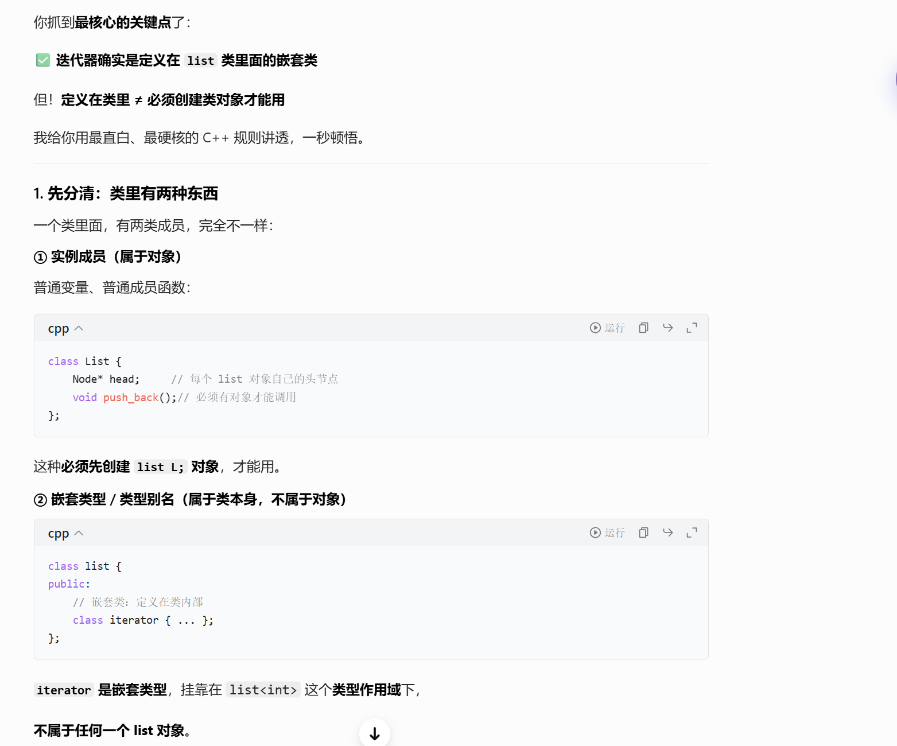
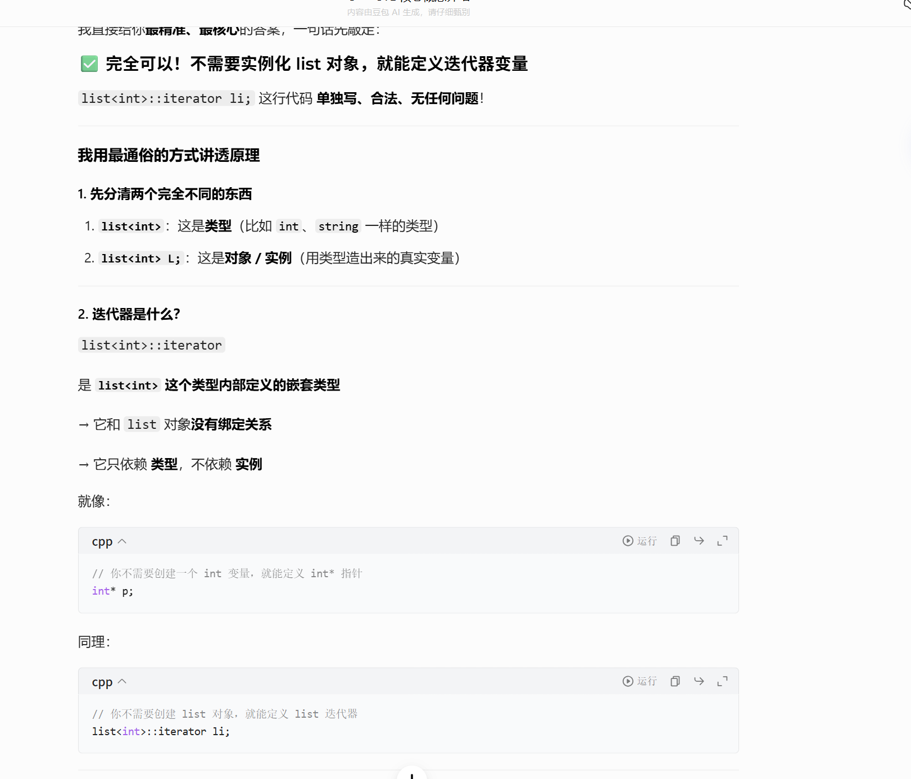
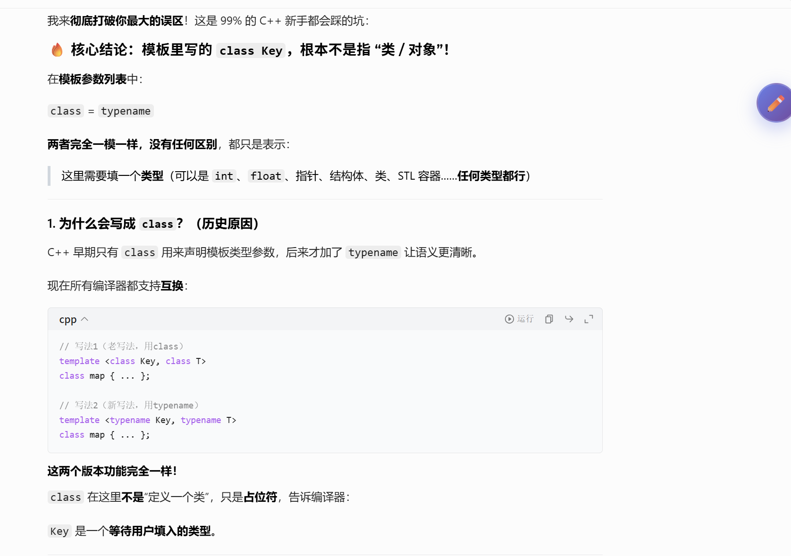

# STL 模板库

这两张PPT讲的是 **C++ 标准库（尤其是 STL，标准模板库）** 的核心概念，我帮你拆解一下：

---

### 第一张：C++ Standard Library（C++ 标准库）

这页介绍了标准库包含的核心组件：

1.  **`std::pair` 类**
    一个可以存放两个任意类型元素的“键值对”结构，比如 `pair<int, int>`、`pair<int, char>`，在 map 等容器中广泛使用。

2.  **Containers（容器）**
    用来存储和管理数据的结构，PPT 里举了几个典型：

    - `vector`：动态数组，可自动扩容，尾部插入/删除效率高。
    - `deque`：双端队列，头尾都能高效插入/删除。
    - `list`：双向链表，任意位置插入/删除效率高，但随机访问慢。
    - `sets and maps`：关联容器，分别是集合（键唯一）和映射（键值对），底层通常是红黑树。

3.  **Basic Algorithms（基础算法）**
    比如排序 `sort`、查找 `find` 等通用算法，不需要自己从零实现。

4.  **`std` 命名空间**
    标准库的所有标识符都定义在 `std` 命名空间中，所以代码里要么写 `std::vector`，要么用 `using namespace std;` 简化写法。

---

### 第二张：The three parts of STL（STL 的三大组成部分）

这页讲 STL 的三大核心支柱：

- **Containers（容器）**：存储数据的结构（就是第一张里讲的 vector、list 等）。
- **Algorithms（算法）**：操作容器中数据的通用函数（sort、find 等）。
- **Iterators（迭代器）**：容器和算法之间的“桥梁”，让算法可以不关心容器的具体实现，统一用迭代器遍历和操作数据。

简单来说，**容器存数据，算法操作数据，迭代器把两者连起来**，这就是 STL 设计的核心思想。

## vector

这几张PPT是在系统讲解 C++ STL 里最核心的容器之一——**`std::vector`**，我帮你按页拆解清楚👇

---

## 第一张：`vector` 入门示例

这页给了一个完整的、可直接跑的入门代码，核心是展示 `vector` 的基础用法：

```cpp
#include <iostream>
#include <vector>
using namespace std;

int main() {
    vector<int> x;          // 1. 定义一个存int的vector，不用手动管大小
    for (int a=0; a<1000; a++) {
        x.push_back(a);     // 2. 往尾部加元素，vector会自动扩容
    }
    vector<int>::iterator p; // 3. 定义vector的迭代器（相当于“指针”）
    for (p = x.begin(); p < x.end(); p++) {
        cout << *p << " ";  // 4. 用迭代器遍历、打印所有元素
    }
    return 0;
}
```

同时也讲了几个关键概念：

- 用 `using namespace std;` 简化写法，不用每次写 `std::vector`
- `vector` 不用提前指定大小，会自动扩容
- 自带迭代器（`iterator`），用来遍历容器里的元素

---

## 第二张：`vector` 是“泛型类（Generic Class）”

这页讲的是 `vector` 的本质：**它是一个模板类，也就是“泛型类”**。

例子 `vector<string> notes;` 说明：

- 必须指定两种类型：
  1.  容器本身的类型：这里是 `vector`
  2.  容器里存的元素类型：这里是 `string`
- 所以 `vector<int>` 存整数、`vector<string>` 存字符串、`vector<自定义类>` 存你自己写的对象，它可以适配任意类型，这就是“泛型”的核心优势。

---

## 第三张：`vector` 的核心特性

这页讲了 `vector` 最关键的3个特点：

1.  **自动扩容**：你往里面加元素（`push_back`）时，它会自动增加内部的容量，不用你手动管理内存。
2.  **自带大小计数**：它会自己记录当前存了多少个元素，用 `.size()` 就能直接拿到元素数量。
3.  **保持插入顺序**：你先插入的元素，遍历的时候也会先读到，顺序不会乱（是“有序容器”）。

---

## 第四张：`vector` 的常用操作大全

这页把日常开发里最常用的 `vector` 操作分成了几类，我给你按功能翻译一下：

| 分类 | 操作 | 作用 |
| :--- | :--- | :--- |
| **构造函数** | `vector<Elem> c;` | 创建一个空的vector |
| | `vector<Elem> c1(c2);` | 复制另一个vector |
| **基础方法** | `v.size()` | 返回当前元素个数 |
| | `v.empty()` | 判断是否为空 |
| | `== / != / < / >` | 直接比较两个vector |
| | `v.swap(v2)` | 和另一个vector交换内容 |
| **迭代器** | `v.begin()` | 指向第一个元素的迭代器 |
| | `v.end()` | 指向“最后一个元素的下一个位置”的迭代器 |
| **元素访问** | `v[index]` / `v.at(index)` | 按索引访问元素（`at`会做边界检查） |
| | `v.front()` | 取第一个元素 |
| | `v.back()` | 取最后一个元素 |
| **增删改查** | `v.push_back(e)` | 往尾部加元素 |
| | `v.pop_back()` | 删除尾部元素 |
| | `v.insert(pos, e)` | 在指定位置插入元素 |
| | `v.erase(pos)` | 删除指定位置的元素 |
| | `v.clear()` | 清空所有元素 |
| | `find(first, last, item)` | 查找元素（属于STL算法） |

---

简单总结一下：这几页就是带你从“是什么、怎么用、有什么特点、能做什么”四个维度，把 `vector` 这个STL里最常用的容器讲了一遍。

## list

这几页PPT是在讲 C++ STL 里的 **`std::list`（双向链表容器）**，我帮你按页拆解清楚👇

---

## 第一张：`std::list` 基础特性

这页对比了 `list` 和 `vector` 的共性与特性：

- **和 `vector` 一样的基础概念**：都支持构造、比较、首尾访问、增删元素。
- **核心方法**：
  - `x.front()` / `x.back()`：访问首尾元素
  - `x.push_back(item)` / `x.push_front(item)`：头尾都能插入（这是 `list` 比 `vector` 强的地方）
  - `x.pop_back()` / `x.pop_front()`：头尾都能删除
  - `x.remove(item)`：直接删除所有值为 `item` 的元素（`vector` 没有这个便捷方法）

---

## 第二张：`std::list` 入门示例 & 关键区别

这页给了一个完整的代码示例，同时点出了 `list` 和 `vector` 最关键的差异：

```cpp
#include <iostream>
#include <list>
#include <string>
using namespace std;

int main() {
    list<string> s;
    s.push_back("hello");   // 尾部插入
    s.push_back("world");
    s.push_front("tide");   // 头部插入（vector 做不到高效插入）
    s.push_front("crimson");
    s.push_front("alabama");

    list<string>::iterator p;
    // 遍历必须用 p != s.end()，不能用 p < s.end()
    for (p = s.begin(); p != s.end(); p++) {
        cout << *p << " ";
    }
    cout << endl;
}
```

### 关键知识点：

- **`list` 不支持 `p < s.end()`**：因为 `list` 是双向链表，元素在内存中不是连续存储的，迭代器不能像指针一样做大小比较，只能用 `!=` 或 `==` 判断是否到达末尾。
- **高效头尾操作**：`push_front` / `pop_front` 是 `list` 的优势，`vector` 做头部插入/删除会导致大量元素移动，效率极低。

---

## 第三张：用 `list` 维护有序序列

这页演示了 `list` 在有序插入场景下的典型用法，核心是利用 `list` 任意位置插入的高效性：

```cpp
#include <iostream>
#include <list>
#include <string>
using namespace std;

int main() {
    list<string> s;
    string t;
    list<string>::iterator p;

    // 读入5个字符串，按升序插入到 list 中
    for (int a = 0; a < 5; a++) {
        cout << "enter a string : ";
        cin >> t;
        // 找到第一个比 t 大的位置 p
        p = s.begin();
        while (p != s.end() && *p < t) {
            p++;
        }
        // 在 p 位置插入 t（list 插入O(1)效率，vector 这里会很慢）
        s.insert(p, t);
    }

    // 遍历打印有序 list
    for (p = s.begin(); p != s.end(); p++) {
        cout << *p << " ";
    }
    cout << endl;
}
```

这个场景完美体现了 `list` 的优势：

- 插入操作 `insert(p, t)` 在链表中是 **O(1)** 时间复杂度，而 `vector` 做同样的插入需要移动后面所有元素，时间复杂度是 **O(n)**。
- 用 `list` 维护有序序列，比用 `vector` 高效得多。

---

### 一句话总结

这几页讲的就是：

1.  `std::list` 是双向链表容器，支持高效的头尾/任意位置插入删除。
2.  它的迭代器不能用 `<` 比较，只能用 `!=`。
3.  适合频繁增删、维护有序序列的场景，而不适合随机访问。

## map

这几页PPT把 STL 里的 **`std::map`、`std::vector`、`std::list`** 三个核心容器的用法，从概念到示例都讲了一遍，我帮你按页拆解👇

---

## 1. 什么是 `std::map`？（Maps 页）

这页讲了 `map` 的核心定义：

- `map` 是**键值对（key-value pairs）的集合**，每一条数据都由「键（key）」和「值（value）」组成。
- 你可以通过 **`key` 快速查找对应的 `value`**，就像查电话本一样：输入名字（key），就能找到电话号码（value）。
- 它的底层通常是红黑树，保证了键的唯一性和有序性，查找、插入、删除的时间复杂度都是 O(log n)。

---

## 2. `map` 长什么样？（Using maps 页）

这页用电话本的例子，直观展示了 `map` 的数据结构：

- 这是一个键和值都是 `string` 类型的 `map`：`map<string, string>`
- 键是人名（比如 `"Charles Nguyen"`），值是对应的电话号码（比如 `"(531) 9392 4587"`）。
- 你只要传入人名，就能立刻查到电话，这就是 `map` 最典型的应用场景。

---

## 3. `map` 实战：自动计算总价（Example Program 页）

这页给了一个完整的可运行示例，演示了 `map` 的基本用法：

```cpp
#include <map>
#include <string>
using namespace std;

int main() {
    map<string, float> price; // 键：商品名，值：单价
    price["snapple"] = 0.75;  // snapple 单价0.75
    price["coke"] = 0.50;     // coke 单价0.50

    string item;
    double total = 0;
    while (cin >> item) {     // 循环读取用户输入的商品名
        total += price[item]; // 直接通过键取到价格，累加总价
    }
    return 0;
}
```

这里的核心用法：

- 用 `price["key"] = value` 插入键值对
- 用 `price["key"]` 直接获取对应的值，就像用数组下标一样方便

---

## 4. `map` 实战：平方数查询（Simple Example of Map 页）

这页演示了 `map` 的另一个常见用法：缓存/查表，还用到了 `count()` 方法：

```cpp
map<long, int> root; // 键：平方数，值：平方根
root[4] = 2;         // 4的平方根是2
root[1000000] = 1000;// 1000000的平方根是1000

long l;
cin >> l;
if (root.count(l)) { // 检查键 l 是否存在（存在返回1，不存在返回0）
    cout << root[l]; // 存在则输出平方根
} else {
    cout << "Not perfect square"; // 不存在则提示
}
```

这里的关键知识点：

- `map.count(key)`：用来判断 `key` 是否存在，避免访问不存在的键导致默认插入。

---

## 5. `std::vector` 的两种使用方式（Two ways to use Vector 页）

这页讲了 `vector` 的两种常见用法，同时点出了新手容易踩的坑：

### 方式1：预分配空间（Preallocate）

```cpp
vector<int> v(100); // 预分配100个元素的空间，初始值为0
v[80] = 1;          // 合法：下标在0~99范围内
v[200] = 1;         // 非法：越界访问，会导致未定义行为
```

### 方式2：尾部动态增长（Grow tail）

```cpp
vector<int> v2;     // 初始为空，没有分配空间
int i;
while (cin >> i) {
    v2.push_back(i); // 用push_back()在尾部添加元素，vector会自动扩容
}
```

核心结论：

- 预分配空间时，只能访问 `0 ~ size-1` 范围内的下标，越界访问是危险的。
- 不确定元素数量时，用 `push_back()` 动态添加是更安全的方式。

---

## 6. `std::list` 实战：删除元素（Example of List 页）

这页演示了 `list` 的 `erase()` 方法和迭代器的用法：

```cpp
list<int> L;
for (int i=1; i<=5; ++i)
    L.push_back(i); // 向list中添加1,2,3,4,5

L.erase(++L.begin()); // 删除第二个元素（++begin()指向第2个元素）

// 用copy算法把list的元素输出到cout，用逗号分隔
copy(L.begin(), L.end(), ostream_iterator<int>(cout, ","));
// 最终输出：1,3,4,5
```

这里的关键知识点：

- `list.erase(iterator)`：删除迭代器指向的元素，时间复杂度为 O(1)。
- `++L.begin()`：`list` 的迭代器支持自增，指向链表的下一个节点。
- `ostream_iterator`：STL 算法的辅助迭代器，可以直接把容器内容输出到控制台。

---

### 一句话总结

这几页PPT带你系统过了一遍 STL 三大核心容器的用法：

- `map`：键值对存储，快速查找；
- `vector`：动态数组，支持预分配和尾部动态增长；
- `list`：双向链表，高效增删，配合迭代器操作。





这里有个提醒的 嵌套类

## 迭代器

---

## 第一张：迭代器的声明与基础位置

这页讲了迭代器的**基本定义和两个关键位置**：

1.  **声明迭代器**

    ```cpp
    list<int>::iterator li;
    ```

    这行代码声明了一个专门用于 `list<int>` 容器的迭代器变量 `li`。迭代器是和容器绑定的，不同容器的迭代器不能混用（比如 `vector<int>::iterator` 不能直接给 `list<int>` 用）。

2.  **指向容器开头（Front of container）**

    ```cpp
    list<int> L;
    li = L.begin();
    ```

    `L.begin()` 返回一个迭代器，指向容器的**第一个有效元素**。如果容器为空，`begin()` 和 `end()` 会指向同一个位置。

3.  **指向容器尾后（Past the end）**

    ```cpp
    li = L.end();
    ```

    `L.end()` 是一个**哨兵迭代器**，它不指向任何有效元素，而是指向「最后一个元素的下一个位置」。

    - 它的作用是标记遍历的终点：当迭代器走到 `end()` 时，就说明已经遍历完所有元素了。
    - ⚠️ 注意：`end()` 迭代器**不能解引用**（`*li` 会报错），因为它不指向有效数据。

---

## 第二张：迭代器的核心操作

这页讲了迭代器最关键的两个能力，也是它能像“智能指针”一样工作的原因：

1.  **可以自增（Can increment）**

    ```cpp
    list<int>::iterator li;
    list<int> L;
    li = L.begin();
    ++li; // 指向第二个元素
    ```

    迭代器重载了 `++` 运算符，让它可以像指针一样“向后移动”：

    - 对 `list` 迭代器来说，`++li` 会跳到链表的下一个节点；
    - 对 `vector` 迭代器来说，`++li` 会直接指向下一个数组元素。
    （这也是你之前问的 `++L.begin()` 能运行的底层原因）

2.  **可以解引用（Can be dereferenced）**

    ```cpp
    *li = 10;
    ```

    迭代器重载了 `*` 运算符，让你可以拿到它指向的元素本身：

    - `*li` 等价于“迭代器指向的那个元素”；
    - 你可以对它赋值（`*li = 10`），也可以读取它的值（`cout << *li`）；
    - 同样要注意：**`end()` 迭代器不能解引用**，否则会导致未定义行为。

---

## 第三张：STL 算法如何通过迭代器工作

这页讲了 STL 最核心的设计思想：**算法和容器解耦**。

1.  核心规则：STL 算法**不直接操作容器，而是通过迭代器来操作数据**。
    比如 `std::copy`、`std::sort` 这些通用算法，都只接收迭代器作为参数，完全不关心底层容器是 `list` 还是 `vector`。

2.  例子：把 `list` 里的元素复制到 `vector`

    ```cpp
    list<int> L;
    vector<int> V;
    copy(L.begin(), L.end(), V.begin());
    ```

    这行代码的意思是：

    - 从 `L.begin()` 开始，到 `L.end()` 结束，复制 `list` 里的所有元素；
    - 然后把这些元素写入 `V.begin()` 开始的位置（也就是 `vector` 的开头）。
    ⚠️ 补充：这个例子有个前提——`V` 必须提前分配好足够的空间（比如 `vector<int> V(5);`），否则 `copy` 会直接越界写入，因为它不会自动扩容。

---

## 第四张：迭代器+算法的完整实战示例

这页把前面的知识点串成了一个完整的 `list` 操作流程：

```cpp
list<int> L;
// 1. 给 list 插入 1~5
for(int i=1; i<=5; ++i)
    L.push_back(i); // L 现在是 [1,2,3,4,5]

// 2. 用迭代器删除第二个元素
L.erase(++L.begin());
// L.begin() 指向 1，++begin() 指向 2，erase 之后 L 变成 [1,3,4,5]

// 3. 用 copy 把元素输出到控制台
copy(L.begin(), L.end(), ostream_iterator<int>(cout, ","));
// 输出：1,3,4,5,
```

这个例子完整展示了：

- 迭代器的自增（`++L.begin()`）；
- 用迭代器删除元素（`erase`）；
- 迭代器和 `copy` 算法的配合；
- 用 `ostream_iterator` 直接输出容器内容。

---

### 核心总结

这几页PPT的本质，是在讲 **STL 迭代器的“桥梁作用”**：

- 对容器来说，迭代器是统一的“数据访问接口”，不管底层是链表还是数组，都能用同样的方式访问元素；
- 对算法来说，迭代器是通用的“数据操作入口”，让 `copy`、`sort` 这些算法可以适配所有 STL 容器，实现“一套代码，多容器通用”。

---

要不要我给你写一个**完整可编译的代码示例**，把迭代器的声明、自增、解引用、配合 `copy` 算法的用法都串起来，你可以直接跑一遍看效果？

## 小技巧

这几页PPT是在讲 **C++ STL 里两个超实用的进阶技巧**：

1.  用 `typedef` 简化复杂的模板类型名
2.  如何把你自己写的类/结构体放进 STL 容器（`vector` / `map`）里用

我按页给你拆解得明明白白👇

---

## 1. 第一页：`typedef` 简化复杂模板名

这页的核心是：**嵌套模板的名字太长了，用 `typedef` 起别名，写起来省事！**

### 问题：嵌套模板的名字有多“折磨人”？

比如你要写一个「通讯录」：

- 外层是 `map`：键是人名 `Name`，值是一个人的多个电话号码（`list<PhoneNum>`）
- 完整类型名：`map<Name, list<PhoneNum>>`
- 它的迭代器名更长：`map<Name, list<PhoneNum>>::iterator`

每次写都要敲一长串，非常容易写错。

### 解决：用 `typedef` 起别名

```cpp
// 给复杂类型起个短名字 PB（PhoneBook的缩写）
typedef map<Name, list<PhoneNum>> PB;

// 之后就可以直接用别名了！
PB phonebook;                  // 等价于 map<Name, list<PhoneNum>> phonebook;
PB::iterator finger;           // 等价于 map<Name, list<PhoneNum>>::iterator finger;
```

### 额外好处：修改实现成本极低

如果以后你不想用 `list` 存电话了，改成 `vector`，只需要改 `typedef` 那一行：

```cpp
typedef map<Name, vector<PhoneNum>> PB;
```

其他所有用到 `PB` 的代码都不用动，非常方便。

---

## 2. 第二页：自定义类放进 STL 容器，需要满足什么条件？

这页讲的是：**不是所有类都能直接丢进 STL 容器，有些容器会“挑食”！**

### 所有容器都通用的基础要求

你的自定义类，编译器默认会帮你生成两个东西，只要你不写复杂逻辑，一般不用自己实现：

1.  **默认构造函数**：容器需要创建空对象时用（比如 `vector` 扩容时）
2.  **赋值运算符 `operator=`**：容器需要拷贝对象时用（比如 `push_back`、`resize`）

### 有序容器（比如 `map` / `set`）的额外要求

`map` 是按 `key` 排序的（底层是红黑树），所以它要求 `key` 类型必须能比较大小，也就是：
> 必须重载 `operator<` 运算符

- 自带类型（`int`、`char`、`string`）默认有 `operator<`，所以直接用就行；
- 但像 `char*` 这种指针类型，默认的 `operator<` 比较的是**内存地址**，不是字符串的实际内容，所以不满足需求，必须自己实现。

---

## 3. 第三页：自定义结构体用在 `vector` 里（无额外要求）

这页是个简单例子：

```cpp
struct point {
    float x;
    float y;
};

vector<point> points;
point p; p.x=1; p.y=1;
points.push_back(p);
```

为什么这个结构体直接能放进 `vector`？

- `point` 是个简单的POD类型，编译器自动帮你生成了默认构造函数和赋值运算符；
- `vector` 不需要排序，只要能存对象就行，所以**完全不需要额外写任何东西**。

---

## 4. 第四页：自定义类用在 `map` 里（必须重载 `operator<`）

这页是重点，演示了自定义类当 `map` 的 `key` 时，怎么正确实现 `operator<`：

```cpp
struct full_name {
    char* first;
    char* last;

    // 必须重载 operator<，让 map 能按名字排序
    bool operator<(full_name &a) {
        // 注意：不能直接写 return first < a.first;！
        // 要用 strcmp 比较字符串内容，而不是比较指针地址！
        return strcmp(first, a.first) < 0;
    }
};

map<full_name, int> phonebook;
```

### 关键坑：为什么要用 `strcmp`？

- 如果直接写 `return first < a.first;`，比较的是两个 `char*` 指针的**内存地址**，不是字符串的实际内容；
- 比如两个内容都是 `"Alice"` 的字符串，地址不同，会被 `map` 当成两个不同的 `key`，导致逻辑错误；
- 用 `strcmp(first, a.first) < 0`，才是按字符串的字典序比较内容，这样 `map` 的排序和查找才是正确的。

---

### 一句话总结

这几页PPT讲了两个核心技巧：

1.  `typedef` 简化嵌套模板的长名字，让代码更简洁、更好维护；
2.  自定义类用在 STL 容器里时，`vector` 只要能存就行，`map` 必须实现 `operator<`，而且比较字符串要用 `strcmp` 不能直接比指针。



## 表现and小误区

这几页PPT讲的是 **STL容器的性能取舍和新手必踩的坑**，我按「性能经验」和「常见陷阱」两部分，帮你拆解得明明白白👇

---

## 一、Performance：STL vs 手写容器的取舍

这两页是真实开发经验，核心结论：**STL通用但有少量开销，手写优化能快一点，但代价极高，多数时候不值得**。

### 1. 经验1：`deque` vs 手写环形缓冲区

- **场景**：用STL的`std::deque`做队列，比自己写的环形缓冲区慢了40%。
- **原因**：
  - `deque`是分段数组实现，有额外的内存管理和间接访问开销；
  - 手写环形缓冲区是连续数组，缓存命中率更高，而且针对场景做了极简优化，没有通用容器的冗余逻辑。
- **代价**：手写版本花了好几天调试，虽然快了，但维护成本高，出了问题难排查。
- **结论**：除非是极端性能瓶颈场景，否则没必要放弃STL。

### 2. 经验2：STL `list` vs 侵入式链表

- **场景**：用自定义的侵入式链表，比STL的`std::list`快了约5%。
- **核心区别**：
  - STL的`list`：每个节点是`std::list_node<T>`，内部包含`T`和`prev/next`指针，每个节点需要额外的内存分配，访问数据需要间接引用；
  - 侵入式链表：直接把`next`指针放在用户结构体里（比如`struct foo { int a; foo* next; }`），不需要额外的节点对象，减少了内存分配和间接访问，缓存更友好。
- **缺点**：一个`foo`对象只能同时存在于一个链表中（因为只有一个`next`指针），通用性差，只能用在特定场景。

---

## 二、Pitfalls：STL容器新手必踩的坑

这几页讲了4个最常见的错误，每个都拆解了「错误写法、为什么错、正确方案」：

### 1. 坑1：`vector`越界访问（未定义行为）

- **错误代码**：

  ```cpp
  vector<int> v;
  v[100] = 1; // 空vector，size=0，直接访问v[100]越界
  ```

- **为什么错**：`vector`的`[]`运算符**不做边界检查**，访问超出`size()`范围的元素是未定义行为（可能崩溃、覆盖其他内存，或者看起来正常运行）。
- **解决方案**：
  1.  优先用`push_back()`动态添加元素，避免直接下标访问；
  2.  预分配空间：`vector<int> v(100);`（size=100，可以访问`v[0]~v[99]`）；
  3.  用`reserve()`预分配容量（`v.reserve(100)`），但注意：`reserve`不改变`size`，还是不能访问超过`size`的元素；
  4.  必要时用`at()`方法，它会做边界检查，越界会抛异常。

### 2. 坑2：`map`的`[]`运算符隐式插入

- **错误代码**：

  ```cpp
  map<string, int> foo;
  if (foo["bob"] == 1) { ... }
  ```

- **为什么坑**：`map`的`[]`运算符有个“副作用”：**如果键不存在，会自动插入一个键为`"bob"`、值为默认构造的元素（`int`就是0）**。即使你只是想检查值，也会偷偷插入新元素，导致`map`变大，逻辑出错。
- **解决方案**：
  1.  先用`count()`检查键是否存在：`if (foo.count("bob"))`（存在返回1，不存在返回0）；
  2.  再用`[]`或`at()`访问值：`foo["bob"] == 1`；
  3.  或者用`find()`：`auto it = foo.find("bob"); if (it != foo.end() && it->second == 1)`。

### 3. 坑3：`list`用`size() == 0`判断空（效率低）

- **错误写法**：`if (my_list.size() == 0) { ... }`（PPT里写的`count()`是笔误，应该是`size()`）
- **为什么慢**：
  - 旧版C++标准中，`std::list`的`size()`可能是O(n)时间复杂度（需要遍历整个链表计数）；
  - 即使新版标准中`size()`是O(1)，`empty()`也更高效，而且语义更清晰。
- **正确写法**：`if (my_list.empty()) { ... }`，`empty()`直接检查链表是否为空，O(1)时间，语义明确。

### 4. 坑4：`list`迭代器失效（erase后自增）

- **错误代码**：

  ```cpp
  list<int> L;
  list<int>::iterator li = L.begin();
  L.erase(li);
  ++li; // 错误！li已经失效了
  ```

- **为什么错**：`erase(li)`会删除`li`指向的节点，此时`li`变成了**失效迭代器**（野指针），再对它自增是未定义行为。
- **正确写法**：利用`erase`的返回值：

  ```cpp
  li = L.erase(li); // erase返回被删除元素的下一个迭代器，li自动更新为有效迭代器
  ```

  这样`li`会指向被删除节点的下一个元素，迭代器保持有效，可以安全继续遍历。

## 一些易错

这页PPT讲的是 **C++ 里和 STL 模板相关的两个经典编译错误**，我给你拆解得明明白白👇

---

## 1. 第一个坑：嵌套模板的 `>>` 必须加空格（历史坑）

### 错误场景

```cpp
vector<vector<int>> vv;  // 很多旧编译器会报错！
```

PPT 里的箭头就是指 `>>` 这里，少了一个空格。

### 为什么会报错？

这是 **C++ 词法分析的“最长匹配”规则**导致的：

- 编译器解析代码时，会优先把 `>>` 当成**一个整体符号——右移运算符（`operator>>`）**；
- 所以 `vector<vector<int>>` 会被误解析成：`vector< (vector<int) >>`，模板的闭合尖括号被“吃掉”了，直接报语法错误。

### 怎么解决？

在两个 `>` 之间加个空格，写成：

```cpp
vector<vector<int> > vv;  // 两个 > 分开，不会被当成右移
```

补充：C++11 之后标准允许直接写 `>>`，现代编译器（GCC 4.6+、VS2010+）都支持，但很多教学PPT/旧代码还是会强调这个坑，避免遇到老编译器踩雷。

---

## 2. 第二个坑：`map` 报错里出现 `pair<...>`，看不懂？

### 背景

你之前学过：`std::map` 的每个节点，底层存的都是 `std::pair<const Key, T>`（键值对）。
所以你操作 `map` 时，几乎所有操作都和 `pair` 绑定：

- `map::insert` 方法需要接收一个 `pair<Key, T>`；
- `map` 迭代器解引用 `*it`，返回的是 `pair<const Key, T>&`；
- `map` 的排序、比较，本质也是对 `pair` 的 `first`（key）部分操作。

### 新手懵的场景

比如你写了：

```cpp
map<string, int> m;
m.insert("alice", 20); // 想插入键值对
```

编译器会报错，错误信息里会出现 `pair<const string, int>`，很多新手就懵了：我没写 `pair` 啊？
其实错误的原因是：`insert` 必须接收一个 `pair` 对象，正确写法是 `m.insert(make_pair("alice", 20));`，编译器的错误信息只是追溯到了 `map` 底层依赖的 `pair` 类型。

### 核心结论

只要你操作 `map` 时，错误信息里出现了 `pair<...>`，别慌！先想想：

- 是不是 `insert` 没传 `make_pair`？
- 是不是用了 `map` 迭代器但没正确处理 `first`/`second`？
- 是不是自定义类型当 `key`，没实现 `operator<`，导致 `pair` 无法比较？

---

### 一句话总结

这页讲的就是 STL 新手最容易踩的两个编译坑：

1.  嵌套模板的 `>>` 要加空格，避免被当成右移运算符；
2.  `map` 报错里出现 `pair` 很正常，因为它的底层就是用 `pair` 存键值对的，错误根源还是 `map` 的操作。
