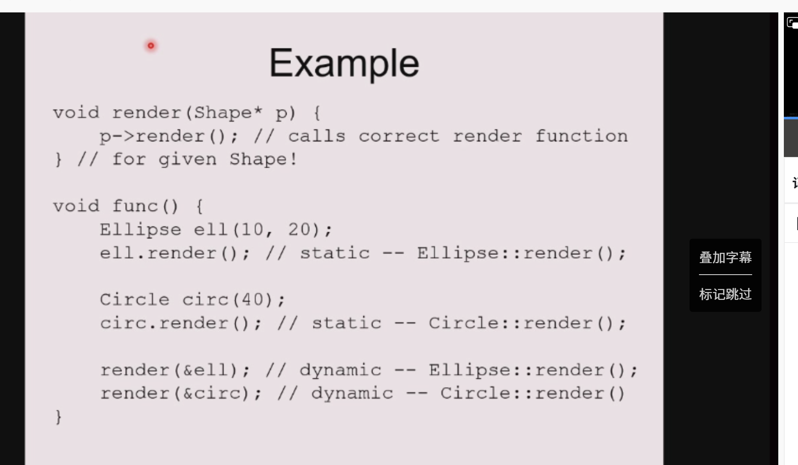
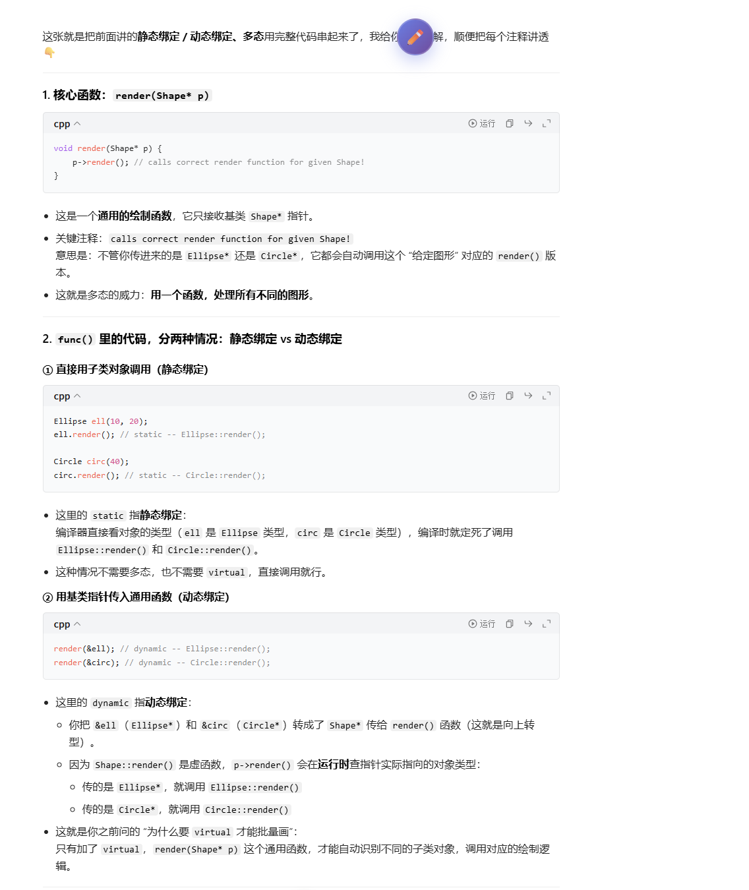
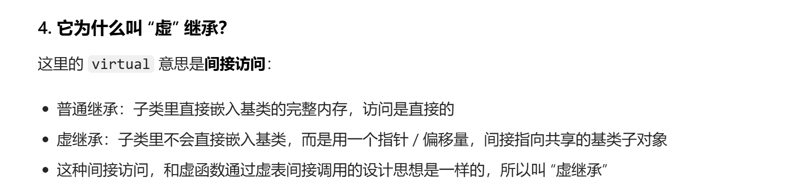

# 多态

## 上节课最后一个例子

---

### 1. 第一张：A drawing program（绘图程序的抽象）

这张是整个例子的起点，把绘图里的所有图形做了抽象：

- 图形（Shape）的通用**数据（Data）**：比如 `center`（中心点坐标），是所有图形都有的属性。
- 图形的通用**操作（Operations）**：`render`（渲染/绘制）、`move`（移动）、`resize`（缩放），这些是所有图形都要支持的行为。
- 具体图形：`Rectangle`（矩形）、`Circle`（圆形）、`Ellipse`（椭圆），它们都共享上面的通用属性和操作，但各自的实现方式不一样（比如矩形和圆形的绘制逻辑不同）。

---

### 2. 第二张：Inheritance in C++（C++ 继承的核心思想）

这张讲为什么要用继承来做这个设计：

- 继承的本质：**用一个类来定义另一个类**，复用父类的代码。
- 对应图形的关系：
  - `Ellipse`（椭圆）是一种 `Shape`（图形）
  - `Circle`（圆）是一种特殊的 `Ellipse`（椭圆）
  - `Rectangle`（矩形）是另一种 `Shape`
- 它们共享**共同的属性（attributes，比如中心点）**和**服务（services，比如渲染、移动）**，但又不是完全一样的（绘制逻辑不同）。
- 右边的环形图也体现了：`Shape` 是最内层的通用父类，`Ellipse`、`Circle` 是外层的具体子类。

---

### 3. 第三张：Conceptual model（概念模型/类继承图）

这张是最终的类继承关系，也是整个设计的核心：

- 最顶层的基类是 `Shape`，它定义了所有图形的通用属性（`center`）和通用操作（`move()`、`render()`）。
- 派生关系：
  - `Shape` 派生了 `Rectangle` 和 `Ellipse`
  - `Rectangle` 又派生了 `Square`（正方形）
  - `Ellipse` 又派生了 `Circle`（圆形）
- 关键细节：**每个子类都重写了 `render()` 方法**，这是为了实现多态。
- 重点笔记：`Note: Deriving Circle from Ellipse is a poor design choice!`
  > 翻译成：**从椭圆派生出圆，是一个糟糕的设计！**

  - 原因：圆虽然数学上是特殊的椭圆，但在程序设计里，椭圆有长轴、短轴，而圆只有半径。如果让圆继承椭圆，会导致圆也继承了“修改长轴/短轴”的方法，这会破坏圆的不变性（圆的长轴必须等于短轴），违反了面向对象里的 **Liskov 替换原则（LSP）**。

---

### 4. 第四张：In C++（C++ 代码实现）

这张是 `Shape` 基类的代码实现，对应前面的设计：

```cpp
class XYPos { ... }; // 表示 x,y 坐标的辅助类

class Shape {
public:
    Shape();                // 构造函数
    virtual ~Shape();       // 虚析构函数（关键！为了子类对象能被正确释放）
    virtual void render();  // 虚函数：渲染（子类必须重写）
    void move(const XYPos&); // 非虚函数：移动（所有图形的移动逻辑通用，直接复用）
    virtual void resize();  // 虚函数：缩放（子类可以重写）
protected:
    XYPos center;           // 受保护的成员：中心点坐标，子类可以直接访问
};
```

- 关键细节：
  - `virtual ~Shape()`：虚析构函数，保证当用基类指针指向子类对象时，析构子类对象时能正确调用子类的析构函数，避免内存泄漏。
  - `virtual void render()`：虚函数，子类（Rectangle、Ellipse 等）必须重写这个函数，实现自己的绘制逻辑，这样就能通过基类指针调用不同子类的 `render()`，实现多态。
  - `void move(const XYPos&)`：非虚函数，说明所有图形的移动逻辑是通用的，不需要重写，直接复用父类的实现即可。

---

### 整体总结

这组笔记完整展示了**面向对象设计中，如何用继承和多态来构建一个图形类体系**：

1.  抽象出通用的基类 `Shape`，定义所有图形的共同属性和操作。
2.  用继承扩展出具体的图形类（Rectangle、Ellipse 等），复用基类的代码。
3.  用 `virtual` 虚函数（比如 `render()`）实现多态，让基类指针可以调用不同子类的实现。
4.  同时也点出了一个经典的设计坑：不要盲目用继承表示“是一种”关系（比如圆继承椭圆），否则会破坏类的不变性。

这两页笔记，刚好把你之前问的**“为什么要 `virtual` 才能批量画图形”**给讲透了！核心就是 **多态（Polymorphism）、向上转型（Upcasting）、静态绑定/动态绑定、虚函数（Virtual functions）** 这几个概念，我们一张一张拆解：

---

## 具体讲解

### 第一页：Polymorphism（多态）

这张讲的是多态的两个核心前提：

1.  **Upcast（向上转型）**
    - 定义：把**派生类对象**当成**基类对象**来用。
    - 例子：`Ellipse`（椭圆）可以被当成 `Shape`（图形）来处理。
    - 这就是你笔记里 `Shape* ep = &ellipse;` 的本质：基类指针指向派生类对象。

2.  **Dynamic binding（动态绑定）**
    - 绑定（Binding）：就是“确定要调用哪个函数”的过程。
    - **Static binding（静态绑定）**：看的是**代码里写的类型**（比如指针的声明类型是 `Shape*`），编译时就定死了调用基类的函数。
    - **Dynamic binding（动态绑定）**：看的是**对象实际的类型**（比如指针实际指向的是 `Ellipse` 对象），运行时才确定调用哪个函数。

---

### 第二页：Virtual functions（虚函数）

这张讲的就是：**为什么加了 `virtual` 就能实现动态绑定**，以及它和普通函数的区别：

#### 1. Non-virtual functions（非虚函数）

- 编译器会做**静态绑定**：直接根据“声明的类型”调用函数，不看对象实际是什么。
- 优点：执行更快，因为编译时就定好了地址，运行时不用额外查找。
- 对应你之前的问题：如果 `render()` 不是虚函数，`Shape*` 调用的永远是 `Shape::render()`，不管它指向的是 `Circle` 还是 `Rectangle`。

#### 2. Virtual functions（虚函数）

- 核心特点1：**透明地被子类重写（transparently overridden）**，子类写的重写版本能被自动识别。
- 核心特点2：**对象会携带一个“虚函数表（vtable）”**，里面存了这个对象实际类型对应的所有虚函数地址。
- 核心特点3：编译器会做**动态绑定**：运行时查这个对象的虚函数表，找到正确的子类函数来调用。
- 优化补充：如果编译器在编译时就能确定对象的类型（比如直接用子类对象调用），它也可以优化成静态调用，不影响性能。

---

### 一句话串起来讲透

多态 = 向上转型 + 动态绑定

- **向上转型**让你能用基类指针/引用统一管理一堆不同的子类对象（比如 `Shape*` 数组存所有图形）。
- **动态绑定**（靠 `virtual` 实现）让基类指针能在运行时找到对象实际的类型，调用对应的子类函数（比如循环里 `render()` 能自动调用 `Circle::render()` 或 `Rectangle::render()`）。

这就是为什么笔记里说，加了 `virtual` 才能实现你想要的“批量画不同图形”的效果。





## 部分易错总结

### 一、核心知识点（一句话版）

1. **多态 = 父类指针/引用 + 虚函数 + 子类重写**
2. 只有**虚函数**才能实现**动态绑定**（运行时才确定调用哪个函数）
3. 非虚函数是**静态绑定**（编译时就定死，只看指针类型）
4. 父类写了 `virtual`，子类重写函数**自动变虚函数**，不用再写 `virtual`
5. 每个有虚函数的**类**有一张**虚函数表 vtable**
6. 每个**对象**自带一个隐藏指针 **vptr**，指向自己类的虚表
7. 调用虚函数时：
   **取对象 vptr → 查虚表 → 调用对应函数**

---

### 二、最容易错的点（高频坑）

#### 1. 以为“子类有同名函数就会覆盖”

- 不加 `virtual` → **不覆盖，只隐藏**
- 父类指针调用 → 依然调用**父类版本**

#### 2. 以为子类必须写 `virtual` 才是虚函数

- 错！
- **父类虚 → 子类重写自动虚**
- 子类写不写 `virtual` 都一样

#### 3. 以为 vptr 存在“指针里”

- 错！
- vptr 存在**对象内存里**，不是指针里
- 指针只是指向这个对象

#### 4. 以为虚表是对象的一部分

- 错！
- **虚表属于类，所有对象共用一张**
- 对象只有一个指针指向它

#### 5. 以为“只要是继承就能多态”

- 错！
- 继承 + 虚函数 **缺一不可**
- 没有 `virtual` 就没有多态

#### 6. 以为构造函数可以是虚函数

- 不行！构造函数不能是 `virtual`
- 对象还没构造出来，哪来的 vptr

#### 7. 析构函数不写 virtual 会内存泄漏

- 父类指针删子类对象时
- 不加 `virtual` → 只调用父类析构，子类资源没释放

---

### 三、最简判断口诀

- 看指针类型 → **静态绑定（非虚）**
- 看对象实际类型 → **动态绑定（虚函数）**
- 父类虚，子类自动虚
- 表属于类，指针属于对象
- 查表调用，这就是多态

## 原理具体总结

这组笔记，就是用你前面的 `Shape → Ellipse → Circle` 继承链，**把虚函数表、对象内存布局、多态的底层细节，和最容易踩的坑（对象切片）讲透了**，我们一张一张拆解：

---

## 1. 第一张：`Shape` 类的虚函数表与对象内存

```cpp
class Shape {
public:
    virtual ~Shape();       // 虚析构
    virtual void render();  // 虚函数
    void move(const XYPos&); // 非虚函数
    virtual void resize();   // 虚函数
protected:
    XYPos center;
};
```

- **对象内存布局**：`Shape` 对象的开头是隐藏的 `vptr`（虚表指针），后面跟着成员变量 `center`。
- **虚函数表（vtable）**：`Shape` 类有一张独立的虚表，里面按顺序存了：
  1. `Shape::~dtor()`（析构函数）
  2. `Shape::render()`
  3. `Shape::resize()`
- 非虚函数 `move()` 不会进虚表，直接静态调用。

---

## 2. 第二张：`Ellipse` 子类的虚函数表与对象内存

```cpp
class Ellipse: public Shape {
public:
    virtual void render(); // 重写了虚函数
protected:
    float major_axis, minor_axis; // 新增成员变量
};
```

- **对象内存布局**：继承了 `Shape` 的 `vptr` + `center`，再加上自己的 `major_axis`、`minor_axis`。
- **虚函数表（vtable）**：`Ellipse` 有自己的虚表，继承并覆盖了父类的虚函数：
  1. `Ellipse::~dtor()`（子类析构）
  2. `Ellipse::render()`（重写后的版本）
  3. `Shape::resize()`（没重写，直接用父类的实现）
- 注意：`resize()` 没被 `Ellipse` 重写，所以虚表里直接用父类的函数地址。

---

## 3. 第三张：`Shape` vs `Ellipse` 的内存对比

这张是前两张的合并，帮你直观看到继承后的变化：

- `Shape` 对象：`vptr` → `Shape` 虚表，成员只有 `center`。
- `Ellipse` 对象：`vptr` → `Ellipse` 虚表，成员包含继承的 `center` + 新增的 `major_axis`/`minor_axis`。
- 核心：子类的虚表会**覆盖重写的虚函数**，没重写的保留父类的地址。

---

## 4. 第四张：`Circle` 子类的虚函数表与对象内存

```cpp
class Circle: public Ellipse {
public:
    virtual void render();  // 重写
    virtual void resize();   // 重写
    virtual float radius(); // 新增虚函数
protected:
    float area; // 新增成员变量
};
```

- **对象内存布局**：继承了 `Ellipse` 的所有成员（`vptr` + `center` + 长短轴），再加上自己的 `area`。
- **虚函数表（vtable）**：`Circle` 有自己的虚表，完整覆盖了继承链上的虚函数：
  1. `Circle::~dtor()`
  2. `Circle::render()`
  3. `Circle::resize()`（重写了父类没重写的函数）
  4. `Circle::radius()`（新增的虚函数，追加在虚表末尾）
- 这就是继承链上虚表的完整构建过程：**重写的覆盖，没重写的保留，新增的追加**。

---

## 5. 第五张：最致命的坑——对象切片（Object Slicing）

这张讲的是你前面所有理解的反例，也是面试必考点：

```cpp
Ellipse elly(20F, 40F);
Circle circ(60F);
elly = circ; // 关键代码：子类对象赋值给父类对象（不是指针/引用！）
```

- 问题：`elly = circ` 是**对象赋值**，不是指针/引用赋值，会发生**对象切片**：
  1. 只会复制 `circ` 中属于 `Ellipse` 部分的成员（`center`、`major_axis`、`minor_axis`），子类新增的 `area` 被直接“切掉”。
  2. 更关键的：`elly` 的 `vptr` 永远指向 `Ellipse` 的虚表，`circ` 的 `Circle` 虚表信息会被完全忽略。
- 结果：`elly.render()` 只会调用 `Ellipse::render()`，而不是你预期的 `Circle::render()`，多态完全失效。

---

## 核心总结

1.  **虚表的继承与覆盖**：子类会继承父类的虚表，重写的虚函数会被覆盖，新增的虚函数会追加到虚表末尾。
2.  **对象内存布局**：子类对象包含父类的所有成员 + 自己新增的成员，开头的 `vptr` 永远指向自己类的虚表。
3.  **对象切片的致命问题**：**子类对象直接赋值给父类对象，会切掉子类信息，vptr 也会被重置为父类的虚表，多态直接失效**。
4.  **多态的前提**：必须用**父类指针/引用**指向子类对象，才能保留 `vptr` 信息，实现动态绑定。

## 续写

---

### 1. 第一张：指针赋值与多态

```cpp
Ellipse* elly = new Ellipse(20F, 40F);
Circle* circ = new Circle(60F);
elly = circ;
```

- 这是**指针之间的赋值**，不是对象赋值，和之前的对象切片完全不同：
  1.  指针赋值只会改变`elly`里存的**内存地址**，不会修改任何对象本身。
  2.  赋值后，`elly`和`circ`都指向同一个`Circle`对象，之前`new`出来的`Ellipse`对象因为没有指针引用了，会造成**内存泄漏**。
- 关键效果：

  ```cpp
  elly->render(); // Circle::render()
  ```

  因为`elly`指向的是真正的`Circle`对象，对象里的`vptr`还是`Circle`的虚表，所以会调用子类的`render()`，**多态正常生效**。

---

### 2. 第二张：Circle 类的虚表回顾

这张是之前内容的回顾，帮你巩固：

- `Circle`继承了`Ellipse`，重写了`render()`和`resize()`，还新增了虚函数`radius()`。
- 它的虚表里，`Circle::render()`和`Circle::resize()`覆盖了父类的版本，`Circle::radius()`追加在虚表末尾。
- 这也是为什么上面的`elly->render()`能正确调用子类版本的底层原因：`Circle`对象的`vptr`指向自己的虚表。

---

### 3. 第三张：引用参数与多态

```cpp
void func(Ellipse& elly) {
    elly.render();
}

Circle circ(60F);
func(circ);
```

- 这张讲的是**引用也能实现多态**，效果和指针完全一致：
  1.  `func`的参数是`Ellipse&`（基类引用），绑定了`Circle`对象`circ`。
  2.  引用本质上就是一个“安全的指针”，它绑定了`circ`的内存地址，没有发生任何对象拷贝。
  3.  所以`elly.render()`会调用`Circle::render()`，多态正常生效。
- 笔记里的关键总结：`References act like pointers`（引用的行为和指针一样），因为它们都不会拷贝对象，只会绑定对象的地址，所以能保留对象里的`vptr`信息。

---

## 核心对比总结

| 场景 | 行为 | 是否保留 vptr | 多态是否生效 |
| :--- | :--- | :--- | :--- |
| `Ellipse elly = circ;`（对象赋值） | 拷贝父类部分，发生切片 | ❌（elly的vptr永远是Ellipse的） | ❌ 调用Ellipse::render() |
| `Ellipse* elly = &circ;`（基类指针） | 仅拷贝地址，不修改对象 | ✅（circ的vptr还是Circle的） | ✅ 调用Circle::render() |
| `Ellipse& elly = circ;`（基类引用） | 绑定对象地址，不拷贝对象 | ✅（circ的vptr还是Circle的） | ✅ 调用Circle::render() |

---

### 一句话记住

**只有指针和引用能保留对象的`vptr`信息，实现多态；直接对象赋值会切掉子类信息，多态直接失效。**


这里有一个重点 就是子类和父类在内存布局上 相当于是子类的前面部分就是父类的 所以指针转换/赋值都不怕 引用也是。

## 进阶规则

这组笔记把 C++ 虚函数/重写的几个**进阶核心规则**讲透了，我给你一张一张拆解，顺便把你需要的关键点标出来：

---

### 1. 第一张：虚析构函数（Virtual destructors）

这是 C++ 继承里**最关键的安全规则**：

```cpp
Shape *p = new Ellipse(100.0F, 200.0F);
delete p;
```

- 核心规则：**如果一个类可能被继承，它的析构函数必须声明为 `virtual`**。
- 为什么？
  - 如果 `Shape::~Shape()` 不是虚函数，`delete p` 只会调用 `Shape::~Shape()`，`Ellipse` 的析构函数永远不会被调用，子类的资源（比如动态内存）无法释放，直接造成**内存泄漏**。
  - 加了 `virtual` 后，`delete p` 会先调用 `Ellipse::~Ellipse()`，再自动调用 `Shape::~Shape()`，资源被完整释放。
- 一句话总结：**基类析构函数不加 `virtual`，子类对象通过基类指针删除时，一定会泄漏！**

---

### 2. 第二张：重写（Overriding）的基本定义

```cpp
class Base {
public:
    virtual void func();
};
class Derived : public Base {
public:
    virtual void func(); // 重写 Base::func()
};
```

- 核心定义：**重写（Overriding）是对虚函数的“重新实现”**，子类用和父类完全相同的签名（函数名、参数、const 修饰）重写虚函数，就能在多态调用时替换父类的实现。
- 注意：
  - 父类必须是 `virtual`，子类的 `virtual` 关键字可以省略（自动继承），但写上更清晰。
  - 重写必须保证**签名完全一致**，否则就会变成“隐藏（hiding）”，而不是重写。

---

### 3. 第三张：重写后调用父类实现（Calls up the chain）

```cpp
void Derived::func() {
    cout << "In Derived::func!";
    Base::func(); // 调用父类版本
}
```

- 核心用法：重写虚函数时，可以用 `父类名::函数名()` 显式调用父类的实现，实现“在父类功能的基础上扩展新功能”。
- 好处：不用复制父类的代码，直接复用父类逻辑，再加上子类自己的逻辑，是面向对象里“扩展而非修改”的经典用法。

---

### 4. 第四张：协变返回类型（Return types relaxation）

这是 C++ 虚函数重写的一个**特殊规则**：

- 前提：`D` 是 `B` 的公开子类（`D : public B`）。
- 规则：子类重写父类的虚函数时，返回值可以是父类返回值的**子类指针/引用**，这叫**协变返回类型（Covariant Return Types）**。
- 限制：
  - 只支持**指针和引用类型**，不支持值类型。
  - 子类的返回类型必须是父类返回类型的“子类”，不能毫无关系。

---

### 5. 第五张：协变返回类型的示例

```cpp
class Expr{
public:
    virtual Expr* newExpr();    // 返回基类指针
    virtual Expr& clone();       // 返回基类引用
    virtual Expr self();         // 返回基类值
};

class BinaryExpr: public Expr{
public:
    virtual BinaryExpr* newExpr(); // ✅ 合法：子类指针，协变
    virtual BinaryExpr& clone();    // ✅ 合法：子类引用，协变
    virtual BinaryExpr self();      // ❌ 非法：值类型不支持协变
};
```

- 这张刚好验证了上一张的规则：
  - `newExpr()` 和 `clone()` 用了指针/引用，返回子类的指针/引用是合法的。
  - `self()` 用了值类型，不支持协变，会编译报错。

---

### 核心易错点总结

1.  **基类析构函数必须 `virtual`**，否则子类对象通过基类指针删除会泄漏。
2.  **重写必须保证签名完全一致**，否则会变成隐藏，多态失效。
3.  子类可以用 `Base::func()` 调用父类的虚函数实现，扩展功能。
4.  虚函数重写的返回值，只有**指针和引用**支持协变，值类型不支持。

## 坑点

---

### 1. 第一张：重载与虚函数的隐藏问题

```cpp
class Base {
public:
    virtual void func();
    virtual void func(int);
};
```

- 这里 `Base` 里的 `func()` 和 `func(int)` 是**重载的虚函数**（同一个函数名，不同参数）。
- 核心规则：**如果子类重写了其中一个重载版本，必须把所有重载版本都重写，否则没被重写的版本会被隐藏！**
- 错误示例：如果子类只重写了 `func()`，那么 `func(int)` 就会被隐藏，无法通过子类对象调用。

---

### 2. 第二张：正确重写所有重载版本

```cpp
class Derived: public Base {
public:
    virtual void func() {
        Base::func(); // 调用父类实现
    }
    virtual void func(int) { ... };
};
```

- 这是正确的写法：子类把父类所有重载的虚函数都重写了，两个版本都能正常使用。
- 补充：如果不想自己实现，也可以用 `using Base::func;` 把父类的所有重载版本引入子类，避免隐藏。

---

### 3. 第三张：虚函数使用的两个关键Tips

这张讲了两个**必须遵守的避坑规则**：

1.  **永远不要重定义继承来的非虚函数**
    - 非虚函数是静态绑定的，只会根据指针/引用的类型调用，和对象实际类型无关。
    - 重定义后，用父类指针调用会执行父类版本，用子类对象调用会执行子类版本，行为不一致，极易出 bug。
2.  **永远不要重定义继承来的默认参数值**
    - 默认参数是编译时静态绑定的，和虚函数的动态绑定会冲突。
    - 比如父类 `void func(int x=0)`，子类重写为 `void func(int x=1)`，用父类指针调用时，默认参数会用父类的 `0`，但函数体用子类的实现，逻辑完全混乱。

---

### 4. 第四张：构造函数中调用虚函数的陷阱

```cpp
class A {
public:
    A() { f(); }
    virtual void f() { cout << "A::f()"; }
};
class B : public A {
public:
    B() { f(); }
    void f() { cout << "B::f()"; }
};
```

- 核心结论：**构造函数里调用虚函数，不会触发多态！**
- 原因：
  1.  创建 `B` 对象时，会先执行父类 `A` 的构造函数。
  2.  此时 `B` 的部分还没构造完成，对象的 `vptr` 指向的是 `A` 的虚表。
  3.  所以 `A` 的构造函数里调用 `f()`，只会执行 `A::f()`，不会执行 `B::f()`。
- 补充：析构函数里调用虚函数也有同样的问题，只会调用当前类的版本，不会触发多态。

---

### 核心易错点总结

1.  父类的重载虚函数，子类重写时必须覆盖所有版本，否则会被隐藏。
2.  非虚函数和默认参数都不能在子类里重定义，会导致行为不一致。
3.  构造/析构函数里调用虚函数，永远不会触发多态，只会调用当前类的版本。

## 多重继承

---

### 1. 第一张：多重继承的概念与继承链

这是一个典型的员工类层次模型，用来演示多重继承：

- `Employee` 是所有员工的基类。
- `Secretary`、`MTS`、`Administrator` 继承自 `Employee`。
- `TempSec` 同时继承了 `Temporary`（临时工）和 `Secretary`，是多重继承的例子。
- `Consultant` 同时继承了 `Temporary` 和 `MTS`，也是多重继承。
- `President` 继承自 `Administrator`，`Supervisor` 继承自 `MTS` 和 `Administrator`。

这张图说明：**一个类可以同时继承多个父类，从而组合多个类的特性**。

---

### 2. 第二张：多重继承的“组合”效果

```cpp
class Employee {
protected:
    String name;
    EmpID id;
};

class MTS : public Employee {
protected:
    Degrees degree_info;
};

class Temporary {
protected:
    Company employer;
};

class Consultant: public MTS, public Temporary {
    // 同时拥有 MTS 和 Temporary 的所有成员
};
```

- `Consultant` 同时继承了 `MTS` 和 `Temporary`，因此自动拥有了：
  - 从 `MTS` 继承的 `name`、`id`、`degree_info`
  - 从 `Temporary` 继承的 `employer`
- 这就是多重继承的“Mix and match”：**把多个类的属性和行为组合到一个子类里**。

---

### 3. 第三张：多重继承的内存布局

这张图展示了 `Consultant` 对象的内存结构：

- 内存里依次包含：`Employee` 子对象 → `MTS` 子对象 → `Temporary` 子对象 → `Consultant` 自己的成员。
- 多重继承会让对象的内存布局变得更复杂，因为要同时包含所有父类的子对象。

---

### 4. 第四张：C++ 标准库 `iostream` 的多重继承例子

这是 C++ 标准库中经典的多重继承案例：

- `istream` 和 `ostream` 都继承自 `ios`。
- `iostream` 同时继承了 `istream` 和 `ostream`，因此同时具备输入和输出的能力。
- `ifstream`、`ofstream`、`fstream` 也是类似的多重继承结构。

这张图说明：**多重继承在标准库中是有实际应用的，用来组合输入/输出的功能**。

---

### 5. 第五张：普通多重继承的“成员复制”问题

```cpp
// 以 iostream 为例：
class istream : public ios {
    streambuf* sb;
};
class ostream : public ios {
    streambuf* sb;
};
class iostream : public istream, public ostream {
    // 这里会同时有两个 streambuf* sb
};
```

- 普通多重继承下，`istream` 和 `ostream` 各自继承了一份 `ios` 子对象，因此 `iostream` 里会有**两份完全相同的 `ios` 成员（比如 `streambuf`）**。
- 这种“复制”有时候是有用的，比如 `iostream` 里可以同时管理输入和输出两个缓冲区。

---

### 6. 第六张：多重继承的“二义性”问题

```cpp
class B1 { int m_i; };
class D1 : public B1 {};
class D2 : public B1 {};
class M : public D1, public D2 {};

int main() {
    M m;
    B1* p = new M; // ❌ 错误：哪个 B1？
    B1* p2 = dynamic_cast<D1*>(new M); // ✅ 正确：先转成 D1*，再向上转型
}
```

- `M` 同时继承了 `D1` 和 `D2`，而 `D1` 和 `D2` 都继承自 `B1`，因此 `M` 对象里有**两份 `B1` 子对象**。
- 直接把 `M*` 转成 `B1*` 会编译报错，因为编译器不知道你要指向哪一份 `B1` 子对象。
- 解决方法是：先转成 `D1*` 或 `D2*`，再向上转型成 `B1*`，明确指定要哪一份子对象。

---

### 核心易错点总结

1.  **多重继承会带来“菱形继承”问题**：如果多个父类继承自同一个基类，子类里会出现多份基类子对象，导致二义性。
2.  **普通多重继承下，基类成员会被复制多份**，这有时候是有用的，但更多时候会造成浪费和混乱。
3.  **多重继承会让内存布局变得复杂**，指针转换也容易出问题，必须明确指定要访问的是哪一个父类子对象。

## 虚继承

这组笔记把多重继承里的**重复基类问题、安全用法，以及虚继承的引入**讲透了，我给你一张一张拆明白：

---

### 1. 第一张：重复基类（Replicated bases）的问题

这张讲的是多重继承中“菱形继承”的核心痛点：

```cpp
class B1 { int m_i; };
class D1 : public B1 {};
class D2 : public B1 {};
class M : public D1, public D2 {};

M m;
m.m_i++; // ❌ 编译错误：编译器不知道你要访问 D1 里的 B1::m_i，还是 D2 里的 B1::m_i
```

- 问题：`M` 继承了 `D1` 和 `D2`，两者都继承自 `B1`，所以 `M` 对象里会**有两份独立的 `B1` 子对象**，它们各自的 `m_i` 是完全独立的。
- 结论：当基类包含成员变量时，重复继承会导致数据冗余、逻辑混乱，编译器无法自动解析成员访问的二义性。
- 补充：如果 `B1` 没有成员变量，只是空基类，这种重复通常不会造成问题。

---

### 2. 第二张：多重继承的安全用法 —— Protocol/Interface 类

这张点出了多重继承最安全、最推荐的用法：**接口类（Protocol/Interface classes）**。

- 这类类没有成员变量，只定义纯虚函数，作为接口使用。
- 多重继承接口类不会出现数据重复的问题，也不会有二义性，是完全安全的。

---

### 3. 第三张：接口类的定义规范

这张给了接口类的严格定义：

- 抽象基类，除了析构函数外，所有非静态成员函数都是**纯虚函数**（`=0`）。
- 析构函数必须是 `virtual`，且函数体为空。
- **不能有任何非静态成员变量**（不管是继承来的还是自己定义的）。
- 可以包含静态成员（静态变量/静态函数）。
- 核心：接口类只定义行为规范，不包含任何状态数据，这样多重继承时就不会有重复数据的问题。

---

### 4. 第四张：接口类的示例 —— Unix 字符设备

```cpp
class CDevice {
public:
    virtual ~CDevice();
    virtual int read(...) = 0;
    virtual int write(...) = 0;
    virtual int open(...) = 0;
    virtual int close(...) = 0;
    virtual int ioctl(...) = 0;
};
```

- 这是一个典型的接口类，定义了Unix字符设备的标准操作接口。
- 它只有纯虚函数和虚析构，没有成员变量，符合上一张的规范。
- 任何具体设备类（比如串口、键盘）都可以继承这个接口，实现对应的功能。

---

### 5. 第五张：如何解决重复基类问题？—— 虚继承

这张引出了解决菱形继承数据重复问题的关键技术：**虚继承（Virtual base classes）**。

- 背景问题：`iostream` 继承 `istream` 和 `ostream`，两者都继承自 `ios`，导致 `iostream` 里出现两份 `ios` 子对象，有两个 `streambuf` 指针。
- 解决方案：将基类声明为 `virtual` 继承，让多个父类共享同一份基类子对象。
- 核心概念：C++ 里的 `virtual` 本质是“间接访问”，虚函数通过虚表间接调用，虚基类通过指针间接访问，最终实现“只保留一份基类子对象”。

---

### 核心总结

1.  **普通多重继承会导致基类子对象重复**，当基类包含成员变量时，会出现二义性和数据冗余。
2.  **接口类（无成员变量的纯虚类）是多重继承最安全的用法**，不会有数据重复问题。
3.  **虚继承（virtual inheritance）** 可以解决菱形继承的数据重复问题，让多个父类共享同一份基类子对象。

要不要我给你写一段代码，对比一下普通多重继承和虚继承的区别，让你直观看到数据重复是怎么消失的？



## 续

这组笔记把 **虚继承（Virtual Base Classes）** 的核心用法、解决的问题，以及它的坑和开销，都讲透了，我给你一张一张拆解：

---

### 1. 第一张：虚继承如何解决菱形继承的重复基类问题

```cpp
class B1 { int m_i; };
class D1 : virtual public B1 {};
class D2 : virtual public B1 {};
class M : public D1, public D2 {};

int main() {
    M m;          // ✅ 合法
    m.m_i++;      // ✅ 合法：只有一份 B1::m_i
    B1* p = new M;// ✅ 合法：不再有二义性
}
```

- 核心作用：**用 `virtual` 继承基类，能让多个父类共享同一份基类子对象**，完美解决菱形继承中基类成员重复、二义性的问题。
- 原理：`D1` 和 `D2` 都用 `virtual` 继承 `B1`，编译器会保证 `M` 对象里**只创建一份 `B1` 子对象**，而不是两份。
- 结果：访问 `m.m_i` 不再有歧义，`B1*` 指针也能直接指向 `M` 对象。

---

### 2. 第二张：多重继承（尤其是虚继承）的复杂问题

这张总结了多重继承和虚继承的几个常见坑：

1.  **命名冲突（Name conflicts）**：不同父类的同名成员/函数，会导致访问二义性，需要用**支配规则（Dominance rule）**解决。
2.  **构造顺序（Order of construction）**：虚基类的构造函数由**最底层的派生类（这里是 `M`）**调用，且会在所有直接父类之前构造完成，容易搞混谁来初始化虚基类。
3.  **虚基类声明时机**：只有在基类被多个路径继承、会出现重复时，才需要声明为虚基类；如果一开始没考虑到，后面再改会很麻烦。
4.  **虚基类代码重复调用**：虚基类的构造/析构只会被调用一次，但如果虚基类的函数被多个父类调用，可能会出现逻辑重复执行的问题。
5.  **编译器支持问题**：早期编译器对虚继承的支持不完善，容易出问题。
- 最终建议：**虚继承要少用，尽量避免菱形继承这种复杂结构**，因为它开销大、调试难、维护成本高。

---

### 3. 第三张：虚继承的开销与使用建议

这张讲了虚继承的权衡和使用场景：

1.  **虚继承有额外开销**：
    - 运行时：虚基类需要通过额外的指针间接访问，比普通继承慢。
    - 空间：需要额外的指针/偏移量记录虚基类的位置，占用额外内存。
2.  **不需要的场景就别用**：如果基类重复不会造成问题（比如只是空接口类），完全没必要用虚继承。
3.  **接口类的特殊情况**：没有成员变量的抽象基类（只有虚函数和 `vptr`），即使重复继承也不会有问题，不需要用虚继承，还能避免开销。

---

### 核心总结

1.  **虚继承的唯一目的**：解决菱形继承中基类子对象重复的问题，让多个父类共享同一份基类。
2.  **虚继承不是银弹**：它有额外的运行时和空间开销，还会带来构造顺序、调试等复杂问题。
3.  **最佳实践**：尽量避免菱形继承；如果必须用，只在真正需要共享基类数据时才用虚继承；纯接口类的多重继承，完全不需要虚继承。

---

要不要我给你写一段代码，对比一下**普通多重继承**和**虚继承**在内存布局、访问行为上的区别？
