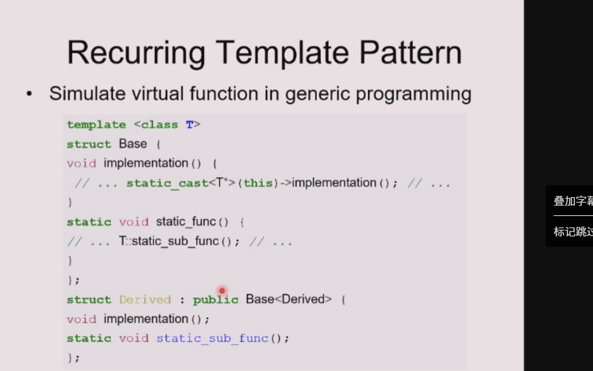

# C++ 模板 (Templates) 深入理解

## 什么是模板？

模板可以理解为代码的**“模具”或“图纸”**。在普通的编程中，我们将数据作为参数传递给函数；而在**泛型编程 (Generic Programming)** 中，我们将**“数据类型”**本身作为参数传递。

核心思想是**重用源代码**：只要一段逻辑与具体的数据类型无关，我们就可以把它写成模板，避免为每种数据类型都写一遍完全一样的代码。

主要分为两种：

### 1. 函数模板 (Function Template)

* **思想：** 算法核心逻辑相同，仅仅是需要处理的数据类型不同。比如排序函数 `sort`。
* **具体代码示例 (求最大值)：**

  ```cpp
  // 以前不用模板时：必须为每种类型写一个重载函数 (重复造轮子)
  int myMax(int a, int b) { return a > b ? a : b; }
  double myMax(double a, double b) { return a > b ? a : b; }

  // 使用函数模板：写一个通用的“模具”
  template <typename T>
  T myMax(T a, T b) {
      return a > b ? a : b;
  }

  // 调用时：
  int x = myMax(5, 10);         // 编译器自动根据参数把 T 替换为 int
  double y = myMax(3.14, 2.71); // 编译器自动把 T 替换为 double
  ```

### 2. 类模板 (Class Template)

* **思想：** 数据结构（如：栈 Stack、列表 List、队列 Queue）的操作逻辑和它里面装数字、字符还是复杂的自定义对象没有任何关系。
* **具体代码示例 (一个简单的通用“栈”/包装盒)：**

  ```cpp
  // 定义一个通用的盒子类，可以装任意类型 T 的内容
  template <class T>
  class Box {
  private:
      T content; // 盒子里装的内容，类型待定 (T)
  public:
      Box(T item) : content(item) {}
      T getContent() { return content; }
  };

  // 调用时：类模板通常需要显式指定类型 (<类型>)
  Box<int> intBox(100);             // 实例化一个装 int 的盒子
  Box<std::string> strBox("Hello"); // 实例化一个装 string 的盒子
  ```

* **模板成员函数：** 类模板内部的成员函数也可以灵活处理各种类型，其实现逻辑也可以与特定的参数类型分离开。

---

## 为什么我们需要使用模板？（痛点分析）

假设现在的业务需求是：我们需要一个专门存放 `X` 类型的列表，同时又需要一个存放 `Y` 类型的列表。
**现实情况是：** 这两个列表底层的基本操作（增、删、改、查）代码几乎一模一样，唯一的区别只是它们存放的**元素类型不同**。

如果不使用模板，我们通常有以下三种“笨方法”（Choices），它们各自存在致命的缺陷：

**1. 复制代码 (Clone code / 复制粘贴)**

* **做法：** 把 `X` 列表的代码复制一份，把里面所有的 `X` 替换成 `Y`。
* **优点：** 保证了类型安全（编译器知道里面装的是什么，不会出错）。
* **缺点：** 代码极难维护！如果列表代码里发现了一个 Bug，你必须在 `X` 列表、`Y` 列表等所有复制过的地方都去修改一遍。

**2. 借助共同的基类 (Require common base class)**

* **做法：** 让 `X` 和 `Y` 都继承自一个超类（比如 `Object`），然后我们只写一个存放 `Object` 的列表。
* **缺点：** 非常不灵活，过度设计。很多时候 `X` 和 `Y` 在业务上根本没有任何联系，强行让它们认同一个“爹”是不合理的。而且每次取出来的数据都需要进行强制类型转换。

**3. 使用无类型列表 (Untyped lists)**

* **做法：** 使用通用的指针（例如 C 语言里的 `void*`），让列表什么东西都能装下。
* **缺点：** **类型极其不安全 (Type unsafe)**！你可以往 `X` 列表里偷偷塞入一个不受控制的数据，编译器根本发现不了，这会导致程序在运行时直接崩溃。

**总结：**
由于以上三种方法都有明显的短板，**模板 (Templates)** 应运而生。它既完美实现了**代码的高效复用**（告别复制粘贴），又由编译器保证了绝对的**类型安全**（比 `void*` 和公共基类更可靠）。

---

## 深入理解函数模板 (Function Templates)

函数模板的核心作用是：**对不同类型的数据执行相同的操作。**

### 案例演进：Swap（值交换）函数

**1. 原始的痛点：**
假设我们要写一个交换两个整数变量的值的函数，代码非常简单：

```cpp
void swap(int& x, int& y) {
    int temp = x;
    x = y;
    y = temp;
}
```

**思考：** 但是问题来了！如果有一天我们不仅需要交换整数，还需要交换浮点数 (`float`)、字符串 (`string`)，甚至是自定义的货币 (`Currency`) 或是人员 (`Person`) 对象呢？难道要为每种类型都写一个重新拷贝一遍这个函数仅仅替换类型名吗？

**2. 模板来救场（解决方案）：**
使用函数模板，我们可以把“具体的类型”抽象成一个“参数”。通用版本的 `swap` 模板函数如下：

```cpp
template <class T>
void swap(T& x, T& y) {
    T temp = x;
    x = y;
    y = temp;
}
```

### 模板语法拆解

关于 `template <class T>` 的细节解释：

* **`template` 关键字：** 放在最前面，用来引出一个模板。等于是在告诉编译器：“注意了，下面这是一个通用模板，不是普通的函数”。
* **`<class T>` 参数化类型名：** 声明了一个名称为 `T` 的虚拟类型。
  * 这里的 `class` 并不是说只允许传入类对象，它的意思是**任何内置的类型（比如 `int`, `double`）或者是用户自定义的类型都可以**。（现代 C++ 中这里用 `typename T` 也是可以的，两者含义在这里相同）。
* **使用 `T` 的多重身份 (Parameter types represent)：** 这个虚拟类型 `T` 在函数模板内部可以扮演多种角色：
  1. **作为函数的参数类型**：例如 `void swap(T& x, T& y)`。
  2. **作为函数的返回值类型**：例如前面的求最大值模板 `T myMax(T a, T b)`。
  3. **用来在函数内部声明局部变量**：例如 `T temp = x;`。

---

## 模板的实例化 (Template Instantiation)

要记住一个核心概念：**模板本身并不是一个真正的函数或类，它只是一张“图纸”。** 只有当你在代码中实际**使用**它时，编译器才会真正生成对应的代码，这个过程就叫做**实例化 (Instantiation)**。

* **实例化的底层过程：**
  1. **类型绑定与替换 (Substitute)：** 编译器根据你传入的实际参数，推断出 `T` 究竟是什么类型，然后把模板里所有的 `T` 替换成这个具体的类型（比如 `int` 或 `float`）。
  2. **生成实体代码 (Create new body)：** 编译器根据替换后的类型，在后台默默为你生成一个对应类型的、独立的函数或类定义。
  3. **编译期检查 (Type checking)：** **非常重要！** 只有在实例化生成具体代码时，编译器才会进行严格的语法错误和类型匹配检查。
* **术语辨析：**
  * **Function Template (函数模板)：** 你写的那张含有 `T` 的“图纸”。
  * **Template Function (模板函数)：** 编译器根据图纸实例化出来的、具备具体类型（如 `int` 版本）的真正函数。
* **特化 (Specialization)：**
  有时候通用的模板逻辑并不适用于所有类型。比如你可以为某个特定类型（比如特定的指针类型）提供一个特殊版本的实现，这就叫“模板特化”。

### 代码实战：Swap 模板的调用与实例化演示

让我们看看在实际代码中如何无缝调用刚才写的 `swap` 函数模板：

```cpp
#include <iostream>
#include <string>

// ... 假设之前写好的 template <class T> void swap(T& x, T& y) 已经存在 ...

int main() {
    // 1. 整数交换
    int i = 3; int j = 4;
    swap(i, j);
    // 编译器看到参数是 int，于是自动实例化一个 T=int 的 swap 版本 (隐式调用)

    // 2. 浮点数交换
    float k = 4.5; float m = 3.7;
    swap(k, m);
    // 编译器自动实例化一个 T=float 的 float swap 版本

    // 3. 复杂对象（字符串）交换
    std::string s("Hello");
    std::string t("World");
    swap(s, t);
    // 编译器自动实例化一个 T=std::string 的 std::string swap 版本

    return 0;
}
```

**看，真正的魔法就在这里：** 我们只写了**一次**薄薄几行的 `swap` 模板代码，但它现在却能毫不费力地服务于**成百上千种**截然不同的数据结构！

---

## 模板与普通函数的“爱恨情仇” (Interactions & Overloading)

在 C++ 中，**模板函数和普通的函数是可以和平共存的 (coexist)**，甚至可以“同名”。这就引出了一个非常经典的问题：当它们混在一起时，编译器到底听谁的？

### 1. 模板的原则：绝不妥协 (严格匹配)

普通函数在参数不完全匹配时，可能会委曲求全进行自动类型转换（比如把 `int` 悄悄转成 `double`）。但**模板极其有原则，它只接受完全精确的类型匹配 (exact match)**！

它**绝对不包含任何隐式类型转换 (No conversion operations are applied)**。

例如对于我们写好的 `template <class T> void swap(T x, T y)` (假设传值方便理解)：

* `swap(int, int);`       // OK！ T = int
* `swap(double, double);` // OK！ T = double
* `swap(int, double);`    // **Error (报错)！**
  * *原因：* 编译器推导第一个参数觉得 T 应该是 `int`，看第二个参数觉得 T 应该是 `double`。大脑死机，直接报错！它绝对不会擅自把 `int` 转成 `double` 来迎合模板。

### 2. 编译器选秀规则 (Overloading rules)

当一个普通函数和一个模板函数同名时（重载），编译器有一套雷打不动的“按选优先级”流程：

* **第一步：黄金 VIP 通道 (普通函数的完美匹配)**
  * 优先查看有没有哪个普通函数，它的参数类型跟调用时的类型**完全一模一样**。如果有，直接用它！效率最高。
* **第二步：模板定制通道 (模板实例化完美匹配)**
  * 如果没有绝配的普通函数，就去看模板。如果模板能根据参数**实例化出一个完美匹配**的函数，那就用模板。
* **第三步：委曲求全通道 (普通函数的隐式转换)**
  * 如果模板也搞不定（比如遇到了上面的 `int, double` 类型不一样的情况模板罢工），那就退回到普通函数重载。看看普通函数能不能通过**隐式类型转换**勉强凑合着跑一跑。

### 代码实战：重载规则演示

这是一段非常有迷惑性的代码，非常适合当考题：

```cpp
// 1. 一个普通的函数，专门接收两个 float
void f(float i, float k) { /* ... */ }

// 2. 一个同名的模板函数，要求接收两个 "完全相同" 的类型 T
template <class T>
void f(T t, T u) { /* ... */ }

// 接下来我们开始调用，请猜猜分别调用了谁？

f(1.0, 2.0);
// 传进去的 1.0 和 2.0 在 C++ 里默认是 double 类型。
// 第一步查普通函数完美匹配？没有 (普通函数是 float)。
// 第二步查模板？模板可以实例化出 T=double 的 f(double, double)，完美匹配！
// 结论：👉 调用了模板函数！

f(1, 2);
// 参数是两个 int。
// 第一步找普通函数 f(int, int)？没有。
// 第二步找模板？模板实例化 T=int 的 f(int, int)，完美匹配！
// 结论：👉 调用了模板函数！

f(1, 2.0);
// 参数是一个 int 和一个 double。
// 第一步完美匹配？没有。
// 第二步查模板？模板要求两个参数类型一致(T, T)，现在一不一样，直接罢工报错。
// 第三步找普通函数凑合？普通 f(float, float) 说：“虽然参数类型不对，但你可以把 int 和 double 都隐式转换为 float 啊，我接了！”
// 结论：👉 调用了普通函数！
```

---

## 函数模板实例化的两种方式：隐式推导 vs 显式指定

编译器怎么知道模板里的 `T` 到底是个啥？有两种方式告诉它：

### 1. 隐式推导 (Implicit Deduction)

这是最常见的方式，就像前面用过的 `swap(i, j)` 或者 `f(1, 2)`。

* **规则：** 编译器非常聪明，它会直接观察你**传进去的实际参数**是什么类型，然后自动倒推出 `T` 应该是什么。不需要你多写任何废话。

### 2. 显式指定 (Explicit Instantiation)

有时候，编译器会遇到“无米之炊”的尴尬局面：**如果模板类型 `T` 压根就没有出现在函数的参数列表里怎么办？**
由于你在调用时没有传任何带有 `T` 类型的参数，编译器无从猜起，它就会直接报错。

此时，我们就必须手动（显式）告诉编译器这个 `T` 是什么：

* **语法：** 在函数名后面加上 `<具体的类型>`。
* **代码示例：**

```cpp
// 模板定义：参数列表里是个 void (没有参数)，但函数内部或返回值可能用到了 T
template <class T>
void foo(void) {
    /* 函数体内部使用了类型 T ... */
}

int main() {
    // 错误调用：foo();
    // 编译器哭诉：你什么都没传，我怎么猜 T 是 int 还是 double？

    // 正确调用：必须显式告诉编译器 T 是什么类型
    foo<int>();   // 显式指定此时 T 是 int
    foo<float>(); // 显式指定此时 T 是 float

    return 0;
}
```

*(注：这种显式指定的用法在比较现代的 C++ 编译器中是支持且必要的语法)*

---

## 深入理解类模板 (Class Templates)

讲完了函数模板，我们再来看看它的老大哥——**类模板**。
正如函数模板把参数类型给“抽象”出来一样，类模板则是用于**参数化类中的数据类型 (Classes parameterized by types)**。

### 1. 类模板的本质与优势

* **操作与数据类型解耦 (Abstract operations)：** 比如一个“动态数组”或者“栈”，它的扩张、缩小、压栈、出栈等**操作逻辑**跟它里面装的是苹果还是橘子无关。类模板成功地把“操作逻辑”和“被操作的类型”剥离开来。
* **一生万物：** 只要写好一个类模板，就等于定义了**潜在地无限多个不同的类**。需要什么类型的类，编译器就用模板帮你“印”出来。这是代码复用的又一大飞跃！
* **典型应用场景：容器类 (Container classes)**
  我们在 C++ 标准模板库(STL)中经常见到的东西，基本全都是类模板：

  * `stack<int>`：一个专门装整数的栈
  * `list<Person&>`：一个专门装人员引用（Person&）的链表
  * `queue<Job>`：一个专门处理任务（Job）的队列

### 2. 类模板代码实战：手写一个通用动态数组 (Vector)

我们来看一个经典例子：如果我们要自己写一个类似 `std::vector` 的通用动态数组，类模板该怎么写？

**第一步：定义类模板 (图纸)**

```cpp
template <class T>
class Vector {
public:
    // 构造函数，传入初始容量
    Vector(int size);
    // 析构函数，负责清理动态分配的内存
    ~Vector();
    // 拷贝构造函数
    Vector(const Vector&);
    // 赋值运算符重载
    Vector& operator=(const Vector&);
    // [] 下标运算符重载，返回 T 类型的引用，方便读写
    T& operator[](int index);

private:
    T* m_elements; // 指向堆内存中数组的指针，用来存任何 T 类型的数据
    int m_size;    // 数组当前的大小
};
```

**第二步：使用类模板 (实例化与调用)**
定义好了之后，我们在业务代码里如何使用这个 `Vector` 呢？与函数模板的隐式推导不同，**类模板在实例化时通常必须显式指定类型！**

```cpp
#include <iostream>

// 假设我们有一个专门处理复数的自定义类 Complex
class Complex { /* ... */ };

int main() {
    // 1. 实例化一个装整数的 Vector，容量为 100
    Vector<int> v1(100);

    // 2. 实例化一个装复数对象的 Vector，容量为 256
    Vector<Complex> v2(256);

    // 3. 具体的数据操作
    v1[20] = 10;            // 把 v1 的第21个元素赋值为 10 (int 类型)

    // ⚠️ 进阶思考：下面这行代码能跑通吗？
    v2[20] = v1[20];
    // 解释：v1[20] 取出来是一个 int，v2[20] 期望塞进去的是一个 Complex。
    // 这行代码是否合法(Ok)，完全取决于你的 Complex 类内部有没有定义【把 int 转换成 Complex】的方法（比如单参数的构造函数或重载的赋值运算符）。
    // 如果定义了转换，这就完全没问题！

    return 0;
}
```

---

## 模板的高阶进阶用法

除了上面最基础的用法，模板还有很多强大的进阶特性，让它的灵活性直接拉满：

### 1. 使用多个类型参数 (Multiple types)

模板不仅仅只能接受一个 `T`，它完全可以同时接受多个不同的类型参数。这在涉及“键值对”的场景（如字典、哈希表、Map）中属于标配。

```cpp
// 定义一个哈希表类，Key 是键的类型，Value 是值的类型
template <class Key, class Value>
class HashTable {
public:
    // 查找函数，传入键，返回值的引用
    const Value& lookup(const Key&) const;
    // 插入函数，传入键和值
    void install(const Key&, const Value&);
    // ...
};
```

### 2. 模板的嵌套与复杂类型 (Templates nest)

类模板在实例化之后，**本质上就已经变成了一个普普通通的、全新的数据类型**。所以，你完全可以把一个模板类当作另一个模板类的“参数”塞进去，这就是“嵌套”。

```cpp
// 嵌套：一个装满 "存储 double 指针的动态数组" 的大动态数组 (套娃)
Vector< vector<double*> > myNestedVector;
// ⚠️ 避坑小贴士：在早期的老版本 C++ 编译器中，嵌套模板最后的两个右尖括号 `> >` 之间必须加一个空格（否则会被误认作 `>>` 右移位运算符报错）。不过现代 C++11 及以后已经自动修复了这个问题。

// 类型参数甚至可以极其复杂，比如下面这个：装满特定类型【函数指针】的数组
Vector< int (*) (Vector<double>&, int) > myCrazyVector;
```

### 3. 非类型参数 / 表达式参数 (Non-Type / Expression parameters)

这是个非常容易被忽略的强大杀器！**模板的尖括号 `< >` 里面不仅可以传“数据类型（如 class T）”，还可以直接传“常量表达式（如具体的数字大小）”！** 而且非类型参数还能有**默认值**。

**典型应用示例：定义一个在栈上分配内存的、固定长度的高效数组。**

```cpp
// T 是类型参数。
// bounds 是一个非类型参数(值参数)，并且给了个默认值 100。
template <class T, int bounds = 100>
class FixedVector {
public:
    FixedVector();
    T& operator[](int);
private:
    // 💡 亮点在这里：因为 bounds 是在编译期就确定的常量，
    // 所以这就相当于直接在内部声明了一个固定大小的普通数组！
    // 内存直接分配在栈上，不用 new/delete，速度拔群！
    T elements[bounds]; // fixed size array!
};

// 实际使用：
FixedVector<int, 50> fv1;   // 实例化出一个容量固定为 50 的 int 数组
FixedVector<double>  fv2;   // 省略第二个参数，自动使用默认值，得到容量为 100 的 double 数组
```



这两张PPT讲的是C++模板的两个进阶话题：**CRTP（奇异递归模板模式）**和**模板的通用开发规范**，我结合你之前学的模板+继承知识，用大白话给你拆解得明明白白👇

---

## 一、第一张PPT：CRTP（奇异递归模板模式）

这是一个非常经典的模板设计模式，核心目的是**用「编译期静态绑定」模拟虚函数的多态行为，同时完全避免虚函数的运行时开销**。

### 1. 先看懂它的“奇怪”结构

```cpp
template <class T>
struct Base {
    void implementation() {
        // 核心：把this指针转成T*，调用子类的实现
        static_cast<T*>(this)->implementation();
    }
    static void static_func() {
        // 调用子类的静态方法
        T::static_sub_func();
    }
};

// 关键：子类Derived继承Base<Derived>，用自己作为模板参数传给基类
struct Derived : public Base<Derived> {
    void implementation(); // 子类实现自己的逻辑
    static void static_sub_func();
};
```

这个结构看起来像“自己继承了以自己为模板参数的基类”，所以叫**奇异递归模板模式（Curiously Recurring Template Pattern，CRTP）**。

### 2. 核心原理：怎么模拟虚函数？

你之前学的虚函数是「运行时动态绑定」，而CRTP是「编译期静态绑定」，原理是：

1.  当你写 `Derived d;` 时，编译器会实例化 `Base<Derived>` 模板类；
2.  在 `Base<Derived>` 的 `implementation()` 里，`this` 指针的类型是 `Base<Derived>*`；
3.  `static_cast<T*>(this)` 把它转成 `Derived*`（因为 `T` 就是 `Derived`），直接指向子类对象；
4.  调用 `Derived::implementation()`，**编译期就已经确定了调用的是子类的方法**，不需要虚函数表，也没有运行时开销。

### 3. 和虚函数的对比

| 特性 | CRTP（静态多态） | 虚函数（动态多态） |
| :--- | :--- | :--- |
| 绑定时机 | 编译期 | 运行时 |
| 开销 | 无虚函数表、无运行时查找开销 | 有虚函数表、运行时查找开销 |
| 灵活性 | 只能处理固定的继承关系 | 支持任意派生类的多态 |
| 适用场景 | 追求极致性能、且继承关系固定的场景 | 通用的、需要运行时多态的场景 |

### 4. 常见用途

- 给子类提供统一的基类接口，同时避免虚函数开销（比如标准库的`std::enable_shared_from_this`就是CRTP的典型应用）；
- 实现编译期的静态多态，比如给模板类扩展功能（如`operator++`的实现）。

---

## 二、第二张PPT：模板开发的通用注意事项

这部分是写模板代码时的「避坑指南」，尤其是你以后写项目时，能避免很多链接错误和维护问题：

### 1. `friends` 和 `static members`

- **模板类的友元**：模板类的友元声明需要注意作用域，比如如果友元是函数模板，需要提前声明，否则编译器可能找不到；
- **模板类的静态成员**：每个模板实例化版本都有自己独立的静态成员，互不干扰。比如 `Vector<int>` 和 `Vector<double>` 的静态成员是完全分开的，不会共享数据。

### 2. 核心重点：模板的声明和定义必须放在头文件里

PPT里这句话是新手最容易踩的坑：
> `In general put the definition and the declaration for the template in the header file`

#### 为什么必须这么做？

模板是「编译期蓝图」，只有当你用具体类型实例化时，编译器才会生成对应的类/函数代码。如果把模板的实现（定义）放在`.cpp`文件里：

- 其他文件实例化模板时，编译器看不到完整的实现，无法生成对应的代码；
- 链接时会出现`undefined reference`错误，找不到模板实例化的函数。

#### 为什么不会出现“重复定义”？

PPT里也提到了：

- 模板不会在头文件里为每个实例化版本分配存储；
- 编译器/链接器会自动处理多个定义，每个模板实例化版本只会保留一份，不会导致链接错误。

#### 错误做法（千万别学）

```cpp
// 头文件 Vector.h
template <class T>
class Vector {
public:
    T& operator[](int i);
};

// 实现文件 Vector.cpp
template <class T>
T& Vector<T>::operator[](int i) {
    return elements[i];
}
```

当你在其他文件用 `Vector<int> v; v[0];` 时，编译器看不到`operator[]`的实现，会直接链接失败。

---

## 一句话总结

- CRTP是用「模板+继承」实现的编译期静态多态，模拟虚函数的同时，完全避免运行时开销；
- 模板代码的声明和定义必须都放在头文件里，否则会出现链接错误，这是模板开发的核心规范。
