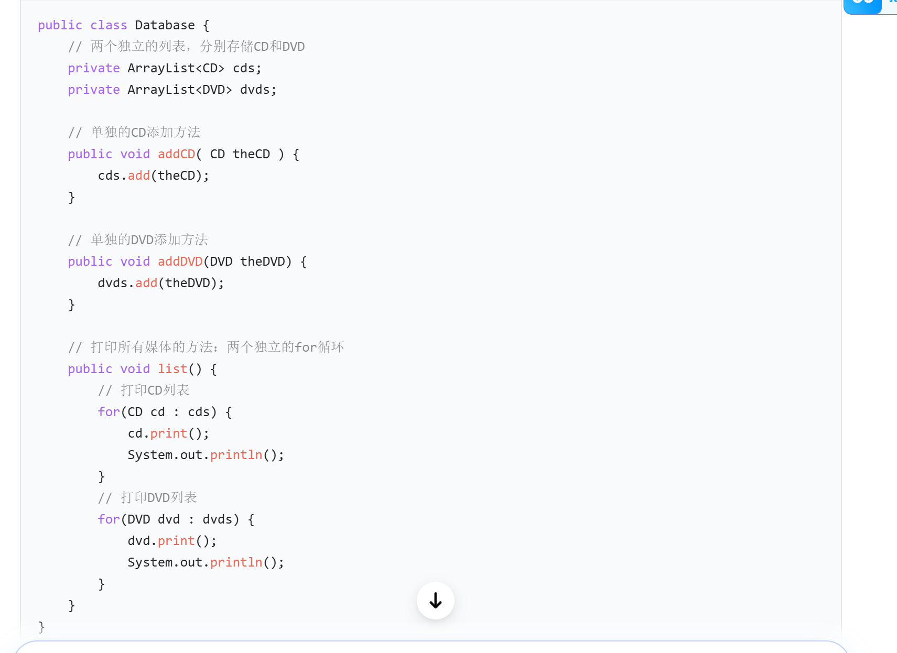
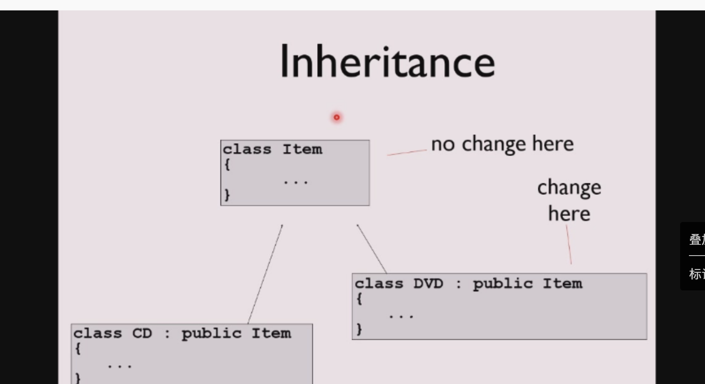
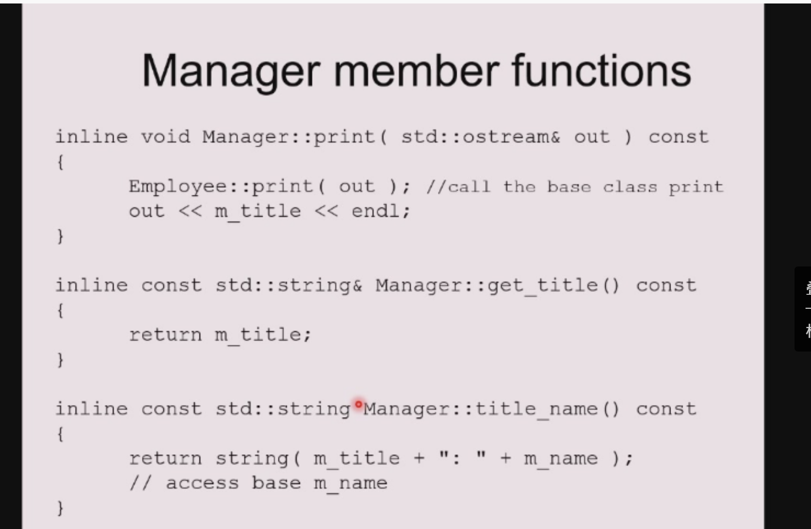

# 继承和组合

## 组合

这组PPT完整讲解了**面向对象编程（OOP）中，通过「组合（Composition）」实现代码复用的核心思想、原理、实现方式与实际案例**，下面分模块给你拆解清楚：

---

## 一、核心主题：OOP中的代码复用

面向对象编程有两种最核心的代码复用手段：

- **继承（Inheritance）**：对应「is-a（是一个）」关系（比如`Dog is a Animal`，子类继承父类）
- **组合（Composition）**：对应「has-a（有一个）」关系（比如`Car has a Engine`，用已有对象构建新对象）

这组PPT的核心，就是讲解**组合（Composition）**这种代码复用方式。

---

## 二、组合的基础定义与核心特性

### 第2-3页：组合的本质与关系

1.  **组合的本质**
    > *Objects can be used to build up other objects*
    用**已经存在的、可复用的小对象/类，来构建新的大对象/类**，把小类作为大类的组成部分，从而复用小类的代码。

2.  **关系类型：has-a（“有一个”）**
    组合描述的是「整体-部分」的关系，比如：

    - 汽车（`Car`）有一个引擎（`Engine`）、有轮胎（`Tyre`）
    - 员工（`Employee`）有姓名、地址、医保、薪资历史、上级（也是员工）
    - 储蓄账户（`SavingsAccount`）有储户、有余额

3.  **两种包含方式**
    | 包含方式 | 语义 | 生命周期 | 特点 |
    |---|---|---|---|
    | 完全包含（Fully） | 值语义 | 子对象和父对象绑定，父对象销毁则子对象销毁 | 强归属，比如账户的余额属于账户本身 |
    | 按引用包含（By reference） | 引用语义 | 子对象生命周期独立，可被多个对象共享 | 灵活共享，比如多个员工共享同一个上级对象 |

---

## 三、组合的实际运行结构（第4页）

这一页用`Employee`类做了直观演示：

- **类（Classes）层面**：`Employee`类定义了`Name`、`Address`、`HealthPlan`、`Salary History`、`Supervisor`这些成员，本质是把这些小类组合成`Employee`类。
- **实例（Instances）层面**：`Henry Higgins`这个员工实例，内部包含了`raises`（薪资历史对象）、`home address`（地址对象）、`YAHMO`（医保对象）；同时`Supervisor`是指向`Bill C.`这个员工实例的**引用**（按引用包含，实现对象共享）。

---

## 四、代码实例：C++实现组合（第5-6页）

用`SavingsAccount`（储蓄账户）类，展示组合的代码落地：

### 第5页：类定义

```cpp
class Person { ... };    // 已有的「人」类
class Currency { ... };  // 已有的「货币/金额」类

class SavingsAccount {
public:
    SavingsAccount( const char* name, const char* address, int cents);
    ~SavingsAccount();
    void print();
private:
    Person m_saver;    // 组合：储蓄账户「有一个」储户（Person对象，完全包含）
    Currency m_balance;// 组合：储蓄账户「有一个」余额（Currency对象，完全包含）
};
```

这里`SavingsAccount`完全复用了`Person`和`Currency`的代码，不需要重新实现「人」和「金额」的逻辑。

### 第6页：构造与方法实现

```cpp
// 构造函数：用初始化列表初始化子对象，复用Person和Currency的构造逻辑
SavingsAccount::SavingsAccount(const char* name, const char* address, int cents):
    m_saver(name, address), m_balance(0, cents)
{}

// print方法：直接复用子对象的print()，完全不需要自己实现打印逻辑
void SavingsAccount::print()
{
    m_saver.print();  // 调用Person的print，打印储户信息
    m_balance.print();// 调用Currency的print，打印余额
}
```

这就是组合实现代码复用的核心：**直接复用已有类的功能，不需要重复编写逻辑**。

---

## 五、补充：组合 vs 继承（设计原则）

在OOP设计中，有一条经典原则：**优先使用组合，而非继承（Favor composition over inheritance）**

- 继承是「白盒复用」：子类可以看到父类的内部实现，耦合度高，容易破坏封装
- 组合是「黑盒复用」：只需要调用子对象的接口，完全不关心内部实现，耦合度低，更灵活
- 组合更符合「开闭原则」，避免继承带来的菱形继承、紧耦合等问题

---

## 总结

这组PPT完整讲解了OOP中**组合（Composition）**的核心：

- 用「has-a」的整体-部分关系，用已有对象构建新对象
- 两种包含方式（完全包含/引用包含）的特性
- 从类设计、运行时结构到C++代码的完整实例
- 本质是通过复用已有类的实现，避免重复代码，提升代码可维护性

## 组合进一步讲解

这3页PPT是**承接之前的「组合(Composition)」主题**，深入讲解C++中用组合实现类时，**嵌入对象（也就是作为成员的子对象）的核心细节**，包括初始化规则、两种初始化方式的差异，以及访问权限的设计原则。

---

## 一、逐页拆解核心内容

### 第1页：Embedded objects（嵌入对象的初始化规则）

这一页讲透了C++组合中子对象初始化的底层强制规则：

1.  **所有嵌入对象一定会被初始化**
    作为类成员的子对象，绝对不会出现“未初始化”的状态：

    - 如果你**没有在初始化列表给子对象传参**，且子对象有默认构造函数（或编译器能自动生成默认构造），C++会**自动调用子对象的默认构造函数**完成初始化。
    - 如果子对象没有默认构造函数，你又没写初始化列表，代码直接编译报错。

2.  **初始化列表（Initialization List）的作用**
    构造函数可以添加「初始化列表」（就是你之前问的`m_saver(name, address), m_balance(0, cents)`部分）：

    - 支持任意多个子对象，用逗号分隔
    - 语法上标注为“可选”，但实际是**推荐/必要写法**：它的核心作用是**直接给子对象的构造函数传参，用带参构造一次性完成子对象的初始化**
    - 标准语法：`类名(参数) : 初始化列表 { 函数体 }`

---

### 第2页：Question（两种初始化方式的对比）

这一页用反例，对比「不用初始化列表，用setter赋值」的问题，帮你理解为什么初始化列表是最佳实践：

#### 反例代码

```cpp
SavingsAccount::SavingsAccount(const char* name, const char* address, int cents ) {
    m_saver.set_name( name );
    m_saver.set_address( address );
    m_balance.set_cents( cents );
}
```

#### 核心结论：`Default constructors would be called`（默认构造会被调用）

当你**不写初始化列表**时，C++的执行顺序是：

1.  先自动调用`m_saver`（`Person`类）的**默认构造函数**，创建一个默认的`Person`对象
2.  再自动调用`m_balance`（`Currency`类）的**默认构造函数**，创建一个默认的`Currency`对象
3.  最后进入构造函数体，执行`set_name`/`set_address`/`set_cents`，给已经创建好的子对象**赋值**

🔴 这种写法的3个核心问题：

- **效率极低**：子对象被初始化了两次（一次默认构造，一次赋值），产生完全不必要的开销
- **兼容性差**：如果`Person`/`Currency`类**没有默认构造函数**，这段代码直接编译失败
- **不安全**：如果子对象的默认构造有副作用（比如申请资源），会造成资源浪费

✅ 对比之前的初始化列表写法：

```cpp
SavingsAccount::SavingsAccount(...) : m_saver(name, address), m_balance(0, cents) {}
```

直接用带参构造**一次性创建子对象**，没有多余步骤，效率高，完美兼容无默认构造的子对象，是C++组合类的标准写法。

---

### 第3页：Public vs. Private（嵌入对象的访问权限设计）

这一页讲组合中子对象的**封装原则**，是面向对象设计的核心细节：

1.  **推荐做法：把嵌入对象设为`private`**
    - 核心理由：子对象是类的「底层实现细节」，不应该暴露给外部使用者
    - 新类（比如`SavingsAccount`）只需要暴露子对象的**部分接口**，而不是全部。把成员设为`private`后，外部不能直接操作子对象，只能通过`SavingsAccount`自己写的`public`方法间接操作，实现严格的封装。
    - 例如：`SavingsAccount`可以只暴露`set_saver_name()`，而不暴露`set_address()`，精准控制权限。

2.  **可选做法：把嵌入对象设为`public`**
    - 适用场景：如果你想让新类**直接拥有子对象的全部`public`接口**，可以把子对象设为`public`
    - 例子：把`Person m_saver`设为`public`后，外部可以直接写`account.m_saver.set_name("Fred")`，直接调用`Person`类的方法
    - ⚠️ 致命缺点：**彻底破坏封装**，外部可以直接修改子对象的内部状态，违反面向对象的封装原则，仅在极简单场景/特殊设计（如代理模式）中使用，业务类绝对不推荐。

---

## 二、核心总结&最佳实践

1.  **初始化的铁律**：组合类的构造函数**必须用初始化列表初始化子对象**，绝对不要在构造函数体里用`setter`赋值，避免两次初始化的开销，同时兼容无默认构造的子对象。
2.  **封装的铁律**：嵌入的子对象**一律设为`private`**，通过外部类的`public`方法间接操作，保护内部实现，控制接口暴露。
3.  **底层原理**：C++中，成员对象的初始化**永远在构造函数体执行之前完成**，初始化列表是控制成员初始化的唯一方式，构造函数体只能做赋值，不能做初始化。

---

## 三、补充细节（你可能关心的延伸）

- 为什么初始化列表是「初始化」，构造函数体是「赋值」？
  初始化是对象创建时的第一次赋值，是对象诞生的必要步骤；赋值是对象已经创建后修改值。对于没有默认构造的类，只能通过初始化列表初始化，因为对象创建时必须有参数，不能先默认创建再赋值。

- 什么时候可以用`public`子对象？
  仅在极简单的工具类（比如`Point`类的`x`/`y`成员）中使用，业务类（账户、员工、数据结构等）一律用`private`封装。

## 继承

这6页PPT是**面向对象编程（OOP）中「继承（Inheritance）」的完整入门讲解**，分为两大核心模块，我给你拆解得明明白白：

---

## 一、模块1：继承的理论基础（前3页）

这三页讲透了继承的**定义、本质、核心价值**，是理解继承的根基。

### 第1页：继承的顶层定位

这一页给继承做了权威定义：

- 它既是**编程语言的实现技术**（C++的核心语法特性），也是**面向对象设计方法论的核心组件**
- 核心作用：**复用与共享设计**，可复用的内容包括：
  - 成员数据（类的属性/成员变量）
  - 成员函数（类的方法/行为）
  - 接口（类对外暴露的调用规范）
- 是C++实现面向对象的三大核心特性之一（另外两个是封装、多态）

### 第2页：继承的「接口复用」+ 经典Shape示例

这一页用最经典的「形状」案例，讲继承的核心逻辑：

- 定义：**继承 = 复用已有类的设计，克隆一份后做扩展/修改**
- 示例拆解：
  - 父类`Shape`（所有形状的抽象）：定义了所有形状都需要的通用接口`draw()`（绘制）、`erase()`（擦除）
  - 子类`Circle`（圆形）、`Square`（正方形）、`Line`（线段）：**继承`Shape`的接口**，然后各自重写（override）符合自己形状的`draw()`/`erase()`实现
- 补充：图中的空心三角箭头是UML类图中「继承」的标准符号，箭头指向父类，表示子类继承自父类
- 核心价值：**统一接口，差异化实现**，为多态打下基础（比如用`Shape*`指针可以指向任意子类对象，统一调用`draw()`，自动执行对应子类的绘制逻辑）

### 第3页：继承的「is-a关系」本质 + 集合视角

这一页用更直观的方式讲透继承的本质：

- 定义：**子类是父类的「超集（superset）」** —— 子类包含父类的所有属性/行为，还可以新增自己的特性
- 示例：`Person`（人）和`Student`（学生）
  - 学生**是一种人**（严格的`is-a`关系），所以`Student`继承`Person`
  - `Student`拥有`Person`的所有属性（姓名、年龄、地址等），还新增了自己的属性（学号、专业、成绩等）
- 韦恩图的含义：大圈是`Student`，小圈是`Person`，`Student`完全包含`Person`的范围，完美对应「子类是父类的超集」的定义
- 核心铁律：**继承的唯一合理使用场景，就是严格的「is-a（是一种）」关系**，这是它和组合（`has-a`，有一个）的核心区别

---

## 二、模块2：继承的实际应用（后3页：DoME案例）

这三页用一个真实的业务场景，展示「为什么要用继承」，解决实际的代码冗余问题。

### 第4页：业务背景：DoME应用

- DoME是一个**CD/DVD信息管理工具**，核心功能：
  - 录入CD、DVD的详细信息
  - 按艺术家搜索所有CD、按导演搜索所有DVD等
- 接下来的两页，分别定义了`CD`和`DVD`类的属性，我们来对比它们的共性和差异：

### 第5页：`CD`类的属性

- 专辑标题（title）
- 艺术家（artist，乐队/歌手名）
- 曲目数量（number of tracks）
- 总播放时长（total playing time）
- 是否拥有（`got it`标记，记录是否自己有这个CD）
- 评论（comment，任意文本）

### 第6页：`DVD`类的属性

- DVD标题（title）
- 导演名（director）
- 主片播放时长（playing time）
- 是否拥有（`got it`标记，记录是否自己有这个DVD）
- 评论（comment，任意文本）

---

## 三、案例的核心设计逻辑：用继承消除代码冗余

我们来对比`CD`和`DVD`的属性，一眼就能看出问题：

| 共性属性（完全重复，冗余） | CD特有属性 | DVD特有属性 |
|----------------------|------------|-------------|
| 标题（title）        | 艺术家（artist） | 导演（director） |
| 播放时长（playing time） | 曲目数量（tracks） | - |
| 是否拥有（got it）   | -          | - |
| 评论（comment）      | -          | - |

### 最优设计方案（用继承）：

1.  **提取共性，创建父类`MediaItem`（媒体条目）**
    把CD和DVD都有的属性（标题、时长、got it、评论）放到父类`MediaItem`中，写一次代码，永久复用。

2.  **创建子类`CD`和`DVD`，继承`MediaItem`**
    - `CD`继承`MediaItem`的所有属性，再新增自己的特有属性（艺术家、曲目数）
    - `DVD`继承`MediaItem`的所有属性，再新增自己的特有属性（导演）
3.  **核心收益**
    - 完全消除重复代码：不用在`CD`和`DVD`里各写一遍标题、时长、got it、评论的属性和方法
    - 统一接口：可以用`MediaItem*`指针统一管理所有CD/DVD，实现统一的搜索、打印、存储逻辑
    - 可维护性：如果要修改「评论」的逻辑，只需要改父类`MediaItem`，所有子类自动生效，不用改`CD`和`DVD`

---

## 四、核心总结 & 延伸知识点

### 1. 继承 vs 组合：一句话分清

| 特性 | 继承（Inheritance） | 组合（Composition） |
|------|----------------------|----------------------|
| 关系 | `is-a`（我是你的一种） | `has-a`（我有一个） |
| 代码特征 | 类名后写`: public 父类` | 类内部定义其他类的成员变量 |
| 适用场景 | 类的层级抽象（学生是人、CD是媒体） | 用小对象组装大对象（汽车有引擎、账户有储户） |
| 耦合度 | 高（子类依赖父类实现） | 低（仅依赖子对象接口） |

### 2. 继承的经典设计原则

- **优先使用组合，而非继承（Favor composition over inheritance）**：只有当严格满足`is-a`关系时，才用继承；否则用组合，避免继承带来的紧耦合问题
- **里氏替换原则（LSP）**：子类对象必须可以完全替换父类对象，程序逻辑不受影响（比如：所有`Student`都可以当`Person`用，所有`CD`都可以当`MediaItem`用）

### 3. 补充：这个案例的C++代码示例（直观理解）

```cpp
// 父类：MediaItem，提取所有媒体的共性
class MediaItem {
public:
    std::string title;
    int playingTime;
    bool gotIt;
    std::string comment;
    void print() { /* 通用打印逻辑，写一次即可 */ }
};

// 子类：CD，继承MediaItem，加自己的特有属性
class CD : public MediaItem {
public:
    std::string artist;
    int trackCount;
    // 自动继承了title/playingTime/gotIt/comment/print()，无需重复编写
};

// 子类：DVD，继承MediaItem，加自己的特有属性
class DVD : public MediaItem {
public:
    std::string director;
    // 自动继承了title/playingTime/gotIt/comment/print()，无需重复编写
};
```

**有个经典例子和代码 可以看ppt**

这组PPT是**DoME（CD/DVD媒体管理系统）用继承重构后的「最终优化效果」+「扩展性演示」+「继承层级深化」**，完整展示了继承如何彻底解决代码冗余、提升系统可维护性和扩展性，是面向对象设计的经典实践。

---

## 逐页拆解核心内容

### 第1页：Database v2.0（继承优化后的核心代码）

这是用**继承+多态**重构后的`Database`类核心Java代码：

```java
// 统一添加方法：参数是父类Item，所有子类（CD/DVD/新类型）都能传入
public void addItem(Item theItem) {
    items.add(theItem); // items是ArrayList<Item>，统一存储所有媒体
}

/**
 * Print a list of all currently stored items to the text terminal.
 */
public void list() {
    // 统一遍历：一个循环搞定所有类型的媒体
    for(Item item : items){
        item.print(); // 多态：自动调用item真实类型（CD/DVD）的print方法
        System.out.println(); // 条目间空行分隔
    }
}
```

核心变化：

- 把原来的两个独立列表`cds`/`dvds`，合并成**一个统一列表`items`**（类型`ArrayList<Item>`）
- 把原来的两个添加方法、两个打印循环，简化成**一个添加方法、一个打印循环**
- 代码量直接减半，逻辑完全统一

---

### 第2页：添加方法的「前后对比」

- **左：旧版v1.0（无继承）**：为CD、DVD分别写独立的添加方法，逻辑完全重复

  ```java
  public void addCD(CD theCD) { cds.add(theCD); }
  public void addDVD(DVD theDVD) { dvds.add(theDVD); }
  ```

- **右：新版v2.0（有继承）**：一个方法永久复用，利用**多态**，父类`Item`可以接收所有子类对象（CD/DVD/新类型）

  ```java
  public void addItem(Item theItem) { items.add(theItem); }
  ```

核心差异：旧版每新增一种媒体就要加新方法，新版无需修改，直接兼容所有子类。

---

### 第3页：打印方法的「前后对比」

- **左：旧版v1.0（无继承）**：两个独立循环，分别打印CD、DVD，逻辑重复

  ```java
  public void list() {
    for(CD cd : cds) { cd.print(); System.out.println(); } // 打印CD
    for(DVD dvd : dvds) { dvd.print(); System.out.println(); } // 打印DVD
  }
  ```

- **右：新版v2.0（有继承）**：一个循环，利用**多态动态绑定**，自动适配所有子类的`print`方法

  ```java
  public void list() {
    for(Item item:items){
      item.print(); // 自动识别是CD还是DVD，调用对应实现
      System.out.println();
    }
  }
  ```

核心差异：旧版新增媒体要加新循环，新版一个循环永久生效，无需修改。

---

### 第4页：Adding other item types（继承带来的「无限扩展性」）

这一页完美实践了**开闭原则（Open/Closed Principle）**：

- 父类`Item`封装所有媒体的共性（`title`/`playingTime`/`gotIt`/`comment`和通用方法）
- 新增媒体类型（比如`VideoGame`电子游戏），**只需要新建`VideoGame`子类，继承`Item`，添加自己的特有属性（`numberOfPlayers`玩家数、`platform`平台）**
- `Database`类**完全不需要修改任何代码**！因为`addItem`和`list`只和`Item`打交道，`VideoGame`作为子类直接就能被管理

这就是继承的核心价值：**对扩展开放（新增类型），对修改关闭（不改已有代码）**，系统扩展性拉满。

---

### 第5页：Deeper hierarchies（「多层继承」进一步提取共性）

这一页展示了继承层级可以**多层嵌套**，精细化代码复用：

- 顶层父类`Item`：所有媒体的共性
- 中间父类`Game`：继承`Item`，提取「游戏类媒体」的共性（比如`numberOfPlayers`玩家数）
- 子类`VideoGame`/`BoardGame`：继承`Game`，分别添加自己的特有属性（如`VideoGame`的平台、`BoardGame`的桌游类型）

好处：

- 进一步消除冗余：不用在`VideoGame`和`BoardGame`里重复写`numberOfPlayers`
- 层级更清晰：符合「媒体→游戏→电子游戏/桌游」的真实分类逻辑
- 可维护性更高：修改游戏类共性逻辑，只改中间父类`Game`，所有子类自动生效

---

## 核心总结：继承给系统带来的质变

| 维度 | 无继承（v1.0） | 有继承（v2.0） |
|------|----------------|----------------|
| 代码量 | 冗余（两套列表、两套方法、两套循环） | 精简（一套列表、一套方法、一套循环） |
| 维护性 | 改逻辑要改多处（CD/DVD/Database） | 改逻辑只改父类，所有子类自动生效 |
| 扩展性 | 新增类型要改Database，代码爆炸 | 新增类型只加子类，Database完全不动 |
| 逻辑 | 割裂（CD和DVD是两个独立世界） | 统一（所有媒体都是Item，统一管理） |
| 设计原则 | 违反开闭原则 | 完美符合开闭原则 |

---

## 关键概念补充

1.  **多态（Polymorphism）**：父类引用（`Item item`）可以指向子类对象，调用方法时自动执行子类的实现，是继承的核心灵魂。
2.  **开闭原则**：面向对象设计的核心原则，「对扩展开放，对修改关闭」，继承是实现该原则的核心手段。
3.  **多层继承**：继承可按业务逻辑分层，逐层提取共性，进一步减少冗余，让类结构更贴合真实世界。



这个原来麻烦的代码

---

## 继承具体使用

这组PPT是**C++中「继承（Inheritance）」的完整落地示例**，用「普通员工(Employee) → 经理(Manager)」的经典`is-a`（是一种）关系，完整演示了从**父类定义、构造、成员函数实现，到子类继承、构造、重写方法**的全流程，是面向对象继承的标准教学案例。

### 第1页：声明父类 `Employee`

这是所有员工的**抽象父类**，封装所有员工的共性属性和行为：

```cpp
class Employee {
public:
    // 构造函数：初始化姓名、社保号(SSN)
    Employee( const std::string& name, const std::string& ssn );
    // 获取姓名（const保证不修改成员）
    const std::string& get_name() const;
    // 两个重载的print方法：一个仅打印信息，一个带自定义消息
    void print(std::ostream& out) const;
    void print(std::ostream& out, const std::string& msg) const;
protected:
    // 保护成员：子类可直接访问，外部不可访问（继承场景的标准权限）
    std::string m_name;  // 员工姓名
    std::string m_ssn;   // 社保号
};
```

- **访问权限设计**：
  - `public`：对外暴露的接口，供外部调用
  - `protected`：专门给子类用，既保证封装（外部不能改），又让子类能直接继承使用
- **核心作用**：把所有员工的共性（姓名、社保号、打印方法）抽成父类，供子类复用

---

### 第2页：`Employee` 构造函数实现

这是父类构造函数的**标准写法**，用「成员初始化列表」完成初始化：

```cpp
Employee::Employee( const string& name, const string& ssn )
: m_name(name), m_ssn( ssn)  // 成员初始化列表
{
    // 初始化列表已经完成所有赋值，函数体为空
}
```

- **关键原理**：
  1.  C++中**成员变量的初始化永远在构造函数体执行之前完成**，初始化列表是直接调用成员的构造函数，效率远高于在函数体内赋值
  2.  注释明确说明：`initializer list sets up the values`，所有初始化工作在列表中完成
  3.  对于无默认构造的成员，必须用初始化列表初始化（这里`string`有默认构造，但这是C++最佳实践）

---

### 第3页：`Employee` 成员函数实现

实现父类的接口，包含**内联函数、函数重载、代码复用**：

```cpp
// inline：小函数用内联，优化性能，可放在头文件中
inline const std::string& Employee::get_name() const
{
    return m_name;
}

inline void Employee::print( std::ostream& out ) const
{
    out << m_name << endl;
    out << m_ssn << endl;
}

// 函数重载：同名、不同参数，复用已有print逻辑
inline void Employee::print(std::ostream& out, const std::string& msg) const
{
    out << msg << endl;
    print(out); // 调用单参数print，避免重复代码
}
```

- **核心细节**：
  - `inline`：小函数用内联，消除函数调用开销，适合头文件中实现
  - `const`成员函数：保证不会修改类的成员，是只读方法的标准写法
  - **函数重载(Overload)**：两个`print`同名但参数不同，实现不同功能，同时复用代码
  - 第二个`print`调用单参数`print`，体现代码复用，避免重复写打印逻辑

---

### 第4页：定义子类 `Manager`（继承`Employee`）

经理是「一种员工」，所以用**公有继承(`public Employee`)**实现`is-a`关系，仅需实现自己特有的逻辑：

```cpp
// 公有继承：Manager is a Employee，继承父类所有public/protected成员
class Manager : public Employee {
public:
    // 构造函数：参数包含父类需要的name/ssn，加自己的title（职位）
    Manager(const std::string& name, const std::string& ssn, const std::string& title);
    // 子类自己的方法：操作职位
    const std::string title_name() const;
    const std::string& get_title() const;
    // 重写(Override)父类的print方法：实现经理专属的打印逻辑
    void print(std::ostream& out) const;
private:
    std::string m_title; // 子类特有成员：职位（如"部门经理"）
};
```

- **继承的核心价值**：
  - `Manager`完全复用`Employee`的`m_name`/`m_ssn`/`get_name()`/带消息的`print()`，无需重复编写
  - 仅需实现自己特有的`m_title`和相关方法，代码量大幅减少
  - 符合「里氏替换原则」：`Manager`对象可以完全替代`Employee`对象使用
- **语法说明**：`public`继承是`is-a`关系的唯一正确写法，`private/protected`继承不体现`is-a`，极少使用

---

### 第5页：继承中的构造函数原理 + `Manager`构造实现

这是继承最核心的细节：**子类构造必须先构造父类部分**

#### 原理说明

- `Think of inherited traits as an embedded object`：把继承的父类部分，当成子类对象中「嵌入的子对象」（子类对象包含完整的父类对象）
- `Base class is mentioned by class name`：子类初始化列表中，用父类名显式调用父类构造函数

#### `Manager`构造函数代码

```cpp
Manager::Manager( const string& name, const string& ssn, const string& title = "" )
:Employee(name, ssn), m_title( title )  // 先调用父类构造，再初始化子类成员
{
    // 所有初始化在列表完成，函数体为空
}
```

- **构造执行顺序（C++强制规则）**：
  1.  先调用**父类`Employee`的构造函数**，初始化父类的`m_name`/`m_ssn`
  2.  再初始化子类自己的成员`m_title`
  3.  最后执行子类构造函数体（这里为空）
- **关键注意点**：
  - 父类`Employee`没有默认构造函数（只有带参构造），因此子类**必须显式调用父类构造**，否则编译报错
  - 若父类有默认构造，可省略父类构造调用，编译器自动调用默认构造，但显式调用是最佳实践

---

## 核心知识点总结

| 知识点 | 说明 |
|--------|------|
| **`is-a`关系** | 继承的唯一合理使用场景：`Manager is a Employee`，用`public`继承实现 |
| **访问权限** | 父类用`protected`成员，让子类可访问、外部不可访问，平衡封装与继承 |
| **构造顺序** | 子类构造 → 先父类构造 → 再子类成员初始化 → 最后子类构造体 |
| **初始化列表** | 父类构造必须在列表中调用，成员初始化用列表效率更高 |
| **代码复用** | 子类继承父类所有成员/方法，仅需实现特有逻辑，消除冗余 |
| **函数重写(Override)** | 子类重新实现父类同名同参数方法，是多态的核心基础 |
| **内联函数** | 小函数用`inline`优化性能，适合头文件中实现 |

---

## 补充：继承 vs 组合（呼应你之前的问题）

- **继承(`is-a`)**：`Manager`是一种`Employee`，复用父类的接口和实现，耦合度高
- **组合(`has-a`)**：`Manager`有一个`Employee`，把`Employee`作为成员，耦合度低
- 本案例用继承是因为严格符合`is-a`关系，是继承的标准使用场景；若仅需复用功能，优先用组合



## 继承进一步教学

这组PPT是**C++面向对象「继承（Inheritance）」的完整实战教学**，用「员工(Employee) → 经理(Manager)」的经典`is-a`（是一种）关系，从**类定义、成员实现、构造/析构规则、方法重写，到实际使用**，完整覆盖了继承的核心语法、底层原理、最佳实践和常见踩坑点，是C++继承的标准入门+进阶内容。

---

## 一、逐页拆解核心内容

### 第1页：More on constructors（继承中构造/析构的C++铁律）

这是继承最核心的底层规则，C++强制遵守：

1.  **父类永远先构造**：创建子类对象时，**必须先调用父类的构造函数**，初始化父类部分，再初始化子类的成员，最后执行子类的构造函数体。
    - 对应`Manager`的构造：先调用`Employee(name, ssn)`构造员工部分，再初始化`m_title`，最后执行子类构造（空）。
2.  **未显式调用父类构造 → 自动调用默认构造**：如果子类的初始化列表没写父类构造，C++会自动调用父类的**无参默认构造函数**。
    - 关键：如果父类没有默认构造（比如`Employee`只有带参构造），子类**必须显式调用父类带参构造**，否则直接编译报错！
3.  **析构顺序与构造完全相反**：销毁对象时，**先调用子类的析构函数**，再调用父类的析构函数，保证资源安全释放（比如子类申请的资源先释放，再释放父类的）。

---

### 第2页：Manager member functions（子类Manager的成员实现）

这是子类继承后的核心代码，展示**方法重写、代码复用、父类成员访问**：

```cpp
// 1. 重写父类的print方法（Override）
inline void Manager::print( std::ostream& out ) const
{
    Employee::print( out ); // 【关键】先调用父类的print，复用员工信息的打印逻辑
    out << m_title << endl; // 再打印子类特有的职位
}

// 2. get_title()：和get_name()完全一致的标准getter
inline const std::string& Manager::get_title() const
{
    return m_title; // 引用返回，高效+const保护，防止外部修改
}

// 3. title_name()：拼接职位+姓名，直接访问父类的protected成员
inline const std::string Manager::title_name() const
{
    return string( m_title + ": " + m_name ); // m_name是父类的protected成员，子类可直接访问
}
```

- 核心亮点：
  - **代码复用**：重写`print`时，直接调用父类的`Employee::print()`，不用重复写员工信息的打印逻辑，改父类`print`，子类自动生效。
  - **`protected`的作用**：父类`Employee`的`m_name`/`m_ssn`是`protected`，子类`Manager`可以直接访问，不需要调用`get_name()`，高效；同时外部不能访问，保证封装。
  - **`const`/引用规范**：和父类的`getter`完全一致，用`const std::string&`+末尾`const`，保证安全+高效。

---

### 第3页：Uses（继承的实际使用+经典踩坑）

这是`main`函数里的实际调用，展示继承的效果和常见错误：

```cpp
int main () {
    // 1. 创建对象：普通员工bob，经理bill（继承Employee）
    Employee bob( "Bob Jones", "555-44-0000" );
    Manager bill( "Bill Smith", "666-55-1234", "ImportantPerson" );

    // 2. 正常调用：Manager继承了Employee的get_name()
    string name = bill.get_name(); // ✅ 合法，Manager是Employee，继承了get_name

    // 3. 错误1：Employee没有get_title()，普通员工不是经理
    //string title = bob.get_title(); // ❌ 报错：Employee类没有这个方法

    // 4. 正常调用：Manager的特有方法
    cout << bill.title_name() << '\n' << endl; // ✅ 打印"ImportantPerson: Bill Smith"
    bill.print(cout); // ✅ 调用Manager重写的print，打印员工信息+职位
    bob.print(cout); // ✅ 调用Employee的print，打印普通员工信息
    bob.print(cout, "Employee:"); // ✅ 调用Employee的重载print（带消息）

    // 5. 【经典坑】方法隐藏（Name Hiding）！
    //bill.print(cout, "Employee:"); // ❌ 报错：方法被隐藏了！
}
```

- **核心坑：方法隐藏（Name Hiding）**
  为什么`bill.print(cout, "Employee:")`报错？
  C++的名字查找规则：**先在当前类（子类`Manager`）找同名函数`print`，找到就停止，不再去父类找**。
  子类`Manager`重写了**单参数**的`print`，就把父类`Employee`的**双参数**`print`给「隐藏」了，编译器在`Manager`里找不到双参数的`print`，直接报错。

  - 解决方法：在`Manager`类里加`using Employee::print;`，把父类的`print`引入子类作用域，就能正常调用了。

---

### 第4页：Employee member functions（父类Employee的成员实现）

这是父类的基础实现，给子类继承用，包含：

- `get_name()`：标准`getter`，`inline`+`const`+引用，高效安全。
- 两个**重载**的`print`：同一个类里，同名不同参数，实现不同打印逻辑，第二个`print`调用第一个，复用代码。
- 所有方法都是`const`成员函数，保证不修改对象，符合只读接口的规范。

---

### 第5页：Declare an Employee class（父类Employee的类声明）

父类的完整声明，核心是**访问权限设计**：

```cpp
class Employee {
public:
    // 对外暴露的public接口：构造、getter、print
    Employee( const std::string& name, const std::string& ssn );
    const std::string& get_name() const;
    void print(std::ostream& out) const;
    void print(std::ostream& out, const std::string& msg) const;
protected:
    // 给子类用的protected成员：子类可直接访问，外部不可访问
    std::string m_name;
    std::string m_ssn;
};
```

- `protected`的设计目的：平衡「封装」和「继承」—— 既不让外部直接修改成员，又让子类能直接访问，不用写冗余的`getter`/`setter`。

---

### 第6页：Now add Manager（子类Manager的类声明）

子类的声明，核心是**public继承**：

```cpp
// public继承：表示Manager is a Employee（严格的is-a关系）
class Manager : public Employee {
public:
    // 子类的public接口：构造、特有方法、重写的print
    Manager(const std::string& name, const std::string& ssn, const std::string& title);
    const std::string title_name() const;
    const std::string& get_title() const;
    void print(std::ostream& out) const; // 重写父类的print
private:
    // 子类的私有成员：特有属性，封装起来
    std::string m_title;
};
```

- `public`继承是`is-a`关系的唯一正确写法，`private`/`protected`继承不表示`is-a`，极少使用。
- 子类自动继承父类的所有`public`/`protected`成员，只需要实现自己特有的逻辑，代码复用拉满。

---

## 二、核心知识点总结

### 1. 继承的本质：is-a关系 + 代码复用

- 只有当「B是一种A」时，才用继承（比如`Manager`是`Employee`），否则用组合（`has-a`）。
- 继承的核心价值：**复用父类的代码，子类只需要实现特有逻辑，消除冗余**。

### 2. 构造/析构的顺序铁律

| 操作 | 顺序 |
|------|------|
| 构造 | 父类构造 → 子类成员初始化 → 子类构造体 |
| 析构 | 子类析构 → 父类析构（与构造完全相反） |

### 3. 方法重写 vs 方法重载 vs 方法隐藏

| 概念 | 说明 |
|------|------|
| 重写(Override) | 子类重新实现父类**同名同参数**的方法，用于多态，比如`Manager::print`重写`Employee::print` |
| 重载(Overload) | 同一个类里，**同名不同参数**的方法，比如`Employee`的两个`print` |
| 隐藏(Hiding) | 子类重写父类同名方法，导致父类的所有同名方法（包括不同参数的）被隐藏，经典踩坑 |

### 4. 访问权限的设计

- `public`：对外暴露的接口，所有代码可访问。
- `protected`：仅子类和当前类可访问，用于继承场景，平衡封装与复用。
- `private`：仅当前类可访问，用于封装子类不需要的成员。

---

## 三、补充：常见问题与最佳实践

### 1. 为什么Manager的print要先调用Employee::print？

- 代码复用：不用重复写员工信息的打印逻辑，改父类的`print`，子类自动生效，维护成本极低。
- 符合逻辑：经理首先是员工，先打印员工信息，再打印职位，符合业务逻辑。

### 2. 怎么解决方法隐藏的问题？

- 在子类里加`using Employee::print;`，把父类的`print`引入子类作用域，这样就能正常调用双参数的`print`了。
- 或者子类自己实现双参数的`print`，调用父类的实现。

### 3. 继承 vs 组合，什么时候用？

- 继承(`is-a`)：B是一种A，比如`Manager`是`Employee`。
- 组合(`has-a`)：B有一个A，比如`SavingsAccount`有一个`Person`。
- 经典原则：**优先使用组合，而非继承**，只有严格的`is-a`关系才用继承。

## 三种权限

我用**大白话+房子比喻+你的代码案例**，把 `public/protected/private` 和 **`public` 继承** 讲得明明白白，这是C++继承最核心的权限规则！

## 一、先搞懂：`public` / `protected` / `private` 是什么？

这三个是**类的访问权限**，规定了**谁能访问类里的成员（变量/函数）**。
我们把**一个类**比作**你的家**：

| 权限 | 大白话含义 | 谁能访问？ | 你的代码案例（`Employee`） |
|------|------------|------------|----------------------------|
| **`public` 公有** | 家门口的花园，**所有人都能进** | 1. 类自己<br>2. 子类<br>3. **外部所有代码**（`main`函数、其他类） | 构造函数、`get_name()`、`print()`<br>✅ 外面可以直接调用：`bill.get_name()` |
| **`protected` 保护** | 家里的客厅，**自家人/子女能进，外人不能进** | 1. 类自己<br>2. **子类**<br>3. ❌ 外部代码不能进 | `m_name`、`m_ssn`<br>✅ `Manager`（子类）可以直接用<br>❌ 外面不能写：`bill.m_name` |
| **`private` 私有** | 你的卧室，**只有你自己能进** | 1. **只有类自己**<br>2. ❌ 子类不能进<br>3. ❌ 外部代码不能进 | 如果`Employee`加个私有的密码变量<br>❌ `Manager` 完全访问不到 |

---

## 三者核心关系（背会这三句）

1. **`private` 最严格**：除了自己，谁都碰不到（亲儿子子类都不行）
2. **`protected` 中间档**：自己 + 子类能用，外人禁用（专为继承设计）
3. **`public` 最开放**：所有人都能用（类的对外接口）

---

## 二、什么是 `public` 继承？（你代码里的 `: public Employee`）

```cpp
class Manager : public Employee  // 这就是 公有继承
```

### 1. 核心定义

**`public` 继承 = 表示严格的 `is-a`（是一种）关系**
> `Manager` 是一种 `Employee`，经理完全具备员工的所有公开能力。

### 2. 权限传递铁律（`public` 继承专属）

父类的权限，**原封不动**传给子类：

- 父类 `public` → 子类还是 `public`
- 父类 `protected` → 子类还是 `protected`
- 父类 `private` → 子类**永远访问不到**

### 3. 用你的代码举例（最直观）

父类 `Employee`：

```cpp
class Employee {
public:
    void print();       // 公开
protected:
    string m_name;      // 保护
private:
    string m_password;  // 私有（仅自己能用）
};
```

`public` 继承后，子类 `Manager` 的权限：

```cpp
class Manager : public Employee {
    // 自动获得：
    // public:    print()       → 外面可以调用
    // protected: m_name        → 自己可以用
    // private:   m_password    → 完全看不见，用不了！
};
```

---

## 三、为什么必须用 `public` 继承？（另外两种继承几乎不用）

C++还有 `private` 继承、`protected` 继承，**但 99% 的场景都只用 `public` 继承**！

| 继承方式 | 含义 | 用不用？ |
|----------|------|----------|
| **`public` 继承** | `是一种`（is-a），子类完全继承父类接口 | ✅ **必须用**（你的`Manager`案例） |
| `private` 继承 | `有一个`（has-a），相当于组合 | ❌ 不用，直接用组合更清晰 |
| `protected` 继承 | 半公开，极少场景用 | ❌ 几乎不用 |

---

## 四、结合你的代码，秒懂权限

### 1. 子类 `Manager` 能直接用 `m_name`

```cpp
inline string Manager::title_name() const {
    // ✅ 可以！因为 m_name 是 protected，public 继承后子类能用
    return m_title + ": " + m_name;
}
```

### 2. 外部代码能调用 `get_name()`

```cpp
Manager bill("Bill", "123", "Manager");
// ✅ 可以！因为父类 public，public 继承后还是 public
bill.get_name();
```

## 3. 外部代码不能用 `m_name`

```cpp
// ❌ 报错！m_name 是 protected，外人禁止访问
bill.m_name = "xxx";
```

## 4. 子类永远用不了父类 `private` 成员

```cpp
// Employee 有个 private 变量 m_password
// Manager 里写任何代码都访问不到它，编译器直接报错
```

---

## 五、终极总结（极简口诀）

1. **`private`**：我自己用，谁都不给（包括子类）
2. **`protected`**：我和我儿子（子类）用，外人不给
3. **`public`**：所有人都能用
4. **`public` 继承**：
   - 代表 `is-a`（是一种）关系
   - 父类权限**原封不动**给子类
   - 写继承**唯一常用**的方式！

## 继承补充

哈哈你应该是打错啦，是「这在说啥」对吧～这3页PPT是C++继承的**进阶核心规则**，完全围绕你之前学的「Employee（员工）→ Manager（经理）」继承案例，专门讲新手最容易踩的两个大坑，还有对应的代码逻辑：

---

## 第1页：Name Hiding（名字隐藏/名称遮蔽）

### 核心规则（翻译+大白话）

> 如果你在**派生类（子类）**中重定义了一个成员函数，那么**父类中所有其他同名的重载函数，在子类中都会变得不可访问**。
> 下次我们会讲`virtual`关键字对函数重载的影响。

### 结合你的代码，一眼看懂

你之前的`Employee`类有两个**同名重载**的`print`方法：

```cpp
// 父类Employee的两个print（重载：同名、不同参数）
void print(std::ostream& out) const;          // 单参数：直接打印
void print(std::ostream& out, const string& msg) const; // 双参数：带消息打印
```

然后子类`Manager`重写了**单参数**的`print`：

```cpp
// 子类Manager重写了单参数print
void Manager::print(std::ostream& out) const {
    Employee::print(out);
    out << m_title << endl;
}
```

这时候就触发了「名字隐藏」：

- 编译器找`print`函数时，**先在子类Manager里找**，找到单参数的`print`后，就直接停止查找，**不会再去父类Employee里找双参数的`print`了**。
- 结果就是：你在`main`里写`bill.print(cout, "Employee:")`会直接编译报错！因为子类里的双参数`print`被「藏」起来了，编译器找不到。

### 解决方法（3种）

1.  **用`using`引入父类方法**：在`Manager`类里加一行`using Employee::print;`，把父类的`print`方法引入子类作用域，就能正常调用双参数版本了。
2.  **子类自己实现双参数`print`**：在`Manager`里写一个双参数的`print`，手动调用父类的实现。
3.  **用`virtual`关键字（多态）**：后续学多态时，`virtual`会改变名字查找规则，避免这个问题（这也是PPT里说的「下次讲virtual」）。

---

## 第2页：What is not inherited?（继承中，哪些东西**不被继承**？）

这是C++继承的**底层铁律**，90%的新手都会在这里踩坑，逐条给你讲透，结合你的代码：

### 1. Constructors（构造函数）：不被继承

- 核心：子类**不会继承父类的构造函数**，子类的构造函数必须自己写。
- 补充细节：
  - 编译器自动生成的「默认拷贝构造」会按成员初始化，自动调用父类的拷贝构造；
  - 但如果你**自己写了显式的拷贝构造**，**必须手动调用父类的拷贝构造**！否则编译器会自动调用父类的「默认无参构造」——如果父类没有默认构造（比如你的`Employee`只有带参构造），直接编译报错。
- 对应你的代码：`Manager`的构造函数必须手动写`Employee(name, ssn)`，调用父类的构造，因为构造函数不继承，不能自动用。

### 2. Destructors（析构函数）：不被继承

- 核心：子类**不会继承父类的析构函数**，但子类析构时，会**自动调用父类的析构函数**（顺序：子类先析构，父类后析构，和构造完全相反）。
- 补充：如果父类有`virtual`虚析构，子类的析构会自动变成虚的，这是多态的必备规则。

### 3. Assignment operation（赋值运算符`operator=`）：不被继承

- 核心：子类**不会继承父类的赋值运算符**。
- 补充细节：
  - 编译器自动生成的默认`operator=`会按成员赋值，自动调用父类的`operator=`；
  - 但如果你**自己写了显式的`operator=`**，**必须手动调用父类的`operator=`**！否则只会赋值子类的成员（比如`m_title`），父类的成员（`m_name`/`m_ssn`）完全不会被修改，导致数据错误！
- 例子：如果给`Manager`写赋值运算符，必须先写`Employee::operator=(rhs);`，再赋值`m_title`，否则父类部分不会变。

### 4. Private data is hidden, but still present（父类的private数据：隐藏，但依然存在）

- 核心：子类**不能直接访问**父类的`private`成员，但这些成员**实实在在存在于子类对象中**（占内存、有值），只是被封装了，只能通过父类的`public`/`protected`方法间接访问。
- 对应你的代码：`Employee`的`private`成员（比如如果把`m_ssn`设为private），`Manager`不能直接写`m_ssn`，但`Manager`对象里依然有`m_ssn`的内存，只能通过`get_ssn()`这类父类方法访问。

---

## 第3页：Manager member functions（子类成员函数实现，呼应前面的规则）

这一页是前面两个规则的**代码落地**，对应你之前的`Manager`类：

1.  **`print`方法里手动调用`Employee::print(out)`**：
    对应「构造/方法不被继承」的规则：子类重写`print`时，必须手动调用父类的`print`，复用父类的打印逻辑，不能自动继承。

2.  **`title_name()`里直接访问`m_name`**：
    对应「private数据隐藏但存在」的规则：`m_name`是`Employee`的`protected`成员，子类可以直接访问；如果是`private`，就不能直接写，只能用`get_name()`。

3.  **`print`重写触发名字隐藏**：
    对应第一页的「名字隐藏」规则：子类重写了单参数`print`，导致父类的双参数`print`被隐藏，`main`里调用双参数`print`会报错。

---



## 再说权限

这组PPT是**C++继承中「访问权限（Access Protection）」的终极进阶教程**。

它不再只讲 `public` 继承（你之前的Manager案例），而是**全面讲解了：父类成员的权限 + 继承方式的权限 + 最终效果的对照表**，以及为什么要这样设计的最佳实践。

我用大白话结合你的`Employee`/`Manager`案例，给你逐页拆解：

---

## 第1页：Access protection（成员权限的本质）

这一页定义了三个权限的**访问范围**：

1. **Public（公有）**：**所有客户端都能看见**（类自己、子类、`main`外部代码）
   - 案例：`Employee::get_name()`，外部可以随便调用。
2. **Protected（保护）**：**仅派生自自身的类能看见**（类自己、**子类**、友元）
   - 案例：`Employee::m_name`，`Manager`可以直接用，但外部`main`不能用。
3. **Private（私有）**：**仅自己和友元能看见**（只有`Employee`自己能用，**子类/外部都不行**）
   - 案例：如果`Employee`里有`private string m_password`，`Manager`完全访问不到。

---

## 第2页：Inheritance（三种继承方式的语法）

这一页告诉你，继承时写冒号后面的 `public`、`protected`、`private` 分别是什么：

- **Public继承**：`class Derived : public Base`
  （你现在用的99%场景，`is-a`关系）

- **Protected继承**：`class Derived : protected Base`
  （较少用，父类public成员在子类变protected）

- **Private继承**：`class Derived : private Base`
  （默认，如果不写就是这个；基本只用在底层实现上，表示「有一个」而非「是一个」）

---

## 第3页：How inheritance affects access（权限转换对照表！）

这是**最重要的一张表**，直接告诉你不同继承方式下，父类成员在子类里变成了什么权限：

### 假设子类 B 继承 父类 A：

| 父类成员权限 | 继承方式 | 子类B中看到的权限 | 例子（Employee -> Manager） |
| :--- | :--- | :--- | :--- |
| **Public** | **public** 继承 | **Public** | `get_name()` 在 Manager 里仍是 public，外部可调用。 |
| **Public** | **private** 继承 | **Private** | `get_name()` 在 Manager 里变成 private，外部不能调，只能子类内部用。 |
| **Protected** | **public** 继承 | **Protected** | `m_name` 仍是 protected，子类可用，外部不行。 |
| **Protected** | **private** 继承 | **Private** | `m_name` 变成 private，子类内部都不能直接用了。 |
| **Private** | 任何继承 | **Hidden (不可见)** | 不管怎么继承，父类的 private 成员永远都「看不见」，只能通过父类函数间接用。 |

---

## 第4页：When is protected not protected?（为什么`protected`有时会变得不安全？）

这一页是**设计模式的避坑指南**，核心说：

### 1. 铁律

> `Protected` 对**所有派生类**来说，其实就是 `public`！
> 只要子类继承了父类，子类就能直接改父类的 protected 成员。

### 2. 为什么说“当子类行为不端时”？

如果父类把变量设为 `protected`：

- 你可以直接在 `Manager` 里写 `m_name = "XXX"`
- 但这破坏了封装（外部不知道是谁改的名字）
- 如果父类以后要修改 `m_name` 的逻辑，直接报错，因为所有子类都可能直接改了它。

### 3. 最佳实践（必须背的C++铁律）

```
Keep member variables private!
Make member functions protected.
```

- **成员变量永远设为 `private`**：不要让子类直接碰变量，通过接口操作。
- **成员函数可以设为 `protected`**：子类可以调用，但外部不能调用，适合给子类复用的辅助函数。

---

## 终极总结（这组PPT的核心）

1. **组合不一样**：
   - `public` 继承 = 对外公开的接口（你的案例）
   - `private` 继承 = 代码复用但对外隐藏（少见）
2. **变量 vs 函数**：
   - 变量 **必须** 是 `private`（封装铁律）
   - 函数 可以是 `protected`（给子类用的接口）
3. **表怎么看**：
   - 想保留父类的公开能力给外部 → 必须用 **public 继承**
   - 想把父类的能力藏起来不让外部看 → 用 **private 继承**

---

### 一句话记忆

**`protected` 是给子类开的后门，但为了安全，类里的变量（m_name/ssn）最好锁死在 private 房间，只给子类留函数门（protected）。**

## 向上转型

这4页PPT，完整讲了C++ **public继承的核心特性：向上转型（Upcasting）**，从原理→通俗解释→正式定义→代码实例，完全对应你之前学的`Employee`（父类/员工）→ `Manager`（子类/经理）的案例，是C++多态的基础。

---

## 逐页拆解（大白话+你的代码对应）

### 第1页：Conversions（里氏替换原则，public继承的基石）

这一页讲的是**public继承的本质要求：里氏替换原则（LSP）**

- 核心规则：
  > 如果B **是一种** A（`B isa A`，也就是public继承），那么B的对象、指针、引用，**可以用在任何A能被使用的地方**。
  > 同时，所有对A成立的性质，对B也必须成立（比如A能打印信息，B也必须能，且行为符合预期）。

- 表格含义（`D`=派生类/子类，`B`=基类/父类）：
  | 派生类类型 | 可隐式转换为 | 对应你的`Employee/Manager`案例 |
  |---|---|---|
  | `D`（对象） | `B`（对象） | `Manager`对象可以当作`Employee`对象（注意：对象赋值会「切片」，只保留基类部分） |
  | `D*`（指针） | `B*`（指针） | `Manager*`可以自动转成`Employee*` |
  | `D&`（引用） | `B&`（引用） | `Manager&`可以自动转成`Employee&` |

- 关键：**只有public继承支持这个转换**，private/protected继承不支持，因为它们不表示「is-a」关系。

---

### 第2页：Up-casting（通俗生活化解释）

用最容易理解的例子讲透本质：
> 学生（Student）是人（Human being），所以你作为学生，**可以被当作「人」来对待**（人能做的事，学生都能做，完全符合逻辑）。
对应你的业务场景：
> 经理（Manager）是员工（Employee），所以经理对象**可以被当作「员工」来对待**。
向上转型，就是**把子类对象，「看作」父类对象**的过程，是「is-a」关系的直接体现。

---

### 第3页：Upcasting（C++正式定义）

给向上转型一个严谨的技术定义：
> **Upcasting（向上转型）**：将**派生类（子类）的引用/指针**，**隐式自动**转换为**基类（父类）的引用/指针**的操作。

- 为什么叫「向上」：
  继承的层次结构里，**基类是更抽象的「上层」，子类是更具体的「下层」**（比如`Employee`是抽象的「员工」，`Manager`是具体的「经理」），所以子类→父类的转换，是「向上」走，因此叫向上转型。

- 箭头方向：从`Derived`（子类）指向`Base`（父类），完美对应这个逻辑。

---

### 第4页：Upcasting examples（你的`Employee/Manager`代码落地）

这一页用你最熟悉的代码，把向上转型完全具象化：

```cpp
// 1. 创建一个Manager子类对象pete（经理）
Manager pete("Pete", "444-55-6666", "Bakery");

// 2. 向上转型：把Manager* 转成 Employee*（指针转型）
Employee* ep = &pete; // 【隐式自动转换】不需要强制类型转换！

// 3. 向上转型：把Manager& 转成 Employee&（引用转型）
Employee& er = pete; // 同样是隐式自动转换
```

- 核心注意点：**Lose type information（丢失子类类型信息）**
  转型之后，`ep`是`Employee*`类型，编译器只知道它指向一个`Employee`，**完全不知道它实际是`Manager`**：

  ```cpp
  ep->print(cout);
  // 【关键】如果print不是virtual虚函数，这里只会调用Employee（基类）的print版本
  // 不会调用Manager（子类）的print，因为类型信息丢了，编译器做「静态绑定」
  ```

- 补充两个关键细节：
  1.  **对象转型 vs 指针/引用转型**：
      - 如果写`Employee e = pete;`，会发生**对象切片（Slicing）**：把pete的`Manager`特有部分（比如`m_title`职位）切掉，只复制`Employee`部分，对象直接变成了普通员工，再也不是经理了；
      - 而指针/引用转型，**不会修改对象本身**，只是「看待对象的方式变了」，对象还是完整的`Manager`。
  2.  **多态的伏笔**：如果给`print`加`virtual`关键字，就会触发「动态绑定」，`ep->print()`会自动调用实际对象（`Manager`）的`print`版本，这就是C++多态的核心，后面会详细讲。

---

## 终极总结（核心要点，背会就彻底懂）

1.  **向上转型的本质**：public继承的「is-a」关系，子类是父类，所以子类能当父类用。
2.  **转换特性**：指针/引用的向上转型是**隐式自动**的，不需要强制转换；对象转型会切片。
3.  **权限要求**：只有public继承支持向上转型，private/protected继承不支持。
4.  **类型限制**：转型后通过基类指针/引用，只能访问基类成员，子类特有成员默认访问不到（虚函数多态可解决）。
5.  **设计原则**：里氏替换原则是public继承的基石，子类必须完全符合父类的行为，不能破坏父类的性质。

你问到了**最核心、最容易混淆的点**！我给你分**两种情况**讲清楚，一句话先给结论：

✅ **指针/引用转型（PPT里的向上转型）：子类东西 没丢！只是编译器「看不见」了**
❌ **对象赋值（切片）：子类东西 真的丢了！彻底没了**

---

## 向上转型补充

## 1. 你PPT里的情况：**指针/引用转型 → 子类内容 100% 还在！**

```cpp
Manager pete("Pete", "123", "经理");  // 完整的经理对象：有名字、社保、职位
Employee* ep = &pete;  // 向上转型（指针）
```

### 真实状态：

- **pete 这个对象本身**：完完整整，`m_title`（职位）还在，所有子类数据、方法都在！
- **ep 指针**：只是一个**「父类视角的眼镜」**
  戴上它，编译器**只能看到父类（Employee）的部分**，看不到子类的职位、`get_title()`

### 不是丢了，是「被遮住了」

```cpp
ep->get_name();  // ✅ 能看见（父类方法）
ep->get_title(); // ❌ 看不见（编译器报错）
```

### 还能变回来！

```cpp
// 转回子类指针，又能看见所有东西了
Manager* mp = (Manager*)ep;
mp->get_title(); // ✅ 回来了！
```

---

## 2. 危险情况：**对象赋值 → 子类内容 真的丢失（切片 Slicing）**

```cpp
Manager pete("Pete", "123", "经理");
Employee e = pete;  // 把子类赋值给父类对象
```

### 这里真的丢了！

- 执行这行代码时，C++ 会**把 pete 的子类部分（m_title 职位）直接切掉**
- 最后 `e` 就是一个**普通的 Employee**，**永远失去了经理的信息**
- 再也找不回来了！

这叫 **对象切片 (Object Slicing)**，是新手大坑。

---

## 3. 终极总结（背会这 2 句）

1. **指针/引用向上转型**
   ✅ 对象完整
   ✅ 子类内容没丢
   ✅ 只是编译器**暂时看不见**
   ✅ 可以转回去

2. **对象 = 子类对象**
   ❌ **子类内容被切掉**
   ❌ 真的丢失
   ❌ 无法恢复

---

## 4. 灵魂问答

**问：那转型后为啥不能调用子类方法？**
答：**不是没有，是编译器不让你用**，它只认你现在是 `Employee*`，不知道你背后是 `Manager`。

**问：那怎么才能调用子类方法？**
答：后面学 **`virtual` 虚函数 + 多态**，就能自动调用子类的方法啦！

## 最后想说的

这组PPT是**C++继承（Inheritance）的经典教学案例**，围绕**「图形绘制程序（A drawing program）」**展开，教你如何用**面向对象的思想**设计一套符合现实逻辑的类结构。

它不仅讲了**怎么写继承**，还重点指出了一个**经典的设计错误**（Circle 继承 Ellipse），帮你建立正确的设计思维。

我逐页给你拆解：

---

### 第1页：A drawing program（业务场景与需求）

这一页定义了**父类 `Shape`（图形）**的设计边界：

- **数据（Data）**：
  - `center`：中心点（所有图形都有一个中心点）。
- **操作（Operations）**：
  - `render()`：渲染（画出来）
  - `move()`：移动
  - `resize()`：缩放

**逻辑**：所有具体的图形（圆形、矩形、椭圆）都应该继承这个父类，复用它的中心点属性和移动/渲染接口。

---

### 第2页：Inheritance in C++（继承的概念与代码支持）

这一页讲**public继承的核心逻辑**——**“是一种（is-a）”**关系：

- **`Ellipse` 是一个 `Shape`**：椭圆是图形。
- **`Circle` 是一种特殊的 `Ellipse`**：圆是特殊的椭圆（半径固定）。
- **`Rectangle` 是另一种图形**：矩形是图形。
- **共同之处**：圆、椭圆、矩形都有共同的属性（中心点）和服务（移动、渲染），所以需要继承。
- **不同之处**：它们的具体实现不一样（渲染逻辑不一样），所以需要各自重写。

**对应你的 `Employee/Manager` 案例**：
这里的 `Shape` 对应 `Employee`，`Circle/Ellipse` 对应 `Manager`，逻辑完全是通的。

---

### 第3页：Conceptual model（类图结构 & 避坑指南！）

这是**最核心的一页**！

#### 1. 正常的类结构

- **父类 `Shape`**：提供公共接口 `center`（中心点）、`move()`、`render()`。
- **子类 `Rectangle`**：重写 `render()`，画矩形。
- **子类 `Ellipse`**：重写 `render()`，画椭圆。
- **子类 `Square`**：继承 `Rectangle`，重写 `render()`，画正方形（符合逻辑：正方形是一种矩形）。

#### 2. **重点警告：`Circle` 从 `Ellipse` 继承是个糟糕的设计！**

这页底下的注释写得非常清楚：
`Note: Deriving Circle from Ellipse is a poor design choice!`

**为什么这么说？（里氏替换原则的灾难）**

- **逻辑矛盾**：椭圆（Ellipse）通常有两个半径（宽半径和高半径），允许你把它拉扁或拉圆；但圆（Circle）必须保持宽高半径一致。
- **代码灾难**：如果 `Circle : public Ellipse`，子类必须遵守父类的契约。
  - 父类 Ellipse 有方法 `setRadiusX(double)` 和 `setRadiusY(double)`
  - 子类 Circle 如果严格遵守，不能乱改这两个值，但这违背了圆的定义；
  - 如果子类 Circle 重写这两个方法，强制让 X 和 Y 永远相等，又破坏了父类 Ellipse 的行为。
  - **结论**：这就打破了**里氏替换原则（LSP）**，**设计失败**。

**正确做法**：
`Circle` 和 `Ellipse` 应该**都直接继承自 `Shape`**，两者之间没有父子关系，而是兄弟关系。

---

## 核心总结（这组PPT的干货）

1.  **继承的作用**：提取共性（Shape里的center/move），子类只关注实现自己的特色（render）。
2.  **public继承**：严格表示 **is-a** 关系。
3.  **设计避坑**：
    - **Square 继承 Rectangle** ✅ （符合逻辑：是一种）
    - **Circle 继承 Ellipse** ❌ （逻辑冲突：破坏了里氏替换原则，椭圆能变扁圆不能）
    - **更好的设计**：Circle 和 Ellipse 都直接继承自 Shape。

---

### 一句话记忆

**继承是为了代码复用和接口统一，但如果逻辑上不成立（比如圆不是特殊的椭圆），就不要强行继承，否则后患无穷。**
