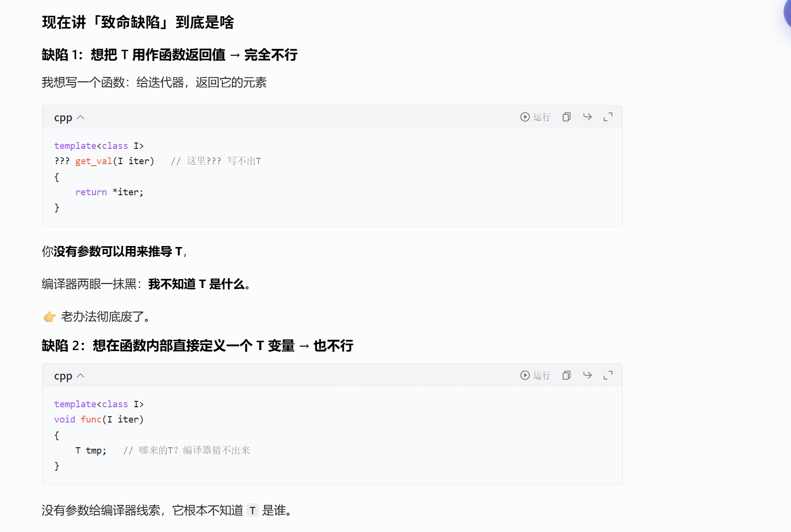

# 迭代器

## 概述

这三张PPT是在讲 **C++ 中迭代器（Iterators）** 的核心概念、作用和实际用法，我帮你拆成「是什么-为什么-怎么用」三部分讲清楚👇

---

### 第一张图：迭代器到底是什么？（核心思想）

这张图用3个要点，讲清了迭代器的本质：

1.  **「屏蔽细节，统一访问」**
    它提供了一种**按顺序访问容器元素**的方法，但你完全不需要关心容器的内部实现细节（比如`vector`是连续数组、`list`是链表）。
    你只需要用迭代器的统一操作（比如`++`、`*`、`!=`），就能遍历任何容器的元素。

2.  **「容器和算法解耦」**
    迭代器是容器和算法之间的「桥梁」。
    算法（比如查找、排序）只需要和迭代器打交道，不需要知道容器的具体类型。这样同一个算法，就能适配所有支持迭代器的容器，不用重复写多份代码。

3.  **「一种设计模式」**
    迭代器本身就是经典的**迭代器设计模式**：目的是「顺序访问聚合对象（容器）的元素，同时不暴露对象的内部结构」。

---

### 第二张图：用`std::find`看迭代器的「解耦魔力」

这张图是标准库中`std::find`算法的简化实现，它完美体现了迭代器的通用性：

```cpp
template <class InputIterator, class T>
InputIterator find(InputIterator first,
                   InputIterator last,
                   const T &value)
{
    while (first!=last && *first!=value)
        ++first;
    return first;
}
```

- 这是一个**模板函数**，模板参数`InputIterator`可以是任何「满足输入迭代器要求」的类型（不管是`vector`的迭代器，还是`list`的迭代器，甚至是你自己写的容器的迭代器）。
- 算法逻辑只依赖迭代器的统一操作：
  - `first != last`：判断是否遍历到容器末尾
  - `*first`：获取迭代器指向的元素值
  - `++first`：让迭代器移动到下一个元素
- 所以这个`find`函数，**天生就能适配所有容器**，不用为`vector`和`list`分别写版本。

---

### 第三张图：迭代器的实际使用示例

这张图展示了同一个`find`算法，如何同时用于`vector`和`list`两种完全不同的容器：

```cpp
// 1. 定义两种不同的容器
Vector<int> vecTemp;    // 动态数组容器
List<double> listTemp;  // 双向链表容器

// 2. 在vector中查找元素3
Vector<int>::Iterator fVecIter, lVecIter;
fVecIter = vecTemp.begin();  // 指向第一个元素的迭代器
lVecIter = vecTemp.end();    // 指向「末尾元素的下一个位置」的迭代器
fVecIter = find(fVecIter, lVecIter, 3);  // 调用同一个find函数
if (fVecIter == lVecIter)  // 如果没找到，find会返回end()
    cout<<"3 not found in vecTemp"<<endl;

// 3. 在list中查找元素3.0
List<double>::Iterator fListIter, lListIter;
fListIter = listTemp.begin();
lListIter = listTemp.end();
fListIter = find(fListIter, lListIter, 3.0);  // 还是同一个find函数！
```

- 关键在于：`vector`和`list`的底层实现完全不同，但它们的迭代器都提供了`begin()`/`end()`、`++`、`*`这些统一接口，所以同一个`find`算法能直接复用。
- 你只需要声明对应容器的迭代器类型（比如`Vector<int>::Iterator`），就能无缝使用所有标准算法。

---

### 一句话总结

这三张PPT讲的是：**迭代器是C++中「容器」和「算法」之间的通用接口，它屏蔽了容器的实现细节，让算法可以一次编写、处处复用**。

## 本质与工作原理

这组PPT是在**从底层实现的角度，讲清楚C++迭代器（Iterators）的本质和工作原理**，而且用了一个完整的「手写链表+迭代器」案例，把之前讲的“迭代器是容器和算法的桥梁”从概念落地到代码。我帮你按顺序拆解：

---

### 1. 铺垫：`auto_ptr`——迭代器的“指针模拟”示例

第一张图的`auto_ptr`不是重点，它是个**运算符重载的例子**，帮你理解“迭代器为什么要重载`*`和`->`”：

```cpp
template<class T> class auto_ptr {
    T *pointee; // 内部持有一个裸指针
public:
    explicit auto_ptr(T *p) { pointee = p; }
    // 重载解引用运算符*，让auto_ptr可以像普通指针一样用*取值
    T& operator *() { return *pointee; }
    // 重载箭头运算符->，让auto_ptr可以用->访问成员
    T* operator ->() { return pointee; }
    // 还有拷贝构造、赋值运算符，实现指针所有权转移（auto_ptr的特性）
};
```

- 这行代码的核心是：**用一个类，通过重载`*`和`->`，模拟出和裸指针完全一样的使用体验**。
- 迭代器的本质，就是做这件事：不管容器内部是什么结构，迭代器都要“伪装成指针”，让算法用统一的方式操作它。

---

### 2. 迭代器的核心定义（第二张图）

这张图把迭代器的本质讲透了，刚好和上面的`auto_ptr`呼应：

- ✅ **算法的统一接口**：不管是`vector`还是`list`，算法只需要和迭代器打交道，不用管容器内部细节。
- ✅ **像容器元素的指针**：迭代器就是容器元素的“指针替身”，用起来和普通指针一样。
- ✅ **支持`++`顺序访问**：重载自增运算符，实现“下一个元素”的逻辑（比如链表的迭代器，`++`就是跳转到`next`节点）。
- ✅ **支持`*`访问元素**：重载解引用运算符，拿到迭代器指向的元素值。

---

### 3. 实战：手写一个链表容器（第三张图）

要做迭代器，得先有容器本身。这张图先定义了一个简单的单链表结构：

- **`ListItem<T>`（链表节点）**：
  - 内部有`_value`（存储的数据）和`_next`（指向下一个节点的指针）
  - 提供`value()`和`next()`方法，让外部可以访问数据和下一个节点
- **`List<T>`（链表容器）**：
  - 持有头节点`front`、尾节点`end`和大小`_size`
  - 提供插入、删除等容器操作（图里只写了接口声明）

---

### 4. 核心：手写链表迭代器`ListIter`（第四张图）

这张是整个PPT的灵魂，展示了**迭代器的底层实现逻辑**：

```cpp
template<class Item>
class ListIter {
    Item *ptr; // 内部持有一个指向链表节点的裸指针
public:
    // 构造函数：让迭代器指向指定的节点
    ListIter(Item *p=0) : ptr(p) {}

    // 重载++：让迭代器移动到下一个节点（实现“顺序访问”）
    ListIter<Item> operator++() {
        ptr = ptr->next; // 直接用节点的next指针跳转
        return *this;
    }

    // 重载*：解引用，拿到节点里存储的元素
    Item& operator*() { return *ptr; }

    // 重载->：箭头运算符，让迭代器可以直接访问节点的成员
    Item* operator->() { return ptr; }
};
```

- 这个`ListIter`就是个“套壳的裸指针”，通过重载运算符，把链表节点的跳转逻辑封装起来了。
- 比如`++iter`，普通指针的`++`是地址+1，但链表迭代器的`++`是`ptr = ptr->next`，完美适配链表的结构。

---

### 5. 最终效果：迭代器和通用算法配合（第五张图）

最后这张图，验证了我们手写的迭代器，能和之前讲的通用`find`算法无缝配合：

```cpp
List<int> myList; // 我们自己写的链表容器
// 定义迭代器begin和end，分别指向链表的开头和末尾
ListIter<ListItem<int>> begin(myList.begin());
ListIter<ListItem<int>> end(myList.end());

// 直接用通用的find算法查找元素3！
iter = find(begin, end, 3);
if (iter == end) cout << "not found" << endl;
```

- 重点来了：这个`find`算法，既可以用在`vector`的迭代器上，也可以用在我们手写的`ListIter`上！
- 因为我们的`ListIter`满足了迭代器的统一接口：支持`++`、`*`、`!=`，所以通用算法根本不需要知道它是哪个容器的迭代器，直接就能用。

---

### 一句话总结

这组PPT的逻辑链是：

1.  迭代器的核心是「模拟指针行为」，让不同容器对外提供统一接口；
2.  先通过`auto_ptr`演示怎么重载运算符模拟指针；
3.  再从0实现一个链表容器，然后为它写一个迭代器；
4.  最后验证这个迭代器能和通用算法配合，实现“容器和算法解耦”。

## 迭代器萃取

这组PPT讲的是**C++迭代器萃取（Iterator Traits）的起源和核心思想**，解决的是「通用算法里，怎么从迭代器类型里拿到它指向的元素类型」这个关键问题，我顺着逻辑链给你拆得明明白白👇

---

## 1. 先看痛点：算法里的“未知类型”难题（第一张图）

你要写一个通用的交换函数`myswap`，接收两个迭代器`i`和`j`，交换它们指向的元素：

```cpp
template <typename Iterator>
void myswap(Iterator i, Iterator j)
{
    ??? temp = *i;  // 这里的???该写什么类型？
    *i = *j;
    *j = temp;
}
```

- 问题来了：模板参数是`Iterator`，但你**只知道迭代器的类型，不知道它指向的元素是什么类型**（比如`vector<int>::iterator`指向的是`int`，`list<double>::iterator`指向的是`double`）。
- 所以你没法声明临时变量`temp`的类型，这就是迭代器关联类型的核心痛点。

---

## 2. 临时方案：用额外参数“绕路”推导类型（第二、三张图）

为了拿到元素类型`T`，PPT里用了一个“曲线救国”的方法：

```cpp
// 第一步：写一个辅助函数，多传一个参数来推导T
template <class I, class T>
void myswap_impl(I i, I j, T v)
{
    T tmp;  // 现在T能被推导出来了！
    tmp = *i;
    *i = *j;
    *j = tmp;
}

// 第二步：写一个包装函数，把*i传进去，让编译器推导T
template <class I>
void myswap(I i, I j)
{
    myswap_impl(i, j, *i); // *i的类型会被推导为T
}
```

- 原理：调用`myswap_impl`时，`*i`的类型会被编译器自动推导，从而得到`T`的类型，这样就能声明`T tmp`了。
- 但这种方法有个致命缺陷：**只能靠函数参数推导类型，没法在返回值、类成员里直接使用**，通用性很差。

---

## 3. 暴露局限：这种方案不够通用（第四张图）

PPT里举了个反例，说明参数推导的局限：

```cpp
template <class I>
void func(I iter)
{
    func_impl(iter, *iter); // 只能在函数参数里推导T
    // 但如果我想让func返回T类型的值？根本做不到！
}
```

- 问题：这种方式只能在**函数调用的参数列表**里推导类型，一旦你需要用`T`作为返回值、类成员变量，就完全失效了。
- 结论：我们需要一种更通用的方法，让迭代器本身“携带”类型信息，而不是靠外部参数推导。

---

## 4. 核心解法：Traits Trick——给迭代器加内嵌类型（第五、六张图）

这就是迭代器萃取的核心思路：**在迭代器类里，把元素类型定义为内嵌类型（Nested Type）**，让迭代器自己携带类型信息。

### 第一步：改造迭代器，加入`value_type`

```cpp
template <class T>
struct myIter {
    typedef T value_type; // 关键！把元素类型T定义为内嵌类型
    T* ptr;
    myIter(T *p = 0):ptr(p) {}
    T& operator*() { return *ptr; }
};
```

- 这里的`typedef T value_type;`就是关键：把迭代器指向的元素类型`T`，作为迭代器类的一个内嵌类型，命名为`value_type`。
- 现在，只要你拿到迭代器类型`I`，就能通过`I::value_type`拿到它指向的元素类型。

### 第二步：在算法里直接使用内嵌类型

```cpp
// 现在可以直接用I::value_type作为返回值了！
template <class I>
typename I::value_type func(I iter)
{
    return *iter;
}

// 使用示例
myIter<int> iter(new int(8));
cout << func(iter); // 输出8，完全正常
```

- 这里的`typename`是必须的：因为`I::value_type`依赖模板参数`I`，编译器一开始不知道`value_type`是类型还是成员变量，所以要用`typename`显式告诉编译器“这是个类型名”。

---

## 5. 一句话总结这组PPT的逻辑

1.  **问题**：通用算法只拿到迭代器，没法知道它指向的元素类型，无法声明变量或返回值。
2.  **临时方案**：用额外参数推导类型，但通用性差。
3.  **根本解决**：给迭代器加内嵌类型`value_type`，让迭代器本身携带类型信息，算法可以直接通过`Iterator::value_type`获取元素类型，这就是**迭代器萃取（Iterator Traits）**的雏形。

---

## 💡 补充：这就是C++标准库`iterator_traits`的起源

你现在看到的，就是标准库`std::iterator_traits`的核心思想：

- 标准库给所有迭代器都定义了内嵌类型（`value_type`、`difference_type`、`pointer`、`reference`、`iterator_category`）。
- `iterator_traits`是一个模板结构体，专门用来萃取这些内嵌类型，甚至还特化了原生指针（因为原生指针没有内嵌类型，`traits`会把它当成随机访问迭代器处理）。



## 还可以进化

我来顺着你之前学的内容，把这组PPT的逻辑**从头到尾串起来讲透**，你会发现它完美解决了我们之前遇到的所有痛点👇

---

## 一、先回顾：我们之前的“typedef trick”是什么？

我们之前为了让算法拿到迭代器的元素类型，给自定义迭代器类加了一个内嵌的类型定义：

```cpp
template <class T>
struct myIter {
    typedef T value_type; // 内嵌typedef，携带元素类型信息
    T* ptr;
    // ... 其他迭代器实现
};
```

这样算法里就可以用 `I::value_type` 拿到元素类型了。

---

## 二、第一张PPT：这个方案的致命缺陷！

PPT里说：
> It can not support `int*`, `double*` to be the iterator, which slow down the STL program.

### 大白话翻译：

**原生指针（比如`int*`、`double*`）没法用这个方案！**

- 原生指针本身不是类，没有内嵌的 `typedef value_type`。
- 但在STL里，原生指针本身就是一种**迭代器**（比如数组的指针，就是“随机访问迭代器”），我们希望STL算法（比如`std::find`、`std::sort`）能同时支持容器迭代器和原生指针，比如：

  ```cpp
  int arr[] = {1,2,3};
  std::find(arr, arr+3, 2); // arr是int*，我们希望它能像迭代器一样被处理
  ```

- 如果不支持原生指针，STL的通用性就大打折扣，性能也会受影响（原生指针是最高效的迭代器）。

这就是我们之前的“typedef trick”的死穴：**只能支持自定义迭代器类，没法兼容原生指针**。

---

## 三、第二张PPT：技术铺垫——模板偏特化（Partial Specialization）

为了解决上面的问题，我们需要用到C++的**模板偏特化**技术。PPT里给了一个简单例子：

```cpp
// 通用版本：处理任意类型T
template<class T>
class C {
public:
    C() { cout << "template T" << endl; }
};

// 偏特化版本：专门处理T*（指针类型）
template<class T>
class C<T*> {
public:
    C() { cout << "template T*" << endl; }
};
```

### 什么是偏特化？

就是**对模板的一部分情况做“特殊处理”**：

- 当你实例化 `C<int>` 时，会匹配通用版本；
- 当你实例化 `C<int*>` 时，会匹配专门的偏特化版本。

这个技术，就是我们解决原生指针问题的关键。

---

## 四、第三张PPT：核心解法——`iterator_traits`（迭代器萃取）

我们引入一个中间层模板类 `iterator_traits`，用偏特化同时兼容自定义迭代器和原生指针：

```cpp
// 1. 通用版本：处理自定义迭代器类
template<class I>
class iterator_traits {
public:
    // 直接萃取迭代器类里的内嵌typedef
    typedef typename I::value_type value_type;
    typedef typename I::pointer_type pointer_type;
    // ... 其他关联类型
};

// 2. 偏特化版本：专门处理原生指针T*
template<class T>
class iterator_traits<T*> {
public:
    // 原生指针没有内嵌typedef，我们直接把T作为value_type
    typedef T value_type;
    typedef T* pointer_type;
    // ... 其他关联类型
};
```

### 它怎么解决问题？

- 对于自定义迭代器（比如 `myIter<int>`）：匹配通用版本，通过 `I::value_type` 拿到 `int`；
- 对于原生指针（比如 `int*`）：匹配偏特化版本，直接把 `T=int` 作为 `value_type`。

现在，不管是哪种迭代器，算法里都可以用 `iterator_traits<I>::value_type` 拿到正确的元素类型了！

---

## 五、第四张PPT：STL标准的`iterator_traits`完整实现

标准库的 `std::iterator_traits` 不止萃取 `value_type`，还会萃取迭代器的所有关联类型：

```cpp
template<class I>
class iterator_traits {
public:
    typedef typename I::iterator_category iterator_category; // 迭代器类型（输入/双向/随机访问等）
    typedef typename I::value_type value_type;              // 元素类型
    typedef typename I::difference_type difference_type;    // 两个迭代器的差值类型（ptrdiff_t）
    typedef typename I::pointer pointer_type;               // 元素的指针类型
    typedef typename I::reference reference;                // 元素的引用类型
};
```

这些类型都是STL算法需要的：

- 比如 `std::advance` 会根据 `iterator_category` 选择最优实现：随机访问迭代器直接 `+=n`（O(1)），双向迭代器只能循环`++`（O(n)）；
- `std::distance` 会用 `difference_type` 存储两个迭代器的差值。

---

## 六、第五张PPT：对比一下，现在的方案有多强？

之前的 `func` 函数只能支持自定义迭代器：

```cpp
template <class I>
typename I::value_type func(I iter) { // 不支持int*！
    return *iter;
}
```

现在用 `iterator_traits` 改造后，就可以同时支持自定义迭代器和原生指针了：

```cpp
template <class I>
typename iterator_traits<I>::value_type func(I iter) { // 自定义迭代器 + 原生指针都支持！
    return *iter;
}

// 两种用法都可以：
myIter<int> iter1(new int(8));
func(iter1); // 支持自定义迭代器

int* iter2 = new int(9);
func(iter2); // 也支持原生指针！
```

---

## 一句话总结这组PPT的逻辑

1.  **问题**：内嵌`typedef`的方案没法兼容原生指针，通用性差；
2.  **技术**：用模板偏特化，给原生指针写专门的处理版本；
3.  **解法**：引入`iterator_traits`中间层，同时兼容自定义迭代器和原生指针；
4.  **标准库实现**：STL的`iterator_traits`会萃取迭代器的所有关联类型，供算法使用。
